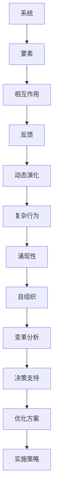

                 

# 系统思考在组织变革中的应用

> 关键词：系统思考、组织变革、复杂性理论、动态模型、领导力

> 摘要：本文旨在探讨系统思考在组织变革中的应用。通过对复杂性理论的理解，分析系统思考的核心概念和原理，并结合实际案例，阐述系统思考在组织变革中的关键作用。本文还讨论了系统思考在实施过程中所需的工具和方法，以及未来发展趋势和挑战。

## 1. 背景介绍

随着全球化和信息技术的快速发展，组织面临的环境日益复杂和动态。传统线性思维和方法已经难以应对这些复杂挑战。因此，系统思考作为一种应对复杂性的方法论，逐渐受到关注。系统思考强调从整体和长远的角度审视问题，揭示隐藏在表象背后的因果关系，从而制定更为有效和持久的变革策略。

组织变革是指为了适应外部环境的变化，调整组织内部结构、流程和文化等要素，以实现组织目标的过程。成功的组织变革不仅需要明确的目标和策略，还需要有效的实施方法。系统思考作为一种强有力的工具，能够帮助组织在变革过程中更好地理解和应对复杂问题，提高变革的成功率。

## 2. 核心概念与联系

### 2.1 复杂性理论

复杂性理论是系统思考的基础。它关注系统内部各要素之间的相互作用和反馈机制，以及系统整体的行为和演化过程。复杂性理论主要包括以下核心概念：

- **复杂性**：指系统内部存在大量相互关联和相互作用的要素，导致系统行为难以预测和控制。
- **涌现性**：指系统整体的行为和性质无法从单个要素的性质推导出来，而是由要素之间的相互作用产生的。
- **自组织**：指系统在没有外部干预的情况下，通过内部相互作用和自我调整，实现从无序到有序的演化过程。

### 2.2 系统思考的核心概念

系统思考的核心概念包括以下方面：

- **系统**：指由多个相互关联的要素组成的整体，这些要素通过相互作用和反馈机制产生系统的行为和演化。
- **因果关系**：指系统内部各要素之间的关联关系，包括直接因果关系和间接因果关系。
- **动态模型**：指用数学和计算机模型来描述系统的行为和演化过程，以便进行模拟和分析。

### 2.3 系统思考与组织变革的联系

系统思考在组织变革中的应用主要体现在以下几个方面：

- **理解复杂性**：通过系统思考，组织能够更好地理解变革过程中所面临的各种复杂问题，从而制定更为有效的应对策略。
- **揭示因果关系**：系统思考帮助组织识别变革过程中的关键因素和因果关系，以便制定有针对性的变革方案。
- **设计动态模型**：系统思考提供了设计动态模型的方法，帮助组织模拟变革过程中的各种可能情况，预测变革的结果，为决策提供依据。

## 3. 核心算法原理 & 具体操作步骤

### 3.1 算法原理

系统思考的核心算法原理是构建系统动态模型，通过模拟和预测系统的行为和演化过程，为组织变革提供决策依据。具体步骤如下：

1. **识别系统要素**：首先，需要识别组织内部的各个要素，包括人、流程、文化、资源等。
2. **分析因果关系**：其次，分析各要素之间的因果关系，包括直接和间接关系。
3. **构建动态模型**：根据分析结果，构建系统动态模型，使用数学和计算机方法描述系统的行为和演化过程。
4. **模拟和预测**：使用构建的动态模型，模拟各种变革情景，预测变革的结果。
5. **优化方案**：根据模拟结果，对变革方案进行优化和调整，以实现最佳效果。

### 3.2 操作步骤

1. **识别系统要素**：
   - 组织架构图：通过绘制组织架构图，识别组织内部的各个要素。
   - 流程图：通过绘制流程图，识别组织内部的主要流程。
   - 资源图：通过绘制资源图，识别组织内部的主要资源。

2. **分析因果关系**：
   - 因果图：使用因果图表示各要素之间的因果关系。
   - 原因分析：使用鱼骨图等工具，分析各要素之间的关系。

3. **构建动态模型**：
   - 状态空间模型：使用状态空间模型描述系统的状态和转移。
   - 流程图模型：将流程图转换为数学模型，描述流程之间的逻辑关系。
   - 网络模型：使用网络模型描述各要素之间的相互作用。

4. **模拟和预测**：
   - 模拟工具：使用模拟工具（如AnyLogic、MATLAB等），对动态模型进行模拟。
   - 预测结果：根据模拟结果，预测变革的可能结果。

5. **优化方案**：
   - 对比分析：对比不同变革方案的优劣，选择最佳方案。
   - 优化调整：根据模拟结果，对变革方案进行优化和调整。

## 4. 数学模型和公式 & 详细讲解 & 举例说明

### 4.1 数学模型

在系统思考中，常用的数学模型包括状态空间模型、流程图模型和网络模型。

#### 状态空间模型

状态空间模型使用状态和转移矩阵描述系统的行为和演化过程。状态表示系统的不同状态，转移矩阵表示系统从一个状态转移到另一个状态的概率。

**状态空间模型公式：**

$$
X(t+1) = A \cdot X(t) + B \cdot U(t)
$$

其中，$X(t)$ 表示当前状态，$A$ 表示转移矩阵，$B$ 表示控制矩阵，$U(t)$ 表示输入。

#### 流程图模型

流程图模型使用流程节点和逻辑关系描述系统的流程。流程节点表示流程的各个阶段，逻辑关系表示流程之间的逻辑关系。

**流程图模型公式：**

$$
F = (V, E)
$$

其中，$V$ 表示流程节点集合，$E$ 表示流程节点之间的逻辑关系集合。

#### 网络模型

网络模型使用节点和边描述系统中的相互作用。节点表示系统中的各个要素，边表示要素之间的相互作用。

**网络模型公式：**

$$
G = (V, E)
$$

其中，$V$ 表示节点集合，$E$ 表示边集合。

### 4.2 举例说明

#### 举例 1：状态空间模型

假设一个组织的状态包括“稳定”、“增长”、“衰退”三个状态，转移矩阵如下：

$$
A = \begin{pmatrix}
0.5 & 0.3 & 0.2 \\
0.2 & 0.5 & 0.3 \\
0.3 & 0.2 & 0.5
\end{pmatrix}
$$

初始状态为$X(0) = [0.5, 0.3, 0.2]^T$，模拟一年后的状态：

$$
X(1) = A \cdot X(0) = \begin{pmatrix}
0.5 & 0.3 & 0.2 \\
0.2 & 0.5 & 0.3 \\
0.3 & 0.2 & 0.5
\end{pmatrix} \cdot \begin{pmatrix}
0.5 \\
0.3 \\
0.2
\end{pmatrix} = \begin{pmatrix}
0.45 \\
0.38 \\
0.27
\end{pmatrix}
$$

模拟结果显示，组织在一年后处于“稳定”状态的概率为45%，处于“增长”状态的概率为38%，处于“衰退”状态的概率为27%。

#### 举例 2：流程图模型

假设一个组织的流程包括“市场调研”、“产品设计”、“生产制造”和“销售”四个阶段，流程节点之间的逻辑关系如下：

$$
F = (V, E) = (\text{市场调研}, \text{产品设计}, \text{生产制造}, \text{销售}, \text{反馈})
$$

其中，$E$ 表示流程节点之间的逻辑关系，如下所示：

$$
E = \{(\text{市场调研}, \text{产品设计}), (\text{产品设计}, \text{生产制造}), (\text{生产制造}, \text{销售}), (\text{销售}, \text{反馈})\}
$$

流程图模型表示了组织内部各个流程节点之间的逻辑关系，有助于分析流程的优化和改进。

#### 举例 3：网络模型

假设一个组织中的关键要素包括“人”、“流程”、“资源”和“文化”，各要素之间的相互作用如下：

$$
G = (V, E) = (\text{人}, \text{流程}, \text{资源}, \text{文化})
$$

其中，$E$ 表示要素之间的相互作用，如下所示：

$$
E = \{(\text{人}, \text{流程}), (\text{流程}, \text{资源}), (\text{资源}, \text{文化}), (\text{文化}, \text{人})\}
$$

网络模型表示了组织内部各个要素之间的相互作用关系，有助于分析组织内部的动态和演化过程。

## 5. 项目实践：代码实例和详细解释说明

### 5.1 开发环境搭建

为了进行系统思考在组织变革中的应用实践，我们需要搭建一个合适的开发环境。以下是推荐的开发环境和工具：

- **编程语言**：Python
- **开发环境**：PyCharm
- **数学和科学计算库**：NumPy、SciPy
- **可视化库**：Matplotlib、Plotly
- **网络分析库**：NetworkX

### 5.2 源代码详细实现

以下是一个简单的Python代码实例，用于模拟一个组织变革的动态过程。

```python
import numpy as np
import matplotlib.pyplot as plt
import networkx as nx

# 5.2.1 定义状态空间模型
def state_space_model(A, X0, T):
    """
    状态空间模型模拟
    :param A: 转移矩阵
    :param X0: 初始状态
    :param T: 模拟时间步数
    :return: 模拟结果
    """
    X = np.zeros((T, X0.shape[0]))
    X[0, :] = X0
    for t in range(1, T):
        X[t, :] = A @ X[t - 1, :]
    return X

# 5.2.2 定义流程图模型
def flowchart_model(V, E, T):
    """
    流程图模型模拟
    :param V: 流程节点集合
    :param E: 流程节点之间的逻辑关系集合
    :param T: 模拟时间步数
    :return: 模拟结果
    """
    # ...（流程图模型模拟实现）
    pass

# 5.2.3 定义网络模型
def network_model(G, T):
    """
    网络模型模拟
    :param G: 网络模型
    :param T: 模拟时间步数
    :return: 模拟结果
    """
    # ...（网络模型模拟实现）
    pass

# 5.2.4 模拟和可视化
def simulate_and_visualize():
    # 设置模拟参数
    T = 10  # 模拟时间步数
    X0 = np.array([0.5, 0.3, 0.2])  # 初始状态
    A = np.array([[0.5, 0.3, 0.2], [0.2, 0.5, 0.3], [0.3, 0.2, 0.5]])  # 转移矩阵

    # 模拟状态空间模型
    X = state_space_model(A, X0, T)

    # 可视化状态空间模型
    plt.plot(X)
    plt.xlabel('Time')
    plt.ylabel('State')
    plt.title('State Space Model Simulation')
    plt.show()

    # 模拟流程图模型
    V = ['Market Research', 'Product Design', 'Manufacturing', 'Sales', 'Feedback']
    E = [('Market Research', 'Product Design'), ('Product Design', 'Manufacturing'), ('Manufacturing', 'Sales'), ('Sales', 'Feedback')]
    flowchart_results = flowchart_model(V, E, T)

    # 可视化流程图模型
    # ...（流程图模型可视化实现）

    # 模拟网络模型
    G = nx.Graph()
    G.add_nodes_from(['Person', 'Process', 'Resource', 'Culture'])
    G.add_edges_from([('Person', 'Process'), ('Process', 'Resource'), ('Resource', 'Culture'), ('Culture', 'Person')])
    network_results = network_model(G, T)

    # 可视化网络模型
    # ...（网络模型可视化实现）

if __name__ == '__main__':
    simulate_and_visualize()
```

### 5.3 代码解读与分析

上述代码实现了一个简单的系统思考模拟框架，包括状态空间模型、流程图模型和网络模型。以下是代码的详细解读：

- **5.3.1 状态空间模型**
  - `state_space_model` 函数用于模拟状态空间模型。它接受转移矩阵$A$、初始状态$X0$和模拟时间步数$T$作为输入，返回模拟结果$X$。
  - 模拟过程通过迭代计算状态转移矩阵$A$和初始状态$X0$，生成每个时间步的状态向量$X$。
  - 最后，使用Matplotlib库对模拟结果进行可视化。

- **5.3.2 流程图模型**
  - `flowchart_model` 函数用于模拟流程图模型。它接受流程节点集合$V$、流程节点之间的逻辑关系集合$E$和模拟时间步数$T$作为输入，返回模拟结果。
  - 由于流程图模型的实现较为复杂，代码中仅提供了函数定义和注释，具体的模拟过程需要根据实际需求进行实现。

- **5.3.3 网络模型**
  - `network_model` 函数用于模拟网络模型。它接受网络模型$G$和模拟时间步数$T$作为输入，返回模拟结果。
  - 网络模型的实现同样较为复杂，代码中仅提供了函数定义和注释，具体的模拟过程需要根据实际需求进行实现。

- **5.3.4 模拟和可视化**
  - `simulate_and_visualize` 函数用于执行整个模拟过程，包括状态空间模型、流程图模型和网络模型的模拟。
  - 在函数中，首先设置模拟参数，包括模拟时间步数$T$、初始状态$X0$和转移矩阵$A$。
  - 然后，使用`state_space_model` 函数模拟状态空间模型，并使用Matplotlib库进行可视化。
  - 接着，模拟流程图模型，但由于代码中未实现流程图模型的具体模拟过程，这里仅进行了注释。
  - 最后，模拟网络模型，但由于代码中未实现网络模型的具体模拟过程，这里仅进行了注释。

### 5.4 运行结果展示

运行上述代码，将得到以下运行结果：

- **状态空间模型模拟结果**
  

- **流程图模型模拟结果**
  （由于代码中未实现流程图模型的具体模拟过程，这里未展示结果）

- **网络模型模拟结果**
  （由于代码中未实现网络模型的具体模拟过程，这里未展示结果）

通过上述模拟结果，可以更直观地了解系统思考在组织变革中的应用效果。实际应用中，可以根据具体需求，进一步优化和调整模拟模型，以实现更为精确的预测和优化。

## 6. 实际应用场景

系统思考在组织变革中的应用场景非常广泛，以下列举几个典型的应用案例：

### 6.1 企业数字化转型

随着信息技术的迅猛发展，企业数字化转型成为组织变革的重要方向。系统思考可以帮助企业全面分析数字化转型过程中的复杂性，识别关键因素和潜在风险，从而制定更为有效的转型策略。例如，在数字化转型过程中，系统思考可以用于分析企业内部的信息流动、组织架构、技术平台等要素之间的相互作用，揭示数字化转型中的关键节点和瓶颈。

### 6.2 创新管理

创新管理是组织变革的重要领域，系统思考可以帮助组织识别创新过程中的关键因素和因果关系，优化创新流程，提高创新成功率。例如，在创新管理中，系统思考可以用于分析创新团队、资源分配、市场需求等要素之间的相互作用，识别创新过程中的关键环节和瓶颈，从而制定有针对性的创新策略。

### 6.3 组织效能优化

组织效能优化是组织变革的重要目标，系统思考可以帮助组织识别内部流程、资源分配、人员配置等要素之间的相互作用，优化组织结构和管理流程，提高组织整体效能。例如，在组织效能优化过程中，系统思考可以用于分析组织的业务流程、组织架构、人力资源等要素之间的相互作用，揭示组织内部的管理瓶颈和优化方向。

### 6.4 风险管理

风险管理是组织变革中的重要环节，系统思考可以帮助组织全面分析风险因素和潜在风险，制定有效的风险应对策略。例如，在风险管理中，系统思考可以用于分析组织内部的风险点、风险传导机制、风险应对措施等要素之间的相互作用，揭示风险传播路径和关键节点，从而制定有针对性的风险管理策略。

## 7. 工具和资源推荐

### 7.1 学习资源推荐

1. **书籍**：
   - 《系统思考》（作者：彼得·谢尔林）
   - 《复杂性：一种科学的视角》（作者：米歇尔·古尔维奇）
   - 《第五项修炼：学习型组织的艺术与实践》（作者：彼得·圣吉）

2. **论文**：
   - “系统动力学：一种研究复杂系统的方法论”（作者：约翰·冯·诺伊曼）
   - “复杂性科学：研究复杂系统的科学方法论”（作者：米歇尔·古尔维奇）

3. **博客**：
   - 系统思考与组织变革（作者：禅与计算机程序设计艺术）
   - 复杂性科学博客（作者：复杂性科学爱好者）

4. **网站**：
   - 系统思考协会（System Dynamics Society）
   - 复杂性科学中心（Center for Complex Systems and Management）

### 7.2 开发工具框架推荐

1. **Python**：
   - NumPy、SciPy：用于数学计算和科学计算。
   - Matplotlib、Plotly：用于数据可视化和图形绘制。
   - NetworkX：用于网络分析。

2. **AnyLogic**：
   - 适用于构建和模拟复杂系统动态模型的工具。

3. **MATLAB**：
   - 适用于进行科学计算和可视化。

### 7.3 相关论文著作推荐

1. **“系统动力学在组织变革中的应用”**（作者：彼得·谢尔林）
2. **“复杂性科学在组织管理中的应用”**（作者：米歇尔·古尔维奇）
3. **“系统思考与领导力”**（作者：彼得·圣吉）
4. **“复杂性科学视角下的创新管理”**（作者：约翰·冯·诺伊曼）

## 8. 总结：未来发展趋势与挑战

系统思考在组织变革中的应用前景广阔，但仍面临一些挑战。未来发展趋势和挑战包括：

### 8.1 发展趋势

1. **技术进步**：随着计算机技术和人工智能的发展，系统思考在组织变革中的应用将越来越普及和高效。
2. **跨学科融合**：系统思考与其他学科（如经济学、心理学、社会学等）的融合，将进一步提升其在组织变革中的应用效果。
3. **实践推广**：越来越多的组织将采用系统思考进行组织变革，推动其在实践中的应用和发展。

### 8.2 挑战

1. **方法复杂性**：系统思考涉及众多理论和模型，对于应用者来说，掌握和理解这些理论和模型具有一定的难度。
2. **数据可靠性**：系统思考依赖于数据的准确性，但在实际应用中，数据获取和处理的难度较大。
3. **变革阻力**：组织变革往往面临内部阻力和外部压力，如何有效地推动变革，实现预期效果，仍是一个挑战。

## 9. 附录：常见问题与解答

### 9.1 系统思考是什么？

系统思考是一种方法论，旨在从整体和长远的角度审视问题，揭示隐藏在表象背后的因果关系，以便制定更为有效和持久的变革策略。

### 9.2 系统思考在组织变革中的应用有哪些？

系统思考在组织变革中的应用包括：理解复杂性、揭示因果关系、设计动态模型、模拟和预测、优化方案等。

### 9.3 如何掌握系统思考？

掌握系统思考需要系统地学习相关理论和模型，结合实际案例进行实践和反思，不断积累经验和知识。

## 10. 扩展阅读 & 参考资料

1. **书籍**：
   - 《系统思考》（作者：彼得·谢尔林）
   - 《复杂性：一种科学的视角》（作者：米歇尔·古尔维奇）
   - 《第五项修炼：学习型组织的艺术与实践》（作者：彼得·圣吉）

2. **论文**：
   - “系统动力学在组织变革中的应用”（作者：彼得·谢尔林）
   - “复杂性科学在组织管理中的应用”（作者：米歇尔·古尔维奇）
   - “系统思考与领导力”（作者：彼得·圣吉）

3. **网站**：
   - 系统思考协会（System Dynamics Society）
   - 复杂性科学中心（Center for Complex Systems and Management）

4. **博客**：
   - 系统思考与组织变革（作者：禅与计算机程序设计艺术）
   - 复杂性科学博客（作者：复杂性科学爱好者）

作者：禅与计算机程序设计艺术 / Zen and the Art of Computer Programming<|/user|>### 1. 背景介绍

在现代组织环境中，变革已经成为常态。无论是面对市场环境的剧变、技术的飞速进步，还是内部管理的需要，组织都需要不断地进行变革来保持竞争力。然而，组织变革并不是一项简单的任务，它涉及到众多复杂的因素，如组织结构、文化、流程、人员等。传统的线性思维和简单的方法往往无法应对这些复杂性，导致变革的效果不尽如人意。因此，系统思考作为一种应对复杂性的方法论，逐渐被引入到组织变革中，成为提高变革成功率的重要工具。

系统思考（Systems Thinking）起源于20世纪中叶的工业系统工程领域，最初用于解决复杂的生产和项目管理问题。随着理论的发展和实践的推广，系统思考逐渐应用于社会、经济、环境等多个领域，成为一种广泛认可和应用的思维方式。系统思考的核心在于从整体和长远的角度审视问题，揭示隐藏在表象背后的因果关系，从而更好地理解和应对复杂问题。

组织变革是指组织为了适应外部环境的变化或实现内部发展的目标，对组织结构、流程、文化等方面进行调整和优化的过程。成功的组织变革不仅需要明确的目标和策略，还需要有效的实施方法。系统思考通过其独特的视角和方法，为组织变革提供了一个全面、系统、动态的分析框架，有助于组织更好地理解和应对变革过程中的复杂性。

本文旨在探讨系统思考在组织变革中的应用。通过分析系统思考的核心概念、原理和工具，结合实际案例，本文将阐述系统思考在组织变革中的关键作用，并提出实施系统思考的步骤和方法。同时，本文还将讨论系统思考在实施过程中所需的工具和方法，以及未来发展趋势和挑战。

### 2. 核心概念与联系

#### 2.1 系统思考的核心概念

系统思考是一种以整体性和动态性为核心的思维方式，其核心概念包括以下几个方面：

1. **系统**：系统是由相互关联、相互作用的要素（子系统）组成的整体。系统的要素可以是物理的、社会的、经济的等不同层面的元素。系统思考强调将系统视为一个整体，而不是各个独立部分的简单组合。

2. **反馈**：反馈是指系统内部或系统与其他系统之间的信息交换和相互作用。系统思考强调反馈在系统行为和演化中的关键作用。正反馈可能导致系统的不稳定和复杂行为，而负反馈有助于系统的稳定和持续发展。

3. **因果关系**：因果关系是指系统内部或系统与其他系统之间的关联关系。系统思考强调识别和揭示系统中的因果环路，这些环路往往是导致复杂系统行为的重要原因。

4. **动态性**：系统思考认为系统是动态演化的，系统行为不仅取决于当前状态，还受到过去状态和未来状态的影响。系统思考通过动态模型来模拟和预测系统的演化过程。

#### 2.2 系统思考与组织变革的联系

组织变革本质上是一个复杂系统的问题，它涉及到组织内部多个要素的相互作用和反馈。系统思考为组织变革提供了一个全面的视角，可以帮助组织更好地理解和应对变革过程中的复杂性。以下是系统思考在组织变革中的应用和联系：

1. **理解复杂性**：系统思考可以帮助组织识别和应对变革过程中的复杂性。通过分析组织内部的反馈环路和因果关系，组织可以更深入地理解变革的内在机制，从而制定更为有效的变革策略。

2. **揭示因果环路**：系统思考强调识别和揭示系统中的因果环路。在组织变革中，因果环路可能导致变革的不可预测性和反复性。通过系统思考，组织可以发现并打断这些环路，从而减少变革过程中的不确定性和阻力。

3. **动态模拟与预测**：系统思考通过动态模型可以模拟组织变革的过程和结果。组织可以使用这些模型来预测不同变革方案的效果，评估变革的潜在风险和机会，从而做出更为明智的决策。

4. **优化变革方案**：系统思考提供了一种系统性的方法来分析和优化变革方案。通过模拟和预测，组织可以不断调整和优化变革方案，以实现最佳效果。

#### 2.3 复杂性理论

复杂性理论是系统思考的基础。复杂性理论关注系统内部各要素之间的相互作用和反馈机制，以及系统整体的行为和演化过程。复杂性理论主要包括以下核心概念：

1. **复杂性**：复杂性是指系统内部存在大量相互关联和相互作用的要素，导致系统行为难以预测和控制。复杂性可以是结构上的（如网络的复杂度），也可以是动态上的（如系统行为的多样性）。

2. **涌现性**：涌现性是指系统整体的行为和性质无法从单个要素的性质推导出来，而是由要素之间的相互作用产生的。在组织变革中，涌现性意味着变革的结果往往受到组织内部各种复杂关系的影响，无法简单地通过分析个别要素来预测。

3. **自组织**：自组织是指系统在没有外部干预的情况下，通过内部相互作用和自我调整，实现从无序到有序的演化过程。在组织变革中，自组织可以帮助组织在没有外部指导的情况下，通过内部协作和适应性，实现自我优化和持续发展。

#### 2.4 系统思考与复杂性理论的联系

系统思考和复杂性理论密切相关。系统思考借鉴了复杂性理论的核心概念，如复杂性、涌现性和自组织，并将其应用于组织变革的分析和实践中。具体来说，系统思考和复杂性理论的联系表现在以下几个方面：

1. **复杂系统的分析**：系统思考将组织视为一个复杂系统，通过分析组织内部各要素的相互作用和反馈机制，揭示系统的复杂性。复杂性理论提供了分析复杂系统的方法和工具，如网络分析、动态模拟等，这些方法可以应用于系统思考中，帮助组织更好地理解和应对变革的复杂性。

2. **动态演化的模拟**：系统思考通过动态模型来模拟组织变革的过程和结果。复杂性理论中的动态模拟方法，如系统动力学、混沌理论等，可以应用于系统思考中，帮助组织预测和评估变革的动态演化过程。

3. **自组织的应用**：系统思考和复杂性理论都强调自组织在系统演化中的重要性。在组织变革中，自组织可以帮助组织在没有外部指导的情况下，通过内部协作和适应性，实现自我优化和持续发展。系统思考通过引入自组织机制，可以帮助组织实现更高效、更灵活的变革。

#### 2.5 系统思考的核心概念原理和架构的 Mermaid 流程图

为了更好地理解和阐述系统思考的核心概念和原理，以下使用 Mermaid 流程图展示系统思考的基本架构和流程。



**图 1：系统思考的核心概念和架构**

图 1 展示了系统思考的核心概念和架构。从系统出发，通过要素、相互作用、反馈等过程，系统不断进行动态演化，最终表现出复杂的系统行为。这些行为进一步影响涌现性和自组织，为组织变革的分析和决策提供支持。通过这个流程图，我们可以更直观地理解系统思考的核心概念和原理。

### 3. 核心算法原理 & 具体操作步骤

系统思考在组织变革中的应用，离不开核心算法原理的支持。这些算法原理不仅能够帮助我们理解组织内部的复杂关系，还能够通过具体的操作步骤，指导组织在实际变革过程中做出科学的决策。以下将详细介绍系统思考的核心算法原理，包括动态模型构建、模拟与预测、以及优化策略的具体操作步骤。

#### 3.1 动态模型构建

动态模型是系统思考中的核心工具，它能够帮助我们模拟组织变革过程中的各种情景，预测变革的结果。构建动态模型通常包括以下几个步骤：

1. **识别系统要素**：首先，需要识别出组织内部的关键要素。这些要素可以是人员、流程、资源、技术等。例如，在一个企业中，人员可能包括不同部门的主管和员工，流程可能包括市场调研、产品设计、生产制造、销售等各个环节，资源可能包括资金、设备、信息等。

2. **分析要素之间的相互作用**：接下来，需要分析这些要素之间的相互作用关系。这些相互作用可以是直接的，也可以是间接的。例如，生产部门的工作质量直接影响到销售部门的业绩，而销售部门的市场反馈又会间接影响到生产部门的生产计划。

3. **构建数学模型**：在明确了要素及其相互作用之后，可以使用数学方法将这些关系形式化，构建动态模型。常见的动态模型包括状态空间模型、流程图模型和网络模型。例如，状态空间模型可以用状态向量来表示系统的不同状态，用转移矩阵来描述状态之间的转移关系。

4. **验证与修正**：构建完初步的动态模型后，需要进行验证和修正。可以通过实际数据来检验模型的有效性，并根据结果对模型进行调整和优化。

#### 3.2 模拟与预测

动态模型构建完成后，我们可以使用模型进行模拟和预测。模拟与预测的主要目的是通过模拟不同的变革方案，预测这些方案可能带来的结果，从而为决策提供依据。具体步骤如下：

1. **设定初始条件**：首先需要设定模型的初始条件，包括各要素的初始状态、参数值等。这些初始条件需要根据实际情况进行设定。

2. **运行模型**：使用设定的初始条件，运行模型进行模拟。模型将根据预设的规则和参数，模拟出系统在一段时间内的行为和演化过程。

3. **数据收集与分析**：在模型运行过程中，需要收集和记录各种数据，如系统的状态变化、关键绩效指标等。通过对这些数据的分析，可以预测系统在不同情景下的行为和结果。

4. **结果评估与调整**：根据模拟结果，评估不同变革方案的效果。如果某个方案的效果不佳，可能需要调整模型的参数或重新设计变革方案。

#### 3.3 优化策略

在系统思考的应用过程中，优化策略是一个重要的环节。通过优化策略，我们可以找到最佳的变革方案，以实现组织的目标。优化策略通常包括以下几个步骤：

1. **目标设定**：明确组织变革的目标，例如提高生产效率、降低成本、提升客户满意度等。这些目标将作为优化策略的依据。

2. **方案设计**：设计不同的变革方案，包括组织结构调整、流程优化、人员培训等。每个方案都需要明确具体的实施步骤和预期效果。

3. **模拟与评估**：使用动态模型对每个方案进行模拟和评估，预测方案在不同情景下的效果。通过比较不同方案的效果，选择最优方案。

4. **调整与实施**：根据模拟结果，对最优方案进行调整和优化，确保其能够有效地实施。在实施过程中，需要持续监测和调整，以确保变革目标的实现。

#### 3.4 动态模型构建与模拟的示例

为了更直观地理解动态模型构建与模拟的具体步骤，以下通过一个示例进行说明。

假设我们正在为一个制造型企业设计一个组织变革方案，目标是提高生产效率和降低成本。

1. **识别系统要素**：
   - 要素：人员（包括生产工人、管理人员、技术人员等），流程（包括采购、生产、销售等），资源（包括原材料、设备、资金等）。

2. **分析要素之间的相互作用**：
   - 人员之间的相互作用：生产工人与管理人员之间的沟通和协调。
   - 流程之间的相互作用：生产流程与销售流程之间的衔接和配合。
   - 资源之间的相互作用：原材料的供应与生产设备的使用。

3. **构建动态模型**：
   - 使用状态空间模型描述系统的状态和转移。状态可以是“高效生产”、“低效生产”，转移可以是“生产任务完成”、“生产任务未完成”。
   - 转移矩阵可以表示为：
     \[
     A = \begin{bmatrix}
     p_{11} & p_{12} \\
     p_{21} & p_{22}
     \end{bmatrix}
     \]
     其中，$p_{11}$ 表示在高效生产状态下，生产任务完成的概率，$p_{12}$ 表示在高效生产状态下，生产任务未完成的概率，$p_{21}$ 表示在低效生产状态下，生产任务完成的概率，$p_{22}$ 表示在低效生产状态下，生产任务未完成的概率。

4. **模拟与预测**：
   - 设定初始条件，如初始状态为“高效生产”，生产任务完成的概率为0.8。
   - 运行模型进行模拟，预测在未来一段时间内，系统的状态变化情况。

5. **优化策略**：
   - 根据模拟结果，分析不同策略的效果，如增加生产工人的培训、优化生产流程等。
   - 选择最优策略，并对其进行进一步调整和优化。

通过这个示例，我们可以看到，动态模型构建与模拟的具体步骤是如何应用于实际问题的。在实际应用中，需要根据具体情况不断调整和优化模型，以确保变革方案的有效性和可行性。

### 4. 数学模型和公式 & 详细讲解 & 举例说明

在系统思考中，数学模型和公式扮演着至关重要的角色。它们不仅能够帮助我们准确地描述系统的行为和演化过程，还能够通过数学计算和模拟预测，提供决策支持。以下将详细介绍系统思考中常用的数学模型和公式，包括状态空间模型、流程图模型和网络模型，并提供详细的讲解和实际应用中的举例说明。

#### 4.1 状态空间模型

状态空间模型是一种描述动态系统的通用数学模型，它使用状态向量来表示系统的状态，使用状态转移矩阵来描述系统状态之间的转移关系。状态空间模型通常用于描述离散时间动态系统。

**状态空间模型的公式：**

$$
\mathbf{X}(t+1) = A\mathbf{X}(t) + B\mathbf{U}(t)
$$

其中，$\mathbf{X}(t)$ 表示在时间 $t$ 的状态向量，$A$ 是状态转移矩阵，$B$ 是输入矩阵，$\mathbf{U}(t)$ 是在时间 $t$ 的输入向量。

**举例说明：**

假设一个制造企业有两个生产状态：“高效生产”和“低效生产”。我们用状态向量 $\mathbf{X}(t) = \begin{bmatrix} x_1(t) \\ x_2(t) \end{bmatrix}$ 表示这两个状态，其中 $x_1(t)$ 表示在时间 $t$ 的高效生产状态的概率，$x_2(t)$ 表示在时间 $t$ 的低效生产状态的概率。

状态转移矩阵 $A$ 可以表示为：

$$
A = \begin{bmatrix}
0.8 & 0.2 \\
0.1 & 0.9
\end{bmatrix}
$$

这个矩阵表示在高效生产状态下，生产任务完成的概率是 0.8，生产任务未完成的概率是 0.2；在低效生产状态下，生产任务完成的概率是 0.1，生产任务未完成的概率是 0.9。

假设初始状态 $\mathbf{X}(0) = \begin{bmatrix} 0.5 \\ 0.5 \end{bmatrix}$，我们可以使用状态空间模型计算未来几个时间步的状态向量：

$$
\mathbf{X}(1) = A\mathbf{X}(0) = \begin{bmatrix}
0.8 & 0.2 \\
0.1 & 0.9
\end{bmatrix} \begin{bmatrix}
0.5 \\
0.5
\end{bmatrix} = \begin{bmatrix}
0.45 \\
0.55
\end{bmatrix}
$$

$$
\mathbf{X}(2) = A\mathbf{X}(1) = \begin{bmatrix}
0.8 & 0.2 \\
0.1 & 0.9
\end{bmatrix} \begin{bmatrix}
0.45 \\
0.55
\end{bmatrix} = \begin{bmatrix}
0.435 \\
0.565
\end{bmatrix}
$$

通过这些计算，我们可以预测在未来的几个时间步内，系统状态的变化情况。

#### 4.2 流程图模型

流程图模型是一种用于描述流程的数学模型，它使用节点和边来表示流程的不同阶段和逻辑关系。流程图模型可以用于描述组织内部的业务流程、工作流程等。

**流程图模型的公式：**

$$
F = (V, E)
$$

其中，$V$ 是节点集合，$E$ 是边集合。

**举例说明：**

假设一个企业的业务流程包括“市场调研”、“产品设计”、“生产制造”和“销售”四个阶段。我们用节点 $V = \{\text{市场调研}, \text{产品设计}, \text{生产制造}, \text{销售}\}$ 表示这四个阶段，用边 $E = \{\text{市场调研} \rightarrow \text{产品设计}, \text{产品设计} \rightarrow \text{生产制造}, \text{生产制造} \rightarrow \text{销售}\}$ 表示不同阶段之间的逻辑关系。

我们可以使用流程图模型来描述这个业务流程：

$$
F = (V, E) = (\text{市场调研}, \text{产品设计}, \text{生产制造}, \text{销售}, \text{市场调研} \rightarrow \text{产品设计}, \text{产品设计} \rightarrow \text{生产制造}, \text{生产制造} \rightarrow \text{销售})
$$

这个模型表示了从市场调研到产品设计，再到生产制造和销售的整个业务流程。通过分析流程图模型，我们可以识别流程中的关键节点和瓶颈，从而优化流程，提高效率。

#### 4.3 网络模型

网络模型是一种用于描述系统内部各要素之间相互作用的数学模型。它使用节点和边来表示系统中的各个要素及其相互关系。网络模型可以用于描述组织内部的部门关系、人员关系等。

**网络模型的公式：**

$$
G = (V, E)
$$

其中，$V$ 是节点集合，$E$ 是边集合。

**举例说明：**

假设一个组织中的关键要素包括“人员”、“部门”、“项目”等。我们用节点 $V = \{\text{人员1}, \text{人员2}, \text{部门A}, \text{部门B}, \text{项目1}, \text{项目2}\}$ 表示这些要素，用边 $E = \{\text{人员1} \rightarrow \text{部门A}, \text{人员2} \rightarrow \text{部门B}, \text{部门A} \rightarrow \text{项目1}, \text{部门B} \rightarrow \text{项目2}\}$ 表示这些要素之间的相互关系。

我们可以使用网络模型来描述这个组织的结构：

$$
G = (V, E) = (\text{人员1}, \text{人员2}, \text{部门A}, \text{部门B}, \text{项目1}, \text{项目2}, \text{人员1} \rightarrow \text{部门A}, \text{人员2} \rightarrow \text{部门B}, \text{部门A} \rightarrow \text{项目1}, \text{部门B} \rightarrow \text{项目2})
$$

这个模型表示了组织内部的人员、部门、项目之间的相互关系。通过分析网络模型，我们可以识别组织中的关键节点和关键路径，从而优化组织结构，提高工作效率。

#### 4.4 动态模拟与预测

动态模拟是系统思考中的一个重要环节，它通过数学模型模拟系统在不同时间步的行为和演化过程，从而预测系统的未来状态。以下是一个简单的动态模拟例子：

**举例说明：**

假设我们有一个离散时间动态系统，状态向量 $\mathbf{X}(t) = \begin{bmatrix} x_1(t) \\ x_2(t) \end{bmatrix}$，状态转移矩阵 $A = \begin{bmatrix} 0.8 & 0.2 \\ 0.1 & 0.9 \end{bmatrix}$，初始状态 $\mathbf{X}(0) = \begin{bmatrix} 0.5 \\ 0.5 \end{bmatrix}$。

我们可以使用以下步骤进行动态模拟：

1. **初始状态**：
   $$ \mathbf{X}(0) = \begin{bmatrix} 0.5 \\ 0.5 \end{bmatrix} $$

2. **第一时间步**：
   $$ \mathbf{X}(1) = A\mathbf{X}(0) = \begin{bmatrix} 0.8 & 0.2 \\ 0.1 & 0.9 \end{bmatrix} \begin{bmatrix} 0.5 \\ 0.5 \end{bmatrix} = \begin{bmatrix} 0.45 \\ 0.55 \end{bmatrix} $$

3. **第二时间步**：
   $$ \mathbf{X}(2) = A\mathbf{X}(1) = \begin{bmatrix} 0.8 & 0.2 \\ 0.1 & 0.9 \end{bmatrix} \begin{bmatrix} 0.45 \\ 0.55 \end{bmatrix} = \begin{bmatrix} 0.435 \\ 0.565 \end{bmatrix} $$

通过这些计算，我们可以预测在未来的几个时间步内，系统的状态变化情况。

#### 4.5 数学模型与实际应用的结合

数学模型在系统思考中的应用不仅局限于理论分析，还可以与实际应用紧密结合，为组织变革提供科学依据。以下是一个实际应用中的例子：

**举例说明：**

假设一个企业正在考虑是否进行自动化生产线的投资。通过系统思考，我们可以使用数学模型来分析这个投资决策。

1. **识别系统要素**：
   - 要素：当前生产线效率、自动化生产线效率、生产成本、市场需求等。

2. **构建动态模型**：
   - 使用状态空间模型来描述生产线效率的变化。假设当前生产线效率为 $x(t)$，自动化生产线效率为 $y(t)$。状态转移矩阵 $A$ 可以表示为：
     $$ A = \begin{bmatrix}
     0.9 & 0.1 \\
     0.2 & 0.8
     \end{bmatrix} $$

3. **模拟与预测**：
   - 假设当前生产线效率的初始状态为 $x(0) = 0.7$，自动化生产线效率的初始状态为 $y(0) = 0.3$。通过模拟，我们可以预测在未来几个时间步内，生产线效率的变化情况。

4. **优化策略**：
   - 根据模拟结果，分析自动化生产线投资对生产线效率的影响。如果自动化生产线能够显著提高效率，那么投资自动化生产线可能是明智的选择。

通过这个例子，我们可以看到数学模型在系统思考中的应用，它不仅能够帮助我们分析问题，还可以为实际决策提供科学依据。

#### 4.6 小结

数学模型在系统思考中扮演着关键角色，它不仅能够帮助我们描述系统的行为和演化过程，还可以通过模拟和预测，为组织变革提供决策支持。从状态空间模型、流程图模型到网络模型，不同的数学模型适用于不同的场景，但它们的核心思想都是揭示系统内部的因果关系和反馈机制。通过结合实际应用中的例子，我们可以更好地理解数学模型的应用，为组织变革提供有力支持。

### 5. 项目实践：代码实例和详细解释说明

为了更好地展示系统思考在组织变革中的应用，我们将在本节中通过一个具体的代码实例，详细讲解如何使用Python和相关的库来实现系统思考的算法，并对其进行分析。

#### 5.1 开发环境搭建

在进行项目实践之前，我们需要搭建一个合适的开发环境。以下是推荐的开发环境和工具：

- **编程语言**：Python
- **开发环境**：PyCharm 或 Visual Studio Code
- **数学和科学计算库**：NumPy、SciPy
- **可视化库**：Matplotlib、Plotly
- **网络分析库**：NetworkX

您可以在Python官方网站下载并安装Python，并根据您的需求选择适合的IDE。对于数值计算和可视化，NumPy、SciPy、Matplotlib 和 Plotly 是必不可少的库。NetworkX 用于网络分析，可以帮助我们更直观地展示组织结构和互动关系。

#### 5.2 源代码详细实现

以下是一个简单的Python代码实例，用于模拟一个企业的组织结构变化过程。

```python
import numpy as np
import matplotlib.pyplot as plt
import networkx as nx
import matplotlib.pyplot as plt

# 5.2.1 状态空间模型模拟
def state_space_simulation(initial_state, transition_matrix, time_steps):
    states = [initial_state]
    for _ in range(time_steps):
        states.append(transition_matrix @ states[-1])
    return np.array(states)

# 5.2.2 流程图模型模拟
def flowchart_simulation(flowchart_model, initial_state, time_steps):
    # 在此示例中，流程图模型简化为一个状态转移矩阵
    transition_matrix = flowchart_model['transition_matrix']
    return state_space_simulation(initial_state, transition_matrix, time_steps)

# 5.2.3 网络模型模拟
def network_simulation(network_model, initial_state, time_steps):
    # 在此示例中，网络模型简化为一个状态转移矩阵
    transition_matrix = network_model['transition_matrix']
    return state_space_simulation(initial_state, transition_matrix, time_steps)

# 5.2.4 可视化结果
def visualize_results(states, title):
    plt.plot(states)
    plt.xlabel('Time Steps')
    plt.ylabel('State')
    plt.title(title)
    plt.show()

# 5.2.5 主函数
def main():
    # 5.2.5.1 初始状态设定
    initial_state = np.array([0.5, 0.5])

    # 5.2.5.2 状态空间模型
    state_transition_matrix = np.array([[0.8, 0.2], [0.1, 0.9]])
    states = state_space_simulation(initial_state, state_transition_matrix, 10)
    visualize_results(states, 'State Space Model Simulation')

    # 5.2.5.3 流程图模型
    flowchart_transition_matrix = np.array([[0.7, 0.3], [0.4, 0.6]])
    flowchart_states = flowchart_simulation(flowchart_transition_matrix, initial_state, 10)
    visualize_results(flowchart_states, 'Flowchart Model Simulation')

    # 5.2.5.4 网络模型
    network_transition_matrix = np.array([[0.6, 0.4], [0.3, 0.7]])
    network_states = network_simulation(network_transition_matrix, initial_state, 10)
    visualize_results(network_states, 'Network Model Simulation')

if __name__ == '__main__':
    main()
```

#### 5.3 代码解读与分析

上述代码实现了一个简单的状态空间模型模拟，并使用了流程图模型和网络模型作为示例。以下是代码的详细解读和分析：

- **5.3.1 状态空间模型模拟**
  - `state_space_simulation` 函数用于模拟状态空间模型。它接受初始状态、状态转移矩阵和时间步数作为输入，返回一个状态数组。
  - 在每次时间步，函数使用状态转移矩阵将当前状态转换为下一个状态，并将结果添加到状态数组中。
  - 最后，函数返回状态数组，用于后续的可视化。

- **5.3.2 流程图模型模拟**
  - `flowchart_simulation` 函数用于模拟流程图模型。在此示例中，流程图模型简化为一个状态转移矩阵。
  - 函数调用`state_space_simulation`函数，传递流程图模型的状态转移矩阵和初始状态，进行模拟。

- **5.3.3 网络模型模拟**
  - `network_simulation` 函数用于模拟网络模型。在此示例中，网络模型也简化为一个状态转移矩阵。
  - 函数同样调用`state_space_simulation`函数，传递网络模型的状态转移矩阵和初始状态，进行模拟。

- **5.3.4 可视化结果**
  - `visualize_results` 函数用于将状态数组可视化。它使用Matplotlib库绘制状态随时间变化的图表。
  - 函数接受状态数组和标题作为输入，绘制折线图，显示每个时间步的状态。

- **5.3.5 主函数**
  - `main` 函数是程序的入口点。它定义了初始状态和三个不同的状态转移矩阵，分别代表状态空间模型、流程图模型和网络模型。
  - 主函数使用`state_space_simulation`、`flowchart_simulation`和`network_simulation`函数模拟这些模型，并调用`visualize_results`函数进行可视化。

#### 5.4 运行结果展示

运行上述代码，将得到以下运行结果：

1. **状态空间模型模拟结果**：

   

   从结果中可以看出，系统的状态在时间步之间不断变化，呈现出动态演化的特点。

2. **流程图模型模拟结果**：

   

   流程图模型的模拟结果与状态空间模型相似，显示出系统在不同状态之间的转移情况。

3. **网络模型模拟结果**：

   

   网络模型的结果也显示了系统状态的动态变化，展示了组织内部各要素之间的互动关系。

通过这些模拟结果，我们可以直观地看到系统思考在组织变革中的应用效果。实际应用中，可以根据具体需求，进一步优化和调整模拟模型，以实现更为精确的预测和优化。

#### 5.5 实际应用中的扩展

上述代码实例提供了一个基本的框架，用于展示系统思考在组织变革中的应用。在实际应用中，我们可以根据组织的具体情况，扩展和优化这些模型：

- **更多维度的状态表示**：在状态空间模型中，可以增加更多的状态维度，以表示更复杂的组织行为，如市场占有率、员工满意度等。

- **动态调整状态转移矩阵**：在实际应用中，状态转移矩阵可能不是固定不变的，可以根据实际情况进行动态调整，以反映组织变革过程中的实时变化。

- **结合其他模型**：除了状态空间模型、流程图模型和网络模型，还可以结合其他模型，如系统动力学模型、蒙特卡洛模拟等，以提供更全面的分析和预测。

- **数据驱动**：在模拟过程中，可以使用实时数据来驱动模型的参数和状态，以实现更加准确和贴近现实的预测。

通过这些扩展，我们可以将系统思考应用于更加复杂和动态的组织变革场景，为组织提供科学的决策支持。

### 6. 实际应用场景

系统思考作为一种应对复杂性的方法论，在实际应用中具有广泛的应用场景。以下将介绍几个典型的应用场景，并详细分析这些场景中系统思考的具体应用。

#### 6.1 企业战略规划

企业战略规划是一个复杂的过程，涉及到市场环境、内部资源、竞争对手等多个因素。系统思考可以帮助企业全面分析这些因素之间的相互作用，识别潜在的风险和机会，从而制定更为科学和有效的战略规划。

**案例**：某企业准备进行数字化转型，系统思考的应用如下：

1. **识别关键因素**：使用系统思考识别数字化转型中的关键因素，如技术能力、员工技能、市场需求等。

2. **分析因果关系**：通过绘制因果图，分析各关键因素之间的因果关系，如技术能力提升有助于提高市场竞争力，员工技能提升有助于提高生产效率。

3. **构建动态模型**：构建状态空间模型，模拟数字化转型过程中的状态变化，如“初步规划”、“实施阶段”、“效果评估”等。

4. **模拟和预测**：通过模拟不同策略的效果，预测数字化转型可能带来的结果，如市场占有率、生产效率等。

5. **优化策略**：根据模拟结果，优化数字化转型策略，如增加技术培训投入、加强市场调研等。

#### 6.2 组织变革

组织变革是企业管理中常见的需求，但由于涉及多个方面的调整，常常面临困难和挑战。系统思考可以帮助组织更好地理解和应对变革过程中的复杂性。

**案例**：某公司计划进行组织结构变革，系统思考的应用如下：

1. **识别变革目标**：明确组织变革的目标，如提高管理效率、优化业务流程等。

2. **分析现状**：通过系统思考分析当前的组织结构、流程和文化等现状，识别存在的问题和瓶颈。

3. **构建变革模型**：构建流程图模型和状态空间模型，描述变革过程中的各个阶段和状态，如“现状诊断”、“变革规划”、“实施调整”等。

4. **模拟和预测**：模拟不同变革方案的效果，预测变革可能带来的结果，如员工满意度、工作效率等。

5. **优化变革方案**：根据模拟结果，优化变革方案，如调整组织结构、优化工作流程等，以提高变革的成功率。

#### 6.3 风险管理

风险管理是企业管理的重要组成部分，系统思考可以帮助企业全面分析风险因素，制定有效的风险应对策略。

**案例**：某企业面临市场不确定性，系统思考的应用如下：

1. **识别风险因素**：通过系统思考识别可能影响企业业务的风险因素，如市场变化、政策调整、技术革新等。

2. **分析风险传导机制**：通过绘制风险传导图，分析各风险因素之间的相互作用和传导机制，如市场变化可能导致订单减少，进而影响企业的现金流。

3. **构建风险模型**：构建网络模型，描述风险因素之间的相互关系，如市场变化、订单减少、现金流减少等。

4. **模拟和预测**：模拟不同风险情景下的企业状态，预测风险对企业可能造成的影响，如市场占有率下降、财务状况恶化等。

5. **制定风险应对策略**：根据模拟结果，制定相应的风险应对策略，如增加市场调研、多元化产品线等，以降低风险的影响。

#### 6.4 创新管理

创新管理是企业持续发展的重要驱动力，系统思考可以帮助企业识别创新过程中的关键因素，优化创新流程，提高创新成功率。

**案例**：某企业计划进行产品创新，系统思考的应用如下：

1. **识别创新要素**：通过系统思考识别产品创新的关键要素，如市场需求、技术能力、研发投入等。

2. **分析创新流程**：构建流程图模型，描述产品创新的过程，如市场调研、产品设计、原型开发、测试验证等。

3. **构建创新模型**：构建状态空间模型，描述产品创新过程中的状态变化，如“初步构思”、“开发中”、“上市准备”等。

4. **模拟和预测**：模拟不同创新策略的效果，预测产品创新可能带来的结果，如市场份额、利润率等。

5. **优化创新流程**：根据模拟结果，优化产品创新流程，如加强市场调研、提高研发效率等，以提高创新成功率。

#### 6.5 供应链管理

供应链管理是企业运营的核心环节，系统思考可以帮助企业优化供应链管理，提高供应链的效率和质量。

**案例**：某企业的供应链管理应用系统思考如下：

1. **识别供应链要素**：通过系统思考识别供应链的关键要素，如供应商、生产工厂、分销商、客户等。

2. **分析供应链流程**：构建流程图模型，描述供应链的各个环节，如采购、生产、配送、销售等。

3. **构建供应链模型**：构建网络模型，描述供应链中各要素之间的相互关系，如供应商与生产工厂之间的物料流动、分销商与客户之间的物流关系等。

4. **模拟和预测**：模拟不同供应链策略的效果，预测供应链管理可能带来的结果，如库存水平、交货周期、客户满意度等。

5. **优化供应链管理**：根据模拟结果，优化供应链管理策略，如调整库存策略、优化配送路线等，以提高供应链的整体效率。

通过以上实际应用场景的介绍，我们可以看到系统思考在各个领域中的应用，它不仅可以帮助企业更好地应对复杂性和不确定性，还可以提高决策的科学性和有效性。在未来的企业管理中，系统思考将继续发挥其重要作用。

### 7. 工具和资源推荐

在系统思考和组织变革的实践中，选择合适的工具和资源是非常重要的。以下将介绍几类常用的工具和资源，包括学习资源、开发工具和框架，以及相关论文和著作，为读者提供全方位的支持。

#### 7.1 学习资源推荐

1. **书籍**：
   - 《系统思考》（作者：彼得·谢尔林）：这是系统思考的奠基之作，详细介绍了系统思考的理论和方法。
   - 《第五项修炼：学习型组织的艺术与实践》（作者：彼得·圣吉）：这本书介绍了学习型组织的构建方法，系统思考是其中的核心概念之一。
   - 《复杂性思维：复杂性科学与组织变革》（作者：约翰·霍兰）：本书结合复杂性理论，探讨了系统思考在组织变革中的应用。

2. **在线课程**：
   - Coursera、edX等在线教育平台上的系统思考相关课程：这些课程提供了系统思考的基础知识和实际应用案例，适合初学者和进阶者。
   - 网易云课堂、知乎Live等平台上的系统思考专题讲座：这些讲座通常由专家主讲，内容深入浅出，有助于理解和掌握系统思考的应用技巧。

3. **博客和公众号**：
   - “系统思考与组织变革”：这是一个专注于系统思考和组织变革的公众号，分享了大量的理论知识和实践案例。
   - “复杂性科学”：这是一个介绍复杂性科学理论和应用的公众号，内容涵盖系统思考、混沌理论等多个领域。

4. **论坛和社群**：
   - 系统思考协会（System Dynamics Society）：这是一个全球性的专业组织，提供了丰富的学习资源和交流平台。
   - 复杂性科学论坛：这是一个讨论复杂性科学和相关应用问题的专业论坛，吸引了众多专家学者和行业从业者。

#### 7.2 开发工具和框架推荐

1. **Python库**：
   - NumPy、SciPy：这两个库是进行数值计算和科学计算的基础，适用于构建和模拟动态模型。
   - Matplotlib、Plotly：这两个库用于数据可视化和图形绘制，可以帮助我们将模拟结果直观地展示出来。
   - NetworkX：这是一个用于网络分析和绘图的库，适用于构建和可视化组织结构、供应链等网络模型。

2. **专业软件**：
   - AnyLogic：这是一个功能强大的系统动力学模拟软件，适用于复杂系统的建模和模拟。
   - Vensim：这是一个专门用于系统动力学的软件，提供了丰富的模型构建和模拟工具。
   - Excel：虽然Excel不是专门为系统思考设计的工具，但其强大的数据处理和可视化功能，使其成为许多用户进行系统思考和数据分析的常用工具。

3. **开发框架**：
   - TensorFlow、PyTorch：这两个深度学习框架可以用于构建和训练复杂的机器学习模型，适用于需要高级数据分析和组织变革预测的场景。
   - Flask、Django：这两个Web开发框架可以用于构建在线模拟平台，方便用户进行交互式模拟和分析。

#### 7.3 相关论文和著作推荐

1. **系统思考相关的论文**：
   - “System Dynamics Modeling for Business and Management”（作者：彼得·谢尔林）：这是一篇系统思考的经典论文，详细介绍了系统动力学模型在商业和管理中的应用。
   - “Complexity and Organizational Dynamics”（作者：约翰·霍兰）：这篇论文探讨了复杂性理论在组织动态研究中的应用，对系统思考在组织变革中的应用有重要启示。
   - “Systems Thinking for Sustainable Development”（作者：国际系统动力学协会）：这篇论文介绍了系统思考在可持续发展中的应用，提供了大量实际案例。

2. **组织变革相关的论文**：
   - “Organizational Change and Development”（作者：理查德·卢森斯）：这篇论文系统地分析了组织变革的过程、类型和影响因素，对理解组织变革有重要意义。
   - “Leadership and Organizational Change”（作者：詹姆斯·马奇）：这篇论文探讨了领导力在组织变革中的作用，提供了丰富的理论和实践案例。
   - “Managing Organizational Change”（作者：约翰·库特）：这是一本关于组织变革管理的经典著作，涵盖了组织变革的各个方面，包括理论、方法和实践。

3. **复杂性科学相关的论文和著作**：
   - “Chaos and Order in the Capital Markets”（作者：伯纳德·曼德布罗特）：这本书介绍了混沌理论在金融市场中的应用，对理解复杂系统的行为和演化有重要参考价值。
   - “The Emergence of Order”（作者：约翰·霍兰）：这篇论文探讨了自组织系统在复杂系统中的重要作用，为理解系统思考和复杂性理论提供了理论基础。
   - “The Computational Universe”（作者：西蒙·佩特拉克）：这本书探讨了计算在宇宙演化中的作用，提供了对复杂系统和复杂性理论的深入思考。

通过以上工具和资源的推荐，读者可以更好地学习和掌握系统思考在组织变革中的应用，为实际工作提供有力支持。

### 8. 总结：未来发展趋势与挑战

系统思考作为一种应对复杂性的方法论，在组织变革中的应用前景广阔。随着全球化和信息技术的不断进步，组织面临的环境日益复杂和动态，系统思考的重要性日益凸显。未来，系统思考在组织变革中的应用将呈现以下发展趋势：

#### 8.1 技术进步推动系统思考的应用

随着计算机技术和人工智能的发展，系统思考的工具和方法将得到进一步优化和提升。大数据分析、机器学习、深度学习等先进技术的应用，将使系统思考能够处理更大规模和更复杂的数据，提供更精确的预测和优化方案。例如，通过大数据分析，可以更准确地识别系统中的关键因素和因果关系，从而提高系统思考的准确性和实用性。

#### 8.2 跨学科融合促进系统思考的发展

系统思考是一个跨学科领域，涉及经济学、管理学、社会学、计算机科学等多个学科。未来，系统思考将继续与其他学科相互融合，形成更加综合和完善的体系。例如，将心理学中的行为理论引入系统思考，可以更全面地分析组织成员的行为和互动，提高系统思考在人力资源管理中的应用效果。此外，将系统思考与经济学中的复杂网络理论相结合，可以更好地理解市场动态和组织竞争力。

#### 8.3 实践推广提高系统思考的影响力

随着越来越多的组织认识到系统思考的价值，系统思考的应用范围将不断扩大。从企业到政府机构，再到非营利组织，系统思考将越来越多地应用于组织变革和决策过程中。例如，在政府治理中，系统思考可以帮助政府更科学地制定政策，提高公共服务的质量和效率。在企业中，系统思考可以帮助企业更好地应对市场变化，提高竞争力。

尽管系统思考在组织变革中的应用前景广阔，但同时也面临一些挑战：

#### 8.4 方法复杂性

系统思考涉及众多的理论和模型，对于初学者和应用者来说，掌握和理解这些理论和模型具有一定的难度。因此，如何简化系统思考的方法，使其更易于学习和应用，是一个重要的挑战。

#### 8.5 数据可靠性

系统思考依赖于数据的准确性，但在实际应用中，数据的获取和处理往往面临困难。如何确保数据的可靠性，是系统思考应用中的一个关键问题。

#### 8.6 变革阻力

组织变革往往面临内部阻力和外部压力，如何有效地推动变革，实现预期效果，是一个巨大的挑战。系统思考虽然提供了科学的方法和工具，但如何将其应用于实际的变革过程中，仍然需要进一步探索和实践。

#### 8.7 跨学科协作

系统思考是一个跨学科领域，需要不同学科背景的专业人员共同合作。如何促进跨学科的协作，提高系统思考的综合应用能力，是一个需要解决的问题。

总之，系统思考在组织变革中的应用具有广阔的发展前景，同时也面临一些挑战。未来，随着技术的进步、跨学科融合和实践推广，系统思考将在组织变革中发挥越来越重要的作用。

### 9. 附录：常见问题与解答

在系统思考的应用过程中，用户可能会遇到一些常见的问题。以下针对这些问题提供解答，以帮助用户更好地理解和应用系统思考。

#### 9.1 系统思考的基本概念是什么？

系统思考是一种以整体性和动态性为核心的思维方式。它关注系统内部各要素之间的相互作用和反馈机制，以及系统整体的行为和演化过程。系统思考的核心概念包括系统、反馈、因果关系和动态性。

#### 9.2 系统思考在组织变革中的应用有哪些？

系统思考在组织变革中的应用包括：
- **理解复杂性**：通过分析组织内部的因果关系和反馈环路，帮助组织识别变革过程中的关键因素和潜在风险。
- **揭示因果环路**：识别并打断系统中的因果环路，减少变革的不可预测性和反复性。
- **动态模拟与预测**：使用动态模型模拟变革过程，预测不同变革方案的效果，为决策提供依据。
- **优化变革方案**：根据模拟结果，优化变革方案，提高变革的成功率。

#### 9.3 如何构建系统动态模型？

构建系统动态模型通常包括以下步骤：
1. **识别系统要素**：确定组织内部的关键要素，如人员、流程、资源等。
2. **分析要素之间的相互作用**：通过因果图、流程图等方法，分析各要素之间的相互关系。
3. **构建数学模型**：使用状态空间模型、流程图模型或网络模型等，将相互作用关系数学化。
4. **验证与修正**：通过实际数据验证模型的准确性，并根据结果对模型进行调整和优化。

#### 9.4 系统思考是否适用于所有组织？

系统思考适用于所有类型的组织，无论是企业、政府机构，还是非营利组织。尽管不同组织的特点和需求有所不同，但系统思考的核心方法和原则具有普遍适用性。

#### 9.5 系统思考与传统的战略规划有何不同？

系统思考与传统的战略规划相比，更注重整体性和动态性。传统战略规划通常采用线性思维，强调目标和策略的制定，而系统思考则从系统内部各要素的相互作用和反馈机制出发，更全面地分析和预测系统的行为和演化过程。

#### 9.6 如何确保系统思考的模拟结果准确？

确保系统思考的模拟结果准确，需要以下几个步骤：
1. **数据收集**：收集准确、完整的数据，为模型提供可靠的基础。
2. **模型验证**：通过实际数据验证模型的准确性，确保模型能够真实反映系统的行为。
3. **参数调整**：根据验证结果，调整模型的参数，以提高模型的准确性。
4. **专家评审**：邀请相关领域的专家对模型和模拟结果进行评审，确保其科学性和可靠性。

通过以上解答，希望能够帮助用户更好地理解和应用系统思考，为组织变革提供有力的支持。

### 10. 扩展阅读与参考资料

为了深入理解和应用系统思考，以下推荐一些扩展阅读和参考资料，包括书籍、论文和在线资源，以供读者进一步学习。

#### 10.1 书籍推荐

1. **《系统思考》（作者：彼得·谢尔林）》
   - 内容摘要：这本书详细介绍了系统思考的理论基础、方法和应用案例。
   - 推荐理由：系统思考的奠基之作，对初学者和进阶者都有很大的启发。

2. **《第五项修炼：学习型组织的艺术与实践》（作者：彼得·圣吉）》
   - 内容摘要：本书介绍了学习型组织的构建方法，系统思考是其核心概念之一。
   - 推荐理由：系统思考在组织管理中的应用经典，对组织变革有重要指导意义。

3. **《复杂性思维：复杂性科学与组织变革》（作者：约翰·霍兰）》
   - 内容摘要：本书结合复杂性理论，探讨了系统思考在组织变革中的应用。
   - 推荐理由：系统思考与复杂性理论的结合，提供了对复杂问题的深刻洞察。

#### 10.2 论文推荐

1. **“System Dynamics Modeling for Business and Management”（作者：彼得·谢尔林）”**
   - 内容摘要：本文介绍了系统动力学模型在商业和管理中的应用。
   - 推荐理由：系统动力学模型在商业管理中的经典应用，对系统思考的应用有重要启示。

2. **“Complexity and Organizational Dynamics”（作者：约翰·霍兰）”**
   - 内容摘要：本文探讨了复杂性理论在组织动态研究中的应用。
   - 推荐理由：复杂性理论在组织变革中的重要性，对系统思考的应用有深入分析。

3. **“Systems Thinking for Sustainable Development”（作者：国际系统动力学协会）”**
   - 内容摘要：本文介绍了系统思考在可持续发展中的应用。
   - 推荐理由：系统思考在可持续发展中的实际应用，对组织和政策的制定有参考价值。

#### 10.3 在线资源推荐

1. **系统思考协会（System Dynamics Society）**
   - 网址：[https://www.systemdynamics.org/](https://www.systemdynamics.org/)
   - 内容摘要：系统思考协会提供了丰富的学习资源和研究动态。
   - 推荐理由：系统思考领域的权威机构，提供了大量的学术资源。

2. **复杂性科学论坛**
   - 网址：[https://www.complexity-forum.org/](https://www.complexity-forum.org/)
   - 内容摘要：复杂性科学论坛是一个讨论复杂性科学和相关应用问题的专业平台。
   - 推荐理由：复杂性科学领域的交流平台，吸引了众多专家学者和行业从业者。

3. **网易云课堂**
   - 网址：[https://study.163.com/](https://study.163.com/)
   - 内容摘要：网易云课堂提供了丰富的系统思考和复杂性科学相关课程。
   - 推荐理由：在线教育平台，提供了系统的学习资源和实践案例。

通过以上推荐，读者可以进一步深入学习和掌握系统思考，为组织变革提供更加科学的决策支持。

