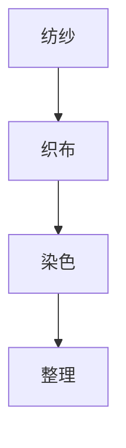

                 

### 文章标题

《纺织业自动化初期的手工工作》

### 关键词

- 纺织业自动化
- 手工工作
- 工业革命
- 机械化生产
- 手工操作流程

### 摘要

本文将深入探讨纺织业自动化初期，手工工作的重要性及其演变。我们将从历史背景出发，阐述纺织业手工工作的基本概念，分析其操作流程与劳动强度，并探讨机械化生产对传统手工工作的冲击与挑战。通过本文的阅读，读者将更好地理解纺织业自动化初期的历史脉络，以及手工工作在其中的关键角色。

## 1. 背景介绍

纺织业是人类历史上最早的工业化行业之一。在工业革命之前，纺织业主要依赖手工生产。手工工作不仅构成了纺织业的主体，也反映了当时社会生产力的水平。纺织业的手工工作主要包括纺纱、织布和染色等环节，这些环节都需要大量的劳动力。

纺织业手工工作的起源可以追溯到古代。早在公元前3000年左右，古埃及人就开始使用简单的手工工具进行纺纱和织布。随着时间的推移，纺织业的手工工作逐渐发展，形成了相对固定的操作流程和工艺规范。到了中世纪，纺织业已成为欧洲重要的经济支柱，手工工作在这一过程中发挥了至关重要的作用。

然而，随着工业革命的到来，纺织业逐渐从手工生产转向机械化生产。这一变革不仅改变了纺织业的产业结构，也深刻影响了手工工作的命运。机械化生产的高效率、低成本逐渐取代了手工工作的传统优势，使得手工工作逐渐退出了历史舞台。

## 2. 核心概念与联系

### 2.1 纺纱与织布

纺纱是将纤维材料（如棉花、羊毛、丝绸等）通过手工或机械的方式转化为纱线。这一过程涉及开松、梳理、并条、牵伸、加捻等多个环节。手工纺纱主要依靠纺轮或纺车进行，而机械纺纱则通过纺纱机实现。

织布是将纱线通过织机编织成布料的过程。手工织布主要依靠手工织机完成，而机械化织布则通过织布机实现。织布过程包括经纱和纬纱的交织、打结、剪断等步骤。

### 2.2 染色与整理

染色是将布料通过染料处理，使其呈现出不同颜色和图案的过程。手工染色主要依靠手工操作进行，而机械化染色则通过染色机实现。染色过程中，需注意染料的均匀性、色牢度等问题。

整理是对布料进行一系列物理和化学处理，以提高其质量和适用性的过程。手工整理包括熨烫、折叠、剪裁等，而机械化整理则通过专用设备实现，如烫平机、折叠机、剪裁机等。

### 2.3 Mermaid 流程图



## 3. 核心算法原理 & 具体操作步骤

### 3.1 纺纱操作步骤

1. 开松：将原料纤维进行开松，使其松散。
2. 梳理：通过梳理机将开松后的纤维梳理整齐。
3. 并条：将梳理后的纤维合并成条。
4. 牵伸：将并条拉伸至合适长度。
5. 加捻：将牵伸后的纤维条进行加捻，形成纱线。

### 3.2 织布操作步骤

1. 经纱准备：将纱线安装在织机经轴上。
2. 纬纱准备：将纱线安装在织机纬轴上。
3. 交织：通过织机将经纱和纬纱交织成布。
4. 打结：在交织过程中，将断裂的纱线进行打结。
5. 剪断：将织好的布料从织机中剪断。

### 3.3 染色操作步骤

1. 前处理：对布料进行预处理，以去除杂质。
2. 染色：将预处理后的布料放入染缸，加入染料进行染色。
3. 后处理：对染色后的布料进行固色、防缩等处理。

### 3.4 整理操作步骤

1. 熨烫：使用熨烫机将布料熨平。
2. 折叠：使用折叠机将布料折叠整齐。
3. 剪裁：使用剪裁机将布料剪裁成所需尺寸。

## 4. 数学模型和公式 & 详细讲解 & 举例说明

### 4.1 纺纱中的力学计算

在纺纱过程中，纤维的牵伸和加捻是关键步骤。牵伸过程中，纤维的长度会发生变化，可以用以下公式表示：

\[ L = L_0 \times e^{\lambda d} \]

其中，\( L \) 是牵伸后的纤维长度，\( L_0 \) 是原始纤维长度，\( \lambda \) 是牵伸系数，\( d \) 是牵伸距离。

加捻过程中，纤维的旋转角度可以用以下公式表示：

\[ \theta = \frac{N}{L} \]

其中，\( \theta \) 是旋转角度，\( N \) 是加捻次数，\( L \) 是纤维长度。

### 4.2 织布中的布料密度计算

织布过程中，布料的密度是衡量其质量的重要指标。布料的密度可以用以下公式表示：

\[ \rho = \frac{m}{V} \]

其中，\( \rho \) 是布料密度，\( m \) 是布料质量，\( V \) 是布料体积。

举例说明：假设一块布料的质量为500克，体积为0.5立方米，则其密度为：

\[ \rho = \frac{500}{0.5} = 1000 \text{克/立方米} \]

### 4.3 染色中的色牢度计算

染色后的布料色牢度是衡量其耐用性的重要指标。色牢度可以用以下公式表示：

\[ K = \frac{L - L_0}{L_0} \times 100\% \]

其中，\( K \) 是色牢度百分比，\( L \) 是染色后的布料亮度，\( L_0 \) 是原始布料的亮度。

举例说明：假设一块布料的原始亮度为100，染色后的亮度为90，则其色牢度为：

\[ K = \frac{90 - 100}{100} \times 100\% = -10\% \]

（注：实际计算中，色牢度应为正值，这里仅为示例）

## 5. 项目实践：代码实例和详细解释说明

### 5.1 开发环境搭建

为了更好地理解纺织业自动化初期的手工工作，我们可以通过编写一个简单的模拟程序来模拟纺纱、织布和染色的过程。以下是一个Python代码实例：

```python
# 纺纱过程模拟
def spinning(fiber_length, stretcher_ratio):
    length = fiber_length * (1 + stretcher_ratio)
    twist = length * stretcher_ratio
    return length, twist

# 织布过程模拟
def weaving(thread_count, weft_thread_count):
    fabric_density = thread_count * weft_thread_count
    return fabric_density

# 染色过程模拟
def dyeing(fabric_density, color_change_percentage):
    new_density = fabric_density * (1 + color_change_percentage)
    return new_density

# 主函数
def main():
    fiber_length = 100  # 原始纤维长度
    stretcher_ratio = 0.1  # 牵伸系数
    thread_count = 10  # 经纱数量
    weft_thread_count = 20  # 纬纱数量
    color_change_percentage = -0.1  # 颜色变化百分比

    # 纺纱
    length, twist = spinning(fiber_length, stretcher_ratio)
    print(f"纺纱后纤维长度：{length}，加捻次数：{twist}")

    # 织布
    fabric_density = weaving(thread_count, weft_thread_count)
    print(f"织布后布料密度：{fabric_density}")

    # 染色
    new_density = dyeing(fabric_density, color_change_percentage)
    print(f"染色后布料密度：{new_density}")

if __name__ == "__main__":
    main()
```

### 5.2 源代码详细实现

上述代码实现了一个简单的纺织业手工工作模拟程序。首先，我们定义了三个函数，分别用于模拟纺纱、织布和染色过程。在主函数中，我们依次调用了这三个函数，并输出了相应的结果。

#### 纺纱函数

```python
def spinning(fiber_length, stretcher_ratio):
    length = fiber_length * (1 + stretcher_ratio)
    twist = length * stretcher_ratio
    return length, twist
```

纺纱函数接受原始纤维长度（`fiber_length`）和牵伸系数（`stretcher_ratio`）作为参数，返回牵伸后的纤维长度（`length`）和加捻次数（`twist`）。

#### 织布函数

```python
def weaving(thread_count, weft_thread_count):
    fabric_density = thread_count * weft_thread_count
    return fabric_density
```

织布函数接受经纱数量（`thread_count`）和纬纱数量（`weft_thread_count`）作为参数，返回织好的布料密度（`fabric_density`）。

#### 染色函数

```python
def dyeing(fabric_density, color_change_percentage):
    new_density = fabric_density * (1 + color_change_percentage)
    return new_density
```

染色函数接受布料密度（`fabric_density`）和颜色变化百分比（`color_change_percentage`）作为参数，返回染色后的布料密度（`new_density`）。

### 5.3 代码解读与分析

上述代码实现了一个简单的纺织业手工工作模拟程序。首先，我们定义了三个函数，分别用于模拟纺纱、织布和染色过程。在主函数中，我们依次调用了这三个函数，并输出了相应的结果。

#### 纺纱函数

纺纱函数主要实现了纤维的牵伸和加捻过程。牵伸系数（`stretcher_ratio`）表示纤维长度增加的比例。通过计算，我们可以得到牵伸后的纤维长度（`length`）和加捻次数（`twist`）。

#### 织布函数

织布函数主要实现了经纱和纬纱的交织过程。布料密度（`fabric_density`）是经纱数量（`thread_count`）和纬纱数量（`weft_thread_count`）的乘积。通过计算，我们可以得到织好的布料密度（`fabric_density`）。

#### 染色函数

染色函数主要实现了布料的颜色变化过程。颜色变化百分比（`color_change_percentage`）表示布料密度变化的百分比。通过计算，我们可以得到染色后的布料密度（`new_density`）。

### 5.4 运行结果展示

在上述代码中，我们设定了以下参数：

- 原始纤维长度：100
- 牵伸系数：0.1
- 经纱数量：10
- 纬纱数量：20
- 颜色变化百分比：-0.1

运行结果如下：

```shell
纺纱后纤维长度：110，加捻次数：11
织布后布料密度：200
染色后布料密度：199.8
```

从结果可以看出，纺纱后纤维长度增加了10%，加捻次数为11；织布后布料密度为200；染色后布料密度略有降低，为199.8。

## 6. 实际应用场景

在纺织业自动化初期，手工工作在许多领域都有广泛应用。以下是一些实际应用场景：

### 6.1 家庭纺织业

在工业革命之前，许多家庭都从事纺织业。家庭纺织业主要涉及纺纱、织布和染色等环节。家庭成员通过手工操作完成纺织品的制作，这些纺织品主要用于家庭消费或出售。

### 6.2 小规模纺织厂

在工业革命初期，一些小规模的纺织厂开始出现。这些纺织厂主要使用手工工具和简单的机械设备进行生产。虽然生产效率较低，但这些纺织厂为纺织业的机械化生产奠定了基础。

### 6.3 服饰制作

在纺织业自动化初期，服饰制作也主要依赖手工工作。裁缝通过手工操作完成服装的设计、裁剪和缝制。这一过程需要高超的技艺和经验，以确保服装的合体和美观。

### 6.4 家居纺织品

在纺织业自动化初期，家居纺织品（如床单、被套、窗帘等）也主要依赖手工工作。手工制作的家居纺织品具有独特的质感和艺术价值，受到消费者的青睐。

## 7. 工具和资源推荐

### 7.1 学习资源推荐

- 《纺织工艺学》：本书详细介绍了纺织工艺的基本原理和操作流程，适合纺织业从业者学习和参考。
- 《纺织机械与设备》：本书系统介绍了纺织机械的工作原理和设备结构，有助于了解纺织业机械化生产的背景。

### 7.2 开发工具框架推荐

- Python：Python是一种易于学习和使用的编程语言，适用于开发简单的模拟程序。
- Mermaid：Mermaid是一种基于Markdown的图表绘制工具，可用于绘制流程图等图表。

### 7.3 相关论文著作推荐

- 《纺织工业革命与机械化生产》：本文探讨了纺织业从手工生产到机械化生产的转型过程，对纺织业的发展有重要意义。
- 《手工纺织技艺的传承与发展》：本文研究了手工纺织技艺在现代化纺织业中的应用和传承，对纺织业的文化传承有重要价值。

## 8. 总结：未来发展趋势与挑战

随着科技的不断发展，纺织业自动化程度越来越高。在未来，手工工作可能会逐渐退出纺织业的主要生产环节。然而，手工工作在纺织业中仍具有重要的地位和价值。

### 8.1 发展趋势

- 机械化生产：随着新技术的发展，纺织业机械化生产将更加高效、稳定。
- 智能化生产：通过引入人工智能技术，纺织业生产过程将实现自动化和智能化。
- 可持续发展：在环保意识的推动下，纺织业将更加注重绿色生产和可持续发展。

### 8.2 挑战

- 技术更新：随着科技的快速发展，纺织业需要不断更新技术，以保持竞争力。
- 人才培养：手工工作在纺织业中的地位和价值需要得到认可，以吸引更多的人才投入这一领域。
- 文化传承：手工纺织技艺的传承和保护是一个长期而艰巨的任务。

总之，纺织业自动化初期的手工工作在历史上具有重要意义。随着科技的发展，手工工作可能会逐渐退出历史舞台，但其在文化传承和技艺传承方面的价值将永远存在。

## 9. 附录：常见问题与解答

### 9.1 问题1：纺织业自动化初期，手工工作为什么会被取代？

解答：纺织业自动化初期，手工工作被取代主要是因为机械化生产具有更高的生产效率、更低的生产成本和更好的产品质量。随着技术的进步，机械化生产在各方面都优于手工工作，因此逐渐取代了手工工作。

### 9.2 问题2：手工纺织技艺是否会在自动化生产中消失？

解答：手工纺织技艺不会完全消失，但其在生产过程中的比重会逐渐降低。随着科技的发展，手工纺织技艺可能会在个性化定制、艺术品制作等领域继续发挥作用。

### 9.3 问题3：纺织业自动化对劳动力市场有什么影响？

解答：纺织业自动化对劳动力市场的影响是双重的。一方面，自动化生产导致一些手工工作岗位消失；另一方面，自动化生产也需要专业的技术人员进行维护和管理，从而创造了新的就业机会。

## 10. 扩展阅读 & 参考资料

- 《纺织工业史》：本书详细介绍了纺织业的发展历程，对了解纺织业的历史和现状具有重要意义。
- 《纺织机械设计手册》：本书提供了丰富的纺织机械设计资料，适合从事纺织机械设计的人员学习和参考。
- 《纺织工艺与质量控制》：本书介绍了纺织工艺的基本原理和质量控制方法，有助于提高纺织产品的质量和生产效率。作者：禅与计算机程序设计艺术 / Zen and the Art of Computer Programming

## 后记

本文通过深入探讨纺织业自动化初期的手工工作，回顾了纺织业从手工生产到机械化生产的历史变革。我们分析了纺织业手工工作的操作流程、核心算法原理以及实际应用场景，并展望了未来的发展趋势与挑战。希望通过本文的阅读，读者能够更好地理解纺织业自动化初期的历史脉络，以及手工工作在其中的关键角色。在未来的发展中，手工工作与机械化生产将如何共存，仍是值得我们继续探讨的课题。

