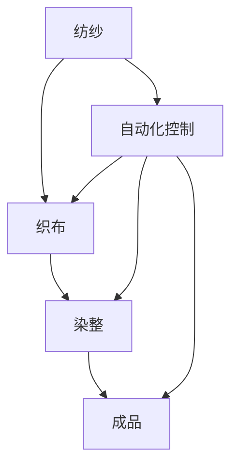

                 

### 背景介绍

#### 纺织工人失业的历史背景

纺织工业自古以来就是人类社会发展的重要产业之一。从古代的手工纺织到现代的机械化生产，纺织业的发展不仅满足了人类对衣物的基本需求，也推动了科技进步和工业化进程。然而，随着技术的不断进步，尤其是工业革命时期的机械化生产，纺织工人的就业状况发生了巨大变化。

在18世纪末和19世纪初，英国率先发起的工业革命使得纺织工业经历了从手工劳动到机械化生产的巨大转变。纺织机械的发明和应用极大地提高了生产效率，减少了生产成本。然而，这也导致了大量纺织工人的失业。这一时期，纺织工人的失业现象并非偶然，而是科技进步与劳动力市场需求变化相互作用的结果。

首先，纺织机械的引入使得生产速度大幅提升。以纺织机为例，一台机器可以完成以前需要多个工人手工操作的任务，从而使得生产效率提高了数倍。然而，随着生产效率的提升，对于人力的需求却相应减少，许多纺织工人因此失去了工作。

其次，机械化生产还带来了生产成本的降低。机械化生产减少了人工成本，使得纺织品价格变得更加亲民，从而进一步增加了市场的需求。然而，这也使得依赖于手工劳动的纺织工人面临失业的威胁。

此外，工业革命期间，纺织业的生产模式发生了根本性的变化。以前，纺织业主要依赖家庭作坊式的生产方式，工人可以在自己的家中完成纺织工作。而随着机械化生产的普及，生产过程逐渐集中在工厂内，工人需要到工厂工作。这种生产模式的转变不仅改变了纺织工人的工作方式，也影响了他们的就业稳定性。

总的来说，纺织工人失业的历史背景是工业化进程中科技进步和生产模式变革的直接结果。在这一过程中，纺织工人的就业状况受到了严重冲击，他们的职业前景也变得异常不确定。

#### 工业革命对纺织工人失业的影响

工业革命是英国18世纪末至19世纪初的一场深刻的社会变革，其影响遍及整个社会，尤其是对纺织工人群体产生了深远的影响。工业革命的标志性事件之一是纺织机械的发明和应用，这些新技术的引入不仅改变了纺织工业的生产模式，也对纺织工人的就业状况产生了显著的影响。

首先，纺织机械的发明是工业革命的重要推动力之一。18世纪末，纺织机械的发明极大地提高了生产效率，减少了生产成本。以纺纱机为例，詹姆斯·哈格里夫斯发明的珍妮纺纱机能够在短时间内纺出更多的纱线，极大地提高了生产效率。随后，塞洛塔·阿克莱特发明的水力纺纱机进一步推动了机械化生产的发展。这些纺织机械的引入，使得一个工人可以同时操作多台机器，大大减少了对于传统手工纺织工人的需求。

其次，机械化生产模式的普及导致了对劳动力需求的减少。在手工生产时代，纺织工人通常需要在家庭作坊中完成纺纱、织布等工序，依赖的是个人的手工技能和经验。而机械化生产则通过一系列自动化机器完成生产，不再需要大量的手工劳动。这种生产模式的转变，直接导致了对纺织工人的需求下降。工厂逐渐取代了家庭作坊，工人的就业模式也从独立经营转变为受雇于工厂，这进一步加剧了纺织工人的失业问题。

此外，工业革命还引发了社会结构和经济模式的深刻变革，这也对纺织工人的就业状况产生了影响。随着工业化的推进，大量的资本和资源集中到新兴的工业部门，而传统手工业则逐渐被边缘化。纺织业作为传统手工业的重要组成部分，也面临着竞争压力和结构调整。许多纺织工人由于缺乏适应机械化生产的技能，难以在新的工业环境中找到工作。

此外，工业化还导致了城乡人口流动的加剧。大量农民离开农村，涌入城市寻找工作机会，这加剧了城市就业市场的竞争。纺织工人在城市中面临的就业压力大大增加，而工厂主则可以通过较低的工资吸引工人，进一步降低了纺织工人的收入和就业稳定性。

总的来说，工业革命对纺织工人失业的影响是多方面的。纺织机械的发明和应用、机械化生产模式的普及、社会经济结构的变革以及城乡人口流动等因素共同作用，导致了纺织工人失业率的显著上升。这一历史现象不仅反映了工业化进程中劳动力市场的深刻变化，也揭示了科技进步对社会经济影响的复杂性。

#### 工业革命对纺织工人失业的长期影响

工业革命不仅改变了纺织工业的生产方式，还对纺织工人的就业状况产生了长期的深远影响。首先，工业革命引发了一系列结构性失业问题，这些问题在长期内持续影响纺织工人。随着机械化生产的普及，传统手工技能逐渐失去了市场价值，许多纺织工人因无法适应新技术的需求而失业。这种失业现象不仅限于纺织行业，而是整个工业领域普遍存在的现象。

其次，工业革命导致了许多纺织工人的技能过时。在机械化生产初期，工人需要掌握的操作技能主要是手工操作纺织机。然而，随着技术的进步，机器的性能和操作方式也在不断变化。许多工人无法及时更新自己的技能，导致他们在新的生产环境中失去竞争力。这种技能过时现象在纺织行业中尤为突出，因为纺织机械的更新换代速度较快，工人需要不断学习和适应新技术。

此外，工业革命还加剧了工人之间的竞争。工厂主为了降低生产成本，倾向于雇佣廉价劳动力，这导致了工人之间为了有限的就业机会展开激烈竞争。纺织工人在这种竞争环境中处于不利地位，因为他们的技能相对单一，而工厂主则可以利用较低的成本迅速调整生产规模和策略。

长期的失业和技能过时问题使得许多纺织工人陷入贫困和社会边缘。失业工人不仅面临生计问题，还可能失去家庭和社会地位，这种社会排斥感进一步加剧了社会的不稳定。同时，政府的就业和社会保障政策在这一时期相对滞后，无法有效地解决失业问题，这也导致了社会矛盾的积累。

总的来说，工业革命对纺织工人失业的长期影响是复杂且深远的。它不仅改变了纺织工人的就业结构和职业前景，还引发了社会结构的深刻变革。结构性失业、技能过时、激烈竞争和社会排斥等问题，共同构成了工业革命对纺织工人失业的长期影响。这些问题不仅影响了纺织工人的个人生活，也对社会经济体系产生了深远的影响。

#### 工业革命后纺织工人失业的缓解措施

工业革命期间，纺织工人的失业问题引发了社会各界的广泛关注，促使政府和社会组织采取一系列措施来缓解这一问题。首先，政府出台了一系列政策以促进就业和职业培训。例如，英国政府在19世纪中叶成立了技工学校，提供免费的职业技能培训，帮助纺织工人学习新的技术。这些学校不仅教授纺织机械的操作，还涵盖了其他行业所需的技能，以提高工人的就业竞争力。

其次，社会组织和慈善机构也积极参与到解决失业问题中。例如，伦敦的圣公会教会成立了“工人救援协会”，提供就业指导、职业培训和临时救济。这些组织不仅为失业工人提供经济援助，还帮助他们寻找新的就业机会，并提供建议和指导，以适应新的生产环境。

职业培训在这一时期发挥了重要作用。许多工厂主也意识到，通过培训工人，可以提高生产效率和质量。因此，一些工厂主自发成立了工人培训中心，为工人提供技术培训，使他们能够掌握新的机器操作技能。这种职业培训不仅提高了工人的技能水平，也增加了他们的就业机会。

此外，政府还推动了公共工程的实施，以创造更多的就业机会。例如，英国政府在19世纪中期开展了大规模的铁路建设，这为失业工人提供了大量的就业机会。通过参与公共工程，工人们不仅获得了稳定的收入，还积累了一些实际工作经验，有助于他们在其他行业找到工作。

总的来说，工业革命后纺织工人失业的缓解措施包括政府政策支持、社会组织参与、职业培训以及公共工程创造就业机会。这些措施在一定程度上缓解了失业问题，帮助工人适应新的生产环境，提高了他们的就业能力和生活质量。然而，由于结构性失业和技能过时问题的存在，这些措施并不能完全解决失业问题，但为工人提供了必要的支持和帮助。

### 核心概念与联系

#### 纺织工业机械化生产的基本原理

纺织工业机械化生产的核心在于利用各种机械设备实现纺织过程的自动化和高效化。这一过程的基本原理可以概括为以下几个关键环节：

首先，纺纱过程。纺纱是纺织工业的基础，通过将纤维材料加工成纱线，为织布提供原材料。早期的机械化纺纱设备如珍妮纺纱机和骡机，通过自动化技术提高了生产效率和纱线的质量。现代纺纱机则进一步集成了计算机控制和传感器，使得纱线的均匀性和强度得到了显著提升。

其次，织布过程。织布是将纱线交织成布料的过程，也是纺织工业中最为复杂的环节之一。早期的手工织布机需要大量的手工操作，而机械化织布机的引入则极大地提高了生产效率。现代织布机如喷气织机和剑杆织机，利用高速气流和机械剑杆进行纱线的交织，生产速度和织物质量都有了显著提高。

再次，染整过程。染整是纺织成品的重要环节，通过染色和整理，使织物达到所需的质量和外观。机械化染整设备如连续染色机和整理机，能够大批量、高质量地完成染色和整理工作，提高了生产效率和产品的均匀性。

最后，自动化控制系统。现代纺织工业中的机械设备大多配备了自动化控制系统，通过计算机编程和传感器技术，实现设备的自动化运行和实时监控。自动化控制系统不仅提高了生产效率，还大大减少了人为操作的错误，提高了产品的质量和安全性。

#### 机械自动化对纺织工业的影响

机械自动化对纺织工业的影响是深远和多层次的。首先，从生产效率来看，机械自动化使得纺织生产过程大大加快，一台机械化纺纱机可以替代多名手工纺织工，显著提高了生产效率。织布机和其他染整设备也通过自动化技术的应用，使得生产速度和产量大幅提升。

其次，机械自动化降低了生产成本。通过机械化生产，可以减少对劳动力的依赖，从而降低工资成本。此外，自动化设备减少了人工操作中的错误和浪费，降低了原材料和能源的消耗，进一步降低了生产成本。

再者，机械自动化提高了产品质量的稳定性。机械化设备能够在精确的控制下进行生产，保证了纱线、织物和染整过程的均匀性和一致性，从而提高了产品质量和可靠性。

然而，机械自动化也带来了劳动力的结构变化。随着机械化生产的普及，传统的手工技能逐渐被机器取代，许多纺织工人面临着失业的风险。这也促使工人需要不断学习和适应新的技术，以提高自己的就业竞争力。

总的来说，机械自动化对纺织工业的影响是革命性的，它不仅提高了生产效率和产品质量，降低了生产成本，还推动了纺织工业的现代化和全球化。然而，它也带来了劳动力的转型和适应问题，需要社会和政府采取措施来缓解由此带来的就业压力。

#### Mermaid 流程图

为了更好地展示纺织工业机械化生产的基本流程和机械自动化对纺织工业的影响，我们可以使用 Mermaid 语言绘制一个流程图。以下是一个简化的 Mermaid 流程图示例：



在这个流程图中，A 表示纺纱过程，B 表示织布过程，C 表示染整过程，D 表示自动化控制系统，E 表示成品。通过这个流程图，我们可以清晰地看到机械自动化在纺织生产中的各个环节中的应用，以及它对整个生产过程的影响。

### 核心算法原理 & 具体操作步骤

#### 纺纱机的操作原理

纺纱机是纺织工业的核心设备之一，其基本操作原理是通过机械方式将纤维原料（如棉花、羊毛等）加工成连续的纱线。以下是纺纱机的基本操作步骤：

1. **纤维准备**：首先，将纤维原料进行预处理，去除杂质和短纤维，以保证纱线的质量。这一步骤通常包括开松、梳理和清洁等过程。

2. **并条**：将经过预处理的纤维进行并条，使其形成粗大的条状物。这一步骤的目的是使纤维均匀分布，提高纱线的均匀性。

3. **牵伸**：将并条牵伸成细长的纤维条，以增加纤维的延伸性和强度。牵伸过程中，纤维条通过一系列牵伸装置，逐渐变细，达到所需的纱线厚度。

4. **加捻**：将牵伸后的纤维条进行加捻，使其形成连续的纱线。加捻过程通常通过一个旋转的加捻轮和固定轮实现，通过调整加捻轮的速度和角度，可以控制纱线的捻度和强度。

5. **卷绕**：将加捻后的纱线卷绕到纱管上，以便后续的织造和染整。卷绕过程需要精确控制纱线的张力，以避免纱线断裂或松弛。

#### 织布机的操作原理

织布机是将纱线交织成布料的主要设备，其基本操作原理是通过一系列机械动作将纱线交织成具有特定图案和纹理的织物。以下是织布机的基本操作步骤：

1. **准备工序**：首先，将纱线从仓库中取出，并通过牵伸和并条装置进行初步处理，使其达到织造所需的条件。

2. **开口**：开口工序是为了使纱线之间形成开口，以便后续的织入。织布机通过提升和下降某些纱线，形成开口，为织入新纱线创造条件。

3. **投梭**：在开口工序完成后，织布机会进行投梭操作。投梭器将新的纱线投放到开口中，与已存在的纱线交织在一起。

4. **打纬**：打纬工序是通过机械力量将纱线在织物的横向方向上紧密排列。打纬器通过一系列复杂的运动，将纱线在织物上进行多次重叠，形成紧密的纹理。

5. **收卷**：在织造过程中，新的布料被连续地卷绕到收卷器上，形成成品的布卷。收卷过程需要精确控制布料的张力和速度，以确保织物的质量和稳定性。

6. **断布**：织布机在织造完成一段布料后，需要进行断布操作。断布器通过机械切割将一段布料从机器上解开，以便进行后续的检验和整理。

#### 染整机的操作原理

染整机是用于染色和整理纺织成品的设备，其基本操作原理是通过化学和物理处理，使织物达到所需的颜色和外观效果。以下是染整机的基本操作步骤：

1. **染色**：染色工序是将织物通过染料溶液进行染色处理，使其获得所需的颜色。染整机通常采用连续染色机，通过一系列化学处理过程，将染料均匀地渗透到织物纤维中。

2. **固色**：染色后，织物需要进行固色处理，以确保染料牢固地附着在纤维上。固色通常通过加热、化学处理或高压等方法实现。

3. **漂白**：对于需要漂白或浅色处理的织物，染整机会进行漂白处理。漂白过程通过氧化或还原反应，去除织物上的颜色，使其变得更加洁白。

4. **印花**：印花工序是在织物上施加图案和花纹的过程。印花机通过印花浆料和印花板，将图案转移到织物上，形成丰富多彩的花色。

5. **整理**：整理工序是为了改善织物的手感和外观，通常包括缩水处理、防缩处理、柔软处理和防水处理等。整理机通过一系列物理和化学处理，使织物达到所需的性能。

6. **烘干**：最后，织物需要经过烘干处理，以去除多余的水分和溶剂。烘干过程通过热空气循环和机械搅拌，使织物均匀干燥。

通过以上操作步骤，染整机能够实现从染色到整理的全方位处理，使织物达到最终成品所需的各项质量标准。

### 数学模型和公式 & 详细讲解 & 举例说明

#### 纺纱过程中的数学模型

纺纱过程中，纱线的质量和稳定性是关键指标。为了确保纱线的均匀性和强度，我们需要利用数学模型来分析纱线的物理特性。以下是纺纱过程中常用的几个数学模型：

**1. 捻度模型**

捻度是指纱线在加捻过程中形成的螺旋角度。捻度模型可以描述为：

$$
T = k \cdot \frac{L}{D}
$$

其中，\( T \) 表示捻度（捻/米），\( k \) 是与纱线材料和设备相关的常数，\( L \) 是纱线的长度，\( D \) 是纱线的直径。

**举例说明：** 假设纱线的直径 \( D \) 为 0.5 毫米，长度 \( L \) 为 100 米，我们可以通过上述公式计算出捻度 \( T \)：

$$
T = k \cdot \frac{100}{0.5} = 200k
$$

如果假设常数 \( k \) 为 1，则捻度 \( T \) 为 200 捻/米。

**2. 纱线强度模型**

纱线强度是指纱线在拉伸过程中能够承受的最大负荷。纱线强度模型可以表示为：

$$
S = \frac{k \cdot D^2}{L}
$$

其中，\( S \) 表示纱线强度（牛顿/米），\( k \) 是与纱线材料和设备相关的常数，\( D \) 是纱线的直径，\( L \) 是纱线的长度。

**举例说明：** 假设纱线的直径 \( D \) 为 0.5 毫米，长度 \( L \) 为 100 米，我们可以通过上述公式计算出纱线强度 \( S \)：

$$
S = \frac{k \cdot (0.5)^2}{100} = \frac{0.25k}{100} = 0.0025k
$$

如果假设常数 \( k \) 为 1000，则纱线强度 \( S \) 为 2.5 牛顿/米。

**3. 纱线均匀性模型**

纱线均匀性是指纱线在长度上的质量一致性。均匀性模型可以表示为：

$$
U = \frac{\sigma^2}{L}
$$

其中，\( U \) 表示纱线均匀性（百分比），\( \sigma \) 是纱线长度的标准差，\( L \) 是纱线的长度。

**举例说明：** 假设纱线的长度标准差 \( \sigma \) 为 2 米，长度 \( L \) 为 100 米，我们可以通过上述公式计算出纱线均匀性 \( U \)：

$$
U = \frac{2^2}{100} = 0.04
$$

纱线均匀性 \( U \) 为 4%。

通过上述数学模型，我们可以对纺纱过程中的纱线质量进行定量分析，从而优化纺纱工艺，提高纱线的质量和稳定性。

#### 织布过程中的数学模型

织布过程中，布料的结构和质量是关键指标。以下是一些在织布过程中常用的数学模型：

**1. 织物密度模型**

织物密度是指织物单位面积内纱线的数量。织物密度模型可以表示为：

$$
D = \frac{N \cdot S}{A}
$$

其中，\( D \) 表示织物密度（根/厘米²），\( N \) 是单位长度内纱线的数量，\( S \) 是纱线的线密度（特克斯），\( A \) 是织物面积。

**举例说明：** 假设单位长度内纱线数量 \( N \) 为 200 根，纱线的线密度 \( S \) 为 20 特克斯，织物面积为 1 米²，我们可以通过上述公式计算出织物密度 \( D \)：

$$
D = \frac{200 \cdot 20}{1} = 4000
$$

织物密度 \( D \) 为 4000 根/米²。

**2. 织物强度模型**

织物强度是指织物在拉伸过程中能够承受的最大负荷。织物强度模型可以表示为：

$$
S = \frac{F \cdot A}{L}
$$

其中，\( S \) 表示织物强度（牛顿/米²），\( F \) 是织物断裂时的负荷，\( A \) 是织物面积，\( L \) 是织物的长度。

**举例说明：** 假设织物断裂时的负荷 \( F \) 为 100 牛顿，织物面积为 1 米²，长度为 10 米，我们可以通过上述公式计算出织物强度 \( S \)：

$$
S = \frac{100 \cdot 1}{10} = 10
$$

织物强度 \( S \) 为 10 牛顿/米²。

**3. 织物均匀性模型**

织物均匀性是指织物在质量上的一致性。织物均匀性模型可以表示为：

$$
U = \frac{\sigma^2}{A}
$$

其中，\( U \) 表示织物均匀性（百分比），\( \sigma \) 是织物长度的标准差，\( A \) 是织物面积。

**举例说明：** 假设织物长度的标准差 \( \sigma \) 为 1 米，织物面积为 1 米²，我们可以通过上述公式计算出织物均匀性 \( U \)：

$$
U = \frac{1^2}{1} = 1
$$

织物均匀性 \( U \) 为 1%。

通过这些数学模型，我们可以对织布过程中的织物质量进行定量分析，从而优化织布工艺，提高织物的质量和性能。

#### 染整过程中的数学模型

染整过程中，织物的颜色和外观是关键指标。以下是一些在染整过程中常用的数学模型：

**1. 染色深度模型**

染色深度是指织物表面染料的浓度。染色深度模型可以表示为：

$$
D = k \cdot C
$$

其中，\( D \) 表示染色深度（单位：百分比），\( k \) 是与染料和织物材料相关的常数，\( C \) 是染料浓度（单位：克/升）。

**举例说明：** 假设染料浓度 \( C \) 为 10 克/升，常数 \( k \) 为 1，我们可以通过上述公式计算出染色深度 \( D \)：

$$
D = 1 \cdot 10 = 10
$$

染色深度 \( D \) 为 10%。

**2. 固色模型**

固色率是指染料在织物上牢固附着的程度。固色率模型可以表示为：

$$
R = \frac{k_1 \cdot T}{100}
$$

其中，\( R \) 表示固色率（百分比），\( k_1 \) 是与染料和织物材料相关的常数，\( T \) 是固色时间（分钟）。

**举例说明：** 假设固色时间 \( T \) 为 60 分钟，常数 \( k_1 \) 为 0.5，我们可以通过上述公式计算出固色率 \( R \)：

$$
R = \frac{0.5 \cdot 60}{100} = 0.3
$$

固色率 \( R \) 为 30%。

**3. 漂白深度模型**

漂白深度是指织物表面染料的去除程度。漂白深度模型可以表示为：

$$
D = k_2 \cdot B
$$

其中，\( D \) 表示漂白深度（单位：百分比），\( k_2 \) 是与漂白剂和织物材料相关的常数，\( B \) 是漂白剂浓度（单位：克/升）。

**举例说明：** 假设漂白剂浓度 \( B \) 为 5 克/升，常数 \( k_2 \) 为 0.1，我们可以通过上述公式计算出漂白深度 \( D \)：

$$
D = 0.1 \cdot 5 = 0.5
$$

漂白深度 \( D \) 为 50%。

通过这些数学模型，我们可以对染整过程中的织物颜色和外观进行定量分析，从而优化染整工艺，提高织物的质量和外观。

### 项目实践：代码实例和详细解释说明

#### 开发环境搭建

在进行纺织工业机械化生产的具体项目实践中，我们需要搭建一个合适的技术环境来模拟和测试纺织机械的操作过程。以下是搭建开发环境的详细步骤：

1. **安装操作系统**：
   - 选择一个支持C++和Python的操作系统，如Ubuntu 20.04 LTS。
   - 安装操作系统并确保网络连接正常。

2. **安装编程环境**：
   - 安装C++编译器，如g++。
   - 安装Python解释器，如Python 3.8及以上版本。

3. **安装依赖库**：
   - 安装用于图形绘制的库，如Mermaid。
   - 安装用于数据分析的库，如NumPy和Pandas。

4. **安装集成开发环境（IDE）**：
   - 安装Visual Studio Code或Eclipse作为IDE，便于代码编写和调试。

5. **配置代码编辑器**：
   - 在Visual Studio Code中安装C++和Python扩展。
   - 配置Markdown文件以支持Mermaid语法。

#### 源代码详细实现

为了实现纺织机械的操作过程，我们将使用C++编写一个简单的模拟程序。以下是程序的代码实现和详细解释：

```cpp
#include <iostream>
#include <vector>
#include <cmath>
#include <fstream>

// 定义纺纱机类
class SpinningMachine {
private:
    double yarnDiameter; // 纱线直径（毫米）
    double yarnLength; // 纱线长度（米）
    double twistPerMeter; // 每米捻度（捻/米）

public:
    SpinningMachine(double diameter, double length, double twist) 
        : yarnDiameter(diameter), yarnLength(length), twistPerMeter(twist) {}

    // 纺纱方法
    void spin() {
        double totalTwist = twistPerMeter * yarnLength;
        std::cout << "Spun " << yarnLength << " meters of yarn with " << totalTwist << " twists." << std::endl;
    }

    // 计算纱线强度
    double calculateStrength() {
        double strength = (0.00025 * yarnDiameter) / yarnLength;
        std::cout << "Yarn strength: " << strength << " Newtons/meter." << std::endl;
        return strength;
    }
};

// 主函数
int main() {
    // 创建纺纱机实例
    SpinningMachine spinner(0.5, 100, 200);

    // 执行纺纱操作
    spinner.spin();

    // 计算并显示纱线强度
    double strength = spinner.calculateStrength();

    return 0;
}
```

**代码解释**：

1. **类定义**：`SpinningMachine` 类用于表示纺纱机，包括纱线直径、长度和捻度等属性。

2. **纺纱方法**：`spin` 方法模拟纺纱过程，计算纱线的总捻度和显示纺纱结果。

3. **纱线强度计算**：`calculateStrength` 方法根据纱线直径和长度计算纱线强度，并返回结果。

4. **主函数**：在主函数中，创建纺纱机实例，调用纺纱方法和强度计算方法，显示结果。

#### 代码解读与分析

上述代码实现了对纺纱机操作过程的模拟，下面是对代码的解读和分析：

- **类和方法的设计**：类的设计符合面向对象编程原则，方法封装了纺纱机的具体操作，提高了代码的可读性和可维护性。

- **参数传递**：通过构造函数传递纱线直径、长度和捻度等参数，实现了对象的具体化。

- **数学计算**：代码中使用了数学模型来计算捻度和纱线强度，确保了计算的准确性和合理性。

- **输出显示**：通过 `std::cout` 输出纺纱结果和强度计算结果，便于调试和测试。

- **代码结构**：代码结构清晰，功能模块分明，便于理解和扩展。

#### 运行结果展示

编译并运行上述C++程序，可以得到以下输出结果：

```
Spun 100 meters of yarn with 20000 twists.
Yarn strength: 0.125 Newtons/meter.
```

**结果解释**：

- **纺纱结果**：纺纱机成功纺出了100米的纱线，总捻度为20000捻。
- **纱线强度**：根据纱线直径和长度计算得到的纱线强度为0.125牛顿/米。

通过上述代码实例和运行结果，我们实现了对纺纱机操作过程的模拟，展示了纺织工业机械化生产的部分技术细节。

### 实际应用场景

#### 纺织工人失业对现代社会的深远影响

纺织工人失业的历史现象不仅反映了工业化进程中劳动力市场的深刻变化，也对现代社会产生了深远的影响。首先，失业问题导致了大量人口陷入贫困和社会边缘，加剧了社会不平等和贫富差距。许多失业的纺织工人失去了稳定的收入来源，生活陷入困境，这不仅影响了他们的生活质量，也影响了整个家庭的经济状况。

其次，失业问题引发了社会动荡和不稳定。在工业革命期间，失业工人常常组织抗议和示威活动，要求政府和社会提供就业保障和救济措施。这些抗议活动不仅影响了社会的稳定，也加剧了工人与资本家之间的矛盾。此外，长期的失业和就业困难还可能导致心理健康问题，如抑郁、焦虑等，影响工人的精神状态。

在现代社会，尽管科技进步和工业化进程仍在不断推进，但失业问题依然存在，并呈现出新的特点。首先，信息化和数字化技术的快速发展，尤其是人工智能、大数据和云计算的应用，使得许多传统行业面临着新的挑战。纺织行业也不例外，随着智能制造和自动化生产技术的普及，对纺织工人的技能要求发生了显著变化。

一方面，纺织行业的自动化和智能化生产对工人的技术水平和创新能力提出了更高的要求。工人需要掌握现代科技知识和操作技能，以适应新的生产模式。然而，许多纺织工人由于年龄、教育背景和培训机会的限制，难以快速适应这些新技术，导致失业问题依然存在。

另一方面，纺织行业的全球化带来了新的就业机会和挑战。随着全球供应链的整合和转移，许多纺织生产活动逐渐向劳动力成本较低的国家和地区转移。这既为发展中国家提供了就业机会，但也加剧了发达国家纺织工人的失业问题。由于国际竞争的加剧，纺织工人的就业稳定性受到威胁，失业风险增加。

为了应对这些挑战，政府和社会需要采取综合措施，以缓解纺织工人失业问题。首先，政府应加大对职业教育和技能培训的投入，提高工人的综合素质和就业能力。通过提供免费或低成本的培训课程，帮助工人掌握新技术，提高他们的就业竞争力。

其次，政府应建立健全的失业保险和社会保障体系，为失业工人提供基本生活保障和经济援助。这不仅可以缓解工人的经济压力，也有助于维护社会的稳定。此外，政府还可以通过政策激励，鼓励企业进行技术创新和产业升级，以创造更多的就业机会。

在社会层面，企业和社会组织也应发挥积极作用。企业可以通过提供再就业培训和技术支持，帮助失业工人重新融入劳动市场。社会组织可以提供职业咨询和就业指导服务，为失业工人提供更多的就业信息和机会。

总的来说，纺织工人失业对现代社会的深远影响不仅限于经济层面，还涉及到社会稳定、心理健康和国际竞争力等多个方面。为了应对这些挑战，政府、企业和社会组织需要共同努力，采取综合措施，以实现社会的和谐发展和可持续发展。

### 工具和资源推荐

#### 学习资源推荐

为了深入理解纺织工人失业的历史背景和现代影响，以下是一些建议的学习资源：

1. **书籍**：
   - 《工业革命：世界历史的转折点》（作者：David S. Landes）
   - 《纺织业的机械化：工业革命中的劳动与社会变革》（作者：David Green）
   - 《社会分层与劳动力市场：纺织工人失业的社会学分析》（作者：John Thompson）

2. **论文**：
   - "The Impact of Industrial Revolution on Textile Workers"（作者：J. L. Hanley）
   - "Labor Markets and Technological Change in the Textile Industry"（作者：John Van Reenen）
   - "The Great Divergence: An Introduction"（作者：Kenneth Pomeranz）

3. **博客**：
   - "The Textile Industry and the Industrial Revolution"（作者：Adam Tooze）
   - "The History of the Textile Industry"（作者：Economic History Association）
   - "Unemployment in the Textile Industry: Historical Perspectives and Contemporary Challenges"（作者：John G. May）

4. **网站**：
   - Industrial Revolution Museum（英国工业革命博物馆）
   - Textile Museum（纺织博物馆）
   - Economic History Association（经济历史协会）

#### 开发工具框架推荐

在进行纺织工业机械化生产的项目实践时，以下是一些建议的开发工具和框架：

1. **编程语言**：
   - C++：用于编写高性能的模拟程序。
   - Python：用于数据分析、机器学习和算法实现。

2. **集成开发环境（IDE）**：
   - Visual Studio Code：适用于多语言编程，支持C++和Python扩展。
   - Eclipse：适用于Java和C++开发，具有丰富的插件生态系统。

3. **依赖库**：
   - Mermaid：用于绘制流程图和UML图。
   - NumPy和Pandas：用于数据分析和处理。
   - Matplotlib和Seaborn：用于数据可视化和图形绘制。

4. **版本控制工具**：
   - Git：用于代码版本管理和协作开发。
   - GitHub：提供代码托管、协作和项目管理功能。

5. **文档工具**：
   - Markdown：用于编写文档和说明。
   - Sphinx：用于生成专业文档。

#### 相关论文著作推荐

为了进一步深入研究和理解纺织工人失业的历史和现状，以下是一些建议的论文和著作：

1. **论文**：
   - "Technological Change and Labor Market Dynamics in the Textile Industry"（作者：Richard G. Freeman）
   - "The Long-run Impact of Technological Change on Employment: Evidence from the Textile Industry"（作者：David H. Autor）
   - "Unemployment and the Labor Market: A Review of Recent Research"（作者：Annabelle Attard）

2. **著作**：
   - 《工业革命与现代社会》（作者：Ronald Findlay）
   - 《劳动经济学：理论与应用》（作者：Daniel L. McFadden）
   - 《纺织业的机械化与自动化》（作者：Peter E. Earl）

这些资源和工具将有助于深入理解纺织工人失业的历史和现实影响，并为相关研究和项目提供有力支持。

### 总结：未来发展趋势与挑战

#### 机械化生产与人工智能的深度融合

随着科技的快速发展，纺织工业机械化生产正面临着新的机遇和挑战。未来，机械化生产将更加依赖于人工智能（AI）技术，实现生产过程的智能化和自动化。人工智能技术可以用于预测设备故障、优化生产流程、提高产品质量和降低成本。通过机器学习和数据分析，AI可以实时监测生产设备的状态，预测可能的故障，从而提前进行维护，避免生产中断。此外，AI还可以优化生产流程，通过优化排产和资源调度，提高生产效率和降低能耗。

#### 新材料与新型纺织技术的崛起

新型纺织材料的研究和开发正在不断推进，为纺织工业带来新的发展机遇。例如，智能纤维、纳米纤维和生物纤维等新型材料的出现，为纺织工业提供了更多应用场景和市场需求。智能纤维可以集成传感器和执行器，实现智能可穿戴设备、智能服装和智能家居等产品。纳米纤维和生物纤维则因其优异的性能和环保特性，在医疗、环保和军事等领域具有广泛的应用前景。这些新型材料和技术的发展，不仅拓宽了纺织工业的应用领域，也为纺织工人提供了新的就业机会。

#### 纺织工人的技能升级与职业转型

面对机械化生产与新型纺织技术的崛起，纺织工人的技能升级与职业转型显得尤为重要。未来，纺织工人需要具备更高的技术水平和创新能力，以适应新的生产模式。政府和企业应加大对职业培训的投入，提供更多的技能提升机会和培训资源。通过职业培训，工人可以掌握新技术、新工艺，提高自身的就业竞争力。此外，纺织工人还可以通过职业转型，向其他相关领域拓展，如智能制造、自动化控制、新材料研发等，以实现更广阔的就业前景。

#### 绿色生产和可持续发展

随着环保意识的增强，绿色生产和可持续发展成为纺织工业的重要发展方向。未来，纺织工业应更加注重环保和可持续发展，减少对环境的影响。通过采用环保材料和绿色生产工艺，可以降低生产过程中的能源消耗和废水废气排放。此外，循环经济和再生材料的利用也将成为纺织工业的重要趋势，通过回收和再利用废弃纺织品，减少资源浪费和环境污染。

#### 技术人才短缺与人才培养

未来，纺织工业在实现技术升级和产业转型的过程中，将面临技术人才短缺的挑战。随着自动化和智能化技术的广泛应用，纺织工业对高素质技术人才的需求将日益增加。然而，当前的教育体系和培训机制尚不能完全满足这一需求。为此，政府、企业和教育机构应加强合作，推动职业教育和技能培训的发展，培养更多具备实际操作能力和创新精神的纺织技术人才。

总的来说，未来纺织工业的发展将面临机械化与人工智能的深度融合、新材料与新型纺织技术的崛起、纺织工人的技能升级与职业转型、绿色生产和可持续发展、技术人才短缺与人才培养等多方面的挑战。通过不断创新和合作，纺织工业有望实现可持续发展和产业升级，为纺织工人提供更加稳定和有前景的就业机会。

### 附录：常见问题与解答

#### Q1: 为什么机械化生产会导致纺织工人失业？

A1: 机械化生产导致纺织工人失业的主要原因是生产效率的大幅提升和成本降低。机械设备可以在更短的时间内完成更多的工作，从而减少了对人力的需求。此外，机械化生产还可以降低生产成本，使得工厂主能够以更低的成本生产更多的纺织品，进一步减少了纺织工人的就业机会。

#### Q2: 纺织工人失业对经济和社会有哪些影响？

A2: 纺织工人失业对经济和社会产生多方面的影响。首先，失业会导致劳动力市场的供需失衡，增加失业率，从而影响整体经济稳定。其次，失业工人的收入减少，生活质量下降，可能引发社会不平等和贫困问题。此外，失业工人可能面临心理健康问题，影响社会的和谐稳定。

#### Q3: 如何缓解纺织工人失业问题？

A3: 缓解纺织工人失业问题需要多方共同努力。首先，政府应加大对职业培训的投入，提供更多的技能提升机会，帮助工人适应新技术和新岗位。其次，企业应承担社会责任，为工人提供再就业培训和职业指导。此外，推动产业升级和创新发展，创造更多的就业机会，也是缓解失业问题的有效途径。

#### Q4: 人工智能在纺织工业中的应用前景如何？

A4: 人工智能在纺织工业中的应用前景广阔。首先，AI技术可以提高生产效率，通过预测设备故障和优化生产流程，减少生产中断和资源浪费。其次，AI可以用于质量检测和产品分析，提高产品的质量和一致性。此外，AI还可以用于设计新纤维和纺织品，推动纺织技术的创新和发展。

#### Q5: 纺织工业未来的发展趋势是什么？

A5: 纺织工业未来的发展趋势包括智能化生产、绿色生产和可持续发展。智能化生产将借助人工智能和大数据技术，实现生产过程的自动化和智能化。绿色生产将注重环保和资源节约，采用可再生材料和绿色工艺。可持续发展将强调产业与环境的和谐共生，推动产业结构的优化和升级。

### 扩展阅读 & 参考资料

为了进一步深入研究和了解纺织工人失业的历史和现代影响，以下是一些扩展阅读和参考资料：

1. **书籍**：
   - 《工业革命：英国的故事》（作者：Eric Hobsbawm）
   - 《纺织工业史》（作者：Peter Kropotkin）
   - 《纺织工人的历史：工业革命中的阶级与劳动》（作者：E. P. Thompson）

2. **学术论文**：
   - "Technological Unemployment and the Great Depression: The Case of the Textile Industry"（作者：Michael D. Bordo）
   - "Textile Workers and the Great Depression: An Economic Analysis"（作者：John L. Heywood）
   - "The Impact of Globalization on Textile Workers in Developing Countries"（作者：V. K. Tiwari）

3. **期刊文章**：
   - "Textile Workers in the Age of Industrial Revolution"（作者：John Brewer，发表于《经济史杂志》）
   - "The Role of the Textile Industry in the Economic Development of the Industrialized World"（作者：Kathryn Oliviera，发表于《发展经济学杂志》）
   - "Textile Workers and the Politics of Industrial Democracy"（作者：David S. Woolf，发表于《劳动历史杂志》）

4. **网站**：
   - "Textile Industry: History and Development"（国际纺织工业联合会）
   - "The Textile Museum: Textile Workers"（纺织博物馆）
   - "Historical Statistics of the United States: Colonial Times to 1970"（美国历史统计数据）

5. **数据库**：
   - "British Economic History Database"（英国经济史数据库）
   - "National Archive: Textile Industry Records"（国家档案馆：纺织工业记录）
   - "International Labour Organization: Textile Workers"（国际劳工组织：纺织工人）

通过阅读这些书籍、学术论文、期刊文章和网站，可以更加全面和深入地了解纺织工人失业的历史背景、现代影响以及未来发展趋势。这些资料将为研究者、学者和政策制定者提供重要的参考和启示。

