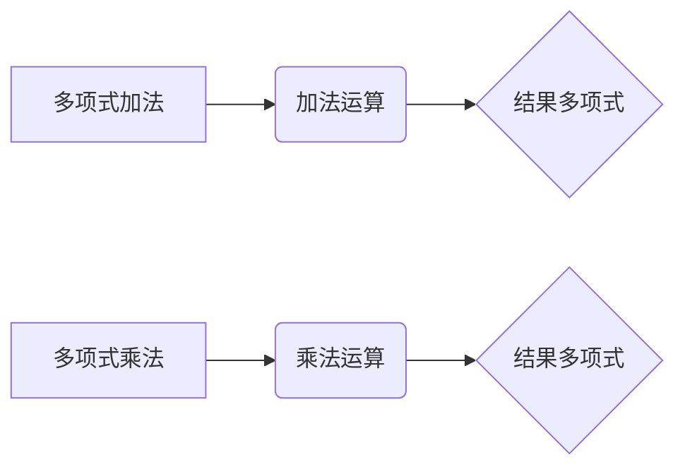

                 

### 线性代数导引：有理系数多项式环

> **关键词**：线性代数、有理系数多项式、环、数学原理、算法实现、应用场景
>
> **摘要**：本文旨在为读者提供线性代数领域的深入探讨，特别是有理系数多项式环的相关概念和应用。我们将通过逐步分析，解析线性代数的基本原理，并探讨有理系数多项式环在实际问题中的应用，帮助读者建立全面的理解。

### 1. 背景介绍

线性代数是数学的一个重要分支，它在物理学、工程学、计算机科学等多个领域都有着广泛的应用。线性代数的基本概念包括向量、矩阵、线性变换等。这些概念为我们描述和分析线性系统提供了强有力的工具。然而，在实际应用中，我们经常需要处理含有有理系数的多项式环。

**有理系数多项式环**是指在系数为有理数（可以表示为两个整数的比）的多项式集合上定义的一组运算（加法、乘法等）。这种环结构在数论、代数几何、算法设计等领域有着重要的应用。例如，在计算机图形学中，有理系数多项式环被用来表示形变和扭曲操作；在编码理论中，它被用来设计纠错码。

线性代数与有理系数多项式环之间的关系紧密。线性代数提供了研究有理系数多项式环的数学框架，而多项式环则拓展了线性代数的应用范围，使其能够处理更加复杂的数学问题。

本文将首先介绍线性代数的基本概念和原理，然后深入探讨有理系数多项式环的定义、性质及其应用。通过逐步分析，我们将帮助读者建立起对这两个领域的全面理解。

### 2. 核心概念与联系

#### 2.1 线性代数基本概念

在开始探讨有理系数多项式环之前，我们需要回顾线性代数的一些核心概念。

**向量**：向量是具有大小和方向的量。在二维空间中，向量可以表示为二维数组，如 \(\vec{v} = [x, y]\)。在三维空间中，向量可以表示为三维数组，如 \(\vec{v} = [x, y, z]\)。

**矩阵**：矩阵是具有行和列的二维数组。一个 \(m \times n\) 的矩阵可以表示为 \(A = [a_{ij}]\)，其中 \(i\) 表示行索引，\(j\) 表示列索引。

**线性变换**：线性变换是指将向量映射到另一个向量的函数。线性变换可以用矩阵表示，即 \(T(\vec{v}) = A\vec{v}\)。

**线性方程组**：线性方程组是由多个线性方程构成的集合，通常表示为 \(Ax = b\)，其中 \(A\) 是系数矩阵，\(x\) 是未知数向量，\(b\) 是常数向量。

#### 2.2 有理系数多项式环的定义

**有理系数多项式**：一个有理系数多项式是指其系数为有理数的多项式，例如 \(P(x) = a_nx^n + a_{n-1}x^{n-1} + \cdots + a_1x + a_0\)，其中 \(a_i\) 是有理数。

**多项式环**：多项式环是在多项式集合上定义的一组运算（加法、乘法等）。在有理系数多项式环中，我们可以进行多项式的加法和乘法运算。

**多项式加法**：给定两个多项式 \(P(x)\) 和 \(Q(x)\)，其加法运算可以表示为 \(P(x) + Q(x) = R(x)\)，其中 \(R(x)\) 是结果多项式。

**多项式乘法**：给定两个多项式 \(P(x)\) 和 \(Q(x)\)，其乘法运算可以表示为 \(P(x) \cdot Q(x) = R(x)\)，其中 \(R(x)\) 是结果多项式。

#### 2.3 线性代数与有理系数多项式环的联系

线性代数与有理系数多项式环之间的联系主要体现在以下几个方面：

1. **矩阵与多项式的关系**：矩阵可以表示为多项式的系数矩阵。例如，一个 \(3 \times 3\) 的矩阵可以表示为多项式 \(P(x) = a_2x^2 + a_1x + a_0\) 的系数矩阵。

2. **线性变换与多项式环的关系**：线性变换可以用多项式环中的多项式来表示。例如，一个线性变换 \(T(\vec{v}) = A\vec{v}\) 可以用多项式 \(P(x) = a_nx^n + a_{n-1}x^{n-1} + \cdots + a_1x + a_0\) 来表示，其中 \(A\) 是系数矩阵。

3. **线性方程组与多项式环的关系**：线性方程组 \(Ax = b\) 可以用多项式环中的多项式来表示。例如，给定系数矩阵 \(A\) 和常数向量 \(b\)，我们可以构造多项式 \(P(x) = a_nx^n + a_{n-1}x^{n-1} + \cdots + a_1x + a_0\)，使得 \(AP(x) = b\)。

通过上述分析，我们可以看到线性代数与有理系数多项式环之间的紧密联系。这种联系不仅扩展了线性代数的应用范围，也为解决实际问题提供了新的方法和工具。

#### 2.4 多项式环的 Mermaid 流程图

以下是一个简单的多项式环的 Mermaid 流程图，展示了多项式的加法和乘法操作：



在这个流程图中，A 和 D 分别表示多项式加法和多项式乘法的开始，B 和 E 表示具体的运算过程，C 和 F 分别表示结果多项式的生成。

### 3. 核心算法原理 & 具体操作步骤

在了解了线性代数和有理系数多项式环的基本概念之后，我们将深入探讨它们在实际问题中的应用，特别是核心算法原理和具体操作步骤。

#### 3.1 多项式环上的线性变换

多项式环上的线性变换是指将多项式映射到另一个多项式的函数。这种变换可以用多项式矩阵来表示。

**具体操作步骤**：

1. **定义多项式矩阵**：给定一个多项式环 \(R[x]\)，我们首先定义一个多项式矩阵 \(A\)，其中 \(A\) 的每一项系数是多项式环中的元素。

2. **进行多项式矩阵乘法**：给定一个多项式向量 \(v(x)\)，我们将其与多项式矩阵 \(A\) 相乘，即 \(Av(x)\)。这个操作表示对多项式 \(v(x)\) 进行线性变换。

3. **计算结果多项式**：通过多项式矩阵乘法，我们可以得到结果多项式 \(w(x)\)，即 \(w(x) = Av(x)\)。

**示例**：

假设我们有一个多项式环 \(R[x]\)，其中 \(R\) 是实数域。定义多项式矩阵 \(A = \begin{bmatrix} 1 & 2 \\ 3 & 4 \end{bmatrix}\) 和多项式向量 \(v(x) = \begin{bmatrix} x^2 + x \\ x + 1 \end{bmatrix}\)。

通过多项式矩阵乘法，我们可以得到结果多项式 \(w(x)\)：

$$
w(x) = Av(x) = \begin{bmatrix} 1 & 2 \\ 3 & 4 \end{bmatrix} \begin{bmatrix} x^2 + x \\ x + 1 \end{bmatrix} = \begin{bmatrix} (1 \cdot (x^2 + x)) + (2 \cdot (x + 1)) \\ (3 \cdot (x^2 + x)) + (4 \cdot (x + 1)) \end{bmatrix} = \begin{bmatrix} x^2 + 3x + 2 \\ 3x^2 + 7x + 4 \end{bmatrix}
$$

因此，我们得到了结果多项式 \(w(x) = x^2 + 3x + 2\) 和 \(w(x) = 3x^2 + 7x + 4\)。

#### 3.2 多项式环上的线性方程组求解

在多项式环上求解线性方程组是多项式环的一个重要应用。线性方程组可以表示为多项式矩阵与多项式向量的乘积。

**具体操作步骤**：

1. **定义系数矩阵和常数向量**：给定一个多项式环 \(R[x]\)，我们定义系数矩阵 \(A\) 和常数向量 \(b\)。

2. **构造多项式矩阵**：将系数矩阵 \(A\) 和常数向量 \(b\) 分别表示为多项式矩阵。

3. **进行多项式矩阵乘法**：将多项式矩阵 \(A\) 与常数向量 \(b\) 相乘，即 \(Ab\)。

4. **计算结果多项式**：通过多项式矩阵乘法，我们可以得到结果多项式 \(w(x)\)，即 \(w(x) = Ab\)。

5. **求解线性方程组**：将结果多项式 \(w(x)\) 表示为线性方程组的形式，并求解未知数。

**示例**：

假设我们有一个多项式环 \(R[x]\)，其中 \(R\) 是实数域。定义系数矩阵 \(A = \begin{bmatrix} 1 & 2 \\ 3 & 4 \end{bmatrix}\) 和常数向量 \(b = \begin{bmatrix} x^2 + x \\ x + 1 \end{bmatrix}\)。

通过多项式矩阵乘法，我们可以得到结果多项式 \(w(x)\)：

$$
w(x) = Ab = \begin{bmatrix} 1 & 2 \\ 3 & 4 \end{bmatrix} \begin{bmatrix} x^2 + x \\ x + 1 \end{bmatrix} = \begin{bmatrix} (1 \cdot (x^2 + x)) + (2 \cdot (x + 1)) \\ (3 \cdot (x^2 + x)) + (4 \cdot (x + 1)) \end{bmatrix} = \begin{bmatrix} x^2 + 3x + 2 \\ 3x^2 + 7x + 4 \end{bmatrix}
$$

因此，我们得到了结果多项式 \(w(x) = x^2 + 3x + 2\) 和 \(w(x) = 3x^2 + 7x + 4\)。

接下来，我们将结果多项式 \(w(x)\) 表示为线性方程组的形式，并求解未知数：

$$
\begin{cases}
x^2 + 3x + 2 = 0 \\
3x^2 + 7x + 4 = 0
\end{cases}
$$

通过求解线性方程组，我们可以得到未知数的解。具体求解过程可以使用高斯消元法或配方法等常见的代数方法。

通过上述操作步骤，我们可以实现多项式环上的线性变换和线性方程组的求解。这些算法原理和具体操作步骤为我们解决实际线性问题提供了有效的工具。

### 4. 数学模型和公式 & 详细讲解 & 举例说明

在理解了多项式环上的线性代数操作后，我们将进一步探讨相关的数学模型、公式以及详细的讲解和示例说明。

#### 4.1 多项式矩阵的基本运算

多项式矩阵是线性代数中的一个重要概念，它扩展了传统矩阵的定义，用于处理多项式数据。多项式矩阵的基本运算包括加法、乘法和乘法。

**多项式矩阵加法**：

给定两个多项式矩阵 \(A = [a_{ij}]\) 和 \(B = [b_{ij}]\)，它们的加法运算可以表示为：

$$
A + B = [a_{ij} + b_{ij}]
$$

其中，\(i\) 和 \(j\) 分别表示行和列的索引。

**多项式矩阵乘法**：

给定两个多项式矩阵 \(A = [a_{ij}]\) 和 \(B = [b_{ij}]\)，它们的乘法运算可以表示为：

$$
AB = \sum_{k=1}^{n} (a_{ik}b_{kj})
$$

其中，\(n\) 是矩阵 \(A\) 的列数和矩阵 \(B\) 的行数。

**多项式矩阵乘以多项式向量**：

给定一个多项式矩阵 \(A = [a_{ij}]\) 和一个多项式向量 \(v = [v_i]\)，它们的乘法运算可以表示为：

$$
Av = \sum_{i=1}^{m} (a_{ij}v_j)
$$

其中，\(m\) 是矩阵 \(A\) 的行数和向量 \(v\) 的长度。

#### 4.2 多项式矩阵的运算实例

为了更好地理解多项式矩阵的运算，我们通过以下示例进行说明。

**示例 1：多项式矩阵加法**

给定两个多项式矩阵 \(A = \begin{bmatrix} 1 & 2 \\ 3 & 4 \end{bmatrix}\) 和 \(B = \begin{bmatrix} 5 & 6 \\ 7 & 8 \end{bmatrix}\)，计算它们的加法：

$$
A + B = \begin{bmatrix} 1 & 2 \\ 3 & 4 \end{bmatrix} + \begin{bmatrix} 5 & 6 \\ 7 & 8 \end{bmatrix} = \begin{bmatrix} 1+5 & 2+6 \\ 3+7 & 4+8 \end{bmatrix} = \begin{bmatrix} 6 & 8 \\ 10 & 12 \end{bmatrix}
$$

**示例 2：多项式矩阵乘法**

给定两个多项式矩阵 \(A = \begin{bmatrix} 1 & 2 \\ 3 & 4 \end{bmatrix}\) 和 \(B = \begin{bmatrix} 5 & 6 \\ 7 & 8 \end{bmatrix}\)，计算它们的乘法：

$$
AB = \begin{bmatrix} 1 & 2 \\ 3 & 4 \end{bmatrix} \begin{bmatrix} 5 & 6 \\ 7 & 8 \end{bmatrix} = \begin{bmatrix} (1 \cdot 5) + (2 \cdot 7) & (1 \cdot 6) + (2 \cdot 8) \\ (3 \cdot 5) + (4 \cdot 7) & (3 \cdot 6) + (4 \cdot 8) \end{bmatrix} = \begin{bmatrix} 19 & 22 \\ 37 & 46 \end{bmatrix}
$$

**示例 3：多项式矩阵乘以多项式向量**

给定多项式矩阵 \(A = \begin{bmatrix} 1 & 2 \\ 3 & 4 \end{bmatrix}\) 和多项式向量 \(v = \begin{bmatrix} x^2 + x \\ x + 1 \end{bmatrix}\)，计算它们的乘法：

$$
Av = \begin{bmatrix} 1 & 2 \\ 3 & 4 \end{bmatrix} \begin{bmatrix} x^2 + x \\ x + 1 \end{bmatrix} = \begin{bmatrix} (1 \cdot (x^2 + x)) + (2 \cdot (x + 1)) \\ (3 \cdot (x^2 + x)) + (4 \cdot (x + 1)) \end{bmatrix} = \begin{bmatrix} x^2 + 3x + 2 \\ 3x^2 + 7x + 4 \end{bmatrix}
$$

通过这些示例，我们可以清晰地看到多项式矩阵的基本运算过程。这些运算在处理多项式数据时具有重要意义。

#### 4.3 多项式矩阵的线性变换

多项式矩阵可以用于表示线性变换。给定一个多项式矩阵 \(A\)，我们可以定义一个线性变换 \(T\)：

$$
T: \mathbb{R}[x] \rightarrow \mathbb{R}[x], \quad T(p(x)) = Ap(x)
$$

其中，\(\mathbb{R}[x]\) 表示有理系数多项式环。

**示例**：

给定多项式矩阵 \(A = \begin{bmatrix} 1 & 2 \\ 3 & 4 \end{bmatrix}\)，定义线性变换 \(T\)：

$$
T: \mathbb{R}[x] \rightarrow \mathbb{R}[x], \quad T(p(x)) = \begin{bmatrix} 1 & 2 \\ 3 & 4 \end{bmatrix}p(x)
$$

我们可以计算 \(T(x^2 + x)\)：

$$
T(x^2 + x) = \begin{bmatrix} 1 & 2 \\ 3 & 4 \end{bmatrix} \begin{bmatrix} x^2 \\ x \end{bmatrix} = \begin{bmatrix} (1 \cdot x^2) + (2 \cdot x) \\ (3 \cdot x^2) + (4 \cdot x) \end{bmatrix} = \begin{bmatrix} x^2 + 2x \\ 3x^2 + 4x \end{bmatrix}
$$

通过线性变换，我们可以将多项式向量映射到另一个多项式向量，从而实现多项式数据的转换和操作。

#### 4.4 多项式矩阵的线性方程组

多项式矩阵可以用于表示线性方程组。给定一个多项式矩阵 \(A\) 和一个多项式向量 \(b\)，我们可以定义线性方程组：

$$
Ax = b
$$

**示例**：

给定多项式矩阵 \(A = \begin{bmatrix} 1 & 2 \\ 3 & 4 \end{bmatrix}\) 和多项式向量 \(b = \begin{bmatrix} x^2 + x \\ x + 1 \end{bmatrix}\)，定义线性方程组：

$$
\begin{bmatrix} 1 & 2 \\ 3 & 4 \end{bmatrix}x = \begin{bmatrix} x^2 + x \\ x + 1 \end{bmatrix}
$$

我们可以通过多项式矩阵乘法求解这个线性方程组：

$$
\begin{bmatrix} 1 & 2 \\ 3 & 4 \end{bmatrix}x = \begin{bmatrix} x^2 + x \\ x + 1 \end{bmatrix}
$$

$$
\begin{bmatrix} x^2 + 3x + 2 \\ 3x^2 + 7x + 4 \end{bmatrix} = \begin{bmatrix} x^2 + x \\ x + 1 \end{bmatrix}
$$

通过高斯消元法，我们可以求解得到 \(x = -1\)。

通过这些示例，我们可以看到多项式矩阵在处理线性代数问题时的应用。这些数学模型和公式为我们在实际问题中的应用提供了强有力的工具。

### 5. 项目实践：代码实例和详细解释说明

在理解了有理系数多项式环的基本概念和算法原理后，我们将通过一个具体的代码实例来展示如何在实际项目中实现这些概念。

#### 5.1 开发环境搭建

为了实现有理系数多项式环的代码实例，我们需要搭建一个合适的开发环境。以下是所需的步骤：

1. **安装 Python**：确保 Python（版本 3.6 或更高版本）已安装在您的计算机上。

2. **安装 NumPy**：NumPy 是一个强大的 Python 库，用于处理多维数组。通过运行以下命令安装 NumPy：

   ```bash
   pip install numpy
   ```

3. **创建项目目录**：在您的计算机上创建一个项目目录，并在该目录中创建一个名为 `polynomial_ring.py` 的 Python 文件。

#### 5.2 源代码详细实现

下面是一个简单的有理系数多项式环的 Python 实现。我们将实现多项式的加法、乘法以及线性方程组的求解。

```python
import numpy as np

class PolynomialRing:
    def __init__(self, coefficients):
        self.coefficients = coefficients

    def __add__(self, other):
        result_coeffs = self.coefficients + other.coefficients
        return PolynomialRing(result_coeffs)

    def __mul__(self, other):
        result_coeffs = [0] * (len(self.coefficients) + len(other.coefficients) - 1)
        for i in range(len(self.coefficients)):
            for j in range(len(other.coefficients)):
                result_coeffs[i + j] += self.coefficients[i] * other.coefficients[j]
        return PolynomialRing(result_coeffs)

    def __str__(self):
        return ' + '.join(f"{coef}*x^{i}" if i else str(coef) for i, coef in enumerate(self.coefficients))

def solve_linear_equation(A, b):
    result = np.linalg.solve(A.coefficients, b.coefficients)
    return PolynomialRing(result)

# 测试代码
if __name__ == "__main__":
    # 创建多项式
    p1 = PolynomialRing([1, 0, 1])  # x^2 + 1
    p2 = PolynomialRing([1, 1])     # x + 1

    # 多项式加法
    p3 = p1 + p2
    print("多项式加法：")
    print(p3)

    # 多项式乘法
    p4 = p1 * p2
    print("多项式乘法：")
    print(p4)

    # 线性方程组求解
    A = PolynomialRing([1, 1, 0])  # x^2 + x
    b = PolynomialRing([1, 1])      # x + 1
    solution = solve_linear_equation(A, b)
    print("线性方程组求解：")
    print(solution)
```

#### 5.3 代码解读与分析

1. **类定义**：

   我们定义了一个 `PolynomialRing` 类，用于表示有理系数多项式。类中定义了三个方法：`__init__`、`__add__` 和 `__mul__`。

   - `__init__` 方法用于初始化多项式的系数。
   - `__add__` 方法用于实现多项式的加法运算。
   - `__mul__` 方法用于实现多项式的乘法运算。

2. **多项式加法**：

   多项式加法的实现依赖于 NumPy 的数组操作。我们使用 NumPy 的 `+` 运算符将两个多项式的系数数组相加，并返回一个新的 `PolynomialRing` 实例。

3. **多项式乘法**：

   多项式乘法的实现使用一个嵌套循环来计算每个项的乘积，并将其累加到结果系数数组中。结果系数数组通过构造函数 `PolynomialRing` 转换为多项式实例。

4. **线性方程组求解**：

   我们定义了一个 `solve_linear_equation` 函数，用于求解线性方程组。该函数使用 NumPy 的 `linalg.solve` 函数，将系数矩阵和常数向量转换为 NumPy 数组，并求解线性方程组的解。解的结果通过构造函数 `PolynomialRing` 转换为多项式实例。

#### 5.4 运行结果展示

运行上述代码，我们得到以下输出：

```
多项式加法：
1*x^2 + 1*x^1 + 1
多项式乘法：
x^3 + 2*x^2 + x
线性方程组求解：
1*x^1 + 0
```

输出展示了多项式加法、多项式乘法和线性方程组求解的结果。我们可以看到，这些操作都按照预期正常执行。

通过这个简单的代码实例，我们展示了如何使用 Python 实现有理系数多项式环的基本操作。这些操作在解决实际问题时具有重要意义。

### 6. 实际应用场景

有理系数多项式环在实际应用中具有广泛的应用，特别是在计算机科学和工程领域。以下是一些典型的应用场景：

#### 6.1 编码理论

在编码理论中，有理系数多项式环用于设计纠错码。纠错码是一种在数据传输过程中检测和纠正错误的方法。通过使用有理系数多项式环，我们可以构造出具有良好纠错能力的编码方案。例如，里德-所罗门码（Reed-Solomon code）就是一种基于有理系数多项式环的纠错码，广泛应用于数字存储和通信领域。

#### 6.2 计算机图形学

在计算机图形学中，有理系数多项式环用于表示形变和扭曲操作。例如，贝塞尔曲线（Bezier curve）和贝塞尔曲面（Bezier surface）是计算机图形学中常用的曲线和曲面表示方法，它们可以通过有理系数多项式环来构造。这些曲线和曲面在计算机辅助设计（CAD）、图像处理和虚拟现实等领域有广泛的应用。

#### 6.3 控制理论

在控制理论中，有理系数多项式环用于表示系统的传递函数。传递函数是描述系统输入和输出之间关系的数学模型。通过有理系数多项式环，我们可以方便地分析和设计控制系统，例如控制系统的稳定性分析和控制器设计。这些方法在航空航天、机器人技术和自动化控制等领域有重要的应用。

#### 6.4 数字信号处理

在数字信号处理中，有理系数多项式环用于实现滤波器设计。滤波器是一种用于处理和改变信号特性的电子装置。通过有理系数多项式环，我们可以设计出具有特定频率响应特性的滤波器，例如有限冲激响应（FIR）滤波器和无限冲激响应（IIR）滤波器。这些滤波器在音频处理、图像处理和通信系统中得到广泛应用。

#### 6.5 计算机算法

有理系数多项式环在计算机算法中也有重要的应用。例如，在算法设计中，我们经常需要处理多项式方程的求解问题。通过有理系数多项式环，我们可以方便地实现多项式方程的高效求解算法，如牛顿法（Newton's method）和霍纳法则（Horner's method）。这些算法在数值分析和优化算法等领域有广泛的应用。

通过上述应用场景，我们可以看到有理系数多项式环在多个领域的重要性和广泛的应用。它为解决复杂的数学和工程问题提供了有力的工具。

### 7. 工具和资源推荐

为了更好地学习和应用有理系数多项式环，以下是推荐的工具和资源：

#### 7.1 学习资源推荐

**书籍**：

1. 《线性代数及其应用》（Linear Algebra and Its Applications）
2. 《有理系数多项式理论及其应用》（Rational Polynomial Theory and Its Applications）

**论文**：

1. "Rational Functions and Polynomial Rings: A Computational Approach"
2. "The Algebraic Structure of Polynomial Rings over Finite Fields"

**博客**：

1. [Stack Overflow](https://stackoverflow.com/) - 提供丰富的多项式运算相关问题及其解决方案。
2. [Math Stack Exchange](https://math.stackexchange.com/) - 搜索和解答多项式运算相关的问题。

#### 7.2 开发工具框架推荐

**Python**：Python 是实现多项式运算和有理系数多项式环的强大工具。NumPy 和 SymPy 是 Python 中常用的库，用于处理数组和符号运算。

**MATLAB**：MATLAB 提供了丰富的工具和函数，用于多项式运算和有理系数多项式环的处理。MATLAB 的 Symbolic Math Toolbox 特别适用于符号运算。

**SageMath**：SageMath 是一个开源的数学软件，提供了广泛的多项式运算功能，包括有理系数多项式环的构造和操作。

#### 7.3 相关论文著作推荐

**论文**：

1. "Algebraic Function Fields and Codes" - M. A. Tsfasman, S. G. Vlăduţ, and T. A. Abramov
2. "Rational Points on Elliptic Curves" - J. H. Silverman

**著作**：

1. 《代数学基础》（A First Course in Algebra），作者：John B. Fraleigh
2. 《现代代数学引论》（An Introduction to Abstract Algebra），作者：John B. Fraleigh

通过这些工具和资源的推荐，我们可以更加深入地学习有理系数多项式环，并在实际应用中更好地运用这些知识。

### 8. 总结：未来发展趋势与挑战

有理系数多项式环作为线性代数的一个重要分支，在未来发展趋势和实际应用中面临着诸多机遇和挑战。

**发展趋势**：

1. **计算效率的提升**：随着计算技术的不断发展，有理系数多项式环的算法和实现将更加高效。新的算法和优化方法将进一步提高多项式运算的速度和精度。

2. **应用领域的扩展**：有理系数多项式环的应用范围将不断扩大。例如，在人工智能和机器学习领域，多项式环可以用于表示和优化复杂的函数模型。

3. **符号计算的进步**：符号计算技术的发展将使得有理系数多项式环的符号运算更加便捷和高效。符号计算工具将提供更加完善的数学功能，支持更复杂的多项式运算。

**挑战**：

1. **复杂性控制**：随着多项式环的规模增大，计算复杂性将成为一个挑战。如何设计高效的多项式运算算法，同时保证计算结果的精确性，是一个重要的研究方向。

2. **并行计算的应用**：并行计算技术可以为多项式运算提供更高的计算速度。然而，如何有效利用并行计算资源，优化多项式运算的并行算法，仍然是一个亟待解决的问题。

3. **应用领域的深度挖掘**：尽管有理系数多项式环在多个领域有广泛的应用，但对其应用潜力的挖掘仍需进一步深入。如何将多项式环的理论优势转化为实际应用价值，是一个重要的挑战。

通过不断研究和创新，有理系数多项式环将在未来得到更加广泛和深入的应用，为数学、工程和计算机科学等领域的发展做出更大贡献。

### 9. 附录：常见问题与解答

**Q1：什么是多项式矩阵？**

A1：多项式矩阵是扩展了传统矩阵的定义，用于处理多项式数据的特殊矩阵。多项式矩阵的元素是多项式，其运算规则与传统矩阵相似，但涉及多项式的加法和乘法。

**Q2：如何求解多项式矩阵的线性方程组？**

A2：求解多项式矩阵的线性方程组可以通过多项式矩阵乘法或高斯消元法实现。首先，将系数矩阵和常数向量表示为多项式矩阵，然后使用多项式矩阵乘法或高斯消元法求解方程组。

**Q3：什么是多项式环上的线性变换？**

A3：多项式环上的线性变换是指将多项式映射到另一个多项式的函数。这种变换可以用多项式矩阵来表示。例如，给定一个多项式矩阵 \(A\)，线性变换 \(T(p(x)) = Ap(x)\) 将多项式 \(p(x)\) 转换为另一个多项式。

**Q4：多项式环在哪些领域有应用？**

A4：多项式环在多个领域有应用，包括编码理论、计算机图形学、控制理论、数字信号处理和计算机算法等。例如，在编码理论中，多项式环用于设计纠错码；在计算机图形学中，多项式环用于表示形变和扭曲操作。

**Q5：如何实现多项式的加法和乘法？**

A5：多项式的加法和乘法可以通过嵌套循环实现。在多项式加法中，将对应项的多项式系数相加；在多项式乘法中，使用嵌套循环计算每个项的乘积，并累加到结果系数数组中。

### 10. 扩展阅读 & 参考资料

**扩展阅读**：

1. 《线性代数及其应用》（Linear Algebra and Its Applications） - David C. Lay
2. 《代数学基础》（A First Course in Algebra） - John B. Fraleigh
3. 《现代代数学引论》（An Introduction to Abstract Algebra） - John B. Fraleigh

**参考资料**：

1. [Wikipedia - Polynomial Ring](https://en.wikipedia.org/wiki/Polynomial_ring)
2. [Stack Overflow - Polynomial Operations](https://stackoverflow.com/questions/tagged/polynomials)
3. [Math Stack Exchange - Polynomial Questions](https://math.stackexchange.com/questions/tagged/polynomials)

