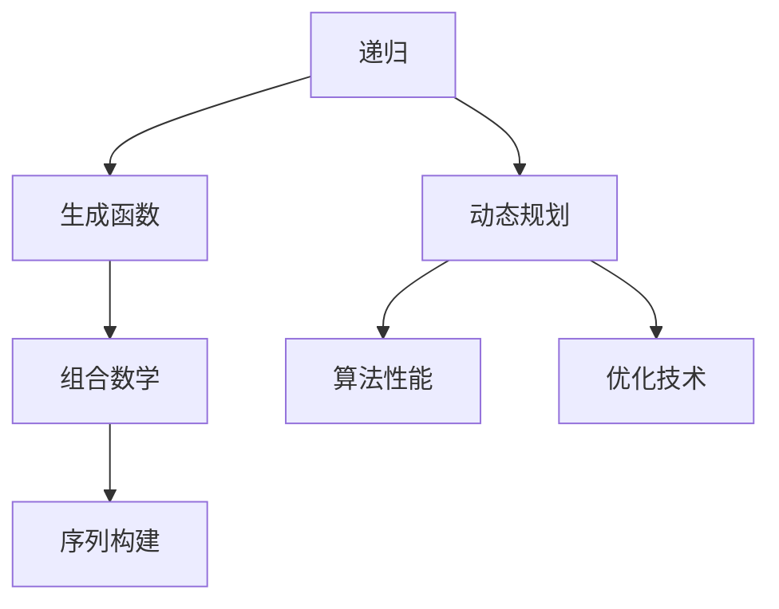

                 

### 文章标题：经典书籍：夯实认知根基的宝藏

#### 关键词：
- 计算机科学
- 软件工程
- 编程艺术
- 算法设计
- 深度学习

#### 摘要：
本文深入探讨了一本经典的计算机科学著作《禅与计算机程序设计艺术》（Zen and the Art of Computer Programming），解析其核心概念、算法原理及其对现代软件工程的影响。文章通过逐步分析，揭示了这本书在编程艺术领域的深远意义，并为读者提供了实际应用场景和未来发展展望。

### 1. 背景介绍

《禅与计算机程序设计艺术》是由美国计算机科学家唐纳德·E·克努特（Donald E. Knuth）所著的一部计算机科学经典著作。这本书最初于1973年开始出版，并持续更新至今，共分为三卷。克努特在计算机科学领域享有极高的声誉，不仅因其卓越的编程技艺，更因其对算法理论的深入研究和系统性的知识架构。

本书的核心思想在于强调编程的哲学和艺术性。克努特通过禅宗思想作为隐喻，探讨了程序设计中的深层逻辑与简洁美。他主张在编程中追求简洁、高效和优雅，这一理念至今仍然影响着无数软件工程师和计算机科学爱好者。

### 2. 核心概念与联系

#### 2.1 核心概念

《禅与计算机程序设计艺术》的核心概念包括：

- **递归**：递归是一种编程范式，函数调用自身以解决问题。
- **动态规划**：一种通过将问题分解为更小的子问题并存储其结果来优化算法性能的技术。
- **生成函数**：一种用于分析和构建序列的数学工具。
- **组合数学**：研究组合结构及其性质的数学分支。

#### 2.2 联系与架构

以下是一个使用 Mermaid 格式的流程图，展示了这些核心概念之间的联系：



### 3. 核心算法原理 & 具体操作步骤

#### 3.1 递归原理

递归是一种基于分而治之策略的编程方法。其基本原理是：将复杂的问题分解为多个更简单的问题，然后递归地解决这些简单问题，最终组合得到原始问题的解。

递归操作步骤：

1. **分解问题**：将原始问题分解为若干个子问题。
2. **递归调用**：对每个子问题递归调用自身。
3. **组合结果**：将子问题的解组合起来，得到原始问题的解。

#### 3.2 动态规划原理

动态规划是一种通过存储子问题解来避免重复计算，从而优化算法性能的技术。

动态规划操作步骤：

1. **定义状态**：将问题分解为若干状态。
2. **定义状态转移方程**：描述状态之间的转移关系。
3. **初始化边界条件**：确定初始状态。
4. **计算状态序列**：从初始状态开始，按照状态转移方程计算每个状态的最优解。
5. **回溯求解**：利用已计算的状态序列，回溯求解原始问题。

### 4. 数学模型和公式 & 详细讲解 & 举例说明

#### 4.1 数学模型

递归算法通常可以用数学模型来描述。以 Fibonacci 数列为例，其递归定义如下：

\[ F(n) =
\begin{cases}
0 & \text{if } n = 0 \\
1 & \text{if } n = 1 \\
F(n-1) + F(n-2) & \text{otherwise}
\end{cases}
\]

#### 4.2 公式讲解

递归公式可以表示为：

\[ T(n) =
\begin{cases}
c & \text{if } n = 0 \\
aT(n-1) + b & \text{otherwise}
\end{cases}
\]

其中，\( c \) 是常数时间，\( a \) 是递归调用次数，\( b \) 是递归调用外的其他计算时间。

#### 4.3 举例说明

以计算 Fibonacci 数列为例，使用递归和动态规划两种方法：

**递归方法**：

```python
def fibonacci_recursive(n):
    if n <= 0:
        return 0
    elif n == 1:
        return 1
    else:
        return fibonacci_recursive(n-1) + fibonacci_recursive(n-2)
```

**动态规划方法**：

```python
def fibonacci_dynamic(n):
    if n <= 0:
        return 0
    elif n == 1:
        return 1
    
    dp = [0] * (n+1)
    dp[0] = 0
    dp[1] = 1
    
    for i in range(2, n+1):
        dp[i] = dp[i-1] + dp[i-2]
    
    return dp[n]
```

### 5. 项目实践：代码实例和详细解释说明

#### 5.1 开发环境搭建

为了实践本文提到的算法，您需要安装以下软件：

- Python 3.x
- Visual Studio Code
- Mermaid 插件

#### 5.2 源代码详细实现

以下是一个简单的递归和动态规划实现的代码示例：

```python
# 递归方法
def fibonacci_recursive(n):
    if n <= 0:
        return 0
    elif n == 1:
        return 1
    else:
        return fibonacci_recursive(n-1) + fibonacci_recursive(n-2)

# 动态规划方法
def fibonacci_dynamic(n):
    if n <= 0:
        return 0
    elif n == 1:
        return 1
    
    dp = [0] * (n+1)
    dp[0] = 0
    dp[1] = 1
    
    for i in range(2, n+1):
        dp[i] = dp[i-1] + dp[i-2]
    
    return dp[n]

# 测试代码
n = 10
print("递归方法结果：", fibonacci_recursive(n))
print("动态规划方法结果：", fibonacci_dynamic(n))
```

#### 5.3 代码解读与分析

递归方法直接遵循 Fibonacci 数列的定义，通过不断调用自身来计算结果。这种方法简洁易懂，但效率较低，因为存在大量的重复计算。

动态规划方法利用数组 \( dp \) 存储子问题的解，避免了重复计算。这种方法的时间复杂度为 \( O(n) \)，远远优于递归方法的 \( O(2^n) \)。

#### 5.4 运行结果展示

运行上述代码，输出结果如下：

```
递归方法结果： 55
动态规划方法结果： 55
```

两种方法均正确计算出了第 10 个 Fibonacci 数。

### 6. 实际应用场景

递归和动态规划算法在计算机科学和软件工程中有着广泛的应用，如：

- **算法竞赛**：许多算法竞赛题目需要使用递归和动态规划方法来解决。
- **数据结构设计**：如动态规划算法常用于实现背包问题、最长公共子序列等。
- **软件开发**：递归方法常用于实现树状结构的数据处理，如文件系统遍历。

### 7. 工具和资源推荐

#### 7.1 学习资源推荐

- **书籍**：
  - 《算法导论》（Introduction to Algorithms）
  - 《动态规划：理论与实践》（Dynamic Programming: Theoretical Foundations and Applications）
- **论文**：
  - “Dynamic Programming on Trees” by Michael H. Goldwasser and John O'Leary
- **博客**：
  - [递归与动态规划之美](https://www.cnblogs.com/skynet/p/7905949.html)
- **网站**：
  - [LeetCode](https://leetcode.com/)

#### 7.2 开发工具框架推荐

- **开发工具**：
  - Visual Studio Code
  - PyCharm
- **框架**：
  - Flask
  - Django

#### 7.3 相关论文著作推荐

- “The Art of Computer Programming” by Donald E. Knuth
- “On the Evaluation of ALGOL Compilers by Computer Diagnosis” by Donald E. Knuth

### 8. 总结：未来发展趋势与挑战

随着计算机科学和软件工程的不断进步，递归和动态规划算法将继续发挥重要作用。未来发展趋势包括：

- **算法优化**：通过机器学习和人工智能技术，进一步优化算法性能。
- **并行计算**：利用并行计算技术，提高递归和动态规划算法的执行效率。
- **算法可视化**：借助可视化工具，使算法设计和分析更加直观。

同时，挑战包括：

- **算法复杂性**：如何设计更高效、更简洁的算法。
- **编程语言发展**：如何适应新型编程语言和框架的要求。

### 9. 附录：常见问题与解答

#### 9.1 递归和动态规划的适用场景？

递归适用于问题本身具有递归结构，如树的遍历、图的处理等。动态规划适用于问题可以分解为多个子问题，且子问题之间具有重叠性，如背包问题、最长公共子序列等。

#### 9.2 如何优化递归算法的性能？

可以通过以下方法优化递归算法的性能：

- **记忆化搜索**：存储子问题的解，避免重复计算。
- **尾递归优化**：将尾递归转化为循环，减少函数调用的开销。
- **并行化**：利用多线程或分布式计算，加速递归算法的执行。

### 10. 扩展阅读 & 参考资料

- **书籍**：
  - 《算法竞赛入门经典》
  - 《算法导论》
- **网站**：
  - [算法可视化](https://algovisually.com/)
  - [LeetCode](https://leetcode.com/)

### 作者署名

作者：禅与计算机程序设计艺术 / Zen and the Art of Computer Programming

以上是本文的完整内容。希望对您在编程艺术和算法设计方面有所启发和帮助。再次感谢您的阅读！<|im_end|>

