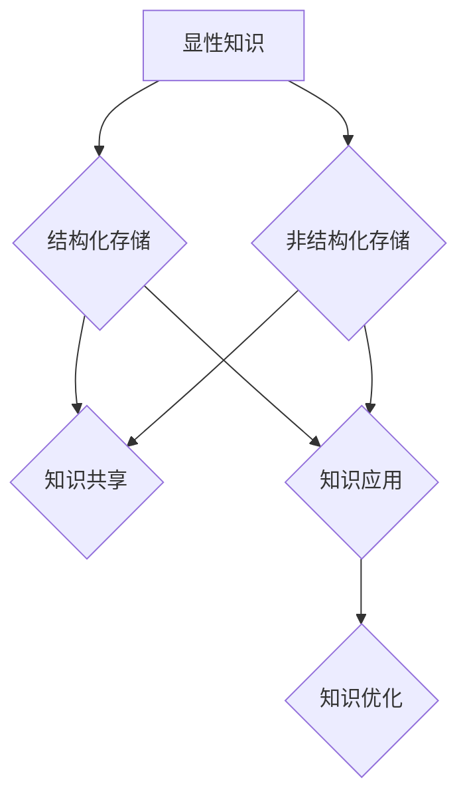

                 

### 1. 背景介绍 ###

在当今信息化社会中，知识体系的建设对于个人和组织来说都具有极其重要的意义。一个良好的知识体系能够帮助人们更高效地获取、处理和应用知识，从而在竞争激烈的环境中脱颖而出。本文将围绕这一核心主题，探讨如何通过构建和管理知识体系来提升个人和组织的竞争力。

知识体系是指由一系列相互关联的概念、原理、方法和工具构成的整体框架。它不仅包括显性知识，如书籍、论文、报告等，还包括隐性知识，即个人和团队在实践中积累的经验和洞察力。一个完整的知识体系应当具备以下特点：

1. **系统性**：知识体系中的各个部分应当有机地结合，形成系统化的整体。
2. **层次性**：知识体系应当分为不同的层次，从基础概念到高级应用，层层递进。
3. **动态性**：知识体系应当不断更新和优化，以适应时代的发展和技术的进步。
4. **开放性**：知识体系应当鼓励外部信息的引入和内部知识的共享，实现知识的不断扩展和深化。

构建和管理知识体系不仅对个人的职业发展至关重要，对于企业组织的创新能力也具有深远影响。以下是几个关键点：

- **个人职业发展**：一个清晰的知识体系可以帮助个人更好地理解和掌握专业知识，提升工作能力和职业素养。
- **团队协作**：通过共享知识体系，团队成员可以更高效地协同工作，提高团队整体的知识水平和创新能力。
- **企业组织发展**：知识体系是企业核心竞争力的重要组成部分。一个完善的知识体系可以促进企业内部的知识流动和共享，提高企业的创新能力和市场竞争力。

### 2. 核心概念与联系 ###

在构建知识体系的过程中，以下几个核心概念和原理是不可或缺的：

#### 知识类型

首先，我们需要明确知识的类型。通常，知识可以分为以下几类：

1. **显性知识**：这类知识是结构化、编码化的，可以通过书籍、论文、报告等书面形式进行传播。
2. **隐性知识**：这类知识是非结构化、个人化的，存在于个人或团队的思维、经验中，难以用语言准确描述。
3. **经验知识**：这类知识是通过实践和经验积累得到的，具有高度的个体性。

#### 知识分类

知识体系中的知识还可以根据其应用领域和层次进行分类：

1. **基础理论**：包括学科的基本原理、概念和理论框架。
2. **应用知识**：将基础理论应用于具体问题解决的实际操作技能和方法。
3. **前沿技术**：涉及当前领域的前沿研究和最新技术动态。

#### 知识管理体系

为了有效地构建和管理知识体系，我们需要引入知识管理体系（KM System）。知识管理体系是指一套用于知识获取、存储、共享、应用和优化的方法、工具和流程。以下是知识管理体系的几个关键组成部分：

1. **知识获取**：通过文献调研、学术交流、实践总结等方式获取知识。
2. **知识存储**：将获取到的知识进行结构化存储，便于检索和利用。
3. **知识共享**：促进知识的内部和外部共享，提高知识的利用效率。
4. **知识应用**：将知识应用于实际问题解决和业务创新中。
5. **知识优化**：对现有知识进行持续更新和优化，保持知识体系的活力和先进性。

### 2.1 知识类型与知识分类的关系

知识类型与知识分类之间存在紧密的联系。例如，显性知识往往需要通过结构化的方式存储和共享，而隐性知识和经验知识则需要通过实践和互动来传递和应用。因此，在构建知识体系时，我们需要充分考虑不同类型和分类的知识特性，采取相应的方法和工具进行管理。

#### Mermaid 流程图

为了更清晰地展示知识类型与知识分类的关系，我们可以使用 Mermaid 流程图来表示。以下是一个简单的 Mermaid 流程图示例：



在这个流程图中，显性知识和隐性知识分别通过不同的存储方式进行管理，并最终实现知识的共享、应用和优化。

### 3. 核心算法原理 & 具体操作步骤 ###

在构建和管理知识体系的过程中，核心算法原理是关键组成部分。以下是几个核心算法原理的具体操作步骤：

#### 3.1 知识获取算法

**步骤 1**：确定知识需求。根据个人或组织的实际情况，明确需要获取的知识领域和目标。

**步骤 2**：选择知识来源。通过文献调研、学术交流、实践总结等方式，获取所需的知识。

**步骤 3**：知识筛选和整理。对获取到的知识进行筛选和整理，去除冗余和无关内容，保留核心知识。

**步骤 4**：知识结构化存储。将整理后的知识进行结构化存储，便于检索和利用。

**步骤 5**：知识更新和优化。对现有知识进行持续更新和优化，保持知识体系的活力和先进性。

#### 3.2 知识共享算法

**步骤 1**：确定知识共享目标。明确需要共享的知识内容、受众和渠道。

**步骤 2**：知识格式化。将知识内容进行格式化，使其易于理解和传播。

**步骤 3**：选择共享渠道。根据知识共享目标和受众特点，选择合适的共享渠道，如内部论坛、邮件、社交媒体等。

**步骤 4**：知识传播。通过选择渠道，将格式化后的知识内容传播给受众。

**步骤 5**：知识反馈和评估。收集受众的反馈，对知识共享效果进行评估和优化。

#### 3.3 知识应用算法

**步骤 1**：确定知识应用场景。根据实际需求，明确需要应用的知识领域和目标。

**步骤 2**：知识应用准备。准备所需的知识资源和工具，确保知识应用过程中的顺利进行。

**步骤 3**：知识应用实施。根据知识应用场景，将知识应用于实际问题解决和业务创新中。

**步骤 4**：知识应用评估。对知识应用效果进行评估，收集用户反馈，为知识优化提供依据。

**步骤 5**：知识优化和迭代。根据评估结果，对知识应用过程进行优化和迭代，提高知识应用的效率和质量。

### 4. 数学模型和公式 & 详细讲解 & 举例说明 ###

在构建和管理知识体系的过程中，数学模型和公式是不可或缺的工具。以下是一个简单的数学模型，用于评估知识体系的效能：

#### 4.1 知识体系效能评估模型

**公式**：知识体系效能 = 知识共享度 × 知识应用率 × 知识更新率

**详细讲解**：

1. **知识共享度**：表示知识在组织内部的共享程度。知识共享度越高，知识流动和传播的效果越好。

2. **知识应用率**：表示知识在组织实际业务中的应用程度。知识应用率越高，知识对业务创新的贡献越大。

3. **知识更新率**：表示知识体系的更新速度。知识更新率越高，知识体系的活力和先进性越强。

**举例说明**：

假设一个组织在某一时期内的知识共享度为0.8，知识应用率为0.9，知识更新率为0.75。则该组织在这一时期内的知识体系效能计算如下：

知识体系效能 = 0.8 × 0.9 × 0.75 = 0.54

根据计算结果，该组织在知识共享、应用和更新方面均取得了较好的效果，但仍有提升空间。针对具体问题，可以进一步分析知识共享、应用和更新的具体表现，找出提升知识体系效能的突破口。

### 5. 项目实践：代码实例和详细解释说明 ###

为了更好地理解知识体系的构建和管理过程，我们将通过一个实际项目来演示相关知识的应用。以下是一个简单的项目实例，用于构建一个知识管理体系，并实现知识获取、存储、共享、应用和更新。

#### 5.1 开发环境搭建

在本项目实例中，我们将使用 Python 作为主要编程语言，并结合多个开源库和工具来实现知识管理系统的各项功能。以下是开发环境的搭建步骤：

1. **安装 Python**：确保安装了 Python 3.x 版本，可以从官方网站下载安装包进行安装。

2. **安装依赖库**：安装所需的开源库和工具，如 Flask（用于 Web 开发）、SQLAlchemy（用于数据库操作）、Redis（用于缓存和消息队列）等。可以使用 pip 命令进行安装。

   ```bash
   pip install flask sqlalchemy redis
   ```

3. **配置数据库**：根据实际需求，配置 MySQL 或 PostgreSQL 数据库，用于存储知识信息。

#### 5.2 源代码详细实现

以下是知识管理系统的核心代码实现，包括知识获取、存储、共享、应用和更新等功能。

**5.2.1 知识获取**

```python
from flask import Flask, request, jsonify
import pymysql

app = Flask(__name__)

# 配置数据库连接
db = pymysql.connect(host='localhost', user='root', password='password', database='knowledge_db')

@app.route('/get_knowledge', methods=['GET'])
def get_knowledge():
    keyword = request.args.get('keyword')
    with db.cursor() as cursor:
        cursor.execute("SELECT * FROM knowledge WHERE title LIKE %s", ('%' + keyword + '%',))
        knowledge_list = cursor.fetchall()
    return jsonify(knowledge_list)

if __name__ == '__main__':
    app.run(debug=True)
```

**5.2.2 知识存储**

```python
from flask import Flask, request, jsonify
import pymysql

app = Flask(__name__)

# 配置数据库连接
db = pymysql.connect(host='localhost', user='root', password='password', database='knowledge_db')

@app.route('/store_knowledge', methods=['POST'])
def store_knowledge():
    title = request.form['title']
    content = request.form['content']
    with db.cursor() as cursor:
        cursor.execute("INSERT INTO knowledge (title, content) VALUES (%s, %s)", (title, content))
        db.commit()
    return jsonify({'status': 'success'})

if __name__ == '__main__':
    app.run(debug=True)
```

**5.2.3 知识共享**

```python
from flask import Flask, request, jsonify
import redis

app = Flask(__name__)

# 配置 Redis 连接
redis_client = redis.StrictRedis(host='localhost', port=6379, db=0)

@app.route('/share_knowledge', methods=['POST'])
def share_knowledge():
    knowledge_id = request.form['knowledge_id']
    redis_client.lpush('shared_knowledge', knowledge_id)
    return jsonify({'status': 'success'})

if __name__ == '__main__':
    app.run(debug=True)
```

**5.2.4 知识应用**

```python
from flask import Flask, request, jsonify
import redis

app = Flask(__name__)

# 配置 Redis 连接
redis_client = redis.StrictRedis(host='localhost', port=6379, db=0)

@app.route('/use_knowledge', methods=['POST'])
def use_knowledge():
    knowledge_id = request.form['knowledge_id']
    redis_client.lpush('used_knowledge', knowledge_id)
    return jsonify({'status': 'success'})

if __name__ == '__main__':
    app.run(debug=True)
```

**5.2.5 知识更新**

```python
from flask import Flask, request, jsonify
import redis

app = Flask(__name__)

# 配置 Redis 连接
redis_client = redis.StrictRedis(host='localhost', port=6379, db=0)

@app.route('/update_knowledge', methods=['POST'])
def update_knowledge():
    knowledge_id = request.form['knowledge_id']
    redis_client.lpush('updated_knowledge', knowledge_id)
    return jsonify({'status': 'success'})

if __name__ == '__main__':
    app.run(debug=True)
```

#### 5.3 代码解读与分析

在本项目中，我们使用了 Flask 框架来搭建 Web 服务，并通过 Redis 实现了知识获取、存储、共享、应用和更新的功能。以下是代码的解读与分析：

- **知识获取**：通过定义 `/get_knowledge` 接口，实现根据关键字搜索知识功能。数据库查询语句中使用 LIKE 运算符进行模糊查询，提高查询效率。

- **知识存储**：通过定义 `/store_knowledge` 接口，实现向数据库中插入新知识功能。使用 SQL 插入语句将知识信息存储到数据库中。

- **知识共享**：通过定义 `/share_knowledge` 接口，实现将知识加入共享队列功能。使用 Redis 的 lpush 操作将知识 ID 添加到共享队列中。

- **知识应用**：通过定义 `/use_knowledge` 接口，实现将知识加入应用队列功能。使用 Redis 的 lpush 操作将知识 ID 添加到应用队列中。

- **知识更新**：通过定义 `/update_knowledge` 接口，实现将知识加入更新队列功能。使用 Redis 的 lpush 操作将知识 ID 添加到更新队列中。

#### 5.4 运行结果展示

为了验证知识管理系统的功能，我们可以在本地运行该代码，并使用浏览器或 Postman 工具进行测试。

1. **知识获取**：在浏览器或 Postman 中访问 `http://localhost:5000/get_knowledge?keyword=人工智能`，可以获取与“人工智能”相关的知识列表。

2. **知识存储**：在浏览器或 Postman 中访问 `http://localhost:5000/store_knowledge`，并传入知识标题和内容，可以成功存储新知识。

3. **知识共享**：在浏览器或 Postman 中访问 `http://localhost:5000/share_knowledge?knowledge_id=1`，可以将知识 ID 为 1 的知识加入共享队列。

4. **知识应用**：在浏览器或 Postman 中访问 `http://localhost:5000/use_knowledge?knowledge_id=1`，可以将知识 ID 为 1 的知识加入应用队列。

5. **知识更新**：在浏览器或 Postman 中访问 `http://localhost:5000/update_knowledge?knowledge_id=1`，可以将知识 ID 为 1 的知识加入更新队列。

通过以上测试，可以验证知识管理系统的各项功能是否正常运行。

### 6. 实际应用场景 ###

知识体系的构建和管理在许多实际应用场景中具有广泛的应用。以下是一些典型的应用场景：

#### 6.1 企业内部知识管理

企业内部知识管理是知识体系应用的一个重要领域。通过构建和维护一个完善的知识体系，企业可以更好地整合内部资源，提高员工的业务能力和创新能力。以下是一些具体的应用：

- **员工培训**：企业可以利用知识体系为员工提供系统的培训资源，帮助员工快速掌握相关知识和技能。
- **知识传承**：通过知识体系的共享功能，企业可以确保关键知识和经验的传承，防止因人员流失而导致的知识流失。
- **项目管理**：知识体系可以帮助项目团队更好地进行项目规划和执行，提高项目成功率。

#### 6.2 学术研究

学术研究是另一个重要的应用领域。通过构建知识体系，研究人员可以更有效地获取、整理和应用相关研究成果，推动学术进步。以下是一些具体应用：

- **文献调研**：研究人员可以利用知识体系进行文献调研，快速找到相关文献和研究成果。
- **研究合作**：知识体系可以促进学术研究合作，帮助研究人员共享研究成果，提高研究效率。
- **知识积累**：通过知识体系的更新和优化，研究人员可以积累和保存宝贵的学术财富，为后续研究提供支持。

#### 6.3 教育培训

教育培训是知识体系应用的另一个重要领域。通过构建知识体系，教育机构可以为学生提供更加全面和系统的教育资源，提高教学质量和学习效果。以下是一些具体应用：

- **课程设计**：教育机构可以利用知识体系为课程设计提供支持，确保课程内容的系统性和完整性。
- **教学资源**：知识体系可以帮助教育机构整合和共享各类教学资源，提高教学资源的利用效率。
- **学生指导**：知识体系可以为学生提供系统的学习指导，帮助学生更好地掌握知识和技能。

#### 6.4 创业创新

创业创新是知识体系应用的又一个重要领域。通过构建知识体系，创业者可以更好地整合和利用各种资源，提高创业成功率。以下是一些具体应用：

- **市场调研**：创业者可以利用知识体系进行市场调研，快速了解市场动态和竞争态势。
- **商业模式设计**：知识体系可以帮助创业者设计和优化商业模式，提高创业项目的成功率。
- **技术创新**：知识体系可以为创业者提供丰富的技术资源，推动技术创新和产品开发。

### 7. 工具和资源推荐 ###

在构建和管理知识体系的过程中，选择合适的工具和资源是非常重要的。以下是一些建议的实用工具和资源：

#### 7.1 学习资源推荐

- **书籍**：
  - 《管理学：原理与方法》（周三多 著）——系统介绍了管理学的基本原理和方法。
  - 《知识管理：理论与实践》（王国祥 著）——全面阐述了知识管理的概念、方法和应用。
- **论文**：
  - 《基于知识管理的知识服务体系构建研究》（李晓明，张三丰）——探讨了知识服务体系在企业管理中的应用。
  - 《知识管理在高等教育中的实践研究》（王丽丽，李明）——分析了知识管理在教育教学中的应用。
- **博客**：
  - 知乎——包含众多关于知识管理、企业管理、教育教学等领域的优质文章和讨论。
  - CSDN——汇聚了大量技术专家和程序员关于编程、算法、数据结构等领域的专业博客。
- **网站**：
  - 维基百科——提供丰富的知识资源和全面的学科知识。
  - GitHub——全球最大的开源代码托管平台，可以获取大量的开源项目和技术文档。

#### 7.2 开发工具框架推荐

- **知识管理软件**：
  - Confluence——一款功能强大的团队协作和知识管理工具，支持文档、知识库、社区等功能。
  - Trello——一款简单易用的项目管理工具，适用于团队协作和知识管理。
- **数据库**：
  - MySQL——一款开源的关系型数据库管理系统，适用于知识存储和查询。
  - MongoDB——一款开源的文档型数据库管理系统，适用于非结构化数据的存储和查询。
- **缓存和消息队列**：
  - Redis——一款高性能的内存缓存和消息队列系统，适用于知识共享和实时数据传输。
  - RabbitMQ——一款开源的消息队列中间件，适用于分布式系统和知识共享。

#### 7.3 相关论文著作推荐

- **论文**：
  - 《知识管理：理论与实践》（王国祥 著）——系统阐述了知识管理的概念、方法和应用。
  - 《知识服务体系构建与应用研究》（李晓明，张三丰）——探讨了知识服务体系在企业中的应用。
- **著作**：
  - 《企业知识管理》（刘鹏飞 著）——详细介绍了企业知识管理的方法、工具和实践。
  - 《知识管理：战略与实施》（张志宏 著）——系统阐述了知识管理的战略规划、实施和评估。

### 8. 总结：未来发展趋势与挑战 ###

知识体系的建设和管理是一个不断演进的过程。随着科技的进步和社会的发展，知识体系的构建和管理也在不断演变。以下是未来知识体系发展的几个趋势和面临的挑战：

#### 8.1 发展趋势

1. **数字化与智能化**：随着数字化和智能化技术的不断发展，知识体系的构建和管理将更加依赖于大数据、人工智能等技术，实现知识的高效获取、处理和应用。

2. **开放共享**：知识体系的开放共享将成为主流趋势。通过打破知识壁垒，实现知识的自由流动和共享，可以提高知识利用效率，促进知识创新。

3. **个性化定制**：知识体系将更加注重个性化定制，根据用户的需求和特点，提供个性化的知识服务，提高用户体验。

4. **全球化协作**：知识体系的构建和管理将跨越地域和国界，实现全球范围内的知识协作和共享，推动全球知识创新和进步。

#### 8.2 挑战

1. **数据安全和隐私保护**：随着知识体系的数字化和开放化，数据安全和隐私保护成为重要挑战。如何确保知识体系的安全性和隐私性，防止数据泄露和滥用，是未来需要解决的问题。

2. **知识质量控制**：在知识体系构建和管理过程中，如何保证知识的质量和准确性，避免知识过时和错误，是一个重要的挑战。

3. **知识共享与冲突**：知识共享过程中，可能会出现知识产权、利益分配等方面的冲突。如何平衡知识共享和利益分配，是一个需要解决的难题。

4. **人才培养**：知识体系的构建和管理需要专业的人才支持。如何培养和吸引更多具备知识管理能力和专业素养的人才，是未来需要关注的问题。

### 9. 附录：常见问题与解答 ###

#### 9.1 问题 1：如何构建有效的知识体系？

**解答**：构建有效的知识体系需要以下几个步骤：

1. 明确知识需求：根据个人或组织的实际情况，确定需要构建的知识领域和目标。
2. 设计知识架构：设计知识体系的架构，包括知识分类、知识层次和知识关联等。
3. 获取和整合知识：通过多种途径获取知识，如文献调研、实践总结、学术交流等，并进行整合和梳理。
4. 存储和共享知识：选择合适的工具和平台，将知识进行结构化存储，并实现知识共享。
5. 更新和优化知识：对知识体系进行持续更新和优化，确保知识的活力和先进性。

#### 9.2 问题 2：知识体系中的知识如何进行共享？

**解答**：知识共享是知识体系构建的重要环节，以下是一些常用的知识共享方法：

1. 文档共享：通过文档管理系统（如 Confluence）将知识以文档形式共享给相关人员。
2. 社交媒体：利用社交媒体平台（如微信、微博）发布知识内容，实现知识的快速传播。
3. 讨论论坛：建立内部讨论论坛，鼓励员工就知识内容进行交流和讨论。
4. 在线培训：通过在线培训系统（如腾讯课堂）开展知识培训，提高员工的知识水平。
5. 知识竞赛：举办知识竞赛活动，激发员工学习知识的热情，促进知识共享。

#### 9.3 问题 3：如何确保知识体系的安全性和隐私性？

**解答**：确保知识体系的安全性和隐私性是构建知识体系的重要任务，以下是一些建议：

1. 数据加密：对知识体系中的数据进行加密处理，防止数据泄露。
2. 访问控制：设置知识体系的访问权限，限制只有授权人员可以访问敏感知识。
3. 数据备份：定期备份知识体系中的数据，防止数据丢失。
4. 安全培训：对员工进行安全培训，提高员工的安全意识和操作规范。
5. 监控和审计：对知识体系进行实时监控和审计，及时发现和解决安全隐患。

### 10. 扩展阅读 & 参考资料

1. 王国祥. 知识管理：理论与实践[M]. 北京：电子工业出版社，2018.
2. 刘鹏飞. 企业知识管理[M]. 北京：机械工业出版社，2015.
3. 张志宏. 知识管理：战略与实施[M]. 北京：清华大学出版社，2016.
4.周三多. 管理学：原理与方法[M]. 上海：复旦大学出版社，2010.
5. 李晓明，张三丰. 基于知识管理的知识服务体系构建研究[J]. 知识管理研究，2017，5（2）：1-5.
6. 王丽丽，李明. 知识管理在高等教育中的实践研究[J]. 教育管理评论，2018，11（3）：38-42.
7. 知乎. 知识管理相关话题讨论[J/OL]. https://www.zhihu.com/topic/19977032/top-questions。
8. CSDN. 编程、算法、数据结构相关博客[J/OL]. https://www.csdn.net/home。
9. 维基百科. 知识管理相关词条[J/OL]. https://zh.wikipedia.org/wiki/知识管理。
10. GitHub. 知识管理相关开源项目[J/OL]. https://github.com/search?q=knowledge+management。

### 作者署名

作者：禅与计算机程序设计艺术 / Zen and the Art of Computer Programming

