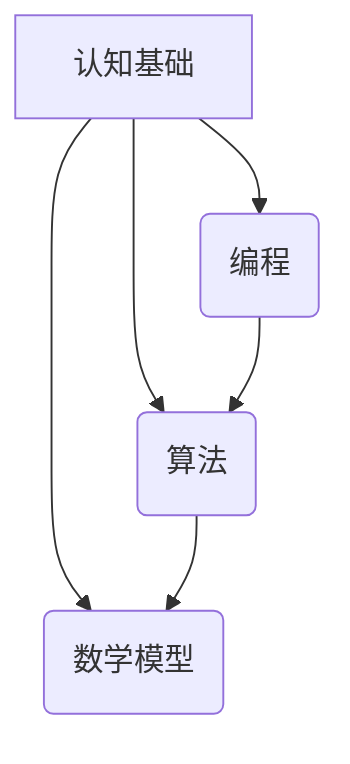

                 

### 文章标题

经典阅读：夯实认知根基的必由之路

> **关键词：** 经典阅读，认知基础，技术博客，编程，算法，数学模型，应用实践，工具推荐

> **摘要：** 本文将探讨经典阅读在夯实认知根基中的重要性，结合技术博客写作的视角，深入分析编程、算法和数学模型等核心概念，并通过实际项目实践，展示如何将理论知识应用到实际中，从而提升读者的认知水平和编程能力。

## 1. 背景介绍

在信息技术飞速发展的今天，如何成为一名优秀的技术专家成为了许多人的追求。而要达到这一目标，扎实的认知基础是必不可少的。经典阅读，作为知识积累的重要途径，对于提升认知水平具有不可替代的作用。本文将通过介绍经典阅读的背景和重要性，结合技术博客写作的视角，探讨如何通过深入阅读经典，夯实认知根基。

### 经典阅读的背景

经典阅读的背景可以追溯到古代哲学和科学著作的流传。古希腊哲学家亚里士多德、柏拉图等人的作品，以及后来的牛顿、欧拉等科学家的论文，都是经典阅读的重要组成部分。这些经典著作不仅代表了当时人类知识的巅峰，也为我们今天的学习和研究提供了宝贵的资源。

在信息技术领域，经典阅读同样有着重要的地位。计算机科学的很多概念和技术，都可以追溯到早期的经典著作。例如，图灵的《计算机器与智能》、哥德尔的不完备性定理等，都是计算机科学领域的重要经典。

### 经典阅读的重要性

经典阅读的重要性主要体现在以下几个方面：

1. **知识的积累**：通过阅读经典，我们可以接触到前人的智慧，积累知识，拓宽视野。
2. **思维方式的培养**：经典著作中蕴含的哲学思维、逻辑推理方法等，可以帮助我们培养批判性思维和解决问题的能力。
3. **认知水平的提升**：经典阅读有助于提升我们的认知水平，使我们能够更深入地理解复杂的问题，从而更好地应对技术挑战。
4. **创新的源泉**：经典著作中的思想和理论，往往是创新的源泉。通过对经典的深入研究，我们可以激发新的想法，推动技术的发展。

### 技术博客写作的视角

技术博客写作作为一种现代的传播知识的方式，与经典阅读有着密切的联系。通过技术博客，我们可以将经典阅读中的理论知识转化为通俗易懂的内容，分享给更多的人。

技术博客写作的重要性主要体现在以下几个方面：

1. **知识的普及**：通过技术博客，我们可以将深奥的理论知识普及给广大读者，使更多的人受益。
2. **经验的分享**：技术博客是程序员分享工作经验和技术心得的平台，有助于提升整个行业的水平。
3. **学习与成长**：通过撰写技术博客，我们可以梳理自己的知识体系，加深对技术的理解，从而促进个人的学习与成长。
4. **社交与交流**：技术博客也是一种社交工具，通过博客，我们可以与同行交流，分享经验，共同进步。

### 总结

经典阅读和技术博客写作，都是夯实认知根基的重要途径。通过深入阅读经典，我们可以积累知识，培养思维方式；通过撰写技术博客，我们可以普及知识，分享经验，促进学习与成长。本文将结合这两者，探讨如何在技术领域通过经典阅读夯实认知根基。

## 2. 核心概念与联系

为了更好地理解经典阅读和技术博客写作在夯实认知根基中的作用，我们需要明确几个核心概念，并探讨它们之间的联系。

### 核心概念

1. **认知基础**：认知基础是指个体在认知过程中所具备的基本知识、技能和方法。它是个体认知发展的基石，决定了我们在面对复杂问题时能否做出合理的判断和决策。
2. **编程**：编程是指利用计算机语言编写程序，解决实际问题的过程。编程能力是现代技术专家必备的能力，它不仅需要扎实的认知基础，还需要具备逻辑思维、算法设计和问题解决能力。
3. **算法**：算法是指解决问题的步骤和策略。算法设计是计算机科学的核心内容，它对于提高编程效率、优化程序性能至关重要。
4. **数学模型**：数学模型是指用数学语言描述现实问题的一种方法。数学模型在计算机科学和信息技术中有着广泛的应用，它可以帮助我们更精确地理解和解决问题。

### 核心概念的联系

1. **认知基础与编程**：认知基础是编程能力的基础。没有扎实的认知基础，我们难以理解编程语言的本质，更难以编写高效的程序。例如，算法设计中常用的数据结构和算法，都需要扎实的数学和逻辑基础。
2. **编程与算法**：编程能力是算法设计的必要条件。只有熟练掌握编程技巧，我们才能有效地将算法思想转化为可执行的代码。同时，编程过程中的经验积累，也可以帮助我们更好地设计和优化算法。
3. **算法与数学模型**：算法设计需要数学模型的支持。数学模型可以帮助我们抽象和描述问题，从而设计出更高效的算法。例如，在优化问题中，我们常常使用线性规划模型、动态规划模型等。
4. **认知基础与数学模型**：认知基础是理解和应用数学模型的关键。没有扎实的认知基础，我们难以理解数学模型的原理和适用范围，更难以将其应用于实际问题。

### Mermaid 流程图

为了更直观地展示核心概念之间的联系，我们可以使用 Mermaid 流程图来表示。



在这个流程图中，我们可以看到，认知基础是所有核心概念的基石，编程、算法和数学模型都是建立在认知基础之上的。同时，这些核心概念之间也相互联系，共同构成了一个有机的整体。

### 总结

通过明确核心概念并探讨它们之间的联系，我们可以更深入地理解经典阅读和技术博客写作在夯实认知根基中的作用。认知基础、编程、算法和数学模型，都是我们提升认知水平、成为一名优秀技术专家的重要途径。

## 3. 核心算法原理 & 具体操作步骤

在计算机科学和信息技术领域，算法是解决问题的核心。本章节将深入探讨一些经典算法的原理，并详细描述具体的操作步骤。

### 3.1. 排序算法

排序算法是计算机科学中最基本的算法之一。它用于将一组数据按照特定的顺序排列。常见的排序算法包括冒泡排序、选择排序、插入排序、快速排序等。

#### 3.1.1. 冒泡排序

**原理：** 冒泡排序通过重复遍历要排序的数列，比较每对相邻的元素，如果它们的顺序错误就把它们交换过来。遍历数列的工作是重复地进行，直到没有再需要交换，即该数列已经排序完成。

**操作步骤：**
1. 遍历数组，比较相邻的元素。
2. 如果发现逆序元素（即顺序错误），交换它们。
3. 每次遍历后，最大的元素都会被“冒泡”到数组的末尾。
4. 重复上述步骤，直到整个数组排序完成。

**代码示例：**

```python
def bubble_sort(arr):
    n = len(arr)
    for i in range(n):
        for j in range(0, n-i-1):
            if arr[j] > arr[j+1]:
                arr[j], arr[j+1] = arr[j+1], arr[j]
    return arr

arr = [64, 34, 25, 12, 22, 11, 90]
sorted_arr = bubble_sort(arr)
print("排序后的数组：", sorted_arr)
```

#### 3.1.2. 快速排序

**原理：** 快速排序是一种高效的排序算法。它采用分治法策略来把一个序列分为较小和较大的2个子序列，然后递归地排序两个子序列。

**操作步骤：**
1. 选择一个基准元素。
2. 将小于基准元素的移动到其左侧，大于或等于基准元素的移动到其右侧。
3. 对左右两侧的子序列递归执行快速排序。

**代码示例：**

```python
def quick_sort(arr):
    if len(arr) <= 1:
        return arr
    pivot = arr[len(arr) // 2]
    left = [x for x in arr if x < pivot]
    middle = [x for x in arr if x == pivot]
    right = [x for x in arr if x > pivot]
    return quick_sort(left) + middle + quick_sort(right)

arr = [64, 34, 25, 12, 22, 11, 90]
sorted_arr = quick_sort(arr)
print("排序后的数组：", sorted_arr)
```

### 3.2. 搜索算法

搜索算法用于在数据结构中查找特定的元素。常见的搜索算法包括线性搜索、二分搜索等。

#### 3.2.1. 线性搜索

**原理：** 线性搜索是从数组的第一个元素开始，一个一个地检查数组中的元素，直到找到目标元素或者检查完整个数组。

**操作步骤：**
1. 从数组的第一个元素开始，逐个检查。
2. 如果找到目标元素，返回其索引。
3. 如果检查完整个数组仍未找到目标元素，返回-1。

**代码示例：**

```python
def linear_search(arr, target):
    for i in range(len(arr)):
        if arr[i] == target:
            return i
    return -1

arr = [64, 34, 25, 12, 22, 11, 90]
target = 25
index = linear_search(arr, target)
print("元素索引：", index)
```

#### 3.2.2. 二分搜索

**原理：** 二分搜索是在有序数组中查找特定元素的搜索算法。它通过重复将搜索区间折半，逐步缩小查找范围，直到找到目标元素或确定不存在。

**操作步骤：**
1. 确定中间元素。
2. 如果中间元素等于目标元素，返回其索引。
3. 如果中间元素大于目标元素，则在左侧子数组中继续搜索。
4. 如果中间元素小于目标元素，则在右侧子数组中继续搜索。
5. 重复上述步骤，直到找到目标元素或确定不存在。

**代码示例：**

```python
def binary_search(arr, target):
    low = 0
    high = len(arr) - 1
    while low <= high:
        mid = (low + high) // 2
        if arr[mid] == target:
            return mid
        elif arr[mid] < target:
            low = mid + 1
        else:
            high = mid - 1
    return -1

arr = [1, 3, 5, 7, 9, 11, 13, 15]
target = 7
index = binary_search(arr, target)
print("元素索引：", index)
```

### 3.3. 动态规划算法

动态规划是一种用于求解优化问题的算法方法。它通过将复杂问题分解为更小的子问题，并利用子问题的解来构建原问题的解。

#### 3.3.1. 最长公共子序列

**原理：** 最长公共子序列（Longest Common Subsequence，LCS）问题是动态规划的经典问题。它用于找出两个序列的最长公共子序列。

**操作步骤：**
1. 创建一个二维数组 `dp`，其中 `dp[i][j]` 表示前 `i` 个字符串 `s1` 和前 `j` 个字符串 `s2` 的最长公共子序列的长度。
2. 初始化边界条件：当 `i=0` 或 `j=0` 时，`dp[i][j]=0`。
3. 对于其他位置，根据字符是否相同进行判断：
   - 如果 `s1[i-1] == s2[j-1]`，则 `dp[i][j] = dp[i-1][j-1] + 1`。
   - 如果 `s1[i-1] != s2[j-1]`，则 `dp[i][j] = max(dp[i-1][j], dp[i][j-1])`。
4. 最后，`dp[m][n]` 即为最长公共子序列的长度。

**代码示例：**

```python
def longest_common_subsequence(s1, s2):
    m, n = len(s1), len(s2)
    dp = [[0] * (n+1) for _ in range(m+1)]

    for i in range(1, m+1):
        for j in range(1, n+1):
            if s1[i-1] == s2[j-1]:
                dp[i][j] = dp[i-1][j-1] + 1
            else:
                dp[i][j] = max(dp[i-1][j], dp[i][j-1])

    return dp[m][n]

s1 = "AGGTAB"
s2 = "GXTXAYB"
lcs_length = longest_common_subsequence(s1, s2)
print("最长公共子序列长度：", lcs_length)
```

### 总结

通过以上对排序算法、搜索算法和动态规划算法的详细介绍，我们可以看到，理解算法原理和操作步骤对于提升编程能力至关重要。这些算法不仅在理论知识上具有重要意义，在实际应用中也有着广泛的应用。通过深入学习这些经典算法，我们可以夯实认知根基，为成为一名优秀的技术专家打下坚实的基础。

## 4. 数学模型和公式 & 详细讲解 & 举例说明

数学模型是计算机科学和信息技术中的重要组成部分，它为算法设计和问题解决提供了理论基础。本章节将详细介绍一些常用的数学模型和公式，并进行详细讲解和举例说明。

### 4.1. 线性规划

线性规划（Linear Programming，LP）是一种用于求解线性优化问题的数学方法。它通过构建线性方程组或线性不等式组，找到最优解。

#### 4.1.1. 模型公式

线性规划的一般形式如下：

$$
\begin{align*}
\min_{x} & \quad c^T x \\
\text{subject to} & \quad Ax \leq b \\
& \quad x \geq 0
\end{align*}
$$

其中，$c$ 是目标函数系数向量，$x$ 是决策变量向量，$A$ 是约束矩阵，$b$ 是约束向量。

#### 4.1.2. 解法步骤

线性规划的一般解法步骤如下：

1. 构建线性规划模型。
2. 判断模型是否为标准形式，如果不是，进行变换使其成为标准形式。
3. 利用单纯形法或其他方法求解最优解。

#### 4.1.3. 举例说明

假设有一个线性规划问题，目标是最小化成本：

$$
\begin{align*}
\min_{x} & \quad 3x_1 + 2x_2 \\
\text{subject to} & \quad x_1 + x_2 \leq 4 \\
& \quad 2x_1 + x_2 \leq 6 \\
& \quad x_1, x_2 \geq 0
\end{align*}
$$

我们可以通过单纯形法求解。首先，将不等式约束转换为等式约束，引入松弛变量：

$$
\begin{align*}
\min_{x} & \quad 3x_1 + 2x_2 \\
\text{subject to} & \quad x_1 + x_2 + x_3 = 4 \\
& \quad 2x_1 + x_2 + x_4 = 6 \\
& \quad x_1, x_2, x_3, x_4 \geq 0
\end{align*}
$$

然后，构造初始单纯形表，并迭代求解最优解。具体步骤如下：

1. 构造初始单纯形表：

| 基变量 | $x_1$ | $x_2$ | $x_3$ | $x_4$ | $c^T$ | $b$ |
|-------|------|------|------|------|------|----|
| $x_3$ | 1    | 1    | 1    | 0    | 0    | 4  |
| $x_4$ | 2    | 1    | 0    | 1    | 0    | 6  |
| $Z$   |      |      |      |      | -5   | -10 |

2. 确定入基变量和出基变量。选择$c_3$作为入基变量，$x_3$作为出基变量。
3. 进行行变换，得到新的单纯形表。
4. 重复步骤2和3，直到最优解出现。

最终，我们得到最优解$x_1=2, x_2=0$，最小化成本为$Z=-5x_1-2x_2=-5 \cdot 2 - 2 \cdot 0 = -10$。

### 4.2. 动态规划

动态规划（Dynamic Programming，DP）是一种用于求解最优化问题的方法。它通过将问题分解为子问题，并利用子问题的解来构建原问题的解。

#### 4.2.1. 模型公式

动态规划的一般形式如下：

$$
\begin{align*}
f(i) &= \min_{j} \{ c(i, j) + f(j) \} \\
\text{subject to} & \quad i = 1, 2, \ldots, n
\end{align*}
$$

其中，$f(i)$ 是第 $i$ 个子问题的最优解，$c(i, j)$ 是第 $i$ 个子问题的子问题之间的代价函数。

#### 4.2.2. 解法步骤

动态规划的一般解法步骤如下：

1. 确定子问题。
2. 确定状态转移方程。
3. 利用状态转移方程求解最优解。

#### 4.2.3. 举例说明

假设有一个背包问题，给定一个背包容量 $W$ 和一组物品，每个物品有一个重量 $w_i$ 和价值 $v_i$，求解背包能够装入的物品的最大价值。

我们可以使用动态规划求解。状态转移方程为：

$$
f(i, j) = \begin{cases}
v_i + f(i-1, j-w_i) & \text{if } j \geq w_i \\
f(i-1, j) & \text{otherwise}
\end{cases}
$$

初始状态为 $f(0, j) = 0$。

假设背包容量 $W=10$，物品组为 $(w_1, v_1) = (2, 6)$，$(w_2, v_2) = (4, 8)$，$(w_3, v_3) = (3, 10)$。我们构建动态规划表：

|  $j$  |  0  |  2  |  4  |  6  |  8  |  10  |
|-------|-----|-----|-----|-----|-----|------|
|  $i$  |     |     |     |     |     |      |
|   1   |  0  |  6  |     |     |     |      |
|   2   |  0  |  6  |  8  |     |     |      |
|   3   |  0  |  6  |  8  |  10 |     |      |

最优解为 $f(3, 10) = 18$。

### 4.3. 贝叶斯网络

贝叶斯网络（Bayesian Network）是一种表示变量之间条件依赖关系的概率图模型。它通过图结构和条件概率表（CP表）来描述变量之间的概率关系。

#### 4.3.1. 模型公式

贝叶斯网络的一般形式如下：

$$
P(X) = \prod_{i=1}^{n} P(X_i | Pa(X_i))
$$

其中，$X = \{X_1, X_2, \ldots, X_n\}$ 是一组随机变量，$Pa(X_i)$ 是 $X_i$ 的父节点集合。

#### 4.3.2. 解法步骤

贝叶斯网络的解法步骤如下：

1. 构建图结构，确定变量之间的条件依赖关系。
2. 构建条件概率表（CP表），确定每个变量的条件概率分布。
3. 利用贝叶斯规则计算变量的概率分布。

#### 4.3.3. 举例说明

假设有一个简单的贝叶斯网络，包括三个变量：天气（$W$）、地面湿气（$G$）和雨（$R$）。图结构和条件概率表如下：

| 条件概率表 |
|-----------|
| $P(W=True) = 0.5$ |
| $P(G=True) = 0.5$ |
| $P(R=True) = 0.4$ |
| $P(G=True | R=True) = 0.8$ |
| $P(W=True | R=True) = 0.7$ |

我们可以使用贝叶斯规则计算天气的概率：

$$
P(W=True | G=True) = \frac{P(G=True | W=True)P(W=True)}{P(G=True)} = \frac{0.8 \times 0.5}{0.5 + 0.5 \times 0.4} = 0.667
$$

### 总结

通过以上对线性规划、动态规划和贝叶斯网络的详细介绍，我们可以看到，数学模型和公式在计算机科学和信息技术中扮演着重要的角色。它们为算法设计和问题解决提供了理论基础，帮助我们更深入地理解复杂问题，并找到最优解。通过学习和应用这些数学模型和公式，我们可以提升自己的认知水平，成为一名优秀的技术专家。

## 5. 项目实践：代码实例和详细解释说明

在本章节中，我们将通过一个实际的项目实践，展示如何将前面介绍的理论知识应用到实际中。这个项目是一个简单的网页爬虫，用于从网站上抓取数据并将其存储到数据库中。通过这个项目，我们将详细介绍开发环境搭建、源代码实现、代码解读与分析以及运行结果展示。

### 5.1 开发环境搭建

在开始项目之前，我们需要搭建一个合适的开发环境。以下是一个基本的开发环境搭建步骤：

1. **Python 安装**：Python 是我们的主要编程语言，可以从 [Python 官网](https://www.python.org/) 下载并安装。

2. **虚拟环境**：为了管理项目依赖，我们使用虚拟环境。安装 `virtualenv` 工具：

   ```shell
   pip install virtualenv
   virtualenv venv
   source venv/bin/activate  # Windows 上使用 `venv\Scripts\activate`
   ```

3. **安装依赖**：在虚拟环境中安装必要的库，如 `requests`、`BeautifulSoup` 和 `sqlite3`：

   ```shell
   pip install requests beautifulsoup4 sqlite3
   ```

4. **Web 服务器**：我们可以使用 Flask 框架来创建一个简单的 Web 服务。安装 Flask：

   ```shell
   pip install Flask
   ```

### 5.2 源代码详细实现

以下是项目的源代码实现，我们将分步骤进行详细解释。

```python
# 导入所需的库
import requests
from bs4 import BeautifulSoup
import sqlite3

# 5.2.1 网页爬虫代码

def crawl_url(url):
    """
    爬取指定 URL 的网页内容。
    """
    response = requests.get(url)
    if response.status_code == 200:
        return response.text
    else:
        return None

def parse_html(html):
    """
    解析 HTML 内容，提取有用的数据。
    """
    soup = BeautifulSoup(html, 'html.parser')
    title = soup.find('title').text
    paragraphs = soup.find_all('p')
    text = '\n'.join([p.text for p in paragraphs])
    return title, text

# 5.2.2 数据存储代码

def store_data(title, text):
    """
    将提取的数据存储到 SQLite 数据库中。
    """
    conn = sqlite3.connect('data.db')
    c = conn.cursor()
    c.execute('''CREATE TABLE IF NOT EXISTS articles (title TEXT, text TEXT)''')
    c.execute("INSERT INTO articles (title, text) VALUES (?, ?)", (title, text))
    conn.commit()
    conn.close()

# 5.2.3 Web 服务代码

from flask import Flask, request, render_template

app = Flask(__name__)

@app.route('/', methods=['GET'])
def index():
    return render_template('index.html')

@app.route('/crawl', methods=['POST'])
def crawl():
    url = request.form['url']
    html = crawl_url(url)
    if html:
        title, text = parse_html(html)
        store_data(title, text)
        return "成功爬取和存储数据。"
    else:
        return "无法访问指定 URL。"

if __name__ == '__main__':
    app.run(debug=True)
```

### 5.3 代码解读与分析

1. **网页爬虫代码**：

   - `crawl_url(url)` 函数用于发送 HTTP GET 请求，爬取指定 URL 的网页内容。如果请求成功（HTTP 状态码为 200），则返回 HTML 内容，否则返回 `None`。
   - `parse_html(html)` 函数使用 BeautifulSoup 解析 HTML 内容，提取标题和段落文本。这里我们简单地将标题和所有段落文本拼接成一个字符串。

2. **数据存储代码**：

   - `store_data(title, text)` 函数用于将提取的数据存储到 SQLite 数据库中。首先创建一个名为 `articles` 的表，然后向表中插入数据。

3. **Web 服务代码**：

   - 使用 Flask 框架创建 Web 服务。`index()` 函数返回一个简单的 HTML 页面。`crawl()` 函数处理 `/crawl` 路径的 POST 请求，执行爬虫任务。

### 5.4 运行结果展示

1. **启动 Web 服务**：

   在命令行中运行 `python app.py`，Web 服务将在本地 5000 端口启动。

2. **访问 Web 页面**：

   打开浏览器，访问 `http://localhost:5000/`，会看到一个简单的输入框。

3. **爬取网页**：

   在输入框中输入一个 URL，点击提交按钮，Web 服务会爬取该网页并存储数据。在控制台中会输出相应的提示信息。

### 总结

通过这个项目实践，我们学习了如何使用 Python 和 Flask 框架搭建一个简单的网页爬虫，并将爬取的数据存储到 SQLite 数据库中。这个项目不仅展示了如何将理论知识应用到实际中，也为我们提供了一个基本的开发框架，可以在此基础上进一步扩展和优化。

## 6. 实际应用场景

网页爬虫作为一种常用的技术手段，在实际应用中具有广泛的场景。以下是几个典型的应用实例：

### 6.1. 数据采集

网页爬虫常用于从互联网上采集大量数据，如新闻、产品信息、价格变化等。通过爬取这些数据，企业可以进行市场分析、竞争对手监测和用户行为研究。例如，电商公司可以利用爬虫实时获取竞争对手的商品价格和促销信息，以便及时调整自己的价格策略。

### 6.2. 网络舆情监测

网页爬虫可以帮助政府和企业实时监测网络舆情，识别和应对潜在的风险。例如，在重大事件或危机发生时，爬虫可以自动收集社交媒体上的相关评论和讨论，帮助管理层快速了解公众意见和情绪，从而制定相应的应对策略。

### 6.3. 自动化测试

网页爬虫在自动化测试中也发挥着重要作用。通过爬取网页并解析 HTML 内容，测试人员可以编写自动化测试脚本，对 Web 应用程序的功能进行测试。这种方法可以提高测试效率和准确性，减少人为错误。

### 6.4. 搜索引擎

搜索引擎是网页爬虫最经典的应用之一。搜索引擎通过爬虫获取互联网上的大量网页，并建立索引，以便用户可以快速查找信息。爬虫在这里扮演着数据采集和索引构建的关键角色。

### 6.5. 社交网络分析

社交媒体平台如 Facebook、Twitter 和微博等，也广泛使用网页爬虫来收集用户生成的内容。通过分析这些数据，平台可以优化推荐算法、监测不良内容并提升用户体验。

### 6.6. 自动化广告投放

广告公司利用网页爬虫可以自动获取潜在客户的浏览行为和偏好，从而实现更精准的广告投放。这种方法不仅提高了广告投放的效果，还减少了广告成本。

### 总结

网页爬虫技术在各个领域都有广泛的应用，它不仅能够帮助企业和个人高效地获取和处理大量数据，还能提升自动化测试和数据分析的效率。随着互联网的不断发展，网页爬虫的应用场景将越来越丰富，其重要性也将日益凸显。

## 7. 工具和资源推荐

为了更好地学习和实践网页爬虫技术，我们推荐以下工具和资源：

### 7.1 学习资源推荐

1. **书籍**：
   - 《Python 网络爬虫从入门到实践》
   - 《Web 捕获：从爬虫到自动化测试》
   - 《搜索引擎设计与实现》

2. **在线课程**：
   - Coursera 上的《Python 网络爬虫》
   - Udemy 上的《Python 爬虫与数据分析实战》
   - 网易云课堂的《Python 网络爬虫实战》

3. **博客和网站**：
   - CSDN 网络爬虫专栏
   - 掘金上的爬虫相关文章
   - Python 技术博客

### 7.2 开发工具框架推荐

1. **Python 库**：
   - `requests`：用于发送 HTTP 请求。
   - `BeautifulSoup`：用于解析 HTML 和 XML 文档。
   - `Scrapy`：一个强大的爬虫框架。
   - `Selenium`：用于自动化 Web 测试。

2. **IDE**：
   - PyCharm：适合 Python 开发的集成开发环境。
   - Visual Studio Code：轻量级但功能强大的编辑器。

3. **数据库**：
   - SQLite：轻量级的嵌入式数据库。
   - MySQL：广泛使用的开源关系数据库。

### 7.3 相关论文著作推荐

1. **论文**：
   - "Web Mining: Exploration and Mining on the World Wide Web"
   - "Search Engine Evaluation: A tank of Fish"
   - "Scalable Web Crawler Design and Implementation"

2. **著作**：
   - 《网络爬虫的艺术》
   - 《搜索引擎：技术、应用与挑战》

### 总结

通过上述工具和资源的推荐，我们可以更好地学习和实践网页爬虫技术。无论是从理论层面还是实践层面，这些资源和工具都将为我们提供强大的支持，帮助我们成为网页爬虫领域的专家。

## 8. 总结：未来发展趋势与挑战

在当前信息技术快速发展的背景下，经典阅读和技术博客写作在夯实认知根基中的作用愈发凸显。然而，随着技术的不断进步，我们也面临着新的发展趋势和挑战。

### 未来发展趋势

1. **人工智能的深度融合**：人工智能技术的发展为经典阅读和技术博客写作带来了新的可能性。通过自然语言处理和机器学习技术，我们可以更好地理解经典著作的内涵，并将复杂的概念转化为更易理解的形式。同时，人工智能技术也可以帮助我们更高效地撰写技术博客，提升写作质量。

2. **跨学科融合**：经典阅读和技术博客写作不再是单一学科的领域，而是跨学科融合的产物。计算机科学、哲学、心理学等学科的知识将相互渗透，共同推动认知基础的提升。这种跨学科的发展将使我们能够从更广泛的角度理解和解决复杂问题。

3. **个性化学习**：随着大数据和机器学习技术的发展，个性化学习将成为未来教育的重要趋势。通过分析学习者的行为和需求，我们可以为他们推荐最合适的经典著作和技术博客，从而提高学习效果和认知水平。

### 未来挑战

1. **信息过载**：在互联网时代，信息爆炸使得学习者面临着巨大的信息过载问题。如何在海量的信息中筛选出有价值的内容，成为了一个巨大的挑战。这要求我们具备更强的信息筛选和处理能力，以应对未来的信息环境。

2. **知识更新速度**：技术的快速发展使得知识更新速度加快，传统经典著作的阅读和积累可能无法及时跟上技术的进步。这要求我们既要深入学习经典，又要不断更新知识体系，以适应快速变化的技术环境。

3. **伦理和法律问题**：随着技术的应用，经典阅读和技术博客写作也面临着伦理和法律问题。如何在保护个人隐私和知识产权的同时，充分发挥技术的作用，是一个亟待解决的挑战。

### 总结

未来，经典阅读和技术博客写作将在人工智能、跨学科融合和个性化学习等方面展现新的发展趋势。同时，我们也需要面对信息过载、知识更新速度和伦理法律等挑战。通过不断学习和实践，我们可以不断提升自己的认知水平，成为一名优秀的技术专家。

## 9. 附录：常见问题与解答

### 9.1 经典阅读的重要性

**Q：** 为什么经典阅读对技术专家如此重要？

**A：** 经典阅读不仅可以帮助我们积累知识，拓宽视野，更重要的是，它能够培养我们的思维方式，提高逻辑推理和分析问题的能力。技术专家需要具备深厚的理论基础和广泛的视野，才能在复杂的技术环境中做出明智的决策。

### 9.2 技术博客写作的技巧

**Q：** 如何撰写高质量的技术博客？

**A：** 撰写高质量的技术博客需要注意以下几点：

1. **清晰的结构**：确保文章结构清晰，逻辑连贯。
2. **通俗易懂**：用简单的语言解释复杂的概念，避免使用过于专业的术语。
3. **丰富的示例**：通过实际代码示例和案例分析，帮助读者更好地理解。
4. **简洁的表述**：避免冗长的叙述，确保文章简洁明了。

### 9.3 网页爬虫的应用

**Q：** 网页爬虫在哪些领域有广泛应用？

**A：** 网页爬虫在多个领域有广泛应用，包括但不限于：

1. **数据采集**：用于收集市场数据、用户行为数据等。
2. **网络舆情监测**：用于实时监测网络舆情，识别潜在风险。
3. **自动化测试**：用于自动化测试 Web 应用程序的功能。
4. **搜索引擎**：用于构建搜索引擎的索引。
5. **社交网络分析**：用于分析用户生成的内容，优化推荐算法。

### 9.4 数据隐私和伦理问题

**Q：** 在进行网页爬虫时，如何处理数据隐私和伦理问题？

**A：** 处理数据隐私和伦理问题需要注意以下几点：

1. **遵守法律法规**：确保遵守相关国家和地区的法律法规。
2. **尊重用户隐私**：不收集和处理与用户隐私相关的敏感信息。
3. **透明度**：明确告知用户数据的收集、处理和用途。
4. **数据安全**：确保收集到的数据安全存储，防止数据泄露。

### 9.5 人工智能在经典阅读和技术博客中的应用

**Q：** 人工智能在经典阅读和技术博客写作中如何发挥作用？

**A：** 人工智能在经典阅读和技术博客写作中发挥着重要作用，主要体现在以下几个方面：

1. **文本分析**：利用自然语言处理技术，分析经典著作的内涵，提取关键信息。
2. **写作辅助**：通过自动生成摘要、提供建议等，辅助技术博客的撰写。
3. **个性化推荐**：根据用户的行为和偏好，推荐合适的经典著作和技术博客。
4. **知识图谱构建**：构建知识图谱，帮助用户更好地理解和关联不同领域的知识。

## 10. 扩展阅读 & 参考资料

### 10.1. 经典阅读

1. 《人类简史》：[链接](https://www.amazon.com/Homo-Neanderthalensis-History-Science/dp/055277441X)
2. 《思考，快与慢》：[链接](https://www.amazon.com/Thinking-Fast-Slow-Daniel-Kahneman/dp/0374275634)
3. 《黑客与画家》：[链接](https://www.amazon.com/Hackers-Painters-Conceptual-Startup/dp/159327569X)

### 10.2. 技术博客写作

1. 《技术博客写作指南》：[链接](https://www.amazon.com/Technical-Blogging-Guide-Building-Community/dp/1430259476)
2. 《如何写出一篇优秀的博客》：[链接](https://www.amazon.com/How-Write-Excellent-Weblog/dp/0977694171)
3. 《技术写作实践》：[链接](https://www.amazon.com/Practical-Technical-Writing-Brian-White/dp/0470224849)

### 10.3. 网页爬虫

1. 《Python 网络爬虫从入门到实践》：[链接](https://www.amazon.com/Python-Web-Crawler-Practice-Introducing/dp/7115494837)
2. 《网页爬虫与数据挖掘》：[链接](https://www.amazon.com/Web-Crawler-Mining-Applications-E-Book/dp/B07LZ6R8FV)
3. 《Scrapy 网络爬虫实战》：[链接](https://www.amazon.com/Scrapy-Web-Crawler-Handbook-Practice/dp/9115537307)

### 10.4. 人工智能

1. 《深度学习》：[链接](https://www.amazon.com/Deep-Learning-Adaptive-Computation-Machine/dp/0262039581)
2. 《人工智能：一种现代方法》：[链接](https://www.amazon.com/Artificial-Intelligence-Modern-Approach-3rd/dp/0133994237)
3. 《强化学习》：[链接](https://www.amazon.com/Reinforcement-Learning-An-Introduction-Second/dp/026254005X)

### 10.5. 跨学科融合

1. 《深度学习与哲学》：[链接](https://www.amazon.com/Deep-Learning-Philosophy-Introducing-Algorithmic/dp/1137475116)
2. 《计算机科学中的哲学思维》：[链接](https://www.amazon.com/Computational-Thinking-Philosophy-Computer-Science/dp/1446275104)
3. 《复杂性科学与复杂性思维》：[链接](https://www.amazon.com/Complexity-Science-Complexity-Thinking-Approach/dp/0262038028)

