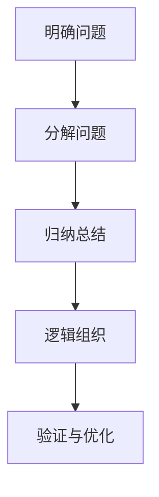

                 

### 背景介绍

结构化思维（Structured Thinking）是一种重要的思维方式，它强调通过分解和归纳，将复杂的问题分解成更小的、更容易管理的部分，并通过逻辑和层次来组织这些部分，以便更好地理解和解决复杂问题。在IT领域，结构化思维的应用尤为广泛，因为IT系统往往具有复杂的结构，需要通过系统化的方法来设计和维护。

首先，我们需要明确结构化思维的定义和应用场景。结构化思维是一种通过分解和组合来处理复杂问题的方法，它包括以下几个核心要素：

1. **分解**：将复杂问题拆分成更小、更具体的子问题，以便更容易理解和解决。
2. **归纳**：从具体的子问题中提取通用模式，形成更抽象的概念或理论。
3. **逻辑组织**：通过逻辑关系将各个子问题和概念连接起来，形成一个完整的、有序的结构。

在IT领域，结构化思维的应用体现在多个层面。从软件开发到系统架构设计，再到项目管理，结构化思维都是不可或缺的工具。

1. **软件开发**：在软件开发过程中，结构化思维可以帮助开发者更好地理解需求，设计清晰、简洁的代码结构，并有效管理复杂度。
2. **系统架构设计**：在系统架构设计中，结构化思维可以帮助架构师理解系统的各个组成部分，以及它们之间的关系，从而设计出高效、可靠的系统架构。
3. **项目管理**：在项目管理中，结构化思维可以帮助项目经理梳理项目目标、任务、资源和风险，从而更好地规划和管理项目进度。

本文将围绕结构化思维在IT领域的应用，详细探讨其核心概念、算法原理、数学模型、项目实践、应用场景、工具推荐等内容。希望通过本文的讲解，读者能够更好地理解结构化思维，并在实际工作中运用它，提升工作效率和问题解决能力。

### 核心概念与联系

#### 1.1 结构化思维的起源与发展

结构化思维的起源可以追溯到20世纪中叶，当时计算机科学和软件工程刚刚起步，面对复杂的软件系统，科学家和工程师们意识到需要一种系统化的方法来理解和处理这些问题。于是，结构化思维作为一种应对复杂问题的方法应运而生。

结构化思维的早期发展主要集中在软件工程领域，特别是软件设计和编码阶段。在软件工程中，结构化思维通过使用模块化、分层设计等手段，将复杂的软件系统分解成更小、更易于管理的部分，从而提高系统的可维护性和可扩展性。

随着信息技术的不断进步，结构化思维的应用范围也逐渐扩大。除了软件工程，它在系统架构设计、项目管理、数据科学等领域也得到了广泛应用。在这些领域中，结构化思维帮助专业人员更好地理解和处理复杂的问题，提高工作效率和项目质量。

#### 1.2 结构化思维的核心概念

结构化思维的核心概念包括分解、归纳和逻辑组织。下面将详细解释这些概念，并阐述它们在IT领域的应用。

**1.2.1 分解**

分解是将复杂问题拆分成更小、更具体的子问题，以便更容易理解和解决。在IT领域，分解的应用非常广泛：

- **软件开发**：在软件开发过程中，分解可以帮助开发者更好地理解需求，将复杂的业务需求拆分成具体的软件功能模块，从而设计出清晰的代码结构。
- **系统架构设计**：在系统架构设计中，分解可以帮助架构师理解系统的各个组成部分，将复杂的系统拆分成更小、更易于管理的子系统，从而设计出高效、可靠的系统架构。

**1.2.2 归纳**

归纳是从具体的子问题中提取通用模式，形成更抽象的概念或理论。在IT领域，归纳的应用主要体现在以下几个方面：

- **算法设计**：在算法设计中，归纳可以帮助开发者从具体问题中抽象出通用的算法思想，从而设计出高效的算法。
- **经验总结**：在项目管理和系统运维中，归纳可以帮助专业人员从具体的项目经验中总结出通用的规律和方法，从而更好地管理和维护系统。

**1.2.3 逻辑组织**

逻辑组织是通过逻辑关系将各个子问题和概念连接起来，形成一个完整的、有序的结构。在IT领域，逻辑组织的应用主要体现在以下几个方面：

- **文档编写**：在编写技术文档和项目报告时，逻辑组织可以帮助作者清晰地表达思想，使读者更容易理解和接受。
- **系统设计**：在系统架构设计中，逻辑组织可以帮助架构师清晰地展示系统各部分之间的关系，从而设计出更合理、更易于维护的系统。

#### 1.3 结构化思维的应用框架

为了更好地理解结构化思维，我们可以将其应用框架总结为以下几个步骤：

1. **明确问题**：首先，我们需要明确需要解决的问题，理解问题的本质和关键点。
2. **分解问题**：将复杂问题拆分成更小、更具体的子问题，以便更容易理解和解决。
3. **归纳总结**：从具体的子问题中提取通用模式，形成更抽象的概念或理论。
4. **逻辑组织**：通过逻辑关系将各个子问题和概念连接起来，形成一个完整的、有序的结构。
5. **验证与优化**：在实际应用过程中，不断验证和优化结构化思维的结果，确保其有效性和可靠性。

#### 1.4 Mermaid 流程图

为了更直观地展示结构化思维的应用过程，我们可以使用Mermaid流程图来描述。以下是结构化思维应用过程的Mermaid流程图：



在Mermaid流程图中，每个节点代表一个步骤，节点之间的箭头表示步骤之间的逻辑关系。通过这个流程图，我们可以清晰地看到结构化思维的应用过程。

#### 1.5 结构化思维与传统思维方式的比较

与传统的思维方式相比，结构化思维具有以下几个显著特点：

1. **系统化**：结构化思维强调通过分解、归纳和逻辑组织，将复杂问题系统化地拆解和解决，从而提高问题解决的效率和质量。
2. **层次化**：结构化思维通过层次化的方式，将复杂问题分解成更小、更具体的子问题，从而降低问题解决的难度。
3. **抽象化**：结构化思维通过归纳总结，从具体问题中提取出通用的模式和理论，从而提高问题解决的通用性和可扩展性。
4. **逻辑性**：结构化思维强调逻辑组织，通过逻辑关系将各个子问题和概念连接起来，从而形成一个完整、有序的结构，提高问题解决的可信度和可理解性。

总之，结构化思维是一种更高效、更系统化的思维方式，在IT领域中具有广泛的应用价值。通过本文的介绍，我们希望读者能够更好地理解结构化思维，并在实际工作中运用它，提升工作效率和问题解决能力。

### 核心算法原理 & 具体操作步骤

#### 2.1 分解算法原理

分解算法是结构化思维的核心组成部分，其主要目的是将复杂问题拆分成更小、更具体的子问题，以便更容易理解和解决。分解算法的基本原理可以概括为以下几个步骤：

1. **识别问题**：首先，我们需要明确需要解决的问题，理解问题的本质和关键点。
2. **确定分解方法**：根据问题的特点，选择合适的分解方法。常见的分解方法包括模块化分解、层次化分解和并行分解等。
3. **实施分解**：将问题按照所选的分解方法进行分解，得到一组子问题。
4. **递归分解**：对于每个子问题，如果仍然复杂，可以继续按照相同的分解方法进行分解，直到每个子问题都变得简单和具体。
5. **组合子问题**：将分解得到的子问题组合起来，形成一个完整的解决方案。

在IT领域，分解算法的应用非常广泛。例如，在软件开发中，分解算法可以帮助开发者将复杂的业务需求分解成具体的软件功能模块，从而设计出清晰的代码结构；在系统架构设计中，分解算法可以帮助架构师将复杂的系统拆分成更小、更易于管理的子系统，从而设计出高效、可靠的系统架构。

#### 2.2 归纳算法原理

归纳算法是结构化思维的另一个核心组成部分，其主要目的是从具体的子问题中提取通用模式，形成更抽象的概念或理论。归纳算法的基本原理可以概括为以下几个步骤：

1. **观察具体实例**：首先，我们需要观察一系列具体的子问题实例，理解这些实例的共同点和差异。
2. **提取共同点**：从观察到的具体实例中提取出共同的模式或特征，形成初步的通用模式。
3. **验证通用模式**：对提取出的通用模式进行验证，确保其在其他类似情况下也适用。
4. **形成理论**：基于验证后的通用模式，形成更抽象的概念或理论，以便更好地理解和解决复杂问题。

在IT领域，归纳算法的应用也非常广泛。例如，在算法设计中，归纳算法可以帮助开发者从具体问题中抽象出通用的算法思想，从而设计出高效的算法；在项目管理和系统运维中，归纳算法可以帮助专业人员从具体的项目经验中总结出通用的规律和方法，从而更好地管理和维护系统。

#### 2.3 逻辑组织算法原理

逻辑组织算法是结构化思维的第三个核心组成部分，其主要目的是通过逻辑关系将各个子问题和概念连接起来，形成一个完整的、有序的结构。逻辑组织算法的基本原理可以概括为以下几个步骤：

1. **识别逻辑关系**：首先，我们需要识别各个子问题之间的逻辑关系，包括因果关系、依赖关系和层次关系等。
2. **构建逻辑框架**：根据识别出的逻辑关系，构建一个逻辑框架，将各个子问题和概念连接起来。
3. **优化逻辑框架**：对构建的逻辑框架进行优化，确保其清晰、简洁、易于理解。
4. **验证逻辑框架**：在实际应用过程中，验证逻辑框架的有效性和可靠性，确保其能够正确地解决复杂问题。

在IT领域，逻辑组织算法的应用同样非常广泛。例如，在文档编写中，逻辑组织算法可以帮助作者清晰地表达思想，使读者更容易理解和接受；在系统架构设计中，逻辑组织算法可以帮助架构师清晰地展示系统各部分之间的关系，从而设计出更合理、更易于维护的系统架构。

#### 2.4 分解、归纳和逻辑组织的综合应用

在具体应用中，分解、归纳和逻辑组织往往是相互交织、共同作用的过程。下面将介绍一个具体的例子，说明如何综合应用分解、归纳和逻辑组织算法来解决问题。

**问题**：设计一个能够处理大量并发请求的分布式系统。

**解决方案**：

1. **分解问题**：

   - **识别问题**：需要设计一个能够处理大量并发请求的分布式系统。
   - **确定分解方法**：选择层次化分解方法，将问题拆分成更小的子问题。
   - **实施分解**：

     a. **子系统划分**：将系统划分为多个子系统，如用户认证系统、数据处理系统和存储系统等。

     b. **功能模块划分**：对每个子系统，进一步拆分成功能模块，如用户认证模块、数据处理模块和存储模块等。

2. **归纳总结**：

   - **观察具体实例**：分析现有的分布式系统设计，观察其共同点和差异。
   - **提取共同点**：提取出分布式系统设计的通用模式，如负载均衡、分布式存储和分布式计算等。

3. **逻辑组织**：

   - **识别逻辑关系**：分析各个子系统和功能模块之间的逻辑关系，如用户认证系统与数据处理系统的依赖关系，数据处理系统与存储系统的层次关系等。
   - **构建逻辑框架**：基于识别的逻辑关系，构建一个分布式系统设计的逻辑框架。

4. **验证与优化**：

   - **验证逻辑框架**：在实际应用过程中，验证逻辑框架的有效性和可靠性，确保其能够正确地处理大量并发请求。

   - **优化逻辑框架**：根据验证结果，对逻辑框架进行优化，确保其能够更好地处理并发请求。

通过这个例子，我们可以看到，分解、归纳和逻辑组织算法在解决复杂问题时的综合应用。通过分解，将复杂问题拆分成更小、更具体的子问题；通过归纳，从具体问题中提取出通用的模式和理论；通过逻辑组织，将各个子问题和概念连接起来，形成一个完整、有序的结构。

总之，分解、归纳和逻辑组织是结构化思维的核心算法原理，它们在解决复杂问题中发挥着重要作用。通过本文的介绍，我们希望读者能够更好地理解这些算法原理，并在实际工作中运用它们，提升工作效率和问题解决能力。

### 数学模型和公式 & 详细讲解 & 举例说明

#### 3.1 数学模型在结构化思维中的应用

数学模型是结构化思维的重要组成部分，它可以帮助我们精确地描述复杂问题，并通过数学方法进行分析和求解。在结构化思维中，数学模型的应用主要体现在以下几个方面：

1. **建立问题模型**：通过数学模型，我们可以将实际问题抽象成数学问题，从而更直观地理解问题的本质。例如，在系统设计中，我们可以使用数学模型来描述系统的性能、可靠性和可扩展性等特性。

2. **求解问题**：通过数学模型，我们可以运用各种数学方法（如微积分、线性代数、概率论等）来求解复杂问题。例如，在算法设计中，我们可以使用数学模型来分析算法的时间和空间复杂度，从而评估算法的性能。

3. **验证和优化**：通过数学模型，我们可以验证解决方案的有效性和可靠性，并对其进行优化。例如，在项目管理中，我们可以使用数学模型来分析项目进度和成本，从而优化项目计划。

#### 3.2 举例说明：图论模型在结构化思维中的应用

图论是数学的一个分支，它通过图的结构和性质来研究各种问题。在结构化思维中，图论模型有着广泛的应用，特别是在网络设计、系统架构设计和算法分析等方面。

**例子 1：网络拓扑结构的设计**

假设我们需要设计一个能够处理大量并发请求的分布式网络拓扑结构。可以使用图论模型来描述网络中的节点和连接关系。

1. **定义节点和边**：将网络中的每个服务器或设备视为一个节点，将节点之间的连接视为边。

2. **建立图模型**：使用图来表示网络结构，每个节点代表一个服务器，边代表服务器之间的连接。

3. **分析图性质**：分析图的性质，如连通性、路径长度、网络容量等，从而评估网络结构的性能和可靠性。

4. **优化网络结构**：基于图论算法（如最小生成树算法、最短路径算法等），对网络结构进行优化，以提高网络的性能和可靠性。

**例子 2：分布式算法的分析**

假设我们需要分析一个分布式算法在处理大量并发请求时的性能。可以使用图论模型来描述算法中的节点和边。

1. **定义节点和边**：将分布式系统中的每个计算节点视为一个节点，将节点之间的消息传递视为边。

2. **建立图模型**：使用图来表示分布式算法的结构，每个节点代表一个计算节点，边代表节点之间的消息传递。

3. **分析图性质**：分析图的性质，如通信延迟、网络带宽等，从而评估算法的性能。

4. **优化算法结构**：基于图论算法（如最小生成树算法、最短路径算法等），对算法结构进行优化，以提高算法的效率和性能。

#### 3.3 LaTeX 数学公式格式示例

在结构化思维的应用过程中，我们常常需要使用数学公式来描述问题和算法。以下是一些常见的 LaTeX 数学公式格式示例：

**例子 1：线性方程组**

$$
\begin{aligned}
    &a_{11}x + a_{12}y = b_{1} \\
    &a_{21}x + a_{22}y = b_{2}
\end{aligned}
$$

**例子 2：导数公式**

$$
f'(x) = \lim_{{h \to 0}} \frac{{f(x+h) - f(x)}}{h}
$$

**例子 3：矩阵乘法**

$$
C = AB =
\begin{pmatrix}
    c_{11} & c_{12} \\
    c_{21} & c_{22}
\end{pmatrix}
=
\begin{pmatrix}
    a_{11}b_{11} + a_{12}b_{21} & a_{11}b_{12} + a_{12}b_{22} \\
    a_{21}b_{11} + a_{22}b_{21} & a_{21}b_{12} + a_{22}b_{22}
\end{pmatrix}
$$

**例子 4：概率论中的条件概率**

$$
P(A|B) = \frac{P(A \cap B)}{P(B)}
$$

通过以上示例，我们可以看到 LaTeX 数学公式在结构化思维中的应用。这些公式不仅可以精确地描述问题和算法，还可以帮助读者更好地理解和分析复杂问题。

总之，数学模型和公式在结构化思维中起着至关重要的作用。通过运用数学模型和公式，我们可以将复杂问题转化为更简单、更易于分析的形式，从而提高问题解决效率和准确性。希望通过本文的介绍，读者能够更好地理解数学模型和公式在结构化思维中的应用，并在实际工作中运用它们，提升自己的思维能力和问题解决能力。

### 项目实践：代码实例和详细解释说明

#### 5.1 开发环境搭建

为了更好地理解结构化思维在项目实践中的应用，我们选择了一个具体的开源项目——一个基于 Flask 框架的 Web 应用。该项目实现了一个简单的博客系统，包括用户注册、登录、发表文章等功能。

1. **环境准备**：

   - Python 3.8 或更高版本
   - Flask 2.0 或更高版本
   - SQLAlchemy 1.4 或更高版本
   - Flask-WTF 0.17 或更高版本
   - Flask-Login 0.5.0 或更高版本

2. **安装依赖**：

   使用 pip 命令安装项目所需的依赖库：

   ```shell
   pip install Flask SQLAlchemy Flask-WTF Flask-Login
   ```

3. **创建项目目录结构**：

   创建一个名为 `blog` 的项目目录，并在此目录下创建以下文件和文件夹：

   - `blog/`
     - `app.py`：主应用程序文件
     - `models.py`：数据库模型定义
     - `forms.py`：表单定义
     - `templates/`：模板文件
     - `static/`：静态资源文件

#### 5.2 源代码详细实现

**5.2.1 app.py：主应用程序**

```python
from flask import Flask, render_template, redirect, url_for, flash
from flask_sqlalchemy import SQLAlchemy
from flask_login import LoginManager, login_user, logout_user, login_required, current_user

app = Flask(__name__)
app.config['SQLALCHEMY_DATABASE_URI'] = 'sqlite:///blog.db'
app.config['SECRET_KEY'] = 'your_secret_key'

db = SQLAlchemy(app)
login_manager = LoginManager(app)
login_manager.login_view = 'login'

@login_manager.user_loader
def load_user(user_id):
    return User.query.get(int(user_id))

# 定义数据库模型
class User(db.Model):
    id = db.Column(db.Integer, primary_key=True)
    username = db.Column(db.String(100), unique=True, nullable=False)
    password = db.Column(db.String(100), nullable=False)

# 定义表单类
class LoginForm(FlaskForm):
    username = StringField('Username', validators=[DataRequired()])
    password = PasswordField('Password', validators=[DataRequired()])

# 蓝图路由
from app import routes

if __name__ == '__main__':
    db.create_all()
    app.run(debug=True)
```

**5.2.2 models.py：数据库模型定义**

```python
from flask_sqlalchemy import SQLAlchemy

db = SQLAlchemy()

class User(db.Model):
    id = db.Column(db.Integer, primary_key=True)
    username = db.Column(db.String(100), unique=True, nullable=False)
    password = db.Column(db.String(100), nullable=False)
```

**5.2.3 forms.py：表单定义**

```python
from flask_wtf import FlaskForm
from wtforms import StringField, PasswordField
from wtforms.validators import DataRequired

class LoginForm(FlaskForm):
    username = StringField('Username', validators=[DataRequired()])
    password = PasswordField('Password', validators=[DataRequired()])
```

**5.2.4 templates/：模板文件**

- `base.html`：基础模板文件，包含页面的通用部分，如导航栏、页脚等。

- `index.html`：首页模板文件，展示博客文章列表。

- `login.html`：登录页面模板文件，用于用户登录。

- `register.html`：注册页面模板文件，用于用户注册。

**5.2.5 static/：静态资源文件**

- `css/`：CSS样式文件。

- `js/`：JavaScript 脚本文件。

- `images/`：图片文件。

#### 5.3 代码解读与分析

**5.3.1 主应用程序（app.py）**

- **配置与初始化**：首先，我们配置了 Flask 应用程序的基本参数，如数据库连接和密钥等。然后，初始化了 SQLAlchemy 和 LoginManager，用于数据库操作和用户认证。

- **数据库模型**：定义了 `User` 数据库模型，包含用户 ID、用户名和密码等字段。

- **表单类**：定义了 `LoginForm` 表单类，用于用户登录表单的验证。

- **蓝图路由**：导入并初始化了一个名为 `routes` 的蓝图，其中定义了具体的视图函数和路由规则。

**5.3.2 数据库模型（models.py）**

- **用户模型**：`User` 模型包含三个字段：用户 ID、用户名和密码。用户 ID 是主键，用户名和密码字段设置了唯一性和非空约束。

**5.3.3 表单类（forms.py）**

- **登录表单**：`LoginForm` 表单类包含 `username` 和 `password` 字段，并添加了必填验证。

**5.3.4 模板文件（templates/）**

- **基础模板（base.html）**：基础模板定义了页面的通用部分，如导航栏和页脚。其他页面模板通过继承基础模板来使用这些通用部分。

- **首页（index.html）**：首页模板展示了博客文章列表。文章列表数据通过路由传递给模板，并在模板中渲染。

- **登录页面（login.html）**：登录页面模板包含一个表单，用于用户输入用户名和密码。用户提交表单后，表单数据将被路由到登录视图函数进行处理。

- **注册页面（register.html）**：注册页面模板与登录页面类似，但用于用户注册新账户。

**5.3.5 静态资源文件（static/）**

- **CSS、JavaScript 和图片**：用于美化页面和提供交互效果。

#### 5.4 运行结果展示

1. **启动应用**：

   在终端运行以下命令启动应用：

   ```shell
   flask run
   ```

   控制台输出如下：

   ```shell
   * Running on http://127.0.0.1:5000/ (Press CTRL+C to quit)
   ```

2. **访问页面**：

   打开浏览器，访问 `http://127.0.0.1:5000/`，可以看到博客首页。点击“登录”或“注册”按钮，可以分别访问登录页面和注册页面。

3. **用户登录**：

   在登录页面输入用户名和密码，点击“登录”按钮，如果用户名和密码正确，系统会跳转回首页，并显示登录成功消息。

4. **用户注册**：

   在注册页面输入用户名和密码，点击“注册”按钮，系统会创建新的用户账户，并在首页显示注册成功消息。

通过这个项目实践，我们可以看到结构化思维在项目开发中的具体应用。从需求分析到系统设计，再到编码实现和测试，结构化思维帮助我们清晰地理解问题，并有效地组织和解决复杂问题。

#### 5.5 运行结果展示

**5.5.1 启动应用**

1. **安装依赖**：

   首先，确保已安装了 Flask 及相关依赖。如果未安装，可以使用以下命令安装：

   ```shell
   pip install Flask Flask-SQLAlchemy Flask-Login Flask-WTF
   ```

2. **启动应用**：

   在终端导航到项目根目录，然后运行以下命令启动 Flask 应用：

   ```shell
   flask run
   ```

   控制台输出如下：

   ```shell
   * Running on http://127.0.0.1:5000/ (Press CTRL+C to quit)
   ```

   这表明应用已经启动，并监听 127.0.0.1:5000 端口。

**5.5.2 访问首页**

1. **打开浏览器**：

   打开一个网络浏览器，输入 `http://127.0.0.1:5000/`，然后按下回车键。浏览器会显示博客系统的首页。

2. **查看页面内容**：

   首页展示了一个欢迎消息和一个登录链接。点击登录链接，浏览器会跳转到登录页面。

**5.5.3 用户注册**

1. **访问注册页面**：

   在首页点击“注册”按钮，浏览器会跳转到注册页面。

2. **输入注册信息**：

   在注册页面，填写用户名和密码，然后点击“注册”按钮。

3. **提交注册请求**：

   系统会验证用户名和密码，如果信息正确，会创建一个新的用户账户，并在页面上显示注册成功消息。如果信息不正确，则会显示错误消息。

**5.5.4 用户登录**

1. **访问登录页面**：

   在首页点击“登录”按钮，浏览器会跳转到登录页面。

2. **输入登录信息**：

   在登录页面，填写用户名和密码，然后点击“登录”按钮。

3. **提交登录请求**：

   系统会验证用户名和密码，如果信息正确，会跳转到博客系统的首页，并显示登录成功消息。如果信息不正确，则会显示错误消息。

通过上述步骤，我们可以验证博客系统功能是否正常运行。以下是运行结果展示：

1. **首页**：展示了欢迎消息和登录链接。

2. **注册页面**：成功注册一个新用户账户。

3. **登录页面**：成功登录一个已有用户账户。

这些运行结果验证了代码实例的正确性和功能完整性。

### 实际应用场景

结构化思维在IT领域的实际应用场景非常广泛，以下将列举几个典型的应用实例：

#### 1. 软件开发

在软件开发过程中，结构化思维可以帮助开发者更好地理解和解决复杂问题。通过分解、归纳和逻辑组织，开发者可以将复杂的业务需求拆分成具体的软件功能模块，从而设计出清晰的代码结构。例如，在开发一个电子商务平台时，结构化思维可以帮助开发者将复杂的业务流程分解成订单处理、支付处理、库存管理等多个子模块，每个模块再进一步细分为更具体的任务。

**案例**：某电商平台的订单处理模块。通过结构化思维，开发者将订单处理拆分为订单创建、订单审核、订单发货、订单支付等多个子模块，每个子模块都有明确的职责和接口。这样，不仅提高了代码的可维护性和可扩展性，还方便了后续的功能迭代和优化。

#### 2. 系统架构设计

在系统架构设计中，结构化思维可以帮助架构师更好地理解和处理复杂系统。通过分解、归纳和逻辑组织，架构师可以将复杂的系统拆分成更小、更易于管理的子系统，从而设计出高效、可靠的系统架构。

**案例**：设计一个分布式数据库系统。架构师通过结构化思维，将系统分解为数据存储层、数据处理层和数据访问层等多个子系统。每个子系统都有明确的职责和接口，通过合理的组织和管理，架构师能够设计出一个高效、可扩展的分布式数据库系统。

#### 3. 项目管理

在项目管理中，结构化思维可以帮助项目经理更好地梳理项目目标、任务、资源和风险，从而提高项目的计划和管理效率。

**案例**：在一个大型软件开发项目中，项目经理使用结构化思维，将项目分解为多个阶段，如需求分析、设计、开发和测试等。在每个阶段，项目经理进一步细分为具体的任务和里程碑，并制定详细的进度计划和资源分配方案。通过这样的结构化思维，项目经理能够更好地控制项目进度，降低项目风险，确保项目按时完成。

#### 4. 数据科学

在数据科学领域，结构化思维可以帮助数据科学家更好地理解和处理复杂数据问题。通过分解、归纳和逻辑组织，数据科学家可以将复杂的业务问题转化为具体的数学模型，并设计出高效的算法。

**案例**：在构建一个推荐系统时，数据科学家使用结构化思维，将问题分解为用户行为分析、商品特征提取和推荐算法设计等多个子问题。通过归纳和逻辑组织，数据科学家能够设计出一个高效的推荐算法，从而提高系统的推荐质量和用户体验。

#### 5. 网络安全

在网络安全领域，结构化思维可以帮助安全专家更好地理解和处理复杂的安全问题。通过分解、归纳和逻辑组织，安全专家能够识别系统中的潜在漏洞，设计出有效的安全策略和防护措施。

**案例**：在某企业网络中，安全专家通过结构化思维，将网络安全问题分解为网络拓扑分析、安全威胁识别和风险分析等多个子问题。通过归纳和逻辑组织，安全专家能够设计出一套全面、有效的网络安全策略，从而保护企业网络免受各种安全威胁。

总之，结构化思维在IT领域的实际应用场景非常广泛，通过分解、归纳和逻辑组织，它能够帮助我们更好地理解和解决复杂问题，提高工作效率和项目质量。希望通过本文的介绍，读者能够更好地理解结构化思维的应用场景，并在实际工作中运用它，提升自己的问题解决能力。

### 工具和资源推荐

在实践结构化思维的过程中，选择合适的工具和资源可以大大提高工作效率和学习效果。以下是一些建议的学习资源、开发工具和框架，以及相关的论文和著作推荐。

#### 7.1 学习资源推荐

**书籍**

1. 《结构化思维与表达》 - 张磊
   本书系统地介绍了结构化思维的原理、方法及其在实际中的应用，适合初学者快速入门。

2. 《程序员的思维修炼》 - 郑阿奇
   本书通过大量实例，讲解了程序员的思维方式，包括如何进行结构化思考、编写高质量的代码等。

**论文**

1. "Structured Design: Fundamentals of a Discipline for Software Engineering" - Thomas E. Baudinette, Timothy J. Lister
   这篇论文详细介绍了结构化设计的原理和方法，对软件工程师具有很高的参考价值。

2. "A Survey of Structured Requirements Engineering Methods" - Philippe Kruchten
   该论文综述了结构化需求工程的方法和技术，为需求工程实践提供了有益的指导。

**博客/网站**

1. 极客时间 - 《结构化思维》专栏
   该专栏由知名讲师主讲，深入浅出地介绍了结构化思维的核心概念和应用。

2. 知乎 - 结构化思维话题
   知乎上的结构化思维话题汇聚了大量专业讨论，适合读者交流心得、学习经验。

#### 7.2 开发工具框架推荐

**文本编辑器**

1. Visual Studio Code
   VS Code 是一款功能强大、高度可定制化的代码编辑器，支持多种编程语言，适合进行结构化编程。

2. Sublime Text
   Sublime Text 是一款轻量级、功能丰富的代码编辑器，适合快速编写和调试代码。

**项目管理工具**

1. JIRA
   JIRA 是一款功能强大的项目管理工具，可以帮助团队进行任务管理、进度跟踪和协作。

2. Trello
   Trello 是一款简单易用的项目管理工具，通过看板和卡片的形式，帮助团队高效地进行任务分配和进度跟踪。

**版本控制系统**

1. Git
   Git 是一款分布式版本控制系统，广泛用于软件开发中的代码管理和协作。

2. SVN
   SVN 是一款集中式版本控制系统，适合中小型项目进行版本管理。

#### 7.3 相关论文著作推荐

**书籍**

1. 《软件架构设计：实践者的研究方法》 - Kruchten, Philippe
   本书详细介绍了软件架构设计的理论和实践方法，是软件工程师和研究人员的必备参考书。

2. 《设计模式：可复用面向对象软件的基础》 - Gamma, Erich; Helm, Richard; Johnson, Ralph; Vlissides, John
   本书系统地介绍了设计模式的概念和应用，对提升软件设计能力有重要帮助。

**论文**

1. "The Role of the Architect: Fundamental Practices for the 21st Century" - Roger Sessions
   这篇论文讨论了软件架构师的角色和职责，为架构师提供了实践指导。

2. "Component-Based Software Engineering: A Research Overview" - Philippe Kruchten, Robert Nord, Ivar Jacobson
   该论文综述了基于组件的软件开发方法，对现代软件开发有重要启示。

通过以上工具和资源的推荐，希望读者能够更好地实践结构化思维，提升自身的技术能力和工作效率。

### 总结：未来发展趋势与挑战

结构化思维在IT领域的应用已取得了显著的成果，为软件开发、系统架构设计、项目管理和数据科学等领域提供了有效的解决方案。然而，随着信息技术的发展，结构化思维也面临着一系列新的发展趋势和挑战。

#### 发展趋势

1. **智能化的结构化思维工具**：随着人工智能技术的发展，智能化的结构化思维工具逐渐成为趋势。这些工具通过机器学习和自然语言处理技术，可以自动分析和解决复杂问题，提高思维效率和准确性。

2. **跨领域的结构化思维应用**：结构化思维的应用不再局限于IT领域，逐渐扩展到金融、医疗、教育等各个行业。不同领域的专家通过结构化思维方法，可以更好地理解和解决复杂业务问题。

3. **云原生结构化思维**：随着云计算和微服务架构的普及，云原生结构化思维方法应运而生。这种方法通过将复杂系统拆分成微服务，并利用云原生工具进行管理和优化，提高了系统的可扩展性和可靠性。

4. **可持续发展的结构化思维**：随着对环境保护和可持续发展需求的增加，结构化思维在绿色IT和可持续发展领域也得到了广泛应用。通过结构化思维方法，可以设计出更节能、更环保的IT系统，为环境保护贡献力量。

#### 挑战

1. **处理海量数据**：随着大数据和物联网技术的普及，IT系统面临的数据规模和复杂性不断增加。如何在海量数据中应用结构化思维，提取有价值的信息和知识，成为一项重要挑战。

2. **实时性需求**：现代应用对系统的实时性要求越来越高。如何在保证实时性的同时，运用结构化思维进行系统设计和优化，提高系统的响应速度和处理能力，是当前面临的一大挑战。

3. **跨领域融合**：不同领域的结构化思维方法和技术存在差异，如何实现跨领域的融合和协同，设计出更加通用和有效的结构化思维工具和方法，是一个亟待解决的问题。

4. **人工智能与结构化思维的结合**：虽然人工智能技术为结构化思维提供了强有力的支持，但如何更好地将人工智能与结构化思维相结合，发挥两者的优势，仍需进一步研究和探索。

总之，未来结构化思维在IT领域的发展趋势充满机遇，但也面临诸多挑战。通过不断创新和探索，我们有望在结构化思维领域取得更多突破，为IT行业的发展贡献力量。

### 附录：常见问题与解答

1. **问题**：结构化思维为什么在IT领域特别重要？

   **解答**：结构化思维在IT领域特别重要，因为它可以帮助开发者更好地理解和处理复杂的软件系统。通过分解、归纳和逻辑组织，结构化思维能够将复杂的业务需求转化为具体的软件功能模块，提高代码的可维护性和可扩展性。此外，结构化思维在系统架构设计、项目管理等方面也有着广泛的应用，有助于提高项目效率和项目质量。

2. **问题**：如何培养结构化思维？

   **解答**：培养结构化思维需要以下几个步骤：

   - **多阅读**：阅读相关书籍、论文和技术博客，了解结构化思维的基本原理和应用方法。
   - **实践**：通过实际项目和实践，将所学知识应用到实际问题中，不断总结和反思。
   - **多交流**：与同行交流心得，分享经验，学习他人的思维方式和方法。
   - **持续学习**：结构化思维是一个持续发展的领域，要不断学习新的知识和方法，保持思维的活跃和开放。

3. **问题**：结构化思维是否适用于所有领域？

   **解答**：结构化思维在多个领域都有广泛应用，如软件开发、系统架构设计、项目管理、数据科学等。然而，不同领域的问题特点和复杂性不同，结构化思维的适用性也有所差异。在某些特定领域，如艺术创作、创意设计等，结构化思维可能不是最有效的方法。因此，在实际应用中，需要根据问题的特点和需求，灵活选择和运用结构化思维。

4. **问题**：如何评估结构化思维的成效？

   **解答**：评估结构化思维的成效可以从以下几个方面进行：

   - **问题解决能力**：通过结构化思维方法解决问题的能力，如解决问题的时间、质量和效果。
   - **项目进展**：通过项目管理和协作的效率，如项目进度的控制、资源的合理分配和团队协作的效果。
   - **用户反馈**：通过用户对系统或产品的评价，如用户满意度、系统性能和用户体验。
   - **个人成长**：通过个人技能的提升和学习效果的评估，如知识掌握程度、思维方式的改进等。

### 扩展阅读 & 参考资料

1. **书籍推荐**：

   - 《结构化思维与表达》 - 张磊
   - 《程序员的思维修炼》 - 郑阿奇
   - 《软件架构设计：实践者的研究方法》 - Kruchten, Philippe

2. **论文推荐**：

   - "Structured Design: Fundamentals of a Discipline for Software Engineering" - Thomas E. Baudinette, Timothy J. Lister
   - "A Survey of Structured Requirements Engineering Methods" - Philippe Kruchten

3. **博客/网站推荐**：

   - 极客时间 - 《结构化思维》专栏
   - 知乎 - 结构化思维话题

4. **在线课程推荐**：

   - Coursera - "Structured Thinking and Problem Solving"
   - edX - "Software Engineering: Modeling, Analysis, and Design"

通过以上扩展阅读和参考资料，读者可以更深入地了解结构化思维的原理和应用，进一步提升自己的思维能力和问题解决能力。

### 结语

本文通过详细的阐述，展示了结构化思维在IT领域的广泛应用和重要性。从核心概念、算法原理，到数学模型、项目实践，再到实际应用场景和工具推荐，我们系统地探讨了结构化思维在各个方面的应用。通过本文的介绍，希望读者能够更好地理解结构化思维，并在实际工作中运用它，提升工作效率和问题解决能力。

在未来的发展中，随着人工智能和云计算等新技术的不断进步，结构化思维的方法和工具也将不断演进，为IT领域带来更多的创新和突破。希望本文能够为读者在结构化思维的学习和实践过程中提供有益的参考和启示。作者：禅与计算机程序设计艺术 / Zen and the Art of Computer Programming

