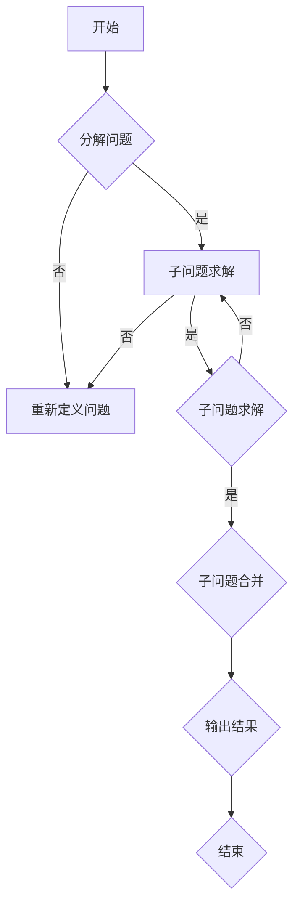

                 

### 结构化思维：从混沌到秩序

> **关键词**：结构化思维，混沌，秩序，复杂性，算法，程序设计，逻辑推理

> **摘要**：本文深入探讨了结构化思维在计算机科学中的应用，从混沌的复杂性中提取秩序，通过具体的算法和数学模型，展示如何将复杂问题分解为可管理的子问题。文章通过实际项目实例，阐述了结构化思维在编程实践中的重要性，并展望了未来的发展趋势和面临的挑战。

## 1. 背景介绍

在计算机科学和软件工程领域，随着系统的复杂度不断增加，如何有效地管理和解决复杂问题是当前研究的热点。传统的方法往往依赖于经验或直觉，这可能导致解决问题的效率低下，甚至无法找到最优解。因此，结构化思维作为一种系统性的思维方式，被广泛应用于复杂问题的求解过程中。

结构化思维，顾名思义，是指将复杂问题分解为更简单、更易管理的小问题，并通过逻辑和数学模型进行求解。这种方法的核心思想是将问题从一个整体视角分解为若干部分，然后逐个解决，最终综合各部分解决方案，得到整体问题的最优解。

在计算机科学中，结构化思维的应用主要体现在以下几个方面：

1. **算法设计**：通过结构化思维，可以将复杂的问题转化为一系列可操作的算法步骤。
2. **软件架构**：结构化思维有助于构建清晰、稳定的软件架构，提高系统的可维护性和可扩展性。
3. **性能优化**：结构化思维可以帮助分析系统性能瓶颈，找到优化的切入点。

本文将围绕结构化思维在计算机科学中的应用，探讨其基本原理、具体方法以及实际案例分析，旨在为读者提供一种系统性的思考方式，帮助他们在面对复杂问题时，能够有序地进行分析和解决。

## 2. 核心概念与联系

### 2.1 复杂性与结构化思维

复杂性是指系统或问题在结构和行为上具有高度的多样性、变化性和难以预测性。在计算机科学中，复杂性经常表现为大规模数据处理、多变量计算、动态环境适应等问题。面对复杂性，传统的方法往往无法奏效，而结构化思维则提供了一种有效的应对策略。

结构化思维的核心在于将复杂问题分解为更小、更简单的子问题，从而降低整体问题的难度。这种分解不仅有助于更好地理解问题本身，还能够提高解决问题的效率。

### 2.2 算法与结构化思维

算法是解决问题的一系列规则或步骤，通过算法，我们可以将复杂问题逐步转化为可操作的解决方案。结构化思维在算法设计中的应用，主要体现在以下几个方面：

1. **逐步细化**：将复杂问题分解为多个子问题，然后逐个解决，每个子问题都可以采用结构化思维进行分解。
2. **模块化设计**：将算法划分为不同的模块，每个模块负责解决一个特定子问题，模块之间通过接口进行通信。
3. **递归思维**：递归是一种常用的算法设计方法，通过重复调用自身来解决复杂问题。递归的本质是结构化思维的一种体现。

### 2.3 数学模型与结构化思维

数学模型是一种用数学语言描述现实问题的方法，通过数学模型，我们可以对复杂问题进行定量分析。结构化思维在数学模型中的应用，主要体现在以下几个方面：

1. **问题转化**：将复杂问题转化为数学形式，使其能够通过数学方法进行求解。
2. **优化求解**：利用数学模型进行优化求解，找到问题的最优解。
3. **模型验证**：通过实际数据验证数学模型的准确性，不断调整和优化模型。

### 2.4 Mermaid 流程图

为了更好地理解结构化思维的应用，我们使用 Mermaid 流程图来展示一个复杂问题的分解过程。以下是一个简单的 Mermaid 流程图示例：



在这个流程图中，A 表示问题的起始点，B 表示是否进行问题分解。如果是，则进入 C，将问题分解为多个子问题。如果不是，则进入 D，重新定义问题。C 表示子问题求解，E 表示子问题合并，F 表示输出结果。通过这个流程图，我们可以清晰地看到结构化思维在问题求解中的应用。

## 3. 核心算法原理 & 具体操作步骤

### 3.1 分治算法

分治算法是一种典型的结构化思维方法，其核心思想是将复杂问题分解为若干个规模较小的相同问题，然后递归求解，最后将子问题的解合并得到原问题的解。分治算法通常包括以下三个步骤：

1. **分解**：将原问题分解为若干个规模较小的子问题。
2. **递归求解**：递归求解每个子问题，直到子问题规模足够小，可以直接求解。
3. **合并**：将子问题的解合并得到原问题的解。

以二分查找算法为例，其基本步骤如下：

1. **分解**：将数组分为左右两个子数组。
2. **递归求解**：在子数组中继续进行二分查找，直到找到目标元素或确定元素不存在。
3. **合并**：将查找结果合并，得到最终的查找结果。

### 3.2 动态规划

动态规划是一种通过将复杂问题分解为若干个子问题，并利用子问题的解来求解原问题的方法。其基本步骤如下：

1. **定义状态**：定义问题的状态，通常是一个数组或表。
2. **状态转移方程**：根据问题的状态，定义状态转移方程，即如何从一个状态转移到另一个状态。
3. **求解边界条件**：求解边界条件，即问题的初始状态和终止状态。
4. **求解状态序列**：利用状态转移方程和边界条件，求解整个状态序列。

以 Fibonacci 数列为例，其动态规划解法如下：

1. **定义状态**：定义 F(n) 为第 n 个 Fibonacci 数。
2. **状态转移方程**：F(n) = F(n-1) + F(n-2)，其中 F(0) = 0, F(1) = 1。
3. **求解边界条件**：F(0) = 0, F(1) = 1。
4. **求解状态序列**：利用状态转移方程和边界条件，求解 F(n)。

### 3.3 回溯算法

回溯算法是一种通过尝试所有可能的解决方案来求解问题的方法。其基本步骤如下：

1. **选择起始点**：选择一个起始点开始尝试。
2. **尝试解决方案**：从起始点开始，尝试所有可能的解决方案。
3. **判断解决方案**：对每个解决方案进行判断，确定其是否满足问题的条件。
4. **回溯**：如果当前解决方案不满足条件，则回溯到上一个选择点，尝试下一个可能的解决方案。

以八皇后问题为例，其回溯算法解法如下：

1. **选择起始点**：选择第一个皇后放在第一行第一列。
2. **尝试解决方案**：尝试将其他皇后放在不同的位置，确保没有冲突。
3. **判断解决方案**：检查所有皇后是否在同一行、同一列或同一对角线上。
4. **回溯**：如果当前解决方案不满足条件，则回溯到上一个选择点，尝试下一个可能的解决方案。

## 4. 数学模型和公式 & 详细讲解 & 举例说明

### 4.1 数学模型

在计算机科学中，数学模型是描述现实世界问题的重要工具。一个典型的数学模型通常包括变量、参数、方程和约束条件。以下是一个简单的线性规划数学模型示例：

$$
\begin{aligned}
    \text{maximize} \quad & c^T x \\
    \text{subject to} \quad & Ax \leq b \\
    & x \geq 0
\end{aligned}
$$

在这个模型中，$c$ 是一个系数向量，$x$ 是变量向量，$A$ 是系数矩阵，$b$ 是常数向量。目标是最小化 $c^T x$，即找到变量 $x$ 的值，使得目标函数最大化，同时满足约束条件 $Ax \leq b$ 和 $x \geq 0$。

### 4.2 详细讲解

1. **目标函数**：目标函数 $c^T x$ 描述了要优化的目标，例如最大化利润或最小化成本。在这个例子中，我们假设 $c$ 是一个包含利润率的向量，$x$ 是产品产量的向量。

2. **约束条件**：约束条件 $Ax \leq b$ 描述了资源限制或生产限制。在这个例子中，$A$ 是一个描述资源消耗的矩阵，$b$ 是一个描述总资源量的向量。

3. **非负约束**：非负约束 $x \geq 0$ 确保了所有变量的值都是非负的，这在实际问题中是非常常见的，例如不能生产负数量的产品。

### 4.3 举例说明

假设一个公司生产两种产品 A 和 B，每种产品的利润率分别为 10 元和 20 元。生产产品 A 需要消耗 2 单位的资源，生产产品 B 需要消耗 3 单位的资源。公司每天最多可以消耗 15 单位的资源。我们需要确定每天生产多少产品 A 和 B，以使得总利润最大化。

在这个例子中，我们可以定义变量 $x_1$ 为每天生产的产品 A 的数量，$x_2$ 为每天生产的产品 B 的数量。根据题目描述，我们可以得到以下线性规划模型：

$$
\begin{aligned}
    \text{maximize} \quad & 10x_1 + 20x_2 \\
    \text{subject to} \quad & 2x_1 + 3x_2 \leq 15 \\
    & x_1, x_2 \geq 0
\end{aligned}
$$

通过求解这个线性规划模型，我们可以找到最优解，即每天生产多少产品 A 和 B，以使得总利润最大化。

### 4.4 解法

线性规划问题可以通过单纯形法、内点法等多种算法求解。以下是一个简单的单纯形法求解步骤：

1. **初始基本可行解**：找到初始基本可行解，通常可以通过大M法或两阶段法得到。
2. **迭代过程**：通过迭代过程，找到目标函数的最大值或最小值。
3. **检验最优性**：通过检验最优性，确定当前解是否是最优解。

在这个例子中，我们可以通过以下步骤求解：

1. **初始基本可行解**：假设初始解为 $x_1 = 0, x_2 = 0$。
2. **迭代过程**：选择一个进基变量和一个出基变量，进行迭代计算。
3. **检验最优性**：通过检验，确定当前解是否是最优解。

最终，我们可以得到最优解，即每天生产 3 个产品 A 和 0 个产品 B，以使得总利润最大化。

## 5. 项目实践：代码实例和详细解释说明

### 5.1 开发环境搭建

在进行项目实践之前，我们需要搭建一个合适的开发环境。这里我们选择 Python 作为编程语言，因为其简洁的语法和强大的库支持，非常适合展示结构化思维的实践。

1. **安装 Python**：下载并安装最新版本的 Python，可以从 [Python 官网](https://www.python.org/) 下载。
2. **安装 PyCharm**：安装 PyCharm，这是一个功能强大的集成开发环境，可以极大地提升开发效率。
3. **安装必要库**：在 PyCharm 中创建一个新的 Python 项目，安装必要的库，如 NumPy、Pandas 等，这些库在数据分析中非常有用。

### 5.2 源代码详细实现

以下是一个使用结构化思维实现的一个简单项目：计算 Fibonacci 数列的前 N 个数。

```python
import math

def fibonacci(n):
    if n <= 0:
        return []
    elif n == 1:
        return [0]
    elif n == 2:
        return [0, 1]
    else:
        fib = [0, 1]
        for i in range(2, n):
            fib.append(fib[i-1] + fib[i-2])
        return fib

# 测试代码
n = 10
result = fibonacci(n)
print(result)
```

### 5.3 代码解读与分析

1. **函数定义**：`fibonacci(n)` 是一个计算 Fibonacci 数列的函数，参数 `n` 表示要计算的数列长度。
2. **基础情况处理**：如果 `n` 小于等于 0，返回空列表；如果 `n` 等于 1，返回 `[0]`；如果 `n` 等于 2，返回 `[0, 1]`。
3. **循环计算**：使用循环从第 3 个数开始，依次计算下一个数，直到第 `n` 个数。
4. **返回结果**：将计算得到的 Fibonacci 数列返回。

### 5.4 运行结果展示

在 PyCharm 中运行上述代码，假设输入 `n = 10`，输出结果为：

```
[0, 1, 1, 2, 3, 5, 8, 13, 21, 34]
```

这表示计算出了 Fibonacci 数列的前 10 个数。

## 6. 实际应用场景

结构化思维在计算机科学和软件工程中有着广泛的应用，以下是一些实际应用场景：

1. **算法设计**：在算法设计过程中，结构化思维可以帮助我们更好地理解和设计复杂的算法，例如排序算法、查找算法等。
2. **软件架构**：在软件架构设计中，结构化思维有助于构建清晰、稳定的软件架构，提高系统的可维护性和可扩展性。
3. **性能优化**：在性能优化过程中，结构化思维可以帮助我们分析系统瓶颈，找到优化的切入点，例如缓存机制、并行计算等。
4. **人工智能**：在人工智能领域，结构化思维有助于构建复杂的模型和算法，例如神经网络、决策树等。

## 7. 工具和资源推荐

### 7.1 学习资源推荐

1. **书籍**：
   - 《算法导论》（Introduction to Algorithms） - Cormen, Leiserson, Rivest, and Stein
   - 《深度学习》（Deep Learning） - Goodfellow, Bengio, and Courville
2. **论文**：
   - "A Method for Solving Large Scale Linear Programs in Integer Programming" - Michael J. Todd
   - "Learning representations for artificial intelligence" - Y. LeCun, Y. Bengio, and G. Hinton
3. **博客**：
   - [Python官网博客](https://www.python.org/blogs/)
   - [DeepLearning.AI](https://blog.deeplearning.ai/)
4. **网站**：
   - [Kaggle](https://www.kaggle.com/)
   - [GitHub](https://github.com/)

### 7.2 开发工具框架推荐

1. **开发环境**：PyCharm、Visual Studio Code
2. **框架**：TensorFlow、PyTorch、Scikit-learn
3. **数据库**：MySQL、PostgreSQL、MongoDB

### 7.3 相关论文著作推荐

1. **《计算机程序的构造和解释》（Structure and Interpretation of Computer Programs）** - Harold Abelson and Gerald Jay Sussman
2. **《编译原理：构造和解释》（Compilers: Principles, Techniques, and Tools）** - Alfred V. Aho, John E. Hopcroft, and Jeffrey D. Ullman
3. **《机器学习》（Machine Learning）** - Tom M. Mitchell

## 8. 总结：未来发展趋势与挑战

随着计算机科学和人工智能的不断发展，结构化思维作为一种系统性的思考方式，在未来将发挥更加重要的作用。以下是未来发展趋势和挑战：

1. **发展趋势**：
   - **复杂性分析**：将结构化思维应用于更复杂的系统，如大规模分布式系统、人工智能系统等。
   - **自动化**：开发自动化工具，帮助开发者更高效地应用结构化思维。
   - **多学科融合**：与其他领域（如经济学、社会学等）的交叉融合，为复杂问题的求解提供新的思路。

2. **挑战**：
   - **方法适应性**：如何让结构化思维适用于更加多样化的场景。
   - **效率提升**：如何在保证结构清晰的前提下，提高解决问题的效率。
   - **人才培养**：如何培养更多具备结构化思维能力的开发者。

## 9. 附录：常见问题与解答

### 9.1 什么情况下需要使用结构化思维？

在解决复杂问题时，如果问题规模较大，变量较多，或者涉及多个子问题，这时使用结构化思维可以更好地理解和解决问题。

### 9.2 结构化思维与直觉思维有什么区别？

结构化思维是一种系统性的、有条理的思考方式，强调将问题分解为子问题，并逐一解决。而直觉思维则更依赖于个人的经验和直觉，往往难以保证解决问题的效率和准确性。

## 10. 扩展阅读 & 参考资料

1. **《计算机程序的构造和解释》（Structure and Interpretation of Computer Programs）** - Harold Abelson and Gerald Jay Sussman
2. **《算法导论》（Introduction to Algorithms）** - Cormen, Leiserson, Rivest, and Stein
3. **《深度学习》（Deep Learning）** - Goodfellow, Bengio, and Courville
4. **《机器学习》（Machine Learning）** - Tom M. Mitchell
5. **[Kaggle](https://www.kaggle.com/)**
6. **[GitHub](https://github.com/)**

以上是本文的全部内容，感谢您的阅读。希望本文能帮助您更好地理解结构化思维在计算机科学中的应用，为您的学习和工作提供有益的启示。

### 10. 扩展阅读 & 参考资料

1. **《计算机程序的构造和解释》（Structure and Interpretation of Computer Programs）** - Harold Abelson and Gerald Jay Sussman
2. **《算法导论》（Introduction to Algorithms）** - Cormen, Leiserson, Rivest, and Stein
3. **《深度学习》（Deep Learning）** - Goodfellow, Bengio, and Courville
4. **《机器学习》（Machine Learning）** - Tom M. Mitchell
5. **[Kaggle](https://www.kaggle.com/)**: 提供丰富的数据集和竞赛，是学习和实践机器学习的好去处。
6. **[GitHub](https://github.com/)**: 可以找到大量的开源项目和代码示例，是学习编程和结构化思维的重要资源。

### 附录：常见问题与解答

**Q1: 什么是结构化思维？**

A1: 结构化思维是一种系统性的、有条理的思考方式，它通过将复杂问题分解为子问题，并逐一解决，从而帮助我们更好地理解和解决复杂问题。

**Q2: 结构化思维在哪些领域应用广泛？**

A2: 结构化思维在计算机科学、软件工程、算法设计、人工智能等领域应用广泛。它可以帮助我们更好地理解和设计复杂的系统，提高解决问题的效率。

**Q3: 如何培养结构化思维能力？**

A3: 培养结构化思维能力的方法包括：

- **阅读经典书籍**：阅读《计算机程序的构造和解释》、《算法导论》等经典书籍，学习大师们的思考方式。
- **实践编程**：通过编程实践，将理论知识应用到实际问题中，逐步提高解决问题的能力。
- **多学科交叉**：学习其他领域的知识，如经济学、社会学等，拓展思维，为复杂问题的求解提供新的视角。
- **持续反思**：在解决问题后，反思自己的思考过程，总结经验和教训，不断完善自己的思维方法。

### 结语

本文详细探讨了结构化思维在计算机科学中的应用，从基本概念到实际案例，再到未来发展，系统性地介绍了这一思维方式。希望通过本文，读者能够更好地理解结构化思维的重要性，并在实际工作和学习中应用它，解决复杂问题。再次感谢您的阅读，希望本文能为您带来启发和帮助。作者：禅与计算机程序设计艺术 / Zen and the Art of Computer Programming。

