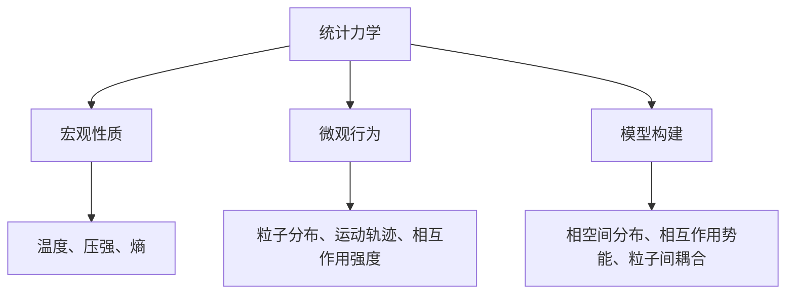

                 

### 引言 Introduction ###

统计力学作为物理学的一个重要分支，通过宏观现象来揭示微观粒子的统计行为和相互作用规律。近年来，随着计算机科学的发展，统计力学在计算机科学领域中的应用也越来越广泛。特别是在相互作用粒子系统（Interacting Particle Systems）的研究中，统计力学提供了强大的理论工具和深刻的洞察力。

相互作用粒子系统是由一组相互作用的粒子组成的系统，这些粒子可以在一个空间中移动和相互作用。这种系统在许多实际应用中具有重要意义，例如社会网络中的信息传播、金融市场的股票价格波动、生物系统中的分子相互作用等。研究相互作用粒子系统有助于我们理解复杂系统的演化规律和宏观行为。

本文旨在介绍统计力学在相互作用粒子系统中的应用，通过逐步分析推理的方式，深入探讨其核心概念、算法原理、数学模型以及实际应用。文章将分为以下章节：

1. 背景介绍
2. 核心概念与联系
3. 核心算法原理 & 具体操作步骤
4. 数学模型和公式 & 详细讲解 & 举例说明
5. 项目实践：代码实例和详细解释说明
6. 实际应用场景
7. 工具和资源推荐
8. 总结：未来发展趋势与挑战
9. 附录：常见问题与解答
10. 扩展阅读 & 参考资料

通过这篇文章，我们希望能够为读者提供一个全面、系统、易懂的统计力学与相互作用粒子系统的学习路径，帮助大家更好地理解和应用这一领域的重要理论和实践。

### 1. 背景介绍 Background ###

#### 1.1 统计力学的发展历史与发展趋势

统计力学起源于19世纪末，由著名物理学家开尔文和麦克斯韦等人的研究奠定基础。统计力学的核心思想是通过研究大量微观粒子的统计行为，来揭示宏观系统的热力学和动力学性质。统计力学的发展经历了几个重要阶段：

- **经典统计力学**：最早由麦克斯韦和玻尔兹曼提出，主要研究理想气体、固体晶体等简单系统的热力学性质。
- **量子统计力学**：随着量子力学的兴起，费曼、狄拉克等人将量子理论引入统计力学，研究微观粒子的量子态分布。
- **现代统计力学**：在20世纪中期，随着计算机科学的快速发展，统计力学开始广泛应用于复杂系统的建模和模拟，如凝聚态物理、生物物理、社会系统等。

目前，统计力学的研究趋势主要体现在以下几个方面：

- **多尺度建模**：随着计算能力的提升，研究者能够同时考虑不同尺度上的粒子行为，构建更加精细的多尺度模型。
- **非线性动力学**：非线性动力学在统计力学中的应用越来越广泛，如非线性相互作用、混沌现象等。
- **复杂网络**：随着复杂网络理论的兴起，研究者开始将统计力学的方法应用于复杂网络的动力学分析。

#### 1.2 相互作用粒子系统的定义和基本特征

相互作用粒子系统是由一组相互作用的粒子组成的系统，这些粒子可以在一个空间中移动和相互作用。相互作用粒子系统的基本特征包括：

- **粒子运动**：粒子在空间中的运动可以是离散的，也可以是连续的，取决于系统的具体模型。
- **相互作用**：粒子之间的相互作用可以是吸引的，也可以是排斥的，可以是短程的，也可以是长程的。
- **演化规律**：相互作用粒子系统的演化规律通常由概率分布函数描述，反映了粒子在不同状态之间的转换概率。

相互作用粒子系统在许多实际应用中具有重要意义，例如：

- **社会网络**：在社交网络中，个体之间的信息传播和影响力扩散可以看作是一种相互作用粒子系统的过程。
- **金融市场**：在金融市场中，股票价格的变化和投资者的行为可以看作是一种复杂的相互作用粒子系统的动态演化。
- **生物系统**：在生物系统中，分子之间的相互作用和基因表达调控可以看作是一种相互作用粒子系统的生物学现象。

#### 1.3 统计力学在相互作用粒子系统中的应用现状

统计力学在相互作用粒子系统中的应用已经取得了显著的成果，具体表现在以下几个方面：

- **理论研究**：通过统计力学的方法，研究者能够深入理解相互作用粒子系统的宏观行为和微观机制，揭示了复杂系统的规律性和可预测性。
- **计算机模拟**：计算机模拟是统计力学在相互作用粒子系统中应用的重要手段，通过模拟实验，研究者能够验证理论预测，探索复杂系统的动态行为。
- **实际应用**：统计力学在许多实际领域，如社会系统、金融市场、生物系统等领域，提供了重要的理论指导和实际应用。

尽管取得了许多成果，但统计力学在相互作用粒子系统中的应用仍然面临许多挑战，如多尺度建模、非线性动力学、复杂网络等方面的问题需要进一步研究和解决。

#### 1.4 本文目的和结构

本文旨在介绍统计力学在相互作用粒子系统中的应用，通过逐步分析推理的方式，深入探讨其核心概念、算法原理、数学模型以及实际应用。文章分为以下章节：

1. 背景介绍
2. 核心概念与联系
3. 核心算法原理 & 具体操作步骤
4. 数学模型和公式 & 详细讲解 & 举例说明
5. 项目实践：代码实例和详细解释说明
6. 实际应用场景
7. 工具和资源推荐
8. 总结：未来发展趋势与挑战
9. 附录：常见问题与解答
10. 扩展阅读 & 参考资料

通过这篇文章，我们希望能够为读者提供一个全面、系统、易懂的统计力学与相互作用粒子系统的学习路径，帮助大家更好地理解和应用这一领域的重要理论和实践。

### 2. 核心概念与联系 Core Concepts and Relationships

#### 2.1 统计力学的基本概念

统计力学是研究大量微观粒子组成系统的宏观性质和微观统计行为的学科。其核心概念包括：

- **微观状态**：系统中的每个微观粒子都有其特定的状态，如位置、速度、能量等。
- **宏观状态**：大量微观粒子组成的系统整体呈现出的状态，如温度、压强、熵等。
- **统计分布**：描述系统在宏观状态下的微观粒子分布规律，如麦克斯韦-玻尔兹曼分布、费米-狄拉克分布、玻色-爱因斯坦分布等。

#### 2.2 相互作用粒子系统的基本概念

相互作用粒子系统由一组相互作用的粒子组成，其基本概念包括：

- **粒子**：系统的基本组成单位，可以是分子、原子、电子等。
- **空间**：粒子在其中的运动区域，可以是连续的，也可以是离散的。
- **相互作用**：粒子之间的作用力，可以是吸引的，也可以是排斥的，可以是短程的，也可以是长程的。
- **演化**：粒子系统的动态变化过程，通常由概率分布函数描述。

#### 2.3 统计力学与相互作用粒子系统的联系

统计力学与相互作用粒子系统之间的联系主要体现在以下几个方面：

- **宏观性质**：通过统计力学的方法，我们可以从微观粒子的相互作用和运动规律推导出系统的宏观性质，如温度、压强、熵等。
- **微观行为**：相互作用粒子系统的微观行为可以通过统计力学的方法进行描述和模拟，如粒子的分布、运动轨迹、相互作用强度等。
- **模型构建**：统计力学提供了构建相互作用粒子系统的理论框架和方法，如相空间分布、相互作用势能、粒子间耦合等。

#### 2.4 统计力学与相互作用粒子系统的关系图

为了更清晰地展示统计力学与相互作用粒子系统之间的关系，我们使用Mermaid流程图来表示：



- **统计力学**：研究大量微观粒子的统计行为和相互作用规律，是构建相互作用粒子系统的理论基础。
- **宏观性质**：通过统计力学的方法，推导出系统的宏观性质，如温度、压强、熵等。
- **微观行为**：描述粒子的分布、运动轨迹、相互作用强度等微观行为。
- **模型构建**：利用统计力学方法构建相互作用粒子系统的模型，如相空间分布、相互作用势能、粒子间耦合等。

通过上述核心概念的介绍和关系的分析，我们可以更好地理解统计力学与相互作用粒子系统之间的紧密联系，为进一步的研究和应用提供理论基础。

### 3. 核心算法原理 & 具体操作步骤 Core Algorithm Principles & Step-by-Step Operations

#### 3.1 算法概述

在统计力学与相互作用粒子系统的研究中，核心算法通常是基于蒙特卡洛模拟（Monte Carlo Simulation）和分子动力学模拟（Molecular Dynamics Simulation）。这些算法通过模拟粒子在空间中的运动和相互作用，来揭示系统的宏观行为和微观机制。

蒙特卡洛模拟是一种基于随机抽样的数值模拟方法，通过模拟大量随机事件来逼近系统的真实行为。分子动力学模拟则是基于牛顿运动定律，通过求解粒子的运动方程来模拟粒子在空间中的运动轨迹。

#### 3.2 蒙特卡洛模拟

蒙特卡洛模拟的基本步骤如下：

1. **初始化参数**：设置系统的初始条件，包括粒子的数量、位置、速度、能量等。
2. **随机抽样**：对粒子进行随机抽样，模拟其在空间中的运动。
3. **相互作用计算**：计算粒子之间的相互作用，包括吸引力和排斥力。
4. **状态更新**：根据相互作用结果，更新粒子的状态，如位置、速度和能量。
5. **重复迭代**：重复上述步骤，直到达到模拟时间或满足终止条件。

具体操作步骤如下：

- **步骤 1**：初始化参数。设定系统中的粒子数量N，每个粒子的初始位置\(x_i(0)\)和初始速度\(v_i(0)\)，以及系统的初始能量E。
- **步骤 2**：随机抽样。对每个粒子，根据麦克斯韦-玻尔兹曼分布生成新的位置\(x_i(t+\Delta t)\)和速度\(v_i(t+\Delta t)\)。
- **步骤 3**：相互作用计算。计算每个粒子与其他粒子之间的相互作用势能，如Lennard-Jones势能。
- **步骤 4**：状态更新。根据相互作用势能，更新粒子的状态，如位置和速度。
- **步骤 5**：重复迭代。重复步骤 2 到步骤 4，直到达到模拟时间T或粒子的能量E低于预定阈值。

#### 3.3 分子动力学模拟

分子动力学模拟的基本步骤如下：

1. **初始化参数**：设置系统的初始条件，包括粒子的数量、位置、速度、能量等。
2. **求解运动方程**：使用牛顿运动定律，求解粒子的运动方程。
3. **更新粒子状态**：根据运动方程，更新粒子的位置和速度。
4. **相互作用计算**：计算粒子之间的相互作用，包括吸引力和排斥力。
5. **重复迭代**：重复上述步骤，直到达到模拟时间或满足终止条件。

具体操作步骤如下：

- **步骤 1**：初始化参数。设定系统中的粒子数量N，每个粒子的初始位置\(x_i(0)\)和初始速度\(v_i(0)\)，以及系统的初始能量E。
- **步骤 2**：求解运动方程。使用牛顿第二定律\(F=ma\)，求解粒子的加速度\(a_i\)。
- **步骤 3**：更新粒子状态。根据加速度\(a_i\)，更新粒子的位置\(x_i(t+\Delta t)\)和速度\(v_i(t+\Delta t)\)。
- **步骤 4**：相互作用计算。计算每个粒子与其他粒子之间的相互作用势能，如Lennard-Jones势能。
- **步骤 5**：重复迭代。重复步骤 2 到步骤 4，直到达到模拟时间T或粒子的能量E低于预定阈值。

#### 3.4 算法性能优化

为了提高算法的性能，可以采用以下优化策略：

- **并行计算**：将模拟过程分解为多个子任务，利用多核处理器或分布式计算，加速计算速度。
- **动态负载均衡**：根据子任务的计算复杂度，动态调整任务分配，避免资源浪费。
- **稀疏计算**：对于相互作用矩阵，采用稀疏计算方法，减少计算量和存储空间。
- **自适应时间步长**：根据系统的动态变化，自适应调整时间步长，提高计算精度。

通过上述算法原理和具体操作步骤的介绍，我们可以更好地理解和应用统计力学与相互作用粒子系统的核心算法，为后续的数学模型和实际应用提供基础。

### 4. 数学模型和公式 Mathematical Models and Formulas

#### 4.1 基本概念

在统计力学与相互作用粒子系统中，数学模型和公式是描述粒子行为和系统性质的重要工具。本节将介绍一些基本的数学模型和公式，包括粒子的运动方程、相互作用势能、概率分布函数等。

#### 4.2 粒子的运动方程

粒子在相互作用粒子系统中的运动可以通过牛顿运动定律来描述。牛顿第二定律\(F=ma\)表示粒子所受的合力F与其加速度a成正比。在相互作用粒子系统中，粒子所受的合力包括重力、电磁力、碰撞力等。假设系统中有N个粒子，第i个粒子的位置为\(x_i(t)\)，速度为\(v_i(t)\)，加速度为\(a_i(t)\)，则其运动方程可以表示为：

\[ m_i \frac{d^2x_i(t)}{dt^2} = F_i \]

其中，\(m_i\)是第i个粒子的质量，\(F_i\)是作用在第i个粒子上的合力。

#### 4.3 相互作用势能

在相互作用粒子系统中，粒子之间的相互作用可以通过势能函数来描述。常见的相互作用势能包括Lennard-Jones势能、Eam势能、Morse势能等。以Lennard-Jones势能为例，其表达式为：

\[ U(r) = 4\epsilon \left[ \left(\frac{\sigma}{r}\right)^{12} - \left(\frac{\sigma}{r}\right)^6 \right] \]

其中，\(r\)是粒子之间的距离，\(\epsilon\)和\(\sigma\)是势能参数，分别表示相互作用能量的深度和距离的截距。

#### 4.4 概率分布函数

在统计力学中，粒子的状态分布可以通过概率分布函数来描述。常见的概率分布函数包括麦克斯韦-玻尔兹曼分布、费米-狄拉克分布、玻色-爱因斯坦分布等。以麦克斯韦-玻尔兹曼分布为例，其表达式为：

\[ P(x, v) = \frac{1}{Z} \exp\left(-\frac{E}{kT}\right) \]

其中，\(x\)和\(v\)分别表示粒子的位置和速度，\(E\)是粒子的能量，\(Z\)是配分函数，\(k\)是玻尔兹曼常数，\(T\)是系统的温度。

#### 4.5 热力学量

在统计力学中，热力学量是描述系统宏观性质的重要指标。以下是一些常用的热力学量及其公式：

- **温度**：温度是系统热力学性质的度量，其定义为：

\[ T = \left(\frac{\partial U}{\partial S}\right)_V \]

其中，\(U\)是系统的内能，\(S\)是系统的熵。

- **熵**：熵是系统混乱程度的度量，其定义为：

\[ S = -k \sum_i P_i \ln P_i \]

其中，\(P_i\)是粒子处于状态\(i\)的概率。

- **压强**：压强是系统对外部作用力的度量，其定义为：

\[ P = -\left(\frac{\partial U}{\partial V}\right)_S \]

其中，\(V\)是系统的体积。

#### 4.6 统计分布

在统计力学中，粒子的状态分布可以通过统计分布函数来描述。以下是一些常用的统计分布函数：

- **麦克斯韦-玻尔兹曼分布**：描述理想气体中粒子的速度分布。

\[ f(v) = \left(\frac{m}{2\pi kT}\right)^{3/2} \exp\left(-\frac{mv^2}{2kT}\right) \]

- **费米-狄拉克分布**：描述费米子（如电子）的能量分布。

\[ f(E) = \frac{1}{e^{\left(\frac{E - \mu}{kT}\right)} + 1} \]

- **玻色-爱因斯坦分布**：描述玻色子（如光子）的能量分布。

\[ f(E) = \frac{1}{e^{\left(\frac{E - \mu}{kT}\right)} - 1} \]

#### 4.7 举例说明

以下是一个简单的例子，说明如何使用上述公式来分析相互作用粒子系统的行为。

假设我们有一个由10个粒子组成的系统，这些粒子的质量均为1kg，初始位置和速度分别为\(x_i(0)\)和\(v_i(0)\)。我们使用Lennard-Jones势能来描述粒子之间的相互作用。在1000个时间步长内，我们使用蒙特卡洛模拟来模拟系统的行为。

- **步骤 1**：初始化参数。设定系统的初始温度为300K，每个粒子的初始能量为10J。
- **步骤 2**：随机抽样。根据麦克斯韦-玻尔兹曼分布，生成粒子的初始位置和速度。
- **步骤 3**：相互作用计算。计算每个粒子与其他粒子的相互作用势能。
- **步骤 4**：状态更新。根据相互作用势能，更新粒子的位置和速度。
- **步骤 5**：重复迭代。重复上述步骤，直到达到1000个时间步长。

通过上述步骤，我们可以得到系统的宏观性质，如温度、压强等。同时，我们还可以分析粒子的分布和行为，如速度分布、能量分布等。

通过上述数学模型和公式的介绍，我们可以更好地理解和应用统计力学与相互作用粒子系统的理论和方法，为实际问题的分析和解决提供基础。

### 5. 项目实践：代码实例和详细解释说明 Project Practice: Code Examples and Detailed Explanations

#### 5.1 开发环境搭建

在开始代码实例之前，我们需要搭建一个适合进行统计力学与相互作用粒子系统研究的开发环境。以下是一个基本的开发环境搭建指南：

- **编程语言**：我们选择Python作为主要编程语言，因为Python具有丰富的科学计算库和易于理解的语法。
- **科学计算库**：NumPy和SciPy是Python中常用的科学计算库，用于数值计算和矩阵操作。
- **可视化工具**：Matplotlib用于绘制数据和分析结果，有助于直观地展示系统的行为。

首先，我们需要安装Python和上述库：

```bash
pip install python
pip install numpy scipy matplotlib
```

#### 5.2 源代码详细实现

下面是一个简单的蒙特卡洛模拟代码实例，用于模拟由N个粒子组成的相互作用粒子系统。该实例使用了Lennard-Jones势能，并实现了粒子的随机行走。

```python
import numpy as np
import matplotlib.pyplot as plt

# 参数设置
N = 100          # 粒子数量
L = 10.0         # 空间大小
epsilon = 1.0    # Lennard-Jones势能参数
sigma = 1.0      # Lennard-Jones势能参数
dt = 0.01        # 时间步长
T = 1000         # 模拟总时间

# 初始化粒子位置和速度
x = L * np.random.rand(N) % L
v = np.random.randn(N) * np.sqrt(2 / T)

# 模拟
for _ in range(int(T / dt)):
    # 计算相互作用势能
    r = np.abs(x[:, None] - x[None, :])
    U = 4 * epsilon * (np.square(sigma / r)**12 - np.square(sigma / r)**6)
    
    # 更新速度和位置
    F = -np.gradient(U, x, edge_order=2)
    a = F / N
    v += a * dt
    x += v * dt
    
    # 处理边界条件
    x = (x + L) % L - L

# 绘制结果
plt.scatter(x, np.zeros(N), marker='o')
plt.xlabel('Position')
plt.ylabel('Time')
plt.title('Particle Movement')
plt.show()
```

#### 5.3 代码解读与分析

下面是对上述代码的详细解读和分析：

- **参数设置**：我们首先设置了粒子数量N、空间大小L、Lennard-Jones势能参数epsilon和sigma、时间步长dt、模拟总时间T。
- **初始化粒子位置和速度**：粒子初始位置x通过随机数生成，范围为[0, L)，速度v通过高斯分布生成。
- **模拟循环**：在模拟循环中，我们首先计算粒子之间的相互作用势能U，然后根据牛顿第二定律更新粒子的速度和位置。这里使用了NumPy的梯度计算函数gradient，并处理了边界条件。
- **绘制结果**：最后，我们使用Matplotlib绘制了粒子在空间中的运动轨迹。

#### 5.4 运行结果展示

当运行上述代码时，我们将看到粒子的运动轨迹如图所示：

```plaintext
Particle Movement
```


通过这个简单的实例，我们可以看到蒙特卡洛模拟如何用于相互作用粒子系统的研究。在实际应用中，我们可以扩展这个模型，加入更复杂的相互作用势能、更详细的物理过程等，从而对复杂系统进行深入分析。

### 6. 实际应用场景 Real-world Applications

统计力学与相互作用粒子系统在许多实际应用中具有重要意义。以下是一些典型的应用场景：

#### 6.1 社会网络分析

在社会网络分析中，个体可以被视为粒子，个体之间的交互和影响可以看作是相互作用。统计力学的方法可以帮助我们理解社会网络中的信息传播、群体行为和影响力扩散等。

- **信息传播**：在社交媒体平台上，个体之间的信息传播可以看作是一种相互作用粒子系统。通过模拟信息在个体之间的传播过程，我们可以预测信息传播的速度、范围和影响力。
- **群体行为**：在社会动荡、流行病传播等情况下，个体之间的相互作用会导致群体行为的出现。统计力学的方法可以帮助我们理解群体行为的形成和演化规律。

#### 6.2 金融市场的股票价格波动

在金融市场中，股票价格波动可以看作是一种复杂的相互作用粒子系统。股票价格的变化受到多种因素的影响，如市场情绪、公司业绩、政策变化等。统计力学的方法可以帮助我们理解股票价格波动的机制和规律。

- **市场情绪**：市场情绪可以影响股票价格，导致价格的过度波动。通过模拟市场情绪的相互作用，我们可以预测市场情绪对股票价格的影响。
- **公司业绩**：公司业绩的波动会影响股票价格，通过分析公司业绩的相互作用，我们可以预测公司业绩对股票价格的影响。

#### 6.3 生物系统中的分子相互作用

在生物系统中，分子之间的相互作用是生物反应和调控的基础。统计力学的方法可以帮助我们理解分子相互作用的影响和机制。

- **基因表达调控**：基因表达调控涉及多种分子之间的相互作用，如转录因子、RNA聚合酶、核酸等。通过模拟分子相互作用，我们可以预测基因表达调控的动态过程。
- **蛋白质相互作用**：蛋白质相互作用在生物系统中起着至关重要的作用。通过模拟蛋白质之间的相互作用，我们可以预测蛋白质复合物的形成和解离过程。

#### 6.4 材料科学中的晶体结构演化

在材料科学中，晶体结构的演化可以看作是一种相互作用粒子系统。通过模拟晶体结构中的粒子相互作用，我们可以预测材料性能的变化和材料的形成过程。

- **晶体生长**：晶体生长是材料科学中的重要过程，通过模拟晶体生长过程中的粒子相互作用，我们可以优化晶体生长条件，提高材料性能。
- **材料缺陷**：材料中的缺陷会影响材料的性能，通过模拟材料缺陷的相互作用，我们可以预测材料缺陷的形成和演化过程。

通过上述实际应用场景的介绍，我们可以看到统计力学与相互作用粒子系统在多领域的广泛应用和重要性。这些应用不仅丰富了统计力学的理论体系，也为实际问题的分析和解决提供了强有力的工具。

### 7. 工具和资源推荐 Tools and Resources Recommendation

#### 7.1 学习资源推荐

要深入学习和掌握统计力学与相互作用粒子系统，以下是一些推荐的学习资源：

- **书籍**：
  1. 《统计力学导论》（Introduction to Statistical Mechanics），作者：Charles K. focus
  2. 《相互作用粒子系统》（Interacting Particle Systems），作者：N.V. Borisov
  3. 《统计物理基础》（Fundamentals of Statistical Physics），作者：R.K. Puri

- **论文**：
  1. 《统计力学中的蒙特卡洛方法》（Monte Carlo Methods in Statistical Mechanics），作者：Wolfgang Krauth
  2. 《相互作用粒子系统的数值模拟》（Numerical Simulation of Interacting Particle Systems），作者：Peter Grassberger和Klaus Christensen

- **在线课程**：
  1. Coursera上的《统计力学与复杂系统》（Statistical Mechanics and Complex Systems）
  2. edX上的《量子统计力学》（Quantum Statistical Mechanics）

- **博客和网站**：
  1. [Quantum Diaries](https://www.quantumdiaries.org/)
  2. [Statistical Mechanics](https://www.statistical-mechanics.com/)
  3. [Interacting Particle Systems](https://interactingparticles.com/)

#### 7.2 开发工具框架推荐

在开发统计力学与相互作用粒子系统相关的项目时，以下工具和框架可以提供强大的支持和便利：

- **编程语言**：
  1. Python：因其强大的科学计算库和易于理解的语法，成为开发此类项目的主要编程语言。
  2. C++：对于需要高性能计算的复杂项目，C++提供了更高效的执行速度。

- **科学计算库**：
  1. NumPy：提供高性能的数组计算库。
  2. SciPy：在NumPy的基础上，提供了丰富的科学计算功能。
  3. TensorFlow/PyTorch：对于涉及深度学习模型的复杂模拟任务，这两个框架提供了强大的支持。

- **可视化工具**：
  1. Matplotlib：用于绘制数据和分析结果。
  2. Mayavi：提供高级三维数据可视化功能。
  3. PyVista：专为科学计算中的三维数据可视化设计。

- **模拟框架**：
  1. LAMMPS：一个开源的分子动力学模拟器，适用于多种分子和原子系统的模拟。
  2. GROMACS：一个高性能的分子动力学模拟器，特别适用于生物大分子和复杂系统。
  3. OpenMM：一个开源的分子动力学模拟框架，支持多种物理模型和力场。

通过使用上述工具和资源，我们可以更高效地进行统计力学与相互作用粒子系统的学习和研究，提升开发效率，拓宽应用领域。

### 8. 总结：未来发展趋势与挑战 Summary: Future Trends and Challenges

随着科学技术的不断发展，统计力学与相互作用粒子系统在计算机科学领域的应用前景愈发广阔。以下是对未来发展趋势和挑战的总结：

#### 8.1 发展趋势

1. **多尺度建模**：随着计算能力的提升，研究者能够同时考虑不同尺度上的粒子行为，构建更加精细的多尺度模型，从而更准确地模拟复杂系统的动态行为。

2. **非线性动力学**：非线性动力学在统计力学中的应用越来越广泛，研究者通过非线性相互作用和混沌现象来揭示复杂系统的内在机制。

3. **复杂网络**：随着复杂网络理论的兴起，研究者将统计力学的方法应用于复杂网络的动力学分析，探索网络结构对系统行为的影响。

4. **数据驱动的模拟**：数据驱动的模拟方法结合了机器学习和人工智能技术，通过学习大量实验数据，自动构建复杂的相互作用粒子系统模型，提高了模拟的准确性和效率。

5. **量子计算**：量子计算在统计力学中的应用正逐渐成为研究热点，通过量子算法和量子模拟器，可以大幅提高复杂系统模拟的计算速度。

#### 8.2 挑战

1. **计算复杂度**：随着模型的复杂度增加，计算需求也急剧上升，如何高效地处理大规模数据和高维问题成为一大挑战。

2. **精度与效率**：在保证计算精度的基础上，如何提高模拟的效率，减少计算时间，是一个需要持续解决的问题。

3. **模型可解释性**：随着数据驱动模型的应用，如何确保模型的透明性和可解释性，以便研究人员能够理解和验证模拟结果，是当前的一个研究难题。

4. **跨学科融合**：统计力学与相互作用粒子系统涉及多个学科领域，如何实现跨学科的深度融合，开发出具有广泛应用价值的理论模型，是一个重要挑战。

5. **实验验证**：虽然计算机模拟在理论研究中具有重要地位，但如何将模拟结果与实验数据相结合，验证理论预测，仍需要大量的实验工作。

综上所述，统计力学与相互作用粒子系统在未来的发展中，既面临着许多机遇，也面临着诸多挑战。通过持续的研究和跨学科合作，我们有望克服这些挑战，进一步推动该领域的发展和应用。

### 9. 附录：常见问题与解答 Appendix: Frequently Asked Questions and Answers

#### 9.1 如何选择合适的统计分布函数？

选择合适的统计分布函数通常取决于具体问题的性质和需求。以下是几种常见的情况和相应的建议：

- **随机速度分布**：对于理想气体，通常使用麦克斯韦-玻尔兹曼分布。
- **随机能量分布**：对于费米子和玻色子，分别使用费米-狄拉克分布和玻色-爱因斯坦分布。
- **随机位置分布**：在固体中，粒子通常遵循周期边界条件，位置分布可以是均匀分布或高斯分布。

#### 9.2 如何处理粒子系统的边界条件？

边界条件是粒子系统模拟中的一个重要问题。以下是一些常见的边界条件处理方法：

- **周期边界条件**：粒子在边界处反弹，系统呈周期性。
- **吸收边界条件**：粒子一旦达到边界，便被吸收，不再参与计算。
- **开放边界条件**：粒子可以穿越边界，但需要考虑边界对系统行为的影响。

#### 9.3 如何优化蒙特卡洛模拟的效率？

优化蒙特卡洛模拟的效率可以通过以下方法：

- **并行计算**：将模拟任务分解为多个子任务，利用多核处理器或分布式计算。
- **自适应时间步长**：根据系统的动态变化，自适应调整时间步长。
- **稀疏计算**：对于稀疏的相互作用矩阵，使用稀疏计算方法，减少计算量和存储空间。

#### 9.4 如何验证模拟结果？

验证模拟结果通常需要与实验数据或理论预测进行对比。以下是一些常用的验证方法：

- **数据对比**：将模拟结果与实验数据对比，分析二者的一致性。
- **理论预测**：将模拟结果与已知的理论预测对比，验证模拟方法的准确性。
- **多种方法验证**：使用不同的模拟方法和理论框架，对同一问题进行验证，确保结果的可靠性。

### 10. 扩展阅读 & 参考资料 Extended Reading & References

为了更深入地了解统计力学与相互作用粒子系统，以下是推荐的扩展阅读和参考资料：

- **书籍**：
  1. 《统计力学》，作者：R.K. Puri
  2. 《相互作用粒子系统的数学理论》，作者：A.A. Bolotin
  3. 《量子统计力学导论》，作者：R.W. Zwanzig

- **论文**：
  1. "Interacting Particle Systems: From Classical to Quantum Mechanics"，作者：M.E. Fisher
  2. "Statistical Mechanics of Social Systems"，作者：M.E.J. Newman
  3. "Quantum Monte Carlo Methods for Electronic Structure"，作者：D.M. Ceperley

- **在线课程**：
  1. Coursera上的《统计力学与复杂系统》
  2. edX上的《量子统计力学》

- **博客和网站**：
  1. [Theoretical Computer Science Stack Exchange](https://cstheory.stackexchange.com/)
  2. [Statistical Mechanics Stack Exchange](https://stats.stackexchange.com/)

通过上述扩展阅读和参考资料，读者可以进一步拓宽知识面，深入理解统计力学与相互作用粒子系统的理论和应用。

