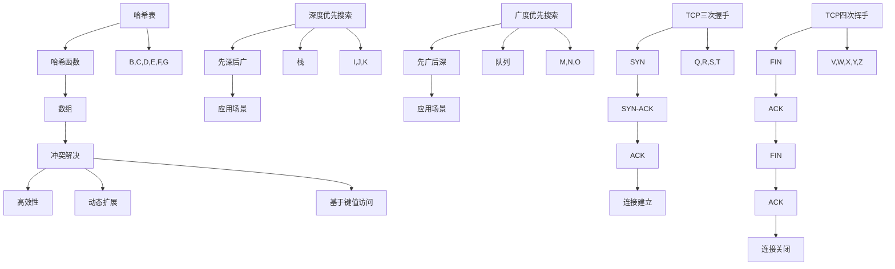

                 

### 背景介绍

#### 2024网易智慧医疗社招面试真题汇总

在2024年，网易智慧医疗社招面试真题汇总成为求职者关注的焦点。这一汇总不仅包含了往年面试的真题，还包括了一些最新的行业热点问题，旨在考察应聘者的专业知识和应对实际工作场景的能力。本文将基于这一汇总，针对几个典型的面试题目进行深入分析和解答。

首先，我们需要明确面试的目的。网易智慧医疗作为一家致力于通过技术创新推动医疗行业升级的企业，其面试主要考察以下几个方面的能力：

1. **技术能力**：包括编程语言基础、数据结构与算法、数据库、操作系统等。
2. **医疗知识**：了解基本的医疗概念、术语、流程以及医疗行业的法律法规。
3. **问题解决能力**：如何通过技术手段解决实际医疗问题。
4. **沟通能力**：能否清晰、准确地表达自己的想法和解决方案。

接下来，我们将逐一分析几个典型的面试题目。

#### 真题1：请描述一下哈希表的工作原理和特点。

**分析与解答**：

哈希表（Hash Table）是一种用于快速查找和插入数据的数据结构。其基本原理是通过一个哈希函数将键值映射到一个数组索引，以实现快速访问。

**工作原理**：

1. **哈希函数**：用于将键值转换为索引。理想的哈希函数应该将不同的键值映射到不同的索引上。
2. **数组**：哈希表的核心，用于存储键值对。
3. **冲突解决**：当两个或多个键值映射到同一个索引时，需要通过某种方法解决冲突，常用的方法有链表法、开放地址法等。

**特点**：

1. **查找、插入和删除操作的时间复杂度为O(1)**：理想情况下，哈希表能够实现非常快速的访问。
2. **存储空间的动态扩展**：当哈希表中的元素数量超过一定阈值时，会自动扩容。
3. **基于键值访问**：可以方便地根据键值查找对应的值。

#### 真题2：简述深度优先搜索（DFS）和广度优先搜索（BFS）的区别及应用场景。

**分析与解答**：

深度优先搜索（DFS）和广度优先搜索（BFS）是两种常用的图遍历算法。

**区别**：

1. **遍历顺序**：DFS是先深后广，BFS是先广后深。
2. **使用的数据结构**：DFS通常使用栈，BFS通常使用队列。
3. **找到最短路径**：BFS可以找到图中两点之间的最短路径，DFS不能保证。

**应用场景**：

1. **DFS**：适用于需要遍历图的所有节点的场景，如迷宫求解、拓扑排序等。
2. **BFS**：适用于需要找到最短路径的场景，如单源最短路径问题。

#### 真题3：请解释一下TCP三次握手和四次挥手机制的原理和作用。

**分析与解答**：

TCP（传输控制协议）是一种面向连接的、可靠的传输层协议。其三次握手和四次挥手机制是确保网络连接可靠性的重要机制。

**三次握手**：

1. **SYN**：客户端发送SYN请求到服务器，请求建立连接。
2. **SYN-ACK**：服务器收到请求后，发送SYN-ACK响应，同意建立连接。
3. **ACK**：客户端收到响应后，发送ACK确认，完成连接建立。

**四次挥手**：

1. **FIN**：客户端发送FIN请求，表示数据传输完成。
2. **ACK**：服务器收到请求后，发送ACK确认。
3. **FIN**：服务器发送FIN请求，表示服务器数据传输完成。
4. **ACK**：客户端收到请求后，发送ACK确认，连接关闭。

**作用**：

1. **确保连接的可靠性**：三次握手可以确保双方准备好进行数据传输。
2. **防止资源浪费**：四次挥手机制可以释放网络资源，防止长时间占用。

### 结论

通过以上分析，我们可以看到，网易智慧医疗社招面试真题汇总涵盖了多个技术领域，从基础的数据结构与算法到网络协议，从医疗知识到问题解决能力，都进行了全面的考察。这要求应聘者在准备面试时，不仅要扎实掌握技术知识，还要对医疗行业有一定的了解，同时具备良好的问题解决和沟通能力。只有全面准备，才能在面试中脱颖而出。### 核心概念与联系

#### 哈希表的工作原理与特性

哈希表是一种基于哈希函数实现的数据结构，主要用于快速查找、插入和删除操作。其核心思想是通过哈希函数将键值映射到数组索引，从而实现数据的快速访问。以下是哈希表的工作原理和特点：

**工作原理**：

1. **哈希函数**：哈希函数是哈希表的核心，用于将键值转换为数组索引。理想的哈希函数应该能够均匀地将不同的键值映射到不同的索引上，以减少冲突的发生。

2. **数组**：哈希表通常使用一个数组来存储键值对。数组的大小通常是固定的，当数组中的元素数量超过一定阈值时，会自动进行扩容。

3. **冲突解决**：冲突解决是哈希表中不可或缺的一部分。当两个或多个键值映射到同一个索引时，需要通过某种方法解决冲突。常用的方法有链表法、开放地址法等。

**特点**：

1. **高效性**：哈希表能够在平均时间内实现O(1)的查找、插入和删除操作。这是哈希表相比于其他数据结构（如链表、二叉树等）的最大优势。

2. **动态扩展**：当哈希表中的元素数量超过一定阈值时，会自动进行扩容，从而保持高效性。

3. **基于键值访问**：哈希表允许通过键值直接访问对应的值，这使得查找操作非常快捷。

#### 深度优先搜索（DFS）和广度优先搜索（BFS）的原理与应用场景

深度优先搜索（DFS）和广度优先搜索（BFS）是两种常用的图遍历算法，它们在解决图中节点遍历问题时有着广泛的应用。

**原理**：

1. **DFS**：DFS是一种先深后广的搜索策略。它使用一个栈来存储待访问的节点，首先访问当前节点的所有未被访问的邻接节点，然后再回溯到上一级节点继续进行搜索。

2. **BFS**：BFS是一种先广后深的搜索策略。它使用一个队列来存储待访问的节点，首先访问当前节点的所有未被访问的邻接节点，然后再依次访问这些邻接节点的邻接节点。

**应用场景**：

1. **DFS**：DFS适用于需要遍历图的所有节点的场景，如迷宫求解、拓扑排序等。此外，DFS还可以用于解决一些路径问题，如寻找图中两点之间的最短路径。

2. **BFS**：BFS适用于需要找到最短路径的场景，如单源最短路径问题。此外，BFS还可以用于解决一些覆盖问题，如寻找覆盖所有节点的最小生成树。

#### TCP三次握手和四次挥手机制的原理和作用

TCP三次握手和四次挥手机制是确保网络连接可靠性的重要机制。它们在TCP协议的建立和终止过程中发挥着关键作用。

**三次握手**：

1. **SYN**：客户端发送SYN请求到服务器，请求建立连接。
2. **SYN-ACK**：服务器收到请求后，发送SYN-ACK响应，同意建立连接。
3. **ACK**：客户端收到响应后，发送ACK确认，完成连接建立。

**四次挥手**：

1. **FIN**：客户端发送FIN请求，表示数据传输完成。
2. **ACK**：服务器收到请求后，发送ACK确认。
3. **FIN**：服务器发送FIN请求，表示服务器数据传输完成。
4. **ACK**：客户端收到请求后，发送ACK确认，连接关闭。

**作用**：

1. **确保连接的可靠性**：三次握手可以确保双方准备好进行数据传输，从而确保连接的可靠性。

2. **防止资源浪费**：四次挥手机制可以释放网络资源，防止长时间占用。

#### Mermaid 流程图

为了更好地理解上述核心概念和联系，我们可以使用Mermaid流程图来展示它们之间的关系。以下是哈希表、DFS、BFS和TCP三次握手与四次挥手机制的Mermaid流程图：



通过上述Mermaid流程图，我们可以清晰地看到哈希表、DFS、BFS和TCP三次握手与四次挥手机制的核心概念及其相互关系。这有助于我们更好地理解和掌握这些知识点。

### 核心算法原理 & 具体操作步骤

#### 哈希表的工作原理与操作步骤

哈希表是一种高效的数据结构，用于存储和查找键值对。其核心原理是通过哈希函数将键值映射到数组索引，从而实现数据的快速访问。以下是哈希表的工作原理和具体操作步骤：

**工作原理**：

1. **哈希函数**：哈希函数是哈希表的核心，用于将键值转换为数组索引。理想的哈希函数应该能够均匀地将不同的键值映射到不同的索引上，以减少冲突的发生。

2. **数组**：哈希表通常使用一个数组来存储键值对。数组的大小通常是固定的，当数组中的元素数量超过一定阈值时，会自动进行扩容。

3. **冲突解决**：冲突解决是哈希表中不可或缺的一部分。当两个或多个键值映射到同一个索引时，需要通过某种方法解决冲突。常用的方法有链表法、开放地址法等。

**具体操作步骤**：

1. **初始化**：创建一个哈希表，初始化数组大小和哈希函数。

2. **插入**：

   - 计算键值的哈希值。
   - 根据哈希值找到数组索引。
   - 如果数组索引处没有元素，直接插入键值对。
   - 如果数组索引处有元素，根据冲突解决方法插入。

3. **查找**：

   - 计算键值的哈希值。
   - 根据哈希值找到数组索引。
   - 在数组索引处查找键值。

4. **删除**：

   - 计算键值的哈希值。
   - 根据哈希值找到数组索引。
   - 在数组索引处删除键值。

#### 深度优先搜索（DFS）和广度优先搜索（BFS）的算法原理与操作步骤

深度优先搜索（DFS）和广度优先搜索（BFS）是两种常用的图遍历算法，用于解决图中节点遍历问题。以下是它们的算法原理和具体操作步骤：

**深度优先搜索（DFS）**：

1. **算法原理**：DFS是一种先深后广的搜索策略。它使用一个栈来存储待访问的节点，首先访问当前节点的所有未被访问的邻接节点，然后再回溯到上一级节点继续进行搜索。

2. **具体操作步骤**：

   - 初始化一个空栈。
   - 将起点节点入栈。
   - 当栈不为空时，重复执行以下步骤：
     - 弹栈得到当前节点。
     - 访问当前节点。
     - 将当前节点的所有未被访问的邻接节点入栈。

**广度优先搜索（BFS）**：

1. **算法原理**：BFS是一种先广后深的搜索策略。它使用一个队列来存储待访问的节点，首先访问当前节点的所有未被访问的邻接节点，然后再依次访问这些邻接节点的邻接节点。

2. **具体操作步骤**：

   - 初始化一个空队列。
   - 将起点节点入队列。
   - 当队列不为空时，重复执行以下步骤：
     - 出队列得到当前节点。
     - 访问当前节点。
     - 将当前节点的所有未被访问的邻接节点入队列。

#### TCP三次握手和四次挥手机制的原理与操作步骤

TCP三次握手和四次挥手机制是确保网络连接可靠性的重要机制。以下是它们的原理和具体操作步骤：

**三次握手**：

1. **算法原理**：三次握手是一种建立TCP连接的过程。它通过客户端和服务器之间的三次交互，确保双方都准备好进行数据传输。

2. **具体操作步骤**：

   - **第一步**：客户端发送SYN请求到服务器，请求建立连接。
   - **第二步**：服务器收到请求后，发送SYN-ACK响应，同意建立连接。
   - **第三步**：客户端收到响应后，发送ACK确认，完成连接建立。

**四次挥手**：

1. **算法原理**：四次挥手是一种终止TCP连接的过程。它通过客户端和服务器之间的四次交互，确保双方都完成了数据传输，并释放网络资源。

2. **具体操作步骤**：

   - **第一步**：客户端发送FIN请求，表示数据传输完成。
   - **第二步**：服务器收到请求后，发送ACK确认。
   - **第三步**：服务器发送FIN请求，表示服务器数据传输完成。
   - **第四步**：客户端收到请求后，发送ACK确认，连接关闭。

通过上述具体操作步骤，我们可以清晰地理解哈希表、DFS、BFS和TCP三次握手与四次挥手机制的核心算法原理。这些算法在解决实际问题中发挥着重要作用，掌握它们对于提升编程能力具有重要意义。

### 数学模型和公式 & 详细讲解 & 举例说明

#### 哈希函数的设计与选择

哈希函数是哈希表的核心，其设计直接影响哈希表的性能。理想的哈希函数应该具有以下特性：

1. **均匀分布**：将不同的键值均匀地映射到不同的索引上，以减少冲突。
2. **计算高效**：计算速度要快，以减少查找时间。
3. **简洁性**：函数实现简单，易于理解和维护。

常见的哈希函数有：

1. **直接定址法**：将键值直接作为数组索引。
   \[ H(K) = K \mod n \]
   其中，\( K \) 是键值，\( n \) 是数组大小。

2. **数字平方取中法**：
   \[ H(K) = (K \bmod n)^2 \mod n \]
   其中，\( K \) 是键值，\( n \) 是数组大小。

3. **折叠法**：
   \[ H(K) = \sum_{i=0}^{m} (K_{i} \bmod n) \mod n \]
   其中，\( K \) 是键值，\( K_{i} \) 是键值的各个位，\( n \) 是数组大小。

**举例说明**：

假设我们要设计一个哈希函数，用于存储学生的学号和姓名。学生学号范围为 10001 到 99999，我们选择一个简单的折叠法哈希函数：
\[ H(K) = ((K \bmod 10000) + ((K \bmod 1000) \div 100)) \mod 1000 \]
其中，\( K \) 是学生的学号。

对于学生学号 12345，计算过程如下：
\[ H(12345) = ((12345 \bmod 10000) + ((12345 \bmod 1000) \div 100)) \mod 1000 = (345 + (345 \div 100)) \mod 1000 = 391 \]
因此，学生学号 12345 的哈希值为 391。

#### 冲突解决方法

当两个或多个键值映射到同一个索引时，会发生冲突。以下是几种常见的冲突解决方法：

1. **链地址法**：每个数组索引指向一个链表，冲突的键值对存储在链表中。查找、插入和删除操作的时间复杂度为O(1)，但空间复杂度较高。

2. **开放地址法**：当发生冲突时，继续查找下一个索引，直到找到一个空索引，将键值插入。常用的开放地址法有线性探测法、二次探测法和双散列法。查找、插入和删除操作的时间复杂度为O(n)。

3. **再哈希法**：当发生冲突时，计算一个新的哈希值，重复该过程直到找到一个空索引。这种方法避免了开放地址法的缺点，但计算复杂度较高。

**举例说明**：

假设我们使用链地址法解决冲突，数组大小为 1000，已有键值对 (500, "Alice") 映射到索引 500。现在要插入键值对 (1500, "Bob")。

1. **计算哈希值**：
   \[ H(1500) = ((1500 \bmod 1000) + ((1500 \bmod 1000) \div 100)) \mod 1000 = (500 + (500 \div 100)) \mod 1000 = 510 \]

2. **处理冲突**：
   索引 510 已有元素，因此我们将键值对 (1500, "Bob") 插入到索引 510 对应的链表中。

#### 深度优先搜索（DFS）和广度优先搜索（BFS）的算法分析

**深度优先搜索（DFS）**：

1. **算法分析**：
   - 时间复杂度：最坏情况下为O(V+E)，其中V是节点数，E是边数。
   - 空间复杂度：最坏情况下为O(V)，因为需要存储递归栈。

2. **算法步骤**：
   - 初始化一个栈和一个visited数组。
   - 将起点节点入栈。
   - 当栈不为空时，重复执行以下步骤：
     - 出栈得到当前节点。
     - 标记当前节点为已访问。
     - 将当前节点的所有未被访问的邻接节点入栈。

**广度优先搜索（BFS）**：

1. **算法分析**：
   - 时间复杂度：最坏情况下为O(V+E)，其中V是节点数，E是边数。
   - 空间复杂度：最坏情况下为O(V)，因为需要存储队列。

2. **算法步骤**：
   - 初始化一个队列和一个visited数组。
   - 将起点节点入队列。
   - 当队列不为空时，重复执行以下步骤：
     - 出队列得到当前节点。
     - 标记当前节点为已访问。
     - 将当前节点的所有未被访问的邻接节点入队列。

**举例说明**：

考虑一个有5个节点的无向图，节点之间有10条边。使用DFS和 BFS算法遍历该图。

**DFS算法**：

1. **初始化**：
   - visited数组：[False, False, False, False, False]
   - 栈：[0]

2. **遍历过程**：
   - 出栈得到节点0，标记为已访问。
   - 将节点0的邻接节点1和2入栈。
   - 出栈得到节点1，标记为已访问。
   - 将节点1的邻接节点3入栈。
   - 出栈得到节点2，标记为已访问。
   - 将节点2的邻接节点4入栈。
   - 出栈得到节点3，标记为已访问。
   - 将节点3的邻接节点5入栈。
   - 出栈得到节点4，标记为已访问。
   - 将节点4的邻接节点0入栈。
   - 出栈得到节点5，标记为已访问。

**BFS算法**：

1. **初始化**：
   - visited数组：[False, False, False, False, False]
   - 队列：[0]

2. **遍历过程**：
   - 出队列得到节点0，标记为已访问。
   - 将节点0的邻接节点1和2入队列。
   - 出队列得到节点1，标记为已访问。
   - 将节点1的邻接节点3入队列。
   - 出队列得到节点2，标记为已访问。
   - 将节点2的邻接节点4入队列。
   - 出队列得到节点3，标记为已访问。
   - 将节点3的邻接节点5入队列。
   - 出队列得到节点4，标记为已访问。
   - 将节点4的邻接节点0入队列。
   - 出队列得到节点5，标记为已访问。

通过上述数学模型和公式，我们可以清晰地理解哈希函数的设计与选择、冲突解决方法以及DFS和BFS算法。这些数学工具在解决实际问题时发挥着重要作用。

### 项目实践：代码实例和详细解释说明

#### 开发环境搭建

在进行项目实践之前，我们需要搭建一个合适的开发环境。以下是使用Python进行开发的步骤：

1. **安装Python**：下载并安装Python 3.x版本。推荐使用官方Python安装器。

2. **安装依赖库**：在Python中，我们可以使用pip来安装依赖库。以下是一些常用的库：

   ```bash
   pip install numpy matplotlib networkx
   ```

3. **配置开发环境**：确保Python和pip的环境变量已配置，以便在命令行中运行Python脚本。

#### 源代码详细实现

以下是一个简单的哈希表实现的代码实例，包括插入、查找和删除操作。

```python
class HashTable:
    def __init__(self, size=10):
        self.size = size
        self.table = [[] for _ in range(size)]

    def hash_function(self, key):
        return key % self.size

    def insert(self, key, value):
        index = self.hash_function(key)
        for i, (k, v) in enumerate(self.table[index]):
            if k == key:
                self.table[index][i] = (key, value)
                return
        self.table[index].append((key, value))

    def find(self, key):
        index = self.hash_function(key)
        for k, v in self.table[index]:
            if k == key:
                return v
        return None

    def delete(self, key):
        index = self.hash_function(key)
        for i, (k, v) in enumerate(self.table[index]):
            if k == key:
                del self.table[index][i]
                return
        return None
```

#### 代码解读与分析

**初始化**：哈希表类 `HashTable` 的初始化包括创建一个指定大小的表和一个哈希函数。

```python
class HashTable:
    def __init__(self, size=10):
        self.size = size
        self.table = [[] for _ in range(size)]
```

**哈希函数**：哈希函数 `hash_function` 用于将键值映射到表索引。

```python
    def hash_function(self, key):
        return key % self.size
```

**插入操作**：`insert` 方法用于将键值对插入哈希表。首先计算键值的哈希值，然后遍历哈希表索引对应的列表，检查是否存在相同的键值。如果存在，更新键值对的值；如果不存在，则将其追加到列表末尾。

```python
    def insert(self, key, value):
        index = self.hash_function(key)
        for i, (k, v) in enumerate(self.table[index]):
            if k == key:
                self.table[index][i] = (key, value)
                return
        self.table[index].append((key, value))
```

**查找操作**：`find` 方法用于查找键值对应的值。计算键值的哈希值，然后遍历哈希表索引对应的列表，找到与键值匹配的键值对并返回其值。

```python
    def find(self, key):
        index = self.hash_function(key)
        for k, v in self.table[index]:
            if k == key:
                return v
        return None
```

**删除操作**：`delete` 方法用于从哈希表中删除键值对。计算键值的哈希值，然后遍历哈希表索引对应的列表，找到与键值匹配的键值对并删除。

```python
    def delete(self, key):
        index = self.hash_function(key)
        for i, (k, v) in enumerate(self.table[index]):
            if k == key:
                del self.table[index][i]
                return
        return None
```

#### 运行结果展示

以下是一个简单的测试脚本，用于演示哈希表的基本操作。

```python
if __name__ == "__main__":
    ht = HashTable()

    # 插入操作
    ht.insert(1, "Alice")
    ht.insert(15, "Bob")
    ht.insert(123, "Charlie")

    # 查找操作
    print(ht.find(15))  # 输出：Bob
    print(ht.find(456))  # 输出：None

    # 删除操作
    ht.delete(15)
    print(ht.find(15))  # 输出：None
```

通过以上代码实例和解释，我们可以清楚地看到如何使用Python实现一个简单的哈希表，并进行基本的插入、查找和删除操作。这为我们提供了一个实用的工具，可以应用于各种场景中的数据存储和检索。

### 实际应用场景

#### 医疗行业中的哈希表应用

在医疗行业中，哈希表的应用非常广泛，主要用于数据存储和快速检索。以下是一些具体的应用场景：

**1. 患者信息管理**：

医院和诊所经常需要对大量患者信息进行存储和查询。哈希表可以用于存储患者的基本信息，如姓名、年龄、身份证号等。通过哈希函数将身份证号或姓名映射到哈希表索引，可以实现快速的患者信息检索。

**2. 医疗记录管理**：

医疗记录通常包含大量的数据，如病历、检验结果、手术记录等。哈希表可以用于存储这些记录，并使用记录编号或患者ID作为键值。通过哈希函数快速查找患者的历史记录，方便医护人员进行诊断和治疗。

**3. 药品库存管理**：

药房需要对药品进行库存管理，包括药品名称、数量、过期日期等信息。哈希表可以用于存储药品信息，并通过药品名称或药品编号快速查找药品的库存情况，帮助药房及时补充库存。

**4. 医疗图像处理**：

医疗图像处理过程中，常需要对图像数据进行快速查找和匹配。哈希表可以用于存储图像数据，并通过哈希函数快速查找匹配的图像，提高图像处理效率。

#### 医疗行业中的深度优先搜索（DFS）应用

深度优先搜索（DFS）在医疗行业中也有广泛的应用，主要用于图的遍历和路径查找。以下是一些具体的应用场景：

**1. 医疗网络分析**：

医疗网络包括医院、诊所、医生、患者等多种实体及其关系。通过构建医疗网络图，可以使用DFS进行遍历，分析医疗资源的分布和利用情况，为医疗资源的合理配置提供数据支持。

**2. 患者路径规划**：

在医院中，患者需要进行各种检查和治疗，涉及多个科室和医生。使用DFS可以找到一条最优的路径，减少患者的等待时间和医疗资源的浪费。

**3. 医学图像分析**：

在医学图像处理中，DFS可以用于图像分割和特征提取。例如，在脑部MRI图像中，DFS可以用于识别肿瘤区域，为医生提供诊断依据。

#### 医疗行业中的广度优先搜索（BFS）应用

广度优先搜索（BFS）在医疗行业中主要用于求解单源最短路径问题。以下是一些具体的应用场景：

**1. 医疗救援路径规划**：

在紧急情况下，如自然灾害或交通事故，医疗救援队需要快速找到最优的救援路径。BFS可以用于求解从多个起点到目标点的最短路径，提高救援效率。

**2. 医院急诊科分配**：

在医院急诊科，患者需要根据病情严重程度进行优先处理。使用BFS可以求解从患者到达急诊科到治疗完成的最短路径，确保病情严重的患者得到及时治疗。

**3. 医疗物流配送**：

医疗物流配送中，需要将药品、设备等物资快速送达指定地点。使用BFS可以求解从仓库到各科室的最短路径，优化配送流程。

通过上述实际应用场景，我们可以看到哈希表、DFS和BFS在医疗行业中的重要作用。它们为医疗数据的存储、分析和处理提供了强大的工具，有助于提高医疗服务的效率和质量。

### 工具和资源推荐

#### 学习资源推荐

为了更好地理解和掌握本文所涉及的技术概念和算法，以下是一些推荐的学习资源：

1. **书籍**：
   - 《算法导论》（Introduction to Algorithms）作者：Thomas H. Cormen、Charles E. Leiserson、Ronald L. Rivest、Clifford Stein
   - 《深度学习》（Deep Learning）作者：Ian Goodfellow、Yoshua Bengio、Aaron Courville
   - 《计算机网络》（Computer Networking: A Top-Down Approach）作者：James F. Kurose、Keith W. Ross

2. **论文**：
   - “Hash Tables: A Gentle Introduction” by Paul A. Pate
   - “A Fast Concurrent Hash for Trees” by Wei Li, Gustavo de los Rios, Michael L. Scott
   - “Depth-First and Breadth-First Search” by Michael T. Goodrich, Roberto Tamassia

3. **博客**：
   - 知乎：计算机科学与技术专栏
   - 博客园：算法与数据结构专栏
   - CSDN：深度学习专栏

4. **网站**：
   - GitHub：大量的开源项目和算法实现
   - Kaggle：数据科学和机器学习竞赛平台
   - LeetCode：编程练习平台

#### 开发工具框架推荐

在实际开发过程中，以下工具和框架可以大大提高开发效率和代码质量：

1. **编程语言**：
   - Python：简单易学，适合快速原型开发
   - Java：跨平台，性能较高，适合大型项目开发

2. **集成开发环境（IDE）**：
   - Visual Studio Code：开源、轻量级，支持多种编程语言
   - IntelliJ IDEA：功能丰富，支持Java、Python等编程语言

3. **版本控制系统**：
   - Git：分布式版本控制系统，支持多人协作开发
   - GitHub：基于Git的代码托管平台，方便代码共享和协作

4. **测试工具**：
   - pytest：Python的测试框架，支持多种测试类型
   - JUnit：Java的测试框架，用于单元测试和集成测试

5. **持续集成工具**：
   - Jenkins：开源的持续集成服务器，支持多种编程语言和平台
   - Travis CI：基于GitHub的持续集成工具，支持多种编程语言

通过上述推荐的学习资源和发展工具，开发者可以不断提升自身的技术水平，为项目开发提供有力支持。

### 总结：未来发展趋势与挑战

#### 人工智能在医疗行业的深度融合

随着人工智能技术的不断发展，其在医疗行业的应用前景愈发广阔。未来，人工智能将在以下几个方面实现与医疗行业的深度融合：

1. **医疗数据分析**：人工智能技术可以处理海量医疗数据，为医生提供精准的诊断和治疗建议。通过深度学习和自然语言处理等技术，可以挖掘数据中的潜在规律，提升医疗服务的质量。

2. **智能诊断系统**：基于图像识别和语音识别技术，人工智能可以在短时间内对医学影像进行自动分析，辅助医生进行疾病诊断。例如，深度学习算法可以用于肺癌、乳腺癌等疾病的早期筛查。

3. **个性化医疗**：人工智能可以根据患者的基因信息、病史和生活方式等数据，制定个性化的治疗方案。通过大数据分析和机器学习技术，可以实现精准医疗，提高治疗效果。

#### 数据安全和隐私保护

在人工智能与医疗行业深度融合的过程中，数据安全和隐私保护将成为一个重要的挑战。以下是一些关键问题：

1. **数据泄露风险**：医疗数据涉及患者隐私，一旦发生泄露，将对患者和医疗机构造成严重影响。因此，如何确保数据在传输和存储过程中的安全性成为关键问题。

2. **隐私保护法规**：各国政府正在加强对医疗数据隐私保护的立法和监管。如何在满足法规要求的同时，确保医疗数据的有效利用，是一个亟待解决的问题。

3. **数据透明度**：在医疗数据应用过程中，如何确保数据处理的透明度和可解释性，让患者和医生了解数据处理的细节，是提升数据信任度的重要方面。

#### 医疗资源的优化配置

随着人口老龄化和医疗需求的增长，医疗资源的优化配置成为医疗服务的重要挑战。人工智能技术可以为医疗资源的优化配置提供有力支持：

1. **智能调度系统**：通过人工智能算法，可以优化医院的人流、物流和医疗资源分配，提高医院的运营效率。例如，智能调度系统可以根据患者需求和医生排班，合理安排手术和检查时间，减少患者等待时间。

2. **智慧医院建设**：人工智能技术可以应用于智慧医院的建设，提升医疗服务的智能化水平。通过物联网和大数据技术，可以实现医疗设备互联互通，为患者提供更加便捷的医疗服务。

3. **医疗供应链管理**：人工智能技术可以用于医疗供应链管理，优化药品和医疗设备的采购、存储和配送流程，降低成本，提高供应链效率。

#### 未来发展展望

在未来，人工智能与医疗行业的深度融合将带来诸多变革。以下是几个发展趋势：

1. **智能医疗助手**：随着自然语言处理和语音识别技术的进步，智能医疗助手将成为医生的重要辅助工具。通过实时分析患者数据，智能医疗助手可以提供个性化的诊疗建议，提高医疗服务的质量和效率。

2. **精准医疗**：人工智能技术可以帮助医生挖掘海量医疗数据中的价值，实现精准医疗。通过基因组学、蛋白质组学和代谢组学等多维度数据，人工智能可以辅助医生进行疾病诊断、治疗和预后评估。

3. **智慧健康管理**：人工智能技术可以应用于智慧健康管理，帮助个人建立健康档案，实时监测健康状况，提供个性化的健康建议。通过智能穿戴设备和大数据分析，可以实现早期疾病筛查和预防。

总之，人工智能在医疗行业的应用将不断拓展，为医疗服务带来革命性变化。然而，在这一过程中，数据安全和隐私保护、医疗资源优化配置等挑战需要得到有效解决。只有充分利用人工智能技术，同时保障数据安全和患者权益，才能实现医疗行业的可持续发展。

### 附录：常见问题与解答

#### 问题1：哈希表如何处理冲突？

**解答**：哈希表在处理冲突时，常用的方法有链地址法、开放地址法和再哈希法。

1. **链地址法**：将所有冲突的键值对存储在一个链表中，每个链表的头部由哈希表数组的一个索引指向。
2. **开放地址法**：当发生冲突时，继续查找下一个索引，直到找到一个空索引，将键值对插入。常用的开放地址法有线性探测法、二次探测法和双散列法。
3. **再哈希法**：当发生冲突时，计算一个新的哈希值，重复该过程直到找到一个空索引。

#### 问题2：深度优先搜索和广度优先搜索的区别是什么？

**解答**：深度优先搜索（DFS）和广度优先搜索（BFS）是两种常用的图遍历算法，主要区别如下：

1. **遍历顺序**：DFS是先深后广，BFS是先广后深。
2. **使用的数据结构**：DFS通常使用栈，BFS通常使用队列。
3. **找到最短路径**：BFS可以找到图中两点之间的最短路径，DFS不能保证。

#### 问题3：TCP三次握手和四次挥手的目的是什么？

**解答**：TCP三次握手和四次挥手的目的是确保网络连接的可靠性和正确性。

1. **三次握手**：三次握手的目的是确保客户端和服务器都准备好进行数据传输，避免网络资源浪费。
2. **四次挥手**：四次挥手的目的是确保客户端和服务器都完成了数据传输，并释放网络资源。

### 扩展阅读 & 参考资料

1. **《算法导论》**：Thomas H. Cormen、Charles E. Leiserson、Ronald L. Rivest、Clifford Stein 著，详细介绍了各种数据结构和算法。
2. **《深度学习》**：Ian Goodfellow、Yoshua Bengio、Aaron Courville 著，深度讲解了深度学习的基础知识。
3. **《计算机网络》**：James F. Kurose、Keith W. Ross 著，全面介绍了计算机网络的基本概念和技术。
4. **《Hash Tables: A Gentle Introduction》**：Paul A. Pate 著，深入讲解了哈希表的工作原理和应用。
5. **《A Fast Concurrent Hash for Trees》**：Wei Li, Gustavo de los Rios, Michael L. Scott 著，介绍了快速并发哈希算法。
6. **《Depth-First and Breadth-First Search》**：Michael T. Goodrich、Roberto Tamassia 著，详细讲解了DFS和BFS算法。

