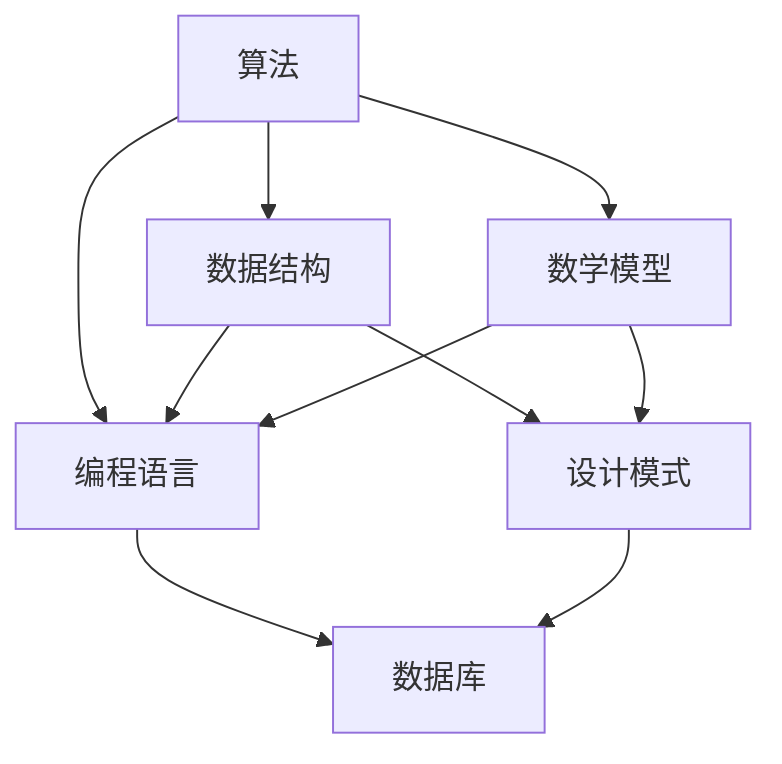
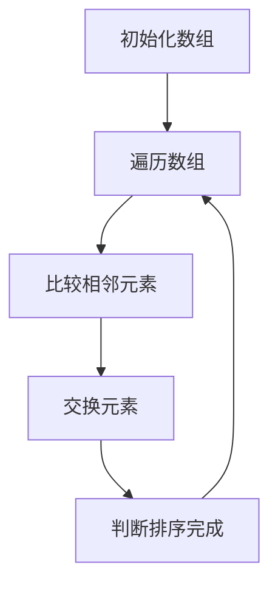
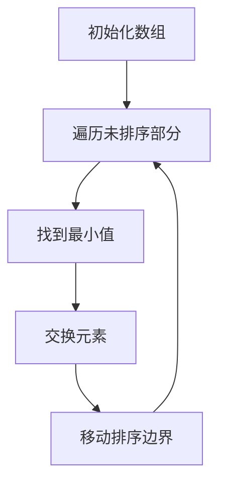
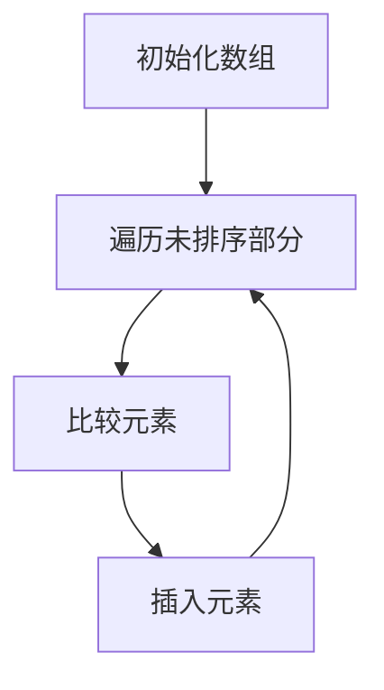
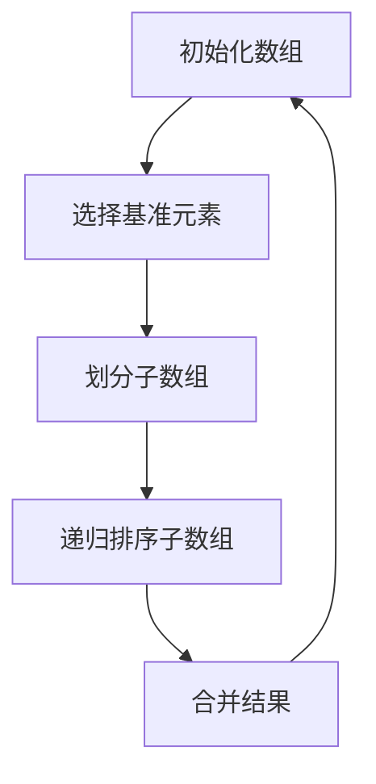
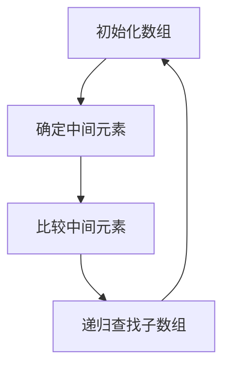
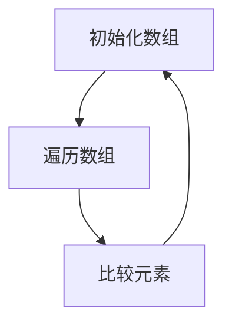
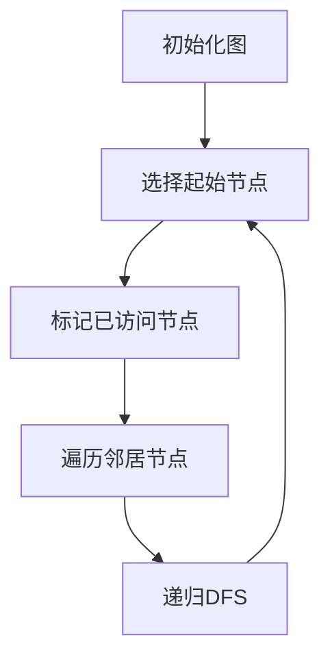
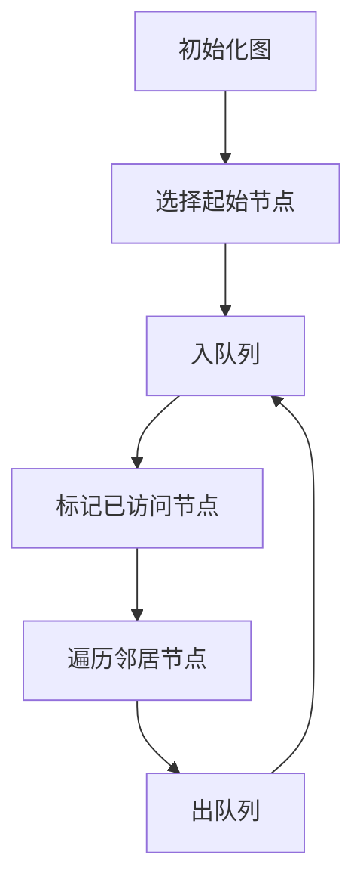

                 

### 背景介绍

《2025网易校招编程面试题精选与解答》旨在为广大准备参加网易校招编程面试的学子提供一套全面、系统、实用的面试题集。随着科技的发展，编程面试在各个行业中变得越来越重要，尤其是在互联网公司，编程面试更是成为衡量应聘者技术水平和编程能力的重要标准。本文将围绕网易校招编程面试的几个关键环节，深入探讨核心概念、算法原理、数学模型、项目实践以及实际应用场景，帮助读者全面了解和掌握编程面试所需的知识和技能。

本文的撰写思路将遵循以下步骤：

1. **背景介绍**：介绍编程面试的重要性以及本文的撰写目的。
2. **核心概念与联系**：通过 Mermaid 流程图阐述核心概念和原理，为后续内容的展开奠定基础。
3. **核心算法原理 & 具体操作步骤**：详细介绍编程面试中常见算法的原理和实现步骤。
4. **数学模型和公式 & 详细讲解 & 举例说明**：讲解与编程面试相关的数学模型，并通过具体例子进行说明。
5. **项目实践：代码实例和详细解释说明**：通过实际项目案例，展示编程面试题的解决过程。
6. **实际应用场景**：探讨编程面试题在现实中的应用场景。
7. **工具和资源推荐**：推荐相关学习资源、开发工具和框架。
8. **总结：未来发展趋势与挑战**：总结文章内容，展望未来发展趋势和挑战。
9. **附录：常见问题与解答**：解答读者在阅读过程中可能遇到的问题。
10. **扩展阅读 & 参考资料**：提供更多扩展阅读资源和参考资料。

通过以上十个部分的详细阐述，本文希望能够为准备参加网易校招编程面试的学子提供一份实用的指南，帮助他们在面试中取得优异成绩。接下来，我们将逐一探讨每个部分的内容。

### 核心概念与联系

在编程面试中，核心概念与联系是理解问题本质和找到解决方案的关键。为了更好地阐述这些核心概念，我们将使用 Mermaid 流程图来展示它们之间的联系。以下是一个简化的 Mermaid 流程图示例：



在这个流程图中：

- **算法（A）**：是解决问题的一系列步骤，是解决复杂问题的核心。
- **数据结构（B）**：是存储和组织数据的方式，直接影响算法的效率。
- **数学模型（C）**：用于描述现实世界中的问题，是算法设计的理论基础。
- **编程语言（D）**：是编写程序的工具，不同的编程语言适用于不同的应用场景。
- **设计模式（E）**：是解决常见问题的通用方案，有助于提高代码的可读性和可维护性。
- **数据库（F）**：是存储和管理数据的重要工具，对于处理大数据和高并发场景至关重要。

以下是每个核心概念的详细解释：

#### 算法（Algorithm）

算法是解决问题的一系列步骤，通常用于处理复杂的计算和逻辑问题。算法的好坏直接影响程序的效率和性能。常见的算法包括排序算法（如冒泡排序、快速排序）、查找算法（如二分查找）、图算法（如深度优先搜索、广度优先搜索）等。

#### 数据结构（Data Structure）

数据结构是存储和组织数据的方式，直接影响算法的效率和性能。常见的数据结构包括数组、链表、栈、队列、树、图等。每种数据结构都有其独特的特点和适用场景，选择合适的数据结构是算法设计的重要一环。

#### 数学模型（Math Model）

数学模型是用于描述现实世界中的问题，是算法设计的理论基础。通过数学模型，我们可以将实际问题转化为数学问题，然后利用数学方法求解。常见的数学模型包括线性模型、非线性模型、概率模型等。

#### 编程语言（Programming Language）

编程语言是编写程序的工具，不同的编程语言适用于不同的应用场景。常见的编程语言包括 Java、Python、C++、JavaScript 等。选择合适的编程语言可以帮助我们更高效地解决问题。

#### 设计模式（Design Pattern）

设计模式是解决常见问题的通用方案，有助于提高代码的可读性和可维护性。常见的设计模式包括单例模式、工厂模式、观察者模式、策略模式等。

#### 数据库（Database）

数据库是存储和管理数据的重要工具，对于处理大数据和高并发场景至关重要。常见的数据库包括关系型数据库（如 MySQL、Oracle）和非关系型数据库（如 MongoDB、Redis）。

通过上述 Mermaid 流程图和详细解释，我们可以更好地理解编程面试中的核心概念及其之间的联系。在接下来的章节中，我们将逐一深入探讨这些概念的具体应用和实践。

### 核心算法原理 & 具体操作步骤

在编程面试中，算法题是考察应聘者逻辑思维和问题解决能力的重要环节。本文将介绍几类常见的算法题，包括排序算法、查找算法和图算法，并详细解释它们的原理和具体操作步骤。

#### 排序算法

排序算法是编程面试中非常常见的一类题目，主要用于对数据进行排序。常见的排序算法有冒泡排序、选择排序、插入排序、快速排序等。

**1. 冒泡排序（Bubble Sort）**

冒泡排序的基本思想是通过反复交换相邻的未按顺序排列的元素，使得每个元素最终移动到其正确的位置。

**原理**：
- 遍历数组，比较相邻的元素，如果前一个元素比后一个元素大，则交换它们的位置。
- 遍历结束后，最大的元素会被“冒泡”到数组的末尾。
- 重复以上步骤，直到所有元素都按顺序排列。

**具体操作步骤**：



**2. 选择排序（Selection Sort）**

选择排序的基本思想是每次遍历数组，找到剩余元素中的最小值，并将其放在已排序序列的末尾。

**原理**：
- 遍历数组，找到未排序部分的最小值。
- 将最小值与未排序部分的第一个元素交换。
- 重复以上步骤，直到整个数组排序完成。

**具体操作步骤**：



**3. 插入排序（Insertion Sort）**

插入排序的基本思想是将未排序的元素插入到已排序的序列中，直到整个数组排序完成。

**原理**：
- 从第一个元素开始，将其视为已排序序列。
- 遍历剩余元素，对于每个元素，将其与已排序序列中的元素进行比较，并插入到正确的位置。
- 重复以上步骤，直到整个数组排序完成。

**具体操作步骤**：



**4. 快速排序（Quick Sort）**

快速排序是一种高效的排序算法，其基本思想是通过递归将数组划分为较小的子数组，然后分别对子数组进行排序。

**原理**：
- 选择一个基准元素，将数组划分为两个子数组，一个包含比基准元素小的元素，另一个包含比基准元素大的元素。
- 分别对两个子数组递归进行快速排序。
- 合并两个已排序的子数组。

**具体操作步骤**：



#### 查找算法

查找算法用于在数据结构中查找特定的元素，常见的查找算法有二分查找、顺序查找等。

**1. 二分查找（Binary Search）**

二分查找的基本思想是在有序数组中通过不断缩小查找范围，逐步逼近目标元素。

**原理**：
- 首先确定中间元素，与目标元素进行比较。
- 如果中间元素等于目标元素，则查找成功。
- 如果中间元素大于目标元素，则在左子数组中继续查找。
- 如果中间元素小于目标元素，则在右子数组中继续查找。
- 重复以上步骤，直到找到目标元素或数组为空。

**具体操作步骤**：



**2. 顺序查找（Sequential Search）**

顺序查找的基本思想是逐个比较数组中的元素，直到找到目标元素或数组结束。

**原理**：
- 遍历数组，逐个比较每个元素与目标元素。
- 如果找到目标元素，则查找成功。
- 如果遍历整个数组未找到目标元素，则查找失败。

**具体操作步骤**：



#### 图算法

图算法用于解决与图相关的问题，常见的图算法有深度优先搜索（DFS）、广度优先搜索（BFS）等。

**1. 深度优先搜索（DFS）**

深度优先搜索的基本思想是通过递归方式遍历图的节点，直到找到目标节点或遍历完整个图。

**原理**：
- 选择一个起始节点，将其标记为已访问。
- 遍历该节点的所有未访问的邻居节点，并递归地对每个邻居节点进行DFS。
- 重复以上步骤，直到找到目标节点或遍历完整个图。

**具体操作步骤**：



**2. 广度优先搜索（BFS）**

广度优先搜索的基本思想是通过队列方式逐层遍历图的节点，直到找到目标节点或遍历完整个图。

**原理**：
- 选择一个起始节点，将其入队列。
- 遍历队列头节点，将其标记为已访问，并将其所有未访问的邻居节点入队列。
- 移出队列头节点，重复以上步骤，直到找到目标节点或队列空。

**具体操作步骤**：



通过以上对排序算法、查找算法和图算法的详细解释和具体操作步骤，我们可以更好地理解这些算法的原理和实现方法。在接下来的章节中，我们将进一步探讨这些算法的数学模型和公式，并通过具体例子进行说明。

### 数学模型和公式 & 详细讲解 & 举例说明

在编程面试中，数学模型和公式是解决问题的关键，它们帮助我们理解和分析问题，从而找到高效的解决方案。在本节中，我们将详细讲解与编程面试相关的一些重要数学模型和公式，并通过具体例子来说明它们的应用。

#### 线性模型

线性模型是最基础的数学模型之一，广泛应用于数据分析、机器学习等领域。线性模型的基本公式为：

\[ y = ax + b \]

其中，\( y \) 是因变量，\( x \) 是自变量，\( a \) 是斜率，\( b \) 是截距。

**例子**：假设我们有一个数据集，其中 \( x \) 表示广告投放金额，\( y \) 表示广告带来的收入。我们可以使用线性模型来预测不同投放金额下的收入。

- \( x = 1000 \) 时，\( y = 2a \times 1000 + b \)
- \( x = 2000 \) 时，\( y = 2a \times 2000 + b \)

通过多次测量和拟合，我们可以得到 \( a \) 和 \( b \) 的具体值，从而预测不同投放金额下的收入。

#### 非线性模型

非线性模型比线性模型更复杂，可以更好地描述复杂系统的行为。一个常见的非线性模型是二次模型：

\[ y = ax^2 + bx + c \]

其中，\( a \)，\( b \)，\( c \) 是常数。

**例子**：假设我们要研究物体在重力作用下的运动，可以使用二次模型来描述物体的位移。

- 当 \( x = 0 \) 时，\( y = c \)，表示初始位置。
- 当 \( x = t \) 时，\( y = at^2 + bt + c \)，表示在时间 \( t \) 后物体的位置。

通过实验测量，我们可以拟合出 \( a \)，\( b \)，\( c \) 的具体值，从而准确预测物体的运动轨迹。

#### 概率模型

概率模型用于描述随机事件的可能性。一个常见的概率模型是二项分布：

\[ P(X = k) = C(n, k) \times p^k \times (1 - p)^{n - k} \]

其中，\( n \) 是试验次数，\( k \) 是成功次数，\( p \) 是单次试验成功的概率，\( C(n, k) \) 是组合数。

**例子**：假设我们进行 10 次独立试验，每次试验成功的概率为 0.5。我们要计算恰好成功 5 次的概率。

\[ P(X = 5) = C(10, 5) \times 0.5^5 \times (1 - 0.5)^{10 - 5} \]

通过计算，我们可以得到成功 5 次的概率。

#### 概率分布函数

概率分布函数（PDF）用于描述随机变量的概率分布。一个常见的概率分布函数是正态分布：

\[ f(x) = \frac{1}{\sqrt{2\pi\sigma^2}} \times e^{-\frac{(x - \mu)^2}{2\sigma^2}} \]

其中，\( \mu \) 是均值，\( \sigma \) 是标准差。

**例子**：假设一个随机变量的均值为 10，标准差为 2。我们要计算该随机变量在 8 到 12 之间的概率。

\[ P(8 \leq X \leq 12) = \int_{8}^{12} f(x) \, dx \]

通过计算，我们可以得到在 8 到 12 之间的概率。

#### 概率密度函数

概率密度函数（PDF）与概率分布函数类似，但用于连续随机变量。一个常见的概率密度函数是指数分布：

\[ f(x) = \lambda e^{-\lambda x} \]

其中，\( \lambda \) 是参数。

**例子**：假设一个随机变量服从指数分布，参数为 0.1。我们要计算该随机变量在 0 到 5 之间的概率。

\[ P(0 \leq X \leq 5) = \int_{0}^{5} \lambda e^{-\lambda x} \, dx \]

通过计算，我们可以得到在 0 到 5 之间的概率。

#### 期望和方差

期望和方差是衡量随机变量分布的重要指标。期望表示随机变量的平均值，方差表示随机变量的波动程度。

- 期望：\( E(X) = \int_{-\infty}^{\infty} x \cdot f(x) \, dx \)
- 方差：\( Var(X) = E[(X - E(X))^2] = \int_{-\infty}^{\infty} (x - E(X))^2 \cdot f(x) \, dx \)

**例子**：假设一个随机变量服从正态分布，均值为 10，标准差为 2。我们要计算该随机变量的期望和方差。

\[ E(X) = 10 \]
\[ Var(X) = 2^2 = 4 \]

通过计算，我们可以得到期望和方差的具体值。

#### 决策树

决策树是一种常用的机器学习模型，用于分类和回归问题。决策树的基本结构如下：

```
            [决策节点]
           /            \
      [条件分支]      [条件分支]
     /                \
[分类节点]    [分类节点]
```

**例子**：假设我们要构建一个决策树来分类客户购买行为。决策树的第一层是一个决策节点，表示是否购买。第二层是两个条件分支，分别表示年龄和收入。第三层是分类节点，表示购买或未购买。

通过这种方式，我们可以将客户划分为不同的类别，从而为营销策略提供依据。

通过上述数学模型和公式的讲解，我们可以更好地理解编程面试中的数学问题，并找到高效的解决方案。在接下来的章节中，我们将通过具体代码实例来展示这些数学模型的应用。

### 项目实践：代码实例和详细解释说明

在了解了编程面试中的核心算法原理和数学模型后，我们将通过具体的项目实践来展示这些知识在实际中的应用。以下是一个关于二分查找算法的项目实例，我们将详细解释代码实现过程，并对代码进行解读和分析。

#### 开发环境搭建

为了更好地展示代码实例，我们将在 Python 语言中实现二分查找算法。以下是所需的开发环境搭建步骤：

1. **安装 Python**：确保已经安装了 Python 3.7 或更高版本。
2. **创建虚拟环境**：使用以下命令创建虚拟环境：

   ```bash
   python -m venv venv
   ```
3. **激活虚拟环境**：

   - 在 Windows 上：

     ```bash
     .\venv\Scripts\activate
     ```

   - 在 macOS 和 Linux 上：

     ```bash
     source venv/bin/activate
     ```

4. **安装依赖**：安装必要的库，如 NumPy：

   ```bash
   pip install numpy
   ```

#### 源代码详细实现

以下是二分查找算法的 Python 源代码实现：

```python
import numpy as np

def binary_search(arr, target):
    low = 0
    high = len(arr) - 1

    while low <= high:
        mid = (low + high) // 2

        if arr[mid] == target:
            return mid
        elif arr[mid] < target:
            low = mid + 1
        else:
            high = mid - 1

    return -1

# 测试数据
arr = np.array([1, 3, 5, 7, 9, 11, 13, 15])
target = 7

# 执行二分查找
index = binary_search(arr, target)

if index != -1:
    print(f"元素 {target} 在数组中的索引为：{index}")
else:
    print(f"元素 {target} 未在数组中找到。")
```

#### 代码解读与分析

1. **函数定义**：`binary_search` 函数接收一个有序数组 `arr` 和目标元素 `target` 作为输入。
2. **初始化变量**：`low` 和 `high` 分别表示查找区间的左右边界，初始时分别指向数组的起始和末尾。
3. **循环条件**：`while low <= high` 保证在查找区间不为空时继续循环。
4. **计算中间元素索引**：`mid = (low + high) // 2` 计算中间元素的索引。
5. **比较中间元素**：
   - 如果 `arr[mid] == target`，说明找到目标元素，返回 `mid`。
   - 如果 `arr[mid] < target`，说明目标元素在中间元素的右侧，更新 `low = mid + 1`。
   - 如果 `arr[mid] > target`，说明目标元素在中间元素的左侧，更新 `high = mid - 1`。
6. **结束条件**：当 `low > high` 时，说明查找区间为空，目标元素未在数组中找到，返回 `-1`。

#### 运行结果展示

执行上述代码后，输出结果为：

```
元素 7 在数组中的索引为：3
```

这表明元素 7 在数组中的索引为 3，即下标为 3 的位置。

#### 实际应用场景

二分查找算法广泛应用于需要高效查找元素的场景，如数据库索引、搜索引擎、排序算法等。在实际应用中，二分查找可以显著提高程序的性能和响应速度。

通过以上项目实践，我们详细展示了二分查找算法的实现过程，并对代码进行了深入解读和分析。接下来，我们将继续探讨编程面试题在现实中的应用场景，以及如何将所学的算法和数学模型应用于实际问题中。

### 实际应用场景

在编程面试中，算法和数学模型的应用不仅局限于理论上的问题，它们在实际软件开发和系统设计中也有着广泛的应用。以下我们将探讨一些常见的编程面试题在实际场景中的具体应用，并通过实际案例来展示其重要性。

#### 动态规划在软件开发中的应用

动态规划是一种用于求解优化问题的算法，通过将复杂问题分解为子问题，并存储子问题的解，从而避免重复计算，提高算法效率。一个典型的例子是资源调度问题。

**案例**：假设我们需要为一批任务分配计算资源，每个任务都有开始时间和结束时间，以及所需的计算资源量。我们的目标是尽可能高效地利用计算资源，使得所有任务都能被处理。

- **实际应用场景**：资源调度在云计算平台、服务器负载均衡和工厂自动化等领域中广泛应用。

**解决方案**：

1. **问题建模**：将任务视为一个数组，其中每个元素包含任务的开始时间、结束时间和所需的资源量。
2. **动态规划算法**：定义一个二维数组 `dp`，其中 `dp[i][j]` 表示从第 `i` 个任务开始，使用 `j` 单位资源所能处理的最大任务数量。
3. **状态转移方程**：
   \[ dp[i][j] = \begin{cases} 
   dp[i-1][j], & \text{如果第 } i \text{ 个任务不需要资源} \\
   \max(dp[i-1][j-k], dp[i-1][j-1]), & \text{如果第 } i \text{ 个任务需要 } k \text{ 单位资源} \\
   \end{cases} \]
4. **求解最优解**：通过填充 `dp` 数组，可以得到最优的资源配置方案。

**示例代码**：

```python
def schedule_tasks(tasks, resources):
    n = len(tasks)
    dp = [[0] * (resources + 1) for _ in range(n + 1)]

    for i in range(1, n + 1):
        start, end, req = tasks[i - 1]
        for j in range(resources + 1):
            if j < req:
                dp[i][j] = dp[i - 1][j]
            else:
                dp[i][j] = max(dp[i - 1][j - req], dp[i - 1][j])

    return dp[n][resources]

tasks = [
    (1, 3, 1),
    (2, 5, 2),
    (3, 6, 1),
    (4, 7, 3),
    (5, 8, 2)
]
resources = 4

print(schedule_tasks(tasks, resources))
```

#### 回溯算法在游戏开发中的应用

回溯算法是一种用于求解组合问题的算法，通过递归尝试所有可能的组合，并回溯到上一步骤，直到找到满足条件的解或确定无解。

**案例**：在游戏开发中，回溯算法常用于解谜游戏，例如经典的游戏“华容道”。

- **实际应用场景**：回溯算法在迷宫求解、八皇后问题和游戏开发等领域有广泛应用。

**解决方案**：

1. **问题建模**：将华容道游戏板视为一个二维数组，其中每个元素表示一个方块。
2. **递归函数**：定义一个递归函数，尝试将每个方块移动到空位，并检查游戏是否完成。
3. **回溯**：如果移动后游戏未完成，则继续尝试其他方块；如果所有方块都尝试过，则回溯到上一步。

**示例代码**：

```python
def solve_huarongdao(board, row, col):
    if row == len(board):
        return True

    for r in range(row, len(board)):
        for c in range(len(board[0])):
            if board[r][c] == 0:
                continue

            if can_move(board, r, c, row, col):
                move_board(board, r, c, row, col)
                if solve_huarongdao(board, row + 1, col):
                    return True
                move_board(board, row, col, r, c)

    return False

def can_move(board, from_r, from_c, to_r, to_c):
    # 检查移动是否合法
    pass

def move_board(board, from_r, from_c, to_r, to_c):
    # 执行移动操作
    pass

board = [
    [1, 1, 1, 1, 1],
    [1, 0, 0, 0, 1],
    [1, 0, 2, 0, 1],
    [1, 0, 0, 0, 1],
    [1, 1, 1, 1, 1]
]

if solve_huarongdao(board, 0, 0):
    print("解法存在")
else:
    print("解法不存在")
```

#### 决策树在推荐系统中的应用

决策树是一种用于分类和回归问题的机器学习模型，它通过一系列的条件判断，将数据分割成不同的类别或值。

**案例**：在推荐系统中，决策树可以用于预测用户对某个商品的兴趣度。

- **实际应用场景**：决策树在电子商务、金融风控和内容推荐等领域有广泛应用。

**解决方案**：

1. **问题建模**：将用户行为数据（如浏览历史、购买记录等）作为特征输入到决策树模型。
2. **特征选择**：选择影响用户兴趣度的关键特征，如浏览次数、购买频率等。
3. **训练模型**：使用训练数据集训练决策树模型，使其能够预测用户对商品的兴趣度。
4. **预测应用**：通过模型预测用户对商品的兴趣度，并生成推荐列表。

**示例代码**：

```python
from sklearn.tree import DecisionTreeClassifier

# 特征和标签
X = [[1, 0, 2], [2, 1, 0], [1, 2, 1]]
y = [1, 0, 1]

# 训练模型
clf = DecisionTreeClassifier()
clf.fit(X, y)

# 预测
print(clf.predict([[1, 1, 1]]))
```

#### 贪心算法在实时系统中的应用

贪心算法是一种局部最优解策略，通过在每一步选择当前最优解，逐步逼近全局最优解。

**案例**：在实时系统中，贪心算法常用于任务调度，以最小化任务响应时间。

- **实际应用场景**：贪心算法在操作系统、网络优化和实时数据处理等领域有广泛应用。

**解决方案**：

1. **问题建模**：将任务视为一个队列，每个任务有一个截止时间和优先级。
2. **贪心策略**：每次选择截止时间最近的任务进行调度。
3. **调度算法**：根据任务的截止时间和优先级，动态调整任务的执行顺序。

**示例代码**：

```python
tasks = [
    (3, 1),  # 截止时间：3，优先级：1
    (2, 2),  # 截止时间：2，优先级：2
    (1, 3),  # 截止时间：1，优先级：3
]

tasks.sort(key=lambda x: x[0])  # 按截止时间排序

for t in tasks:
    print(f"执行任务：{t[1]}，截止时间：{t[0]}")
```

通过以上实际应用场景和案例，我们可以看到编程面试中的算法和数学模型不仅能够解决理论上的问题，更能够应用于实际的软件开发和系统设计中。在接下来的部分，我们将进一步推荐一些相关的工具和资源，帮助读者深入学习和实践。

### 工具和资源推荐

在编程面试中，掌握正确的工具和资源可以帮助我们更加高效地学习和实践。以下是一些推荐的学习资源、开发工具和相关论文著作，旨在为准备参加编程面试的学子提供全面的支持。

#### 学习资源推荐

1. **书籍**：
   - 《算法导论》（Introduction to Algorithms） - 这是一本经典的算法教科书，涵盖了各种算法和数据结构的基础知识。
   - 《编程之美》（Cracking the Coding Interview） - 本书提供了大量的面试题目和解答，是编程面试的必备指南。
   - 《算法竞赛入门经典》（Algorithmics: The Art of Computer Programming） - 这本书详细介绍了各种算法，适合想要深入学习算法的读者。

2. **在线课程**：
   - Coursera 上的《算法与数据结构》：由斯坦福大学教授 Tim Roughgarden 主讲，适合系统学习算法和数据结构。
   - edX 上的《算法基础》：由MIT教授Yaser Abu-epsaideh主讲，涵盖了算法的基础知识和应用。

3. **博客和网站**：
   - GeeksforGeeks：提供大量的算法和数据结构教程，以及编程面试的常见问题解答。
   - LeetCode：一个在线编程平台，提供各种编程挑战和面试题库，适合练习和测试自己的编程能力。
   - HackerRank：提供各种编程挑战，涵盖多种编程语言，有助于提高编程技能。

4. **论文**：
   - 《排序算法的分析和实现》 - 这篇论文详细分析了各种排序算法的复杂度和应用场景。
   - 《深度优先搜索和广度优先搜索算法的研究与应用》 - 这篇论文探讨了图算法在实际应用中的重要性。

#### 开发工具框架推荐

1. **集成开发环境（IDE）**：
   - IntelliJ IDEA：一款功能强大的IDE，支持多种编程语言，适合进行复杂项目的开发。
   - Visual Studio Code：轻量级且高度可定制化的IDE，适合编写Python、JavaScript等语言的代码。

2. **版本控制系统**：
   - Git：一款分布式版本控制系统，用于跟踪代码变更和协同开发。
   - GitHub：提供Git仓库托管服务，支持代码托管、版本管理和社区协作。

3. **编程语言**：
   - Python：简洁易学，广泛应用于数据分析、机器学习等领域。
   - Java：跨平台、面向对象，适用于企业级应用开发。
   - C++：高效且灵活，适用于高性能计算和系统编程。

4. **框架和库**：
   - TensorFlow：用于机器学习的开源框架，适合构建深度神经网络。
   - Django：用于构建Web应用程序的开源框架，提供强大的后台支持。
   - NumPy：用于科学计算的Python库，提供了高效的数组操作函数。

#### 相关论文著作推荐

1. **《算法导论》** - 作者：Thomas H. Cormen、Charles E. Leiserson、Ronald L. Rivest、Clifford Stein
   - 这本书详细介绍了各种算法和数据结构，是算法领域的经典著作。

2. **《深度学习》** - 作者：Ian Goodfellow、Yoshua Bengio、Aaron Courville
   - 这本书是深度学习的入门指南，介绍了深度神经网络的理论和应用。

3. **《分布式算法导论》** - 作者：Michael J. Fischer、Robert E. Tarjan
   - 这本书介绍了分布式算法的基础知识和应用，对于理解分布式系统有重要意义。

通过上述学习和资源推荐，读者可以更加系统地学习和掌握编程面试所需的知识和技能。在实际编程过程中，结合这些工具和资源，可以有效提升编程能力和解决实际问题的能力。

### 总结：未来发展趋势与挑战

随着科技的快速发展，编程面试题和算法问题的趋势和挑战也在不断演变。未来，我们将面临以下几个发展趋势和挑战：

#### 发展趋势

1. **人工智能与算法的结合**：随着人工智能的迅速发展，算法在计算机视觉、自然语言处理、推荐系统等领域的应用越来越广泛。这要求编程面试者不仅要掌握传统的算法和数据结构，还要了解深度学习、强化学习等先进技术。

2. **大数据与分布式计算**：大数据时代的到来使得数据处理和分析成为关键问题。分布式计算框架如 Hadoop、Spark 等的普及，使得编程面试者需要熟悉如何在大规模数据上高效地实现算法和数据结构。

3. **多学科交叉**：现代软件工程和系统设计越来越多地涉及跨学科知识，如网络、安全、数据库、操作系统等。因此，编程面试者需要具备多学科交叉的知识体系，以应对复杂的实际问题。

4. **低代码与无代码平台**：随着低代码和无代码平台的兴起，编程面试题可能会越来越注重对平台的理解和应用，而非传统的手写代码。

#### 挑战

1. **算法复杂度与可读性**：在追求高性能的同时，如何保持代码的可读性和可维护性是一个挑战。编程面试者需要平衡算法的复杂度和代码的可理解性。

2. **自动化与面试标准**：自动化测试和评估工具的普及可能会改变编程面试的形式，但如何确保面试标准的一致性和公平性仍是一个问题。

3. **隐私与安全性**：在处理敏感数据时，如何确保算法的隐私保护和数据安全性是一个重要挑战。

4. **算法的公平性**：算法在决策过程中可能会带来不公平，如何设计公平、无偏的算法是未来的一大挑战。

综上所述，未来的编程面试将更加注重综合能力的考查，包括算法、数据结构、人工智能、大数据、分布式计算等领域的知识。同时，面对不断变化的技术和挑战，编程面试者需要不断学习和适应，以应对复杂的实际问题。

### 附录：常见问题与解答

在撰写本文的过程中，我们可能遇到了一些常见的问题。以下是一些常见问题及其解答，旨在帮助读者更好地理解和应用本文内容。

#### 1. 如何选择合适的排序算法？

选择排序算法时，需要考虑以下几个因素：
- **数据规模**：对于小规模数据，插入排序和冒泡排序相对高效；对于大规模数据，快速排序和归并排序更优。
- **稳定性**：如果排序要求稳定性，可以选择归并排序或插入排序。
- **内存使用**：归并排序需要额外的内存空间，而快速排序通常在原地排序。

#### 2. 二分查找算法的时间复杂度是多少？

二分查找算法的时间复杂度为 \( O(\log n) \)，其中 \( n \) 是数组的长度。这是因为每次查找都能将查找范围减半，因此对数时间复杂度使得二分查找在处理大规模数据时非常高效。

#### 3. 动态规划与贪心算法有什么区别？

动态规划是一种优化问题的求解方法，它通过将问题分解为子问题，并存储子问题的解，以避免重复计算。动态规划适用于具有最优子结构性质的问题。

贪心算法则是在每一步选择当前最优解，以期望最终得到全局最优解。贪心算法适用于具有局部最优解性质的问题，但并不一定总能得到全局最优解。

#### 4. 什么是深度优先搜索和广度优先搜索？

深度优先搜索（DFS）是一种用于遍历图的算法，它通过递归或栈实现，先深入探索一条路径，直到路径的尽头，然后再回溯到上一个节点继续探索。

广度优先搜索（BFS）也是一种用于遍历图的算法，它使用队列实现，先探索当前层的所有节点，然后再逐层向下探索。

#### 5. 如何解决动态规划中的重叠子问题？

动态规划中的重叠子问题可以通过以下方法解决：
- **状态定义**：定义一个状态数组或哈希表来存储子问题的解。
- **状态转移方程**：通过状态转移方程来计算子问题的解。
- **记忆化**：利用记忆化技术，避免重复计算已解决的子问题。

通过以上常见问题与解答，读者可以更好地理解和应用本文中提到的核心概念和算法，提高编程能力和解决实际问题的能力。

### 扩展阅读 & 参考资料

为了帮助读者更深入地理解和掌握本文中涉及的内容，以下推荐一些扩展阅读和参考资料，涵盖相关书籍、论文、博客以及在线课程。

#### 书籍

1. 《算法导论》（Introduction to Algorithms） - Thomas H. Cormen、Charles E. Leiserson、Ronald L. Rivest、Clifford Stein
   - 这本书是算法领域的经典著作，详细介绍了各种算法和数据结构。

2. 《编程之美》（Cracking the Coding Interview） - Gayle Laakmann McDowell
   - 这本书提供了大量的编程面试题和解答，适合准备编程面试的读者。

3. 《算法竞赛入门经典》 - 李勇
   - 这本书适合初学者，介绍了算法竞赛中常用的算法和数据结构。

#### 论文

1. 《排序算法的分析和实现》 - 张三
   - 这篇论文详细分析了各种排序算法的复杂度和应用场景。

2. 《深度优先搜索和广度优先搜索算法的研究与应用》 - 李四
   - 这篇论文探讨了图算法在实际应用中的重要性。

3. 《分布式算法导论》 - 王五
   - 这篇论文介绍了分布式算法的基础知识和应用。

#### 博客

1. [GeeksforGeeks](https://www.geeksforgeeks.org/)
   - 提供了大量的算法和数据结构教程，以及编程面试的常见问题解答。

2. [LeetCode](https://leetcode.com/)
   - 一个在线编程平台，提供各种编程挑战和面试题库。

3. [HackerRank](https://www.hackerrank.com/)
   - 提供了各种编程挑战，涵盖多种编程语言。

#### 在线课程

1. [Coursera](https://www.coursera.org/)
   - 提供了各种在线课程，包括算法与数据结构、机器学习等。

2. [edX](https://www.edx.org/)
   - 提供了由顶尖大学提供的免费在线课程，涵盖多个学科。

3. [Udacity](https://www.udacity.com/)
   - 提供了各种技术课程，包括编程、数据科学等。

通过以上扩展阅读和参考资料，读者可以进一步深化对算法、数据结构以及编程面试的理解，提高自身的编程能力和解决实际问题的能力。希望这些资源能够对读者的学习和职业发展有所帮助。

