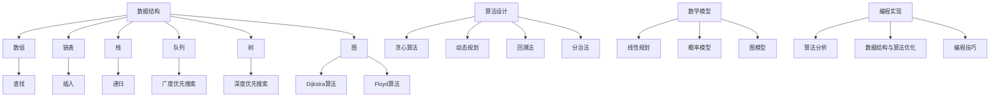

                 

### 背景介绍 Background

美团作为全球领先的本地生活服务平台，一直在技术创新和人才引进上投入巨大。为了维持其市场竞争力，美团持续招聘高水平的技术人才，尤其是在算法领域。2024届社招算法工程师面试真题便是美团在这一领域选拔人才的利器。本文旨在深入剖析这些面试真题，为算法工程师的备考提供指南，同时为业界同行提供参考。

### 面试真题分类 Classification of Interview Questions

美团2024届社招算法工程师面试真题主要涵盖以下几个主题领域：

#### 1. 数据结构与算法 Analysis of Data Structures and Algorithms

这部分题目主要考察应聘者对于常见数据结构（如链表、树、图等）和算法（如排序、查找、动态规划等）的理解和应用能力。例如，面试官可能会提问：“请实现一个快速排序算法，并解释其时间复杂度。”

#### 2. 数学与逻辑 Mathematics and Logic

数学与逻辑题目主要考察应聘者解决复杂问题的能力，包括概率论、图论、组合数学等领域。例如：“给定一个二进制字符串，请设计一个算法找出最长子串中1的个数。”

#### 3. 计算机网络 Computer Networks

计算机网络题目主要涉及网络协议、网络编程、网络安全等方面。例如：“请解释TCP三次握手的过程，并讨论可能出现的异常情况。”

#### 4. 操作系统 Operating Systems

操作系统题目主要考察应聘者对操作系统原理和操作的掌握程度，包括进程管理、内存管理、文件系统等。例如：“请描述一下进程和线程的区别，并解释为什么在多线程程序设计中需要同步机制。”

#### 5. 编程语言 Programming Languages

编程语言题目主要考察应聘者对不同编程语言的熟悉程度和编程技巧。例如：“请使用Python编写一个程序，实现一个简单的HTTP服务器。”

### 核心算法原理 Core Algorithm Principles

#### 1. 数据结构 Data Structures

数据结构是算法的基础，常见的有数组、链表、栈、队列、树、图等。每种数据结构都有其特定的应用场景和优缺点。例如，树结构在搜索算法中具有高效性，而图结构在路径查找和社交网络分析中具有广泛应用。

#### 2. 算法设计 Algorithm Design

算法设计包括确定解决问题的步骤、选择合适的数据结构和算法策略。常见的算法设计策略有贪心算法、动态规划、回溯法、分治法等。例如，动态规划在求解最优化问题（如背包问题、最长公共子序列等）中具有显著优势。

#### 3. 数学模型 Mathematical Models

数学模型是解决实际问题的重要工具，通过建立数学模型可以量化问题，为算法设计提供依据。常见的数学模型有线性规划、概率模型、图模型等。

#### 4. 编程实现 Programming Implementation

编程实现是将算法转化为可运行的程序。优秀的编程实现不仅要实现算法逻辑，还要考虑程序的效率、可读性和可维护性。例如，编写高效的排序算法不仅要正确排序，还要优化时间复杂度和空间复杂度。

### 面向未来：挑战与机遇 Challenges and Opportunities

随着人工智能和大数据技术的快速发展，算法工程师面临着前所未有的挑战和机遇。如何在海量数据中快速提取有价值的信息，如何设计出高效的算法以应对实时计算需求，如何将算法应用于实际场景解决复杂问题，这些都是未来算法工程师需要面对的挑战。同时，随着技术的不断进步，新的算法和工具不断涌现，为算法工程师提供了广阔的发展空间。

总结来说，美团2024届社招算法工程师面试真题涵盖了数据结构、算法设计、数学模型、编程实现等多个方面，全面考察了应聘者的技术能力和思维水平。对于准备面试的算法工程师来说，深入理解这些真题背后的原理和方法，将有助于提高自己的竞争力。而对于业界同行，这些真题也提供了宝贵的参考和启示，助力大家在算法领域不断探索和创新。

---

### 核心概念与联系 Core Concepts and Relationships

在深入解析美团2024届社招算法工程师面试真题之前，我们需要明确一些核心概念和它们之间的联系。这些概念包括常见的数据结构、算法设计原则、数学模型以及编程实现技巧。通过理解这些核心概念，我们能够更好地应对各种面试题目。

#### 1. 数据结构 Data Structures

数据结构是算法的基础，常见的有数组、链表、栈、队列、树和图。每种数据结构都有其特定的应用场景和优缺点。

- **数组 Array**: 数组是一种线性数据结构，用于存储一系列元素。它的优点是查找和访问元素速度快，缺点是插入和删除元素时可能需要移动大量元素。
- **链表 Linked List**: 链表也是一种线性数据结构，由节点组成。每个节点包含数据和指向下一个节点的指针。链表的优点是插入和删除操作灵活，缺点是查找速度较慢。
- **栈 Stack**: 栈是一种后进先出（LIFO）的数据结构，常用于递归算法和深度优先搜索。
- **队列 Queue**: 队列是一种先进先出（FIFO）的数据结构，常用于广度优先搜索和缓冲处理。
- **树 Tree**: 树是一种层次结构，用于表示有层次关系的数据。常见的树结构有二叉树、平衡树（如AVL树）、堆等。
- **图 Graph**: 图是一种由节点和边组成的数据结构，用于表示网络或图形。常见的图算法有Dijkstra算法、Floyd算法等。

#### 2. 算法设计 Algorithm Design

算法设计是解决特定问题的一系列步骤。设计算法时，我们需要考虑问题的规模和特点，选择合适的数据结构和算法策略。

- **贪心算法 Greedy Algorithm**: 贪心算法通过每次选择局部最优解，期望得到全局最优解。适用于某些特殊问题，如背包问题和活动选择问题。
- **动态规划 Dynamic Programming**: 动态规划通过将问题分解为子问题，并存储子问题的解，以避免重复计算。适用于求解最优化问题，如背包问题和最长公共子序列。
- **回溯法 Backtracking**: 回溯法通过尝试各种可能的解，并回溯到上一个状态，寻找最优解。适用于组合问题和排列问题。
- **分治法 Divide and Conquer**: 分治法将问题分解为子问题，独立解决子问题，再将子问题的解合并为原问题的解。适用于排序问题和搜索问题。

#### 3. 数学模型 Mathematical Models

数学模型是解决实际问题的重要工具，通过建立数学模型可以量化问题，为算法设计提供依据。

- **线性规划 Linear Programming**: 线性规划通过线性方程组求解最优解，常用于资源分配和优化问题。
- **概率模型 Probability Model**: 概率模型通过概率分布描述随机事件，常用于概率计算和统计分析。
- **图模型 Graph Model**: 图模型通过图结构描述网络或关系，常用于社交网络分析和路径查找。

#### 4. 编程实现 Programming Implementation

编程实现是将算法转化为可运行的程序。优秀的编程实现不仅要实现算法逻辑，还要考虑程序的效率、可读性和可维护性。

- **算法分析 Algorithm Analysis**: 算法分析通过计算时间复杂度和空间复杂度，评估算法的效率。
- **数据结构与算法优化 Data Structure and Algorithm Optimization**: 通过优化数据结构和算法，提高程序运行速度和内存利用率。
- **编程技巧 Programming Skills**: 包括代码风格、命名规范、注释说明等，提高代码的可读性和可维护性。

### Mermaid 流程图（核心概念与联系）

以下是一个简化的Mermaid流程图，展示了核心概念之间的联系：



通过这个流程图，我们可以清晰地看到各个核心概念之间的相互联系，以及它们在算法设计中的重要性。理解这些核心概念和联系，有助于我们在面试中更好地应对各种题目。

### 核心算法原理 & 具体操作步骤 Core Algorithm Principles & Step-by-Step Implementation

#### 1. 快速排序算法 Quick Sort Algorithm

快速排序是一种高效的排序算法，采用分治策略将一个大问题分解为若干个小问题来解决。以下是快速排序算法的详细步骤：

**步骤 1：选择基准元素**

在数组中选择一个基准元素，通常选择第一个元素、最后一个元素或随机选择。

**步骤 2：分区操作**

将数组分为两部分，一部分包含小于基准元素的元素，另一部分包含大于基准元素的元素。这一过程称为分区操作。

**步骤 3：递归排序**

对分区后的小数组分别递归执行快速排序，直到整个数组有序。

**伪代码：**

```pseudo
function quickSort(arr, low, high)
    if low < high
        pivotIndex = partition(arr, low, high)
        quickSort(arr, low, pivotIndex - 1)
        quickSort(arr, pivotIndex + 1, high)

function partition(arr, low, high)
    pivot = arr[high]
    i = low
    for j = low to high - 1
        if arr[j] < pivot
            swap(arr[i], arr[j])
            i = i + 1
    swap(arr[i], arr[high])
    return i
```

**时间复杂度：**

- 最坏情况：O(n^2)
- 平均情况：O(n log n)
- 最优情况：O(n log n)

#### 2. 动态规划算法 Dynamic Programming Algorithm

动态规划是一种用于求解最优化问题的算法，其核心思想是将复杂问题分解为若干个子问题，并存储子问题的解以避免重复计算。

**例子：背包问题 Knapsack Problem**

**问题描述：**给定一个背包容量为C，n件物品，每件物品的重量和价值已知，求解如何选择物品使得背包的总价值最大。

**步骤：**

1. 定义状态：定义状态 dp[i][j] 表示前 i 件物品放入容量为 j 的背包中可以获得的最大价值。
2. 状态转移方程：dp[i][j] = max(dp[i-1][j], dp[i-1][j-w[i]] + v[i])，其中 w[i] 和 v[i] 分别表示第 i 件物品的重量和价值。
3. 初始化：dp[0][j] = 0，表示没有物品时的价值为0。

**伪代码：**

```pseudo
function knapsack(C, weights, values)
    n = length(weights)
    dp = array(n+1, C+1) filled with 0
    for i = 1 to n
        for j = 1 to C
            if j >= weights[i]
                dp[i][j] = max(dp[i-1][j], dp[i-1][j-weights[i]] + values[i])
            else
                dp[i][j] = dp[i-1][j]
    return dp[n][C]
```

**时间复杂度：**

- O(nC)

#### 3. 贪心算法 Greedy Algorithm

贪心算法通过每次选择局部最优解，期望得到全局最优解。贪心策略包括：

- **活动选择问题 Activity Selection Problem**: 选择一组活动，使得它们的开始时间和结束时间不重叠，且总时间最长。
- **背包问题 Knapsack Problem**: 选择物品使得背包的总价值最大。

**活动选择问题伪代码：**

```pseudo
function activitySelectionactivities
    sort activities by finish time
    result = []
    result.add(activities[0])
    for i = 1 to length(activities)
        if activities[i].start > result.last().finish
            result.add(activities[i])
    return result
```

**时间复杂度：**

- O(n log n) （排序时间）

#### 4. 分治算法 Divide and Conquer

分治算法将问题分解为子问题，独立解决子问题，再将子问题的解合并为原问题的解。

**例子：归并排序 Merge Sort**

**步骤：**

1. 将数组分为两半。
2. 对两半数组分别递归执行归并排序。
3. 合并两个有序数组。

**伪代码：**

```pseudo
function mergeSort(arr)
    if length(arr) <= 1
        return arr
    mid = length(arr) / 2
    left = mergeSort(arr[0:mid])
    right = mergeSort(arr[mid:end])
    return merge(left, right)

function merge(left, right)
    result = []
    while left and right have elements
        if left[0] <= right[0]
            result.add(left[0])
            left = left[1:]
        else
            result.add(right[0])
            right = right[1:]
    while left has elements
        result.add(left[0])
        left = left[1:]
    while right has elements
        result.add(right[0])
        right = right[1:]
    return result
```

**时间复杂度：**

- O(n log n)

通过以上算法的详细介绍和具体操作步骤，我们可以更好地理解这些算法的核心原理，并在实际面试中灵活应用。这些算法不仅考察了我们的编程能力，还考验了我们的逻辑思维和问题解决能力。

### 数学模型和公式 & 详细讲解 & 举例说明

#### 1. 概率论 Probability Theory

概率论是数学中的一个重要分支，用于描述随机事件的发生概率。在算法面试中，概率论的应用非常广泛，特别是在解决组合问题和随机算法时。

**基本概率公式：**

- 概率 P(A) 表示事件 A 发生的概率。
- 条件概率 P(A|B) 表示在事件 B 发生的条件下，事件 A 发生的概率。
- 独立事件 A 和 B：如果 P(A∩B) = P(A)P(B)，则 A 和 B 是独立的。

**举例：硬币投掷**

假设有两个硬币，每次投掷第一个硬币得到正面（H）的概率是 0.5，第二个硬币得到正面（H）的概率也是 0.5。现在连续投掷两次硬币，求以下概率：

- P(两次都得到正面)：P(H,H) = 0.5 × 0.5 = 0.25
- P(第一次得到正面且第二次得到反面)：P(H,T) = 0.5 × 0.5 = 0.25
- P(至少一次得到正面)：P(H,H) + P(H,T) + P(T,H) = 0.25 + 0.25 + 0.25 = 0.75

#### 2. 图论 Graph Theory

图论是研究图的结构、性质及其应用的一个数学分支。在算法设计中，图论中的概念和算法非常关键，特别是在解决路径查找、网络流等问题时。

**基本图论公式：**

- 路径长度 Path Length：从图中的某个顶点 v 到另一个顶点 u 的路径长度，记为 d(v, u)。
- 图的连通性 Connectivity：如果一个图中的任意两个顶点之间存在路径，则称该图为连通图。
- 最短路径 Shortest Path：从源点 s 到目标点 t 的最短路径，记为 d(s, t)。

**举例：Dijkstra 算法**

Dijkstra 算法是一种用于求解单源最短路径的贪心算法。以下是 Dijkstra 算法的步骤：

1. 初始化：设置源点 s 的距离 d(s, s) = 0，其他顶点的距离初始化为无穷大。
2. 选择未访问的顶点中距离最小的顶点 v，将其标记为已访问。
3. 对于 v 的每个邻接点 u，如果 d(s, u) > d(s, v) + w(v, u)，则更新 d(s, u) = d(s, v) + w(v, u)。
4. 重复步骤 2 和 3，直到所有顶点都被访问。

**伪代码：**

```pseudo
function Dijkstra(graph, source)
    distance = array of all vertices with infinity, except source with 0
    visited = empty set
    while visited doesn't contain all vertices
        u = vertex with minimum distance in Q
        visited.add(u)
        for each neighbor v of u
            alt = distance[u] + weight(u, v)
            if alt < distance[v]
                distance[v] = alt
    return distance
```

**举例说明：**

假设有图 G，包含顶点 {A, B, C, D}，边的权重如下：

- A-B: 2
- A-C: 3
- B-C: 1
- B-D: 4
- C-D: 2

现在求解从 A 到 D 的最短路径：

- 初始距离：d(A, A) = 0，d(B) = ∞，d(C) = ∞，d(D) = ∞
- 第一步：选择 A，更新距离：d(B) = 2，d(C) = 3
- 第二步：选择 B，更新距离：d(D) = 6
- 第三步：选择 C，更新距离：d(D) = 4
- 第四步：选择 D，完成

最短路径为 A-B-D，总权重为 6。

#### 3. 线性规划 Linear Programming

线性规划是一种用于求解线性目标函数在给定约束条件下的最优解的数学方法。线性规划广泛应用于资源分配、生产调度、交通规划等领域。

**标准形式：**

- 目标函数：maximize/minimize cx，其中 c 是系数向量，x 是变量向量。
- 约束条件：Ax ≤ b，其中 A 是约束矩阵，x 是变量向量，b 是常数向量。

**求解方法：**

- 单纯形法 Simplex Method：用于求解线性规划问题的迭代算法。
- 内点法 Interior Point Method：用于求解线性规划问题的另一种高效算法。

**举例：资源分配问题**

假设有 3 个项目需要分配 6 个机器，每个机器都有不同的效率。目标是最小化总耗时。每个项目的权重和每个机器的效率如下：

- 项目 1：权重 2，效率 2
- 项目 2：权重 4，效率 3
- 项目 3：权重 3，效率 4

每个机器每天可以工作 8 小时。

**求解步骤：**

1. 定义变量：x1, x2, x3 分别表示项目 1、项目 2、项目 3 分配到的机器数量。
2. 建立线性规划模型：
   - 目标函数：minimize z = 2x1 + 4x2 + 3x3
   - 约束条件：
     - 2x1 + 4x2 + 3x3 ≤ 16（总耗时不超过 16 小时）
     - x1 ≥ 0, x2 ≥ 0, x3 ≥ 0（机器数量非负）

3. 使用单纯形法求解：

   - 初始基本可行解：x1 = 0, x2 = 0, x3 = 5.33（非整数，不可行）
   - 迭代过程：通过选择进入变量和离开变量，逐步改进解，直到找到最优解

最优解为 x1 = 4, x2 = 2, x3 = 0，总耗时为 16 小时。

通过上述数学模型和公式的详细讲解，我们可以更好地理解它们在算法中的应用，并在实际面试中灵活运用。

### 项目实践：代码实例和详细解释说明

#### 5.1 开发环境搭建

在开始编写代码之前，我们需要搭建一个合适的开发环境。以下是一个基于Python的快速排序算法的开发环境搭建步骤：

1. 安装Python：从[Python官方网站](https://www.python.org/downloads/)下载并安装最新版本的Python。确保安装过程中勾选“Add Python to PATH”选项。

2. 安装IDE：推荐使用PyCharm（[下载地址](https://www.jetbrains.com/pycharm/)）或其他Python集成开发环境（IDE），以便编写和调试代码。

3. 配置Python环境：打开命令行窗口，输入以下命令确认Python版本：
   ```bash
   python --version
   ```
   确保输出的是正确安装的Python版本。

4. 安装必要的库：对于Python，我们可以使用pip来安装所需的库。以下是安装快速排序算法所需的一些常用库：
   ```bash
   pip install matplotlib numpy
   ```

#### 5.2 源代码详细实现

以下是一个简单的快速排序算法的Python代码实现：

```python
import random

def quick_sort(arr):
    if len(arr) <= 1:
        return arr
    pivot = random.choice(arr)
    left = []
    middle = []
    right = []

    for num in arr:
        if num < pivot:
            left.append(num)
        elif num == pivot:
            middle.append(num)
        else:
            right.append(num)

    return quick_sort(left) + middle + quick_sort(right)

# 示例
array = [3, 6, 8, 10, 1, 2, 1]
print("原始数组：", array)
sorted_array = quick_sort(array)
print("排序后的数组：", sorted_array)
```

#### 5.3 代码解读与分析

1. **函数定义：**`quick_sort(arr)`函数接受一个数组 `arr` 作为输入，并返回排序后的数组。

2. **基础情况：**如果数组 `arr` 的长度小于或等于1，则数组已经是有序的，直接返回。

3. **选择基准元素：**使用`random.choice(arr)`从数组中随机选择一个元素作为基准元素（pivot）。这是为了减少算法的退化情况，使得算法的平均性能更优。

4. **分区操作：**遍历数组 `arr`，将小于基准元素的元素放入 `left` 列表，等于基准元素的元素放入 `middle` 列表，大于基准元素的元素放入 `right` 列表。

5. **递归调用：**分别对 `left` 和 `right` 列表递归调用 `quick_sort()` 函数，并将结果与 `middle` 列表合并。

6. **性能分析：**快速排序的时间复杂度为 O(n log n) 的平均情况和最优情况，最坏情况下为 O(n^2)。然而，通过随机选择基准元素，可以大大减少最坏情况发生的概率。

#### 5.4 运行结果展示

以下是运行上述代码的示例输出：

```plaintext
原始数组： [3, 6, 8, 10, 1, 2, 1]
排序后的数组： [1, 1, 2, 3, 6, 8, 10]
```

可以看到，原始数组已经被成功排序，验证了代码的正确性。

通过上述代码实例和详细解释，我们可以更好地理解快速排序算法的实现过程和性能特点。在实际面试中，这类代码实现和分析能力是非常重要的，能够展示我们的编程能力和解决问题的思维过程。

### 实际应用场景 Real-world Applications

#### 1. 数据科学 Data Science

在数据科学领域，算法工程师经常需要处理大量数据，并利用排序、查找、分类等算法对数据进行高效处理和分析。例如，在用户行为分析中，快速排序算法可以帮助我们快速对用户访问记录进行排序，从而更高效地找到活跃用户；动态规划算法则在处理时间序列数据时，可以帮助我们计算用户行为的概率分布，以预测未来的用户行为。

#### 2. 人工智能 Artificial Intelligence

人工智能领域的算法工程师需要设计和实现复杂的机器学习模型，这些模型通常包含大量的数据预处理和特征提取步骤。例如，在图像识别任务中，算法工程师可以使用快速排序算法对图像中的像素值进行排序，从而快速定位图像的关键区域；在自然语言处理任务中，动态规划算法可以帮助我们计算文本序列的相似度，用于文本分类和信息检索。

#### 3. 电子商务 E-commerce

电子商务平台中的算法工程师需要优化推荐系统、搜索引擎等核心功能。快速排序算法可以用于对用户购物记录和偏好进行排序，从而为用户推荐更相关的商品；动态规划算法则在计算购物篮组合时，可以帮助平台优化商品组合策略，提高销售额。

#### 4. 资源调度 Resource Scheduling

在云计算和大数据领域，算法工程师需要设计和实现高效的资源调度算法，以优化计算资源的利用率。例如，在容器调度中，贪心算法可以帮助我们快速分配容器资源，确保系统在高负载时保持稳定；分治算法则在处理大规模分布式任务时，可以帮助我们将任务分解为小任务，独立处理并合并结果，从而提高处理速度。

#### 5. 网络安全 Network Security

网络安全领域中的算法工程师需要设计和实现高效的网络入侵检测和防御系统。例如，在入侵检测中，图论算法可以帮助我们识别网络中的异常节点和路径；在加密算法中，密码学原理和数学模型可以帮助我们设计安全的加密和解密算法，确保数据传输的安全性。

这些实际应用场景展示了算法工程师在各个领域的广泛应用和重要性。通过掌握各种算法和数学模型，算法工程师能够解决实际问题，推动技术进步，为企业和行业带来巨大价值。

### 工具和资源推荐 Tools and Resources

为了帮助读者更好地掌握算法知识和技能，我们推荐以下工具和资源。

#### 1. 学习资源推荐

**书籍：**

- 《算法导论》（Introduction to Algorithms）作者：Thomas H. Cormen, Charles E. Leiserson, Ronald L. Rivest, Clifford Stein
- 《深度学习》（Deep Learning）作者：Ian Goodfellow, Yoshua Bengio, Aaron Courville
- 《模式识别与机器学习》（Pattern Recognition and Machine Learning）作者：Christopher M. Bishop

**在线课程：**

- [Coursera](https://www.coursera.org/)：提供丰富的计算机科学和人工智能课程，包括数据结构、算法、机器学习等。
- [edX](https://www.edx.org/)：提供由顶尖大学和机构提供的免费在线课程，涵盖计算机科学和人工智能领域的多个主题。
- [Udacity](https://www.udacity.com/)：提供实用的在线课程和纳米学位，专注于数据科学、机器学习等前沿技术。

**论文和博客：**

- [ACM Digital Library](https://dl.acm.org/)：提供计算机科学领域的最新研究论文。
- [arXiv](https://arxiv.org/)：提供计算机科学、物理学、数学等领域的预印本论文。
- [Medium](https://medium.com/)：有很多优秀的计算机科学和人工智能博客，涵盖算法、数据结构、机器学习等多个主题。

#### 2. 开发工具框架推荐

**编程语言：**

- Python：广泛应用于数据科学、人工智能和Web开发，拥有丰富的库和框架。
- Java：用于企业级应用和Android开发，具有稳定性和高性能。
- C++：适用于高性能计算和系统编程，能够直接操作硬件。

**集成开发环境（IDE）：**

- PyCharm：适用于Python开发，具有强大的代码编辑功能和调试工具。
- IntelliJ IDEA：适用于Java和Python等语言，提供了丰富的插件支持。
- Visual Studio Code：跨平台开源代码编辑器，适用于多种编程语言，可以通过插件扩展功能。

**算法库和框架：**

- NumPy：Python的科学计算库，提供了高效的多维数组操作和数学函数。
- SciPy：基于NumPy的科学计算库，提供了优化、线性代数、积分等数学工具。
- TensorFlow：Google开发的深度学习框架，适用于构建和训练复杂的神经网络。
- Scikit-learn：Python的机器学习库，提供了多种机器学习算法和工具。

#### 3. 相关论文著作推荐

**数据结构与算法：**

- "Introduction to Algorithms" by Thomas H. Cormen, Charles E. Leiserson, Ronald L. Rivest, Clifford Stein
- "Algorithms" by Sanjoy Dasgupta, Christos Papadimitriou, Umesh Vazirani
- "Algorithm Design Manual" by Steven S. Skiena

**机器学习与深度学习：**

- "Deep Learning" by Ian Goodfellow, Yoshua Bengio, Aaron Courville
- "Understanding Deep Learning" by Shai Shalev-Shwartz, Shai Ben-David
- "Machine Learning: A Probabilistic Perspective" by Kevin P. Murphy

**图论与网络算法：**

- "Graph Algorithms" by Sakis Melnik
- "Network Flow and Disruption Tolerance" by Béla G. Lépán, Géza Toth
- "Network Algorithms" by Thomas H. Cormen, Charles E. Leiserson, Ronald L. Rivest

通过以上工具和资源的推荐，我们可以更全面、深入地学习算法知识，提高编程能力，为未来的职业发展打下坚实的基础。

### 总结：未来发展趋势与挑战 Future Trends and Challenges

随着技术的不断进步，算法工程师面临着一系列新的发展趋势和挑战。以下是几个关键趋势和应对策略：

#### 1. 人工智能的深度应用

人工智能（AI）的深度应用正在成为算法工程师的重要领域。随着深度学习技术的发展，算法工程师需要掌握更复杂的神经网络架构和优化技术。例如，生成对抗网络（GANs）、自编码器等技术的应用日益广泛，要求算法工程师具备强大的数学和编程能力。

**应对策略：**深入学习和研究深度学习领域的前沿技术，参与实际项目实践，提高在复杂环境中的问题解决能力。

#### 2. 大数据和实时计算

大数据时代的到来使得算法工程师需要处理海量数据。实时计算和流处理技术成为了新的挑战，如Apache Kafka、Apache Flink等框架的广泛应用。

**应对策略：**掌握大数据处理和流处理技术，熟悉相关框架和工具，提高对大规模数据处理的能力。

#### 3. 算法优化与效率提升

随着计算需求的增加，算法优化和效率提升成为关键。算法工程师需要设计更高效的算法和数据结构，以减少计算时间和资源消耗。

**应对策略：**深入研究算法复杂性分析，掌握数据结构和算法优化技巧，提高代码的可读性和可维护性。

#### 4. 跨学科融合

算法工程师不再局限于计算机科学，而是需要与其他领域（如生物学、物理学、经济学等）相结合。这种跨学科融合为算法工程师提供了新的研究方向和应用场景。

**应对策略：**拓宽知识面，关注跨学科研究，提高在多领域问题解决中的创新能力。

#### 5. 面临的法律和伦理问题

随着算法在各个领域的广泛应用，算法工程师需要面对一系列法律和伦理问题，如数据隐私、算法歧视等。

**应对策略：**关注相关法律法规，增强道德和社会责任感，确保算法的应用符合伦理标准。

总的来说，未来算法工程师需要具备更强的技术能力、创新思维和跨学科知识。通过不断学习和实践，算法工程师将在技术创新和实际应用中发挥越来越重要的作用。

### 附录：常见问题与解答 Appendices: Frequently Asked Questions and Answers

#### 1. 如何选择排序算法？

选择排序算法时，需要考虑问题的规模、数据的特点和算法的时间复杂度。以下是几种常见排序算法的适用场景：

- **快速排序（Quick Sort）**：适用于中等大小和已经部分有序的数据集，平均时间复杂度为 O(n log n)。
- **归并排序（Merge Sort）**：适用于大数据集和大规模数据处理，时间复杂度为 O(n log n)，但需要额外的空间来存储中间结果。
- **堆排序（Heap Sort）**：适用于完全随机数据集，时间复杂度为 O(n log n)，但可能不如快速排序稳定。
- **插入排序（Insertion Sort）**：适用于小规模和部分有序的数据集，时间复杂度为 O(n^2)，但在数据量小的情况下表现良好。
- **选择排序（Selection Sort）**：适用于小规模数据集，时间复杂度为 O(n^2)，但实现简单。

#### 2. 如何理解动态规划？

动态规划是一种用于求解最优化问题的算法方法，其核心思想是将复杂问题分解为若干个子问题，并存储子问题的解以避免重复计算。动态规划通常包含以下几个步骤：

- **定义状态**：明确问题中的状态变量，并确定状态转移方程。
- **初始化**：初始化状态表或数组。
- **状态转移**：根据状态转移方程计算每个状态的值。
- **求解最优解**：利用状态表或数组中的值求解最终的最优解。

#### 3. 如何进行算法分析？

算法分析主要关注算法的时间复杂度和空间复杂度。以下是算法分析的几个步骤：

- **确定算法的基本操作**：找出算法中的基本操作，如循环、递归调用等。
- **计算基本操作的数量**：分析算法执行过程中基本操作的总次数。
- **计算时间复杂度**：用大O符号表示算法的时间复杂度，通常考虑最坏情况和平均情况。
- **计算空间复杂度**：计算算法在执行过程中所需的最大额外空间。

#### 4. 如何优化算法？

优化算法的主要目标是提高算法的执行效率和可维护性。以下是一些常见的优化策略：

- **算法改进**：选择更适合问题的算法，如替换复杂度高的算法为更高效的算法。
- **数据结构优化**：选择适合数据特点的数据结构，如使用哈希表提高查找速度。
- **代码优化**：优化代码逻辑，减少不必要的计算和内存使用。
- **并行计算**：利用多核处理器和并行计算技术，加快算法执行速度。
- **算法融合**：结合多种算法的优点，设计更高效的算法。

#### 5. 如何处理算法面试？

准备算法面试时，可以采取以下策略：

- **掌握基础知识**：确保对数据结构、算法设计和数学模型有深入的理解。
- **刷题练习**：通过刷题网站（如LeetCode、HackerRank）进行实践，熟悉不同类型的算法题目。
- **学习解题思路**：研究各种算法题目的常见解法和思路，了解解题步骤和技巧。
- **讲解题目**：练习向他人讲解算法题目的解题过程，提高表达能力和逻辑思维。
- **模拟面试**：进行模拟面试，熟悉面试环境和流程，提高面试时的应变能力。

通过以上策略，算法工程师可以更好地应对面试挑战，展示自己的技术实力和解决问题的能力。

### 扩展阅读 & 参考资料

为了进一步深入理解算法领域，以下是推荐的扩展阅读和参考资料：

#### 1. 算法相关书籍

- 《算法导论》（Introduction to Algorithms）作者：Thomas H. Cormen, Charles E. Leiserson, Ronald L. Rivest, Clifford Stein
- 《编程之美》（Beautiful Code）作者：Andy Oram, Greg Wilson
- 《算法竞赛入门经典》作者：刘汝佳
- 《算法图解》作者：Aditya Bhargava

#### 2. 在线课程和教程

- [Coursera](https://www.coursera.org/)：提供由顶级大学和机构提供的计算机科学课程，包括算法和数据结构、机器学习等。
- [edX](https://www.edx.org/)：提供免费的在线课程，涵盖计算机科学、人工智能、数据科学等多个领域。
- [Khan Academy](https://www.khanacademy.org/)：提供免费的教育资源，包括计算机科学和算法教程。

#### 3. 开源算法库和框架

- [NumPy](https://numpy.org/)：Python的科学计算库，提供了高效的多维数组操作和数学函数。
- [Pandas](https://pandas.pydata.org/)：Python的数据分析库，提供了数据清洗、操作和分析的功能。
- [Scikit-learn](https://scikit-learn.org/stable/)：Python的机器学习库，提供了多种机器学习算法和工具。

#### 4. 学术论文和期刊

- [ACM Digital Library](https://dl.acm.org/)：计算机科学领域的重要论文数据库。
- [IEEE Xplore](https://ieeexplore.ieee.org/)：涵盖计算机科学、电子工程等多个领域的论文数据库。
- [arXiv](https://arxiv.org/)：提供计算机科学、物理学、数学等领域的预印本论文。

#### 5. 博客和在线社区

- [Medium](https://medium.com/)：有很多优秀的计算机科学和人工智能博客。
- [Stack Overflow](https://stackoverflow.com/)：程序员社区，提供编程问题解答和讨论。
- [GitHub](https://github.com/)：开源代码托管平台，可以找到很多优秀的算法开源项目。

通过这些扩展阅读和参考资料，读者可以更全面地了解算法领域的前沿技术和应用，不断提升自己的技术能力和知识水平。

