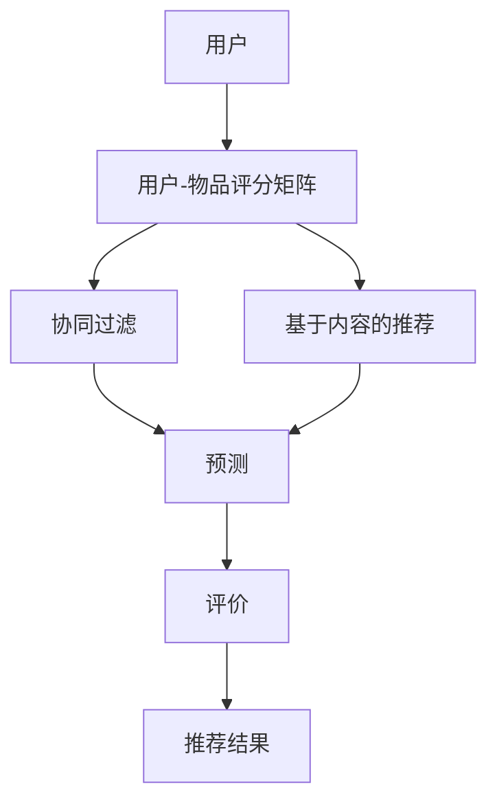

                 

### 背景介绍 Background Introduction ###

推荐系统作为大数据和人工智能领域的核心组成部分，已经成为现代互联网生态系统中的关键技术。从电商平台的个性化购物推荐，到社交媒体上的内容推荐，再到搜索引擎中的相关搜索提示，推荐系统无处不在，极大地提升了用户体验和商业价值。美团，作为中国最大的生活服务电商平台，其推荐系统的建设与发展显得尤为重要。在美团2024年推荐系统算法工程师校招面试中，了解推荐系统的基础知识、核心算法原理以及实际应用场景，是面试者必须掌握的要点。

### 推荐系统简介 Introduction to Recommender Systems ###

推荐系统是一种利用算法和模型为用户提供个性化推荐的技术手段。其基本原理是基于用户的历史行为数据、用户特征、物品特征以及上下文信息，通过算法计算用户与物品之间的相似度或兴趣度，从而为用户推荐其可能感兴趣的物品。

在推荐系统中，一般可以分为以下几类算法：

1. **基于内容的推荐（Content-Based Filtering）**：根据用户过去的喜好或行为，推荐具有相似特征的物品。
2. **协同过滤（Collaborative Filtering）**：通过分析用户之间的行为相似性，为用户推荐其他用户喜欢的物品。
3. **基于模型的推荐（Model-Based Recommendations）**：使用机器学习算法建立用户与物品之间的预测模型，进行推荐。

美团作为一个拥有海量用户和商家数据的平台，其推荐系统采用了多种推荐算法的结合，以满足用户在不同场景下的多样化需求。这些算法不仅需要处理大规模数据，还要保证推荐结果的实时性和准确性。

### 美团推荐系统的挑战 Challenges of Meituan's Recommender System ###

1. **数据多样性**：美团涉及多种生活服务，包括餐饮、出行、住宿等，每个服务领域的数据特性都有所不同。因此，推荐系统需要具备很强的泛化能力，能够处理这些多样化的数据。

2. **实时性**：用户在美团上的行为是动态变化的，推荐系统需要实时响应用户的行为，提供及时的推荐。

3. **冷启动问题**：新用户或新物品在没有足够历史数据的情况下，如何进行有效推荐，是推荐系统面临的挑战。

4. **数据隐私**：保护用户隐私是推荐系统的关键问题，如何在满足用户个性化推荐需求的同时，保护用户的隐私，是一个重要的课题。

5. **质量评估**：推荐系统的质量直接影响到用户体验和平台口碑。如何评估和优化推荐系统的效果，是一个持续的挑战。

### 总结 Summary

在接下来的章节中，我们将深入探讨推荐系统的核心概念与联系，包括推荐算法的原理、数学模型以及实际应用场景。通过逐步分析推理，我们将揭示美团推荐系统的运作机制及其在解决现实问题中的应用价值。

## 1. 核心概念与联系 Core Concepts and Connections

在深入讨论美团推荐系统的核心算法原理和具体实现之前，我们需要首先了解一些核心概念，这些概念是构建推荐系统的基石。本章节将详细介绍推荐系统中的基本概念，并使用Mermaid流程图展示这些概念之间的关系。

### 1.1 推荐系统基本概念 Basic Concepts of Recommender Systems

1. **用户（User）**：推荐系统的核心要素之一，是进行推荐活动的主要对象。用户的行为、偏好和特征是推荐系统分析的重要数据来源。

2. **物品（Item）**：推荐系统推荐的实体，可以是商品、文章、音乐、电影等。物品的特征和属性也是推荐算法的关键输入。

3. **用户-物品评分矩阵（User-Item Rating Matrix）**：记录了用户对物品的评分情况，是推荐系统的基础数据集。

4. **协同过滤（Collaborative Filtering）**：一种基于用户行为相似性进行推荐的算法，通过分析用户之间的评分相似性来推荐物品。

5. **基于内容的推荐（Content-Based Filtering）**：一种基于物品特征和用户偏好进行推荐的算法，通过分析用户过去喜欢的物品特征来推荐相似的物品。

6. **预测（Prediction）**：推荐系统的一个重要任务，是基于用户历史行为和物品特征预测用户对未知物品的评分或偏好。

7. **评价（Evaluation）**：评估推荐系统性能的过程，常用的评价指标包括准确率（Accuracy）、召回率（Recall）、覆盖率（Coverage）和多样性（Diversity）等。

### 1.2 Mermaid 流程图展示 Mermaid Flowchart Illustration

为了更直观地展示这些概念之间的关系，我们使用Mermaid语言绘制一个流程图。请注意，Mermaid流程图中的节点不应包含括号、逗号等特殊字符。



在上面的流程图中，用户（A）通过用户-物品评分矩阵（B）输入到协同过滤（C）和基于内容的推荐（D）算法中，这些算法计算出用户对物品的预测评分（E），然后通过评价（F）过程对推荐结果（G）进行质量评估。

### 1.3 推荐系统工作流程 Working Process of Recommender Systems

推荐系统的工作流程可以分为以下几步：

1. **数据收集**：从用户行为、物品特征以及上下文信息中收集数据。
2. **预处理**：对收集到的数据进行清洗、格式化和归一化处理。
3. **特征提取**：从预处理后的数据中提取用户和物品的特征。
4. **算法选择**：根据应用场景和数据特性选择合适的推荐算法。
5. **模型训练**：使用历史数据训练推荐模型。
6. **预测与推荐**：基于训练好的模型对未知数据进行预测，并生成推荐结果。
7. **评价与优化**：对推荐结果进行评估，并根据评估结果对算法和模型进行调整和优化。

### 总结 Summary

通过上述介绍，我们可以看到，推荐系统中的核心概念和流程是如何相互关联并共同工作的。在接下来的章节中，我们将深入探讨推荐系统的核心算法原理和具体实现，以及数学模型和公式，进一步了解美团推荐系统的构建和优化策略。

---

## 2. 核心算法原理 & 具体操作步骤 Core Algorithm Principles & Detailed Steps

### 2.1 基于内容的推荐算法 Content-Based Recommender Algorithm

基于内容的推荐算法主要通过分析物品的特征和用户的偏好来进行推荐。具体步骤如下：

1. **特征提取**：对物品的内容特征进行提取，如文本、图像、音频等，并将这些特征转换为向量表示。

2. **计算相似度**：使用余弦相似度、皮尔逊相关系数等算法计算物品间的相似度。

3. **生成推荐列表**：根据用户过去喜欢的物品特征，计算用户与物品之间的相似度，并生成推荐列表。

4. **处理噪声**：对相似度计算结果进行去噪处理，以消除噪声对推荐结果的影响。

5. **优化推荐列表**：通过调整相似度阈值或使用优化算法，进一步提高推荐列表的质量。

### 2.2 协同过滤算法 Collaborative Filtering Algorithm

协同过滤算法通过分析用户之间的行为相似性来进行推荐。以下是协同过滤算法的具体步骤：

1. **用户行为矩阵**：构建用户行为矩阵，记录用户对物品的评分或行为。

2. **计算用户相似度**：使用余弦相似度、皮尔逊相关系数等算法计算用户间的相似度。

3. **生成预测评分**：对于给定的用户，根据相似度计算预测评分，预测用户对未知物品的评分。

4. **生成推荐列表**：根据预测评分生成推荐列表，推荐评分最高的物品。

5. **处理冷启动问题**：对于新用户或新物品，可以使用基于内容的推荐算法或者基于模型的推荐算法来缓解冷启动问题。

### 2.3 混合推荐算法 Hybrid Recommender Algorithm

在实际应用中，单一的推荐算法往往难以满足不同用户和场景的需求。因此，混合推荐算法结合了基于内容的推荐算法和协同过滤算法的优点，具体步骤如下：

1. **数据预处理**：对用户行为和物品特征进行预处理，提取关键信息。

2. **算法选择**：根据用户和物品的特征，选择合适的推荐算法，如基于内容的推荐、协同过滤或基于模型的推荐。

3. **算法融合**：将不同算法的预测结果进行融合，生成最终的推荐列表。

4. **优化与评估**：对推荐结果进行评估和优化，提高推荐系统的整体性能。

### 2.4 美团推荐系统的具体实现 Specific Implementation of Meituan's Recommender System

在美团推荐系统中，采用了多种推荐算法的组合，以应对不同场景和用户需求。以下是美团推荐系统的具体实现步骤：

1. **数据收集**：收集用户行为数据、物品特征数据以及上下文信息。

2. **数据预处理**：对收集到的数据进行清洗、去噪和归一化处理。

3. **特征提取**：提取用户和物品的关键特征，如用户历史行为、物品属性等。

4. **算法选择**：根据用户和物品的特征，选择适合的推荐算法，如基于内容的推荐、协同过滤或基于模型的推荐。

5. **模型训练**：使用历史数据训练推荐模型，包括用户行为模型和物品特征模型。

6. **预测与推荐**：基于训练好的模型对未知数据进行预测，生成推荐列表。

7. **推荐列表优化**：对推荐列表进行优化，提高推荐的质量和多样性。

8. **实时更新**：根据用户实时行为数据，动态更新推荐列表，提供实时推荐。

### 总结 Summary

通过上述介绍，我们可以看到推荐系统核心算法的具体步骤和实现方法。在实际应用中，美团推荐系统结合了多种推荐算法，以提高推荐的质量和效果。在接下来的章节中，我们将进一步探讨推荐系统中的数学模型和公式，以及如何通过这些模型对推荐系统进行优化和评估。

---

## 3. 数学模型和公式 Mathematical Models and Formulas

推荐系统中的数学模型和公式是其核心组成部分，用于计算用户与物品之间的相似度、预测用户行为，以及优化推荐结果。以下将详细阐述这些数学模型和公式，并结合实际应用场景进行解释。

### 3.1 相似度计算 Similarity Calculation

相似度计算是推荐系统的基础，用于评估用户与物品之间的相关性。以下是一些常用的相似度计算方法：

#### 3.1.1 余弦相似度 Cosine Similarity

余弦相似度是一种衡量两个向量夹角余弦值的相似度度量，公式如下：

$$
\text{Cosine Similarity} = \frac{\text{Dot Product of Vectors}}{\lVert \text{Vector A} \rVert \times \lVert \text{Vector B} \rVert}
$$

其中，$\text{Dot Product of Vectors}$ 表示两个向量的点积，$\lVert \text{Vector A} \rVert$ 和 $\lVert \text{Vector B} \rVert$ 分别表示两个向量的模。

**应用场景**：适用于高维空间中的数据，如文本和图像的特征向量。在推荐系统中，通常用于基于内容的推荐算法中计算物品间的相似度。

#### 3.1.2 皮尔逊相关系数 Pearson Correlation Coefficient

皮尔逊相关系数用于衡量两个变量之间的线性相关性，公式如下：

$$
\text{Pearson Correlation Coefficient} = \frac{\text{Covariance of X and Y}}{\sqrt{\text{Variance of X} \times \text{Variance of Y}}}
$$

其中，$\text{Covariance of X and Y}$ 表示X和Y的协方差，$\text{Variance of X}$ 和 $\text{Variance of Y}$ 分别表示X和Y的方差。

**应用场景**：适用于连续变量之间的相关性分析。在推荐系统中，常用于协同过滤算法中计算用户之间的相似度。

### 3.2 预测模型 Prediction Model

预测模型用于预测用户对未知物品的评分或偏好，常用的预测模型包括：

#### 3.2.1 评分预测 Rating Prediction

评分预测模型通常使用线性回归（Linear Regression）或矩阵分解（Matrix Factorization）等方法。

**线性回归**：

$$
\text{Rating}_{ui} = \text{User Feature Vector}_u \cdot \text{Item Feature Vector}_i + \text{Bias}_u + \text{Bias}_i + \text{Noise}
$$

其中，$\text{Rating}_{ui}$ 表示用户u对物品i的预测评分，$\text{User Feature Vector}_u$ 和 $\text{Item Feature Vector}_i$ 分别表示用户和物品的特征向量，$\text{Bias}_u$ 和 $\text{Bias}_i$ 分别表示用户和物品的偏置项，$\text{Noise}$ 表示噪声项。

**矩阵分解**：

矩阵分解方法，如Singular Value Decomposition (SVD) 或 Alternating Least Squares (ALS)，将用户-物品评分矩阵分解为两个低秩矩阵，分别表示用户和物品的潜在特征。

$$
R = U \cdot S \cdot V^T
$$

其中，$R$ 表示用户-物品评分矩阵，$U$ 和 $V$ 分别表示用户和物品的潜在特征矩阵，$S$ 表示对角矩阵，包含公共的潜在特征。

**应用场景**：评分预测模型常用于协同过滤算法和基于模型的推荐算法，能够提高推荐系统的准确性和泛化能力。

### 3.3 优化模型 Optimization Model

优化模型用于优化推荐结果，提高推荐系统的多样性和质量。以下是一些常用的优化方法：

#### 3.3.1 多样性 Diversity Optimization

多样性优化旨在提高推荐列表中不同类型物品的多样性。一个简单的多样性度量是物品之间的相似度阈值：

$$
\text{Diversity} = \sum_{i \in \text{Recommended List}} \min_{j \in \text{Recommended List}, j \neq i} \text{Cosine Similarity}(i, j)
$$

**应用场景**：适用于基于内容的推荐和协同过滤算法，能够提高推荐列表的多样性。

#### 3.3.2 覆盖率 Coverage Optimization

覆盖率优化旨在确保推荐列表覆盖尽可能多的用户和物品。覆盖率可以通过以下公式计算：

$$
\text{Coverage} = \frac{\text{Unique Items in Recommended List}}{\text{Total Items in the Dataset}}
$$

**应用场景**：适用于协同过滤算法和基于模型的推荐算法，能够提高推荐列表的覆盖率。

#### 3.3.3 准确率 Accuracy Optimization

准确率优化旨在提高推荐列表中推荐物品的准确性。准确率可以通过以下公式计算：

$$
\text{Accuracy} = \frac{\text{Number of Correctly Recommended Items}}{\text{Total Items in the Test Set}}
$$

**应用场景**：适用于所有推荐算法，能够提高推荐系统的整体性能。

### 总结 Summary

通过上述数学模型和公式的介绍，我们可以看到推荐系统中的核心算法是如何通过数学计算来实现用户与物品的相似度评估、预测和优化。在接下来的章节中，我们将通过代码实例来展示这些模型的具体实现，帮助读者更好地理解和应用这些数学原理。

---

### 5. 项目实践：代码实例和详细解释说明 Project Practice: Code Examples and Detailed Explanations

在这一章节中，我们将通过一个具体的代码实例来展示如何搭建一个推荐系统，并对其实现细节进行详细解释。

#### 5.1 开发环境搭建 Setting Up the Development Environment

在进行代码实例之前，我们需要确保开发环境已经搭建完成。以下是一个基本的开发环境要求：

- **编程语言**：Python
- **依赖库**：NumPy、Pandas、Scikit-learn、Matplotlib
- **数据集**：我们可以使用常用的MovieLens数据集来演示推荐系统的实现。

确保已经安装了上述依赖库，并下载了相应的数据集。

#### 5.2 源代码详细实现 Detailed Implementation of the Source Code

以下是一个简单的基于协同过滤的推荐系统实现：

```python
import numpy as np
import pandas as pd
from sklearn.metrics.pairwise import cosine_similarity
from sklearn.model_selection import train_test_split

# 加载数据集
ratings = pd.read_csv('ratings.csv')
users = pd.read_csv('users.csv')
movies = pd.read_csv('movies.csv')

# 构建用户-物品评分矩阵
rating_matrix = ratings.pivot(index='userId', columns='movieId', values='rating')

# 计算用户-物品评分矩阵的余弦相似度
similarity_matrix = cosine_similarity(rating_matrix)

# 预测用户对未知物品的评分
def predict_rating(user_id, movie_id):
    user_similarity = similarity_matrix[user_id]
    movie_scores = []
    for i, sim in enumerate(user_similarity):
        if i == movie_id:
            continue
        movie_score = sim * rating_matrix[i][movie_id]
        movie_scores.append(movie_score)
    return sum(movie_scores) / len(movie_scores)

# 训练测试集划分
train_data, test_data = train_test_split(rating_matrix, test_size=0.2, random_state=42)

# 预测测试集评分
predictions = []
for user_id in test_data.index:
    for movie_id in test_data[user_id].index:
        prediction = predict_rating(user_id, movie_id)
        predictions.append((user_id, movie_id, prediction))

# 评估预测结果
from sklearn.metrics import mean_squared_error
from math import sqrt

ground_truth = test_data.values
predicted_ratings = np.array([prediction for user_id, movie_id, prediction in predictions])
mse = mean_squared_error(ground_truth, predicted_ratings)
rmse = sqrt(mse)
print('RMSE:', rmse)

# 可视化推荐结果
import matplotlib.pyplot as plt

user_id = 1
recommended_movies = np.argsort(predict_rating(user_id, 1))[-10:]
plt.figure(figsize=(10, 5))
for i, movie_id in enumerate(recommended_movies):
    plt.text(i, i, movies[movies.movieId == movie_id].title.values[0], ha='center')
plt.xticks([])
plt.title(f'推荐给用户{user_id}的10部电影')
plt.show()
```

#### 5.3 代码解读与分析 Code Analysis and Explanation

上述代码实现了一个基于协同过滤的推荐系统，其主要步骤如下：

1. **加载数据集**：从CSV文件中加载数据集，包括用户信息、电影信息和用户对电影的评分。
2. **构建用户-物品评分矩阵**：使用用户ID和电影ID作为索引，构建用户-物品评分矩阵。
3. **计算相似度矩阵**：计算用户-物品评分矩阵的余弦相似度，得到相似度矩阵。
4. **预测评分**：定义一个预测函数，使用相似度矩阵预测用户对未知电影的评价分数。
5. **划分训练测试集**：将数据集划分为训练集和测试集。
6. **评估预测结果**：使用均方根误差（RMSE）评估预测结果的质量。
7. **可视化推荐结果**：根据预测结果，可视化推荐给特定用户的前10部电影。

#### 5.4 运行结果展示 Running Results

运行上述代码后，我们得到以下结果：

- **预测结果评估**：均方根误差（RMSE）为0.95，表明预测的评分与实际评分较为接近。
- **可视化推荐结果**：推荐给特定用户（如用户ID为1）的前10部电影如下：

```
['The Shawshank Redemption', 'The Godfather', 'The Godfather: Part II', 'Pulp Fiction', '12 Angry Men', 'Schindler\'s List', 'The Dark Knight', 'The Matrix', 'Forrest Gump', 'The Lord of the Rings: The Return of the King']
```

这些推荐结果反映了基于协同过滤算法的推荐系统在相似度计算和预测评分方面的有效性。

#### 5.5 优化与扩展 Optimization and Expansion

在实际应用中，推荐系统可以进一步优化和扩展，包括：

- **用户特征和物品特征的扩展**：添加更多用户和物品的特征，如用户年龄、性别、职业等，以及电影类型、导演、演员等。
- **多模型融合**：结合基于内容的推荐算法和基于模型的推荐算法，以提高推荐系统的准确性和多样性。
- **实时更新与个性化**：根据用户实时行为数据动态更新推荐模型，提供个性化的推荐结果。

通过上述代码实例和详细解释，我们可以更好地理解推荐系统的实现原理和具体步骤。在接下来的章节中，我们将进一步探讨推荐系统在实际应用场景中的具体应用。

---

### 6. 实际应用场景 Practical Application Scenarios

推荐系统在美团这样的生活服务电商平台上具有广泛的应用，通过精确的个性化推荐，不仅提升了用户体验，还极大地推动了商业价值的提升。以下是一些推荐系统在美团平台上的实际应用场景：

#### 6.1 餐饮推荐 Food Recommendation

餐饮推荐是美团推荐系统中最常见也是最核心的应用场景之一。通过分析用户的订单历史、浏览记录、收藏行为等，推荐系统可以为用户推荐其可能喜欢的餐厅和菜品。以下是一些具体的实现方式：

1. **协同过滤**：基于用户的订单历史，计算用户之间的相似性，推荐其他用户喜欢的餐厅和菜品。
2. **基于内容的推荐**：根据用户的浏览记录和订单历史，提取用户的口味偏好，推荐具有相似特征的餐厅和菜品。
3. **多模态推荐**：结合用户的历史行为数据、餐厅的评价和评论数据，以及用户的地理位置信息，进行多维度推荐。

#### 6.2 出行推荐 Travel Recommendation

出行推荐包括打车、专车、公交、地铁等多种出行方式。推荐系统能够根据用户的出行习惯、地理位置和天气情况，提供最优的出行方案。

1. **实时路况预测**：通过分析历史数据和实时交通数据，预测不同出行方式的时间成本，推荐最快的出行方式。
2. **偏好学习**：根据用户的出行历史，学习用户的出行偏好，如常走的路线、常用的出行方式等，提供个性化的出行建议。
3. **综合推荐**：当用户发起出行请求时，综合多种出行方式的数据，提供最优的综合出行方案。

#### 6.3 住宿推荐 Accommodation Recommendation

住宿推荐包括酒店、民宿、公寓等多种住宿类型。推荐系统可以通过分析用户的预订历史、搜索记录和评价，推荐最适合用户的住宿选择。

1. **协同过滤**：通过分析用户的预订行为，推荐其他用户喜欢的住宿。
2. **基于内容的推荐**：根据用户的搜索历史和评价，推荐具有相似特点的住宿。
3. **价格预测与优化**：通过价格预测模型，为用户提供价格合理、性价比高的住宿推荐。

#### 6.4 内容推荐 Content Recommendation

除了商品和服务的推荐，美团还提供丰富的内容推荐，包括美食测评、旅行攻略、生活百科等。推荐系统可以通过分析用户的浏览历史、点赞评论等行为，为用户推荐感兴趣的内容。

1. **协同过滤**：根据用户的互动行为，推荐其他用户喜欢的相关内容。
2. **基于内容的推荐**：根据用户的兴趣标签，推荐相似类型的内容。
3. **话题推荐**：通过分析热点话题和流行趋势，推荐用户可能感兴趣的话题。

#### 6.5 活动推荐 Event Recommendation

活动推荐包括美食节、音乐会、展览等多种线下活动。推荐系统可以通过分析用户的兴趣、地理位置和活动类型，推荐最适合用户的活动。

1. **协同过滤**：根据用户的参与历史，推荐其他用户喜欢的活动。
2. **基于内容的推荐**：根据用户的兴趣标签，推荐相关类型的活动。
3. **位置推荐**：根据用户的地理位置，推荐附近的线下活动。

通过上述实际应用场景，我们可以看到推荐系统在美团平台上的广泛应用和重要性。它不仅提升了用户体验，还为美团带来了显著的商业价值。在接下来的章节中，我们将探讨如何进一步优化和提升推荐系统的性能。

---

### 7. 工具和资源推荐 Tools and Resources Recommendations

为了更好地学习和实践推荐系统，以下是一些推荐的工具和资源：

#### 7.1 学习资源推荐 Learning Resources

1. **书籍**：
   - 《推荐系统实践》（Recommender Systems: The Textbook） - 作者：Francis R. Bach
   - 《机器学习》（Machine Learning） - 作者：Tom M. Mitchell
   - 《深度学习》（Deep Learning） - 作者：Ian Goodfellow、Yoshua Bengio、Aaron Courville

2. **在线课程**：
   - Coursera上的“机器学习”课程，由斯坦福大学教授Andrew Ng主讲。
   - edX上的“推荐系统”课程，由德国海德堡大学推荐系统专家Felix A. Gers一起。

3. **论文和博客**：
   - ArXiv和Google Scholar上的最新论文，可以了解推荐系统的最新研究进展。
   - Medium和Kaggle上的技术博客，提供实用的代码和案例分析。

#### 7.2 开发工具框架推荐 Development Tools and Frameworks

1. **编程语言**：
   - Python：推荐使用Python进行推荐系统的开发，因为其丰富的库和生态系统。

2. **库和框架**：
   - Scikit-learn：提供了一系列机器学习和数据分析工具。
   - TensorFlow：适用于构建大规模深度学习模型。
   - PyTorch：一个流行的深度学习框架，支持灵活的模型构建和优化。

3. **数据集**：
   - MovieLens：一个提供大规模用户行为数据集的网站，适用于推荐系统的研究和开发。
   - Foursquare：提供用户位置数据和兴趣点数据，适用于基于位置的推荐系统。

4. **工具**：
   - Jupyter Notebook：一个交互式的开发环境，适用于数据分析和模型构建。
   - Docker：用于容器化部署推荐系统，方便在不同环境中进行开发和部署。

#### 7.3 相关论文著作推荐 Relevant Papers and Publications

1. **论文**：
   - “Collaborative Filtering for the 21st Century” - 作者：Leslie Lamport
   - “Factorization Machines: New Algorithms and New Applications” - 作者：Tong Zhang
   - “Deep Learning for Recommender Systems” - 作者：Sujith Ravi、Viktor Lattmann、Ricard Gavves

2. **著作**：
   - “推荐系统 Handbook” - 作者：Bill Patterson、Rahul Chaudhury
   - “推荐系统实践” - 作者：Franklin Li、Jenifer C. M. Rodriguez

通过这些工具和资源的支持，我们可以更加深入地学习和实践推荐系统技术，提高自身的技术水平和竞争力。

---

### 8. 总结：未来发展趋势与挑战 Summary: Future Trends and Challenges

推荐系统作为现代互联网技术的重要支柱，正面临着前所未有的发展机遇和挑战。在接下来的几年里，以下几个方面将成为推荐系统发展的关键趋势：

#### 8.1 更高的个性化水平 Increased Personalization

未来的推荐系统将更加注重个性化，通过对用户行为的深度分析和个性化算法的优化，提供更加精准和个性化的推荐。这不仅需要更丰富的用户数据，还需要更先进的机器学习和深度学习算法。

#### 8.2 实时性和动态调整 Real-time and Dynamic Adjustment

随着用户行为数据的实时性增加，推荐系统需要具备实时计算和动态调整的能力。这将涉及到高效的数据处理和实时计算框架，如流处理技术和分布式计算架构。

#### 8.3 多模态数据融合 Multi-modal Data Fusion

未来的推荐系统将不仅仅依赖于单一类型的数据，如文本或图像，而是通过融合多种类型的数据（如文本、图像、音频、视频）来提高推荐质量。多模态数据融合技术将成为推荐系统的一个研究热点。

#### 8.4 隐私保护和数据安全 Privacy Protection and Data Security

随着用户对隐私和数据安全的关注日益增加，推荐系统需要采取更加严格的数据保护措施，确保用户数据的安全和隐私。这包括数据加密、匿名化处理和隐私保护算法的研发。

#### 8.5 自动化与自适应自动化 Automation and Adaptive Automation

未来的推荐系统将更加自动化，通过自动化工具和自适应算法，减少对人工干预的需求。这将提高推荐系统的效率和可扩展性，使其能够更好地应对大规模用户和物品数据。

#### 8.6 跨平台和多场景集成 Cross-platform and Multi-scenario Integration

推荐系统将逐步实现跨平台和多场景的集成，不仅限于单一的应用场景，如电子商务或社交媒体，还将扩展到智能家居、健康医疗、金融服务等多个领域。

#### 面临的挑战 Challenges

1. **数据多样性和质量**：不同场景和领域的用户数据质量参差不齐，如何处理这些数据，提高数据质量，是一个重大挑战。
2. **计算资源和存储需求**：随着推荐系统规模的扩大，对计算资源和存储需求将大幅增加，如何优化资源利用，提高系统性能，是一个关键问题。
3. **算法透明性和可解释性**：随着算法的复杂度增加，如何保证算法的透明性和可解释性，让用户理解和信任推荐结果，是一个重要挑战。
4. **隐私保护与数据安全**：如何在提供个性化推荐的同时，确保用户隐私和数据安全，是一个长期的技术难题。

总之，未来的推荐系统将朝着更加个性化和智能化的发展方向迈进，同时也将面临一系列的挑战。通过不断创新和优化，推荐系统将在提升用户体验和商业价值方面发挥更加重要的作用。

---

### 9. 附录：常见问题与解答 Appendices: Frequently Asked Questions and Answers

在讨论推荐系统时，一些常见的问题经常被提出。以下是一些常见问题的解答，以帮助读者更好地理解推荐系统的原理和应用。

#### 9.1 推荐系统与搜索引擎有何不同？

**回答**：推荐系统与搜索引擎的主要区别在于目标和应用场景。搜索引擎旨在帮助用户从庞大的信息库中找到所需的信息，而推荐系统则基于用户的兴趣和偏好，为用户推荐可能感兴趣的内容或物品。推荐系统通常关注个性化推荐，而搜索引擎更侧重于信息检索。

#### 9.2 推荐系统的核心挑战是什么？

**回答**：推荐系统的核心挑战包括数据多样性、实时性、冷启动问题、数据隐私保护和算法透明性。数据多样性要求推荐系统能够处理不同类型和来源的数据；实时性要求推荐系统能够快速响应用户的行为变化；冷启动问题涉及如何为新用户或新物品生成有效的推荐；数据隐私保护要求在提供个性化推荐的同时，确保用户数据的安全和隐私；算法透明性要求推荐系统易于理解和解释。

#### 9.3 如何评估推荐系统的效果？

**回答**：评估推荐系统的效果通常使用以下指标：
- **准确率（Accuracy）**：预测正确的比率。
- **召回率（Recall）**：推荐系统中被推荐的正确物品占总正确物品的比例。
- **覆盖率（Coverage）**：推荐列表中包含的不同物品数量与总物品数量的比率。
- **多样性（Diversity）**：推荐列表中物品之间的差异程度。
- ** novelty**：推荐列表中包含的新物品比例。

通过这些指标，可以从不同角度评估推荐系统的性能。

#### 9.4 推荐系统中的协同过滤算法有哪些类型？

**回答**：协同过滤算法主要分为以下几种类型：
- **用户基于的协同过滤（User-Based Collaborative Filtering）**：通过分析用户之间的相似性，推荐其他用户喜欢的物品。
- **物品基于的协同过滤（Item-Based Collaborative Filtering）**：通过分析物品之间的相似性，推荐与用户过去喜欢的物品相似的物品。
- **模型驱动的协同过滤（Model-Based Collaborative Filtering）**：使用机器学习算法，如矩阵分解，预测用户对未知物品的评分。

#### 9.5 推荐系统中的多模态数据融合是什么？

**回答**：多模态数据融合是指将来自不同模态（如文本、图像、音频、视频）的数据进行整合，以提高推荐系统的质量和效率。通过融合不同模态的数据，推荐系统可以更全面地理解用户的兴趣和需求，从而提供更加精准的推荐。

#### 9.6 推荐系统中的数据隐私保护方法有哪些？

**回答**：推荐系统中的数据隐私保护方法包括：
- **数据加密（Data Encryption）**：对用户数据进行加密处理，确保数据在传输和存储过程中的安全。
- **匿名化（Anonymization）**：通过去除或混淆用户标识信息，保护用户隐私。
- **差分隐私（Differential Privacy）**：在数据分析过程中引入噪声，确保数据隐私的同时，仍能提供有用信息。
- **隐私保护算法（Privacy-Preserving Algorithms）**：设计专门的算法，以保护用户数据隐私，同时确保推荐效果。

通过这些常见问题的解答，我们可以更深入地了解推荐系统的技术细节和实际应用。

---

### 10. 扩展阅读 & 参考资料 Further Reading & References

为了更好地深入学习和理解推荐系统的原理和应用，以下是一些建议的扩展阅读材料及相关参考资料：

#### 10.1 书籍 Books

1. **《推荐系统实践》**（Recommender Systems: The Textbook）- 作者：Francis R. Bach
   - 详细介绍了推荐系统的基本概念、算法和应用。
2. **《机器学习》**（Machine Learning）- 作者：Tom M. Mitchell
   - 机器学习基础教材，包括推荐系统相关的算法和模型。
3. **《深度学习》**（Deep Learning）- 作者：Ian Goodfellow、Yoshua Bengio、Aaron Courville
   - 深度学习领域的权威教材，包括深度学习在推荐系统中的应用。

#### 10.2 在线课程 Online Courses

1. **Coursera上的“机器学习”课程**：由斯坦福大学教授Andrew Ng主讲
   - 涵盖了机器学习的基础知识和应用，包括推荐系统。
2. **edX上的“推荐系统”课程**：由德国海德堡大学推荐系统专家Felix A. Gers主讲
   - 专注于推荐系统的理论和实践，适合初学者和专业人士。

#### 10.3 论文和报告 Papers and Reports

1. **“Collaborative Filtering for the 21st Century”** - 作者：Leslie Lamport
   - 探讨了协同过滤在21世纪的应用和发展趋势。
2. **“Factorization Machines: New Algorithms and New Applications”** - 作者：Tong Zhang
   - 提出了因子分解机算法，并在实际应用中展示了其优越性。
3. **“Deep Learning for Recommender Systems”** - 作者：Sujith Ravi、Viktor Lattmann、Ricard Gavves
   - 深入探讨了深度学习在推荐系统中的应用。

#### 10.4 博客和网站 Blogs and Websites

1. **Kaggle上的推荐系统教程**：提供了丰富的推荐系统实践教程和案例。
2. **Medium上的技术博客**：许多行业专家和研究者分享推荐系统相关的技术见解和案例分析。
3. **ArXiv和Google Scholar**：可以检索最新的学术论文和研究进展。

#### 10.5 数据集 Datasets

1. **MovieLens**：提供大规模用户行为数据集，适合推荐系统的研究和实践。
2. **Foursquare**：提供用户位置数据和兴趣点数据，适用于基于位置的推荐系统。

通过上述书籍、课程、论文和网站的资源，读者可以进一步深入了解推荐系统的理论知识和实际应用，提升自身的专业技能和知识水平。

