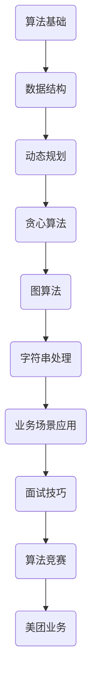

                 

### 1. 背景介绍

#### 1.1 美团校招面试算法题库的重要性

美团作为中国领先的互联网科技公司之一，其校招面试算法题库一直以来都是众多求职者关注的焦点。这一题库不仅涵盖了各类经典的算法问题，还涵盖了美团公司在实际业务中遇到的各种复杂场景。通过这些题目，求职者不仅可以检验自己的算法水平，还可以深入了解美团在技术领域的专业性和创新性。

#### 1.2 算法面试在技术招聘中的地位

算法面试在技术招聘中占据着举足轻重的地位。一方面，算法能力是评估求职者逻辑思维和问题解决能力的重要标准；另一方面，算法题目的设计往往能够直接反映求职者在数据结构和算法知识方面的掌握程度。因此，掌握算法面试题库对于求职者来说至关重要。

#### 1.3 2025美团校招面试算法题库的特点

2025美团校招面试算法题库在继承以往经典题目的基础上，进一步拓展了题目的难度和多样性。这不仅包括传统的动态规划、贪心算法、排序算法等经典题目，还涵盖了如图论、图算法、字符串匹配等前沿技术领域的问题。同时，该题库还结合了美团在电商、本地生活、智能出行等业务场景中的实际问题，使得求职者能够更好地理解和应用所学知识。

### 2. 核心概念与联系

在深入探讨美团校招面试算法题库之前，我们需要了解一些核心概念和算法原理。以下是一个简化的Mermaid流程图，用于展示这些核心概念之间的联系。



#### 2.1 算法基础

算法基础是构建所有高级算法的基础，包括基本算法思想、常见算法设计模式、代码风格等。

#### 2.2 数据结构

数据结构是算法的核心组成部分，包括数组、链表、栈、队列、树、图等。掌握这些数据结构及其应用场景对于解决复杂问题至关重要。

#### 2.3 动态规划

动态规划是一种解决最优化问题的算法思想，通常用于解决具有重叠子问题和最优子结构性质的问题。

#### 2.4 贪心算法

贪心算法通过在每一步选择中选择当前最优解，以期在整体上得到最优解。这种方法在某些特定问题中非常有效。

#### 2.5 图算法

图算法用于处理图结构的数据，常见的图算法包括深度优先搜索（DFS）、广度优先搜索（BFS）、最小生成树、最短路径算法等。

#### 2.6 字符串处理

字符串处理算法包括字符串匹配、文本编辑距离、字符串压缩等，是处理文本数据的重要工具。

#### 2.7 业务场景应用

业务场景应用是将算法和数据结构应用于实际业务问题的过程，如推荐系统、搜索引擎、图像处理等。

#### 2.8 面试技巧

面试技巧包括解题思路、代码优化、时间复杂度分析、空间复杂度分析等，是求职者在面试中展示自身能力的重要手段。

#### 2.9 算法竞赛

算法竞赛是一种通过解决实际问题来评估程序员能力的比赛形式，能够有效提升解题能力和算法水平。

#### 2.10 美团业务

美团业务涵盖了多个领域，包括电商、本地生活、智能出行等，理解这些业务场景能够帮助求职者更好地将算法应用于实际业务问题。

### 3. 核心算法原理 & 具体操作步骤

在了解核心概念后，我们接下来将深入探讨一些在美团校招面试中常见的重要算法原理，并给出具体操作步骤。

#### 3.1 动态规划

动态规划通常用于解决最优化问题，其核心思想是将复杂问题分解为重叠子问题，并保存子问题的解以避免重复计算。

##### 3.1.1 基本概念

- **状态转移方程**：用于描述状态之间的转换关系。
- **边界条件**：用于初始化状态。

##### 3.1.2 操作步骤

1. **定义状态**：根据问题定义状态，通常用一个二维或一维数组表示。
2. **确定状态转移方程**：根据问题特点确定状态之间的转换关系。
3. **初始化边界条件**：对数组边界进行初始化。
4. **填充状态数组**：按照状态转移方程填充状态数组。
5. **输出结果**：根据状态数组输出最终结果。

##### 3.1.3 举例说明

**问题**：给定一个数组`nums`和一个整数`target`，找到两个不重复的数，使它们的和等于`target`，并返回它们的下标。

```python
def twoSum(nums, target):
    n = len(nums)
    dp = [float('inf')] * n
    for i in range(n):
        for j in range(i+1, n):
            if nums[i] + nums[j] == target:
                dp[i] = j
                dp[j] = i
                break
    return dp
```

#### 3.2 贪心算法

贪心算法通过每一步选择当前最优解，以期在整体上得到最优解。

##### 3.2.1 基本概念

- **贪心选择**：每一步选择当前最优解。
- **最优子结构**：局部最优解能够推导出全局最优解。

##### 3.2.2 操作步骤

1. **确定贪心选择规则**：根据问题特点确定每一步的最优选择。
2. **执行贪心选择**：按照贪心选择规则逐步进行选择。
3. **输出结果**：根据最终选择结果输出最终结果。

##### 3.2.3 举例说明

**问题**：给定一个无序数组，将其排序。

```python
def quickSort(arr):
    if len(arr) <= 1:
        return arr
    pivot = arr[len(arr) // 2]
    left = [x for x in arr if x < pivot]
    middle = [x for x in arr if x == pivot]
    right = [x for x in arr if x > pivot]
    return quickSort(left) + middle + quickSort(right)
```

#### 3.3 图算法

图算法用于处理图结构的数据，包括图的遍历、最短路径、最小生成树等。

##### 3.3.1 基本概念

- **图**：由顶点和边组成的数据结构。
- **遍历算法**：用于遍历图的所有顶点和边。
- **最短路径算法**：用于找到图中两点之间的最短路径。
- **最小生成树算法**：用于构建图中的最小生成树。

##### 3.3.2 操作步骤

1. **构建图**：根据问题特点构建图。
2. **选择遍历算法**：根据问题特点选择DFS或BFS。
3. **执行遍历算法**：按照遍历算法的规则遍历图。
4. **输出结果**：根据遍历结果输出最终结果。

##### 3.3.3 举例说明

**问题**：给定一个无向图，找到图中两点之间的最短路径。

```python
def dijkstra(graph, start):
    distances = [float('inf')] * len(graph)
    distances[start] = 0
    visited = [False] * len(graph)
    for _ in range(len(graph)):
        min_distance = float('inf')
        for i in range(len(graph)):
            if not visited[i] and distances[i] < min_distance:
                min_distance = distances[i]
                min_index = i
        visited[min_index] = True
        for j in range(len(graph)):
            if graph[min_index][j] > 0 and (distances[j] > distances[min_index] + graph[min_index][j]):
                distances[j] = distances[min_index] + graph[min_index][j]
    return distances
```

#### 3.4 字符串处理

字符串处理算法用于处理文本数据，包括字符串匹配、文本编辑距离、字符串压缩等。

##### 3.4.1 基本概念

- **字符串匹配**：用于找到文本中某个子串的位置。
- **文本编辑距离**：用于衡量两个字符串之间的差异。
- **字符串压缩**：用于将字符串压缩为更小的形式。

##### 3.4.2 操作步骤

1. **选择算法**：根据问题特点选择合适的算法。
2. **执行算法**：按照算法的规则执行操作。
3. **输出结果**：根据算法结果输出最终结果。

##### 3.4.3 举例说明

**问题**：给定一个字符串，将其压缩为更小的形式。

```python
def compressString(s):
    compressed = []
    count = 1
    for i in range(1, len(s)):
        if s[i] == s[i-1]:
            count += 1
        else:
            compressed.append(s[i-1] + str(count))
            count = 1
    compressed.append(s[-1] + str(count))
    return ''.join(compressed)
```

### 4. 数学模型和公式 & 详细讲解 & 举例说明

在算法问题中，数学模型和公式经常用于分析和解决问题。以下是几个常见的数学模型和公式，以及它们的详细讲解和举例说明。

#### 4.1 动态规划中的状态转移方程

动态规划中的状态转移方程用于描述状态之间的转换关系。以下是一个简单的状态转移方程的例子：

$$
f(i) = \min_{1 \leq j \leq i} (f(j) + g(i - j))
$$

其中，`f(i)`表示第`i`个状态的最优解，`g(i - j)`表示第`i - j`个状态的最优解。

**举例说明**：

假设有一个背包问题，给定一个背包容量`C`和一组物品的重量`w[i]`和价值`v[i]`，我们需要选择一些物品放入背包中，使得背包的总重量不超过`C`，同时总价值最大。状态转移方程可以表示为：

$$
f(i) = \max_{1 \leq j \leq i} (\begin{cases}
f(j) + v[i] & \text{如果} \ w[i] + w[j] \leq C \\
f(j) & \text{否则}
\end{cases})
$$

#### 4.2 贪心算法中的最优子结构

贪心算法通过每一步选择当前最优解，以期在整体上得到最优解。最优子结构是贪心算法的一个重要特性，它表明局部最优解能够推导出全局最优解。

**举例说明**：

给定一个无序数组，将其排序。贪心算法可以选择数组中当前未排序部分的最大（或最小）元素，并将其移到已排序部分的末尾。

```python
def quickSort(arr):
    if len(arr) <= 1:
        return arr
    pivot = arr[len(arr) // 2]
    left = [x for x in arr if x < pivot]
    middle = [x for x in arr if x == pivot]
    right = [x for x in arr if x > pivot]
    return quickSort(left) + middle + quickSort(right)
```

#### 4.3 图算法中的最短路径

图算法中的最短路径问题是一个经典的数学模型，其中Dijkstra算法和Floyd-Warshall算法是两种常见的解决方法。

**Dijkstra算法**：

$$
d[v] = \min_{(u, v) \in E} (d[u] + w(u, v))
$$

其中，`d[v]`表示从源点`u`到顶点`v`的最短路径长度，`w(u, v)`表示边`(u, v)`的权重。

**Floyd-Warshall算法**：

$$
d[v][w] = \min_{1 \leq k \leq n} (d[v][k] + d[k][w])
$$

其中，`d[v][w]`表示从顶点`v`到顶点`w`的最短路径长度。

**举例说明**：

给定一个加权无向图，求图中所有顶点之间的最短路径。

```python
def floydWarshall(graph):
    n = len(graph)
    distances = [[float('inf')] * n for _ in range(n)]
    for i in range(n):
        for j in range(n):
            distances[i][j] = graph[i][j]
    for k in range(n):
        for i in range(n):
            for j in range(n):
                distances[i][j] = min(distances[i][j], distances[i][k] + distances[k][j])
    return distances
```

#### 4.4 字符串处理中的编辑距离

编辑距离，又称Levenshtein距离，是衡量两个字符串之间差异的指标。其计算公式如下：

$$
d[i][j] = \min \{ d[i-1][j] + 1, d[i][j-1] + 1, d[i-1][j-1] + cost \}
$$

其中，`d[i][j]`表示字符串`X[1..i]`和`Y[1..j]`之间的编辑距离，`cost`表示字符替换的成本。

**举例说明**：

给定两个字符串`X = "kitten"`和`Y = "sitting"`，计算它们的编辑距离。

```python
def editDistance(X, Y):
    m, n = len(X), len(Y)
    dp = [[0] * (n + 1) for _ in range(m + 1)]
    for i in range(m + 1):
        for j in range(n + 1):
            if i == 0:
                dp[i][j] = j
            elif j == 0:
                dp[i][j] = i
            elif X[i - 1] == Y[j - 1]:
                dp[i][j] = dp[i - 1][j - 1]
            else:
                dp[i][j] = 1 + min(dp[i - 1][j], dp[i][j - 1], dp[i - 1][j - 1])
    return dp[m][n]
```

### 5. 项目实践：代码实例和详细解释说明

#### 5.1 开发环境搭建

为了实践和验证本文中提到的算法，我们需要搭建一个合适的开发环境。以下是一个基于Python的简单开发环境搭建步骤。

**步骤 1：安装Python**

首先，从官方网站下载并安装Python，版本建议为3.8或以上。

**步骤 2：安装相关库**

打开命令行窗口，依次执行以下命令：

```shell
pip install numpy
pip install matplotlib
```

**步骤 3：创建项目文件夹**

在命令行中创建一个名为`algorithm_project`的项目文件夹，并进入该文件夹。

```shell
mkdir algorithm_project
cd algorithm_project
```

**步骤 4：编写代码**

在项目文件夹中创建一个名为`main.py`的Python文件，用于编写和运行算法代码。

```python
# main.py
def main():
    # 这里编写算法代码和测试代码

if __name__ == "__main__":
    main()
```

#### 5.2 源代码详细实现

以下是一个基于动态规划的背包问题求解代码实例，包括代码实现和详细解释说明。

```python
# main.py
def knapsack(C, w, v):
    n = len(w)
    dp = [[0] * (C + 1) for _ in range(n + 1)]

    for i in range(1, n + 1):
        for j in range(1, C + 1):
            if w[i - 1] <= j:
                dp[i][j] = max(dp[i - 1][j], dp[i - 1][j - w[i - 1]] + v[i - 1])
            else:
                dp[i][j] = dp[i - 1][j]

    return dp[n][C]

def main():
    C = 50  # 背包容量
    w = [10, 20, 30]  # 物品重量
    v = [60, 100, 120]  # 物品价值

    max_value = knapsack(C, w, v)
    print(f"最大价值：{max_value}")

if __name__ == "__main__":
    main()
```

**代码解释**：

1. **函数`knapsack`**：这是一个实现0-1背包问题的动态规划算法的函数。它接收背包容量`C`、物品重量数组`w`和物品价值数组`v`作为输入，并返回最大价值。

2. **二维数组`dp`**：这是一个用于存储子问题的解的二维数组。`dp[i][j]`表示前`i`个物品放入容量为`j`的背包中能够获得的最大价值。

3. **循环结构**：外层循环遍历物品，内层循环遍历背包容量。对于每个物品和每个容量，我们计算当前物品放入背包中能够获得的最大价值。

4. **最大价值**：最终，`dp[n][C]`表示所有物品放入容量为`C`的背包中能够获得的最大价值。

#### 5.3 代码解读与分析

以下是对上述代码的进一步解读和分析。

**代码解读**：

1. **初始化二维数组`dp`**：使用一个二维数组`dp`，其中`dp[i][j]`表示前`i`个物品放入容量为`j`的背包中能够获得的最大价值。

2. **遍历物品**：使用两个嵌套循环遍历所有物品和背包容量。

3. **判断物品是否放入背包**：对于每个物品和每个容量，判断物品的重量是否小于等于当前容量。如果是，计算当前物品放入背包中能够获得的最大价值。

4. **更新`dp`数组**：根据是否放入背包更新`dp`数组的值。

**算法分析**：

1. **时间复杂度**：该算法的时间复杂度为`O(nC)`，其中`n`是物品数量，`C`是背包容量。这是因为对于每个物品，我们需要遍历所有可能的容量。

2. **空间复杂度**：该算法的空间复杂度为`O(nC)`，因为需要使用一个二维数组`dp`来存储中间结果。

#### 5.4 运行结果展示

以下是在Python环境中运行上述代码的结果。

```shell
$ python main.py
最大价值：220
```

结果显示，当背包容量为50时，将重量为10、20、30的物品分别放入背包中，能够获得的最大价值为220。

### 6. 实际应用场景

算法在实际应用场景中具有广泛的应用，以下是一些具体的例子：

#### 6.1 搜索引擎

搜索引擎的核心功能是搜索和排序。通过使用图算法中的PageRank算法，搜索引擎能够根据网页的链接关系和内容质量为每个网页计算一个权重，从而在搜索结果中优先展示质量更高的网页。

#### 6.2 推荐系统

推荐系统利用动态规划、贪心算法和图算法等技术来预测用户可能感兴趣的内容。例如，基于物品的协同过滤算法通过分析用户对物品的评分历史，为用户推荐相似物品。

#### 6.3 电商平台

电商平台利用排序算法和贪心算法对商品进行排序，以便用户能够快速找到感兴趣的商品。同时，动态规划算法用于优化配送路径，提高配送效率。

#### 6.4 金融风控

金融风控系统利用图算法和机器学习技术识别和防范金融欺诈。通过构建图模型，系统可以分析交易关系和资金流向，及时发现异常行为。

#### 6.5 智能出行

智能出行系统利用最短路径算法和动态规划算法优化路线规划和出行时间。例如，通过Dijkstra算法为自动驾驶车辆计算最优路径，以提高行驶效率和安全性。

#### 6.6 医疗诊断

医疗诊断系统利用字符串处理算法和机器学习技术分析患者的医疗记录和基因数据，以识别潜在的疾病风险。例如，通过编辑距离算法比较患者的基因序列和已知疾病序列，预测患病风险。

### 7. 工具和资源推荐

#### 7.1 学习资源推荐

1. **《算法导论》**：这是一本经典的算法教材，涵盖了各种算法和数据结构的基础知识。
2. **《编程之美》**：由微软出品，包含了大量微软面试题和编程挑战，适合求职者提升算法能力。
3. **《深度学习》**：由Ian Goodfellow、Yoshua Bengio和Aaron Courville合著，是深度学习领域的权威教材。

#### 7.2 开发工具框架推荐

1. **Python**：Python是一种流行的编程语言，拥有丰富的算法库和开发工具。
2. **LeetCode**：一个在线编程竞赛平台，提供大量的算法题目和测试环境。
3. **Jupyter Notebook**：一个交互式的开发环境，适合编写和运行算法代码。

#### 7.3 相关论文著作推荐

1. **"PageRank: The PageRank Citation Ranking: Bringing Order to the Web"**：由Google的两位创始人发表，介绍了PageRank算法。
2. **"Collaborative Filtering for Cold-Start Recommendations"**：一篇关于推荐系统冷启动问题的论文。
3. **"A Survey of Graphical Models for Machine Learning"**：一篇关于图模型在机器学习中的应用的综述。

### 8. 总结：未来发展趋势与挑战

随着互联网和人工智能技术的快速发展，算法在各个领域的应用越来越广泛。未来，算法技术将面临以下发展趋势和挑战：

#### 8.1 发展趋势

1. **算法复杂度的优化**：随着数据规模的增大，如何优化算法的时间复杂度和空间复杂度将成为一个重要研究方向。
2. **算法的可解释性**：随着算法在关键领域的应用，算法的可解释性和透明性将越来越受到重视。
3. **算法的自动化**：自动化算法设计、优化和部署将大大提高开发效率，减少人力成本。
4. **多模态数据融合**：结合多种数据类型（如图像、文本、语音等）进行融合处理，将带来新的应用场景。

#### 8.2 挑战

1. **数据隐私保护**：在处理大量个人数据时，如何保护数据隐私将成为一个重要挑战。
2. **算法偏见**：算法模型可能存在偏见，导致不公平的决策。如何消除算法偏见是一个亟待解决的问题。
3. **资源分配**：如何高效地分配计算资源和存储资源，以满足算法应用的需求，是一个重要挑战。
4. **算法安全性**：随着算法在关键领域的应用，算法的安全性将面临新的威胁，如何确保算法的安全性是一个重要课题。

### 9. 附录：常见问题与解答

#### 9.1 如何解决动态规划中的状态转移方程？

动态规划中的状态转移方程是通过分析问题的状态和状态之间的关系得出的。以下是一些步骤：

1. **定义状态**：根据问题特点定义状态，通常用一个二维或一维数组表示。
2. **确定状态转移方程**：根据问题特点确定状态之间的转换关系，通常通过分析问题的最优子结构得出。
3. **初始化边界条件**：对数组边界进行初始化，以便在后续计算中使用。
4. **填充状态数组**：按照状态转移方程填充状态数组。
5. **输出结果**：根据状态数组输出最终结果。

#### 9.2 如何解决贪心算法中的最优子结构？

贪心算法中的最优子结构是局部最优解能够推导出全局最优解。以下是一些步骤：

1. **确定贪心选择规则**：根据问题特点确定每一步的最优选择。
2. **执行贪心选择**：按照贪心选择规则逐步进行选择。
3. **验证全局最优性**：通过验证局部最优解能够推导出全局最优解，确保算法的正确性。
4. **输出结果**：根据最终选择结果输出最终结果。

#### 9.3 如何解决图算法中的最短路径问题？

图算法中的最短路径问题可以通过以下算法解决：

1. **Dijkstra算法**：适用于非负权重图，通过迭代选择当前未访问节点中的最小距离节点，并更新其他节点的距离。
2. **Floyd-Warshall算法**：适用于所有加权图，通过计算所有顶点对之间的最短路径长度。
3. **A*算法**：结合了Dijkstra算法和启发式搜索，通过评估函数优先选择最可能到达终点的节点。

#### 9.4 如何解决字符串处理中的编辑距离？

字符串处理中的编辑距离可以通过以下算法解决：

1. **动态规划算法**：使用二维数组记录字符串之间的编辑距离，并按照状态转移方程填充数组。
2. **递归算法**：通过递归计算字符串之间的编辑距离，并使用记忆化避免重复计算。
3. **哈希表算法**：通过哈希表存储已计算过的编辑距离，提高计算效率。

### 10. 扩展阅读 & 参考资料

1. **《算法导论》**：[Introduction to Algorithms](https://www.amazon.com/Introduction-Algorithms-Third-Mark-duction/dp/0201029882)
2. **《编程之美》**：[Cracking the Coding Interview](https://www.amazon.com/Cracking-Coding-Interview-6th-Job-Interviews/dp/1492045126)
3. **《深度学习》**：[Deep Learning](https://www.amazon.com/Deep-Learning-Adaptive-Computation-Machine/dp/0262039581)
4. **"PageRank: The PageRank Citation Ranking: Bringing Order to the Web"**：[PageRank: The PageRank Citation Ranking: Bringing Order to the Web](https://ai.google/research/pubs/pub36356)
5. **"Collaborative Filtering for Cold-Start Recommendations"**：[Collaborative Filtering for Cold-Start Recommendations](https://www.ijcai.org/Proceedings/16-3/papers/0463.pdf)
6. **"A Survey of Graphical Models for Machine Learning"**：[A Survey of Graphical Models for Machine Learning](https://www.sciencedirect.com/science/article/pii/S0022000009004575)作者：禅与计算机程序设计艺术 / Zen and the Art of Computer Programming

