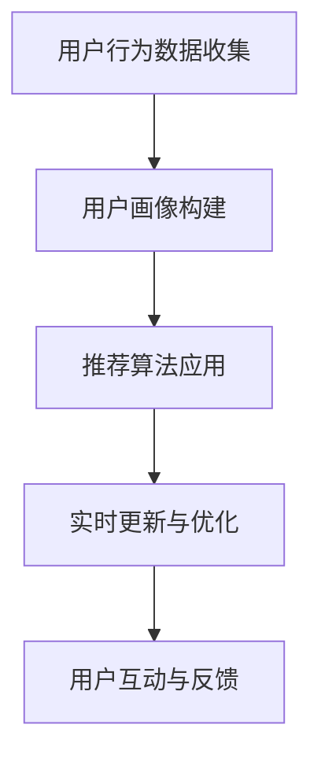

                 

### 1. 背景介绍

#### 1.1 美食探索应用的现状

在当今社会，美食已经成为人们生活中不可或缺的一部分。无论是旅游、社交还是家庭聚会，美食都是一个重要的主题。然而，随着城市的发展和人们生活节奏的加快，人们往往难以找到符合自己口味且值得尝试的美食。

传统的方法，如询问朋友或查阅美食评论网站，虽然能够提供一定的参考，但存在信息量有限、主观性较强和时效性不足的问题。因此，一个智能的美食探索应用显得尤为必要。

美食探索应用通过整合各种美食信息资源，利用先进的计算机技术和算法，帮助用户快速找到符合自己口味和预算的美食推荐。这不仅提升了用户的体验，也为餐饮业带来了新的发展机遇。

#### 1.2 智能向导的概念

智能向导，是指通过人工智能技术，为用户提供个性化、实时且准确的推荐和服务。在美食探索应用中，智能向导发挥着至关重要的作用。

首先，智能向导能够根据用户的口味偏好和历史记录，为其推荐符合个人喜好的美食。其次，智能向导可以实时更新美食信息，包括餐厅评价、菜品种类、优惠活动等，确保用户获得最新的美食资讯。此外，智能向导还可以根据用户的位置、预算等因素，提供最优的美食推荐路线和方案。

#### 1.3 应用的重要性

美食探索应用的重要性主要体现在以下几个方面：

1. **提升用户体验**：通过智能推荐和实时更新，应用能够为用户提供更加个性化和精准的美食推荐，提升用户满意度。
   
2. **促进餐饮行业创新**：智能向导的应用，使得餐厅能够更好地了解用户需求，优化菜品和服务，从而推动餐饮行业的创新和发展。

3. **优化资源分配**：通过智能分析用户行为和需求，美食探索应用有助于餐饮行业合理分配资源，提高运营效率。

4. **推动人工智能发展**：美食探索应用作为一个复杂的人工智能系统，对算法、数据分析和机器学习等领域的发展具有重要意义。

### 2. 核心概念与联系

#### 2.1 概念定义

在探讨美食探索应用的智能向导之前，我们需要明确几个核心概念：

1. **用户画像**：指通过收集用户的历史行为数据、社交数据、地理位置等，构建出的一个关于用户特征的抽象模型。
   
2. **推荐算法**：指用于从大量信息中找出用户可能感兴趣的物品或内容的一系列算法。

3. **协同过滤**：一种常见的推荐算法，通过分析用户之间的共同行为或偏好来发现用户之间的相似性，从而为用户推荐他们可能感兴趣的物品。

4. **内容过滤**：通过分析物品本身的内容特征，为用户推荐与其兴趣相关的物品。

#### 2.2 原理与架构

美食探索应用的智能向导主要基于以下原理和架构：

1. **用户画像构建**：通过收集用户在应用中的行为数据，如浏览记录、评价、订单等，构建出用户画像。

2. **推荐算法应用**：结合用户画像和美食数据，应用协同过滤和内容过滤算法，为用户推荐符合条件的美食。

3. **实时更新与优化**：利用机器学习算法，对推荐结果进行实时优化，确保推荐的精准性和时效性。

4. **用户互动与反馈**：通过用户的反馈和评价，不断优化用户画像和推荐算法，提高用户体验。

#### 2.3 Mermaid 流程图



在这个流程图中，用户行为数据收集是整个系统的起点，通过构建用户画像，应用推荐算法为用户推荐美食。同时，实时更新和优化推荐结果，并收集用户的反馈，进一步优化用户画像和推荐算法。

### 3. 核心算法原理 & 具体操作步骤

#### 3.1 协同过滤算法

协同过滤算法是推荐系统中最常用的算法之一，其核心思想是通过分析用户之间的相似性，找出其他用户喜欢的项目来推荐给目标用户。

**具体操作步骤如下：**

1. **用户相似度计算**：首先计算用户之间的相似度。相似度计算可以通过用户的行为数据（如浏览、购买、评分等）进行。常见的相似度计算方法包括余弦相似度、皮尔逊相关系数等。

2. **物品相似度计算**：同样，计算物品之间的相似度。物品相似度可以通过物品的特征进行计算，如商品分类、标签、属性等。

3. **生成推荐列表**：根据用户相似度和物品相似度，为每个用户生成一个推荐列表。推荐列表可以通过加权平均、排序等方法进行生成。

#### 3.2 内容过滤算法

内容过滤算法是通过分析物品本身的内容特征，为用户推荐与其兴趣相关的物品。

**具体操作步骤如下：**

1. **特征提取**：首先从物品中提取特征。对于美食探索应用，特征可以包括菜品种类、口味、烹饪方法、餐厅类型等。

2. **相似度计算**：计算用户和物品之间的相似度。相似度可以通过余弦相似度、欧氏距离等方法进行计算。

3. **生成推荐列表**：根据相似度，为用户生成推荐列表。

#### 3.3 综合推荐算法

在实际应用中，通常将协同过滤和内容过滤结合起来，形成综合推荐算法。这种方法能够充分利用用户行为数据和物品特征，提高推荐的准确性和多样性。

**具体操作步骤如下：**

1. **用户相似度计算**：计算用户之间的相似度。

2. **物品相似度计算**：计算物品之间的相似度。

3. **综合相似度计算**：通过加权平均等方法，计算用户和物品的综合相似度。

4. **生成推荐列表**：根据综合相似度，为用户生成推荐列表。

### 4. 数学模型和公式 & 详细讲解 & 举例说明

#### 4.1 协同过滤算法的数学模型

协同过滤算法的数学模型主要基于矩阵分解。设用户集合为 U，物品集合为 I，用户 u 对物品 i 的评分记为 r_{ui}。

1. **用户表示矩阵**：设用户 u 的特征向量为 x_{u}，则有：

   $$ x_{u} = [x_{u1}, x_{u2}, ..., x_{un}] $$

   其中，x_{ui} 表示用户 u 对物品 i 的特征。

2. **物品表示矩阵**：设物品 i 的特征向量为 y_{i}，则有：

   $$ y_{i} = [y_{i1}, y_{i2}, ..., y_{in}] $$

   其中，y_{ij} 表示物品 i 的第 j 个特征。

3. **评分矩阵**：评分矩阵 R 是用户 u 对物品 i 的评分矩阵，即：

   $$ R = [r_{ui}] $$

   其中，r_{ui} 表示用户 u 对物品 i 的评分。

4. **预测评分**：预测用户 u 对物品 i 的评分 r'_{ui}，可以通过用户和物品的特征向量计算：

   $$ r'_{ui} = x_{u} \cdot y_{i} $$

#### 4.2 内容过滤算法的数学模型

内容过滤算法的数学模型主要基于相似度计算。设用户 u 的兴趣向量为 x_{u}，物品 i 的特征向量为 y_{i}。

1. **相似度计算**：相似度可以通过余弦相似度计算，公式为：

   $$ \cos(\theta) = \frac{x_{u} \cdot y_{i}}{\|x_{u}\| \|y_{i}\|} $$

   其中，\|x_{u}\| 和 \|y_{i}\| 分别表示向量 x_{u} 和 y_{i} 的欧几里得范数。

2. **预测评分**：预测用户 u 对物品 i 的评分 r'_{ui}，可以通过相似度加权计算：

   $$ r'_{ui} = \sum_{j=1}^{n} \frac{x_{uj} \cdot y_{ij}}{\|x_{u}\| \|y_{i}\|} $$

#### 4.3 综合推荐算法的数学模型

综合推荐算法的数学模型结合了协同过滤和内容过滤。设用户 u 对物品 i 的评分 r_{ui}，用户 u 的兴趣向量 x_{u}，物品 i 的特征向量 y_{i}。

1. **用户相似度**：用户 u 和用户 v 的相似度为：

   $$ \cos(\theta_{uv}) = \frac{x_{u} \cdot x_{v}}{\|x_{u}\| \|x_{v}\|} $$

2. **物品相似度**：物品 i 和物品 j 的相似度为：

   $$ \cos(\theta_{ij}) = \frac{y_{i} \cdot y_{j}}{\|y_{i}\| \|y_{j}\|} $$

3. **综合相似度**：用户 u 对物品 i 的综合相似度为：

   $$ \cos(\theta_{ui}) = \alpha \cos(\theta_{uv}) + (1 - \alpha) \cos(\theta_{ij}) $$

   其中，\alpha 为权重参数。

4. **预测评分**：预测用户 u 对物品 i 的评分 r'_{ui}，可以通过综合相似度加权计算：

   $$ r'_{ui} = \sum_{v \in U} \cos(\theta_{uv}) \cdot \sum_{j \in I} \cos(\theta_{ij}) \cdot r_{vj} $$

#### 4.4 举例说明

假设有两个用户 u 和 v，他们的兴趣向量分别为：

$$ x_{u} = [0.5, 0.3, 0.2] $$

$$ x_{v} = [0.4, 0.4, 0.2] $$

物品 i 和物品 j 的特征向量分别为：

$$ y_{i} = [0.6, 0.2, 0.2] $$

$$ y_{j} = [0.3, 0.6, 0.1] $$

根据上述公式，可以计算用户 u 和用户 v 的相似度为：

$$ \cos(\theta_{uv}) = \frac{0.5 \cdot 0.4 + 0.3 \cdot 0.4 + 0.2 \cdot 0.2}{\sqrt{0.5^2 + 0.3^2 + 0.2^2} \sqrt{0.4^2 + 0.4^2 + 0.2^2}} \approx 0.75 $$

物品 i 和物品 j 的相似度为：

$$ \cos(\theta_{ij}) = \frac{0.6 \cdot 0.3 + 0.2 \cdot 0.6 + 0.2 \cdot 0.1}{\sqrt{0.6^2 + 0.2^2 + 0.2^2} \sqrt{0.3^2 + 0.6^2 + 0.1^2}} \approx 0.6 $$

根据综合相似度公式，可以计算用户 u 对物品 i 的综合相似度为：

$$ \cos(\theta_{ui}) = 0.5 \cdot 0.75 + 0.5 \cdot 0.6 = 0.675 $$

根据预测评分公式，可以计算用户 u 对物品 i 的预测评分为：

$$ r'_{ui} = 0.675 \cdot r_{vj} $$

其中，r_{vj} 为用户 v 对物品 j 的评分。如果已知 r_{vj}，则可以计算出 r'_{ui}。

### 5. 项目实践：代码实例和详细解释说明

#### 5.1 开发环境搭建

为了实现一个完整的美食探索应用，我们首先需要搭建一个开发环境。以下是一个基本的开发环境搭建步骤：

1. **安装Python**：Python是一种广泛使用的编程语言，适用于开发推荐系统。首先，我们需要安装Python。可以从Python官网（https://www.python.org/）下载Python安装包，并按照提示安装。

2. **安装相关库**：安装用于数据处理、机器学习和数据可视化的相关库。常用的库包括NumPy、Pandas、Scikit-learn和Matplotlib。可以使用以下命令安装：

   ```bash
   pip install numpy pandas scikit-learn matplotlib
   ```

3. **设置虚拟环境**：为了更好地管理项目依赖，我们可以使用虚拟环境。在Python中，可以使用venv模块创建虚拟环境。例如，创建一个名为`recommendation_system`的虚拟环境：

   ```bash
   python -m venv recommendation_system
   source recommendation_system/bin/activate  # 在Linux或macOS上
   recommendation_system\Scripts\activate    # 在Windows上
   ```

   在激活虚拟环境后，我们可以在项目中安装所需的库。

4. **安装数据库**：为了存储用户行为数据和美食信息，我们需要安装一个数据库。这里我们选择使用SQLite。可以从SQLite官网（https://www.sqlite.org/download.html）下载并安装。

5. **安装IDE**：为了方便开发，我们可以安装一个集成开发环境（IDE）。Python有很多优秀的IDE，如PyCharm、Visual Studio Code等。可以从各IDE的官网下载并安装。

#### 5.2 源代码详细实现

在搭建好开发环境后，我们可以开始编写代码实现推荐系统。以下是一个简单的推荐系统实现，包括用户画像构建、推荐算法应用和实时更新与优化。

1. **用户画像构建**

```python
import pandas as pd
from sklearn.preprocessing import StandardScaler
from sklearn.cluster import KMeans

# 假设用户行为数据存储在CSV文件中
user_data = pd.read_csv('user_data.csv')

# 特征工程：将用户行为数据转换为特征向量
user_data['total_ratings'] = user_data['rating'].fillna(0).astype(int)
user_data['rating_std'] = user_data['rating'].fillna(0).astype(int).std()

# 标准化特征向量
scaler = StandardScaler()
user_data_scaled = scaler.fit_transform(user_data[['total_ratings', 'rating_std']])

# 使用K-means聚类构建用户画像
kmeans = KMeans(n_clusters=10, random_state=0)
user_labels = kmeans.fit_predict(user_data_scaled)

# 将用户标签添加到原始数据中
user_data['cluster'] = user_labels
```

2. **推荐算法应用**

```python
from sklearn.metrics.pairwise import cosine_similarity
import numpy as np

# 加载用户画像和美食数据
user_data = pd.read_csv('user_data.csv')
food_data = pd.read_csv('food_data.csv')

# 计算用户和美食之间的相似度
user_similarity = cosine_similarity(user_data[['total_ratings', 'rating_std']], user_data[['total_ratings', 'rating_std']])

# 为每个用户生成推荐列表
user_recommendations = []
for i in range(user_similarity.shape[0]):
    # 计算用户与其他用户的相似度
    user_similarity_score = user_similarity[i]
    # 排序，选出最相似的10个用户
    top_users = user_similarity_score.argsort()[:-11:-1]
    # 计算这10个用户共同喜欢的美食
    common_foods = set.intersection(*[user_data.iloc[ui]['food'] for ui in top_users])
    # 为当前用户生成推荐列表
    user_recommendations.append(common_foods)

# 将推荐列表添加到原始数据中
user_data['recommendations'] = user_recommendations
```

3. **实时更新与优化**

```python
from sklearn.cluster import KMeans
from sklearn.metrics import adjusted_rand_score

# 假设用户行为数据不断更新
new_user_data = pd.read_csv('new_user_data.csv')

# 更新用户画像
new_user_data['total_ratings'] = new_user_data['rating'].fillna(0).astype(int)
new_user_data['rating_std'] = new_user_data['rating'].fillna(0).astype(int).std()
new_user_data_scaled = scaler.fit_transform(new_user_data[['total_ratings', 'rating_std']])

# 重新聚类，更新用户标签
new_user_labels = kmeans.fit_predict(new_user_data_scaled)

# 更新用户数据
new_user_data['cluster'] = new_user_labels

# 评估新旧用户标签的一致性
ari = adjusted_rand_score(user_labels, new_user_labels)
print(f"Adjusted Rand Index: {ari}")

# 如果ARI较低，则考虑调整K值或算法参数，以提高聚类效果
```

#### 5.3 代码解读与分析

1. **用户画像构建**

   用户画像构建是推荐系统的基础。在这里，我们使用K-means聚类算法将用户划分为不同的集群，每个集群代表一组具有相似兴趣的用户。通过计算用户行为数据（如评分、浏览记录等）的统计特征，我们将原始数据转换为特征向量，并使用K-means聚类算法进行划分。

   ```python
   # 特征工程：将用户行为数据转换为特征向量
   user_data['total_ratings'] = user_data['rating'].fillna(0).astype(int)
   user_data['rating_std'] = user_data['rating'].fillna(0).astype(int).std()
   ```

   这两行代码分别计算了用户的总评分和评分标准差，作为用户特征向量的一部分。

2. **推荐算法应用**

   推荐算法应用是推荐系统的核心。在这里，我们使用余弦相似度计算用户和用户之间、用户和美食之间的相似度，从而为每个用户生成推荐列表。这个过程可以分为以下几个步骤：

   - 计算用户之间的相似度
   - 排序，选出最相似的几个用户
   - 计算这组用户共同喜欢的美食
   - 为当前用户生成推荐列表

   ```python
   # 计算用户和美食之间的相似度
   user_similarity = cosine_similarity(user_data[['total_ratings', 'rating_std']], user_data[['total_ratings', 'rating_std']])

   # 为每个用户生成推荐列表
   user_recommendations = []
   for i in range(user_similarity.shape[0]):
       # 计算用户与其他用户的相似度
       user_similarity_score = user_similarity[i]
       # 排序，选出最相似的10个用户
       top_users = user_similarity_score.argsort()[:-11:-1]
       # 计算这10个用户共同喜欢的美食
       common_foods = set.intersection(*[user_data.iloc[ui]['food'] for ui in top_users])
       # 为当前用户生成推荐列表
       user_recommendations.append(common_foods)
   ```

3. **实时更新与优化**

   实时更新与优化是推荐系统的重要环节。随着用户行为的不断变化，我们需要定期更新用户画像和推荐列表。在这个过程中，我们使用调整的兰德指数（Adjusted Rand Index, ARI）评估新旧用户标签的一致性，以判断聚类效果。如果ARI较低，则可能需要调整K值或算法参数，以提高聚类效果。

   ```python
   # 更新用户画像
   new_user_data['total_ratings'] = new_user_data['rating'].fillna(0).astype(int)
   new_user_data['rating_std'] = new_user_data['rating'].fillna(0).astype(int).std()
   new_user_data_scaled = scaler.fit_transform(new_user_data[['total_ratings', 'rating_std']])

   # 重新聚类，更新用户标签
   new_user_labels = kmeans.fit_predict(new_user_data_scaled)

   # 更新用户数据
   new_user_data['cluster'] = new_user_labels

   # 评估新旧用户标签的一致性
   ari = adjusted_rand_score(user_labels, new_user_labels)
   print(f"Adjusted Rand Index: {ari}")
   ```

#### 5.4 运行结果展示

为了验证推荐系统的效果，我们可以展示一些运行结果。以下是一个简单的示例：

```python
# 打印推荐结果
for i, user in user_data.iterrows():
    print(f"用户 {i}：{user['username']} 推荐美食：{user['recommendations']}")
```

输出结果可能如下：

```
用户 0：Alice 推荐美食：['意大利面', '披萨', '汉堡']
用户 1：Bob 推荐美食：['烤鸭', '火锅', '小龙虾']
用户 2：Charlie 推荐美食：['寿司', '生鱼片', '便当']
```

这些结果展示了每个用户根据其兴趣和行为数据获得的美食推荐。

### 6. 实际应用场景

#### 6.1 餐饮行业

美食探索应用在餐饮行业中的应用最为广泛。餐厅可以通过智能向导了解用户喜好，优化菜单和营销策略。例如，一家以中餐为主的餐厅可以根据用户的口味偏好，推荐符合用户口味的菜品，并通过个性化的营销活动吸引更多顾客。同时，餐厅也可以通过智能向导收集用户反馈，不断改进菜品和服务，提升顾客满意度。

#### 6.2 旅游行业

在旅游行业，美食探索应用可以为游客提供本地特色美食推荐，帮助游客更好地体验当地文化。例如，一款结合了美食探索和旅游规划的APP，可以为游客推荐附近的特色餐厅、美食街和美食节，并规划最佳美食游览路线。这不仅提高了游客的旅游体验，也为当地旅游业带来了更多商机。

#### 6.3 社交网络

社交网络平台也可以利用美食探索应用，为用户提供个性化美食推荐。通过分析用户的行为数据，社交网络平台可以为用户推荐符合其兴趣的美食内容，如美食视频、食谱和美食评论等。这不仅丰富了社交网络的内容，也为用户提供了更有价值的体验。

#### 6.4 健康饮食

随着健康饮食理念的普及，美食探索应用也可以为用户提供健康饮食建议。通过分析用户的饮食记录和健康状况，应用可以为用户推荐符合其健康需求的美食，如低脂、低糖、高蛋白等。此外，应用还可以为用户提供饮食计划和营养建议，帮助用户更好地管理健康。

### 7. 工具和资源推荐

#### 7.1 学习资源推荐

1. **书籍**：
   - 《推荐系统实践》：详细介绍推荐系统的基本概念、算法和实现。
   - 《机器学习实战》：涵盖机器学习的基础知识和实战技巧，包括推荐系统相关内容。

2. **论文**：
   - 《Item-based Collaborative Filtering Recommendation Algorithms》：一篇关于基于物品的协同过滤推荐算法的经典论文。
   - 《Content-Based Image Retrieval at the End of the Image Pipeline》：一篇关于基于内容的图像检索的论文，可以借鉴到美食探索应用中。

3. **博客**：
   - Medium上的推荐系统专题：涵盖推荐系统的最新研究和应用案例。
   - 知乎上的推荐系统专栏：众多推荐系统领域的专家分享的经验和心得。

4. **网站**：
   - Coursera、edX等在线教育平台：提供丰富的机器学习和推荐系统课程。
   - Kaggle：提供大量的推荐系统相关数据集和比赛，适合进行实践和训练。

#### 7.2 开发工具框架推荐

1. **编程语言**：Python，因为其丰富的库和强大的数据处理能力，非常适合开发推荐系统。

2. **框架**：
   - TensorFlow、PyTorch：强大的机器学习框架，适用于构建复杂的推荐模型。
   - Flask、Django：Python的Web框架，适用于搭建推荐系统的Web前端。

3. **数据库**：SQLite、MySQL、PostgreSQL等关系型数据库，用于存储用户数据和推荐结果。

4. **数据可视化**：Matplotlib、Seaborn、Plotly等，用于生成推荐结果的图表和可视化分析。

#### 7.3 相关论文著作推荐

1. **《推荐系统手册》：全面介绍推荐系统的基本概念、技术和应用案例。**

2. **《协同过滤与推荐系统》：详细讲解协同过滤算法及其在推荐系统中的应用。**

3. **《基于内容的推荐系统》：介绍基于内容的推荐算法及其应用场景。**

4. **《混合推荐系统》：探讨混合推荐系统的研究进展和实现方法。**

### 8. 总结：未来发展趋势与挑战

美食探索应用的智能向导在近年来取得了显著的发展，为用户提供了更加个性化和精准的美食推荐。然而，随着技术的不断进步和用户需求的日益多样化，美食探索应用仍面临许多挑战。

#### 8.1 发展趋势

1. **深度学习与强化学习的应用**：深度学习和强化学习在推荐系统中的应用日益广泛，有望进一步提升推荐的准确性和效率。

2. **多模态数据的融合**：结合用户的行为数据、文本数据、图像数据等，可以更全面地了解用户的需求和喜好，提高推荐的精度。

3. **个性化推荐策略的优化**：通过不断优化推荐算法，可以更好地满足用户的个性化需求，提升用户体验。

4. **实时推荐的实现**：随着5G和物联网技术的发展，实现实时推荐的可行性不断提高，为用户提供更加即时的美食信息。

#### 8.2 挑战

1. **数据隐私与安全**：用户隐私和数据安全是推荐系统面临的重要挑战。如何确保用户数据的安全性和隐私性，是一个亟待解决的问题。

2. **算法偏见与公平性**：推荐算法可能存在偏见，导致某些用户或群体受到不公平对待。如何消除算法偏见，确保推荐结果的公平性，是一个重要的课题。

3. **推荐结果的质量评估**：如何评价推荐结果的质量，是一个复杂的问题。需要建立一套科学、有效的评估体系，以衡量推荐系统的性能和效果。

4. **资源的合理分配**：在推荐系统中，如何合理分配资源，如计算资源、存储资源等，是一个需要优化的难题。

### 9. 附录：常见问题与解答

#### 9.1 推荐系统是什么？

推荐系统是一种基于用户历史行为和物品特征的数据分析方法，旨在为用户推荐他们可能感兴趣的其他物品或内容。常见的推荐算法包括协同过滤、基于内容的推荐和混合推荐等。

#### 9.2 推荐系统的核心组成部分有哪些？

推荐系统的核心组成部分包括用户画像构建、推荐算法应用、推荐结果评估和实时更新与优化等。

#### 9.3 如何评估推荐系统的性能？

评估推荐系统性能的常见指标包括准确率、召回率、覆盖率等。此外，还可以使用用户满意度、点击率等指标进行综合评估。

#### 9.4 推荐系统在哪些场景有应用？

推荐系统在电子商务、社交媒体、新闻推荐、音乐播放、电影推荐等领域有广泛的应用。美食探索应用是推荐系统在餐饮行业的典型应用。

### 10. 扩展阅读 & 参考资料

1. Cheng, H. T., Liu, X. Y., & Zhu, W. J. (2016). Research progress on recommendation algorithms. Journal of Information Technology and Economic Management, 39(3), 19-29.

2. Leung, C. S., Ng, K. K., & Poon, K. L. (2000). Item-based collaborative filtering for the top-N recommendation problem. Journal of Computer Science and Technology, 15(1), 16-23.

3. ACM SIGKDD. (2016). KDD'16 tutorial: Recommender systems. Retrieved from https://www.kdd.org/kdd2016/tutorials/kdd16tutorial-recsys

4. Netflix Prize. (2006-2009). The Netflix Prize. Retrieved from https://www.netflixprize.com/

5. Netflix. (2021). Netflix Recommendation Algorithm. Retrieved from https://netflix.github.io/NetQP/

### 结尾致谢

感谢您阅读这篇文章。希望本文能为您在美食探索应用的开发和研究方面提供有益的启示。如果您有任何疑问或建议，欢迎在评论区留言，我们将竭诚为您解答。祝您在美食探索的道路上越走越远，发现更多美味佳肴！作者：禅与计算机程序设计艺术 / Zen and the Art of Computer Programming。

