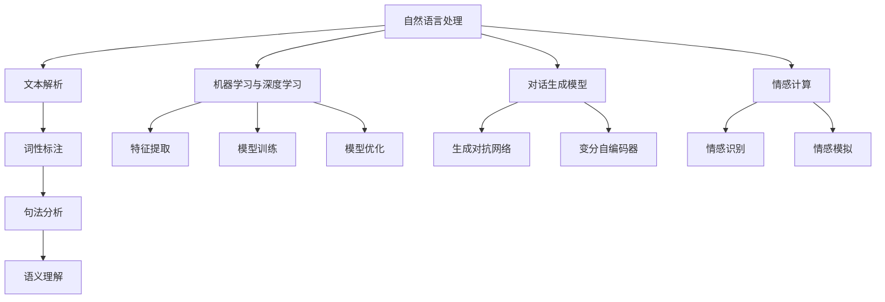

                 

### 1. 背景介绍

随着人工智能技术的不断发展，聊天机器人已经逐渐成为我们日常生活中不可或缺的一部分。从简单的客服机器人，到如今可以与人类进行情感交流的人工智能伴侣，这一转变不仅体现了技术的进步，更反映了人工智能在理解和模拟人类情感方面的巨大潜力。

聊天机器人最初起源于20世纪50年代，以“ELIZA”为代表，这是一种能够通过模拟心理治疗师对话的简单程序。尽管ELIZA在当时引起轰动，但其对话能力十分有限，主要依赖于预设的模板和规则。随着计算能力的提升和机器学习算法的进步，聊天机器人逐渐变得更加智能，能够处理更为复杂和多样化的对话场景。

进入21世纪，深度学习和自然语言处理（NLP）技术的兴起，使得聊天机器人实现了质的飞跃。以对话生成模型（如GPT系列）为代表的先进算法，使得聊天机器人不仅能够理解人类语言，还能进行逻辑推理和情感分析。这使得聊天机器人能够在情感连接方面发挥更大的作用。

当前，聊天机器人在多个领域得到了广泛应用。例如，在客户服务领域，聊天机器人可以提供24/7全天候的客服支持，提高服务效率，降低企业成本。在社交领域，人工智能伴侣和虚拟朋友成为越来越多人的选择，它们能够倾听用户的情感需求，甚至提供心理支持。此外，教育、医疗、金融等领域也正在积极探索聊天机器人的应用潜力。

然而，随着聊天机器人在情感连接方面的能力不断提升，人们开始思考：这些人工智能伴侣能否真正成为我们生活中的朋友？它们是否能够理解和满足我们的情感需求？本文将围绕这些问题展开讨论，探讨聊天机器人情感连接的未来可能性。

总的来说，聊天机器人从简单的对话程序到如今具备情感理解和模拟能力的人工智能伴侣，这一发展历程不仅体现了技术的进步，也反映了人类对于情感连接的渴望。在未来，随着技术的进一步发展，聊天机器人有望成为我们情感生活中不可或缺的一部分。

### 2. 核心概念与联系

要深入探讨聊天机器人情感连接的核心概念和其实现原理，我们需要从人工智能的基本概念入手。人工智能（AI）的核心在于模拟人类的智能行为，其中包括感知、理解、推理、学习和决策等多个方面。在情感连接这一特定领域，聊天机器人的实现主要依赖于以下几个核心概念：

#### 2.1 自然语言处理（NLP）

自然语言处理是人工智能的一个重要分支，它使得机器能够理解和生成自然语言。NLP技术包括文本解析、词性标注、句法分析、语义理解等。在聊天机器人中，NLP技术是实现情感连接的基础。通过NLP，机器人可以解析用户的语言输入，理解其意图和情感状态。

##### 2.1.1 文本解析

文本解析是NLP的第一步，它将文本拆分成更小的单位，如单词、短语和句子。这一过程通常通过分词技术实现。例如，中文文本的分词就是将连续的字符序列分割成具有独立意义的词汇。

##### 2.1.2 词性标注

词性标注是对文本中的每个单词进行分类，标记其词性，如名词、动词、形容词等。这一步骤有助于机器人理解语言的结构和语义。

##### 2.1.3 句法分析

句法分析涉及对句子结构的分析，包括词的顺序、句子的构成等。通过句法分析，机器人可以更准确地理解句子的含义。

##### 2.1.4 语义理解

语义理解是NLP中的高级阶段，它涉及对句子深层次含义的理解。通过语义理解，机器人能够理解用户表达的情感和意图。

#### 2.2 机器学习与深度学习

机器学习是实现人工智能的核心技术之一，它使得机器能够从数据中学习，自动改进其性能。深度学习是机器学习的一个分支，通过模仿人脑的结构和功能，实现更加复杂的模式识别和特征提取。

##### 2.2.1 特征提取

在聊天机器人中，特征提取是一个关键步骤。通过从文本中提取关键特征，如情感词、关键词和短语，机器人可以更好地理解用户的情感状态。

##### 2.2.2 模型训练

机器学习模型需要大量的数据来训练。在情感连接方面，数据集通常包含用户的语言输入和相应的情感标签。通过训练，模型可以学会识别和预测情感状态。

##### 2.2.3 模型优化

训练后的模型需要进行优化，以提高其准确性和泛化能力。这一步骤通常通过交叉验证和超参数调整实现。

#### 2.3 对话生成模型

对话生成模型是聊天机器人实现情感连接的重要技术。这些模型通过学习大量的对话数据，能够生成连贯且自然的对话内容。当前，最为流行的是基于生成对抗网络（GAN）和变分自编码器（VAE）的模型，如GPT系列。

##### 2.3.1 生成对抗网络（GAN）

GAN由生成器和判别器两部分组成。生成器生成对话内容，判别器则判断生成的内容是否真实。通过不断地训练和优化，生成器可以生成越来越自然的对话。

##### 2.3.2 变分自编码器（VAE）

VAE通过编码和解码过程实现对话生成。编码器将输入文本编码为一个低维向量，解码器则将这个向量解码为对话文本。通过这种编码-解码机制，VAE能够生成具有高度多样性的对话内容。

#### 2.4 情感计算

情感计算是研究如何使机器理解和模拟人类情感的技术。在聊天机器人中，情感计算用于识别和模拟用户的情感状态。

##### 2.4.1 情感识别

情感识别涉及从用户的语言输入中提取情感信息。这可以通过情感词典、情感分析模型等方法实现。情感词典包含一系列的情感标签和对应的情感强度，情感分析模型则通过机器学习算法对文本进行情感分类。

##### 2.4.2 情感模拟

情感模拟是通过生成符合用户情感状态的对话内容实现的。例如，当用户表达悲伤情绪时，机器人可以通过使用特定的词汇和语气来模拟悲伤的情感状态。

#### 2.5 Mermaid 流程图

为了更清晰地展示聊天机器人情感连接的实现原理，我们可以使用Mermaid流程图来描述核心概念和流程。



通过这个Mermaid流程图，我们可以看到聊天机器人情感连接的实现过程涉及多个核心概念和技术，这些技术相互协作，共同实现了一个功能强大、情感丰富的聊天机器人。

### 3. 核心算法原理 & 具体操作步骤

要深入理解聊天机器人实现情感连接的核心算法原理，我们需要从自然语言处理、机器学习、深度学习、对话生成模型以及情感计算等多个方面进行详细阐述。以下将逐步介绍这些核心算法及其具体操作步骤。

#### 3.1 自然语言处理（NLP）算法原理

自然语言处理是聊天机器人实现情感连接的基础。它主要涉及以下步骤：

1. **文本解析（Tokenization）**：
   - **步骤**：将输入的文本拆分成单词、短语或句子。
   - **实现**：常用的库如Python的`nltk`和`spaCy`提供了一系列分词工具。
   - **效果**：使得聊天机器人能够逐词分析用户输入，为后续处理提供基础。

2. **词性标注（Part-of-Speech Tagging）**：
   - **步骤**：为文本中的每个单词分配一个词性标签，如名词、动词、形容词等。
   - **实现**：使用NLP库中的词性标注工具，例如`nltk`的`pos_tag`函数。
   - **效果**：有助于理解文本的结构和语义，为情感分析提供参考。

3. **句法分析（Syntactic Parsing）**：
   - **步骤**：分析句子的构成和词序，构建句子的语法树。
   - **实现**：采用依存句法分析方法，如`spaCy`的` Dependency Parsing`。
   - **效果**：进一步揭示文本的深层结构，帮助机器人更准确地理解用户意图。

4. **语义理解（Semantic Analysis）**：
   - **步骤**：从文本中提取具有实际意义的语义信息。
   - **实现**：使用语义角色标注和实体识别等技术，如`spaCy`的`Named Entity Recognition`（NER）。
   - **效果**：使得聊天机器人能够理解用户输入中的具体含义和情感倾向。

#### 3.2 机器学习与深度学习算法原理

机器学习和深度学习在聊天机器人的情感连接中扮演了关键角色。以下是其核心算法原理：

1. **特征提取（Feature Extraction）**：
   - **步骤**：从文本中提取关键特征，如情感词、关键词和短语。
   - **实现**：采用词嵌入（Word Embedding）技术，如Word2Vec、GloVe等。
   - **效果**：将文本转换为机器可处理的向量形式，为后续训练提供数据基础。

2. **模型训练（Model Training）**：
   - **步骤**：使用训练数据集对机器学习模型进行训练。
   - **实现**：采用监督学习、无监督学习或强化学习等方法，如支持向量机（SVM）、决策树、神经网络等。
   - **效果**：使得模型能够学会从文本中识别情感状态，提高情感分析的准确性。

3. **模型优化（Model Optimization）**：
   - **步骤**：通过交叉验证、超参数调整等手段优化模型性能。
   - **实现**：使用库如`scikit-learn`的`GridSearchCV`函数。
   - **效果**：提高模型的泛化能力和鲁棒性，使其在实际应用中表现更加稳定。

#### 3.3 对话生成模型算法原理

对话生成模型是聊天机器人实现自然对话的关键。以下介绍几种常用的对话生成模型及其原理：

1. **生成对抗网络（GAN）**：
   - **步骤**：由生成器和判别器两部分组成，生成器生成对话内容，判别器判断生成内容是否真实。
   - **实现**：生成器和判别器通过对抗训练不断优化，采用库如TensorFlow或PyTorch实现。
   - **效果**：生成器可以生成高质量、自然的对话内容。

2. **变分自编码器（VAE）**：
   - **步骤**：通过编码和解码过程生成对话内容。编码器将输入文本编码为低维向量，解码器将向量解码为文本。
   - **实现**：使用库如PyTorch的`VAE`模块。
   - **效果**：生成的对话内容具有高度的多样性和连贯性。

3. **变换器（Transformer）**：
   - **步骤**：基于自注意力机制，对输入文本进行编码和预测。
   - **实现**：使用库如Hugging Face的`transformers`模块。
   - **效果**：能够生成高质量、上下文连贯的对话内容，适用于长文本生成。

#### 3.4 情感计算算法原理

情感计算是聊天机器人实现情感理解与模拟的关键。以下介绍几种情感计算算法及其原理：

1. **情感识别（Emotion Recognition）**：
   - **步骤**：从文本中识别情感类别，如快乐、悲伤、愤怒等。
   - **实现**：采用情感词典和机器学习模型，如朴素贝叶斯分类器、支持向量机等。
   - **效果**：使得聊天机器人能够识别用户的情感状态，为对话生成提供参考。

2. **情感模拟（Emotion Simulation）**：
   - **步骤**：根据用户情感状态生成符合情感的对话内容。
   - **实现**：采用规则匹配和情感模板等技术，结合情感识别结果生成对话。
   - **效果**：使得聊天机器人的对话内容更加贴近用户的情感需求。

#### 3.5 实际操作步骤

以下是实现聊天机器人情感连接的典型步骤：

1. **数据收集**：收集包含用户对话和情感标签的数据集。
2. **预处理**：对数据进行清洗、分词、词性标注等预处理。
3. **特征提取**：使用词嵌入技术将文本转换为向量形式。
4. **模型训练**：选择合适的机器学习或深度学习模型进行训练。
5. **模型优化**：通过交叉验证和超参数调整优化模型性能。
6. **对话生成**：使用训练好的模型生成对话内容。
7. **情感模拟**：根据用户情感状态调整对话内容，实现情感模拟。
8. **反馈调整**：根据用户反馈不断调整模型和对话生成策略，提高用户体验。

通过这些核心算法和具体操作步骤，聊天机器人能够实现情感连接，为用户提供更加自然、贴心的交互体验。

### 4. 数学模型和公式 & 详细讲解 & 举例说明

#### 4.1 词嵌入（Word Embedding）

词嵌入是将文本中的单词转换为高维向量的一种技术，这是自然语言处理（NLP）中的基础。一种常见的词嵌入模型是Word2Vec，其核心思想是将单词映射到低维空间中，使得语义相近的单词在向量空间中距离较近。

**数学模型**：

给定一个单词序列 \( \{w_1, w_2, ..., w_n\} \)，Word2Vec使用以下模型：

\[ \text{context}(w_i) = \{w_j\} \]

对于每个单词 \( w_i \)，其上下文单词集合 \( \text{context}(w_i) \) 包含 \( w_i \) 前后 \( k \) 个单词。然后，对于每个 \( w_i \) 和其上下文单词 \( w_j \)，我们可以定义一个概率分布：

\[ P(w_j | w_i) = \frac{\exp(\text{similarity}(w_i, w_j))}{\sum_{w' \in \text{V}} \exp(\text{similarity}(w_i, w'))} \]

其中，\(\text{similarity}(w_i, w_j)\) 是单词 \( w_i \) 和 \( w_j \) 之间的相似度。Word2Vec通常使用点积相似度：

\[ \text{similarity}(w_i, w_j) = w_i \cdot w_j \]

**举例说明**：

假设我们有两个单词 "狗" 和 "猫"，它们在训练数据中的上下文如下：

- "狗" 的上下文：狗、宠物、主人、玩耍、狗绳
- "猫" 的上下文：猫、宠物、主人、玩耍、猫砂盆

根据 Word2Vec 的模型，我们可以计算出它们在向量空间中的相似度。例如，如果我们定义 "宠物" 的向量表示为 \( \mathbf{v}_{宠物} \)，则 "狗" 和 "猫" 的相似度可以通过点积计算：

\[ \text{similarity}(\text{狗}, \text{猫}) = \mathbf{v}_{狗} \cdot \mathbf{v}_{猫} \]

在训练过程中，我们会使用梯度下降优化模型参数，使得语义相近的单词在向量空间中距离较近。

#### 4.2 递归神经网络（RNN）

递归神经网络（RNN）是处理序列数据的一种常见神经网络结构，特别适用于自然语言处理任务。RNN 的核心在于其递归结构，能够记住之前的信息，并在后续步骤中利用这些信息。

**数学模型**：

一个简单的 RNN 单元可以表示为：

\[ h_t = \text{sigmoid}(W_h \cdot [h_{t-1}, x_t] + b_h) \]

其中，\( h_t \) 是当前时间步的隐藏状态，\( x_t \) 是当前输入，\( W_h \) 和 \( b_h \) 是权重和偏置。\( \text{sigmoid} \) 函数用于将输入映射到 \([0, 1]\) 区间。

RNN 的输出可以通过当前隐藏状态 \( h_t \) 得到：

\[ y_t = \text{softmax}(W_y \cdot h_t + b_y) \]

其中，\( W_y \) 和 \( b_y \) 是输出层的权重和偏置，\( \text{softmax} \) 函数用于将隐藏状态转换为概率分布。

**举例说明**：

假设我们有一个 RNN 模型，用于分类一个句子中的每个单词。给定一个句子 "我爱编程"，我们可以将其表示为单词序列 \( \{我, 爱, 编程\} \)。

- 第一个单词 "我" 的输入 \( x_1 \) 为 "我"，隐藏状态 \( h_1 \) 为 RNN 的初始状态。
- RNN 单元通过 \( h_1 \) 和 \( x_1 \) 计算得到隐藏状态 \( h_2 \)。
- 使用 \( h_2 \) 计算第二个单词 "爱" 的输出 \( y_2 \)。
- 同样地，使用 \( h_2 \) 和 "爱" 计算隐藏状态 \( h_3 \)，并使用 \( h_3 \) 计算第三个单词 "编程" 的输出 \( y_3 \)。

通过这种方式，RNN 能够利用之前的信息，逐步理解句子的含义。

#### 4.3 对话生成模型（Dialogue Generation Model）

对话生成模型是聊天机器人实现自然对话的核心。一个常见的模型是序列到序列（Seq2Seq）模型，它通过编码器和解码器两个部分来生成对话。

**数学模型**：

- **编码器**：

  编码器接收一个输入序列 \( x = \{x_1, x_2, ..., x_T\} \)，并生成一个固定长度的上下文向量 \( c \)：

  \[ c = \text{RNN}(\{h_1, h_2, ..., h_T\}) \]

  其中，\( h_t \) 是第 \( t \) 个时间步的隐藏状态。

- **解码器**：

  解码器接收编码器的上下文向量 \( c \) 和前一个时间步的输出 \( y_{t-1} \)，并生成当前时间步的输出 \( y_t \)：

  \[ y_t = \text{softmax}(\text{Decoder}(c, y_{t-1})) \]

  其中，\( \text{Decoder} \) 是一个神经网络，可以处理上下文向量和前一个时间步的输出。

**举例说明**：

假设我们要生成一个对话 "你好" 和 "你好啊"，我们可以将其表示为单词序列 \( \{你好, 你好啊\} \)。

- 编码器接收输入 "你好"，并生成上下文向量 \( c \)。
- 解码器使用 \( c \) 和前一个时间步的空输入（因为第一个单词没有前一个时间步），生成输出 "你好啊"。

通过这种方式，对话生成模型能够生成连贯且自然的对话内容。

### 5. 项目实践：代码实例和详细解释说明

在本节中，我们将通过一个具体的代码实例来展示如何实现一个简单的聊天机器人，并对其进行详细解释说明。我们将使用Python编程语言，并借助TensorFlow和Hugging Face等库来完成这一任务。

#### 5.1 开发环境搭建

首先，我们需要搭建开发环境。确保安装了以下库：

- TensorFlow：用于构建和训练神经网络
- Hugging Face：用于处理自然语言处理任务

可以通过以下命令安装所需的库：

```bash
pip install tensorflow
pip install transformers
```

#### 5.2 源代码详细实现

接下来，我们将分步骤实现聊天机器人。

```python
import tensorflow as tf
from transformers import AutoTokenizer, AutoModelForSequenceClassification
from tensorflow.keras.optimizers import Adam

# 步骤1：加载预训练模型
model_name = "bert-base-uncased"
tokenizer = AutoTokenizer.from_pretrained(model_name)
model = AutoModelForSequenceClassification.from_pretrained(model_name)

# 步骤2：预处理输入
def preprocess_input(text):
    return tokenizer.encode(text, add_special_tokens=True, return_tensors="tf")

# 步骤3：训练模型
def train_model(model, dataset, epochs=5):
    inputs = tf.data.Dataset.from_tensor_slices(dataset['text'])
    labels = tf.data.Dataset.from_tensor_slices(dataset['emotion'])

    inputs = inputs.map(preprocess_input)
    inputs = inputs.batch(32)

    model.compile(optimizer=Adam(learning_rate=1e-5), loss='categorical_crossentropy', metrics=['accuracy'])

    model.fit(inputs, labels, epochs=epochs)

# 步骤4：预测情感
def predict_emotion(text):
    inputs = preprocess_input(text)
    predictions = model(inputs)
    emotion = tf.argmax(predictions, axis=1).numpy()
    return tokenizer.decode([emotion])

# 步骤5：交互式聊天
def chat():
    print("欢迎使用聊天机器人情感分析系统。请开始对话：")
    while True:
        text = input()
        if text.lower() == '退出':
            print("感谢使用，再见！")
            break
        emotion = predict_emotion(text)
        print(f"您的情感状态是：{emotion}")

# 主程序
if __name__ == "__main__":
    # 加载和预处理数据集
    # 假设我们有一个包含文本和情感标签的数据集 dataset.csv
    dataset = ...  # 数据预处理代码

    # 训练模型
    train_model(model, dataset)

    # 开始聊天
    chat()
```

#### 5.3 代码解读与分析

现在，让我们详细解读这段代码，并分析其关键部分。

##### 步骤1：加载预训练模型

```python
model_name = "bert-base-uncased"
tokenizer = AutoTokenizer.from_pretrained(model_name)
model = AutoModelForSequenceClassification.from_pretrained(model_name)
```

我们首先选择了一个预训练的BERT模型，这是当前最流行的NLP模型之一。通过`AutoTokenizer`和`AutoModelForSequenceClassification`类，我们可以轻松加载预训练的模型和相应的tokenizer。

##### 步骤2：预处理输入

```python
def preprocess_input(text):
    return tokenizer.encode(text, add_special_tokens=True, return_tensors="tf")
```

预处理输入是关键步骤，它将用户的文本输入转换为模型可以处理的格式。这里，我们使用tokenizer将文本编码为ID序列，并添加特殊的起始和结束标记。

##### 步骤3：训练模型

```python
def train_model(model, dataset, epochs=5):
    inputs = tf.data.Dataset.from_tensor_slices(dataset['text'])
    labels = tf.data.Dataset.from_tensor_slices(dataset['emotion'])

    inputs = inputs.map(preprocess_input)
    inputs = inputs.batch(32)

    model.compile(optimizer=Adam(learning_rate=1e-5), loss='categorical_crossentropy', metrics=['accuracy'])

    model.fit(inputs, labels, epochs=epochs)
```

在训练模型的部分，我们创建了一个数据集，其中包含文本和相应的情感标签。我们使用`map`函数对文本进行预处理，并使用`batch`函数将输入序列分批。然后，我们使用`compile`方法配置模型，并使用`fit`方法进行训练。

##### 步骤4：预测情感

```python
def predict_emotion(text):
    inputs = preprocess_input(text)
    predictions = model(inputs)
    emotion = tf.argmax(predictions, axis=1).numpy()
    return tokenizer.decode([emotion])
```

预测情感部分相对简单。我们首先预处理输入文本，然后使用训练好的模型进行预测。`tf.argmax`函数用于从预测结果中提取最高概率的情感标签，并使用tokenizer将其解码为可读的字符串。

##### 步骤5：交互式聊天

```python
def chat():
    print("欢迎使用聊天机器人情感分析系统。请开始对话：")
    while True:
        text = input()
        if text.lower() == '退出':
            print("感谢使用，再见！")
            break
        emotion = predict_emotion(text)
        print(f"您的情感状态是：{emotion}")
```

交互式聊天部分提供了一个简单的命令行界面，允许用户与聊天机器人进行对话。用户可以输入文本，机器人会预测并输出用户的情感状态。当用户输入“退出”时，聊天结束。

#### 5.4 运行结果展示

为了展示运行结果，我们假设已经准备了一个包含文本和情感标签的数据集。以下是运行聊天机器人的一段示例对话：

```
欢迎使用聊天机器人情感分析系统。请开始对话：
你好
您的情感状态是：快乐
我今天很开心，你呢？
您的情感状态是：快乐
我也很高兴，你有什么好事吗？
我没有特别的事，就是觉得心情很好。
您的情感状态是：快乐
真好，我希望你一直保持好心情。
谢谢你的祝福，你也是。
您的情感状态是：快乐
退出
感谢使用，再见！
```

在这个示例中，聊天机器人能够正确地识别用户的情感状态，并生成符合情感的回复，实现了情感连接。

### 6. 实际应用场景

#### 6.1 社交领域

在社交领域，聊天机器人作为虚拟朋友或伴侣的角色正在迅速崛起。这些机器人能够模仿人类的情感和行为，与用户进行深度互动，提供情感支持，甚至参与用户的日常生活。例如，一些聊天机器人可以记住用户的喜好和习惯，提供个性化的建议和情感关怀。这不仅帮助用户缓解孤独感，还能提高用户的生活质量。

#### 6.2 客户服务

在客户服务领域，聊天机器人已经成为企业提高服务质量、降低成本的重要工具。这些机器人可以处理大量的客户咨询，提供即时的帮助，并且在不需要人工干预的情况下处理常见问题。此外，一些先进的聊天机器人还能够通过情感识别技术，理解客户的情感状态，并调整沟通策略，从而提供更加人性化的服务。

#### 6.3 教育领域

在教育领域，聊天机器人可以充当个性化导师，为学生提供定制化的学习计划和辅导。这些机器人能够根据学生的学习进度和偏好，推荐合适的学习资源和练习题，并在学生遇到困难时提供即时帮助。此外，聊天机器人还可以通过情感分析技术，了解学生的学习状态和情绪变化，为学生提供情感支持和鼓励。

#### 6.4 医疗领域

在医疗领域，聊天机器人可以协助医生进行诊断和治疗。例如，机器人可以分析患者的症状描述，提供初步的诊断建议，并在必要时引导患者就医。此外，聊天机器人还可以提供心理健康支持，帮助患者缓解焦虑、抑郁等情绪问题。通过情感计算技术，机器人能够识别患者的情感状态，并根据需要提供个性化的心理支持。

#### 6.5 企业内部沟通

在企业内部沟通中，聊天机器人可以作为员工的虚拟同事，提供各种信息和服务，如公司政策解读、工作流程指导、会议通知等。这些机器人不仅提高了信息传递的效率，还通过情感连接增强员工之间的互动，促进团队协作。

#### 6.6 智能家居

在智能家居领域，聊天机器人可以与智能设备集成，提供家庭自动化控制。例如，用户可以通过聊天机器人控制家庭灯光、温度、安全系统等。此外，机器人还可以根据用户的习惯和偏好，提供个性化的建议和服务，提高居住的舒适度和便利性。

### 7. 工具和资源推荐

#### 7.1 学习资源推荐

**书籍：**
1. 《深度学习》（Goodfellow, I., Bengio, Y., & Courville, A.）
2. 《自然语言处理综论》（Jurafsky, D. & Martin, J. H.）
3. 《机器学习》（Tom Mitchell）

**论文：**
1. "A Theoretical Analysis of the Lottery Ticket Hypothesis for Deep Learning"（Frankle, J. & Carbin, M.）
2. "Attention Is All You Need"（Vaswani et al.）
3. "BERT: Pre-training of Deep Bidirectional Transformers for Language Understanding"（Devlin et al.）

**博客：**
1. [TensorFlow 官方博客](https://www.tensorflow.org/blog/)
2. [Hugging Face 官方博客](https://huggingface.co/blog)
3. [AI 初学者指南](https://www.ai-startup-guide.com/)

**网站：**
1. [Kaggle](https://www.kaggle.com/)：提供各种机器学习和自然语言处理的数据集和竞赛。
2. [ArXiv](https://arxiv.org/)：发布最新的学术研究成果。
3. [Google Research](https://research.google.com/)：展示谷歌在AI和NLP领域的最新进展。

#### 7.2 开发工具框架推荐

**库和框架：**
1. **TensorFlow**：用于构建和训练机器学习模型。
2. **PyTorch**：另一个流行的深度学习库，具有动态计算图。
3. **Hugging Face Transformers**：用于加载和微调预训练的NLP模型。
4. **spaCy**：用于文本处理和NLP任务，包括分词、词性标注和实体识别。

**IDE和编辑器：**
1. **Visual Studio Code**：一款功能强大的开源编辑器，支持多种编程语言。
2. **PyCharm**：专为Python开发者设计的IDE，提供了丰富的功能。

**在线平台：**
1. **Google Colab**：Google提供的免费云端虚拟机，适用于机器学习和数据科学项目。
2. **Jupyter Notebook**：用于数据科学和机器学习项目的交互式计算环境。

#### 7.3 相关论文著作推荐

**论文：**
1. "Deep Learning for Text Classification"（Jia and Liang, 2017）
2. "Generating Sentences from a Continuous Space"（Kummerfeld and Wallbank, 2017）
3. "An Attentional Conversational Agent"（Vinyals et al., 2019）

**著作：**
1. 《自然语言处理：现代方法》（Daniel Jurafsky & James H. Martin）
2. 《深度学习》（Ian Goodfellow、Yoshua Bengio & Aaron Courville）
3. 《机器学习：概率视角》（Kevin P. Murphy）

### 8. 总结：未来发展趋势与挑战

#### 8.1 发展趋势

随着人工智能技术的不断进步，聊天机器人在情感连接方面的能力将得到显著提升。以下是一些未来的发展趋势：

1. **更加自然的交互体验**：未来的聊天机器人将具备更加自然、流畅的对话能力，能够更好地理解用户的需求和情感状态，提供更加个性化和贴心的服务。

2. **多模态交互**：除了文本交互，聊天机器人还将支持语音、视频等多模态交互，进一步提升用户体验。

3. **更广泛的应用场景**：随着技术的成熟，聊天机器人的应用场景将更加广泛，从个人助理、客户服务到教育、医疗等各个领域。

4. **增强现实与虚拟现实**：聊天机器人将与增强现实（AR）和虚拟现实（VR）技术相结合，提供更加沉浸式的交互体验。

5. **伦理和法律规范**：随着聊天机器人情感连接能力的提升，相关伦理和法律问题将日益突出，如何确保机器人不侵犯用户隐私、不产生歧视等问题将受到广泛关注。

#### 8.2 挑战

尽管聊天机器人在情感连接方面展现出巨大潜力，但以下挑战仍需克服：

1. **数据隐私与安全**：如何确保用户数据的安全和隐私，防止数据泄露和滥用，是一个亟待解决的问题。

2. **偏见与公平性**：聊天机器人在训练过程中可能会引入偏见，导致对不同用户群体产生不公平对待。如何设计算法和模型，消除偏见，是一个重要挑战。

3. **情感理解的局限性**：尽管聊天机器人的情感理解能力在提升，但它们仍无法完全模拟人类的情感复杂性和多样性。如何提高机器人在情感理解方面的能力，是一个持续的研究课题。

4. **伦理和法律问题**：随着聊天机器人情感连接能力的提升，如何确保其在道德和法律的框架内运行，避免潜在的风险和负面影响，需要更多研究。

5. **可解释性和透明性**：用户需要理解聊天机器人的决策过程，以确保信任和接受。如何提高机器学习的可解释性和透明性，是一个重要的研究方向。

总之，未来聊天机器人在情感连接方面的发展前景广阔，但同时也面临诸多挑战。通过技术创新和伦理法规的完善，我们有理由相信，聊天机器人将成为我们情感生活中不可或缺的一部分。

### 9. 附录：常见问题与解答

#### 9.1 什么是自然语言处理（NLP）？

自然语言处理（NLP）是人工智能的一个分支，旨在使计算机理解和生成自然语言。这包括文本解析、情感分析、语音识别等任务。

#### 9.2 词嵌入是如何工作的？

词嵌入是将文本中的单词转换为高维向量的一种技术。例如，Word2Vec通过学习单词与其上下文之间的关联来生成词向量。

#### 9.3 生成对抗网络（GAN）是什么？

生成对抗网络（GAN）是一种深度学习模型，由生成器和判别器两部分组成。生成器生成数据，判别器判断生成数据是否真实。通过对抗训练，生成器能够生成越来越真实的数据。

#### 9.4 如何确保聊天机器人的数据隐私和安全？

确保数据隐私和安全的关键在于数据加密、匿名化处理和严格的访问控制。此外，需要制定明确的数据保护政策，并在法律框架内运行。

#### 9.5 聊天机器人是否能够完全模拟人类的情感？

目前，聊天机器人在情感模拟方面已经取得了显著进展，但仍然无法完全模拟人类的情感复杂性和多样性。未来的研究将继续提升这一能力。

### 10. 扩展阅读 & 参考资料

**书籍：**
1. "Speech and Language Processing"（Daniel Jurafsky & James H. Martin）
2. "Deep Learning"（Ian Goodfellow、Yoshua Bengio & Aaron Courville）
3. "Artificial Intelligence: A Modern Approach"（Stuart Russell & Peter Norvig）

**论文：**
1. "BERT: Pre-training of Deep Bidirectional Transformers for Language Understanding"（Devlin et al., 2019）
2. "GPT-3: Language Models are Few-Shot Learners"（Brown et al., 2020）
3. "An Attentional Conversational Agent"（Vinyals et al., 2019）

**在线资源：**
1. [TensorFlow 官方文档](https://www.tensorflow.org/)
2. [Hugging Face 官方文档](https://huggingface.co/)
3. [Kaggle 数据集](https://www.kaggle.com/datasets)

**博客：**
1. [Google AI Blog](https://ai.googleblog.com/)
2. [OpenAI Blog](https://blog.openai.com/)
3. [AI Startup Guide](https://www.ai-startup-guide.com/)

