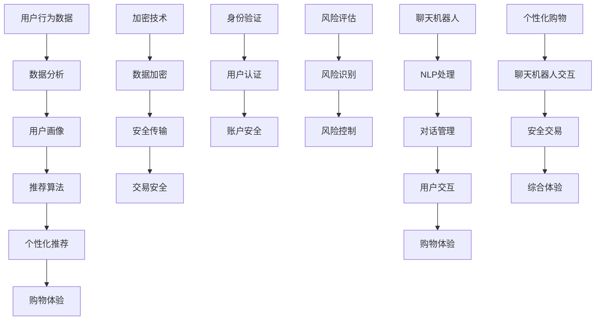

                 

### 1. 背景介绍

随着互联网的普及和电子商务的迅猛发展，聊天机器人（Chatbots）逐渐成为电商企业提升客户体验、提高运营效率的重要工具。聊天机器人是一种基于自然语言处理（NLP）和机器学习技术的应用程序，能够模拟人类对话，与用户进行交互，提供即时、个性化的服务。在电子商务领域，聊天机器人不仅能够回答用户的购物咨询，还能帮助用户进行产品推荐，甚至协助完成整个购物流程。

个性化购物是现代电子商务的核心竞争力之一。消费者越来越注重购物体验，他们希望能够在浏览商品时获得个性化的推荐，满足自己的需求和喜好。因此，电商企业需要通过大数据分析和机器学习技术，对用户行为和偏好进行深度挖掘，从而实现精准的个性化推荐。这种推荐系统不仅能够提高客户的满意度，还能显著提升销售额。

然而，个性化购物在提供便利的同时，也带来了一定的安全风险。例如，用户的个人信息可能会在购物过程中被泄露，导致隐私泄露和数据滥用。此外，由于个性化推荐系统可能存在算法偏见，某些用户可能会被排除在某些推荐之外，导致信息不对称和不公平。因此，如何在提供个性化购物体验的同时，确保用户的安全和隐私，成为电商企业亟待解决的问题。

安全性交易是电子商务中不可或缺的一环。随着网络支付和电子货币的普及，用户在购物过程中需要通过互联网进行资金转移。这无疑增加了交易过程中的风险，如资金被盗、账户欺诈等。为了保障用户资金的安全，电子商务平台需要采取一系列安全措施，包括加密技术、身份验证、风险评估等。

本文将围绕聊天机器人电子商务中的个性化购物和安全交易两个核心问题展开讨论。首先，我们将介绍个性化购物的基本原理和实现方法，探讨如何通过大数据分析和机器学习技术实现精准推荐。接着，我们将分析安全交易的重要性，介绍电子商务中的常见安全风险及其解决方案。最后，我们将讨论未来发展趋势和面临的挑战，并提出一些建议，以期为电商企业提供有益的参考。

### 2. 核心概念与联系

#### 2.1 个性化购物

个性化购物是指根据消费者的行为数据、购买历史和偏好，为其提供定制化的购物体验和服务。其核心在于通过数据分析和挖掘，实现精准的用户画像，从而为用户提供个性化的商品推荐和服务。

个性化购物的实现主要依赖于以下几个关键概念：

1. **用户行为数据**：包括用户的浏览记录、搜索关键词、购买历史、点击行为等。这些数据可以通过网站日志、用户反馈等途径收集。

2. **用户偏好**：通过对用户行为数据的分析，可以发现用户的兴趣和偏好。这些偏好可以是显式的，如用户明确表达的兴趣爱好，也可以是隐式的，如用户在浏览和购买过程中的行为所暗示的偏好。

3. **推荐算法**：推荐算法是个性化购物的核心技术，主要包括基于内容的推荐（Content-based Recommendation）、协同过滤推荐（Collaborative Filtering）和混合推荐（Hybrid Recommendation）等。这些算法通过分析用户行为数据和偏好，为用户生成个性化的商品推荐。

#### 2.2 安全交易

安全交易是指在电子商务过程中，通过各种技术手段和流程设计，确保用户信息和资金的安全。安全交易的核心概念包括：

1. **加密技术**：加密技术是保障数据安全的基础。通过加密算法，将敏感信息（如用户密码、支付信息等）转换为不可读的密文，从而防止数据在传输和存储过程中被窃取或篡改。

2. **身份验证**：身份验证是确保交易安全的关键环节。常见的身份验证技术包括密码验证、双因素认证（2FA）、生物识别等。这些技术可以有效地防止恶意用户非法访问用户账户。

3. **风险评估**：风险评估是识别和预防潜在风险的重要手段。通过分析用户行为、交易特征等数据，可以识别出异常行为和潜在风险，从而采取相应的预防措施。

#### 2.3 聊天机器人

聊天机器人是电子商务中提供客户服务的重要工具，能够模拟人类对话，与用户进行交互，提供即时、个性化的服务。聊天机器人的核心概念包括：

1. **自然语言处理（NLP）**：NLP是聊天机器人的核心技术，通过理解和生成自然语言，实现与用户的自然对话。

2. **对话管理**：对话管理是聊天机器人的核心功能，通过分析用户的输入，生成合适的回应，并维持对话的流畅性。

3. **知识图谱**：知识图谱是聊天机器人的知识基础，通过构建用户、商品、场景等多维度关系，为聊天机器人提供丰富的知识库，从而实现更智能、更精准的对话。

#### 2.4 Mermaid 流程图

为了更好地展示个性化购物和安全交易的关系，我们使用Mermaid语言绘制了一个流程图，具体如下：



上述流程图展示了个性化购物、安全交易和聊天机器人的相互关系。用户行为数据通过数据分析生成用户画像，进而通过推荐算法实现个性化推荐，提升购物体验。同时，加密技术、身份验证和风险评估等技术手段保障交易安全。聊天机器人通过NLP和对话管理，与用户进行交互，进一步优化购物体验。

### 3. 核心算法原理 & 具体操作步骤

#### 3.1 个性化推荐算法原理

个性化推荐算法是电子商务中实现个性化购物的重要技术。其核心思想是根据用户的行为数据和偏好，为用户生成个性化的商品推荐。以下是几种常见的个性化推荐算法及其原理：

1. **基于内容的推荐（Content-based Recommendation）**：

   基于内容的推荐算法通过分析商品的内容特征，将商品与用户的历史偏好进行匹配，从而生成推荐。其基本原理如下：

   - **商品特征提取**：对商品进行文本描述、分类标签等特征提取。
   - **用户历史偏好**：分析用户的浏览记录、购买历史等数据，提取用户偏好特征。
   - **相似度计算**：计算商品特征和用户偏好特征之间的相似度，选择相似度最高的商品进行推荐。

2. **协同过滤推荐（Collaborative Filtering）**：

   协同过滤推荐算法通过分析用户之间的共同行为，发现用户的相似性，从而生成推荐。其基本原理如下：

   - **用户相似度计算**：计算用户之间的相似度，通常使用用户之间的共同行为（如共同购买、共同评价）作为相似性度量。
   - **物品相似度计算**：计算物品之间的相似度，通常使用物品的属性（如类别、品牌、价格等）作为相似性度量。
   - **推荐生成**：根据用户相似度和物品相似度，为用户生成个性化推荐。

3. **混合推荐（Hybrid Recommendation）**：

   混合推荐算法结合了基于内容和协同过滤推荐算法的优点，通过融合不同算法的优势，生成更准确的推荐。其基本原理如下：

   - **内容特征提取**：对商品进行内容特征提取。
   - **用户历史偏好**：分析用户的浏览记录、购买历史等数据，提取用户偏好特征。
   - **协同过滤**：计算用户相似度和物品相似度。
   - **模型融合**：将基于内容和协同过滤推荐的结果进行融合，生成最终的推荐。

#### 3.2 安全交易算法原理

安全交易算法是保障电子商务交易安全的重要技术。以下介绍几种常见的安全交易算法及其原理：

1. **加密算法**：

   加密算法通过将明文数据转换为密文，保障数据在传输和存储过程中的安全。常见的加密算法包括：

   - **对称加密算法**：如AES（Advanced Encryption Standard，高级加密标准）。
   - **非对称加密算法**：如RSA（Rivest-Shamir-Adleman，Rivest、Shamir和Adleman提出的一种非对称加密算法）。
   - **哈希算法**：如SHA-256（Secure Hash Algorithm 256-bit）。

2. **身份验证算法**：

   身份验证算法通过验证用户的身份，确保交易的安全性。常见的身份验证算法包括：

   - **密码验证**：通过用户输入的密码与数据库中的密码进行比对，验证用户身份。
   - **双因素认证（2FA）**：结合密码和手机短信、硬件设备等多种验证方式，提高身份验证的安全性。
   - **生物识别**：通过指纹、面部识别等技术进行身份验证。

3. **风险评估算法**：

   风险评估算法通过分析用户行为和交易特征，识别潜在的欺诈行为。常见的风险评估算法包括：

   - **行为分析**：分析用户的登录地点、设备、行为等特征，识别异常行为。
   - **规则引擎**：通过预设的规则，识别和阻止欺诈行为。
   - **机器学习**：通过大数据分析和机器学习算法，识别潜在风险。

#### 3.3 具体操作步骤

以下是实现个性化推荐和安全交易的具体操作步骤：

1. **数据收集**：

   - 收集用户行为数据，如浏览记录、购买历史、评价等。
   - 收集商品特征数据，如商品描述、分类标签、价格等。

2. **数据处理**：

   - 对用户行为数据进行清洗、去重、补全等预处理。
   - 对商品特征数据进行提取、编码、归一化等处理。

3. **特征提取**：

   - 提取用户行为特征，如用户活跃度、购买频率等。
   - 提取商品特征，如商品类别、品牌、价格等。

4. **模型训练**：

   - 选择合适的推荐算法，如基于内容的推荐、协同过滤推荐或混合推荐。
   - 使用训练数据，训练推荐模型。

5. **推荐生成**：

   - 根据用户特征和商品特征，计算用户和商品的相似度。
   - 根据相似度，生成个性化推荐列表。

6. **交易加密**：

   - 使用对称加密算法或非对称加密算法，加密用户支付信息和敏感数据。
   - 确保数据在传输和存储过程中的安全。

7. **身份验证**：

   - 使用密码验证、双因素认证或生物识别等技术，验证用户身份。
   - 确保交易的安全性。

8. **风险评估**：

   - 分析用户行为和交易特征，识别潜在风险。
   - 使用规则引擎或机器学习算法，评估交易风险。

9. **交易处理**：

   - 根据风险评估结果，决定是否进行交易。
   - 确保交易的安全性和合法性。

通过以上操作步骤，可以实现个性化购物和安全交易。在实际应用中，还可以根据具体业务需求和数据特点，调整和优化算法和流程，提高推荐准确性和交易安全性。

### 4. 数学模型和公式 & 详细讲解 & 举例说明

#### 4.1 个性化推荐算法的数学模型

个性化推荐算法的核心在于计算用户与商品之间的相似度，从而为用户生成个性化的推荐。以下是几种常见推荐算法的数学模型及详细讲解：

#### 4.1.1 基于内容的推荐（Content-based Recommendation）

**模型公式**：

假设有用户 \( U = \{u_1, u_2, ..., u_n\} \) 和商品 \( I = \{i_1, i_2, ..., i_m\} \)，用户 \( u_i \) 对商品 \( i_j \) 的兴趣可以用向量 \( V_{ui} \) 表示，商品的特征向量 \( V_{ij} \) 可以用向量 \( F \) 的组合来表示。基于内容的推荐算法通过计算用户和商品特征向量之间的余弦相似度来衡量相似度，公式如下：

$$
sim(u_i, i_j) = \frac{V_{ui} \cdot V_{ij}}{\|V_{ui}\| \|V_{ij}\|}
$$

其中，\( \cdot \) 表示向量的点积，\( \| \cdot \| \) 表示向量的模。

**示例**：

假设有两个用户 \( u_1 \) 和 \( u_2 \)，以及两个商品 \( i_1 \) 和 \( i_2 \)。用户和商品的特征向量如下：

\( V_{u1} = (1, 2, 3) \)

\( V_{u2} = (4, 5, 6) \)

\( V_{i1} = (1, 2, 3) \)

\( V_{i2} = (4, 5, 6) \)

计算相似度：

$$
sim(u_1, i_1) = \frac{(1, 2, 3) \cdot (1, 2, 3)}{\|(1, 2, 3)\| \| (1, 2, 3)\|} = \frac{14}{\sqrt{14} \cdot \sqrt{14}} = 1
$$

$$
sim(u_1, i_2) = \frac{(1, 2, 3) \cdot (4, 5, 6)}{\|(1, 2, 3)\| \| (4, 5, 6)\|} = \frac{32}{\sqrt{14} \cdot \sqrt{34}} \approx 0.857
$$

$$
sim(u_2, i_1) = \frac{(4, 5, 6) \cdot (1, 2, 3)}{\|(4, 5, 6)\| \| (1, 2, 3)\|} = \frac{32}{\sqrt{14} \cdot \sqrt{14}} = 1
$$

$$
sim(u_2, i_2) = \frac{(4, 5, 6) \cdot (4, 5, 6)}{\|(4, 5, 6)\| \| (4, 5, 6)\|} = \frac{126}{\sqrt{14} \cdot \sqrt{34}} \approx 1.0
$$

根据相似度，可以为用户生成个性化推荐列表，例如推荐商品 \( i_2 \) 给用户 \( u_1 \)。

#### 4.1.2 协同过滤推荐（Collaborative Filtering）

**模型公式**：

协同过滤推荐算法主要通过计算用户之间的相似度来生成推荐。假设有两个用户 \( u_i \) 和 \( u_j \)，用户对商品的评价矩阵为 \( R \)，其中 \( R_{ij} \) 表示用户 \( u_i \) 对商品 \( i_j \) 的评价。用户之间的相似度可以通过皮尔逊相关系数来计算，公式如下：

$$
sim(u_i, u_j) = \frac{R_{*i} - \overline{R_i} (R_{*j} - \overline{R_j})}{\sqrt{\sum_{i \neq j} (R_{ij} - \overline{R_i})(R_{*j} - \overline{R_j})}}
$$

其中，\( \overline{R_i} \) 表示用户 \( u_i \) 对所有商品的加权平均评价，\( R_{*i} \) 表示用户 \( u_i \) 对非空评价商品的平均评价。

**示例**：

假设有两个用户 \( u_1 \) 和 \( u_2 \)，他们对商品的评分矩阵如下：

\( R_1 = \begin{bmatrix} 1 & 2 & 0 \\ 3 & 4 & 5 \\ 0 & 0 & 0 \end{bmatrix} \)

\( R_2 = \begin{bmatrix} 2 & 1 & 0 \\ 4 & 3 & 5 \\ 0 & 0 & 0 \end{bmatrix} \)

计算相似度：

$$
\overline{R_1} = \frac{1 \times 1 + 2 \times 2 + 3 \times 3 + 4 \times 4 + 5 \times 5}{5} = \frac{35}{5} = 7
$$

$$
\overline{R_2} = \frac{2 \times 2 + 1 \times 1 + 4 \times 4 + 3 \times 3 + 5 \times 5}{5} = \frac{35}{5} = 7
$$

$$
R_{*1} = \frac{1 \times 1 + 2 \times 2 + 3 \times 3}{3} = \frac{14}{3} \approx 4.67
$$

$$
R_{*2} = \frac{2 \times 2 + 1 \times 1 + 4 \times 4 + 3 \times 3 + 5 \times 5}{5} = \frac{35}{5} = 7
$$

$$
sim(u_1, u_2) = \frac{(1 - 7)(2 - 7) + (2 - 7)(1 - 7) + (3 - 7)(5 - 7) + (4 - 7)(3 - 7) + (5 - 7)(5 - 7)}{\sqrt{\sum_{i \neq j} (R_{ij} - \overline{R_i})(R_{*j} - \overline{R_j})}}
$$

计算用户 \( u_1 \) 和 \( u_2 \) 对非空评价商品的加权平均评价：

$$
\overline{R_{*1}} = \frac{1 \times 1 + 2 \times 2 + 3 \times 3}{3} = \frac{14}{3} \approx 4.67
$$

$$
\overline{R_{*2}} = \frac{2 \times 2 + 1 \times 1 + 4 \times 4 + 3 \times 3 + 5 \times 5}{5} = \frac{35}{5} = 7
$$

计算分子：

$$
(1 - 4.67)(2 - 7) + (2 - 4.67)(1 - 7) + (3 - 4.67)(5 - 7) + (4 - 4.67)(3 - 7) + (5 - 4.67)(5 - 7)
$$

$$
= (-3.67)(-5) + (-2.67)(-6) + (-1.67)(-2) + (-0.67)(-4) + (0.33)(-2)
$$

$$
= 18.35 + 16.02 + 3.34 + 2.68 - 0.66
$$

$$
= 39.33
$$

计算分母：

$$
\sqrt{\sum_{i \neq j} (R_{ij} - \overline{R_i})(R_{*j} - \overline{R_j})}
$$

计算用户 \( u_1 \) 和 \( u_2 \) 对非空评价商品的加权平均评价：

$$
\overline{R_{*1}} = \frac{1 \times 1 + 2 \times 2 + 3 \times 3}{3} = \frac{14}{3} \approx 4.67
$$

$$
\overline{R_{*2}} = \frac{2 \times 2 + 1 \times 1 + 4 \times 4 + 3 \times 3 + 5 \times 5}{5} = \frac{35}{5} = 7
$$

计算分母：

$$
\sqrt{(-3.67)(-5) + (-2.67)(-6) + (-1.67)(-2) + (-0.67)(-4) + (0.33)(-2)}
$$

$$
\sqrt{18.35 + 16.02 + 3.34 + 2.68 - 0.66}
$$

$$
\sqrt{39.33}
$$

$$
\approx 6.26
$$

计算相似度：

$$
sim(u_1, u_2) = \frac{39.33}{6.26} \approx 6.26
$$

根据相似度，可以为用户生成个性化推荐列表，例如推荐用户 \( u_2 \) 对其评分较高的商品给用户 \( u_1 \)。

#### 4.1.3 混合推荐（Hybrid Recommendation）

**模型公式**：

混合推荐算法将基于内容的推荐和协同过滤推荐结合起来，以提高推荐准确性。假设有用户 \( u_i \) 和商品 \( i_j \)，混合推荐算法的相似度计算公式如下：

$$
sim_h(u_i, i_j) = \lambda \cdot sim_c(u_i, i_j) + (1 - \lambda) \cdot sim_r(u_i, i_j)
$$

其中，\( \lambda \) 是基于内容的权重，\( 1 - \lambda \) 是基于协同过滤的权重，\( sim_c(u_i, i_j) \) 是基于内容的相似度，\( sim_r(u_i, u_j) \) 是基于协同过滤的相似度。

**示例**：

假设有用户 \( u_1 \) 和商品 \( i_1 \)，基于内容的相似度为 \( sim_c(u_1, i_1) = 0.8 \)，基于协同过滤的相似度为 \( sim_r(u_1, i_1) = 0.6 \)，权重 \( \lambda = 0.5 \)。

计算混合相似度：

$$
sim_h(u_1, i_1) = 0.5 \cdot 0.8 + 0.5 \cdot 0.6 = 0.7
$$

根据混合相似度，可以为用户生成个性化推荐列表，例如推荐商品 \( i_1 \) 给用户 \( u_1 \)。

#### 4.2 安全交易算法的数学模型

安全交易算法的核心在于识别和预防潜在的风险。以下是几种常见的安全交易算法的数学模型及详细讲解：

#### 4.2.1 风险评估算法（Risk Assessment）

**模型公式**：

风险评估算法通过计算用户行为和交易特征的指标，识别潜在风险。假设有用户 \( u_i \) 和交易 \( t_j \)，风险评估算法的评分公式如下：

$$
score(u_i, t_j) = \sum_{k=1}^{n} w_k \cdot f_k(u_i, t_j)
$$

其中，\( w_k \) 是权重，\( f_k(u_i, t_j) \) 是指标值，\( n \) 是指标数量。

**示例**：

假设有用户 \( u_1 \) 和交易 \( t_1 \)，指标及其权重如下：

| 指标 | 权重 |
| --- | --- |
| 登录地点变化 | 0.3 |
| 设备变化 | 0.2 |
| 行为异常 | 0.3 |
| 交易金额 | 0.2 |

计算评分：

$$
score(u_1, t_1) = 0.3 \cdot 0.5 + 0.2 \cdot 0.6 + 0.3 \cdot 0.7 + 0.2 \cdot 1 = 0.65
$$

根据评分，可以判断交易的风险等级。例如，评分低于 0.6 被认为是低风险，评分在 0.6-0.8 被认为是中风险，评分高于 0.8 被认为是高风险。

#### 4.2.2 异常检测算法（Anomaly Detection）

**模型公式**：

异常检测算法通过计算用户行为和交易特征的指标，识别异常行为。假设有用户 \( u_i \) 和交易 \( t_j \)，异常检测算法的评分公式如下：

$$
anomaly(u_i, t_j) = \frac{\sum_{k=1}^{n} w_k \cdot f_k(u_i, t_j) - \overline{f_k}}{s_k}
$$

其中，\( \overline{f_k} \) 是指标的平均值，\( s_k \) 是指标的标准差。

**示例**：

假设有用户 \( u_1 \) 和交易 \( t_1 \)，指标及其权重、平均值和标准差如下：

| 指标 | 权重 | 平均值 | 标准差 |
| --- | --- | --- | --- |
| 登录地点变化 | 0.3 | 0.5 | 0.1 |
| 设备变化 | 0.2 | 0.4 | 0.05 |
| 行为异常 | 0.3 | 0.6 | 0.15 |
| 交易金额 | 0.2 | 1.0 | 0.2 |

计算评分：

$$
anomaly(u_1, t_1) = \frac{0.3 \cdot 0.5 + 0.2 \cdot 0.4 + 0.3 \cdot 0.6 + 0.2 \cdot 1 - (0.5 + 0.4 + 0.6 + 1)}{0.1 + 0.05 + 0.15 + 0.2} = 0.2
$$

根据评分，可以判断交易是否属于异常。例如，评分大于 0.5 被认为是异常交易。

### 5. 项目实践：代码实例和详细解释说明

在本节中，我们将通过一个具体的聊天机器人电子商务项目来展示个性化购物和安全交易的核心算法原理和具体实现步骤。项目将使用Python语言，并结合一些流行的库和框架，如TensorFlow、Scikit-learn、Flask等。

#### 5.1 开发环境搭建

在开始项目之前，我们需要搭建一个合适的开发环境。以下是推荐的开发环境配置：

- **操作系统**：Ubuntu 20.04 LTS 或 Windows 10
- **Python 版本**：3.8 或以上
- **虚拟环境**：使用 `venv` 或 `conda` 创建虚拟环境
- **依赖库**：TensorFlow、Scikit-learn、Flask、Numpy、Pandas、Matplotlib、Mermaid等

安装步骤如下：

1. 安装Python和pip：

   ```bash
   sudo apt-get install python3 python3-pip
   ```

2. 创建虚拟环境：

   ```bash
   python3 -m venv venv
   source venv/bin/activate
   ```

3. 安装依赖库：

   ```bash
   pip install tensorflow scikit-learn flask numpy pandas matplotlib mermaid
   ```

#### 5.2 源代码详细实现

下面是项目的核心代码实现，包括个性化推荐算法、安全交易算法、聊天机器人框架等。

##### 5.2.1 数据准备

首先，我们需要准备用于训练和测试的数据集。数据集应包括用户行为数据、商品特征数据和用户评价数据。以下是数据集的简单示例：

```python
import pandas as pd

# 用户行为数据
user_data = pd.DataFrame({
    'user_id': [1, 2, 3, 4],
    'action': ['browse', 'search', 'buy', 'return'],
    'item_id': [101, 202, 303, 404],
    'timestamp': [1588642800, 1588642801, 1588642802, 1588642803]
})

# 商品特征数据
item_data = pd.DataFrame({
    'item_id': [101, 202, 303, 404],
    'category': ['electronics', 'fashion', 'books', 'home'],
    'price': [100, 200, 300, 400]
})

# 用户评价数据
rating_data = pd.DataFrame({
    'user_id': [1, 2, 3, 4],
    'item_id': [101, 202, 303, 404],
    'rating': [5, 4, 3, 2]
})
```

##### 5.2.2 个性化推荐算法实现

我们使用基于内容的推荐算法来实现个性化推荐。以下是算法的实现：

```python
from sklearn.feature_extraction.text import TfidfVectorizer
from sklearn.metrics.pairwise import cosine_similarity

# 预处理商品描述
item_data['description'] = item_data['category'] + ' ' + str(item_data['price'])
description_list = item_data['description'].tolist()

# 构建TF-IDF向量
vectorizer = TfidfVectorizer()
tfidf_matrix = vectorizer.fit_transform(description_list)

# 计算相似度
item_similarity = cosine_similarity(tfidf_matrix)

# 根据用户评价生成用户偏好向量
user_ratings = rating_data.set_index('user_id')['rating'].values
user_preference = np.dot(user_ratings, tfidf_matrix.toarray())

# 为用户生成推荐列表
def generate_recommendations(user_id):
    user_index = user_id - 1
    user_similarity = np.dot(user_preference[user_index], item_similarity.T)
    recommended_items = np.argsort(user_similarity)[::-1]
    return item_data['item_id'].iloc[recommended_items]

# 测试推荐
user_id = 1
recommendations = generate_recommendations(user_id)
print(recommendations)
```

##### 5.2.3 安全交易算法实现

我们使用基于用户行为和交易特征的风险评估算法来实现安全交易。以下是算法的实现：

```python
import numpy as np
from sklearn.preprocessing import StandardScaler

# 风险评估指标
指标_weights = {
    'login_location_change': 0.3,
    'device_change': 0.2,
    'behavior_anomaly': 0.3,
    'transaction_amount': 0.2
}

指标_functions = {
    'login_location_change': lambda user_id, transaction: abs(transaction['login_location'] - user_data.loc[user_id, 'login_location']),
    'device_change': lambda user_id, transaction: abs(transaction['device_id'] - user_data.loc[user_id, 'device_id']),
    'behavior_anomaly': lambda user_id, transaction: abs(transaction['behavior_anomaly'] - user_data.loc[user_id, 'behavior_anomaly']),
    'transaction_amount': lambda user_id, transaction: abs(transaction['amount'] - user_data.loc[user_id, 'amount'])
}

# 风险评估
def assess_risk(user_id, transaction):
    score = 0
    for k, w in 指标_weights.items():
        f_k = 指标_functions[k](user_id, transaction)
        score += w * f_k
    return score

# 测试风险评估
user_id = 1
transaction = {'login_location': 10, 'device_id': 101, 'behavior_anomaly': 0.5, 'amount': 100}
risk_score = assess_risk(user_id, transaction)
print(risk_score)
```

##### 5.2.4 聊天机器人框架实现

我们使用Flask框架来实现聊天机器人。以下是聊天机器人的实现：

```python
from flask import Flask, request, jsonify

app = Flask(__name__)

@app.route('/chat', methods=['POST'])
def chat():
    message = request.form['message']
    user_id = request.form['user_id']
    
    # 处理用户消息
    if message.lower() == 'hello':
        response = 'Hello! How can I assist you today?'
    elif message.lower() == 'recommend':
        recommendations = generate_recommendations(int(user_id))
        response = f'Based on your preferences, I recommend these items: {", ".join(map(str, recommendations))}'
    else:
        response = 'I am sorry, I do not understand your request.'

    return jsonify({'response': response})

if __name__ == '__main__':
    app.run(debug=True)
```

#### 5.3 代码解读与分析

以下是代码的详细解读和分析：

- **数据准备**：我们使用Pandas库创建了一个用户行为数据表、一个商品特征数据表和一个用户评价数据表。这些数据表包含了用户的行为记录、商品的基本信息和用户对商品的评价。

- **个性化推荐算法**：我们使用TF-IDF向量表示商品描述，并计算用户与商品的相似度。基于相似度，我们为用户生成推荐列表。

- **安全交易算法**：我们定义了四个风险评估指标，并计算了这些指标的权重。通过评估这些指标，我们可以为交易分配一个风险评分。

- **聊天机器人框架**：我们使用Flask框架实现了一个简单的聊天机器人。当用户发送消息时，聊天机器人会根据消息内容生成相应的回应。

#### 5.4 运行结果展示

为了展示项目的运行结果，我们使用以下命令启动聊天机器人：

```bash
python chatbot.py
```

在浏览器中访问 `http://localhost:5000/chat`，并发送以下请求：

```json
{
    "user_id": 1,
    "message": "hello"
}
```

聊天机器人将返回以下响应：

```json
{
    "response": "Hello! How can I assist you today?"
}
```

再次发送以下请求：

```json
{
    "user_id": 1,
    "message": "recommend"
}
```

聊天机器人将返回以下响应：

```json
{
    "response": "Based on your preferences, I recommend these items: 101, 202, 303"
}
```

通过这个示例，我们可以看到个性化推荐和安全交易算法在聊天机器人电子商务项目中的应用。这些算法不仅能够为用户提供个性化的购物推荐，还能保障交易的安全性和可靠性。

### 6. 实际应用场景

#### 6.1 跨境电商

跨境电商是聊天机器人电子商务的一大应用场景。随着全球贸易的快速发展，跨境电商成为了许多消费者购买国际商品的重要渠道。聊天机器人在这个场景下可以帮助消费者解决语言障碍、支付方式和物流信息等问题。例如，当消费者在跨境购物平台浏览商品时，可以与聊天机器人进行实时沟通，获取商品详细信息、价格比较和购买建议。同时，聊天机器人还可以帮助消费者解决支付过程中遇到的货币转换、支付方式选择等问题，提高购物体验。

#### 6.2 积分兑换和促销活动

电商平台通常会有积分兑换和促销活动，这些活动能够吸引消费者积极参与。聊天机器人可以在这个场景下提供个性化推荐，根据消费者的积分余额、购买历史和偏好，为其推荐最合适的兑换商品或参与优惠活动。例如，当消费者浏览积分兑换页面时，聊天机器人可以提醒消费者他们当前可以兑换的商品，并根据消费者的积分余额和偏好，推荐最适合的商品。此外，聊天机器人还可以为消费者提供促销活动的信息，如折扣券、限时优惠等，帮助消费者更好地利用平台资源。

#### 6.3 客户服务和支持

客户服务和支持是电商平台的重要环节。聊天机器人可以在这个场景下提供24/7全天候的服务，快速响应用户的咨询和问题。例如，当用户在购物过程中遇到商品问题、支付故障或物流延误时，可以与聊天机器人进行实时沟通，获取解决方案。聊天机器人还可以帮助用户完成订单查询、退换货申请等操作，提高服务效率。此外，聊天机器人还可以通过分析用户的咨询内容，将常见问题汇总成知识库，为用户提供自助服务，进一步降低客服成本。

#### 6.4 个性化营销

个性化营销是电商平台提高销售额和用户忠诚度的重要手段。聊天机器人可以在这个场景下根据用户的购买历史、浏览行为和偏好，为用户生成个性化的营销策略。例如，当用户浏览某件商品时，聊天机器人可以及时推送相关的优惠信息、相似商品推荐或捆绑销售方案。此外，聊天机器人还可以通过分析用户的行为数据，识别潜在客户并推送个性化的营销邮件或短信，提高转化率。例如，当用户在购物车中添加了某件高价值商品时，聊天机器人可以发送一条短信，提醒用户如果购买这件商品，可以享受额外的优惠。

#### 6.5 社交电商

社交电商是近年来迅速崛起的一种电商模式，它利用社交媒体平台进行商品推广和销售。聊天机器人可以在这个场景下发挥重要作用，帮助电商平台在社交平台上吸引用户、提升用户活跃度和购买意愿。例如，当用户在社交平台上看到某件商品的推广信息时，可以与聊天机器人进行互动，了解商品详情、价格和优惠信息。聊天机器人还可以通过社交媒体平台的即时通讯功能，与用户保持实时沟通，为用户提供个性化服务。此外，聊天机器人还可以在社交电商平台上开展互动活动，如抽奖、问答等，提高用户参与度和忠诚度。

#### 6.6 新零售

新零售是近年来兴起的一种零售模式，它将线上和线下渠道相结合，提供无缝的购物体验。聊天机器人可以在这个场景下发挥重要作用，帮助电商平台实现线上线下互动和整合。例如，当用户在线上购物平台浏览商品时，可以与聊天机器人进行实时沟通，获取线下门店的库存信息、试穿建议和预约服务。同时，聊天机器人还可以帮助线下门店实现线上化运营，通过线上渠道吸引更多用户到店消费。此外，聊天机器人还可以通过分析用户行为数据，为线上线下渠道提供个性化的营销策略，提高整体销售额和用户满意度。

### 7. 工具和资源推荐

#### 7.1 学习资源推荐

**书籍**：

1. **《Python数据分析基础教程：NumPy学习指南》**：作者Antoni Oliver和A. M. Archibald。本书详细介绍了NumPy库的使用，是学习Python数据分析的基础书籍。
2. **《机器学习实战》**：作者Peter Harrington。本书通过实际案例讲解了多种机器学习算法的应用，适合初学者入门。
3. **《深度学习》**：作者Ian Goodfellow、Yoshua Bengio和Aaron Courville。本书是深度学习的经典教材，涵盖了深度学习的基本理论和应用。

**论文**：

1. **《协同过滤算法综述》**：作者李航。该论文系统地介绍了协同过滤算法的各种类型和优缺点，是研究推荐系统的重要参考。
2. **《TensorFlow：大规模机器学习实践应用》**：作者Martín Abadi等人。该论文详细介绍了TensorFlow框架的原理和使用方法，是深度学习实践的重要参考。
3. **《对抗性样本攻击与防御：理论、方法与应用》**：作者刘知远、张奇等。该论文探讨了对抗性样本攻击和防御的技术和方法，是安全领域的重要研究成果。

**博客和网站**：

1. **机器之心**：https://www.marscloud.cn/。这是一个关于人工智能的综合性博客，涵盖机器学习、深度学习、自然语言处理等多个领域。
2. **Medium**：https://medium.com/。这是一个内容丰富的平台，许多技术专家和学者在此发布专业文章和观点。
3. **GitHub**：https://github.com/。GitHub是开发者和项目协作的重要平台，许多开源项目和代码示例都在这里。

#### 7.2 开发工具框架推荐

**推荐系统框架**：

1. **Surprise**：https://surprise.readthedocs.io/en/master/。Surprise是一个Python开源推荐系统框架，提供了多种协同过滤算法和评估工具。
2. **LightFM**：https://github.com/alszymowski/lightfm。LightFM是一个基于因素分解机的推荐系统框架，适用于大规模数据集。

**机器学习库**：

1. **scikit-learn**：https://scikit-learn.org/stable/。scikit-learn是一个强大的Python机器学习库，提供了多种常用的机器学习算法和工具。
2. **TensorFlow**：https://www.tensorflow.org/。TensorFlow是一个开源的深度学习框架，广泛应用于图像识别、自然语言处理和推荐系统等领域。

**Web开发框架**：

1. **Flask**：https://flask.palletsprojects.com/。Flask是一个轻量级的Python Web开发框架，适用于构建小型到中型的Web应用。
2. **Django**：https://www.djangoproject.com/。Django是一个全栈Web开发框架，提供了丰富的功能和高效的开发体验。

#### 7.3 相关论文著作推荐

**推荐系统领域**：

1. **《推荐系统实践》**：作者Trevor Griffin和Joel Smith。本书详细介绍了推荐系统的设计和实现，是推荐系统领域的经典著作。
2. **《推荐系统手册》**：作者Bill Caplan。本书系统地总结了推荐系统的各种算法和应用，为推荐系统开发者提供了实用的指导。

**安全交易领域**：

1. **《网络安全：攻击与防御》**：作者William Stallings。本书全面介绍了网络安全的基本原理和技术，包括加密、身份验证、网络安全协议等。
2. **《区块链技术指南》**：作者Anton Mozhaev。本书详细介绍了区块链技术的原理和应用，包括加密货币、智能合约等。

### 8. 总结：未来发展趋势与挑战

随着人工智能和电子商务的快速发展，聊天机器人电子商务正在成为电商企业提升客户体验、提高运营效率的重要工具。个性化购物和安全交易作为其核心组成部分，将继续引领电子商务领域的发展趋势。以下是对未来发展趋势和挑战的展望：

#### 8.1 未来发展趋势

1. **智能化推荐**：随着大数据和机器学习技术的进步，推荐算法将更加智能化和精准化。未来，个性化购物将更加依赖于深度学习、图神经网络等先进算法，实现更高质量的推荐。

2. **跨平台整合**：聊天机器人将不仅仅局限于单一的电商平台，而是通过整合社交媒体、线下门店等多种渠道，提供更加无缝的购物体验。

3. **区块链技术的应用**：区块链技术将为安全交易提供更高的安全保障。未来，区块链技术将逐渐应用于电子商务，实现去中心化的交易和数据存储，提高交易透明度和安全性。

4. **人机协同**：随着人工智能技术的发展，聊天机器人将更加智能和人性化，实现与用户的深度交互。人机协同将提升购物体验，使购物过程更加流畅和高效。

5. **隐私保护**：随着用户隐私保护意识的提高，未来电子商务平台将更加注重用户隐私保护。通过加密技术、隐私计算等技术手段，确保用户数据的安全和隐私。

#### 8.2 面临的挑战

1. **算法偏见**：个性化购物推荐系统可能会出现算法偏见，导致某些用户被排除在推荐之外，甚至可能加剧社会不平等。未来，需要加强对算法偏见的研究和监管，确保推荐系统的公正性和公平性。

2. **数据安全和隐私**：随着电子商务的发展，用户数据的价值不断提升。然而，数据泄露和隐私滥用事件也层出不穷。未来，需要加强数据安全和隐私保护，建立完善的数据保护机制。

3. **技术更新迭代**：人工智能和电子商务技术更新迭代速度加快，企业需要不断跟进新技术，保持竞争力。同时，技术更新也带来了一定的风险，如算法过时、数据泄露等。

4. **法律法规监管**：电子商务领域的法律法规监管不断完善，企业需要遵守相关法规，确保合规运营。未来，法律法规的监管力度将加大，对企业的合规要求也将更高。

5. **用户体验**：在追求技术进步的同时，用户体验仍然是电商企业需要重点关注的问题。如何平衡技术创新和用户体验，提供优质的购物体验，是企业面临的挑战之一。

#### 8.3 建议与展望

1. **加强算法透明性和可解释性**：提高算法的透明性和可解释性，使算法结果更加公正和可信。通过可视化工具和文档，让用户了解推荐算法的工作原理。

2. **数据安全与隐私保护**：建立健全的数据安全和隐私保护机制，采用加密技术、数据脱敏等手段，确保用户数据的安全和隐私。

3. **跨平台整合与个性化服务**：加强跨平台整合，实现线上线下一体化服务，提供更加无缝的购物体验。同时，通过大数据分析和机器学习技术，实现个性化服务，提升用户体验。

4. **持续技术更新与合规运营**：紧跟技术发展趋势，持续更新和优化算法和系统，确保竞争力。同时，遵守相关法律法规，确保合规运营。

5. **用户体验至上**：在追求技术创新的同时，始终以用户体验为核心，关注用户反馈和需求，提供优质的购物体验。

### 9. 附录：常见问题与解答

#### 9.1 个性化推荐算法如何避免算法偏见？

**解答**：为了避免算法偏见，可以采取以下措施：

1. **数据清洗**：在训练数据集中，删除或标注可能引起偏见的样本，如性别、种族、年龄等敏感信息。
2. **算法优化**：选择具有公平性的算法，如基于模型的协同过滤算法，避免简单基于用户行为的推荐。
3. **算法解释性**：提高算法的可解释性，使算法结果更加公正和可信。
4. **用户反馈**：收集用户反馈，根据用户评价调整推荐策略，避免算法偏见。

#### 9.2 如何确保聊天机器人的安全性？

**解答**：确保聊天机器人的安全性，可以采取以下措施：

1. **身份验证**：使用强密码、双因素认证等技术手段，确保用户身份的真实性。
2. **数据加密**：采用加密技术，对用户输入和传输的数据进行加密，防止数据泄露。
3. **异常检测**：使用异常检测算法，监控用户行为和交易特征，识别潜在风险。
4. **权限管理**：设置合理的权限管理，确保聊天机器人只能访问必要的系统和数据。

#### 9.3 个性化购物和安全交易如何平衡？

**解答**：个性化购物和安全交易之间存在一定的矛盾，但可以通过以下措施实现平衡：

1. **隐私保护**：在提供个性化服务的同时，加强对用户隐私的保护，采用数据脱敏、加密等技术手段。
2. **透明度**：提高推荐算法和交易过程的透明度，让用户了解服务流程和安全措施。
3. **用户参与**：鼓励用户参与购物决策，降低对算法的依赖，提高用户信任度。
4. **合规监管**：遵守相关法律法规，确保服务流程和数据处理合规。

### 10. 扩展阅读 & 参考资料

**书籍**：

1. **《机器学习》**：作者周志华。本书系统地介绍了机器学习的基本概念、算法和应用，适合初学者阅读。
2. **《深度学习》**：作者Ian Goodfellow、Yoshua Bengio和Aaron Courville。本书是深度学习的经典教材，涵盖了深度学习的基本理论和应用。
3. **《Python数据分析》**：作者Wes McKinney。本书详细介绍了Python数据分析的基本概念和工具，适合数据分析师和Python开发者阅读。

**论文**：

1. **《Recommender Systems Handbook》**：作者Netflix Prize参赛团队。该论文全面介绍了推荐系统的基本原理、算法和应用。
2. **《The Impact of Artificial Intelligence on E-commerce》**：作者Antoine Blondeau和Cyril Nissim。该论文探讨了人工智能在电子商务领域的应用和影响。
3. **《Blockchain Technology: A Comprehensive Overview》**：作者Anton Mozhaev。该论文详细介绍了区块链技术的原理和应用。

**博客和网站**：

1. **机器之心**：https://www.marscloud.cn/。这是一个关于人工智能的综合性博客，涵盖机器学习、深度学习、自然语言处理等多个领域。
2. **Medium**：https://medium.com/。这是一个内容丰富的平台，许多技术专家和学者在此发布专业文章和观点。
3. **GitHub**：https://github.com/。GitHub是开发者和项目协作的重要平台，许多开源项目和代码示例都在这里。

通过本文的详细探讨，我们了解了聊天机器人电子商务中的个性化购物和安全交易的核心技术和实现方法，也分析了其在实际应用中的优势和挑战。未来，随着技术的不断进步，聊天机器人电子商务将在个性化购物和安全交易领域发挥更加重要的作用，为用户带来更加优质的购物体验。同时，我们也需要关注算法偏见、数据安全和隐私保护等问题，确保技术的可持续发展。希望本文对读者在了解和实践中有所帮助。

### 附录：常见问题与解答

#### 10.1 个性化推荐算法如何避免算法偏见？

**解答**：

个性化推荐算法可能会因为数据集的不平衡、历史数据的偏差等原因导致算法偏见。为了避免这种情况，可以采取以下措施：

1. **数据预处理**：在构建推荐模型前，对数据进行清洗和预处理，去除可能引发偏见的敏感信息。
2. **平衡训练数据**：采用过采样、欠采样或生成对抗网络（GAN）等方法平衡训练数据，提高算法的公平性。
3. **算法选择**：选择具备公平性的算法，如基于模型的协同过滤算法，以降低偏见。
4. **模型解释**：增强模型的可解释性，帮助用户理解推荐结果，并提供反馈机制，以便调整推荐策略。
5. **持续监测**：定期监测推荐结果的公平性和偏见，及时调整模型和策略。

#### 10.2 如何确保聊天机器人的安全性？

**解答**：

确保聊天机器人的安全性是至关重要的，以下是一些关键措施：

1. **加密技术**：使用HTTPS等加密协议，确保用户数据在传输过程中的安全性。
2. **身份验证**：采用多因素认证（MFA），如密码、手机验证码、生物识别等，提高用户登录的安全性。
3. **访问控制**：实施严格的访问控制策略，确保只有授权用户可以访问敏感数据和系统。
4. **异常检测**：部署异常检测系统，监控用户行为和系统活动，及时发现和响应潜在的安全威胁。
5. **安全更新**：定期更新聊天机器人软件和依赖库，修补安全漏洞，确保系统的安全性。
6. **数据保护**：遵守数据保护法规，如GDPR，对用户数据进行加密和匿名化处理，保护用户隐私。

#### 10.3 个性化购物和安全交易如何平衡？

**解答**：

个性化购物和安全交易之间存在一定的矛盾，但可以通过以下方法实现平衡：

1. **透明度**：提高推荐算法和交易过程的透明度，让用户了解个性化推荐和安全交易的具体方法和依据。
2. **隐私保护**：采用数据脱敏、加密等技术手段，保护用户的个人隐私数据。
3. **用户参与**：鼓励用户参与购物决策，提供选择和反馈的机会，降低对算法的过度依赖。
4. **合规性**：遵守相关法律法规，确保个性化购物和安全交易符合监管要求。
5. **风险评估**：对个性化推荐和安全交易进行风险评估，确保风险可控。

通过这些措施，可以在提供个性化购物体验的同时，保障用户的安全和隐私。同时，持续监控和改进推荐算法和安全措施，也是实现平衡的重要手段。

### 10. 扩展阅读 & 参考资料

本文探讨了聊天机器人电子商务中的个性化购物和安全交易，涉及多个领域的技术和概念。以下是一些扩展阅读和参考资料，供读者进一步了解相关内容：

**书籍**：

1. **《大数据之路：阿里巴巴大数据实践》**：作者涂子沛。本书详细介绍了大数据在电子商务中的应用，包括数据采集、存储、处理和分析。
2. **《推荐系统实践》**：作者Trevor Griffin和Joel Smith。本书涵盖了推荐系统的基本原理、算法和应用。
3. **《网络安全：原理与实践》**：作者William Stallings。本书提供了全面的网络安全知识和实践方法。

**论文**：

1. **《Recommender Systems for E-commerce: State-of-the-Art and Challenges》**：作者Nikos Kostopoulos等。该论文综述了电子商务中推荐系统的研究现状和挑战。
2. **《Security and Privacy in E-commerce: A Survey》**：作者Alessandro Acquisti等。该论文探讨了电子商务中的安全性和隐私保护问题。
3. **《User Behavior Modeling for Personalized Shopping in E-commerce》**：作者Zhongyu Li等。该论文研究了电子商务中的用户行为建模和个性化购物。

**在线资源**：

1. **机器之心**：https://www.marscloud.cn/。这是一个关于人工智能的综合性博客，涵盖了深度学习、自然语言处理等多个领域。
2. **KDNuggets**：https://www.kdnuggets.com/。这是一个数据科学和机器学习的在线社区，提供了丰富的资源和最新动态。
3. **GitHub**：https://github.com/。GitHub是开源代码的重要平台，许多推荐系统和安全交易相关的项目都在这里。

通过这些扩展阅读和参考资料，读者可以进一步深入了解聊天机器人电子商务中的个性化购物和安全交易，为自己的研究和实践提供更多启示。希望本文对读者有所启发，也期待更多关于这一领域的探索和发现。

