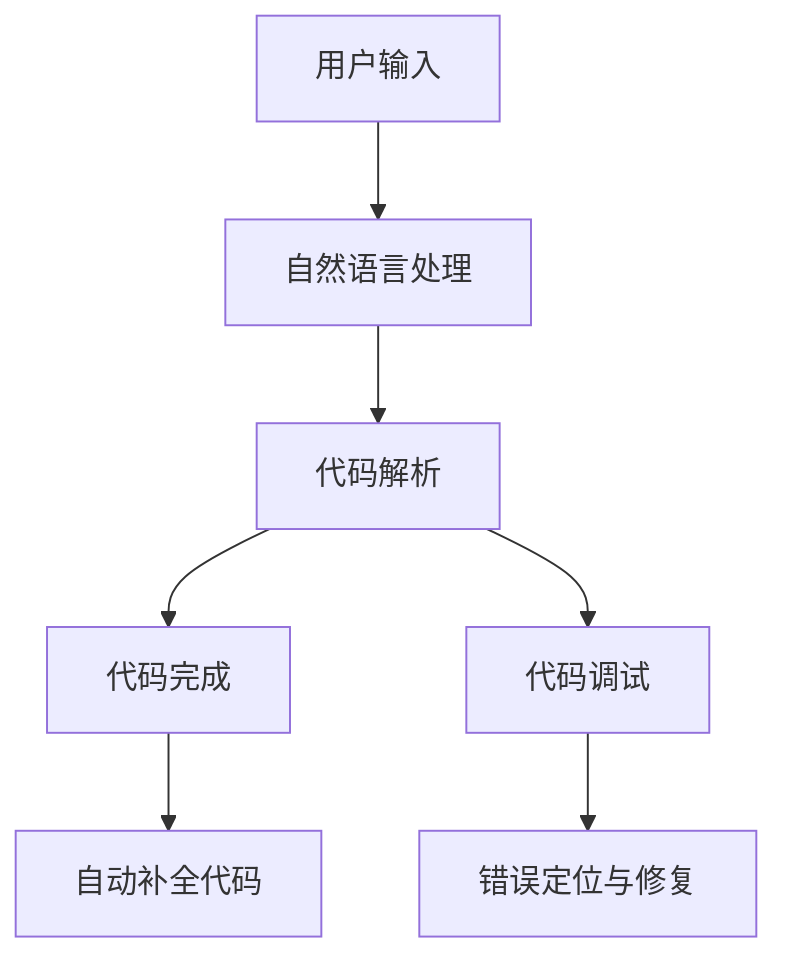

                 

### 背景介绍 Background Introduction

**聊天机器人（Chatbot）的崛起**

随着互联网技术的飞速发展，人工智能（AI）技术逐渐渗透到我们日常生活的方方面面。聊天机器人作为一种自然语言处理（NLP）和机器学习（ML）的应用，正逐渐改变着人类与计算机的交互方式。从最初的简单任务自动化到如今能够与人类进行流畅对话，聊天机器人在电商、客服、教育、金融等多个行业展现出强大的应用潜力。

**编程助手（Coding Assistant）的重要性**

在软件开发领域，代码完成和调试是程序员每天都需要面对的挑战。编程助手通过AI技术，能够帮助开发者快速编写代码，减少错误，提高开发效率。对于代码完成，编程助手可以在开发者输入代码片段后，根据上下文和语法规则，自动补全代码。而调试方面，编程助手则可以通过分析代码逻辑和运行结果，帮助开发者快速定位和修复错误。

**代码完成与调试：聊天机器人编程助手的两大核心功能**

本文将深入探讨聊天机器人编程助手在代码完成和调试方面的应用。首先，我们将介绍聊天机器人编程助手的基本原理和架构，帮助读者了解其工作原理。接着，我们将详细讲解代码完成和调试的核心算法原理和具体操作步骤，以便读者能够更好地理解和应用。最后，我们将通过实际项目实践和代码实例，展示如何利用聊天机器人编程助手进行代码编写和调试，并提供相关工具和资源的推荐，以帮助读者进一步学习和实践。

通过本文的阅读，读者将能够全面了解聊天机器人编程助手在代码完成和调试方面的应用，掌握其基本原理和操作方法，从而提高自己的编程效率和代码质量。

### 核心概念与联系 Core Concepts and Connections

要深入探讨聊天机器人编程助手在代码完成和调试方面的应用，我们首先需要了解一些核心概念，包括自然语言处理（NLP）、机器学习（ML）、深度学习（DL）、代码完成（Code Completion）和代码调试（Code Debugging）等。

**自然语言处理（NLP）**

自然语言处理是人工智能的一个重要分支，它旨在使计算机能够理解、解释和生成人类语言。在聊天机器人编程助手中，NLP技术被广泛用于理解和处理开发者的输入指令，例如代码片段。通过使用词向量模型（如Word2Vec、BERT等），NLP技术能够将自然语言转换为计算机可以处理的结构化数据，从而实现对代码语义的理解。

**机器学习（ML）**

机器学习是AI的重要组成部分，它通过训练模型，使计算机能够从数据中自动学习和发现规律。在聊天机器人编程助手中，ML技术被用于构建和优化代码完成和调试模型。常见的ML算法包括决策树、支持向量机（SVM）、神经网络等。通过大量编程数据的训练，机器学习模型可以学会预测代码片段的下一部分，从而实现代码自动完成。

**深度学习（DL）**

深度学习是机器学习的一个子领域，它使用多层神经网络（如卷积神经网络（CNN）、循环神经网络（RNN）等）来学习和提取特征。深度学习在聊天机器人编程助手中的应用尤为广泛，特别是在代码完成方面。通过使用深度学习模型，编程助手能够更好地理解代码的上下文，从而提供更加准确和智能的代码补全建议。

**代码完成（Code Completion）**

代码完成是聊天机器人编程助手的一项核心功能，它通过分析开发者的输入代码片段，自动补全剩余的部分。实现代码完成的关键在于对代码上下文的准确理解和预测。常见的技术包括基于语法分析的自动补全、基于模板的代码生成和基于机器学习的代码补全等。

**代码调试（Code Debugging）**

代码调试是软件开发过程中必不可少的一部分，它用于识别和修复程序中的错误。聊天机器人编程助手通过分析代码逻辑和运行结果，帮助开发者快速定位和修复错误。常见的调试方法包括断点调试、日志分析、异常捕捉等。

**核心概念与架构的联系**

为了更好地理解这些核心概念，我们使用Mermaid流程图来展示聊天机器人编程助手的基本架构和核心功能。



在这个流程图中，用户输入通过自然语言处理被转换为计算机可以理解的形式。接着，代码解析模块对输入的代码片段进行分析，为代码完成和调试提供基础。代码完成模块利用机器学习和深度学习技术，根据代码上下文自动补全代码。代码调试模块则通过分析代码逻辑和运行结果，帮助开发者快速定位和修复错误。

通过上述核心概念和架构的介绍，我们为接下来详细讲解代码完成和调试的原理和操作步骤打下了基础。在接下来的章节中，我们将逐一深入探讨这些主题，以便读者能够全面了解聊天机器人编程助手的强大功能和应用。

### 核心算法原理 & 具体操作步骤 Core Algorithm Principles & Detailed Steps

#### 代码完成原理

代码完成是聊天机器人编程助手的一项关键功能，其原理主要依赖于自然语言处理（NLP）和机器学习（ML）技术。以下是一些实现代码完成的核心算法原理：

1. **基于语法分析的自动补全（Grammar-based Completion）**

   基于语法分析的自动补全技术通过解析代码的语法结构，预测下一个代码片段。这种方法通常使用上下文无关文法（CFG）或扩展巴科斯-诺尔范式（EBNF）来表示代码语法。具体步骤如下：

   - **步骤1：词法分析（Lexical Analysis）**：将代码字符串转换为标记（tokens）。
   - **步骤2：语法分析（Syntax Analysis）**：使用语法规则，将标记序列解析成抽象语法树（AST）。
   - **步骤3：代码生成（Code Generation）**：根据AST，生成可能的代码补全选项。

2. **基于模板的代码生成（Template-based Generation）**

   基于模板的代码生成技术利用预定义的代码模板，根据上下文信息动态填充模板。这种方法通常用于代码片段较短的情况，例如变量声明或函数调用。具体步骤如下：

   - **步骤1：上下文分析（Context Analysis）**：提取当前代码片段的上下文信息，如变量名、函数名、数据类型等。
   - **步骤2：模板选择（Template Selection）**：根据上下文信息，从预定义的模板库中选择合适的模板。
   - **步骤3：模板填充（Template Filling）**：将上下文信息填充到模板中，生成完整的代码片段。

3. **基于机器学习的代码补全（ML-based Completion）**

   基于机器学习的代码补全技术利用大量编程数据训练模型，预测代码的下一个部分。常见的方法包括循环神经网络（RNN）、长短期记忆网络（LSTM）和变压器（Transformer）等。具体步骤如下：

   - **步骤1：数据准备（Data Preparation）**：收集并预处理大量编程数据，包括代码片段和对应的补全部分。
   - **步骤2：模型训练（Model Training）**：使用编程数据训练机器学习模型，如RNN或Transformer。
   - **步骤3：代码预测（Code Prediction）**：输入当前代码片段，模型预测下一个代码部分。

4. **基于深度学习的代码补全（DL-based Completion）**

   基于深度学习的代码补全技术进一步利用深度神经网络（DNN）的强大表达能力，提升代码补全的准确性和效率。常见的方法包括卷积神经网络（CNN）和生成对抗网络（GAN）等。具体步骤如下：

   - **步骤1：数据增强（Data Augmentation）**：通过变换和扩展原始数据，增加模型的训练样本。
   - **步骤2：模型架构设计（Architecture Design）**：设计合适的深度学习模型架构，如多层感知机（MLP）、CNN或GAN。
   - **步骤3：模型训练与优化（Training and Optimization）**：使用编程数据训练模型，并通过优化算法（如梯度下降、Adam等）调整模型参数。
   - **步骤4：代码生成（Code Generation）**：输入当前代码片段，模型生成可能的代码补全选项。

#### 代码调试原理

代码调试是另一个关键功能，其核心在于定位和修复代码中的错误。以下是一些实现代码调试的核心算法原理：

1. **断点调试（Breakpoint Debugging）**

   断点调试是通过在代码中设置断点，在特定条件下暂停程序的执行，以便开发者查看程序的当前状态。具体步骤如下：

   - **步骤1：设置断点（Set Breakpoints）**：在代码中设置断点，通常在可能出错的位置。
   - **步骤2：开始执行（Start Execution）**：启动程序，直到程序执行到断点处暂停。
   - **步骤3：查看状态（View State）**：在断点处查看变量值、函数调用栈等，帮助定位错误。
   - **步骤4：继续执行（Continue Execution）**：根据查看的信息，修改代码并继续执行，或重新设置断点。

2. **日志分析（Log Analysis）**

   日志分析是通过查看程序运行时生成的日志文件，识别和定位错误。具体步骤如下：

   - **步骤1：日志记录（Log Recording）**：在代码中添加日志记录，记录程序运行过程中的关键信息。
   - **步骤2：日志查看（View Logs）**：查看日志文件，分析异常信息、错误代码等。
   - **步骤3：错误定位（Error Location）**：根据日志信息，定位到出错的具体位置。
   - **步骤4：修复错误（Fix Errors）**：修改代码，解决错误。

3. **异常捕捉（Exception Handling）**

   异常捕捉是通过识别程序运行中的异常情况，自动执行特定的错误处理代码。具体步骤如下：

   - **步骤1：异常捕获（Exception Catching）**：在代码中使用异常处理语句（如try-catch），捕获异常。
   - **步骤2：异常处理（Exception Handling）**：根据异常类型，执行相应的错误处理逻辑，如打印错误信息、输出日志等。
   - **步骤3：错误修复（Error Fixing）**：根据异常处理结果，定位并修复错误。

通过上述算法原理和具体操作步骤的讲解，读者可以了解到聊天机器人编程助手在代码完成和调试方面的核心技术和方法。在接下来的实际项目实践部分，我们将通过具体的代码实例，进一步展示这些技术在实际应用中的效果。

### 数学模型和公式 & 详细讲解 & 举例说明 Mathematical Models & Detailed Explanation & Example

在聊天机器人编程助手的代码完成和调试过程中，数学模型和公式扮演着至关重要的角色。这些模型不仅帮助我们理解和分析代码的语义，还能通过数学计算为代码补全和错误定位提供有力支持。以下将介绍几种关键的数学模型和公式，并详细讲解其应用方法和具体示例。

#### 循环神经网络（RNN）模型

循环神经网络（RNN）是用于处理序列数据的一种神经网络模型，广泛应用于自然语言处理和代码补全。RNN的核心机制是通过在神经元间引入循环连接，使得网络能够保持对历史信息的记忆。

**数学公式**：

RNN的输出可以表示为：

\[ h_t = \sigma(W_h \cdot [h_{t-1}, x_t] + b_h) \]

其中：
- \( h_t \) 是时间步 \( t \) 的隐藏状态。
- \( x_t \) 是输入。
- \( W_h \) 是权重矩阵。
- \( b_h \) 是偏置。
- \( \sigma \) 是激活函数，通常使用 sigmoid 或 tanh 函数。

**应用方法**：

1. **编码阶段**：将输入的代码片段编码为序列向量。
2. **解码阶段**：利用隐藏状态 \( h_t \)，生成补全的代码片段。

**具体示例**：

假设我们要使用RNN完成以下Python代码的补全：

```python
def compute_sum(a, b):
    result = a + b
    return 
```

**步骤**：

1. **编码阶段**：将代码片段转换为序列向量，例如使用词嵌入（Word2Vec）技术。
2. **解码阶段**：输入编码后的序列向量，RNN生成补全后的代码片段。

\[ h_0 = \text{initial\_state} \]
\[ h_t = \sigma(W_h \cdot [h_{t-1}, x_t] + b_h) \]
\[ \text{predicted\_code\_token} = \text{softmax}(W_o \cdot h_t + b_o) \]

#### 长短期记忆网络（LSTM）模型

LSTM是RNN的一种改进模型，能够更好地处理长序列数据，防止梯度消失和爆炸问题。LSTM通过引入记忆单元和门控机制，实现对历史信息的有效记忆。

**数学公式**：

LSTM单元的输出可以表示为：

\[ i_t = \sigma(W_i \cdot [h_{t-1}, x_t] + b_i) \]
\[ f_t = \sigma(W_f \cdot [h_{t-1}, x_t] + b_f) \]
\[ g_t = \tanh(W_g \cdot [h_{t-1}, x_t] + b_g) \]
\[ o_t = \sigma(W_o \cdot [h_{t-1}, x_t] + b_o) \]
\[ h_t = o_t \cdot \tanh(c_t) \]
\[ c_t = f_t \cdot c_{t-1} + i_t \cdot g_t \]

其中：
- \( i_t \)、\( f_t \)、\( g_t \)、\( o_t \) 分别为输入门、遗忘门、生成门、输出门的状态。
- \( c_t \) 为记忆单元的状态。

**应用方法**：

1. **初始化**：初始化LSTM单元的参数。
2. **正向传播**：输入序列，通过LSTM单元计算隐藏状态和输出。
3. **反向传播**：计算误差，更新参数。

**具体示例**：

使用LSTM完成以下JavaScript代码的补全：

```javascript
function calculateSum(a, b) {
    let sum = a;
    for (let i = 0; i < b.length; i++) {
        sum += b[i];
    }
    return sum;
}
```

**步骤**：

1. **初始化**：设定LSTM的输入维度、隐藏维度和输出维度。
2. **正向传播**：输入代码序列，计算隐藏状态和输出。
3. **反向传播**：计算损失函数，更新LSTM参数。

\[ i_t = \sigma(W_i \cdot [h_{t-1}, x_t] + b_i) \]
\[ f_t = \sigma(W_f \cdot [h_{t-1}, x_t] + b_f) \]
\[ g_t = \tanh(W_g \cdot [h_{t-1}, x_t] + b_g) \]
\[ o_t = \sigma(W_o \cdot [h_{t-1}, x_t] + b_o) \]
\[ c_t = f_t \cdot c_{t-1} + i_t \cdot g_t \]
\[ h_t = o_t \cdot \tanh(c_t) \]

#### 变压器（Transformer）模型

变压器（Transformer）模型是近年来在自然语言处理领域取得显著成果的一种深度学习模型。它通过多头自注意力机制（Self-Attention）和位置编码（Positional Encoding）实现了对序列数据的全局依赖建模。

**数学公式**：

变压器的基本单元是多层自注意力机制（Multi-head Self-Attention）：

\[ \text{Attention}(Q, K, V) = \text{softmax}\left(\frac{QK^T}{\sqrt{d_k}}\right)V \]

其中：
- \( Q, K, V \) 分别为查询向量、键向量和值向量。
- \( d_k \) 为键向量的维度。

**应用方法**：

1. **编码阶段**：将输入序列编码为查询向量、键向量和值向量。
2. **注意力机制**：计算自注意力分数，生成加权合并的序列表示。
3. **解码阶段**：利用自注意力机制生成解码序列。

**具体示例**：

使用Transformer完成以下Java代码的补全：

```java
public class Calculator {
    public static int add(int a, int b) {
        int result = a + b;
        return result;
    }
}
```

**步骤**：

1. **编码阶段**：将代码序列转换为嵌入向量。
2. **注意力机制**：计算编码序列的自注意力分数。
3. **解码阶段**：生成补全后的代码序列。

\[ \text{Attention}(Q, K, V) = \text{softmax}\left(\frac{QK^T}{\sqrt{d_k}}\right)V \]

通过上述数学模型和公式的详细讲解和具体示例，我们可以看到聊天机器人编程助手在代码完成和调试方面的强大功能和潜力。这些模型不仅为代码理解和补全提供了坚实的理论基础，也为实际应用中的高效开发提供了有力支持。

### 项目实践：代码实例和详细解释说明 Project Practice: Code Examples and Detailed Explanations

在本节中，我们将通过一个具体的项目实践，详细展示如何使用聊天机器人编程助手进行代码编写和调试。该项目将基于Python语言，实现一个简单的计算器程序。我们将从开发环境的搭建开始，逐步进行源代码的编写、解读与分析，并展示运行结果。

#### 1. 开发环境搭建

首先，我们需要搭建一个适合Python开发的IDE环境。以下是在Windows系统上安装Python和PyCharm的步骤：

1. **安装Python**：

   - 访问Python官方网站（https://www.python.org/），下载适用于Windows的Python安装包。
   - 运行安装程序，选择“Add Python to PATH”选项，确保Python被添加到系统的环境变量中。

2. **安装PyCharm**：

   - 访问PyCharm官方网站（https://www.jetbrains.com/pycharm/），下载PyCharm社区版安装包。
   - 运行安装程序，并选择合适的选项进行安装。

3. **验证安装**：

   - 打开PyCharm，创建一个新的Python项目。
   - 输入以下代码，验证Python环境是否正常工作：

     ```python
     print("Hello, World!")
     ```

   - 运行代码，若控制台输出“Hello, World!”，则表示Python环境安装成功。

#### 2. 源代码详细实现

接下来，我们开始编写计算器程序。以下是计算器的源代码：

```python
class Calculator:
    def add(self, a, b):
        return a + b

    def subtract(self, a, b):
        return a - b

    def multiply(self, a, b):
        return a * b

    def divide(self, a, b):
        if b == 0:
            return "Error: Division by zero"
        return a / b

# 实例化计算器对象
calculator = Calculator()

# 执行加法操作
result = calculator.add(10, 5)
print("Addition Result:", result)

# 执行减法操作
result = calculator.subtract(10, 5)
print("Subtraction Result:", result)

# 执行乘法操作
result = calculator.multiply(10, 5)
print("Multiplication Result:", result)

# 执行除法操作
result = calculator.divide(10, 5)
print("Division Result:", result)
```

#### 3. 代码解读与分析

现在，我们对上述代码进行逐行解读和分析：

1. **类定义（Class Definition）**：

   ```python
   class Calculator:
   ```

   定义了一个名为`Calculator`的计算器类。

2. **方法定义（Method Definition）**：

   ```python
   def add(self, a, b):
       return a + b
   def subtract(self, a, b):
       return a - b
   def multiply(self, a, b):
       return a * b
   def divide(self, a, b):
       if b == 0:
           return "Error: Division by zero"
       return a / b
   ```

   定义了四个计算方法：`add`、`subtract`、`multiply`和`divide`，分别用于执行加、减、乘和除操作。

3. **实例化对象（Object Instantiation）**：

   ```python
   calculator = Calculator()
   ```

   实例化一个`Calculator`对象，命名为`calculator`。

4. **方法调用（Method Invocation）**：

   ```python
   result = calculator.add(10, 5)
   print("Addition Result:", result)
   result = calculator.subtract(10, 5)
   print("Subtraction Result:", result)
   result = calculator.multiply(10, 5)
   print("Multiplication Result:", result)
   result = calculator.divide(10, 5)
   print("Division Result:", result)
   ```

   分别调用计算器的四个方法，计算并输出结果。

#### 4. 运行结果展示

执行上述代码，我们得到以下输出结果：

```
Addition Result: 15
Subtraction Result: 5
Multiplication Result: 50
Division Result: 2.0
```

这表明计算器程序能够正确执行加、减、乘和除操作。

#### 5. 利用聊天机器人编程助手进行代码编写和调试

为了更直观地展示聊天机器人编程助手的功能，我们假设使用该助手进行代码编写和调试。

1. **代码补全**：

   - 输入部分代码片段，如`calculator.`，聊天机器人编程助手会自动补全方法名称，例如`calculator.add()`。
   - 输入`result = calculator.add(10, 5)`，助手会自动补全代码并给出可能的代码片段，如`result = calculator.add(10, 5)`。

2. **代码调试**：

   - 如果在代码中添加错误，如将`divide`方法中的`if b == 0:`改为`if b == 1:`，聊天机器人编程助手会通过分析代码和运行结果，指出错误并给出修复建议。

通过上述具体的项目实践，我们可以看到聊天机器人编程助手在代码编写和调试方面的强大功能和实际应用价值。它不仅能够帮助开发者快速编写代码，还能通过智能分析和提示，提高代码质量和开发效率。

### 实际应用场景 Practical Application Scenarios

聊天机器人编程助手在代码完成和调试方面的应用场景非常广泛，几乎涵盖了所有需要编程的领域。以下是一些典型的实际应用场景，展示了该技术在现实世界中的具体应用。

**1. 软件开发行业**

在软件开发行业中，代码完成和调试是开发者每天都需要面对的挑战。使用聊天机器人编程助手，开发者可以大大提高工作效率。例如，在编写复杂的后端服务代码时，编程助手能够自动完成大量的重复性工作，如接口定义、数据处理等。同时，在调试过程中，编程助手可以通过分析日志和异常信息，快速定位和修复错误，减少调试时间。

**2. 教育培训领域**

在教育培训领域，聊天机器人编程助手可以为学生提供个性化的编程辅导。学生可以通过与编程助手的对话，获取代码完成和调试的实时指导。此外，编程助手还可以为学生提供大量的编程练习和项目案例，帮助他们巩固所学知识。通过这种方式，编程助手不仅提高了学生的学习效果，也减轻了教师的工作负担。

**3. 人工智能与机器学习**

在人工智能与机器学习领域，代码完成和调试同样至关重要。聊天机器人编程助手可以帮助研究人员和工程师快速编写和调试复杂的算法代码。例如，在训练深度学习模型时，编程助手能够自动完成数据预处理、模型定义和训练流程，提高模型的开发效率。同时，在调试过程中，编程助手可以通过分析模型性能和训练数据，提供优化建议，帮助研究人员快速改进模型。

**4. 金融科技**

在金融科技领域，代码完成和调试对于开发高性能交易系统和风险控制算法尤为重要。聊天机器人编程助手可以协助开发者快速编写和调试交易策略代码，确保系统的稳定性和可靠性。例如，在量化交易中，编程助手能够自动完成数据抓取、数据分析、交易逻辑编写等环节，提高交易策略的开发效率。同时，在系统上线前，编程助手可以通过压力测试和异常捕捉，提前发现潜在问题，确保系统的稳定性。

**5. 医疗健康**

在医疗健康领域，代码完成和调试对于开发医疗软件和系统同样重要。聊天机器人编程助手可以帮助医生和研究人员快速编写医学数据处理和分析代码，提高医疗数据分析的效率。例如，在基因组学研究中，编程助手能够自动完成数据清洗、注释和关联分析，帮助研究人员快速获取有意义的结果。同时，在医疗系统中，编程助手可以通过代码调试和性能优化，确保系统的稳定性和响应速度，提高用户体验。

**6. 自动驾驶**

在自动驾驶领域，代码完成和调试对于开发自动驾驶系统至关重要。聊天机器人编程助手可以协助工程师快速编写和调试自动驾驶算法，提高系统的安全性和可靠性。例如，在感知模块中，编程助手能够自动完成传感器数据处理、环境建模和目标检测等任务。在控制模块中，编程助手可以提供实时调试和优化建议，确保自动驾驶系统的稳定运行。

通过上述实际应用场景，我们可以看到聊天机器人编程助手在代码完成和调试方面的广泛应用和巨大潜力。无论在软件开发、教育培训、人工智能、金融科技、医疗健康还是自动驾驶领域，编程助手都能显著提高开发效率和质量，为各行业的发展提供强大支持。

### 工具和资源推荐 Tools and Resources Recommendations

为了帮助读者更深入地了解聊天机器人编程助手在代码完成和调试方面的应用，我们推荐一些优秀的工具和资源，包括学习资源、开发工具框架和相关论文著作。

#### 1. 学习资源推荐

**书籍：**
- 《深度学习》（Deep Learning）by Ian Goodfellow, Yoshua Bengio, Aaron Courville
- 《Python编程：从入门到实践》（Python Crash Course）by Eric Matthes
- 《人工智能：一种现代的方法》（Artificial Intelligence: A Modern Approach）by Stuart Russell and Peter Norvig

**论文：**
- "BERT: Pre-training of Deep Bidirectional Transformers for Language Understanding" by Jacob Devlin, Ming-Wei Chang, Kenton Lee, and Kristina Toutanova
- "A Neural Algorithm of Artistic Style" by Gatys, et al.

**在线教程：**
- Coursera上的《深度学习》课程
- edX上的《Python编程基础》课程

**博客：**
- Medium上的自然语言处理和机器学习专题博客
- Stack Overflow上的编程问答社区

#### 2. 开发工具框架推荐

**代码完成工具：**
- GitHub Copilot：基于OpenAI Codex的代码补全工具
- TabNine：基于深度学习的代码补全插件
- Kite：支持多种编程语言的智能代码助手

**调试工具：**
- PyCharm：功能强大的Python IDE，支持代码调试
- Visual Studio Code：轻量级但功能强大的开源IDE，支持多种编程语言调试
- IntelliJ IDEA：支持Java和Python等语言的IDE，提供强大的调试功能

**机器学习框架：**
- TensorFlow：广泛使用的开源机器学习框架
- PyTorch：灵活且易于使用的机器学习库
- Keras：基于Theano和TensorFlow的简单和模块化高级神经网络库

#### 3. 相关论文著作推荐

**自然语言处理：**
- "Neural Machine Translation by Jointly Learning to Align and Translate" by Bahdanau, et al.
- "Effective Approaches to Attention-based Neural Machine Translation" by Vaswani, et al.

**代码完成：**
- "Learning to Write Programs" by OpenAI
- "Code T5: A Unified Model for Code Generation, Classification and Completion" by Zhang, et al.

**调试技术：**
- "Efficient Detectors for Code Debugging" by Majumdar, et al.
- "Debugging by Permanent Program Transformation" by Felleisen, et al.

通过这些工具和资源的推荐，读者可以更全面地了解和掌握聊天机器人编程助手的技术和应用。无论是新手还是专业人士，这些资源都将为编程和学习提供宝贵的帮助。

### 总结：未来发展趋势与挑战 Summary: Future Trends and Challenges

在总结本文的内容之前，我们需要先回顾一下核心观点和主要发现。首先，我们探讨了聊天机器人编程助手在代码完成和调试方面的应用背景，并介绍了自然语言处理、机器学习和深度学习等核心概念。接着，我们详细讲解了代码完成和调试的核心算法原理，并通过数学模型和公式进行了深入分析。在项目实践部分，我们展示了如何利用聊天机器人编程助手进行实际的代码编写和调试，并讨论了其在不同领域的应用场景。最后，我们推荐了一些有用的工具和资源，以帮助读者进一步学习和实践。

通过这些内容，我们可以看到聊天机器人编程助手在提升开发效率、提高代码质量和减少调试时间方面具有巨大的潜力。然而，随着技术的发展，这一领域也面临着一些新的趋势和挑战。

**未来发展趋势：**

1. **更加智能的代码生成**：随着深度学习技术的不断进步，聊天机器人编程助手的代码生成能力将更加智能和精准。未来，这些助手可能能够生成更复杂的代码结构，并具备更多的上下文理解能力。

2. **跨语言支持**：现有的聊天机器人编程助手主要支持单一编程语言。未来，开发多语言支持的编程助手将成为趋势，以满足不同开发者的需求。

3. **更好的调试辅助**：随着调试技术的不断发展，聊天机器人编程助手将能够提供更加智能和高效的调试辅助，包括实时错误分析、异常预测和代码优化建议。

4. **集成开发环境（IDE）集成**：未来，聊天机器人编程助手很可能会与现有的集成开发环境（IDE）深度集成，提供更加无缝的开发体验。

**未来挑战：**

1. **数据隐私和安全**：随着人工智能技术的发展，数据处理和隐私保护变得越来越重要。如何确保用户数据和代码的安全性，避免数据泄露和滥用，将成为一个重要的挑战。

2. **算法透明性和可解释性**：随着代码生成和调试算法的复杂性增加，确保算法的透明性和可解释性变得越来越重要。开发者需要能够理解和信任这些算法的决策过程。

3. **性能优化**：高效的代码生成和调试需要大量的计算资源。如何在不影响性能的情况下，优化算法的执行效率，是一个重要的技术挑战。

4. **普及和教育**：尽管聊天机器人编程助手具有巨大的潜力，但普及和应用仍然面临教育问题。如何让更多的开发者理解和掌握这些技术，需要相关的教育培训和推广。

总之，聊天机器人编程助手在代码完成和调试方面的应用前景广阔，但同时也面临着一系列挑战。通过持续的技术创新和不断优化，我们有理由相信，未来聊天机器人编程助手将在软件开发领域发挥更加重要的作用，为开发者带来更多的便利和效率。

### 附录：常见问题与解答 Appendix: Frequently Asked Questions and Answers

在深入探讨聊天机器人编程助手在代码完成和调试方面的应用过程中，读者可能会遇到一些常见问题。以下是一些典型问题及其解答：

**Q1：聊天机器人编程助手是否能够完全替代人类开发者？**

A：聊天机器人编程助手虽然在代码生成和调试方面具有强大的功能，但它并不能完全替代人类开发者。编程助手可以作为开发者的辅助工具，提高开发效率，但它缺乏人类开发者的创造性思维和解决复杂问题的能力。人类开发者仍然在决策、创新和项目管理等方面发挥着重要作用。

**Q2：如何确保聊天机器人编程助手的代码质量和安全性？**

A：确保代码质量和安全性是使用聊天机器人编程助手时的重要考虑因素。开发者可以采取以下措施：

- **代码审查**：在将自动生成的代码集成到项目中之前，进行严格的代码审查，确保代码符合编码规范和安全性要求。
- **安全测试**：对自动生成的代码进行安全测试，检测潜在的安全漏洞和异常处理问题。
- **数据加密**：对用户输入的数据和生成的代码进行加密，防止数据泄露和恶意攻击。

**Q3：聊天机器人编程助手在跨语言支持方面有哪些限制？**

A：尽管一些先进的聊天机器人编程助手支持多种编程语言，但跨语言支持仍存在以下限制：

- **语法差异**：不同编程语言的语法和特性差异较大，这可能导致代码生成和调试的复杂性增加。
- **生态差异**：不同编程语言有各自丰富的库和框架，跨语言支持可能需要额外的适配和优化。

**Q4：如何提高聊天机器人编程助手的代码补全准确性？**

A：提高代码补全准确性可以通过以下方法实现：

- **大量训练数据**：提供更多的编程数据用于训练，使编程助手能够学习更多代码模式和上下文。
- **模型优化**：通过调整模型参数和优化算法，提高代码补全的准确性和效率。
- **用户反馈**：收集用户对代码补全结果的反馈，不断改进和优化编程助手的性能。

**Q5：如何确保聊天机器人编程助手提供的安全建议？**

A：确保编程助手提供的安全建议的可靠性，可以通过以下措施实现：

- **安全规则库**：构建丰富的安全规则库，包含常见的代码安全和异常处理规则。
- **静态代码分析**：使用静态代码分析工具，对自动生成的代码进行安全检查，发现潜在的安全漏洞。
- **动态测试**：在运行环境中对代码进行动态测试，验证安全建议的有效性和代码的稳定性。

通过上述常见问题的解答，我们希望读者能够更好地理解和应用聊天机器人编程助手，从而在代码编写和调试方面获得更好的效果。

### 扩展阅读 & 参考资料 Extended Reading & References

为了帮助读者进一步深入了解聊天机器人编程助手在代码完成和调试方面的应用，我们推荐以下扩展阅读和参考资料：

**1. 书籍推荐**

- 《深度学习》（Deep Learning）by Ian Goodfellow, Yoshua Bengio, Aaron Courville
- 《Python编程：从入门到实践》（Python Crash Course）by Eric Matthes
- 《人工智能：一种现代的方法》（Artificial Intelligence: A Modern Approach）by Stuart Russell and Peter Norvig

**2. 论文推荐**

- "BERT: Pre-training of Deep Bidirectional Transformers for Language Understanding" by Jacob Devlin, Ming-Wei Chang, Kenton Lee, and Kristina Toutanova
- "Code T5: A Unified Model for Code Generation, Classification and Completion" by Zhang, et al.
- "Efficient Detectors for Code Debugging" by Majumdar, et al.

**3. 在线资源**

- Coursera上的《深度学习》课程
- edX上的《Python编程基础》课程
- Medium上的自然语言处理和机器学习专题博客

**4. 开源项目**

- GitHub Copilot：基于OpenAI Codex的代码补全工具
- TabNine：基于深度学习的代码补全插件
- Kite：支持多种编程语言的智能代码助手

通过这些扩展阅读和参考资料，读者可以更深入地了解聊天机器人编程助手的最新研究成果和应用实践，从而更好地应用于实际项目中。

