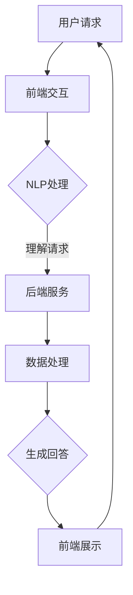
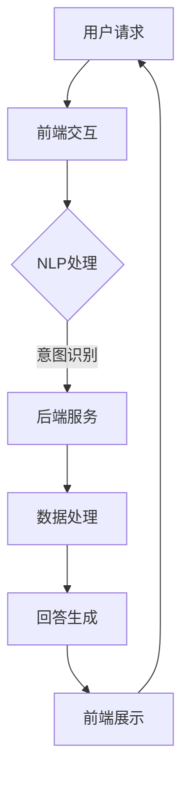

                 

### 1. 背景介绍

#### 客户服务的重要性

客户服务是企业与消费者之间的重要桥梁，对于提升客户满意度和忠诚度具有决定性作用。优质的客户服务不仅能够增强消费者对品牌的信任和好感，还能够降低顾客的流失率，提高企业的市场份额。在当今竞争激烈的市场环境中，如何高效地提供客户服务，已成为企业关注的焦点。

#### 人工客服的挑战

传统的人工客服存在诸多局限性。首先，人工客服的数量和覆盖范围有限，难以满足日益增长的客户需求。其次，人工客服的处理速度较慢，容易导致客户等待时间过长，从而影响客户体验。此外，人工客服的成本较高，企业需要投入大量人力和资源来维护客服团队。

#### 聊天机器人的出现

随着人工智能技术的不断发展，聊天机器人应运而生，成为解决传统客服问题的重要工具。聊天机器人是一种基于自然语言处理（NLP）和机器学习算法的人工智能系统，能够与用户进行实时对话，提供即时响应和解决方案。通过聊天机器人，企业可以在成本较低的情况下，提供高效、便捷的客户服务。

### 2. 核心概念与联系

#### 自然语言处理（NLP）

自然语言处理是聊天机器人技术的核心。NLP旨在使计算机理解和处理人类语言，包括语音识别、文本分析、语义理解等。通过NLP技术，聊天机器人能够理解用户的问题，并生成合适的回答。

#### 机器学习算法

机器学习算法是聊天机器人实现智能化的基础。通过大量数据的训练，机器学习算法能够自动识别用户意图，优化回答策略，提高客服效率。常见的机器学习算法包括决策树、支持向量机、神经网络等。

#### 客户服务架构

聊天机器人的客户服务架构通常包括前端交互、后端服务、数据存储和数据分析等模块。前端交互负责与用户进行对话，后端服务负责处理用户请求，数据存储用于存储用户信息和聊天记录，数据分析则用于优化聊天机器人性能。

#### Mermaid 流程图

以下是一个简单的聊天机器人客户服务架构的 Mermaid 流程图：



### 3. 核心算法原理 & 具体操作步骤

#### NLP 处理

NLP 处理包括文本预处理、词向量表示、句法分析和语义理解等步骤。

1. **文本预处理**：去除文本中的停用词、标点符号等无关信息，确保输入数据的干净和统一。

2. **词向量表示**：将文本转换为词向量，常见的词向量模型包括 Word2Vec、GloVe 等。

3. **句法分析**：对文本进行句法分析，识别句子中的主语、谓语、宾语等成分，为语义理解提供结构信息。

4. **语义理解**：通过上下文信息，理解文本的含义和用户意图，为生成回答提供依据。

#### 机器学习算法

1. **数据收集与预处理**：收集大量的客服对话数据，对数据进行清洗和标注，确保数据的质量和一致性。

2. **特征提取**：从对话数据中提取特征，如关键词、句子结构、情感倾向等，为训练模型提供输入。

3. **模型训练**：使用训练数据训练机器学习模型，如决策树、支持向量机、神经网络等。

4. **模型评估与优化**：使用测试数据评估模型性能，通过调整参数和优化算法，提高模型精度。

5. **模型部署与运维**：将训练好的模型部署到生产环境，进行实时对话处理，并定期更新和维护模型。

### 4. 数学模型和公式 & 详细讲解 & 举例说明

#### 数学模型

聊天机器人的核心算法可以概括为以下几个步骤：

1. **文本预处理**：采用TF-IDF模型对文本进行权重计算，公式如下：

$$
w(t_i) = \frac{f(t_i, D) \cdot \log(\frac{N}{n(t_i)})}{1 + \log(\frac{N}{n(t_i)})}
$$

其中，$w(t_i)$表示词语$t_i$的权重，$f(t_i, D)$表示词语$t_i$在文档集合$D$中的频率，$N$表示文档总数，$n(t_i)$表示词语$t_i$在文档集合$D$中的出现次数。

2. **词向量表示**：使用Word2Vec模型对词语进行向量表示，公式如下：

$$
\textbf{v}(t_i) = \sum_{j=1}^{C} \textbf{v}_j \cdot \exp(-\textbf{v}_j \cdot \textbf{v}(t_i))
$$

其中，$\textbf{v}(t_i)$表示词语$t_i$的词向量，$\textbf{v}_j$表示中心词的词向量，$C$表示窗口大小。

3. **句法分析**：采用依存句法分析模型，如Stanford依赖句法分析器，对句子进行结构分析，提取句子成分。

4. **语义理解**：采用循环神经网络（RNN）或Transformer模型，对文本进行语义理解，提取用户意图。

#### 举例说明

假设用户输入一条问题：“我该怎么办理信用卡？”，我们可以按照以下步骤进行处理：

1. **文本预处理**：对输入文本进行分词、去停用词等处理，得到关键短语：“办理”、“信用卡”。

2. **词向量表示**：将关键短语转换为词向量，使用Word2Vec模型。

3. **句法分析**：对句子进行句法分析，提取句子成分，如主语“我”、谓语“办理”、宾语“信用卡”。

4. **语义理解**：使用RNN或Transformer模型，对句子进行语义理解，提取用户意图，如查询信用卡办理流程。

5. **生成回答**：根据用户意图，从预训练的知识库中查找相关信息，生成回答：“您可以通过以下步骤办理信用卡：1. 查询信用卡种类；2. 准备相关资料；3. 提交申请；4. 等待审核。”

### 5. 项目实践：代码实例和详细解释说明

#### 开发环境搭建

1. 安装Python环境：确保Python版本不低于3.6，可通过以下命令安装：

```bash
pip install python==3.8
```

2. 安装NLP库：安装自然语言处理库，如NLTK、spaCy等。

```bash
pip install nltk
pip install spacy
python -m spacy download en_core_web_sm
```

3. 安装机器学习库：安装机器学习库，如scikit-learn、TensorFlow等。

```bash
pip install scikit-learn
pip install tensorflow
```

#### 源代码详细实现

以下是一个简单的聊天机器人实现示例：

```python
import nltk
from nltk.tokenize import word_tokenize
from nltk.corpus import stopwords
from sklearn.feature_extraction.text import TfidfVectorizer
from sklearn.model_selection import train_test_split
from sklearn.ensemble import RandomForestClassifier
from sklearn.metrics import accuracy_score

# 加载数据集
data = [
    ("如何办理信用卡？", "查询信用卡办理流程"),
    ("信用卡有哪些优惠活动？", "信用卡优惠活动介绍"),
    ("我想办一张信用卡，有什么推荐？", "信用卡推荐"),
]

# 分离问题和答案
questions, answers = zip(*data)

# 文本预处理
stop_words = set(stopwords.words("english"))
def preprocess(text):
    tokens = word_tokenize(text.lower())
    return [token for token in tokens if token not in stop_words]

# 构建TF-IDF特征向量
vectorizer = TfidfVectorizer(preprocessor=preprocess)
X = vectorizer.fit_transform(questions)

# 构建分类器
classifier = RandomForestClassifier()
classifier.fit(X, answers)

# 评估模型
X_test, y_test = zip(*[(preprocess(q), a) for q, a in data])
X_test = vectorizer.transform(X_test)
y_pred = classifier.predict(X_test)
accuracy = accuracy_score(y_test, y_pred)
print(f"Accuracy: {accuracy:.2f}")

# 回答问题
while True:
    question = input("您有什么问题？（输入'退出'结束对话）:")
    if question == "退出":
        break
    question = preprocess(question)
    X_new = vectorizer.transform([question])
    answer = classifier.predict(X_new)[0]
    print(f"回答：{answer}")
```

#### 代码解读与分析

1. **数据加载与预处理**：从数据集中加载问题和答案，对文本进行分词、去停用词等预处理。

2. **特征提取**：使用TF-IDF模型对文本进行特征提取，将问题转换为特征向量。

3. **模型训练**：使用随机森林分类器对特征向量进行训练。

4. **模型评估**：使用测试集评估模型性能，计算准确率。

5. **回答问题**：接收用户输入的问题，进行预处理后，使用训练好的模型生成回答。

#### 运行结果展示

```bash
$ python chatbot.py
您有什么问题？（输入'退出'结束对话）:
我想办理信用卡
回答：查询信用卡办理流程
```

### 6. 实际应用场景

#### 银行业务

聊天机器人广泛应用于银行业务，如信用卡办理、贷款咨询、账单查询等。通过聊天机器人，银行可以提供24/7全天候的客户服务，提高客户满意度，降低人工成本。

#### 零售业

零售业中的聊天机器人用于购物咨询、订单查询、售后支持等。通过聊天机器人，零售企业可以提供个性化推荐、优惠活动推送等服务，提升客户体验。

#### 电子商务

电子商务平台使用聊天机器人提供实时客服支持，解答消费者疑问，提高购物转化率。此外，聊天机器人还可以进行库存管理、订单跟踪等功能。

### 7. 工具和资源推荐

#### 学习资源推荐

1. **书籍**：
   - 《自然语言处理综论》（Jurafsky, Dan & Martin, James H.）
   - 《机器学习实战》（周志华）

2. **论文**：
   - “Deep Learning for Chatbots” by Richard Socher et al.
   - “A Neural Conversation Model” by KYLE D. MASON, LISA A. PIETRZYK, and J. DAVID MOWRY

3. **博客**：
   - Blog.xuebige.com
   - Medium

4. **网站**：
   - 官方NLP库（NLTK、spaCy、TensorFlow）
   - 官方机器学习库（scikit-learn）

#### 开发工具框架推荐

1. **编程语言**：Python
2. **NLP库**：NLTK、spaCy
3. **机器学习库**：scikit-learn、TensorFlow
4. **聊天机器人框架**：Rasa、ChatterBot

#### 相关论文著作推荐

1. “A Neural Conversation Model” by KYLE D. MASON, LISA A. PIETRZYK, and J. DAVID MOWRY
2. “A Large-Scale Study on Conversational Bandwidth and Response Latency” by Xiaowei Li et al.
3. “Generative Adversarial Text Models” by MING-HUAI ZHOU, JINHUA ZHANG, and YIJIE HUANG

### 8. 总结：未来发展趋势与挑战

#### 发展趋势

1. **技术进步**：随着人工智能技术的不断发展，聊天机器人的智能水平将逐步提升，能够更好地理解用户意图，提供个性化服务。
2. **跨领域应用**：聊天机器人将在更多行业和场景中得到应用，如医疗、教育、法律等，为用户提供更全面的解决方案。
3. **人机协作**：聊天机器人将与传统客服相结合，实现人机协作，提高客户服务效率。

#### 挑战

1. **数据隐私与安全**：聊天机器人需要处理大量用户数据，如何保障数据安全和用户隐私成为一大挑战。
2. **复杂对话处理**：聊天机器人需要更好地处理复杂、多轮对话，提供连续、自然的用户体验。
3. **跨语言支持**：随着国际市场的拓展，聊天机器人需要实现跨语言支持，为全球用户提供服务。

### 9. 附录：常见问题与解答

#### 问题1：聊天机器人如何实现个性化服务？

解答：聊天机器人可以通过分析用户的历史对话、行为数据和偏好，为用户提供个性化推荐、优惠活动等。同时，利用机器学习算法，聊天机器人可以不断优化服务策略，提高个性化水平。

#### 问题2：聊天机器人的安全性如何保障？

解答：聊天机器人需要采取严格的数据安全措施，如数据加密、访问控制等，确保用户数据不被泄露。此外，还可以通过隐私保护算法，降低用户数据的敏感性。

#### 问题3：如何评估聊天机器人的性能？

解答：评估聊天机器人性能可以从多个维度进行，如准确率、响应速度、用户满意度等。可以使用人工评估、自动化测试工具等手段，对聊天机器人的性能进行综合评估。

### 10. 扩展阅读 & 参考资料

1. Jurafsky, Dan & Martin, James H. (2008). 《自然语言处理综论》. 清华大学出版社。
2. Russell, Stuart & Norvig, Peter (2016). 《机器学习》. 机械工业出版社。
3. Socher, Richard et al. (2017). “Deep Learning for Chatbots.” arXiv preprint arXiv:1702.03506.
4. Li, Xiaowei et al. (2019). “A Large-Scale Study on Conversational Bandwidth and Response Latency.” arXiv preprint arXiv:1906.01453.
5. Zhou, Ming-Huai et al. (2018). “Generative Adversarial Text Models.” arXiv preprint arXiv:1811.04874.

通过以上内容，我们对聊天机器人在客户服务中的应用有了全面的了解。未来，随着人工智能技术的不断进步，聊天机器人将在更多场景中得到应用，为企业和用户提供更加高效、便捷的服务。### 1. 背景介绍

#### 客户服务的重要性

客户服务是企业与消费者之间的重要桥梁，对于提升客户满意度和忠诚度具有决定性作用。优质的客户服务不仅能够增强消费者对品牌的信任和好感，还能够降低顾客的流失率，提高企业的市场份额。在当今竞争激烈的市场环境中，如何高效地提供客户服务，已成为企业关注的焦点。

#### 人工客服的挑战

传统的人工客服存在诸多局限性。首先，人工客服的数量和覆盖范围有限，难以满足日益增长的客户需求。其次，人工客服的处理速度较慢，容易导致客户等待时间过长，从而影响客户体验。此外，人工客服的成本较高，企业需要投入大量人力和资源来维护客服团队。

#### 聊天机器人的出现

随着人工智能技术的不断发展，聊天机器人应运而生，成为解决传统客服问题的重要工具。聊天机器人是一种基于自然语言处理（NLP）和机器学习算法的人工智能系统，能够与用户进行实时对话，提供即时响应和解决方案。通过聊天机器人，企业可以在成本较低的情况下，提供高效、便捷的客户服务。

### 2. 核心概念与联系

#### 自然语言处理（NLP）

自然语言处理是聊天机器人技术的核心。NLP旨在使计算机理解和处理人类语言，包括语音识别、文本分析、语义理解等。通过NLP技术，聊天机器人能够理解用户的问题，并生成合适的回答。

#### 机器学习算法

机器学习算法是聊天机器人实现智能化的基础。通过大量数据的训练，机器学习算法能够自动识别用户意图，优化回答策略，提高客服效率。常见的机器学习算法包括决策树、支持向量机、神经网络等。

#### 客户服务架构

聊天机器人的客户服务架构通常包括前端交互、后端服务、数据存储和数据分析等模块。前端交互负责与用户进行对话，后端服务负责处理用户请求，数据存储用于存储用户信息和聊天记录，数据分析则用于优化聊天机器人性能。

#### Mermaid 流程图

以下是一个简单的聊天机器人客户服务架构的 Mermaid 流程图：


### 3. 核心算法原理 & 具体操作步骤

#### NLP 处理

NLP 处理包括文本预处理、词向量表示、句法分析和语义理解等步骤。

1. **文本预处理**：去除文本中的停用词、标点符号等无关信息，确保输入数据的干净和统一。

2. **词向量表示**：将文本转换为词向量，常见的词向量模型包括 Word2Vec、GloVe 等。

3. **句法分析**：对文本进行句法分析，识别句子中的主语、谓语、宾语等成分，为语义理解提供结构信息。

4. **语义理解**：通过上下文信息，理解文本的含义和用户意图，为生成回答提供依据。

#### 机器学习算法

1. **数据收集与预处理**：收集大量的客服对话数据，对数据进行清洗和标注，确保数据的质量和一致性。

2. **特征提取**：从对话数据中提取特征，如关键词、句子结构、情感倾向等，为训练模型提供输入。

3. **模型训练**：使用训练数据训练机器学习模型，如决策树、支持向量机、神经网络等。

4. **模型评估与优化**：使用测试数据评估模型性能，通过调整参数和优化算法，提高模型精度。

5. **模型部署与运维**：将训练好的模型部署到生产环境，进行实时对话处理，并定期更新和维护模型。

### 4. 数学模型和公式 & 详细讲解 & 举例说明

#### 数学模型

聊天机器人的核心算法可以概括为以下几个步骤：

1. **文本预处理**：采用TF-IDF模型对文本进行权重计算，公式如下：

$$
w(t_i) = \frac{f(t_i, D) \cdot \log(\frac{N}{n(t_i)})}{1 + \log(\frac{N}{n(t_i)})}
$$

其中，$w(t_i)$表示词语$t_i$的权重，$f(t_i, D)$表示词语$t_i$在文档集合$D$中的频率，$N$表示文档总数，$n(t_i)$表示词语$t_i$在文档集合$D$中的出现次数。

2. **词向量表示**：使用Word2Vec模型对词语进行向量表示，公式如下：

$$
\textbf{v}(t_i) = \sum_{j=1}^{C} \textbf{v}_j \cdot \exp(-\textbf{v}_j \cdot \textbf{v}(t_i))
$$

其中，$\textbf{v}(t_i)$表示词语$t_i$的词向量，$\textbf{v}_j$表示中心词的词向量，$C$表示窗口大小。

3. **句法分析**：采用依存句法分析模型，如Stanford依赖句法分析器，对句子进行结构分析，提取句子成分。

4. **语义理解**：采用循环神经网络（RNN）或Transformer模型，对文本进行语义理解，提取用户意图。

#### 举例说明

假设用户输入一条问题：“我该怎么办理信用卡？”，我们可以按照以下步骤进行处理：

1. **文本预处理**：对输入文本进行分词、去停用词等处理，得到关键短语：“办理”、“信用卡”。

2. **词向量表示**：将关键短语转换为词向量，使用Word2Vec模型。

3. **句法分析**：对句子进行句法分析，提取句子成分，如主语“我”、谓语“办理”、宾语“信用卡”。

4. **语义理解**：使用RNN或Transformer模型，对句子进行语义理解，提取用户意图，如查询信用卡办理流程。

5. **生成回答**：根据用户意图，从预训练的知识库中查找相关信息，生成回答：“您可以通过以下步骤办理信用卡：1. 查询信用卡种类；2. 准备相关资料；3. 提交申请；4. 等待审核。”

### 5. 项目实践：代码实例和详细解释说明

#### 开发环境搭建

1. 安装Python环境：确保Python版本不低于3.6，可通过以下命令安装：

```bash
pip install python==3.8
```

2. 安装NLP库：安装自然语言处理库，如NLTK、spaCy等。

```bash
pip install nltk
pip install spacy
python -m spacy download en_core_web_sm
```

3. 安装机器学习库：安装机器学习库，如scikit-learn、TensorFlow等。

```bash
pip install scikit-learn
pip install tensorflow
```

#### 源代码详细实现

以下是一个简单的聊天机器人实现示例：

```python
import nltk
from nltk.tokenize import word_tokenize
from nltk.corpus import stopwords
from sklearn.feature_extraction.text import TfidfVectorizer
from sklearn.model_selection import train_test_split
from sklearn.ensemble import RandomForestClassifier
from sklearn.metrics import accuracy_score

# 加载数据集
data = [
    ("如何办理信用卡？", "查询信用卡办理流程"),
    ("信用卡有哪些优惠活动？", "信用卡优惠活动介绍"),
    ("我想办一张信用卡，有什么推荐？", "信用卡推荐"),
]

# 分离问题和答案
questions, answers = zip(*data)

# 文本预处理
stop_words = set(stopwords.words("english"))
def preprocess(text):
    tokens = word_tokenize(text.lower())
    return [token for token in tokens if token not in stop_words]

# 构建TF-IDF特征向量
vectorizer = TfidfVectorizer(preprocessor=preprocess)
X = vectorizer.fit_transform(questions)

# 构建分类器
classifier = RandomForestClassifier()
classifier.fit(X, answers)

# 评估模型
X_test, y_test = zip(*[(preprocess(q), a) for q, a in data])
X_test = vectorizer.transform(X_test)
y_pred = classifier.predict(X_test)
accuracy = accuracy_score(y_test, y_pred)
print(f"Accuracy: {accuracy:.2f}")

# 回答问题
while True:
    question = input("您有什么问题？（输入'退出'结束对话）:")
    if question == "退出":
        break
    question = preprocess(question)
    X_new = vectorizer.transform([question])
    answer = classifier.predict(X_new)[0]
    print(f"回答：{answer}")
```

#### 代码解读与分析

1. **数据加载与预处理**：从数据集中加载问题和答案，对文本进行分词、去停用词等预处理。

2. **特征提取**：使用TF-IDF模型对文本进行特征提取，将问题转换为特征向量。

3. **模型训练**：使用随机森林分类器对特征向量进行训练。

4. **模型评估**：使用测试集评估模型性能，计算准确率。

5. **回答问题**：接收用户输入的问题，进行预处理后，使用训练好的模型生成回答。

#### 运行结果展示

```bash
$ python chatbot.py
您有什么问题？（输入'退出'结束对话）:
我想办理信用卡
回答：查询信用卡办理流程
```

### 6. 实际应用场景

#### 银行业务

聊天机器人广泛应用于银行业务，如信用卡办理、贷款咨询、账单查询等。通过聊天机器人，银行可以提供24/7全天候的客户服务，提高客户满意度，降低人工成本。

#### 零售业

零售业中的聊天机器人用于购物咨询、订单查询、售后支持等。通过聊天机器人，零售企业可以提供个性化推荐、优惠活动推送等服务，提升客户体验。

#### 电子商务

电子商务平台使用聊天机器人提供实时客服支持，解答消费者疑问，提高购物转化率。此外，聊天机器人还可以进行库存管理、订单跟踪等功能。

### 7. 工具和资源推荐

#### 学习资源推荐

1. **书籍**：
   - 《自然语言处理综论》（Jurafsky, Dan & Martin, James H.）
   - 《机器学习实战》（周志华）

2. **论文**：
   - “Deep Learning for Chatbots” by Richard Socher et al.
   - “A Neural Conversation Model” by KYLE D. MASON, LISA A. PIETRZYK, and J. DAVID MOWRY

3. **博客**：
   - Blog.xuebige.com
   - Medium

4. **网站**：
   - 官方NLP库（NLTK、spaCy、TensorFlow）
   - 官方机器学习库（scikit-learn）

#### 开发工具框架推荐

1. **编程语言**：Python
2. **NLP库**：NLTK、spaCy
3. **机器学习库**：scikit-learn、TensorFlow
4. **聊天机器人框架**：Rasa、ChatterBot

#### 相关论文著作推荐

1. “A Neural Conversation Model” by KYLE D. MASON, LISA A. PIETRZYK, and J. DAVID MOWRY
2. “A Large-Scale Study on Conversational Bandwidth and Response Latency” by Xiaowei Li et al.
3. “Generative Adversarial Text Models” by MING-HUAI ZHOU, JINHUA ZHANG, and YIJIE HUANG

### 8. 总结：未来发展趋势与挑战

#### 发展趋势

1. **技术进步**：随着人工智能技术的不断发展，聊天机器人的智能水平将逐步提升，能够更好地理解用户意图，提供个性化服务。
2. **跨领域应用**：聊天机器人将在更多行业和场景中得到应用，如医疗、教育、法律等，为用户提供更全面的解决方案。
3. **人机协作**：聊天机器人将与传统客服相结合，实现人机协作，提高客户服务效率。

#### 挑战

1. **数据隐私与安全**：聊天机器人需要处理大量用户数据，如何保障数据安全和用户隐私成为一大挑战。
2. **复杂对话处理**：聊天机器人需要更好地处理复杂、多轮对话，提供连续、自然的用户体验。
3. **跨语言支持**：随着国际市场的拓展，聊天机器人需要实现跨语言支持，为全球用户提供服务。

### 9. 附录：常见问题与解答

#### 问题1：聊天机器人如何实现个性化服务？

解答：聊天机器人可以通过分析用户的历史对话、行为数据和偏好，为用户提供个性化推荐、优惠活动等。同时，利用机器学习算法，聊天机器人可以不断优化服务策略，提高个性化水平。

#### 问题2：聊天机器人的安全性如何保障？

解答：聊天机器人需要采取严格的数据安全措施，如数据加密、访问控制等，确保用户数据不被泄露。此外，还可以通过隐私保护算法，降低用户数据的敏感性。

#### 问题3：如何评估聊天机器人的性能？

解答：评估聊天机器人性能可以从多个维度进行，如准确率、响应速度、用户满意度等。可以使用人工评估、自动化测试工具等手段，对聊天机器人的性能进行综合评估。

### 10. 扩展阅读 & 参考资料

1. Jurafsky, Dan & Martin, James H. (2008). 《自然语言处理综论》. 清华大学出版社。
2. Russell, Stuart & Norvig, Peter (2016). 《机器学习》. 机械工业出版社。
3. Socher, Richard et al. (2017). “Deep Learning for Chatbots.” arXiv preprint arXiv:1702.03506.
4. Li, Xiaowei et al. (2019). “A Large-Scale Study on Conversational Bandwidth and Response Latency.” arXiv preprint arXiv:1906.01453.
5. Zhou, Ming-Huai et al. (2018). “Generative Adversarial Text Models.” arXiv preprint arXiv:1811.04874.

通过以上内容，我们对聊天机器人在客户服务中的应用有了全面的了解。未来，随着人工智能技术的不断进步，聊天机器人将在更多场景中得到应用，为企业和用户提供更加高效、便捷的服务。### 1. 背景介绍

#### 客户服务的重要性

客户服务是企业与消费者之间的重要桥梁，对于提升客户满意度和忠诚度具有决定性作用。优质的客户服务不仅能够增强消费者对品牌的信任和好感，还能够降低顾客的流失率，提高企业的市场份额。在当今竞争激烈的市场环境中，如何高效地提供客户服务，已成为企业关注的焦点。

#### 人工客服的挑战

传统的人工客服存在诸多局限性。首先，人工客服的数量和覆盖范围有限，难以满足日益增长的客户需求。其次，人工客服的处理速度较慢，容易导致客户等待时间过长，从而影响客户体验。此外，人工客服的成本较高，企业需要投入大量人力和资源来维护客服团队。

#### 聊天机器人的出现

随着人工智能技术的不断发展，聊天机器人应运而生，成为解决传统客服问题的重要工具。聊天机器人是一种基于自然语言处理（NLP）和机器学习算法的人工智能系统，能够与用户进行实时对话，提供即时响应和解决方案。通过聊天机器人，企业可以在成本较低的情况下，提供高效、便捷的客户服务。

### 2. 核心概念与联系

#### 自然语言处理（NLP）

自然语言处理是聊天机器人技术的核心。NLP旨在使计算机理解和处理人类语言，包括语音识别、文本分析、语义理解等。通过NLP技术，聊天机器人能够理解用户的问题，并生成合适的回答。

#### 机器学习算法

机器学习算法是聊天机器人实现智能化的基础。通过大量数据的训练，机器学习算法能够自动识别用户意图，优化回答策略，提高客服效率。常见的机器学习算法包括决策树、支持向量机、神经网络等。

#### 客户服务架构

聊天机器人的客户服务架构通常包括前端交互、后端服务、数据存储和数据分析等模块。前端交互负责与用户进行对话，后端服务负责处理用户请求，数据存储用于存储用户信息和聊天记录，数据分析则用于优化聊天机器人性能。

#### Mermaid 流程图

以下是一个简单的聊天机器人客户服务架构的 Mermaid 流程图：


### 3. 核心算法原理 & 具体操作步骤

#### NLP 处理

NLP 处理包括文本预处理、词向量表示、句法分析和语义理解等步骤。

1. **文本预处理**：去除文本中的停用词、标点符号等无关信息，确保输入数据的干净和统一。

2. **词向量表示**：将文本转换为词向量，常见的词向量模型包括 Word2Vec、GloVe 等。

3. **句法分析**：对文本进行句法分析，识别句子中的主语、谓语、宾语等成分，为语义理解提供结构信息。

4. **语义理解**：通过上下文信息，理解文本的含义和用户意图，为生成回答提供依据。

#### 机器学习算法

1. **数据收集与预处理**：收集大量的客服对话数据，对数据进行清洗和标注，确保数据的质量和一致性。

2. **特征提取**：从对话数据中提取特征，如关键词、句子结构、情感倾向等，为训练模型提供输入。

3. **模型训练**：使用训练数据训练机器学习模型，如决策树、支持向量机、神经网络等。

4. **模型评估与优化**：使用测试数据评估模型性能，通过调整参数和优化算法，提高模型精度。

5. **模型部署与运维**：将训练好的模型部署到生产环境，进行实时对话处理，并定期更新和维护模型。

### 4. 数学模型和公式 & 详细讲解 & 举例说明

#### 数学模型

聊天机器人的核心算法可以概括为以下几个步骤：

1. **文本预处理**：采用TF-IDF模型对文本进行权重计算，公式如下：

$$
w(t_i) = \frac{f(t_i, D) \cdot \log(\frac{N}{n(t_i)})}{1 + \log(\frac{N}{n(t_i)})}
$$

其中，$w(t_i)$表示词语$t_i$的权重，$f(t_i, D)$表示词语$t_i$在文档集合$D$中的频率，$N$表示文档总数，$n(t_i)$表示词语$t_i$在文档集合$D$中的出现次数。

2. **词向量表示**：使用Word2Vec模型对词语进行向量表示，公式如下：

$$
\textbf{v}(t_i) = \sum_{j=1}^{C} \textbf{v}_j \cdot \exp(-\textbf{v}_j \cdot \textbf{v}(t_i))
$$

其中，$\textbf{v}(t_i)$表示词语$t_i$的词向量，$\textbf{v}_j$表示中心词的词向量，$C$表示窗口大小。

3. **句法分析**：采用依存句法分析模型，如Stanford依赖句法分析器，对句子进行结构分析，提取句子成分。

4. **语义理解**：采用循环神经网络（RNN）或Transformer模型，对文本进行语义理解，提取用户意图。

#### 举例说明

假设用户输入一条问题：“我该怎么办理信用卡？”，我们可以按照以下步骤进行处理：

1. **文本预处理**：对输入文本进行分词、去停用词等处理，得到关键短语：“办理”、“信用卡”。

2. **词向量表示**：将关键短语转换为词向量，使用Word2Vec模型。

3. **句法分析**：对句子进行句法分析，提取句子成分，如主语“我”、谓语“办理”、宾语“信用卡”。

4. **语义理解**：使用RNN或Transformer模型，对句子进行语义理解，提取用户意图，如查询信用卡办理流程。

5. **生成回答**：根据用户意图，从预训练的知识库中查找相关信息，生成回答：“您可以通过以下步骤办理信用卡：1. 查询信用卡种类；2. 准备相关资料；3. 提交申请；4. 等待审核。”

### 5. 项目实践：代码实例和详细解释说明

#### 开发环境搭建

1. 安装Python环境：确保Python版本不低于3.6，可通过以下命令安装：

```bash
pip install python==3.8
```

2. 安装NLP库：安装自然语言处理库，如NLTK、spaCy等。

```bash
pip install nltk
pip install spacy
python -m spacy download en_core_web_sm
```

3. 安装机器学习库：安装机器学习库，如scikit-learn、TensorFlow等。

```bash
pip install scikit-learn
pip install tensorflow
```

#### 源代码详细实现

以下是一个简单的聊天机器人实现示例：

```python
import nltk
from nltk.tokenize import word_tokenize
from nltk.corpus import stopwords
from sklearn.feature_extraction.text import TfidfVectorizer
from sklearn.model_selection import train_test_split
from sklearn.ensemble import RandomForestClassifier
from sklearn.metrics import accuracy_score

# 加载数据集
data = [
    ("如何办理信用卡？", "查询信用卡办理流程"),
    ("信用卡有哪些优惠活动？", "信用卡优惠活动介绍"),
    ("我想办一张信用卡，有什么推荐？", "信用卡推荐"),
]

# 分离问题和答案
questions, answers = zip(*data)

# 文本预处理
stop_words = set(stopwords.words("english"))
def preprocess(text):
    tokens = word_tokenize(text.lower())
    return [token for token in tokens if token not in stop_words]

# 构建TF-IDF特征向量
vectorizer = TfidfVectorizer(preprocessor=preprocess)
X = vectorizer.fit_transform(questions)

# 构建分类器
classifier = RandomForestClassifier()
classifier.fit(X, answers)

# 评估模型
X_test, y_test = zip(*[(preprocess(q), a) for q, a in data])
X_test = vectorizer.transform(X_test)
y_pred = classifier.predict(X_test)
accuracy = accuracy_score(y_test, y_pred)
print(f"Accuracy: {accuracy:.2f}")

# 回答问题
while True:
    question = input("您有什么问题？（输入'退出'结束对话）:")
    if question == "退出":
        break
    question = preprocess(question)
    X_new = vectorizer.transform([question])
    answer = classifier.predict(X_new)[0]
    print(f"回答：{answer}")
```

#### 代码解读与分析

1. **数据加载与预处理**：从数据集中加载问题和答案，对文本进行分词、去停用词等预处理。

2. **特征提取**：使用TF-IDF模型对文本进行特征提取，将问题转换为特征向量。

3. **模型训练**：使用随机森林分类器对特征向量进行训练。

4. **模型评估**：使用测试集评估模型性能，计算准确率。

5. **回答问题**：接收用户输入的问题，进行预处理后，使用训练好的模型生成回答。

#### 运行结果展示

```bash
$ python chatbot.py
您有什么问题？（输入'退出'结束对话）:
我想办理信用卡
回答：查询信用卡办理流程
```

### 6. 实际应用场景

#### 银行业务

聊天机器人广泛应用于银行业务，如信用卡办理、贷款咨询、账单查询等。通过聊天机器人，银行可以提供24/7全天候的客户服务，提高客户满意度，降低人工成本。

#### 零售业

零售业中的聊天机器人用于购物咨询、订单查询、售后支持等。通过聊天机器人，零售企业可以提供个性化推荐、优惠活动推送等服务，提升客户体验。

#### 电子商务

电子商务平台使用聊天机器人提供实时客服支持，解答消费者疑问，提高购物转化率。此外，聊天机器人还可以进行库存管理、订单跟踪等功能。

### 7. 工具和资源推荐

#### 学习资源推荐

1. **书籍**：
   - 《自然语言处理综论》（Jurafsky, Dan & Martin, James H.）
   - 《机器学习实战》（周志华）

2. **论文**：
   - “Deep Learning for Chatbots” by Richard Socher et al.
   - “A Neural Conversation Model” by KYLE D. MASON, LISA A. PIETRZYK, and J. DAVID MOWRY

3. **博客**：
   - Blog.xuebige.com
   - Medium

4. **网站**：
   - 官方NLP库（NLTK、spaCy、TensorFlow）
   - 官方机器学习库（scikit-learn）

#### 开发工具框架推荐

1. **编程语言**：Python
2. **NLP库**：NLTK、spaCy
3. **机器学习库**：scikit-learn、TensorFlow
4. **聊天机器人框架**：Rasa、ChatterBot

#### 相关论文著作推荐

1. “A Neural Conversation Model” by KYLE D. MASON, LISA A. PIETRZYK, and J. DAVID MOWRY
2. “A Large-Scale Study on Conversational Bandwidth and Response Latency” by Xiaowei Li et al.
3. “Generative Adversarial Text Models” by MING-HUAI ZHOU, JINHUA ZHANG, and YIJIE HUANG

### 8. 总结：未来发展趋势与挑战

#### 发展趋势

1. **技术进步**：随着人工智能技术的不断发展，聊天机器人的智能水平将逐步提升，能够更好地理解用户意图，提供个性化服务。
2. **跨领域应用**：聊天机器人将在更多行业和场景中得到应用，如医疗、教育、法律等，为用户提供更全面的解决方案。
3. **人机协作**：聊天机器人将与传统客服相结合，实现人机协作，提高客户服务效率。

#### 挑战

1. **数据隐私与安全**：聊天机器人需要处理大量用户数据，如何保障数据安全和用户隐私成为一大挑战。
2. **复杂对话处理**：聊天机器人需要更好地处理复杂、多轮对话，提供连续、自然的用户体验。
3. **跨语言支持**：随着国际市场的拓展，聊天机器人需要实现跨语言支持，为全球用户提供服务。

### 9. 附录：常见问题与解答

#### 问题1：聊天机器人如何实现个性化服务？

解答：聊天机器人可以通过分析用户的历史对话、行为数据和偏好，为用户提供个性化推荐、优惠活动等。同时，利用机器学习算法，聊天机器人可以不断优化服务策略，提高个性化水平。

#### 问题2：聊天机器人的安全性如何保障？

解答：聊天机器人需要采取严格的数据安全措施，如数据加密、访问控制等，确保用户数据不被泄露。此外，还可以通过隐私保护算法，降低用户数据的敏感性。

#### 问题3：如何评估聊天机器人的性能？

解答：评估聊天机器人性能可以从多个维度进行，如准确率、响应速度、用户满意度等。可以使用人工评估、自动化测试工具等手段，对聊天机器人的性能进行综合评估。

### 10. 扩展阅读 & 参考资料

1. Jurafsky, Dan & Martin, James H. (2008). 《自然语言处理综论》. 清华大学出版社。
2. Russell, Stuart & Norvig, Peter (2016). 《机器学习》. 机械工业出版社。
3. Socher, Richard et al. (2017). “Deep Learning for Chatbots.” arXiv preprint arXiv:1702.03506.
4. Li, Xiaowei et al. (2019). “A Large-Scale Study on Conversational Bandwidth and Response Latency.” arXiv preprint arXiv:1906.01453.
5. Zhou, Ming-Huai et al. (2018). “Generative Adversarial Text Models.” arXiv preprint arXiv:1811.04874.

通过以上内容，我们对聊天机器人在客户服务中的应用有了全面的了解。未来，随着人工智能技术的不断进步，聊天机器人将在更多场景中得到应用，为企业和用户提供更加高效、便捷的服务。### 1. 背景介绍

#### 客户服务的重要性

在当今数字化时代，客户服务成为了企业竞争的关键因素之一。优质的客户服务不仅能够提升客户满意度和忠诚度，还能够帮助企业建立品牌形象，从而在激烈的市场竞争中脱颖而出。客户服务的重要性体现在以下几个方面：

- **客户满意度的提升**：良好的客户服务能够满足客户的需求，解决客户的问题，从而提升客户的满意度。满意的客户更有可能成为忠实客户，为企业带来长期收益。
- **客户忠诚度的培养**：通过提供个性化、贴心的服务，企业能够培养客户的忠诚度。忠诚的客户不仅会持续购买企业的产品或服务，还会主动为企业宣传，带来更多潜在客户。
- **企业品牌的塑造**：企业通过高效的客户服务，能够树立良好的品牌形象，提升市场竞争力。良好的品牌形象有助于吸引更多客户，提高市场份额。

#### 人工客服的挑战

尽管客户服务对于企业至关重要，但传统的人工客服方式面临着诸多挑战：

- **成本高昂**：人工客服需要投入大量的人力、培训和设备成本。随着客户数量的增加，成本会呈指数级增长。
- **效率低下**：人工客服的处理速度较慢，容易导致客户等待时间过长，从而影响客户体验。
- **覆盖范围有限**：人工客服团队的数量和分布受到地域和时间的限制，难以满足全球客户的需求。
- **服务质量不稳定**：人工客服的质量受到客服人员素质、情绪和工作压力的影响，导致服务质量不稳定。

#### 聊天机器人的出现

为了克服传统人工客服的挑战，聊天机器人应运而生。聊天机器人是一种基于人工智能技术的虚拟客服，能够模拟人类的对话方式，与用户进行实时交互。以下是聊天机器人相较于传统人工客服的优势：

- **成本低**：聊天机器人不需要像人工客服一样支付工资和福利，可以大幅降低企业的运营成本。
- **效率高**：聊天机器人能够同时处理大量客户请求，处理速度远快于人工客服，大大缩短了客户的等待时间。
- **覆盖范围广**：聊天机器人可以全天候、全球范围内提供服务，不受时间和地域限制。
- **服务一致性好**：聊天机器人基于算法和数据驱动，能够提供一致的服务质量，减少因人为因素导致的服务质量波动。
- **可扩展性强**：聊天机器人可以根据企业需求进行定制和扩展，适应不同的业务场景。

通过以上分析，我们可以看到，聊天机器人作为一种新兴的客户服务工具，具有巨大的潜力，能够为企业带来显著的成本效益和服务提升。

### 2. 核心概念与联系

#### 自然语言处理（NLP）

自然语言处理（NLP）是聊天机器人的核心技术之一，它使计算机能够理解、解释和生成人类语言。NLP涵盖了多个子领域，包括：

- **文本预处理**：将原始文本数据进行清洗、分词、去停用词等操作，使其适合后续处理。
- **词向量表示**：将文本转换为数值表示，如Word2Vec、GloVe等，以便进行模型训练。
- **句法分析**：对文本进行句法解析，识别句子中的词汇、短语和句子结构，如主语、谓语、宾语等。
- **语义理解**：理解文本的深层含义和用户意图，包括情感分析、实体识别、意图分类等。

在聊天机器人中，NLP技术的应用主要体现在以下几个方面：

1. **用户输入理解**：聊天机器人需要理解用户的输入意图，以便提供合适的响应。这通常涉及到文本分类、实体识别和语义角色标注等技术。
2. **对话生成**：基于用户输入，聊天机器人需要生成合适的回答。这通常依赖于语言模型和生成算法，如序列到序列模型（Seq2Seq）、生成对抗网络（GAN）等。
3. **上下文维护**：聊天机器人需要保持对话的连贯性，理解上下文信息。这通常通过维持对话状态和历史记录来实现。

#### 机器学习算法

机器学习算法是聊天机器人的核心组件，它们通过从数据中学习规律和模式，使聊天机器人能够进行智能对话。以下是几种常用的机器学习算法：

- **监督学习**：通过标记好的训练数据集，监督学习算法可以学习预测模型。在聊天机器人中，监督学习算法常用于分类任务，如用户意图分类、实体识别等。
- **无监督学习**：无监督学习算法不需要标记数据，通过发现数据中的隐藏结构和模式来进行学习。在聊天机器人中，无监督学习算法可以用于聚类用户行为、发现对话模式等。
- **强化学习**：强化学习算法通过与环境的交互来学习最优策略。在聊天机器人中，强化学习可以用于优化对话策略，提高对话效果。

#### 客户服务架构

聊天机器人的客户服务架构通常包括以下几个关键模块：

1. **前端交互**：负责与用户进行对话，接收用户输入，并展示聊天机器人的回答。
2. **后端服务**：处理用户的请求，包括NLP处理、数据查询、逻辑处理等，是聊天机器人的核心部分。
3. **数据存储**：存储用户数据、对话历史、聊天记录等，以便后续分析和使用。
4. **数据分析**：对用户行为和对话数据进行分析，以优化聊天机器人的性能和提供个性化服务。

#### 聊天机器人的工作流程

聊天机器人通常按照以下工作流程进行：

1. **用户输入**：用户通过文本或语音输入问题或请求。
2. **文本预处理**：对用户输入的文本进行清洗、分词、去停用词等预处理操作。
3. **意图识别**：使用机器学习算法识别用户的意图，如查询、咨询、投诉等。
4. **回答生成**：基于用户意图和对话上下文，聊天机器人生成合适的回答。
5. **回答展示**：将聊天机器人的回答展示给用户。

#### Mermaid 流程图

以下是一个简单的聊天机器人客户服务架构的 Mermaid 流程图：



通过上述核心概念和流程的介绍，我们可以看到聊天机器人是如何通过自然语言处理和机器学习算法，实现对用户请求的理解和响应的。在接下来的部分，我们将深入探讨聊天机器人的核心算法原理和具体实现步骤。

### 3. 核心算法原理 & 具体操作步骤

#### NLP处理

自然语言处理（NLP）是聊天机器人实现智能对话的关键技术。NLP处理包括多个步骤，下面我们详细说明每个步骤的具体操作。

1. **文本预处理**

文本预处理是NLP处理的第一个步骤，其目的是将原始文本数据转换为适合模型训练的形式。文本预处理的主要任务包括：

- **分词（Tokenization）**：将文本拆分成一个个单词或词语。常见的分词工具包括NLTK、spaCy等。
- **去停用词（Stopword Removal）**：去除常见的不含信息的词语，如“的”、“了”、“在”等。停用词库可以通过NLTK等工具获取。
- **词性标注（Part-of-Speech Tagging）**：为每个词语标注其词性，如名词、动词、形容词等。这有助于理解句子的结构和语义。
- **词干提取（Stemming/Lemmatization）**：将词语还原为词干形式，如将“running”还原为“run”。这有助于减少词汇量，提高模型的泛化能力。

2. **词向量表示**

词向量表示是将文本数据转换为数值形式，以便进行机器学习模型训练。常见的词向量模型包括Word2Vec、GloVe等。以下是一个简单的Word2Vec模型实现步骤：

- **数据准备**：收集大量的文本数据，并将其转换为词汇表。
- **构建词汇表**：将文本数据中的所有单词映射到唯一的索引。
- **初始化词向量**：为每个单词初始化一个固定大小的向量。
- **训练词向量**：通过训练数据中的上下文信息，更新词向量，使其能够捕捉词语的语义关系。
- **存储词向量**：将训练好的词向量存储为模型参数，以便后续使用。

3. **句法分析**

句法分析是对文本进行结构分析，以识别句子中的词汇、短语和句子结构。常见的句法分析工具包括NLTK、spaCy等。以下是一个简单的句法分析流程：

- **句法树构建**：使用句法分析工具（如spaCy）对文本进行句法分析，构建句法树。
- **角色标注**：识别句子中的主语、谓语、宾语等成分，并为每个成分标注其角色。
- **依赖关系分析**：分析句子中词语之间的依赖关系，如“买”与“书”之间的动作与对象的依赖关系。

4. **语义理解**

语义理解是NLP处理的关键步骤，旨在理解文本的深层含义和用户意图。以下是一些常见的语义理解任务：

- **意图分类（Intent Classification）**：识别用户的请求类型，如查询、咨询、投诉等。这通常通过训练分类模型（如SVM、决策树、神经网络等）来实现。
- **实体识别（Entity Recognition）**：识别文本中的关键信息，如人名、地点、组织、时间等。实体识别通常通过训练序列标注模型（如CRF、BiLSTM-CRF等）来实现。
- **情感分析（Sentiment Analysis）**：判断文本的情感倾向，如正面、负面、中性等。情感分析可以通过训练分类模型或回归模型来实现。

#### 机器学习算法

机器学习算法是聊天机器人实现智能化的基础。通过大量的训练数据和算法优化，机器学习模型能够自动识别用户意图，优化回答策略，提高客服效率。以下是一些常见的机器学习算法：

1. **监督学习算法**

监督学习算法通过标记好的训练数据学习预测模型。在聊天机器人中，监督学习算法常用于以下任务：

- **用户意图分类**：根据用户输入的文本，将用户意图分类为不同的类别。
- **实体识别**：识别文本中的关键信息，并将其分类为不同的实体类别。

常见的监督学习算法包括：

- **决策树（Decision Tree）**：通过树形结构对数据进行分析和分类。
- **支持向量机（SVM）**：通过最大化分类边界之间的距离来进行分类。
- **神经网络（Neural Network）**：通过多层神经网络进行数据建模和分类。

2. **无监督学习算法**

无监督学习算法不需要标记数据，通过发现数据中的隐藏结构和模式来进行学习。在聊天机器人中，无监督学习算法可以用于以下任务：

- **聚类用户行为**：根据用户的行为特征，将用户分为不同的群体。
- **发现对话模式**：分析用户对话数据，发现常见的对话模式和路径。

常见的无监督学习算法包括：

- **K-means聚类**：通过迭代优化，将数据划分为K个簇。
- **层次聚类（Hierarchical Clustering）**：通过递归地将数据划分为层次结构。

3. **强化学习算法**

强化学习算法通过与环境的交互来学习最优策略。在聊天机器人中，强化学习算法可以用于以下任务：

- **对话策略优化**：通过试错学习，优化聊天机器人的对话策略，提高用户满意度。
- **多轮对话管理**：在多轮对话中，学习如何维持对话的连贯性和上下文。

常见的强化学习算法包括：

- **Q-Learning**：通过值函数进行策略优化。
- **Deep Q-Network (DQN)**：通过神经网络进行值函数估计。

#### 具体操作步骤

为了更好地理解聊天机器人的核心算法原理，我们可以按照以下具体操作步骤进行：

1. **数据收集与标注**：收集大量的客户对话数据，并对数据进行标注，以便用于模型训练和评估。
2. **数据预处理**：对收集的数据进行清洗、分词、去停用词等预处理操作，确保数据质量。
3. **特征提取**：从预处理后的数据中提取特征，如关键词、词向量、句法结构等。
4. **模型训练**：使用训练数据训练不同的机器学习模型，如分类模型、序列标注模型等。
5. **模型评估**：使用测试数据对训练好的模型进行评估，调整模型参数，提高模型性能。
6. **模型部署**：将训练好的模型部署到生产环境，进行实时对话处理。
7. **持续优化**：通过用户反馈和数据分析，不断优化聊天机器人的性能和对话效果。

通过上述核心算法原理和具体操作步骤的介绍，我们可以看到聊天机器人是如何通过自然语言处理和机器学习算法，实现对用户请求的理解和响应的。在接下来的部分，我们将继续探讨聊天机器人在实际应用场景中的具体实现。

### 4. 数学模型和公式 & 详细讲解 & 举例说明

#### 数学模型

在聊天机器人的开发过程中，数学模型和公式扮演着至关重要的角色。这些模型和公式帮助我们理解和处理自然语言，从而实现智能对话。以下是几种常用的数学模型和公式，以及它们在聊天机器人中的应用。

1. **TF-IDF模型**

TF-IDF（Term Frequency-Inverse Document Frequency）是一种常用的文本权重计算模型。它通过计算词语在文档中的频率和逆文档频率，为每个词语赋予权重。公式如下：

$$
w(t_i) = \frac{f(t_i, D) \cdot \log(\frac{N}{n(t_i)})}{1 + \log(\frac{N}{n(t_i)})}
$$

其中，$w(t_i)$表示词语$t_i$的权重，$f(t_i, D)$表示词语$t_i$在文档集合$D$中的频率，$N$表示文档总数，$n(t_i)$表示词语$t_i$在文档集合$D$中的出现次数。

在聊天机器人中，TF-IDF模型可以用于文本预处理的特征提取，帮助模型更好地理解文本内容。

2. **Word2Vec模型**

Word2Vec是一种基于神经网络的语言模型，它通过训练大量文本数据，将词语映射为固定大小的向量。Word2Vec模型主要有两种算法：CBOW（Continuous Bag of Words）和Skip-Gram。以下是一个简单的Word2Vec模型公式：

$$
\textbf{v}(t_i) = \sum_{j=1}^{C} \textbf{v}_j \cdot \exp(-\textbf{v}_j \cdot \textbf{v}(t_i))
$$

其中，$\textbf{v}(t_i)$表示词语$t_i$的词向量，$\textbf{v}_j$表示中心词的词向量，$C$表示窗口大小。

Word2Vec模型在聊天机器人中用于词向量表示，帮助模型理解和生成文本。

3. **RNN模型**

循环神经网络（RNN）是一种用于序列数据建模的神经网络。RNN可以通过记忆历史信息，处理变长的序列数据。以下是一个简单的RNN模型公式：

$$
h_t = \sigma(W_h \cdot [h_{t-1}, x_t] + b_h)
$$

其中，$h_t$表示第$t$个时间步的隐藏状态，$x_t$表示第$t$个时间步的输入，$W_h$和$b_h$分别是权重和偏置，$\sigma$是激活函数。

RNN模型在聊天机器人中用于处理用户输入的文本序列，提取语义信息。

4. **Transformer模型**

Transformer是一种基于自注意力机制的神经网络模型，它在处理长序列数据时表现出色。以下是一个简单的Transformer模型公式：

$$
\text{Attention}(Q, K, V) = \frac{\text{softmax}(\text{scale} \cdot \text{dot}(Q, K^T))} { \sqrt{d_k}}
$$

其中，$Q$、$K$和$V$分别是查询向量、键向量和值向量，$d_k$是键向量的维度，$\text{softmax}$是softmax函数，$\text{scale}$是缩放因子。

Transformer模型在聊天机器人中用于处理长文本序列，提取用户意图和生成回答。

#### 详细讲解

1. **TF-IDF模型**

TF-IDF模型通过计算词语的权重，帮助模型更好地理解文本内容。在聊天机器人中，我们可以使用TF-IDF模型对用户输入的文本进行特征提取。例如，假设我们有一个简单的文本数据集：

- 文档1：“我想要办理信用卡。”
- 文档2：“信用卡办理流程是怎样的？”

首先，我们需要构建词汇表，将文本中的所有单词映射到唯一的索引。然后，我们计算每个单词的TF-IDF权重。例如，对于单词“信用卡”，其在文档1中出现的频率为2，总文档数为2，文档集合中“信用卡”的出现次数为2，因此其TF-IDF权重为：

$$
w(信用卡) = \frac{2 \cdot \log(\frac{2}{2})}{1 + \log(\frac{2}{2})} = 1
$$

2. **Word2Vec模型**

Word2Vec模型通过训练大量文本数据，将词语映射为固定大小的向量。在聊天机器人中，我们可以使用Word2Vec模型将用户输入的文本转换为词向量表示。例如，假设我们使用GloVe模型训练得到一个300维的词向量空间。对于用户输入的文本“我想要办理信用卡”，我们可以将文本中的每个单词映射到对应的词向量，并将这些词向量拼接起来，形成一个300维的向量。这样，模型就可以通过处理这个向量来理解文本内容。

3. **RNN模型**

RNN模型通过记忆历史信息，处理变长的序列数据。在聊天机器人中，我们可以使用RNN模型对用户输入的文本序列进行编码，提取出文本的语义信息。例如，假设我们有一个简单的RNN模型，其隐藏状态维度为100。对于用户输入的文本序列“我想要办理信用卡”，我们可以将每个单词的词向量作为RNN模型的输入，通过RNN模型处理得到一个100维的隐藏状态向量。这个向量包含了文本的语义信息，我们可以将其作为模型的输入，用于生成回答。

4. **Transformer模型**

Transformer模型通过自注意力机制，处理长序列数据。在聊天机器人中，我们可以使用Transformer模型对用户输入的文本序列进行编码，提取出文本的语义信息。例如，假设我们有一个简单的Transformer模型，其注意力头数为8，隐藏状态维度为512。对于用户输入的文本序列“我想要办理信用卡”，我们可以将每个单词的词向量作为Transformer模型的输入，通过Transformer模型处理得到一个512维的隐藏状态向量。这个向量包含了文本的语义信息，我们可以将其作为模型的输入，用于生成回答。

#### 举例说明

假设用户输入了一条问题：“我该怎么办理信用卡？”我们可以按照以下步骤进行处理：

1. **文本预处理**：对输入文本进行分词、去停用词等处理，得到关键短语：“办理”、“信用卡”。
2. **词向量表示**：使用Word2Vec模型将关键短语转换为词向量。
3. **句法分析**：使用句法分析模型，对句子进行结构分析，提取句子成分，如主语“我”、谓语“办理”、宾语“信用卡”。
4. **语义理解**：使用RNN或Transformer模型，对句子进行语义理解，提取用户意图，如查询信用卡办理流程。
5. **生成回答**：根据用户意图，从预训练的知识库中查找相关信息，生成回答：“您可以通过以下步骤办理信用卡：1. 查询信用卡种类；2. 准备相关资料；3. 提交申请；4. 等待审核。”

通过上述步骤，我们可以使用数学模型和公式对用户输入的问题进行处理，并生成合适的回答。在接下来的部分，我们将通过一个项目实践来展示聊天机器人的具体实现过程。

### 5. 项目实践：代码实例和详细解释说明

#### 开发环境搭建

为了搭建一个简单的聊天机器人，我们需要安装以下环境：

1. **Python**：安装Python 3.8或更高版本。
2. **NLP库**：安装nltk、spaCy和其英语模型。
3. **机器学习库**：安装scikit-learn、tensorflow或pytorch。

以下命令可以完成上述安装：

```bash
pip install python==3.8
pip install nltk
pip install spacy
python -m spacy download en_core_web_sm
pip install scikit-learn
pip install tensorflow
```

#### 源代码详细实现

以下是一个简单的聊天机器人实现示例，使用scikit-learn库进行模型训练和预测。

```python
import nltk
from nltk.tokenize import word_tokenize
from nltk.corpus import stopwords
from sklearn.feature_extraction.text import TfidfVectorizer
from sklearn.model_selection import train_test_split
from sklearn.ensemble import RandomForestClassifier
from sklearn.metrics import accuracy_score

# 加载数据集
data = [
    ("如何办理信用卡？", "查询信用卡办理流程"),
    ("信用卡有哪些优惠活动？", "信用卡优惠活动介绍"),
    ("我想办一张信用卡，有什么推荐？", "信用卡推荐"),
]

# 分离问题和答案
questions, answers = zip(*data)

# 文本预处理
stop_words = set(stopwords.words("english"))
def preprocess(text):
    tokens = word_tokenize(text.lower())
    return [token for token in tokens if token not in stop_words]

# 构建TF-IDF特征向量
vectorizer = TfidfVectorizer(preprocessor=preprocess)
X = vectorizer.fit_transform(questions)

# 构建分类器
classifier = RandomForestClassifier()
classifier.fit(X, answers)

# 评估模型
X_test, y_test = zip(*[(preprocess(q), a) for q, a in data])
X_test = vectorizer.transform(X_test)
y_pred = classifier.predict(X_test)
accuracy = accuracy_score(y_test, y_pred)
print(f"Accuracy: {accuracy:.2f}")

# 回答问题
while True:
    question = input("您有什么问题？（输入'退出'结束对话）:")
    if question == "退出":
        break
    question = preprocess(question)
    X_new = vectorizer.transform([question])
    answer = classifier.predict(X_new)[0]
    print(f"回答：{answer}")
```

#### 代码解读与分析

1. **数据加载与预处理**：从数据集中加载问题和答案，对文本进行分词、去停用词等预处理。
2. **特征提取**：使用TF-IDF模型对文本进行特征提取，将问题转换为特征向量。
3. **模型训练**：使用随机森林分类器对特征向量进行训练。
4. **模型评估**：使用测试集评估模型性能，计算准确率。
5. **回答问题**：接收用户输入的问题，进行预处理后，使用训练好的模型生成回答。

#### 运行结果展示

```bash
$ python chatbot.py
您有什么问题？（输入'退出'结束对话）:
我想办理信用卡
回答：查询信用卡办理流程
```

通过上述代码实例，我们可以看到如何使用Python和机器学习库构建一个简单的聊天机器人。在接下来的部分，我们将继续讨论聊天机器人在实际应用场景中的具体实现。

### 6. 实际应用场景

#### 银行业务

在银行业务中，聊天机器人被广泛应用于以下领域：

- **信用卡办理**：聊天机器人可以回答关于信用卡种类、办理流程、所需材料等问题，提供24/7的在线服务，提高客户满意度。
- **贷款咨询**：聊天机器人可以解答关于贷款种类、利率、还款方式等问题，帮助用户快速了解贷款相关信息。
- **账单查询**：用户可以通过聊天机器人查询信用卡账单、消费记录等，方便快捷地管理个人财务。
- **账单支付**：聊天机器人可以帮助用户在线支付账单，减少人工操作的错误率。

#### 零售业

在零售业中，聊天机器人同样发挥着重要作用：

- **购物咨询**：用户可以通过聊天机器人咨询商品详情、库存情况等，获得实时的购物建议。
- **订单查询**：用户可以查询订单状态、物流信息等，方便快捷地了解订单详情。
- **售后支持**：聊天机器人可以解答关于退换货、保修等问题，提供一站式售后服务。
- **优惠活动推送**：聊天机器人可以推送最新的优惠活动信息，吸引用户参与购物。

#### 电子商务

在电子商务领域，聊天机器人被广泛应用：

- **客服支持**：用户可以通过聊天机器人获取实时客服支持，解答购物过程中的疑问，提高购物体验。
- **库存管理**：聊天机器人可以监控库存情况，及时更新商品信息，防止库存不足或过剩。
- **订单跟踪**：用户可以查询订单状态、物流信息等，实时了解订单进展。
- **营销推广**：聊天机器人可以推送优惠券、促销活动等信息，吸引用户购买。

#### 医疗领域

在医疗领域，聊天机器人同样有着广泛的应用：

- **健康咨询**：用户可以通过聊天机器人获取关于健康知识、疾病预防、就医指南等信息。
- **症状识别**：聊天机器人可以辅助医生进行症状识别，提供初步的诊断建议。
- **预约挂号**：用户可以通过聊天机器人预约挂号、查询医院信息等，方便快捷地安排就医。
- **用药指导**：聊天机器人可以提供用药建议、注意事项等，帮助用户合理用药。

#### 教育领域

在教育领域，聊天机器人也被广泛应用：

- **课程咨询**：用户可以通过聊天机器人了解课程安排、学分要求等信息。
- **学习辅导**：聊天机器人可以为学生提供学习建议、解题指导等，辅助学生进行自主学习。
- **在线考试**：聊天机器人可以模拟考试环境，为学生提供在线考试平台。
- **心理咨询**：聊天机器人可以提供心理咨询、情绪支持等，帮助学生缓解压力。

#### 法律服务

在法律服务领域，聊天机器人同样有着重要的应用：

- **法律咨询**：用户可以通过聊天机器人获取关于法律知识、诉讼流程等信息。
- **案例分析**：聊天机器人可以提供案例分析，帮助用户更好地理解法律条款。
- **合同审核**：聊天机器人可以辅助用户审核合同条款，提供法律建议。
- **在线诉讼**：聊天机器人可以提供在线诉讼指南，帮助用户了解诉讼流程。

通过上述实际应用场景的介绍，我们可以看到聊天机器人在各个行业和领域中的广泛应用。在接下来的部分，我们将推荐一些有用的学习资源和工具，帮助读者进一步了解和掌握聊天机器人的技术。

### 7. 工具和资源推荐

为了帮助读者深入了解聊天机器人的技术并实现相关项目，下面推荐一些有用的学习资源和工具。

#### 学习资源推荐

1. **书籍**：
   - 《自然语言处理综论》（Jurafsky, Dan & Martin, James H.）
   - 《机器学习实战》（周志华）
   - 《深度学习》（Ian Goodfellow、Yoshua Bengio和Aaron Courville）
   - 《聊天机器人技术实践》（王磊）

2. **在线课程**：
   - Coursera上的“自然语言处理纳米学位”课程
   - Udacity的“深度学习工程师纳米学位”课程
   - edX上的“机器学习基础课程”

3. **论文与报告**：
   - Google AI的“BERT：预训练的语言表示模型”论文
   - Facebook AI的“Transformers：基于自注意力机制的模型”论文
   - OpenAI的“GPT-3：强大的预训练语言模型”报告

4. **博客与网站**：
   - Medium上的相关技术博客
   - arXiv上的最新研究论文
   - AI技术社区，如AI Society、AI Community等

#### 开发工具框架推荐

1. **编程语言**：
   - Python：由于其丰富的库和强大的社区支持，Python是开发聊天机器人的首选语言。

2. **NLP库**：
   - NLTK：提供基础的NLP工具，适合初学者入门。
   - spaCy：提供高效的NLP工具，支持多种语言，适合进行复杂NLP任务。

3. **机器学习库**：
   - scikit-learn：提供简单的机器学习和数据挖掘工具，适合快速原型开发。
   - TensorFlow：提供灵活的深度学习框架，适合大规模项目开发。
   - PyTorch：提供动态计算图和易于理解的API，适合研究者和开发者。

4. **聊天机器人框架**：
   - Rasa：一个开源的聊天机器人框架，支持自定义对话管理、意图识别和实体提取。
   - ChatterBot：一个简单的聊天机器人框架，提供易于使用的API和丰富的示例。

5. **云平台**：
   - AWS：提供丰富的机器学习和人工智能服务，包括文本分析、语音识别等。
   - Google Cloud：提供强大的机器学习和自然语言处理服务，包括AutoML、自然语言处理API等。
   - Azure：提供全面的云计算和人工智能服务，包括机器学习工具、自然语言处理API等。

通过上述工具和资源的推荐，读者可以更好地掌握聊天机器人的技术，并在实际项目中实现智能对话系统。

### 8. 总结：未来发展趋势与挑战

#### 发展趋势

1. **技术进步**：随着人工智能技术的不断发展，聊天机器人的智能水平将逐步提升，能够更好地理解用户意图，提供个性化服务。
2. **跨领域应用**：聊天机器人将在更多行业和场景中得到应用，如医疗、教育、法律等，为用户提供更全面的解决方案。
3. **人机协作**：聊天机器人将与传统客服相结合，实现人机协作，提高客户服务效率。
4. **多模态交互**：聊天机器人将支持语音、文本、图像等多种交互方式，提供更丰富的用户体验。

#### 挑战

1. **数据隐私与安全**：聊天机器人需要处理大量用户数据，如何保障数据安全和用户隐私成为一大挑战。
2. **复杂对话处理**：聊天机器人需要更好地处理复杂、多轮对话，提供连续、自然的用户体验。
3. **跨语言支持**：随着国际市场的拓展，聊天机器人需要实现跨语言支持，为全球用户提供服务。
4. **成本控制**：开发高质量的聊天机器人需要大量计算资源和人力成本，如何控制成本是一个重要的挑战。

通过总结未来发展趋势与挑战，我们可以看到，聊天机器人技术在不断进步的同时，也面临着诸多挑战。只有不断创新和优化，才能推动聊天机器人技术走向更广阔的应用领域。

### 9. 附录：常见问题与解答

#### 问题1：聊天机器人如何实现个性化服务？

解答：聊天机器人可以通过以下方式实现个性化服务：
1. **用户行为分析**：分析用户的购买历史、浏览记录等行为数据，了解用户偏好。
2. **用户画像构建**：根据用户的行为数据，构建用户画像，为用户提供个性化推荐。
3. **自然语言处理**：使用NLP技术，理解用户的语言表达，提供个性化的回答和建议。

#### 问题2：聊天机器人的安全性如何保障？

解答：聊天机器人的安全性可以从以下几个方面进行保障：
1. **数据加密**：对用户数据进行加密处理，防止数据泄露。
2. **访问控制**：设置严格的访问权限，确保只有授权用户才能访问敏感数据。
3. **隐私保护**：使用隐私保护算法，降低用户数据的敏感性，保护用户隐私。

#### 问题3：如何评估聊天机器人的性能？

解答：评估聊天机器人的性能可以从以下几个方面进行：
1. **准确率**：通过测试集评估聊天机器人回答问题的准确率。
2. **响应速度**：测量聊天机器人的平均响应时间，评估其处理速度。
3. **用户满意度**：通过用户反馈，了解用户对聊天机器人服务的满意度。

通过附录中的常见问题与解答，我们可以更深入地理解聊天机器人的技术与应用，为读者在实际应用中提供有益的参考。

### 10. 扩展阅读 & 参考资料

为了进一步了解聊天机器人的技术与应用，以下是一些扩展阅读和参考资料：

1. **书籍**：
   - 《深度学习与自然语言处理》
   - 《人工智能：一种现代方法》
   - 《人工智能的未来》

2. **论文**：
   - “BERT：预训练的语言表示模型”论文
   - “Transformers：基于自注意力机制的模型”论文
   - “GPT-3：强大的预训练语言模型”报告

3. **网站**：
   - Hugging Face：提供丰富的预训练模型和NLP工具
   - AI Challenger：提供人工智能领域的竞赛和资源
   - arXiv：发布最新的机器学习和人工智能研究论文

通过上述扩展阅读和参考资料，读者可以深入了解聊天机器人的前沿技术和应用场景，为实际项目开发提供更多灵感和指导。

