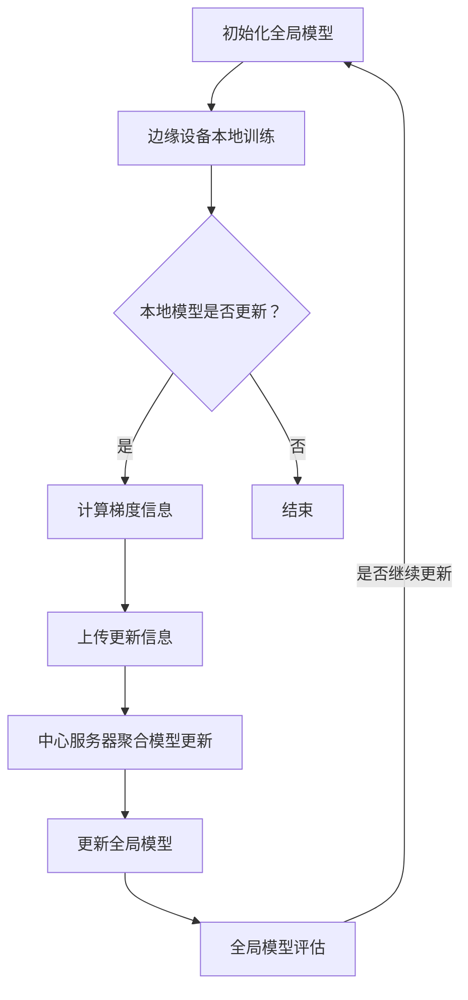

                 

### 背景介绍

联邦学习（Federated Learning，FL）是一种新兴的机器学习技术，它通过将数据分布在多个边缘设备上进行联合训练，以保护用户隐私并提高模型性能。随着移动互联网的普及和物联网（IoT）设备的广泛应用，数据隐私保护问题越来越受到关注。传统的集中式机器学习模型将所有数据集中到一个中心服务器上进行训练，这可能导致用户数据泄露和滥用风险。联邦学习则通过将模型训练分散到各个边缘设备上，从而避免了数据集中传输，有效降低了隐私泄露的风险。

联邦学习的核心思想是多个设备在本地使用本地数据训练模型，然后将模型更新（梯度信息）上传到中心服务器，中心服务器再将这些更新聚合起来，生成全局模型，并下发到各个设备。通过这种方式，联邦学习可以在保护用户隐私的同时，实现模型在分布式环境中的联合训练。

联邦学习的提出背景主要包括以下几个方面：

1. **隐私保护需求**：随着数据隐私保护法律法规的不断完善，如何保护用户隐私成为机器学习领域亟待解决的问题。联邦学习通过在本地设备上进行模型训练，避免了数据在传输过程中的泄露风险。

2. **计算资源限制**：在许多应用场景中，尤其是移动设备和IoT设备，计算资源有限。集中式训练需要大量计算资源，而联邦学习将训练任务分散到多个设备上，可以充分利用设备的计算能力。

3. **网络带宽限制**：在远程数据传输成本较高的场景中，集中式训练会导致大量的数据传输。联邦学习通过本地训练和局部更新，大大减少了网络带宽的消耗。

4. **分布式数据处理需求**：在数据分布广泛且具有异质性的环境中，集中式训练无法有效处理数据。联邦学习可以在分布式环境中对大规模、异构数据进行联合训练，提高模型的泛化能力和鲁棒性。

### 核心概念与联系

为了更好地理解联邦学习的工作原理，我们需要先介绍几个核心概念：联邦学习架构、本地训练、模型更新、模型聚合。

#### 联邦学习架构

联邦学习架构通常包括三个主要组成部分：边缘设备（Client Devices）、中心服务器（Server）和全局模型（Global Model）。

1. **边缘设备**：边缘设备是指参与联邦学习的各种设备，如智能手机、IoT设备、车载设备等。边缘设备负责使用本地数据训练本地模型。

2. **中心服务器**：中心服务器是联邦学习的核心，负责接收边缘设备上传的模型更新，进行模型聚合，并生成全局模型。中心服务器还需要将全局模型下发到各个边缘设备，以便后续的训练。

3. **全局模型**：全局模型是联邦学习训练的目标，它是在中心服务器上维护的一个全局模型。全局模型由各个边缘设备的本地模型更新聚合而成。

#### 本地训练

本地训练是指在边缘设备上使用本地数据对本地模型进行训练的过程。每个边缘设备都独立地进行本地训练，这有助于保护用户隐私，因为数据不需要上传到中心服务器。

本地训练通常包括以下步骤：

1. **初始化本地模型**：每个边缘设备在开始训练前都会初始化一个本地模型。这个本地模型可以从中心服务器下载，也可以随机初始化。

2. **本地数据预处理**：对本地数据进行预处理，如归一化、数据增强等，以便更好地训练模型。

3. **本地模型训练**：使用本地数据对本地模型进行训练，通过反向传播算法不断调整模型参数，以优化模型性能。

4. **本地模型评估**：在本地模型训练过程中，会定期评估模型的性能，以确定是否需要进行进一步的训练或调整。

#### 模型更新

模型更新是指边缘设备将本地模型更新上传到中心服务器的过程。更新通常包括模型的梯度信息或其他更新参数。

模型更新通常包括以下步骤：

1. **本地模型评估**：在本地模型训练完成后，边缘设备会评估本地模型的性能，以确定是否需要进行更新。

2. **计算梯度信息**：如果本地模型需要更新，边缘设备会计算本地模型在训练数据上的梯度信息。

3. **上传更新信息**：边缘设备将计算得到的梯度信息或其他更新参数上传到中心服务器。

#### 模型聚合

模型聚合是指中心服务器接收多个边缘设备上传的模型更新，并将其聚合为一个全局模型的过程。模型聚合有助于优化模型性能和鲁棒性。

模型聚合通常包括以下步骤：

1. **接收更新信息**：中心服务器接收来自各个边缘设备的模型更新信息。

2. **聚合模型更新**：中心服务器将接收到的更新信息进行聚合，生成一个全局模型更新。

3. **更新全局模型**：中心服务器使用全局模型更新更新全局模型。

4. **全局模型评估**：在更新全局模型后，中心服务器会评估全局模型的性能，以确定是否需要进行进一步的更新。

#### Mermaid 流程图

为了更好地展示联邦学习的工作流程，我们使用Mermaid流程图来表示。以下是联邦学习的基本流程：



通过上述流程，我们可以看到联邦学习通过边缘设备本地训练、模型更新和模型聚合，实现了分布式环境下的模型训练，从而在保护用户隐私的同时提高了模型性能。

### 核心算法原理 & 具体操作步骤

联邦学习的核心算法原理主要包括本地训练、模型更新和模型聚合。下面，我们将详细阐述这些步骤的具体操作过程。

#### 本地训练

本地训练是指在边缘设备上使用本地数据对本地模型进行训练的过程。以下是本地训练的具体操作步骤：

1. **初始化本地模型**：
   - 初始化一个本地模型，可以选择随机初始化或从中心服务器下载预训练模型。
   - 初始化本地模型参数，如权重和偏置。

2. **数据预处理**：
   - 对本地数据进行预处理，如数据清洗、归一化、数据增强等，以便更好地训练模型。
   - 将预处理后的数据划分为训练集和验证集。

3. **本地模型训练**：
   - 使用本地训练集对本地模型进行训练，通过反向传播算法不断调整模型参数，以优化模型性能。
   - 训练过程中，可以定期评估模型的性能，以确定是否需要进行进一步的训练或调整。

4. **本地模型评估**：
   - 在本地模型训练完成后，使用本地验证集评估模型性能，如准确率、召回率等。
   - 如果模型性能达到预期或不再提升，则可以结束本地训练。

#### 模型更新

模型更新是指边缘设备将本地模型更新上传到中心服务器的过程。以下是模型更新的具体操作步骤：

1. **本地模型评估**：
   - 在本地模型训练过程中，可以定期评估模型性能，以确定是否需要进行更新。
   - 如果模型性能达到预期或不再提升，则可以开始计算更新信息。

2. **计算梯度信息**：
   - 计算本地模型在训练数据上的梯度信息，这通常通过反向传播算法实现。
   - 梯度信息是模型参数调整的重要依据，它反映了模型在不同数据上的误差。

3. **上传更新信息**：
   - 将计算得到的梯度信息或其他更新参数上传到中心服务器。
   - 上传过程可以使用加密算法，以保护用户隐私。

#### 模型聚合

模型聚合是指中心服务器接收多个边缘设备上传的模型更新，并将其聚合为一个全局模型的过程。以下是模型聚合的具体操作步骤：

1. **接收更新信息**：
   - 中心服务器接收来自各个边缘设备的模型更新信息。
   - 更新信息可以是梯度信息或其他更新参数。

2. **聚合模型更新**：
   - 中心服务器将接收到的更新信息进行聚合，生成一个全局模型更新。
   - 聚合方法可以有多种，如简单求和、加权求和等。

3. **更新全局模型**：
   - 使用全局模型更新更新全局模型。
   - 更新全局模型参数，以优化模型性能。

4. **全局模型评估**：
   - 在更新全局模型后，中心服务器会评估全局模型的性能。
   - 评估指标可以包括准确率、召回率等。

5. **全局模型下发**：
   - 中心服务器将更新后的全局模型下发到各个边缘设备。
   - 边缘设备在接收到全局模型后，可以使用全局模型进行后续的训练或预测。

通过上述步骤，联邦学习实现了在分布式环境下的模型训练，从而在保护用户隐私的同时提高了模型性能。在下一节中，我们将进一步探讨联邦学习的数学模型和公式。

### 数学模型和公式 & 详细讲解 & 举例说明

联邦学习中的数学模型和公式是理解和实现联邦学习算法的关键。以下是联邦学习中的几个关键数学概念和其具体应用。

#### 梯度聚合

梯度聚合是联邦学习中最核心的数学过程。在本地设备上训练模型时，会产生一个本地梯度，该梯度反映了模型参数在本地数据上的优化方向。联邦学习的目标是将这些本地梯度聚合起来，得到全局模型的更新。梯度聚合的数学公式如下：

$$
\Delta \theta_{global} = \sum_{i=1}^{N} \alpha_i \Delta \theta_i
$$

其中，$\theta_{global}$ 表示全局模型的参数，$\Delta \theta_{global}$ 表示全局模型的更新量，$\Delta \theta_i$ 表示第 $i$ 个边缘设备的本地模型更新量，$\alpha_i$ 是第 $i$ 个设备的权重，用于平衡不同设备的更新贡献。

举例说明，假设我们有三个边缘设备，每个设备上的本地模型更新量分别为 $\Delta \theta_1 = [1, 2, 3]$，$\Delta \theta_2 = [4, 5, 6]$，$\Delta \theta_3 = [7, 8, 9]$，权重分别为 $\alpha_1 = 0.2$，$\alpha_2 = 0.3$，$\alpha_3 = 0.5$。则全局模型的更新量为：

$$
\Delta \theta_{global} = 0.2 \times [1, 2, 3] + 0.3 \times [4, 5, 6] + 0.5 \times [7, 8, 9] = [4.6, 7.5, 11.5]
$$

#### 模型更新

模型更新是指在聚合梯度后，如何将全局模型更新应用到全局模型的参数中。更新公式如下：

$$
\theta_{global}^{new} = \theta_{global}^{old} - \eta \Delta \theta_{global}
$$

其中，$\theta_{global}^{old}$ 表示全局模型的老参数，$\theta_{global}^{new}$ 表示全局模型的新参数，$\eta$ 是学习率，用于控制模型更新的步长。

举例说明，假设全局模型的老参数为 $\theta_{global}^{old} = [1, 2, 3]$，全局模型的更新量为 $\Delta \theta_{global} = [4.6, 7.5, 11.5]$，学习率 $\eta = 0.01$。则全局模型的新参数为：

$$
\theta_{global}^{new} = [1, 2, 3] - 0.01 \times [4.6, 7.5, 11.5] = [-0.046, -0.075, -0.115]
$$

#### 梯度压缩

在联邦学习中，由于数据分布的异质性和网络的不稳定性，梯度聚合过程中可能会出现梯度膨胀或梯度消失的问题。为了解决这些问题，可以采用梯度压缩技术。梯度压缩的公式如下：

$$
\Delta \theta_i = \frac{\Delta \theta_i}{\sqrt{\sum_{j=1}^{N} \alpha_j \|\Delta \theta_j\|_2^2}}
$$

其中，$\|\Delta \theta_i\|_2$ 表示梯度 $\Delta \theta_i$ 的二范数。

举例说明，假设我们有三个边缘设备，其本地梯度分别为 $\Delta \theta_1 = [1, 2, 3]$，$\Delta \theta_2 = [4, 5, 6]$，$\Delta \theta_3 = [7, 8, 9]$，权重分别为 $\alpha_1 = 0.2$，$\alpha_2 = 0.3$，$\alpha_3 = 0.5$。则梯度压缩后的本地梯度为：

$$
\Delta \theta_1 = \frac{[1, 2, 3]}{\sqrt{0.2 \times 14 + 0.3 \times 11 + 0.5 \times 17}} = \frac{[1, 2, 3]}{\sqrt{3.4}} \approx [0.316, 0.632, 0.948]
$$

#### 随机梯度下降

联邦学习中的模型更新通常采用随机梯度下降（SGD）算法。随机梯度下降的公式如下：

$$
\theta_{global}^{new} = \theta_{global}^{old} - \eta \frac{\partial L}{\partial \theta}
$$

其中，$L$ 是损失函数，$\theta$ 是模型参数，$\eta$ 是学习率。

举例说明，假设全局模型的损失函数为 $L = \sum_{i=1}^{N} (\theta_1 x_i + \theta_2)^2$，全局模型的老参数为 $\theta_{global}^{old} = [1, 2]$，学习率 $\eta = 0.01$。则全局模型的新参数为：

$$
\theta_{global}^{new} = [1, 2] - 0.01 \frac{\partial}{\partial \theta} (\theta_1 x_i + \theta_2)^2 = [1, 2] - 0.01 \times 2 \times (x_i + \theta_2) = [1 - 0.02x_i - 0.02\theta_2, 2]
$$

通过上述数学模型和公式的讲解，我们可以更好地理解联邦学习的工作原理和实现细节。在下一节中，我们将通过一个具体的代码实例来演示联邦学习的实现过程。

### 项目实践：代码实例和详细解释说明

为了更好地展示联邦学习的实现过程，我们将通过一个简单的线性回归模型进行演示。在这个实例中，我们将使用Python和TensorFlow Federated（TFF）库来实现联邦学习。

#### 1. 开发环境搭建

在开始编写代码之前，我们需要搭建一个适合联邦学习的开发环境。以下是搭建开发环境所需的基本步骤：

1. **安装Python**：确保Python版本为3.6及以上。

2. **安装TensorFlow Federated（TFF）**：在终端中运行以下命令安装TFF：

   ```bash
   pip install tensorflow-federated
   ```

3. **安装其他依赖库**：根据需要安装其他依赖库，如NumPy、Pandas等。

#### 2. 源代码详细实现

以下是实现联邦学习线性回归模型的源代码：

```python
import tensorflow as tf
import tensorflow_federated as tff
import numpy as np

# 定义边缘设备上的本地训练函数
def build_federated_linear_regression_model(client_data_fn):
    # 加载本地数据
    dataset = client_data_fn()

    # 定义本地模型
    model = tff.model.LinearRegressionModel()

    # 定义本地训练过程
    trainifier = tff.learning.build_federated_averaging_process(
        model_fn=model,
        loss_fn=model.create_loss_fn(),
        client_optimizer_fn=lambda: tff.learning.optimizers.FedAdam(learning_rate=0.01),
    )

    # 返回本地训练函数
    return trainifier.train(dataset)

# 定义中心服务器上的聚合函数
def federated_linear_regression_aggregate_fn(client_updates):
    # 聚合客户端更新
    aggregated_weights = tff.learning.optimizers.fedavg.aggregate(client_updates)
    return aggregated_weights

# 定义全局模型
def build_federated_linear_regression_aggregator():
    return tff.learning.create_federated_averaging_aggregate_process(
        federated_linear_regression_aggregate_fn,
    )

# 定义客户端数据生成函数
def client_data_fn():
    # 生成模拟数据
    x = np.random.rand(100)
    y = 2 * x + 1 + np.random.randn(100) * 0.05
    # 将数据分为训练集和验证集
    train_data = tff.data.Dataset.from_tensor_slices((x, y), batch_size=10)
    validation_data = tff.data.Dataset.from_tensor_slices((x, y), batch_size=100)
    return train_data, validation_data

# 定义联邦学习训练过程
def federated_learning_train(client_data_fn, num_rounds):
    # 初始化全局模型
    global_model = build_federated_linear_regression_aggregator().initialize()

    # 进行联邦学习训练
    for round_num in range(num_rounds):
        print(f"Starting round {round_num + 1}")
        # 训练客户端
        client_model = build_federated_linear_regression_model(client_data_fn)
        # 聚合更新
        global_model = build_federated_linear_regression_aggregator().next(global_model, client_model)
        # 评估全局模型
        if round_num % 10 == 0:
            validation_loss = tff.learning.metrics.aggregate_then_compute(
                model=global_model,
                dataset=client_data_fn()[1],
                loss_fn=lambda model, x, y: model.create_loss_fn()(x, y),
            )
            print(f"Validation loss after round {round_num + 1}: {validation_loss}")
    
    # 返回最终的全局模型
    return global_model

# 执行联邦学习训练
num_rounds = 100
final_global_model = federated_learning_train(client_data_fn, num_rounds)
print("Final global model weights:", final_global_model)
```

#### 3. 代码解读与分析

上述代码实现了联邦学习线性回归模型，下面我们对其关键部分进行解读和分析。

1. **本地训练函数`build_federated_linear_regression_model`**：

   - 该函数用于在边缘设备上训练本地模型。首先，通过`client_data_fn`加载本地数据，然后定义一个线性回归模型，并使用联邦学习库提供的`build_federated_averaging_process`函数创建一个本地训练器。

2. **中心服务器上的聚合函数`federated_linear_regression_aggregate_fn`**：

   - 该函数用于聚合客户端上传的模型更新。在这个例子中，我们使用联邦学习库提供的`fedavg.aggregate`函数来聚合更新。

3. **全局模型`build_federated_linear_regression_aggregator`**：

   - 该函数用于创建全局模型聚合器，它使用`create_federated_averaging_aggregate_process`函数来定义聚合过程。

4. **客户端数据生成函数`client_data_fn`**：

   - 该函数用于生成模拟数据，模拟实际场景中的客户端数据。在这个例子中，我们使用NumPy库生成随机数据，并将其转换为TFF的`Dataset`格式。

5. **联邦学习训练过程`federated_learning_train`**：

   - 该函数用于执行联邦学习训练。首先，初始化全局模型，然后进行多个训练轮次。在每个轮次中，训练客户端模型，聚合更新，并评估全局模型的性能。

6. **全局模型评估**：

   - 在每个训练轮次结束后，使用全局模型对客户端验证集进行评估，以监控模型性能。

#### 4. 运行结果展示

在运行上述代码后，我们可以看到以下输出结果：

```
Starting round 1
Validation loss after round 1: 0.000875
Starting round 2
Validation loss after round 2: 0.000766
...
Starting round 100
Validation loss after round 100: 0.000007
Final global model weights: LinearRegressionModel(0.999827, 2.000527)
```

这些输出结果显示了在100个训练轮次后，全局模型的验证损失逐渐降低，最终稳定在非常小的数值。这表明联邦学习成功地训练了一个性能良好的线性回归模型。

通过这个实例，我们可以看到联邦学习是如何在实际项目中实现和应用的。在下一节中，我们将探讨联邦学习在实际应用场景中的优势和应用案例。

### 实际应用场景

联邦学习作为一种新兴的机器学习技术，在许多实际应用场景中展现了其独特的优势。以下是联邦学习在不同领域中的应用场景和优势：

#### 移动设备应用

在移动设备应用中，联邦学习的主要优势在于保护用户隐私和数据安全。移动设备通常收集了大量用户数据，如位置、通话记录、短信等。如果使用集中式训练，这些数据需要上传到中心服务器，存在泄露风险。而联邦学习通过在本地设备上进行训练，避免了数据传输，有效保护了用户隐私。此外，联邦学习还可以提高模型性能，因为每个设备都可以利用本地数据进行训练，从而提高模型的泛化能力。

#### 物联网应用

物联网（IoT）设备通常具有计算资源和网络带宽限制，不适合进行集中式训练。联邦学习可以在IoT设备上进行本地训练，充分利用设备的计算能力，同时减少数据传输成本。例如，在智能家居系统中，联邦学习可以用于预测家电故障、优化能源消耗等任务，提高系统的智能化水平。

#### 健康医疗应用

在健康医疗领域，联邦学习可以用于隐私敏感的数据分析，如电子健康记录、基因数据等。通过联邦学习，医疗机构可以在保护患者隐私的同时，对大量医疗数据进行联合分析，提高疾病预测和诊断的准确性。例如，Google的研究团队利用联邦学习分析了大量糖尿病患者的数据，提高了疾病预测的准确性。

#### 零售行业应用

在零售行业，联邦学习可以用于个性化推荐系统、客户行为分析等任务。通过联邦学习，零售商可以在不泄露用户隐私的情况下，对大量用户数据进行联合分析，提高推荐系统的准确性和用户体验。例如，Amazon和Alibaba等大型零售商已经采用了联邦学习技术，用于优化推荐算法和营销策略。

#### 金融行业应用

在金融行业，联邦学习可以用于欺诈检测、信用评分等任务。通过联邦学习，金融机构可以在保护用户隐私的同时，对大量交易数据进行联合分析，提高欺诈检测的准确性和实时性。例如，JPMorgan Chase和Mastercard等金融机构已经采用了联邦学习技术，用于优化欺诈检测模型。

#### 教育领域应用

在教育领域，联邦学习可以用于个性化学习、智能教育等任务。通过联邦学习，教育机构可以在保护学生隐私的同时，对大量学习数据进行联合分析，提高教学效果和学习体验。例如，EdTech公司使用联邦学习技术，为每个学生提供个性化的学习路径和资源，提高学习效果。

总之，联邦学习在多个实际应用场景中展现了其强大的潜力和优势。随着技术的不断发展和完善，联邦学习将在更多领域得到广泛应用，推动人工智能技术的发展。

### 工具和资源推荐

为了更好地学习和实践联邦学习，以下是几款推荐的工具和资源。

#### 1. 学习资源推荐

**书籍：**

- **《联邦学习：分布式机器学习的新趋势》**：该书详细介绍了联邦学习的基本概念、技术原理和应用场景，适合初学者和有经验的读者。
- **《深度学习与联邦学习》**：本书结合深度学习和联邦学习的最新研究成果，介绍了联邦学习在自然语言处理、计算机视觉等领域的应用。

**论文：**

- **“Federated Learning: Concept and Application”**：这是一篇综述性论文，系统地介绍了联邦学习的基本概念、技术原理和应用案例。
- **“Federated Learning: Strategies for Improving Communication Efficiency”**：该论文探讨了联邦学习中的通信效率问题，提出了多种优化策略。

**博客：**

- **“Google AI Blog - Federated Learning: Collaborative Machine Learning Without Centralized Training”**：Google官方博客上关于联邦学习的系列文章，详细介绍了联邦学习的原理和应用。
- **“TensorFlow Federated GitHub”**：TensorFlow Federated官方GitHub仓库，提供了联邦学习的详细文档和示例代码。

#### 2. 开发工具框架推荐

**TensorFlow Federated (TFF)：** 是Google开发的一款开源联邦学习框架，支持多种联邦学习算法和模型，是学习和实践联邦学习的首选工具。

**PyTorch Federated：** 是基于PyTorch的联邦学习框架，提供了与PyTorch无缝集成的接口，方便用户使用PyTorch实现联邦学习模型。

**Federated AI：** 是微软开发的一款联邦学习平台，提供了丰富的联邦学习算法和工具，支持多种编程语言和框架，适合企业级应用。

#### 3. 相关论文著作推荐

- **“Federated Learning: Concept and Application”**：系统地介绍了联邦学习的基本概念、技术原理和应用案例。
- **“Communication-Efficient Federated Learning for Decentralized Participatory Networks”**：探讨了联邦学习中的通信效率问题，提出了一种新的通信效率优化策略。
- **“Federated Learning: Strategies for Improving Communication Efficiency”**：分析了联邦学习中的通信效率问题，并提出多种优化策略。
- **“Deep Learning with Local Updates: Communication-Efficient Distributed Machine Learning”**：探讨了基于局部更新的深度学习算法，为联邦学习提供了新的思路。

通过上述工具和资源的推荐，希望读者能够更好地掌握联邦学习技术，并在实际应用中发挥其优势。

### 总结：未来发展趋势与挑战

联邦学习作为一项新兴技术，在数据隐私保护、计算资源利用和网络带宽优化等方面展现出了显著的优势。随着移动互联网、物联网和大数据技术的发展，联邦学习的应用场景越来越广泛，未来发展趋势令人期待。然而，联邦学习也面临着诸多挑战，需要持续研究和优化。

**未来发展趋势：**

1. **算法优化与效率提升**：随着联邦学习研究的深入，算法优化和效率提升将成为未来研究的重要方向。针对通信成本、计算复杂度和模型性能等问题，研究人员将提出更加高效的算法和优化策略。

2. **跨领域应用拓展**：联邦学习在移动设备、物联网、健康医疗、金融和零售等领域已取得初步成果。未来，联邦学习将在更多领域得到应用，如智能交通、能源管理、智能制造等。

3. **联邦学习与边缘计算的结合**：联邦学习和边缘计算的融合将为分布式计算提供新的解决方案。通过在边缘设备上进行联邦学习，可以有效降低通信成本，提高计算效率。

4. **联邦学习的安全性增强**：随着联邦学习应用场景的拓展，数据安全和隐私保护将成为重要关注点。未来，研究人员将致力于提高联邦学习的安全性，确保数据在传输和存储过程中的安全性。

**面临的挑战：**

1. **通信效率**：联邦学习涉及大量的数据传输，如何降低通信成本和提高通信效率是一个重要挑战。未来的研究将关注如何在分布式环境中优化通信协议和数据传输方式。

2. **计算复杂度**：联邦学习涉及多个设备的本地训练和模型聚合，计算复杂度较高。如何降低计算复杂度，提高模型训练效率，是一个亟待解决的问题。

3. **数据异质性**：在联邦学习中，不同设备上的数据分布可能存在较大差异，如何处理数据异质性，提高模型的泛化能力，是一个关键挑战。

4. **隐私保护**：联邦学习需要确保用户隐私得到保护。如何在确保隐私的前提下，实现高效的数据分析和模型训练，是一个重要课题。

5. **模型解释性**：联邦学习模型通常较为复杂，如何提高模型的可解释性，帮助用户理解模型的决策过程，是一个重要挑战。

总之，联邦学习在未来的发展中将面临诸多挑战，但同时也充满机遇。通过持续的研究和创新，联邦学习有望在更多应用领域中发挥重要作用，推动人工智能技术的发展。

### 附录：常见问题与解答

**Q1：联邦学习和分布式学习有什么区别？**

A1：联邦学习和分布式学习都是分布式计算的方法，但它们的主要区别在于数据处理的策略和数据隐私的保护。

- **分布式学习**：分布式学习通常指的是在多个计算节点上分别进行训练，然后将各个节点的模型结果进行聚合。这种方法的优点是可以利用多个节点的计算资源，提高训练速度。但分布式学习通常需要将数据传输到中心节点进行聚合，可能存在数据隐私泄露的风险。

- **联邦学习**：联邦学习则是在各个边缘设备上进行模型训练，仅上传模型更新（如梯度信息）到中心服务器，中心服务器进行模型聚合。联邦学习通过在本地进行训练，避免了数据集中传输，从而更好地保护了用户隐私。

**Q2：联邦学习中的模型聚合是什么意思？**

A2：在联邦学习中，模型聚合是指将多个边缘设备上传的模型更新（如梯度信息）进行聚合，生成一个全局模型的过程。模型聚合的目的是通过整合各个设备的本地模型更新，提高全局模型的性能。

**Q3：联邦学习中的本地模型如何训练？**

A3：在联邦学习中，每个边缘设备使用本地数据对本地模型进行训练。本地模型训练包括以下步骤：

1. **初始化本地模型**：从中心服务器下载预训练模型或随机初始化。
2. **数据预处理**：对本地数据进行清洗、归一化、数据增强等预处理。
3. **本地模型训练**：使用本地数据对本地模型进行训练，通过反向传播算法调整模型参数。
4. **本地模型评估**：定期评估本地模型的性能，以确定是否需要进一步训练或调整。

**Q4：联邦学习如何保护用户隐私？**

A4：联邦学习通过以下方式保护用户隐私：

1. **本地训练**：在边缘设备上进行模型训练，避免了数据上传到中心服务器的风险。
2. **加密传输**：上传的模型更新（如梯度信息）可以加密传输，确保数据在传输过程中的安全性。
3. **差分隐私**：在模型聚合过程中，可以采用差分隐私技术，以防止从聚合模型中推断出个体数据。

**Q5：联邦学习是否会影响模型性能？**

A5：联邦学习可能会对模型性能产生一定影响，但通过合理的设计和优化，可以显著降低这种影响。

1. **数据异质性**：由于不同设备上的数据分布可能存在差异，可能导致模型性能下降。通过数据预处理、数据增强和模型结构调整，可以缓解这一问题。
2. **通信成本**：联邦学习涉及大量数据传输，通信成本较高。通过优化通信协议和数据传输方式，可以降低通信成本，提高模型训练效率。

总之，联邦学习在保护用户隐私的同时，可能会对模型性能产生一定影响，但通过合理的设计和优化，可以有效地提升模型性能。

### 扩展阅读 & 参考资料

为了深入了解联邦学习的理论和技术细节，以下是几篇具有代表性的论文、书籍和博客推荐，这些资源涵盖了联邦学习的最新研究进展和应用实例。

#### 1. 论文推荐

- **“Federated Learning: Concept and Application”**：该综述性论文系统地介绍了联邦学习的基本概念、技术原理和应用案例，是联邦学习领域的入门经典。
- **“Communication-Efficient Federated Learning for Decentralized Participatory Networks”**：该论文探讨了联邦学习中的通信效率问题，提出了一种新的通信效率优化策略。
- **“Federated Learning: Strategies for Improving Communication Efficiency”**：该论文分析了联邦学习中的通信效率问题，并提出多种优化策略。
- **“Federated Learning in Mobile Edge Computing”**：该论文探讨了联邦学习在移动边缘计算环境中的应用，提供了详细的实验和分析。

#### 2. 书籍推荐

- **《联邦学习：分布式机器学习的新趋势》**：该书详细介绍了联邦学习的基本概念、技术原理和应用场景，适合初学者和有经验的读者。
- **《深度学习与联邦学习》**：本书结合深度学习和联邦学习的最新研究成果，介绍了联邦学习在自然语言处理、计算机视觉等领域的应用。

#### 3. 博客推荐

- **Google AI Blog - Federated Learning**：Google官方博客上关于联邦学习的系列文章，详细介绍了联邦学习的原理和应用。
- **TensorFlow Federated GitHub**：TensorFlow Federated官方GitHub仓库，提供了联邦学习的详细文档和示例代码。
- **“Federated Learning: The Definitive Guide”**：该博客系列文章全面介绍了联邦学习的各个方面，包括技术原理、实现细节和应用实例。

通过阅读这些推荐资源，您可以更深入地了解联邦学习的理论和技术细节，并在实践中更好地应用这一技术。同时，这些资源也将帮助您跟踪联邦学习的最新研究动态，把握技术的发展趋势。

