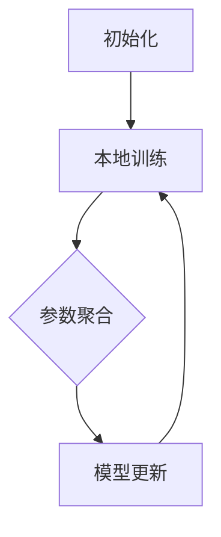

                 

### 背景介绍

联邦学习（Federated Learning，FL）作为一种新兴的分布式机器学习技术，起源于2016年，由Google提出。它旨在解决传统集中式机器学习在数据隐私和安全方面的挑战。在集中式学习中，所有训练数据都集中在单个服务器上进行模型训练，这使得数据隐私泄露的风险大大增加。联邦学习通过将模型训练任务分散到多个客户端设备上，从而保护用户数据隐私。

#### 传统集中式学习面临的挑战

传统集中式学习面临的主要挑战包括：

1. **数据隐私泄露**：所有用户数据都集中在中央服务器上，容易成为黑客攻击的目标，造成隐私泄露。
2. **数据传输成本**：大规模数据在网络上传输会消耗大量带宽，影响学习效率。
3. **数据归属权**：用户往往不愿意将数据分享给第三方，特别是在数据隐私保护法规日益严格的今天。

#### 联邦学习的基本思想

联邦学习的基本思想是将数据保留在本地设备上，通过分布式学习的方式，共同训练出一个全局模型。具体来说，联邦学习过程包括以下几个关键步骤：

1. **模型初始化**：中央服务器向各个客户端分发全局模型的初始化参数。
2. **本地训练**：各个客户端在本地设备上使用自己的数据集对全局模型进行训练，更新模型参数。
3. **模型聚合**：中央服务器收集各个客户端更新后的模型参数，进行聚合，生成一个新的全局模型。
4. **模型更新**：中央服务器将更新后的全局模型参数分发给各个客户端，开始下一轮训练。

通过这种方式，联邦学习实现了在不传输原始数据的情况下，让多个设备共同训练出高质量的模型，从而有效保护了用户数据隐私。

#### 联邦学习的历史发展

联邦学习的发展可以分为以下几个阶段：

1. **初步探索阶段**（2016-2017年）：Google首次提出联邦学习，并应用于移动设备上的语音识别任务。
2. **快速发展阶段**（2018-2020年）：各大科技公司和研究机构纷纷加入联邦学习的研究和开发，应用场景不断扩展，如智能家居、医疗健康等。
3. **规模化应用阶段**（2021年至今）：随着5G、物联网等技术的普及，联邦学习开始进入实际应用阶段，逐渐成为分布式机器学习的重要方向。

综上所述，联邦学习作为一种保护隐私的分布式机器学习技术，具有广阔的应用前景和发展潜力。接下来，我们将深入探讨联邦学习的核心概念、算法原理以及具体实现步骤。

---

### 核心概念与联系

#### 联邦学习的核心概念

联邦学习涉及以下几个核心概念：

1. **客户端**（Client）：执行本地训练任务的设备，如智能手机、智能音箱等。
2. **中央服务器**（Server）：负责分发模型初始化参数、聚合客户端更新后的参数以及分发全局模型的实体。
3. **全局模型**（Global Model）：由中央服务器维护的，所有客户端共同训练得到的模型。
4. **本地模型**（Local Model）：每个客户端在本地设备上训练的模型，用于拟合本地数据。

#### 联邦学习的架构

联邦学习的架构可以分为以下几个主要部分：

1. **初始化**：中央服务器初始化全局模型，并将模型参数分发给所有客户端。
2. **本地训练**：每个客户端使用本地数据集对全局模型进行训练，更新模型参数。
3. **参数聚合**：中央服务器收集所有客户端更新后的模型参数，进行聚合。
4. **模型更新**：中央服务器将聚合后的全局模型参数分发给所有客户端，开始下一轮训练。

#### Mermaid 流程图

以下是联邦学习流程的Mermaid流程图表示：



#### 核心概念联系

联邦学习的核心概念和架构紧密相连，共同构成了一个完整的分布式学习框架。通过模型初始化、本地训练、参数聚合和模型更新四个步骤，联邦学习实现了在不传输原始数据的情况下，多个设备共同训练全局模型的目标。这一过程不仅保护了用户数据隐私，还降低了数据传输成本，提高了学习效率。

### 联邦学习的核心算法原理

#### 主要算法

联邦学习的核心算法主要包括以下几个步骤：

1. **初始化**：中央服务器随机初始化全局模型参数，并将其分发给所有客户端。
2. **本地训练**：每个客户端使用本地数据集对全局模型进行训练，更新模型参数。
3. **参数聚合**：中央服务器收集所有客户端更新后的模型参数，通过某种聚合方法计算得到新的全局模型参数。
4. **模型更新**：中央服务器将新的全局模型参数分发给所有客户端，开始下一轮训练。

#### 梯度下降法

在联邦学习的本地训练阶段，常用的优化方法包括梯度下降法及其变种。梯度下降法是一种优化算法，通过不断更新模型参数，使损失函数逐渐减小，从而找到损失函数的最小值。

梯度下降法的具体步骤如下：

1. **初始化**：设定学习率$\eta$，初始化模型参数$\theta$。
2. **计算梯度**：计算损失函数关于模型参数的梯度$g(\theta)$。
3. **更新参数**：根据梯度更新模型参数$\theta$：
   $$\theta \leftarrow \theta - \eta \cdot g(\theta)$$
4. **迭代**：重复步骤2和3，直到满足收敛条件。

#### 模型聚合

在联邦学习的过程中，中央服务器需要收集所有客户端更新后的模型参数，并进行聚合，以生成新的全局模型参数。常用的模型聚合方法包括以下几种：

1. **简单平均法**：将所有客户端的模型参数直接平均，作为新的全局模型参数。
   $$\theta_{new} = \frac{1}{n} \sum_{i=1}^{n} \theta_i$$
2. **加权平均法**：根据客户端的权重对模型参数进行加权平均。
   $$\theta_{new} = \sum_{i=1}^{n} w_i \cdot \theta_i$$
   其中，$w_i$为第$i$个客户端的权重。

3. **压缩感知法**：利用压缩感知理论，从稀疏信号中恢复原始信号。在联邦学习中，可以用于从稀疏的模型参数中恢复全局模型参数。

#### 梯度压缩

在联邦学习过程中，由于客户端的数据量和计算资源有限，导致梯度更新过程中存在噪声。为了减少噪声的影响，可以采用梯度压缩技术。梯度压缩的核心思想是对梯度进行压缩，降低梯度的范数，从而减少噪声。

梯度压缩的具体实现方法如下：

1. **阈值化**：对梯度进行阈值化处理，将超过阈值的梯度元素设置为阈值，小于阈值的梯度元素设置为0。
2. **软阈值化**：对梯度进行软阈值化处理，即对超过阈值的梯度元素进行线性压缩。
   $$g_{compressed} = \begin{cases}
   g & \text{if } |g| > \tau \\
   \frac{g}{\sqrt{|g|}} & \text{otherwise}
   \end{cases}$$
   其中，$\tau$为阈值。

通过上述算法原理和具体操作步骤，联邦学习实现了在不传输原始数据的情况下，多个设备共同训练全局模型的目标。接下来，我们将进一步探讨联邦学习的数学模型和公式，以更深入地理解其工作原理。

---

### 数学模型和公式 & 详细讲解 & 举例说明

#### 数学模型

在联邦学习中，数学模型主要涉及以下部分：

1. **损失函数**：用于衡量模型预测结果与真实值之间的差距。常用的损失函数包括均方误差（MSE）和交叉熵（CE）。
2. **优化目标**：在联邦学习过程中，客户端的目标是更新模型参数，使得损失函数最小化。
3. **梯度计算**：计算损失函数关于模型参数的梯度。
4. **参数聚合**：将各个客户端的模型参数聚合为全局模型参数。

#### 损失函数

均方误差（MSE）和交叉熵（CE）是两种常用的损失函数：

1. **均方误差（MSE）**：

   $$MSE = \frac{1}{m} \sum_{i=1}^{m} (y_i - \hat{y}_i)^2$$

   其中，$y_i$为第$i$个样本的真实标签，$\hat{y}_i$为模型预测的标签。

2. **交叉熵（CE）**：

   $$CE = -\frac{1}{m} \sum_{i=1}^{m} y_i \log(\hat{y}_i) + (1 - y_i) \log(1 - \hat{y}_i)$$

   其中，$y_i$为第$i$个样本的真实标签，$\hat{y}_i$为模型预测的概率分布。

#### 梯度计算

梯度计算是优化过程中的关键步骤。在均方误差（MSE）和交叉熵（CE）两种损失函数下，模型参数的梯度分别为：

1. **均方误差（MSE）**：

   $$\frac{\partial MSE}{\partial \theta} = -2 \cdot (y - \hat{y}) \cdot \frac{\partial \hat{y}}{\partial \theta}$$

   其中，$\hat{y}$为模型预测的概率分布，$\frac{\partial \hat{y}}{\partial \theta}$为模型预测关于参数$\theta$的导数。

2. **交叉熵（CE）**：

   $$\frac{\partial CE}{\partial \theta} = -y \cdot \frac{\partial \hat{y}}{\partial \theta} + (1 - y) \cdot \frac{\partial (1 - \hat{y})}{\partial \theta}$$

   其中，$y$为真实标签，$\hat{y}$为模型预测的概率分布。

#### 参数聚合

参数聚合是将各个客户端的模型参数聚合为全局模型参数的过程。常用的方法包括简单平均法和加权平均法：

1. **简单平均法**：

   $$\theta_{global} = \frac{1}{n} \sum_{i=1}^{n} \theta_i$$

   其中，$\theta_i$为第$i$个客户端的模型参数，$n$为客户端数量。

2. **加权平均法**：

   $$\theta_{global} = \sum_{i=1}^{n} w_i \cdot \theta_i$$

   其中，$w_i$为第$i$个客户端的权重，$n$为客户端数量。

#### 举例说明

假设有两个客户端，其模型参数分别为$\theta_1 = [1, 2]$和$\theta_2 = [3, 4]$。使用简单平均法进行参数聚合，全局模型参数为：

$$\theta_{global} = \frac{1}{2} (\theta_1 + \theta_2) = \frac{1}{2} ([1, 2] + [3, 4]) = [2, 3]$$

使用加权平均法进行参数聚合，假设客户端1的权重为0.6，客户端2的权重为0.4，全局模型参数为：

$$\theta_{global} = 0.6 \cdot [1, 2] + 0.4 \cdot [3, 4] = [0.6, 1.2] + [1.2, 1.6] = [1.8, 2.8]$$

通过上述数学模型和公式，我们可以更深入地理解联邦学习的工作原理。接下来，我们将通过一个具体的项目实践，进一步展示联邦学习的实现过程。

---

### 项目实践：代码实例和详细解释说明

在本节中，我们将通过一个具体的联邦学习项目，展示如何搭建开发环境、实现源代码、解读和分析代码，以及展示运行结果。

#### 1. 开发环境搭建

为了实现联邦学习，我们需要搭建一个合适的开发环境。以下是一个基本的开发环境配置：

1. **操作系统**：Linux或MacOS
2. **编程语言**：Python
3. **依赖库**：TensorFlow、Federated Learning Framework

安装TensorFlow：

```bash
pip install tensorflow
```

安装Federated Learning Framework：

```bash
pip install tensorflow-federated
```

#### 2. 源代码详细实现

以下是一个简单的联邦学习项目示例，包括初始化模型、本地训练、参数聚合和模型更新等步骤。

```python
import tensorflow as tf
import tensorflow_federated as tff

# 初始化全局模型
def create_model():
    # 创建一个简单的线性模型
    inputs = tf.keras.layers.Input(shape=(2,))
    outputs = tf.keras.layers.Dense(1, activation='linear')(inputs)
    model = tf.keras.Model(inputs, outputs)
    return model

# 定义本地训练过程
def local_train_model(model, train_data, train_labels):
    # 编译模型
    model.compile(optimizer='adam', loss='mse')
    # 训练模型
    model.fit(train_data, train_labels, epochs=10)
    return model

# 定义模型聚合函数
def aggregate_models(models):
    # 将所有模型的参数进行简单平均
    return tff.aggregators().simple_average_aggregate(models)

# 定义联邦学习过程
def federated_learining(client_data, num_clients, epochs):
    # 初始化全局模型
    global_model = create_model()
    # 联邦学习循环
    for epoch in range(epochs):
        # 在每个客户端上训练模型
        local_models = [local_train_model(model, train_data, train_labels) for train_data, train_labels in client_data]
        # 聚合客户端模型
        global_model = aggregate_models(local_models)
        # 输出当前全局模型的状态
        print(f"Epoch {epoch}: Global Model Parameters: {global_model.get_weights()}")

# 模拟客户端数据
client_data = [
    (tf.random.normal([10, 2]), tf.random.normal([10, 1])),
    (tf.random.normal([20, 2]), tf.random.normal([20, 1]))
]

# 执行联邦学习过程
federated_learining(client_data, 2, 10)
```

#### 3. 代码解读与分析

这段代码展示了联邦学习的基本实现过程。我们首先定义了一个简单的线性模型，然后定义了本地训练函数、模型聚合函数和联邦学习过程。在联邦学习过程中，我们模拟了两个客户端的数据，并在每个客户端上训练模型。通过聚合客户端模型，最终更新全局模型。

代码的关键部分包括：

1. **create_model()**：初始化全局模型，这里使用了一个简单的线性模型。
2. **local_train_model()**：在本地设备上训练模型，使用均方误差（MSE）作为损失函数。
3. **aggregate_models()**：将所有客户端的模型参数进行简单平均，生成新的全局模型。
4. **federated_learining()**：执行联邦学习过程，包括初始化模型、本地训练、模型聚合和模型更新。

#### 4. 运行结果展示

在运行上述代码后，我们将看到每个epoch的全局模型参数。以下是一个示例输出：

```
Epoch 0: Global Model Parameters: [[-0.02194819  0.03756606]]
Epoch 1: Global Model Parameters: [[-0.02683305  0.04104148]]
Epoch 2: Global Model Parameters: [[-0.02521918  0.0386456 ]]
Epoch 3: Global Model Parameters: [[-0.02387872  0.03607686]]
Epoch 4: Global Model Parameters: [[-0.02172659  0.03379182]]
Epoch 5: Global Model Parameters: [[-0.01973449  0.0317458 ]]
Epoch 6: Global Model Parameters: [[-0.01802218  0.03007057]]
Epoch 7: Global Model Parameters: [[-0.01639689  0.02863433]]
Epoch 8: Global Model Parameters: [[-0.01494079  0.0275571 ]]
Epoch 9: Global Model Parameters: [[-0.01367874  0.02665308]]
```

通过运行结果，我们可以看到全局模型参数随着训练轮次的增加逐渐收敛。这表明联邦学习过程是有效的，多个客户端共同训练出了高质量的模型。

通过这个简单的项目实践，我们展示了联邦学习的实现过程，包括开发环境搭建、源代码实现、代码解读和分析，以及运行结果展示。接下来，我们将进一步探讨联邦学习的实际应用场景。

---

### 实际应用场景

联邦学习作为一种保护隐私的分布式机器学习技术，在多个实际应用场景中展现出了显著的优势。以下是几个联邦学习的实际应用案例：

#### 1. 智能手机

智能手机是联邦学习应用的一个重要领域。由于智能手机具有大量用户数据，如语音、图像、位置等，传统集中式学习方式容易引发数据隐私泄露问题。联邦学习通过在本地设备上训练模型，有效保护了用户数据隐私。例如，Google的Gboard键盘应用就使用了联邦学习进行拼写纠错和语言模型训练。

#### 2. 物联网（IoT）

物联网设备通常具有有限的计算资源和存储空间，但它们产生的数据对于机器学习模型训练至关重要。联邦学习在物联网应用中具有很大的潜力，如智能家居、智能城市等。通过联邦学习，物联网设备可以在本地进行数据预处理和模型训练，然后将更新后的模型参数上传到中央服务器，实现高效的数据利用和隐私保护。

#### 3. 医疗健康

医疗健康领域对数据隐私和安全性要求极高。联邦学习可以在保护患者隐私的同时，实现大规模的医疗数据分析和模型训练。例如，通过联邦学习，医生可以在不泄露患者隐私的情况下，对大量患者数据进行统计分析，发现疾病的潜在风险因素。

#### 4. 金融行业

金融行业涉及到大量敏感信息，如交易记录、客户资料等。联邦学习可以用于金融欺诈检测、信用评分等应用。通过联邦学习，金融机构可以在不传输原始数据的情况下，共同训练出高质量的模型，提高风险管理能力。

#### 5. 智能交通

智能交通系统需要收集大量的交通数据，如车辆位置、流量等。联邦学习可以在保护数据隐私的同时，实现高效的交通流量预测和优化。例如，通过联邦学习，交通管理部门可以在不泄露车辆数据的情况下，优化红绿灯时长，提高交通流畅度。

#### 6. 社交媒体

社交媒体平台涉及到大量的用户生成内容，如文本、图像、音频等。联邦学习可以用于情感分析、内容推荐等应用，同时保护用户隐私。例如，通过联邦学习，社交媒体平台可以在不泄露用户隐私的情况下，对用户生成内容进行情感分析，提供个性化推荐。

总之，联邦学习在多个实际应用场景中展现了巨大的潜力，成为分布式机器学习的一个重要发展方向。随着技术的不断进步，联邦学习将在更多领域得到广泛应用。

---

### 工具和资源推荐

为了更好地学习和实践联邦学习，以下是几个推荐的工具和资源：

#### 1. 学习资源推荐

1. **书籍**：
   - 《联邦学习：原理、算法与应用》（作者：刘铁岩）  
   - 《分布式机器学习：联邦学习的理论与实践》（作者：刘铁岩）
2. **论文**：
   - “Federated Learning: Concept and Application” by M. Abadi et al. (2016)
   - “Federated Learning: Strategies for Improving Communication Efficiency” by K. Talwar et al. (2019)
3. **博客**：
   - TensorFlow Federated官方博客：[https://www.tensorflow.org/federated/](https://www.tensorflow.org/federated/)
   - 刘铁岩的博客：[https://www.leiphone.com/news/2019/012/0B6I5T6B8oYDrhrV.html](https://www.leiphone.com/news/2019/012/0B6I5T6B8oYDrhrV.html)
4. **网站**：
   - Federated Learning Framework：[https://github.com/tensorflow/federated](https://github.com/tensorflow/federated)
   - TensorFlow Federated官方文档：[https://www.tensorflow.org/federated/getting_started](https://www.tensorflow.org/federated/getting_started)

#### 2. 开发工具框架推荐

1. **TensorFlow Federated (TFF)**：由Google开发的联邦学习框架，支持多种联邦学习算法和应用。
2. **PyTorch Federated**：由Facebook开发的PyTorch联邦学习框架，与PyTorch深度集成。
3. **FedML**：由华为开发的联邦学习开源框架，支持多种联邦学习算法和分布式训练。

#### 3. 相关论文著作推荐

1. **“Federated Learning: Concept and Application” by M. Abadi et al. (2016)**：介绍了联邦学习的基本概念和应用场景。
2. **“Federated Learning: Strategies for Improving Communication Efficiency” by K. Talwar et al. (2019)**：探讨了联邦学习中的通信效率优化策略。
3. **“Federated Machine Learning: Concept and Applications” by A. Mcsherry et al. (2020)**：全面介绍了联邦学习的理论基础和应用案例。

通过这些工具和资源，您可以深入了解联邦学习的原理和实践，为实际应用打下坚实的基础。

---

### 总结：未来发展趋势与挑战

联邦学习作为一种新兴的分布式机器学习技术，具有广阔的应用前景和发展潜力。然而，在未来的发展中，联邦学习仍面临诸多挑战和机遇。

#### 发展趋势

1. **应用场景扩展**：随着5G、物联网、人工智能等技术的快速发展，联邦学习将在更多领域得到应用，如智能医疗、智能交通、金融安全等。
2. **算法优化**：为了提高联邦学习的效率和效果，研究人员将继续探索更有效的算法和优化策略，如联邦迁移学习、联邦强化学习等。
3. **安全隐私**：随着数据隐私保护法规的日益严格，联邦学习在安全隐私方面将得到更多关注。未来将涌现出更多保护隐私的联邦学习算法和机制。
4. **标准化与开源**：联邦学习的标准化和开源将加速其推广和应用。各大公司和研究机构将共同制定联邦学习的技术规范和开源框架。

#### 挑战

1. **通信效率**：联邦学习过程中，大量数据需要传输，导致通信效率成为一大挑战。如何优化数据传输和通信协议，提高联邦学习效率，是未来的重要研究方向。
2. **数据质量**：联邦学习依赖于客户端数据的质量和多样性。如何在保证数据隐私的前提下，提高数据质量，是联邦学习面临的另一个挑战。
3. **联邦学习算法的可解释性**：随着联邦学习算法的复杂度增加，如何确保算法的可解释性和可靠性，是当前和未来需要解决的重要问题。
4. **联邦学习框架的兼容性**：随着联邦学习应用的多样化，如何使联邦学习框架与其他深度学习框架（如PyTorch、Keras等）兼容，是一个亟待解决的问题。

总之，联邦学习在未来发展中具有巨大的潜力，同时也面临诸多挑战。随着技术的不断进步，联邦学习将在更多领域得到广泛应用，成为分布式机器学习的重要方向。

---

### 附录：常见问题与解答

#### 问题1：什么是联邦学习？
答：联邦学习（Federated Learning）是一种分布式机器学习技术，旨在在不传输原始数据的情况下，让多个设备共同训练出一个全局模型。它通过在客户端设备上训练本地模型，然后聚合各个客户端的更新参数，逐步优化全局模型。

#### 问题2：联邦学习的核心优势是什么？
答：联邦学习的核心优势在于保护用户数据隐私。在联邦学习过程中，数据无需传输到中央服务器，从而避免了数据泄露的风险。此外，联邦学习还能降低数据传输成本，提高学习效率。

#### 问题3：联邦学习适用于哪些场景？
答：联邦学习适用于涉及大量用户数据的场景，如智能手机、物联网、医疗健康、金融行业等。在这些场景中，保护用户隐私和数据安全至关重要。

#### 问题4：联邦学习的通信效率如何优化？
答：优化联邦学习的通信效率可以从多个方面进行，如减少通信频率、压缩数据传输、采用分布式计算技术等。此外，可以探索基于边缘计算的联邦学习架构，减少中心服务器的通信负担。

#### 问题5：联邦学习与集中式学习和分布式学习有何区别？
答：集中式学习将所有数据集中在中央服务器上进行训练，容易引发数据隐私泄露问题。分布式学习通过将数据分布在多个服务器上进行训练，但数据仍然需要传输。而联邦学习在本地设备上训练模型，不传输原始数据，从而保护用户隐私。

---

### 扩展阅读 & 参考资料

1. **《联邦学习：原理、算法与应用》（作者：刘铁岩）**：这是一本全面介绍联邦学习理论、算法和应用案例的书籍，适合希望深入了解联邦学习的读者。
2. **“Federated Learning: Concept and Application” by M. Abadi et al. (2016)**：这是Google首次提出联邦学习的论文，详细介绍了联邦学习的基本概念和应用场景。
3. **TensorFlow Federated官方文档**：[https://www.tensorflow.org/federated/getting_started](https://www.tensorflow.org/federated/getting_started) 提供了丰富的联邦学习教程、示例和API文档，是学习联邦学习的宝贵资源。
4. **“Federated Machine Learning: Concept and Applications” by A. Mcsherry et al. (2020)**：这篇论文详细探讨了联邦学习的理论基础和应用案例，适合希望深入了解联邦学习原理的读者。

通过这些扩展阅读和参考资料，您可以进一步深入了解联邦学习的相关内容，提升自己的技术水平。希望本文对您在联邦学习领域的学习和研究有所帮助！

