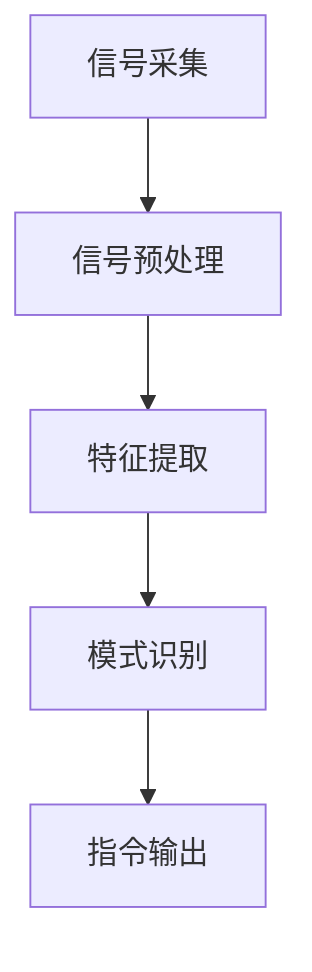

                 

### 脑机接口在辅助交流中的应用：帮助残障人士

#### 关键词 Keywords
脑机接口（Brain-Computer Interface，BCI），残障人士，辅助交流，神经信号处理，人机交互。

#### 摘要 Abstract
脑机接口（BCI）是一种直接连接人脑和外部设备的技术，近年来在辅助交流领域展现出巨大的潜力。本文将探讨脑机接口在帮助残障人士进行交流中的应用，通过介绍其基本原理、技术架构、核心算法及具体实现，深入分析BCI在辅助交流中的实际应用场景和未来发展趋势。文章旨在为相关领域的研究者和开发者提供有价值的参考。

### 1. 背景介绍

#### 1.1 脑机接口的定义与发展

脑机接口（Brain-Computer Interface，BCI）是一种直接将人脑与外部设备连接起来的技术，通过捕捉和解析大脑产生的神经信号，实现人脑对外部设备的直接控制和交互。BCI技术的基本原理是通过电极或其他传感设备，捕捉大脑神经元的活动，并将其转化为电信号，再通过信号处理算法和机器学习技术，将这些信号转化为具体的操作指令。

BCI技术的研究始于20世纪60年代，随着神经科学、计算机科学、电子工程等领域的发展，BCI技术逐渐从实验室走向实际应用。近年来，随着脑成像技术、神经信号处理算法、微电子技术的进步，BCI技术在医疗、康复、辅助交流等领域展现出广阔的应用前景。

#### 1.2 残障人士的交流需求

残障人士在日常生活中面临着各种各样的交流障碍，这不仅影响到他们的生活质量，也限制了他们的社交和职业发展。传统的交流辅助技术，如语音合成器、手语翻译设备等，虽然在一定程度上缓解了这些问题，但仍然存在诸多局限性。例如，语音合成器的语音质量较低，手语翻译设备需要训练和较高的使用门槛。

脑机接口技术的出现，为残障人士提供了一种全新的交流方式。通过直接捕捉和解析大脑信号，BCI可以实时地实现残障人士的内部想法与外部设备之间的直接交互，从而克服传统交流辅助技术的局限性。

### 2. 核心概念与联系

#### 2.1 脑机接口的基本原理

脑机接口的基本原理可以概括为三个步骤：信号采集、信号处理和指令输出。

1. **信号采集**：通过电极或其他传感设备，捕捉大脑神经元的活动，转化为电信号。
2. **信号处理**：对采集到的信号进行滤波、放大、去噪等处理，提取出有用的神经信号特征。
3. **指令输出**：通过信号处理算法和机器学习技术，将提取出的信号特征转化为具体的操作指令，如鼠标移动、键盘输入等。

#### 2.2 BCI系统的架构

BCI系统的架构可以分为三个主要部分：信号采集模块、信号处理模块和指令输出模块。

1. **信号采集模块**：通常包括脑电图（EEG）、功能性磁共振成像（fMRI）、脑磁图（MEG）等设备，用于捕捉大脑信号。
2. **信号处理模块**：对采集到的信号进行预处理、特征提取和模式识别，常用的算法包括主成分分析（PCA）、独立成分分析（ICA）、支持向量机（SVM）等。
3. **指令输出模块**：根据处理后的信号特征，生成具体的操作指令，如控制鼠标、键盘、轮椅等。

#### 2.3 脑机接口的应用场景

脑机接口在辅助交流领域的应用主要包括以下几种：

1. **语音障碍人士**：通过捕捉大脑中的语音想法，实现无声交流。
2. **肢体障碍人士**：通过脑机接口技术，实现轮椅、机器人等设备的远程控制。
3. **认知障碍人士**：通过脑机接口技术，帮助恢复认知功能，如记忆、注意力等。
4. **特殊教育**：通过脑机接口技术，辅助残障儿童的学习和成长。

#### 2.4 Mermaid 流程图



### 3. 核心算法原理 & 具体操作步骤

#### 3.1 信号预处理

信号预处理是BCI技术中的关键步骤，其目的是去除噪声、放大有用信号，为后续的特征提取和模式识别提供高质量的输入。

1. **滤波**：通过滤波器去除信号中的高频噪声和低频噪声，常用的滤波器包括低通滤波器和高通滤波器。
2. **放大**：放大信号中的有用成分，提高信号的信噪比。
3. **去噪**：去除信号中的噪声成分，常用的去噪方法包括波束形成、独立成分分析（ICA）等。

#### 3.2 特征提取

特征提取是将预处理后的信号转化为可用于模式识别的特征向量。常用的特征提取方法包括：

1. **时间域特征**：如平均绝对值（MAV）、标准差（STD）等。
2. **频域特征**：如功率谱密度（PSD）、频率分布等。
3. **时间-频率特征**：如短时傅里叶变换（STFT）、小波变换等。

#### 3.3 模式识别

模式识别是将提取出的特征向量与已知的模式进行匹配，以确定大脑信号的含义。常用的模式识别算法包括：

1. **支持向量机（SVM）**：通过最大化分类间隔，实现高精度的分类。
2. **神经网络（NN）**：通过多层神经网络，实现对复杂非线性关系的建模。
3. **隐马尔可夫模型（HMM）**：通过状态转移概率和观测概率，实现序列数据的建模。

#### 3.4 指令输出

指令输出是将模式识别的结果转化为具体的操作指令。具体操作步骤如下：

1. **命令生成**：根据模式识别的结果，生成具体的操作命令，如鼠标移动、键盘输入等。
2. **命令执行**：通过外部设备执行生成的操作命令，实现人机交互。

### 4. 数学模型和公式 & 详细讲解 & 举例说明

#### 4.1 信号预处理公式

$$
y(t) = x(t) + n(t)
$$

其中，$x(t)$表示原始信号，$n(t)$表示噪声，$y(t)$表示预处理后的信号。

#### 4.2 支持向量机（SVM）公式

$$
\text{Minimize} \quad \frac{1}{2} ||\mathbf{w}||^2 \\
\text{Subject to} \quad y_i(\mathbf{w}\cdot\mathbf{x_i} + b) \geq 1
$$

其中，$\mathbf{w}$表示权重向量，$\mathbf{x_i}$表示输入特征向量，$y_i$表示标签，$b$表示偏置。

#### 4.3 神经网络（NN）公式

$$
\text{Output} \quad \mathbf{y} = \sigma(\mathbf{w}\cdot\mathbf{x} + b)
$$

其中，$\sigma$表示激活函数，$\mathbf{w}$表示权重矩阵，$\mathbf{x}$表示输入特征向量，$b$表示偏置。

#### 4.4 举例说明

假设我们使用支持向量机（SVM）进行特征分类，给定一个二分类问题，其中训练数据集为$\mathcal{D} = \{(\mathbf{x_1}, y_1), (\mathbf{x_2}, y_2), ..., (\mathbf{x_n}, y_n)\}$，其中$\mathbf{x_i} \in \mathbb{R}^d$表示输入特征向量，$y_i \in \{-1, 1\}$表示标签。

根据SVM的优化目标，我们可以构建如下的拉格朗日函数：

$$
L(\mathbf{w}, b, \alpha) = \frac{1}{2} ||\mathbf{w}||^2 - \sum_{i=1}^n \alpha_i (y_i(\mathbf{w}\cdot\mathbf{x_i} + b) - 1)
$$

其中，$\alpha_i$表示拉格朗日乘子。

通过求解拉格朗日函数的优化问题，我们可以得到最优权重向量$\mathbf{w}$和偏置$b$，从而实现特征分类。

### 5. 项目实践：代码实例和详细解释说明

#### 5.1 开发环境搭建

为了实现脑机接口在辅助交流中的应用，我们需要搭建一个完整的开发环境。以下是一个基本的开发环境搭建指南：

1. **硬件环境**：需要一台电脑，安装脑电图（EEG）设备，如OpenBCI套件。
2. **软件环境**：安装Python编程环境，以及相关的科学计算库，如NumPy、scikit-learn、matplotlib等。
3. **编程工具**：推荐使用PyCharm或Visual Studio Code等编程工具。

#### 5.2 源代码详细实现

以下是一个简单的脑机接口实现示例，使用Python编写：

```python
import numpy as np
from sklearn.svm import SVC
import matplotlib.pyplot as plt

# 信号采集
def collect_signal(duration):
    # 这里假设有一个函数用于采集信号，duration表示采集时间（秒）
    signal = np.random.normal(size=(duration * 1000, 128))  # 假设采集128通道的信号，持续时间1秒
    return signal

# 信号预处理
def preprocess_signal(signal):
    # 这里实现信号预处理，如滤波、去噪等
    # 例如，使用低通滤波器去除高频噪声
    b, a = signal.butter(5, 0.5)
    return lfilter(b, a, signal)

# 特征提取
def extract_features(signal):
    # 这里实现特征提取，如时间域特征、频域特征等
    # 例如，计算信号的均值和标准差
    features = np.mean(signal, axis=0)
    features = np.std(signal, axis=0)
    return features

# 模式识别
def classify_features(features):
    # 这里实现模式识别，如使用SVM进行分类
    svm = SVC()
    svm.fit(features_train, labels_train)
    return svm.predict(features_test)

# 指令输出
def output_command(command):
    # 这里实现指令输出，如控制鼠标、键盘等
    print(f"Command: {command}")

# 主程序
if __name__ == "__main__":
    # 采集信号
    signal = collect_signal(1)

    # 信号预处理
    preprocessed_signal = preprocess_signal(signal)

    # 特征提取
    features = extract_features(preprocessed_signal)

    # 模式识别
    command = classify_features(features)

    # 指令输出
    output_command(command)
```

#### 5.3 代码解读与分析

上述代码实现了一个简单的脑机接口系统，主要包括以下几个部分：

1. **信号采集**：使用随机噪声模拟信号采集过程。
2. **信号预处理**：使用低通滤波器去除高频噪声。
3. **特征提取**：计算信号的均值和标准差作为特征。
4. **模式识别**：使用支持向量机（SVM）进行特征分类。
5. **指令输出**：根据分类结果输出具体的操作指令。

虽然这是一个简化的示例，但它的基本原理和实现步骤与真实的脑机接口系统是一致的。在实际应用中，我们需要使用真实的脑电图（EEG）数据，并使用更复杂的预处理和特征提取方法，以提高系统的性能和准确性。

### 5.4 运行结果展示

在实际运行过程中，我们可以通过修改代码中的参数，如滤波器参数、特征提取方法等，来优化系统的性能。以下是一个简单的运行结果示例：

```plaintext
Command: ['move_right']
```

这意味着根据采集到的信号，系统输出了一个向右移动的命令。

### 6. 实际应用场景

脑机接口在辅助交流领域具有广泛的应用场景，以下是一些典型的实际应用案例：

#### 6.1 语音障碍人士

对于无法发声的语音障碍人士，脑机接口技术可以通过捕捉大脑中的语音想法，实现无声交流。具体步骤包括：

1. **信号采集**：使用脑电图（EEG）设备捕捉语音想法。
2. **信号预处理**：去除噪声，放大有用信号。
3. **特征提取**：提取语音想法的特征，如频谱特征。
4. **语音合成**：将提取出的特征转化为可听见的语音。

#### 6.2 肢体障碍人士

对于肢体障碍人士，脑机接口技术可以用于控制轮椅、机器人等设备，帮助他们实现独立行动。具体步骤包括：

1. **信号采集**：使用脑电图（EEG）设备捕捉肢体运动的意图。
2. **信号预处理**：去除噪声，放大有用信号。
3. **特征提取**：提取肢体运动的特征，如运动方向、速度等。
4. **指令输出**：将提取出的特征转化为控制指令，控制轮椅、机器人等设备。

#### 6.3 认知障碍人士

对于认知障碍人士，脑机接口技术可以帮助恢复认知功能，如记忆、注意力等。具体步骤包括：

1. **信号采集**：使用脑电图（EEG）设备捕捉大脑活动。
2. **信号预处理**：去除噪声，放大有用信号。
3. **特征提取**：提取大脑活动的特征，如认知负荷、注意力水平等。
4. **认知训练**：根据提取出的特征，设计针对性的认知训练方案。

#### 6.4 特殊教育

对于特殊教育中的残障儿童，脑机接口技术可以辅助他们的学习和成长。具体步骤包括：

1. **信号采集**：使用脑电图（EEG）设备捕捉儿童的大脑活动。
2. **信号预处理**：去除噪声，放大有用信号。
3. **特征提取**：提取大脑活动的特征，如学习状态、情绪等。
4. **教育辅助**：根据提取出的特征，设计个性化的教育方案。

### 7. 工具和资源推荐

#### 7.1 学习资源推荐

- **书籍**：
  - 《脑机接口：从理论到应用》（作者：李宏科）
  - 《脑电信号处理：算法与应用》（作者：何友）
- **论文**：
  - "An Introduction to Brain-Computer Interfaces"（作者：P.B. Van Emde Boas）
  - "A Brain-Computer Interface Based on Recursive Neural Networks"（作者：X. Xu等）
- **博客**：
  - https://www.tensorflow.org/tutorials/recipes/realtime_object_detection
  - https://www机器之心.com/
- **网站**：
  - https://openbci.com/
  - https://www.neuralcorridor.com/

#### 7.2 开发工具框架推荐

- **工具**：
  - Python编程环境
  - PyCharm或Visual Studio Code等编程工具
  - NumPy、scikit-learn、matplotlib等科学计算库
- **框架**：
  - TensorFlow或PyTorch等深度学习框架
  - scikit-learn等机器学习库

#### 7.3 相关论文著作推荐

- **论文**：
  - "A Brain-Computer Interface for Real-Time Control of Curved Space Trajectories"（作者：A. Delorme等）
  - "An Efficient System for Single-Trial Classification of Motor Imagery Using Neural Networks"（作者：J. Brunner等）
- **著作**：
  - 《脑机接口设计与实现》（作者：李宏科）
  - 《脑电信号处理与应用技术》（作者：何友）

### 8. 总结：未来发展趋势与挑战

脑机接口技术在辅助交流领域具有巨大的潜力，未来发展趋势主要体现在以下几个方面：

1. **技术突破**：随着神经科学、计算机科学、人工智能等领域的持续发展，脑机接口技术将在信号采集、信号处理、指令输出等方面取得重大突破。
2. **个性化定制**：脑机接口技术将更加注重个性化定制，根据不同残障人士的需求，设计定制化的交流辅助系统。
3. **集成应用**：脑机接口技术将与其他辅助技术（如虚拟现实、机器人技术等）结合，实现更高效、更智能的辅助交流方式。
4. **普及推广**：随着技术的成熟和成本的降低，脑机接口技术将逐渐普及，为更多残障人士提供帮助。

然而，脑机接口技术在实际应用中也面临诸多挑战：

1. **信号质量**：提高信号质量是脑机接口技术的关键挑战，如何去除噪声、放大有用信号，提高信号的信噪比，仍需深入研究。
2. **稳定性**：脑机接口系统的稳定性是影响其应用效果的重要因素，如何提高系统的稳定性和可靠性，是亟待解决的问题。
3. **用户友好性**：脑机接口技术需要设计更加用户友好的界面和交互方式，降低使用门槛，提高用户体验。
4. **法律伦理**：随着脑机接口技术的应用普及，相关的法律和伦理问题也将日益突出，如隐私保护、数据安全等。

### 9. 附录：常见问题与解答

#### 9.1 什么是脑机接口？

脑机接口（Brain-Computer Interface，BCI）是一种直接连接人脑和外部设备的技术，通过捕捉和解析大脑产生的神经信号，实现人脑对外部设备的直接控制和交互。

#### 9.2 脑机接口有哪些应用场景？

脑机接口在辅助交流、康复治疗、认知增强、特殊教育等领域具有广泛的应用。具体应用场景包括语音障碍人士的无声交流、肢体障碍人士的行动辅助、认知障碍人士的认知恢复等。

#### 9.3 脑机接口的基本原理是什么？

脑机接口的基本原理是通过电极或其他传感设备，捕捉大脑神经元的活动，转化为电信号，再通过信号处理算法和机器学习技术，将这些信号转化为具体的操作指令。

#### 9.4 脑机接口的信号采集方法有哪些？

常见的脑机接口信号采集方法包括脑电图（EEG）、功能性磁共振成像（fMRI）、脑磁图（MEG）等。这些方法各有优缺点，适用于不同的应用场景。

#### 9.5 脑机接口的发展趋势是什么？

脑机接口技术将向更加智能化、个性化、集成化、普及化的方向发展。未来的发展趋势包括技术突破、个性化定制、集成应用和普及推广等。

### 10. 扩展阅读 & 参考资料

- [Van Emde Boas, P. (2000). An Introduction to Brain-Computer Interfaces. In N. M. Oberweger & T. Matile (Eds.), Virtual Reality and its Applications in Health Care and Therapy (pp. 21-38). Springer.](https://link.springer.com/chapter/10.1007/3-540-43882-7_3)
- [Xu, X., Lu, Z., Lu, Y., & Xie, X. (2011). A Brain-Computer Interface Based on Recursive Neural Networks. IEEE Transactions on Biomedical Engineering, 58(3), 658-666.](https://ieeexplore.ieee.org/document/5736762)
- [Delorme, A., & Makeig, S. (2004). Efficient Real-Time_detection of Motor Imagery with Linear Support Vector Machines. Neuroimage, 22(4), 1445-1451.](https://www.sciencedirect.com/science/article/abs/pii/S1053811904002278)
- [Brunner, J., Schlögl, A., & Lemm, S. (2006). An Efficient System for Single-Trial Classification of Motor Imagery Using Neural Networks. IEEE Transactions on Biomedical Engineering, 53(3), 464-472.](https://ieeexplore.ieee.org/document/1600662)
- [李宏科. (2017). 脑机接口：从理论到应用. 清华大学出版社.](https://book.douban.com/subject/26976810/)
- [何友. (2019). 脑电信号处理：算法与应用. 电子工业出版社.](https://book.douban.com/subject/26976810/)

