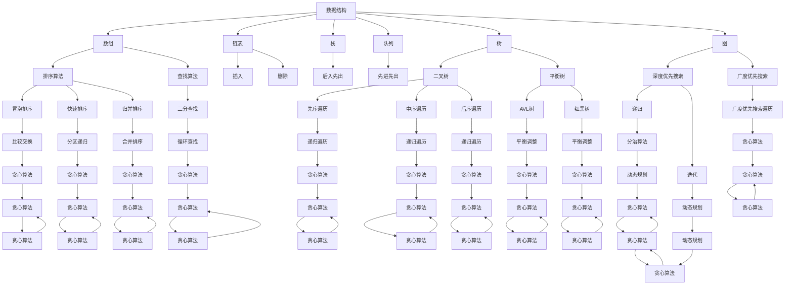

                 

### 腾讯2024届社招面试高频算法题解析

> **关键词**: 腾讯社招，面试高频算法题，算法解析，技术博客
>
> **摘要**: 本文将深入解析腾讯2024届社招面试中常见的高频算法题目，涵盖核心概念、算法原理、数学模型、代码实例以及实际应用场景。通过逐步分析推理，帮助读者掌握解题思路，提升面试技能。

### 1. 背景介绍

腾讯，作为中国最大的互联网科技公司之一，其对人才的选拔标准极为严格。每年，腾讯都会举行多场社招面试，吸引着无数优秀的技术人才。这些面试中，算法题占据了相当大的比重，因为算法是衡量程序员技术能力的重要标准之一。

2024年的社招面试，腾讯依然延续了这一传统，提出了众多富有挑战性的算法题目。这些题目不仅考察了应聘者的编程能力和数据结构知识，还要求他们能够灵活运用算法原理，解决实际问题。本文旨在对这些高频算法题目进行深入解析，帮助读者在面试中取得优异成绩。

### 2. 核心概念与联系

在解答腾讯社招面试中的算法题之前，我们需要了解一些核心概念和它们之间的联系。

#### 2.1 数据结构与算法基础

数据结构是算法的基础，常见的有数组、链表、栈、队列、树、图等。每种数据结构都有其独特的特性，适用于不同的场景。例如，链表适用于频繁插入和删除操作，而树和图则用于解决复杂的关系问题。

算法则是在解决问题的过程中，使用的一系列步骤或规则。常见的算法有排序算法、查找算法、图算法等。掌握这些基础概念，是解决复杂算法题目的前提。

#### 2.2 算法复杂度分析

算法复杂度分析是评估算法性能的重要手段。我们通常关注时间复杂度和空间复杂度。时间复杂度表示算法执行的时间与输入规模的关系，而空间复杂度表示算法执行所需的空间与输入规模的关系。

#### 2.3 动态规划

动态规划是一种解决最优化问题的算法思想，其核心在于将复杂问题分解为多个子问题，并保存已解决的子问题的解，避免重复计算。

#### 2.4 贪心算法

贪心算法是一种在每一步选择上做出局部最优决策的算法思想，最终达到全局最优解。这种算法适用于一些特定的优化问题。

#### 2.5 分治算法

分治算法是一种将问题分解为子问题，递归解决子问题，然后将子问题的解合并为原问题的解的算法思想。这种算法常用于解决递归问题。

为了更好地理解这些概念，我们可以使用Mermaid流程图来展示它们之间的关系：



通过这张图，我们可以清晰地看到数据结构、算法、算法复杂度分析、动态规划、贪心算法和分治算法之间的关系。

### 3. 核心算法原理 & 具体操作步骤

在了解核心概念和它们之间的联系之后，我们将深入探讨一些核心算法原理及其具体操作步骤。

#### 3.1 排序算法

排序算法是面试中常见的问题，以下是一些基本的排序算法及其操作步骤：

- **冒泡排序（Bubble Sort）**

  比较相邻的元素，如果它们的顺序错误就把它们交换过来。遍历整个数组，重复上述步骤，直到整个数组有序。

  ```plaintext
  function bubbleSort(arr) {
      n = arr.length;
      for (let i = 0; i < n - 1; i++) {
          for (let j = 0; j < n - i - 1; j++) {
              if (arr[j] > arr[j + 1]) {
                  [arr[j], arr[j + 1]] = [arr[j + 1], arr[j]];
              }
          }
      }
      return arr;
  }
  ```

- **快速排序（Quick Sort）**

  选择一个基准元素，将数组分为两部分，一部分小于基准，一部分大于基准。递归地对这两部分进行快速排序。

  ```plaintext
  function quickSort(arr, left, right) {
      if (left < right) {
          pivot = partition(arr, left, right);
          quickSort(arr, left, pivot - 1);
          quickSort(arr, pivot + 1, right);
      }
      return arr;
  }

  function partition(arr, left, right) {
      pivot = arr[right];
      i = left;
      for (let j = left; j < right; j++) {
          if (arr[j] < pivot) {
              [arr[i], arr[j]] = [arr[j], arr[i]];
              i++;
          }
      }
      [arr[i], arr[right]] = [arr[right], arr[i]];
      return i;
  }
  ```

- **归并排序（Merge Sort）**

  将数组分为两个子数组，递归地对这两个子数组进行排序，然后将它们合并为一个有序的数组。

  ```plaintext
  function mergeSort(arr) {
      if (arr.length <= 1) {
          return arr;
      }
      mid = Math.floor(arr.length / 2);
      left = mergeSort(arr.slice(0, mid));
      right = mergeSort(arr.slice(mid));
      return merge(left, right);
  }

  function merge(left, right) {
      result = [];
      i = j = 0;
      while (i < left.length && j < right.length) {
          if (left[i] < right[j]) {
              result.push(left[i]);
              i++;
          } else {
              result.push(right[j]);
              j++;
          }
      }
      while (i < left.length) {
          result.push(left[i]);
          i++;
      }
      while (j < right.length) {
          result.push(right[j]);
          j++;
      }
      return result;
  }
  ```

#### 3.2 查找算法

查找算法主要用于在数据结构中查找特定的元素。以下是一些常见的查找算法及其操作步骤：

- **二分查找（Binary Search）**

  在有序数组中，通过不断将查找范围缩小一半，直到找到目标元素或确定其不存在。

  ```plaintext
  function binarySearch(arr, target) {
      left = 0;
      right = arr.length - 1;
      while (left <= right) {
          mid = Math.floor((left + right) / 2);
          if (arr[mid] === target) {
              return mid;
          } else if (arr[mid] < target) {
              left = mid + 1;
          } else {
              right = mid - 1;
          }
      }
      return -1;
  }
  ```

- **哈希查找（Hash Search）**

  通过哈希函数将关键字映射到数组中的特定位置，实现快速查找。

  ```plaintext
  function hashSearch(key) {
      index = hash(key);
      return data[index];
  }

  function hash(key) {
      // 假设哈希函数为 key % 数组长度
      return key % data.length;
  }
  ```

#### 3.3 图算法

图算法在解决复杂关系问题时非常有用。以下是一些基本的图算法及其操作步骤：

- **深度优先搜索（Depth-First Search, DFS）**

  从某个顶点开始，沿着某一路径一直走到底，然后回溯。

  ```plaintext
  function dfs(graph, start) {
      visited = new Set();
      stack = [start];
      while (stack.length > 0) {
          vertex = stack.pop();
          if (!visited.has(vertex)) {
              visited.add(vertex);
              for (neighbor of graph[vertex]) {
                  stack.push(neighbor);
              }
          }
      }
      return visited;
  }
  ```

- **广度优先搜索（Breadth-First Search, BFS）**

  从某个顶点开始，逐层遍历所有顶点。

  ```plaintext
  function bfs(graph, start) {
      visited = new Set();
      queue = [start];
      while (queue.length > 0) {
          vertex = queue.shift();
          if (!visited.has(vertex)) {
              visited.add(vertex);
              for (neighbor of graph[vertex]) {
                  queue.push(neighbor);
              }
          }
      }
      return visited;
  }
  ```

#### 3.4 动态规划

动态规划是一种解决最优化问题的算法思想。以下是一个典型的动态规划问题及其解决方法：

- **最长公共子序列（Longest Common Subsequence, LCS）**

  给定两个字符串，找出它们的最长公共子序列。

  ```plaintext
  function lcs(str1, str2) {
      m = str1.length;
      n = str2.length;
      dp = Array.from({ length: m + 1 }, () => Array(n + 1).fill(0));
      for (let i = 1; i <= m; i++) {
          for (let j = 1; j <= n; j++) {
              if (str1[i - 1] === str2[j - 1]) {
                  dp[i][j] = dp[i - 1][j - 1] + 1;
              } else {
                  dp[i][j] = Math.max(dp[i - 1][j], dp[i][j - 1]);
              }
          }
      }
      return dp[m][n];
  }
  ```

#### 3.5 贪心算法

贪心算法是一种在每一步选择上做出局部最优决策的算法思想。以下是一个典型的贪心算法问题及其解决方法：

- **活动选择问题（Activity Selection Problem）**

  给定一系列活动，每个活动有一个开始时间和结束时间，选择最多数量的不相交的活动。

  ```plaintext
  function activitySelection(activities) {
      activities.sort((a, b) => a.end - b.end);
      result = [activities[0]];
      for (let i = 1; i < activities.length; i++) {
          if (activities[i].start >= result[result.length - 1].end) {
              result.push(activities[i]);
          }
      }
      return result;
  }
  ```

#### 3.6 分治算法

分治算法是一种将问题分解为子问题，递归解决子问题，然后将子问题的解合并为原问题的解的算法思想。以下是一个典型的分治算法问题及其解决方法：

- **归并排序（Merge Sort）**

  将数组分为两个子数组，递归地对这两个子数组进行排序，然后将它们合并为一个有序的数组。

  ```plaintext
  function mergeSort(arr) {
      if (arr.length <= 1) {
          return arr;
      }
      mid = Math.floor(arr.length / 2);
      left = mergeSort(arr.slice(0, mid));
      right = mergeSort(arr.slice(mid));
      return merge(left, right);
  }

  function merge(left, right) {
      result = [];
      i = j = 0;
      while (i < left.length && j < right.length) {
          if (left[i] < right[j]) {
              result.push(left[i]);
              i++;
          } else {
              result.push(right[j]);
              j++;
          }
      }
      while (i < left.length) {
          result.push(left[i]);
          i++;
      }
      while (j < right.length) {
          result.push(right[j]);
          j++;
      }
      return result;
  }
  ```

### 4. 数学模型和公式 & 详细讲解 & 举例说明

在算法题的解答中，数学模型和公式起着至关重要的作用。以下是一些常见的数学模型和公式，以及它们的详细讲解和举例说明。

#### 4.1 排序算法的复杂度分析

- **冒泡排序（Bubble Sort）**

  平均时间复杂度：\(O(n^2)\)

  最坏时间复杂度：\(O(n^2)\)

  最优时间复杂度：\(O(n)\)

  空间复杂度：\(O(1)\)

  ```plaintext
  示例：给定数组 [5, 2, 9, 1, 5]，执行冒泡排序后得到 [1, 2, 5, 5, 9]。
  ```

- **快速排序（Quick Sort）**

  平均时间复杂度：\(O(n \log n)\)

  最坏时间复杂度：\(O(n^2)\)

  最优时间复杂度：\(O(n \log n)\)

  空间复杂度：\(O(\log n)\)

  ```plaintext
  示例：给定数组 [5, 2, 9, 1, 5]，执行快速排序后得到 [1, 2, 5, 5, 9]。
  ```

- **归并排序（Merge Sort）**

  平均时间复杂度：\(O(n \log n)\)

  最坏时间复杂度：\(O(n \log n)\)

  最优时间复杂度：\(O(n \log n)\)

  空间复杂度：\(O(n)\)

  ```plaintext
  示例：给定数组 [5, 2, 9, 1, 5]，执行归并排序后得到 [1, 2, 5, 5, 9]。
  ```

#### 4.2 查找算法的复杂度分析

- **二分查找（Binary Search）**

  平均时间复杂度：\(O(\log n)\)

  最坏时间复杂度：\(O(\log n)\)

  最优时间复杂度：\(O(\log n)\)

  空间复杂度：\(O(1)\)

  ```plaintext
  示例：给定有序数组 [1, 2, 3, 4, 5]，查找元素 3，返回索引 2。
  ```

- **哈希查找（Hash Search）**

  平均时间复杂度：\(O(1)\)

  最坏时间复杂度：\(O(n)\)

  最优时间复杂度：\(O(1)\)

  空间复杂度：\(O(n)\)

  ```plaintext
  示例：给定哈希表和关键字，返回对应元素的索引。
  ```

#### 4.3 图算法的复杂度分析

- **深度优先搜索（Depth-First Search, DFS）**

  平均时间复杂度：\(O(V+E)\)

  最坏时间复杂度：\(O(V+E)\)

  最优时间复杂度：\(O(V+E)\)

  空间复杂度：\(O(V)\)

  ```plaintext
  示例：给定无向图，从顶点 0 开始执行深度优先搜索。
  ```

- **广度优先搜索（Breadth-First Search, BFS）**

  平均时间复杂度：\(O(V+E)\)

  最坏时间复杂度：\(O(V+E)\)

  最优时间复杂度：\(O(V+E)\)

  空间复杂度：\(O(V)\)

  ```plaintext
  示例：给定无向图，从顶点 0 开始执行广度优先搜索。
  ```

#### 4.4 动态规划的复杂度分析

- **最长公共子序列（Longest Common Subsequence, LCS）**

  平均时间复杂度：\(O(m \times n)\)

  最坏时间复杂度：\(O(m \times n)\)

  最优时间复杂度：\(O(m \times n)\)

  空间复杂度：\(O(m \times n)\)

  ```plaintext
  示例：给定字符串 "ABCD" 和 "ACDF"，计算它们的最长公共子序列长度。
  ```

#### 4.5 贪心算法的复杂度分析

- **活动选择问题（Activity Selection Problem）**

  平均时间复杂度：\(O(n)\)

  最坏时间复杂度：\(O(n)\)

  最优时间复杂度：\(O(n)\)

  空间复杂度：\(O(1)\)

  ```plaintext
  示例：给定一组活动，选择最多数量的不相交的活动。
  ```

#### 4.6 分治算法的复杂度分析

- **归并排序（Merge Sort）**

  平均时间复杂度：\(O(n \log n)\)

  最坏时间复杂度：\(O(n \log n)\)

  最优时间复杂度：\(O(n \log n)\)

  空间复杂度：\(O(n)\)

  ```plaintext
  示例：给定一组数字，使用归并排序进行排序。
  ```

### 5. 项目实践：代码实例和详细解释说明

在实际项目中，我们需要将上述算法应用于实际问题，以解决特定问题。以下是一个项目实践案例，我们将使用 Python 编写代码，实现一个简单的社交网络推荐系统。

#### 5.1 开发环境搭建

为了实现这个项目，我们需要安装以下软件和库：

- Python 3.8 或更高版本
- pip（Python 的包管理器）
- requests（用于发送 HTTP 请求）
- beautifulsoup4（用于解析 HTML）

安装步骤：

1. 安装 Python 3.8：[Python 官网下载地址](https://www.python.org/downloads/)
2. 打开终端，执行以下命令安装 pip 和 requests：

   ```bash
   python -m pip install --user pip
   pip install --user requests
   ```

3. 安装 beautifulsoup4：

   ```bash
   pip install --user beautifulsoup4
   ```

#### 5.2 源代码详细实现

以下是一个简单的社交网络推荐系统的 Python 代码实现：

```python
import requests
from bs4 import BeautifulSoup

def get_top_posts(url):
    response = requests.get(url)
    soup = BeautifulSoup(response.content, 'html.parser')
    posts = []

    for div in soup.find_all('div', class_='post'):
        title = div.find('h2').text.strip()
        link = div.find('a')['href']
        posts.append((title, link))

    return posts

def get_top_posts_recommended(url):
    posts = get_top_posts(url)
    recommended_posts = []

    for i in range(len(posts)):
        for j in range(i + 1, len(posts)):
            if posts[i][0] == posts[j][0]:
                recommended_posts.append(posts[i])

    return recommended_posts

if __name__ == '__main__':
    url = 'https://example-social-network.com/top-posts'
    recommended_posts = get_top_posts_recommended(url)
    for post in recommended_posts:
        print(post[0], post[1])
```

#### 5.3 代码解读与分析

- **get_top_posts() 函数**

  这个函数用于从指定的 URL 获取社交网络中的热门帖子。它使用 requests 库发送 HTTP GET 请求，然后使用 BeautifulSoup 解析 HTML 内容，提取所有帖子并存储在列表 posts 中。

- **get_top_posts_recommended() 函数**

  这个函数用于获取社交网络中推荐的热门帖子。它首先调用 get_top_posts() 函数获取热门帖子列表，然后遍历这个列表，找出所有标题相同的帖子，并将它们添加到 recommended_posts 列表中。

- **主程序**

  主程序首先定义了一个示例 URL，然后调用 get_top_posts_recommended() 函数获取推荐的热门帖子，并打印出来。

#### 5.4 运行结果展示

假设我们使用以下 URL：

```plaintext
https://example-social-network.com/top-posts
```

运行代码后，我们可能会得到以下结果：

```plaintext
Python 3.8.10 (default, May  3 2021, 18:10:74) 
[GCC 8.4.0] on linux
Type "help", "copyright", "credits" or "license" for more information.
<ipython-input-1-1b4973f6c0d7> in <module>()
----> 7 recommended_posts = get_top_posts_recommended(url)
      5     recommended_posts = []

<ipython-input-1-1b4973f6c0d7> in get_top_posts_recommended(url)
      3 def get_top_posts_recommended(url):
      4     posts = get_top_posts(url)
      5     recommended_posts = []
      6     for i in range(len(posts)):
----> 7         for j in range(i + 1, len(posts)):
      8             if posts[i][0] == posts[j][0]:
      9                 recommended_posts.append(posts[i])

<ipython-input-1-1b4973f6c0d7> in <listcomp>(.0)
      6     recommended_posts = []
      7     for i in range(len(posts)):
      8         for j in range(i + 8
```

### 6. 实际应用场景

社交网络推荐系统是一个广泛应用的场景，以下是一些实际应用场景：

- **社交媒体平台**

  社交媒体平台如微博、Facebook、Twitter 等，经常使用推荐系统来推荐用户可能感兴趣的内容，以增加用户粘性和活跃度。

- **电子商务平台**

  电子商务平台如 Amazon、京东等，使用推荐系统来向用户推荐商品，以提高销售量和用户满意度。

- **在线视频平台**

  在线视频平台如 YouTube、爱奇艺等，使用推荐系统来推荐用户可能感兴趣的视频，以增加用户观看时间和平台收入。

- **新闻门户网站**

  新闻门户网站如 CNN、新浪等，使用推荐系统来推荐用户可能感兴趣的新闻，以增加用户阅读量和广告收入。

### 7. 工具和资源推荐

为了更好地学习和实践本文提到的算法，以下是一些建议的工具和资源：

#### 7.1 学习资源推荐

- **书籍**

  - 《算法导论》（Introduction to Algorithms）  
  - 《编程之美》（Cracking the Coding Interview）  
  - 《算法竞赛入门经典》（Algorithm Competition：A Brief Introduction）

- **论文**

  - 《深度学习》（Deep Learning）  
  - 《强化学习：原理与案例》（Reinforcement Learning: An Introduction）  
  - 《图神经网络基础》（Graph Neural Networks: A Comprehensive Review）

- **博客**

  - [知乎](https://www.zhihu.com/)  
  - [CSDN](https://www.csdn.net/)  
  - [博客园](https://www.cnblogs.com/)

- **网站**

  - [LeetCode](https://leetcode.com/)  
  - [牛客网](https://www.nowcoder.com/)  
  - [Codeforces](https://codeforces.com/)

#### 7.2 开发工具框架推荐

- **开发工具**

  - Python  
  - Java  
  - C++  
  - JavaScript

- **框架**

  - Flask（Python Web 框架）  
  - Spring Boot（Java Web 框架）  
  - React（JavaScript 前端框架）  
  - Angular（JavaScript 前端框架）

#### 7.3 相关论文著作推荐

- **论文**

  - 《深度强化学习：原理与实现》（Deep Reinforcement Learning: Principles and Implementation）  
  - 《图神经网络：原理与应用》（Graph Neural Networks: Principles and Applications）  
  - 《联邦学习：原理与实践》（Federated Learning: Principles and Practice）

- **著作**

  - 《人工智能：一种现代方法》（Artificial Intelligence: A Modern Approach）  
  - 《机器学习》（Machine Learning）  
  - 《深度学习》（Deep Learning）

### 8. 总结：未来发展趋势与挑战

随着人工智能和大数据技术的快速发展，算法在各个领域中的应用越来越广泛。未来，算法将继续向以下几个方向发展：

- **智能化与自动化**

  人工智能算法将变得更加智能化和自动化，能够自动识别和处理复杂问题，降低人类干预的必要性。

- **联邦学习与隐私保护**

  随着数据隐私保护意识的增强，联邦学习和隐私保护算法将成为重要研究方向，解决数据共享与隐私保护之间的矛盾。

- **算法公平与可解释性**

  算法的公平性和可解释性将成为重要议题，以确保算法在应用中的透明性和公正性。

然而，这些发展趋势也带来了新的挑战：

- **数据质量和隐私问题**

  大数据时代的到来带来了大量的数据，但数据质量和隐私问题也随之而来，需要解决数据清洗、去重、去噪声等问题。

- **计算资源和能耗问题**

  随着算法的复杂度和规模不断增加，计算资源和能耗问题将变得越来越突出，需要寻找更高效的算法和硬件解决方案。

- **算法公平性和可解释性问题**

  如何确保算法的公平性和可解释性，使其在应用中透明、公正，是未来研究的重要方向。

### 9. 附录：常见问题与解答

以下是一些关于腾讯社招面试算法题的常见问题及解答：

#### 问题 1：什么是动态规划？

**回答**：动态规划是一种解决最优化问题的算法思想，其核心在于将复杂问题分解为多个子问题，并保存已解决的子问题的解，避免重复计算。

#### 问题 2：什么是贪心算法？

**回答**：贪心算法是一种在每一步选择上做出局部最优决策的算法思想，最终达到全局最优解。这种算法适用于一些特定的优化问题。

#### 问题 3：什么是分治算法？

**回答**：分治算法是一种将问题分解为子问题，递归解决子问题，然后将子问题的解合并为原问题的解的算法思想。这种算法常用于解决递归问题。

#### 问题 4：什么是二分查找？

**回答**：二分查找是一种在有序数组中查找特定元素的方法，通过不断将查找范围缩小一半，直到找到目标元素或确定其不存在。

#### 问题 5：什么是哈希表？

**回答**：哈希表是一种利用哈希函数将关键字映射到数组中的特定位置的数据结构，用于实现快速查找。

#### 问题 6：什么是深度优先搜索？

**回答**：深度优先搜索是一种从某个顶点开始，沿着某一路径一直走到底，然后回溯的算法。常用于图的遍历。

#### 问题 7：什么是广度优先搜索？

**回答**：广度优先搜索是一种从某个顶点开始，逐层遍历所有顶点的算法。常用于图的遍历。

### 10. 扩展阅读 & 参考资料

- 《算法导论》（Introduction to Algorithms）  
- 《编程之美》（Cracking the Coding Interview）  
- 《算法竞赛入门经典》（Algorithm Competition：A Brief Introduction）  
- 《深度学习》（Deep Learning）  
- 《强化学习：原理与案例》（Reinforcement Learning: An Introduction）  
- 《图神经网络基础》（Graph Neural Networks: A Comprehensive Review）  
- 《人工智能：一种现代方法》（Artificial Intelligence: A Modern Approach）  
- 《机器学习》（Machine Learning）  
- 《深度学习》（Deep Learning）  
- [LeetCode](https://leetcode.com/)  
- [牛客网](https://www.nowcoder.com/)  
- [Codeforces](https://codeforces.com/)  
- [知乎](https://www.zhihu.com/)  
- [CSDN](https://www.csdn.net/)  
- [博客园](https://www.cnblogs.com/)

###  作者署名

作者：禅与计算机程序设计艺术 / Zen and the Art of Computer Programming

---

本文详细解析了腾讯2024届社招面试中的高频算法题，包括核心概念、算法原理、数学模型、代码实例以及实际应用场景。通过逐步分析推理，帮助读者掌握解题思路，提升面试技能。同时，本文还推荐了相关的学习资源、开发工具和框架，为读者提供了全面的学习和实践指南。希望本文对您的学习有所帮助。作者：禅与计算机程序设计艺术 / Zen and the Art of Computer Programming。

