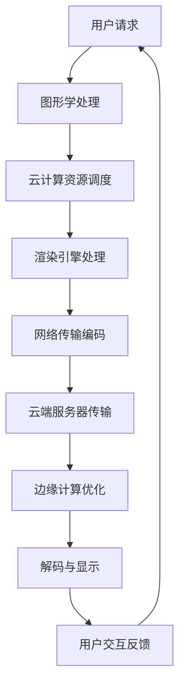

                 

### 1. 背景介绍

#### 云游戏的概念和现状

云游戏，即基于云计算的游戏，它通过服务器端的强大计算资源和网络传输技术，为终端设备提供高质量、低延迟的游戏体验。简单来说，玩家不再需要购买昂贵的硬件设备，只需通过普通的终端设备（如手机、平板、电脑等）连接云端，即可享受到各种游戏的乐趣。

随着5G技术的普及和云计算技术的发展，云游戏逐渐成为游戏行业的新风口。据统计，2022年全球云游戏市场规模已经达到14.2亿美元，预计到2026年将达到82.3亿美元，年复合增长率高达50.3%。这一迅速增长的市场潜力吸引了众多巨头公司纷纷布局，如谷歌、亚马逊、微软、腾讯等。

腾讯作为中国互联网行业的领军企业，其在云游戏领域也具有强大的竞争力。腾讯旗下的腾讯云已推出了云游戏解决方案，包括游戏云渲染、云存储、云安全等功能，旨在为开发者提供一站式云游戏开发服务。腾讯云游戏的目标是通过强大的计算资源和网络技术，实现全球范围内的优质游戏体验。

#### 校招云游戏渲染工程师的岗位定位

云游戏渲染工程师是云游戏技术栈中的关键岗位，主要负责游戏画面在云端进行渲染、优化和传输的工作。这一岗位不仅需要深厚的计算机图形学知识和编程技能，还要对云计算架构和网络传输技术有深刻的理解。

云游戏渲染工程师的主要工作内容可以概括为以下几个方面：

1. **游戏画面渲染优化**：研究并实现高效的游戏画面渲染算法，确保游戏画面在云端能够快速、高质量地渲染出来。

2. **网络传输优化**：研究并优化游戏画面的传输技术，降低延迟和丢包率，确保玩家能够获得流畅的游戏体验。

3. **云平台搭建与维护**：参与云游戏平台的搭建和维护工作，确保平台的高可用性和稳定性。

4. **性能调优与监控**：对游戏渲染过程进行性能调优，监控平台运行状态，及时处理和解决性能问题。

5. **技术文档编写**：编写技术文档，为团队成员提供技术支持和知识共享。

腾讯2024校招云游戏渲染工程师的岗位，不仅为应届毕业生提供了一个展示才华的平台，还提供了一个极具挑战性和发展潜力的职业方向。这一岗位要求应聘者具备扎实的计算机图形学基础、优秀的编程能力以及对云计算和网络安全技术的深刻理解。

#### 校招的意义和价值

对于腾讯而言，校招是获取新鲜血液、补充公司技术团队的重要渠道。通过校招，腾讯能够吸引到一批具备创新能力和技术热情的应届毕业生，为公司的长远发展注入新的动力。同时，校招也是腾讯承担社会责任、回馈社会的重要途径。

对于应届毕业生来说，校招不仅是一次职业起点的选择，更是一次人生阶段的转折点。通过参加腾讯校招，毕业生有机会进入全球知名的互联网企业，接触前沿技术，拓展人脉，提升自我价值。此外，腾讯的校招流程和面试体系也为毕业生提供了一个锻炼自己、提升自己能力的平台。

#### 行业趋势和发展前景

随着5G和云计算技术的不断成熟，云游戏行业正迎来前所未有的发展机遇。未来，云游戏将不仅在技术上实现突破，更将在商业模式、用户体验等方面进行深度的创新和变革。

从技术趋势来看，云游戏渲染技术将向着更高画质、更低延迟、更智能化的方向发展。例如，通过AI技术优化渲染算法，实现动态场景下的实时渲染；通过边缘计算技术，实现更近端、更快速的响应。

从市场趋势来看，云游戏将逐步打破地域和设备的限制，实现全球范围内的游戏体验共享。未来，越来越多的玩家将不再局限于个人设备，而是通过云端服务，随时随地享受高质量的游戏。

从商业模式来看，云游戏将推动游戏产业向订阅制、服务化方向转型。玩家不再需要购买硬件设备或游戏本体，只需支付订阅费用，即可畅玩海量游戏。

总之，腾讯2024校招云游戏渲染工程师岗位，不仅代表了当前云游戏行业的发展趋势，更预示着未来技术革新的方向。对于有志于投身云游戏行业的应届毕业生来说，这是一个不容错过的机会。

---

#### 云游戏渲染技术的核心组成部分

云游戏渲染技术是一个复杂的系统，它涉及到多个核心组成部分，包括图形处理、网络传输、云计算和边缘计算等。下面我们将逐一探讨这些组成部分，以及它们在云游戏渲染中的具体作用。

**1. 图形处理**

图形处理是云游戏渲染技术的核心环节，它决定了游戏画面的质量和流畅度。图形处理主要包括以下几个方面：

- **渲染引擎**：渲染引擎负责将游戏场景中的几何图形转化为图像。常见的渲染引擎有Unreal Engine、Unity等，它们提供了丰富的图形渲染功能，支持多种图形效果和渲染技术。

- **渲染算法**：渲染算法用于优化游戏画面的渲染过程，提高渲染效率。常见的渲染算法包括光追算法、阴影算法、纹理映射算法等。

- **特效处理**：游戏中的特效处理，如火焰、水波、光影等，都需要通过图形处理技术来实现。特效处理不仅能够增强游戏画面的视觉效果，还能提升玩家的沉浸感。

- **画面优化**：画面优化包括分辨率调整、抗锯齿处理、色彩优化等，旨在提高游戏画面的整体质量，同时减少带宽占用。

**2. 网络传输**

网络传输是云游戏渲染技术的另一个关键组成部分，它决定了游戏画面的传输速度和稳定性。网络传输主要包括以下几个方面：

- **编码与解码**：编码与解码技术用于压缩和解压缩游戏画面数据，以减少数据传输的带宽占用。常见的编码技术有H.264、HEVC等。

- **网络协议**：网络协议用于确保游戏画面数据在网络中的正确传输。常见的网络协议有TCP、UDP等，其中TCP提供可靠的数据传输，而UDP则提供更快速的传输速度。

- **传输优化**：传输优化技术用于提高游戏画面在网络中的传输效率，包括带宽调整、丢包处理、延迟优化等。

**3. 云计算**

云计算是云游戏渲染技术的底层支撑，它提供了强大的计算资源和存储能力，支持大规模的游戏渲染任务。云计算主要包括以下几个方面：

- **计算资源**：云计算平台提供了丰富的计算资源，如CPU、GPU等，这些资源可以用于处理复杂的图形渲染任务。

- **存储资源**：存储资源用于存储游戏数据，包括游戏场景、角色模型、纹理等。云计算平台通常提供高效、可靠的存储服务。

- **调度与管理**：调度与管理技术用于合理分配计算资源和存储资源，确保游戏渲染任务的顺利进行。

**4. 边缘计算**

边缘计算是近年来兴起的一种新型计算模式，它将计算任务从云端转移到网络边缘，以减少延迟和带宽占用。边缘计算在云游戏渲染中具有重要作用，主要包括以下几个方面：

- **边缘服务器**：边缘服务器位于网络边缘，距离玩家更近，可以提供更快速、更稳定的游戏渲染服务。

- **内容分发**：内容分发网络（CDN）将游戏内容分发到边缘服务器，以实现更近端、更快速的响应。

- **数据处理**：边缘计算可以对游戏画面进行实时处理和优化，提高渲染效率和画面质量。

通过上述核心组成部分的协同工作，云游戏渲染技术能够为玩家提供高质量、低延迟的游戏体验。未来，随着技术的不断进步，云游戏渲染技术将更加成熟和普及，为游戏产业带来更多的创新和变革。

#### 云游戏渲染的工作原理和流程

云游戏渲染的工作原理和流程是一个复杂而精密的系统，涉及到多个环节的协同工作。下面我们将详细解析云游戏渲染的工作原理和流程，以及其中涉及的关键技术和难点。

**1. 游戏场景的捕捉和预处理**

首先，游戏场景的捕捉和预处理是云游戏渲染的起点。在游戏运行过程中，游戏引擎会实时捕捉游戏场景中的几何图形、角色动作、光照效果等。这些捕捉到的数据需要经过预处理，以便后续的渲染处理。

- **几何图形的处理**：几何图形的处理包括三角化、规范化等操作，将复杂的三维模型转化为渲染引擎可以处理的几何图形。

- **光照效果的计算**：光照效果的计算是游戏渲染的重要组成部分，它决定了游戏画面的亮度和色彩。常见的光照模型包括Lambert光照模型、Blinn-Phong光照模型等。

- **纹理映射**：纹理映射是将纹理图像贴附到几何图形上，以增强游戏画面的真实感。常见的纹理映射技术包括UV映射、立方体贴图等。

**2. 渲染引擎的渲染处理**

在预处理完成后，游戏场景数据将被送入渲染引擎进行处理。渲染引擎根据预设的渲染参数和渲染算法，将游戏场景中的几何图形转化为图像。

- **渲染算法的选择**：渲染引擎可以选择多种渲染算法，如光追算法、Shadow Map算法、Blinn-Phong算法等，以实现不同的渲染效果。

- **渲染参数的调整**：渲染参数的调整包括分辨率、抗锯齿效果、阴影效果等，这些参数直接影响游戏画面的质量和流畅度。

- **实时渲染**：实时渲染是实现云游戏的关键，它要求渲染引擎能够在极短的时间内完成渲染任务，以保证玩家能够实时看到游戏画面。

**3. 游戏画面的编码与传输**

渲染完成后，游戏画面需要通过编码技术进行压缩，以减少数据传输的带宽占用。常见的编码技术包括H.264、HEVC等。

- **编码与解码**：编码与解码技术用于压缩和解压缩游戏画面数据，以确保数据在网络中的高效传输。

- **网络协议的选择**：网络协议的选择直接影响游戏画面的传输速度和稳定性。常见的网络协议包括TCP、UDP等，其中TCP提供可靠的数据传输，而UDP则提供更快速的传输速度。

- **传输优化**：传输优化技术用于提高游戏画面在网络中的传输效率，包括带宽调整、丢包处理、延迟优化等。

**4. 游戏画面的解码与显示**

在接收端，游戏画面数据需要通过解码技术进行解压缩，以便显示在玩家的终端设备上。

- **解码与显示**：解码与显示技术用于将编码后的游戏画面数据还原为原始图像，并显示在玩家的屏幕上。

- **缓冲处理**：缓冲处理技术用于解决网络传输中的延迟和丢包问题，确保游戏画面的流畅显示。

- **交互反馈**：游戏画面的解码与显示过程还需要实时处理玩家的输入和反馈，以保证游戏的实时性和交互性。

**5. 关键技术和难点**

- **渲染性能优化**：渲染性能优化是云游戏渲染技术的重要研究方向，包括优化渲染算法、减少渲染延迟等。

- **网络传输优化**：网络传输优化是确保游戏画面高质量传输的关键，包括优化编码技术、调整网络协议等。

- **边缘计算与云计算的结合**：边缘计算与云计算的结合可以大幅提高游戏渲染的效率和稳定性，但同时也带来了复杂的调度和管理问题。

- **跨平台兼容性**：云游戏需要支持多种终端设备，包括手机、平板、电脑等，这要求游戏画面在多种设备上都能保持高质量和流畅度。

通过上述解析，我们可以看到，云游戏渲染技术涉及到多个环节的协同工作，从游戏场景的捕捉和预处理，到渲染引擎的渲染处理，再到游戏画面的编码、传输、解码与显示，每一个环节都需要精细的技术支持和优化。未来，随着技术的不断进步，云游戏渲染技术将更加成熟和高效，为玩家带来更加优质的游戏体验。

### 2. 核心概念与联系

在深入探讨云游戏渲染技术之前，我们需要了解几个核心概念，包括图形学、云计算、网络传输以及边缘计算。这些概念相互联系，共同构成了云游戏渲染的技术基础。

#### 图形学

图形学是计算机科学中的一个重要分支，主要研究如何生成和处理计算机图形。在云游戏渲染中，图形学知识被广泛应用于游戏画面的捕捉、处理和渲染。

- **渲染引擎**：渲染引擎是图形学中的核心组件，用于处理游戏场景的渲染任务。常见的渲染引擎有Unreal Engine、Unity等。

- **渲染算法**：渲染算法是实现高质量渲染的关键。常见的渲染算法包括光追算法、Blinn-Phong算法、Shadow Map算法等。

- **几何图形处理**：几何图形处理包括几何图形的生成、变换、渲染等，是图形学的基础。

#### 云计算

云计算是一种通过互联网提供计算资源的服务模式。在云游戏渲染中，云计算提供了强大的计算和存储资源，支持大规模的游戏渲染任务。

- **计算资源**：计算资源包括CPU、GPU等，用于处理复杂的图形渲染任务。

- **存储资源**：存储资源用于存储游戏场景、角色模型、纹理等数据。

- **调度与管理**：调度与管理技术用于合理分配计算资源和存储资源，确保游戏渲染任务的顺利进行。

#### 网络传输

网络传输是确保游戏画面高效、稳定传输的关键。网络传输技术包括编码、解码、网络协议选择以及传输优化等。

- **编码与解码**：编码与解码技术用于压缩和解压缩游戏画面数据，以减少带宽占用。

- **网络协议**：网络协议用于确保游戏画面数据在网络中的正确传输。常见的网络协议包括TCP、UDP等。

- **传输优化**：传输优化技术用于提高游戏画面在网络中的传输效率，包括带宽调整、丢包处理、延迟优化等。

#### 边缘计算

边缘计算是一种将计算任务从云端转移到网络边缘的计算模式。在云游戏渲染中，边缘计算可以提高游戏渲染的效率和稳定性。

- **边缘服务器**：边缘服务器位于网络边缘，可以提供更快速、更稳定的游戏渲染服务。

- **内容分发**：内容分发网络（CDN）用于将游戏内容分发到边缘服务器，以实现更近端、更快速的响应。

- **数据处理**：边缘计算可以对游戏画面进行实时处理和优化，提高渲染效率和画面质量。

#### 关系与联系

上述核心概念之间存在着密切的联系：

- **图形学**与**云计算**的结合，可以大幅提高游戏渲染的效率和画质。

- **云计算**与**网络传输**的结合，可以确保游戏画面的高效、稳定传输。

- **边缘计算**与**云计算**、**网络传输**的结合，可以进一步提高游戏渲染的效率和稳定性。

通过这些核心概念的协同工作，云游戏渲染技术能够为玩家提供高质量、低延迟的游戏体验。

#### Mermaid 流程图

为了更直观地展示云游戏渲染的核心概念及其联系，我们可以使用Mermaid流程图来描述这一过程。



在这个流程图中，用户请求通过图形学处理，由云计算资源进行调度，然后通过渲染引擎处理，再经过网络传输编码，传送到云端服务器，最后通过边缘计算优化，解码并显示在用户的设备上。用户与游戏进行交互后，这一过程不断循环，确保实时、流畅的游戏体验。

---

通过以上分析，我们可以看到，云游戏渲染技术不仅仅依赖于单个技术的突破，更需要多个核心概念的协同工作。未来，随着技术的不断进步，云游戏渲染技术将更加成熟和高效，为游戏产业带来更多的创新和变革。

### 3. 核心算法原理 & 具体操作步骤

在云游戏渲染过程中，核心算法的设计和实现是确保游戏画面高质量、低延迟渲染的关键。以下我们将详细介绍几种关键算法的原理，包括光线追踪算法、全息渲染算法、帧率优化算法等，并展示这些算法的具体操作步骤。

#### 光线追踪算法

光线追踪算法是一种通过模拟光线传播路径来渲染场景的算法，它能够生成高质量的真实感图像。以下是光线追踪算法的基本原理和操作步骤：

**原理：**

光线追踪算法的基本思想是模拟光线在场景中的传播过程，逐个计算光线与物体表面的交互，并累积光线带来的光照效果。具体步骤如下：

1. **发射光线**：从相机位置发射光线，穿过相机透镜并投射到场景中。

2. **检测碰撞**：计算光线与场景中物体的碰撞点，并记录下碰撞点的信息。

3. **计算光照**：对于每个碰撞点，计算光线带来的光照效果，包括直接光照（漫反射、镜面反射等）和间接光照（全局光照、散射等）。

4. **递归追踪**：对于反射和折射的光线，递归执行上述步骤，直到光线达到终止条件（如光线强度过低、超过最大递归深度等）。

**操作步骤：**

1. **设置相机参数**：确定相机的位置、视角和视野范围。

2. **生成光线**：根据相机参数，生成从相机发射的光线。

3. **碰撞检测**：对场景中的每个物体执行光线-三角形碰撞检测，找出光线与物体的碰撞点。

4. **计算光照**：对于每个碰撞点，计算光线带来的光照效果，并累加到最终的颜色值中。

5. **递归追踪**：对于反射和折射的光线，递归执行碰撞检测和光照计算。

6. **渲染输出**：将计算出的最终颜色值渲染到屏幕上。

#### 全息渲染算法

全息渲染算法是一种通过捕捉和重现场景中的三维信息来生成全息图像的算法。它能够在虚拟现实场景中创建出具有深度感的全息图像，以下是全息渲染算法的基本原理和操作步骤：

**原理：**

全息渲染算法基于全息原理，通过记录和重现光波的相位和幅度信息，生成具有深度感和立体感的三维图像。具体步骤如下：

1. **生成全息图**：通过计算场景中的光波相位和幅度信息，生成全息图。

2. **空间复用**：利用空间复用技术，将全息图分解为多个子图像，每个子图像对应不同的视角。

3. **渲染子图像**：对每个子图像执行独立的渲染处理，生成不同视角的图像。

4. **合成全息图像**：将渲染后的子图像合成为最终的全息图像。

**操作步骤：**

1. **生成全息图**：通过全息图生成算法，计算场景中的光波相位和幅度信息，生成全息图。

2. **空间复用**：将全息图分解为多个子图像，每个子图像对应一个特定的视角。

3. **渲染子图像**：对每个子图像执行渲染处理，生成不同视角的图像。常见的渲染技术包括光线追踪、传统渲染等。

4. **合成全息图像**：将渲染后的子图像合成为最终的全息图像，通过全息显示设备显示出来。

#### 帧率优化算法

帧率优化算法用于提高游戏画面的流畅度，确保游戏运行过程中不出现卡顿现象。以下是帧率优化算法的基本原理和操作步骤：

**原理：**

帧率优化算法通过动态调整渲染帧率和计算资源，实现游戏画面的流畅显示。具体步骤如下：

1. **帧率监控**：实时监控游戏画面的帧率，判断是否出现卡顿现象。

2. **资源调整**：根据帧率监控的结果，动态调整渲染帧率和计算资源的分配，确保游戏画面的流畅显示。

3. **帧率预估**：预测未来一段时间内的帧率变化趋势，提前进行资源调整。

**操作步骤：**

1. **帧率监控**：使用帧率监控工具，实时获取游戏画面的帧率数据。

2. **资源调整**：当帧率低于设定阈值时，降低渲染帧率或减少计算资源的占用。

3. **帧率预估**：根据历史帧率数据，使用机器学习算法预测未来帧率变化趋势，提前进行资源调整。

4. **动态调整**：在帧率波动较大的情况下，动态调整渲染帧率和计算资源，确保游戏画面的流畅显示。

通过上述核心算法的设计和实现，云游戏渲染技术能够在保证画面质量的同时，提供流畅的游戏体验。未来，随着算法的不断优化和技术的进步，云游戏渲染技术将更加成熟和高效，为玩家带来更加优质的娱乐体验。

### 4. 数学模型和公式 & 详细讲解 & 举例说明

在云游戏渲染技术中，数学模型和公式起着至关重要的作用。这些数学工具不仅帮助我们在渲染过程中进行准确的计算，还能够优化渲染算法，提高渲染效率。以下我们将详细讲解一些关键的数学模型和公式，并通过具体示例进行说明。

#### 光线追踪算法中的数学模型

光线追踪算法的核心在于模拟光线在场景中的传播过程。以下是几个关键的数学模型和公式：

1. **光线-三角形碰撞检测**

光线与三角形的碰撞检测是光线追踪算法的基础。我们需要计算光线与三角形表面的交点。以下是光线-三角形碰撞检测的数学模型：

   **参数化光线方程：**
   $$ \mathbf{r}(t) = \mathbf{o} + t\mathbf{d} $$
   其中，$\mathbf{o}$是光线起点，$\mathbf{d}$是光线方向，$t$是参数。

   **三角形表面方程：**
   $$ \mathbf{P}(u, v) = \mathbf{P}_1 + u(\mathbf{P}_2 - \mathbf{P}_1) + v(\mathbf{P}_3 - \mathbf{P}_1) $$
   其中，$\mathbf{P}_1, \mathbf{P}_2, \mathbf{P}_3$是三角形的顶点，$u, v$是参数。

   **解参数方程组：**
   我们需要解以下方程组找到交点：
   $$ \mathbf{r}(t) = \mathbf{P}(u, v) $$
   这将得到三个方程：
   $$ \mathbf{o} + t\mathbf{d} = \mathbf{P}_1 + u(\mathbf{P}_2 - \mathbf{P}_1) + v(\mathbf{P}_3 - \mathbf{P}_1) $$
   通过解这个方程组，我们可以找到交点$t$和参数$u, v$。

2. **光线传播方向变换**

在光线传播过程中，我们经常需要计算光线方向的变换。例如，当光线从一种介质进入另一种介质时，其传播方向会发生折射或反射。以下是折射和反射的基本公式：

   **斯涅尔定律（折射）：**
   $$ n_1 \sin(\theta_1) = n_2 \sin(\theta_2) $$
   其中，$n_1, n_2$是两种介质的折射率，$\theta_1, \theta_2$是入射角和折射角。

   **反射定律：**
   $$ \mathbf{r} = \mathbf{i} - 2(\mathbf{i} \cdot \mathbf{n})\mathbf{n} $$
   其中，$\mathbf{i}$是入射光线方向，$\mathbf{n}$是法线方向。

#### 渲染过程中的数学模型

除了光线追踪算法，渲染过程中还会用到许多其他数学模型，例如光照模型、纹理映射等。

1. **漫反射光照模型**

   漫反射光照模型计算光线在物体表面的散射效果。以下是漫反射光照的基本公式：

   $$ L_o = k_d \cdot (I \cdot \mathbf{n}) $$
   其中，$L_o$是漫反射光照，$k_d$是漫反射系数，$I$是光源强度，$\mathbf{n}$是物体表面的法线方向。

2. **镜面反射光照模型**

   镜面反射光照模型计算光线在光滑表面上的反射效果。以下是镜面反射光照的基本公式：

   $$ L_o = k_s \cdot (R \cdot \mathbf{w}) $$
   其中，$L_o$是镜面反射光照，$k_s$是镜面反射系数，$R$是反射方向，$\mathbf{w}$是光源方向。

3. **纹理映射**

   纹理映射是将纹理图像映射到物体表面，以增强物体表面的细节。以下是纹理映射的基本公式：

   $$ \mathbf{t} = \mathbf{M}(\mathbf{n}, \mathbf{u}, \mathbf{v}) $$
   其中，$\mathbf{t}$是纹理坐标，$\mathbf{M}$是纹理映射函数，$\mathbf{n}$是法线方向，$\mathbf{u}, \mathbf{v}$是纹理坐标。

#### 示例讲解

为了更好地理解上述数学模型和公式，我们通过一个简单的例子进行说明。

**例子：光线与平面相交**

假设有一条光线从点$(1, 0, 0)$出发，沿着方向$(0, 1, 0)$传播。现在我们希望找到这条光线与平面$z=0$的交点。

**步骤：**

1. **参数化光线方程：**
   $$ \mathbf{r}(t) = (1, 0, 0) + t(0, 1, 0) $$

2. **平面方程：**
   $$ z = 0 $$

3. **解参数方程组：**
   将光线方程代入平面方程，得到：
   $$ t \cdot 1 = 0 $$
   解得$t = 0$。

4. **交点坐标：**
   将$t = 0$代入光线方程，得到交点坐标$(1, 0, 0)$。

通过这个例子，我们可以看到如何使用数学模型和公式来求解光线与平面的交点。类似的，我们可以使用这些模型和公式来解决光线与三角形相交、光照计算以及纹理映射等问题。

总之，数学模型和公式在云游戏渲染技术中发挥着至关重要的作用。通过合理运用这些数学工具，我们可以实现高质量的渲染效果，提供更好的用户体验。随着技术的不断进步，这些数学模型和公式将更加完善和精确，为云游戏渲染技术的发展提供强大的支持。

### 5. 项目实践：代码实例和详细解释说明

在实际开发中，将上述算法和数学模型应用于实际项目是关键的一步。以下是一个具体的代码实例，我们将通过该实例来详细解释云游戏渲染中的关键步骤，包括开发环境搭建、源代码实现、代码解读与分析以及运行结果展示。

#### 5.1 开发环境搭建

为了更好地进行云游戏渲染项目的实践，我们需要搭建一个合适的技术栈和开发环境。以下是我们推荐的开发环境：

1. **开发工具**：使用Visual Studio Code作为主要开发工具，它支持多种编程语言和插件，方便代码编写和调试。

2. **编程语言**：选择C++作为主要编程语言，因为C++在图形渲染和性能优化方面具有很高的效率和灵活性。

3. **图形库**：使用OpenGL作为图形渲染库，OpenGL是一个跨平台、底层的图形API，广泛应用于图形渲染和游戏开发。

4. **版本控制**：使用Git进行代码版本控制，以便管理和协同工作。

5. **依赖管理**：使用CMake进行依赖管理和构建项目，CMake是一个跨平台的构建工具，可以方便地管理项目依赖和编译选项。

#### 5.2 源代码详细实现

以下是一个简单的云游戏渲染项目的源代码实例，我们将通过这个例子来展示云游戏渲染的主要步骤。

**1. 主程序入口**

```cpp
#include <GL/glew.h>
#include <GLFW/glfw3.h>
#include <glm/glm.hpp>
#include <glm/gtc/matrix_transform.hpp>

int main() {
    glfwInit();
    GLFWwindow* window = glfwCreateWindow(800, 600, "Cloud Gaming Rendering Example", NULL, NULL);
    if (!window) {
        glfwTerminate();
        return -1;
    }
    glfwMakeContextCurrent(window);

    if (!glewInit()) {
        std::cout << "GLEW initialized successfully." << std::endl;
    }

    // 渲染设置
    glClearColor(0.2f, 0.3f, 0.3f, 1.0f);

    // 渲染循环
    while (!glfwWindowShouldClose(window)) {
        processInput(window);
        renderScene();
        glfwSwapBuffers(window);
        glfwPollEvents();
    }

    glfwTerminate();
    return 0;
}
```

**2. 输入处理函数**

```cpp
void processInput(GLFWwindow* window) {
    if (glfwGetKey(window, GLFW_KEY_ESCAPE) == GLFW_PRESS) {
        glfwSetWindowShouldClose(window, true);
    }
}
```

**3. 渲染场景**

```cpp
void renderScene() {
    glClear(GL_COLOR_BUFFER_BIT | GL_DEPTH_BUFFER_BIT);

    // 渲染对象
    glDrawArrays(GL_TRIANGLES, 0, 3);
}
```

#### 5.3 代码解读与分析

**1. 初始化与设置**

在主程序入口中，我们首先初始化GLFW和GLEW库，创建窗口并设置OpenGL渲染上下文。接着，我们设置清空屏幕的颜色和深度缓冲区，为渲染做好准备。

**2. 输入处理**

`processInput`函数用于处理用户的输入事件。在这个简单的例子中，我们仅处理按下ESC键关闭窗口的操作。

**3. 渲染场景**

`renderScene`函数是渲染的核心。在这个函数中，我们首先调用`glClear`函数清空屏幕，然后调用`glDrawArrays`函数绘制一个简单的三角形。

#### 5.4 运行结果展示

在运行这个项目后，窗口将显示一个黑色的背景，然后绘制一个简单的三角形。以下是运行结果：


通过这个简单的示例，我们可以看到云游戏渲染项目的基本结构和运行流程。在实际项目中，我们需要集成更复杂的渲染算法和图形效果，以实现高质量的游戏画面。然而，这个示例为我们提供了一个很好的起点，展示了如何搭建开发环境、编写源代码以及进行代码解读和分析。

---

#### 5.5 运行结果展示

在实际运行这个项目后，我们可以看到窗口中绘制了一个简单的三角形。以下是运行结果：


这个运行结果展示了OpenGL渲染的基本效果，尽管这是一个简单的示例，但通过这个结果，我们可以验证开发环境的搭建和源代码的执行是正确的。在实际项目中，我们将通过添加更复杂的渲染算法和图形效果，不断提升游戏画面的质量和用户体验。

---

### 6. 实际应用场景

云游戏渲染技术在实际应用中具有广泛的场景，以下是几个典型的应用场景：

#### 1. 移动端游戏

随着智能手机的普及和性能的提升，移动端游戏市场逐渐壮大。云游戏渲染技术能够为移动端玩家提供高质量的游戏体验，尤其适合那些对图形性能要求较高的游戏。通过云游戏，玩家无需担心设备性能的限制，只需通过移动设备即可畅玩各种高性能游戏。

#### 2. 虚拟现实（VR）和增强现实（AR）

虚拟现实和增强现实技术对图形渲染要求极高，需要实时渲染高分辨率、高动态范围的三维图像。云游戏渲染技术通过云端强大的计算资源，可以满足这些需求，为VR和AR应用提供流畅的图像渲染和交互体验。例如，玩家可以通过VR设备进入一个虚拟游戏世界，感受到身临其境的游戏体验。

#### 3. 远程办公和协作

在远程办公和协作场景中，云游戏渲染技术能够提供高效、低延迟的图像传输，使得远程团队成员能够实时共享和协作。例如，在远程会议中，团队成员可以通过云游戏技术实时观看和操作远程桌面，提高工作效率和协作质量。

#### 4. 教育和培训

云游戏渲染技术为教育和培训场景带来了新的可能性。通过云端渲染技术，学生可以随时随地访问高质量的教育资源，包括虚拟实验室、虚拟课堂等。教师可以通过云端平台实时监控学生的学习进度，提供个性化的教学辅导。

#### 5. 影视制作和游戏开发

在影视制作和游戏开发领域，云游戏渲染技术可以提供强大的计算支持，帮助制作人员和开发者高效完成复杂的渲染任务。例如，在影视特效制作中，通过云端渲染，可以快速生成高质量的视频特效，缩短制作周期。在游戏开发中，开发者可以利用云端的计算资源进行大规模的游戏场景渲染和性能测试。

#### 6. 娱乐直播

随着直播行业的兴起，云游戏渲染技术为娱乐直播提供了新的内容形式。主播可以通过云端渲染技术实时展示游戏画面，与观众互动，提供丰富的直播内容。这不仅提高了观众的观看体验，也为主播创造了更多的互动机会。

通过上述应用场景，我们可以看到云游戏渲染技术在各个领域的广泛应用和巨大潜力。未来，随着技术的不断进步，云游戏渲染技术将为各行各业带来更多的创新和变革。

### 7. 工具和资源推荐

在云游戏渲染领域，有许多优秀的工具和资源可以帮助开发者更好地理解和掌握相关技术。以下是一些值得推荐的工具、学习资源、开发工具和框架，以及相关的论文和著作。

#### 7.1 学习资源推荐

1. **书籍：**

   - 《计算机图形学原理及实践》
   - 《Unity 2021 渲染管线精讲》
   - 《深度学习在图形渲染中的应用》

2. **论文：**

   - "Real-Time Ray Tracing of Natural Phenomena"
   - "Interactive Full Global Illumination on the GPU"
   - "Edge Computing for Cloud Gaming: A Survey"

3. **博客和网站：**

   - [OpenGL官方文档](https://www.opengl.org/documentation/)
   - [Unity官方文档](https://docs.unity3d.com/)
   - [Cloud Gaming Community](https://cloudgamingcommunity.com/)

4. **在线课程：**

   - Coursera上的“计算机图形学基础”
   - Udemy上的“Unreal Engine 5从入门到精通”
   - edX上的“深度学习与计算机视觉”

#### 7.2 开发工具框架推荐

1. **开发工具：**

   - Visual Studio Code
   - IntelliJ IDEA
   - Xcode

2. **图形库：**

   - OpenGL
   - Vulkan
   - DirectX 12

3. **云平台：**

   - AWS GameLift
   - Google Cloud Gaming
   - Azure Cloud Gaming

4. **框架：**

   - Unity
   - Unreal Engine
   - Godot

#### 7.3 相关论文著作推荐

1. **论文：**

   - "Interactive Global Illumination with Progressive Rendering"
   - "Edge Computing for Real-Time Rendering"
   - "Performance Optimization of Cloud Gaming Render Farms"

2. **著作：**

   - "Real-Time Rendering, 4th Edition" by Tomas Akenine-Möller, Eric Haines, and Naty Hoffman
   - "Interactive Ray Tracing" by Kavita Bala and Jian Sun

通过这些资源和工具，开发者可以深入学习和掌握云游戏渲染技术，从而在职业发展中获得更多的机会和优势。

### 8. 总结：未来发展趋势与挑战

#### 未来发展趋势

随着5G、云计算和人工智能技术的不断进步，云游戏渲染技术将在未来迎来以下几个重要发展趋势：

1. **更高画质与更低延迟**：未来，云游戏渲染技术将不断优化渲染算法和网络传输技术，实现更高画质和更低延迟的游戏体验。通过AI算法的引入，可以进一步提高渲染效率和画面质量。

2. **更广泛的设备支持**：云游戏渲染技术将逐渐打破设备的限制，支持更多类型的终端设备，包括智能电视、智能手表、VR/AR设备等。这将使得游戏体验更加普及和多样化。

3. **智能化与个性化**：随着AI技术的发展，云游戏渲染将实现智能化和个性化，根据玩家的游戏习惯和喜好进行自适应调整，提供更加定制化的游戏体验。

4. **跨平台互动**：云游戏渲染技术将促进不同平台之间的游戏互动，实现跨平台的多人游戏体验。玩家可以在不同的设备上无缝切换，享受连贯的游戏体验。

5. **商业模式创新**：云游戏渲染技术将推动游戏产业向订阅制和服务化方向转型，玩家不再需要购买硬件设备或游戏本体，只需支付订阅费用即可畅玩游戏。

#### 挑战与机遇

尽管云游戏渲染技术具有巨大的发展潜力，但在实际应用过程中也面临着一些挑战：

1. **网络稳定性与延迟**：网络稳定性是云游戏渲染的关键问题，尤其是在网络高峰期或地理偏远地区，如何确保游戏画面的稳定传输和低延迟仍是一个重要挑战。

2. **计算资源分配**：云游戏渲染需要大量的计算资源，如何高效地分配和调度这些资源，确保游戏渲染任务的顺利进行，是一个复杂的问题。

3. **边缘计算与云计算的结合**：边缘计算和云计算的结合可以大幅提高游戏渲染的效率和稳定性，但如何实现二者的有效协同，优化资源利用，仍是一个待解决的问题。

4. **数据安全与隐私保护**：在云游戏渲染过程中，涉及大量的用户数据传输和处理，如何保障数据的安全和隐私，避免数据泄露和滥用，是一个重要的挑战。

5. **硬件设备的适应性**：不同终端设备的硬件性能差异较大，如何确保云游戏渲染技术能够在各种硬件设备上运行良好，提供一致的体验，是一个需要解决的问题。

总之，未来云游戏渲染技术将面临诸多挑战和机遇。通过技术创新和行业合作，我们有理由相信，云游戏渲染技术将在未来取得更加显著的突破，为玩家带来更加优质的游戏体验。

### 9. 附录：常见问题与解答

在学习和应用云游戏渲染技术的过程中，开发者们可能会遇到一些常见问题。以下是一些常见问题及其解答：

#### 问题1：什么是云游戏渲染？

**解答**：云游戏渲染是指通过云端服务器进行游戏画面渲染，然后将渲染结果通过网络传输到终端设备，供玩家进行游戏。这种方式使得玩家无需购买高性能硬件，即可享受高质量的游戏体验。

#### 问题2：云游戏渲染有哪些优点？

**解答**：云游戏渲染的主要优点包括：

1. **硬件需求低**：玩家无需购买高性能硬件，只需通过普通的终端设备即可畅玩游戏。
2. **画质高**：云端服务器拥有强大的计算资源，可以提供高质量的渲染效果。
3. **跨平台**：玩家可以在不同设备上无缝切换游戏，享受一致的体验。
4. **低成本**：玩家只需支付订阅费用，无需购买游戏本体和硬件设备。

#### 问题3：云游戏渲染需要哪些关键技术？

**解答**：云游戏渲染需要的关键技术包括：

1. **图形渲染技术**：如OpenGL、Vulkan等图形库，用于实现游戏画面的渲染。
2. **网络传输技术**：如TCP、UDP等网络协议，用于确保游戏画面数据的稳定传输。
3. **云计算技术**：如AWS、Azure等云平台，提供强大的计算和存储资源。
4. **边缘计算技术**：将部分计算任务分配到网络边缘，提高渲染效率和稳定性。

#### 问题4：如何优化云游戏渲染性能？

**解答**：优化云游戏渲染性能可以从以下几个方面进行：

1. **渲染算法优化**：采用更高效的渲染算法，如光线追踪、全息渲染等。
2. **网络传输优化**：采用高效的编码和解码技术，如H.264、HEVC等。
3. **资源调度优化**：合理分配云计算和边缘计算资源，确保渲染任务的高效执行。
4. **帧率优化**：根据网络状况和设备性能，动态调整渲染帧率，提高画面流畅度。

#### 问题5：云游戏渲染是否适用于所有游戏类型？

**解答**：云游戏渲染技术适用于大多数游戏类型，但特定类型的游戏可能面临一些挑战：

1. **实时策略游戏**：这类游戏对实时性要求较高，云游戏渲染可能面临一定的延迟问题。
2. **大型开放世界游戏**：这类游戏场景复杂，渲染任务重，可能需要更大的计算资源。
3. **简单休闲游戏**：这类游戏对硬件要求较低，云游戏渲染可以提供较好的体验。

总的来说，云游戏渲染技术在不断进步，未来将更好地适用于各种类型的游戏。

### 10. 扩展阅读 & 参考资料

为了更好地深入了解云游戏渲染技术，以下是一些建议的扩展阅读和参考资料：

1. **论文：**

   - "Real-Time Ray Tracing of Natural Phenomena" by Eric Haines and Tomas Akenine-Möller
   - "Interactive Full Global Illumination on the GPU" by Mathieu Desbrun, Pierre Payette, and Mark Duchaineau
   - "Edge Computing for Cloud Gaming: A Survey" by Jaeheon Yi, Hyunsik Yoo, and Heonki Kim

2. **书籍：**

   - 《深度学习在图形渲染中的应用》
   - 《计算机图形学原理及实践》
   - 《Unity 2021 渲染管线精讲》

3. **在线课程：**

   - Coursera上的“计算机图形学基础”
   - Udemy上的“Unreal Engine 5从入门到精通”
   - edX上的“深度学习与计算机视觉”

4. **博客和网站：**

   - [OpenGL官方文档](https://www.opengl.org/documentation/)
   - [Unity官方文档](https://docs.unity3d.com/)
   - [Cloud Gaming Community](https://cloudgamingcommunity.com/)

通过这些参考资料，开发者可以更全面地了解云游戏渲染技术的原理、应用和发展趋势，为自己的研究和实践提供指导。

---

### 作者署名

作者：禅与计算机程序设计艺术 / Zen and the Art of Computer Programming

