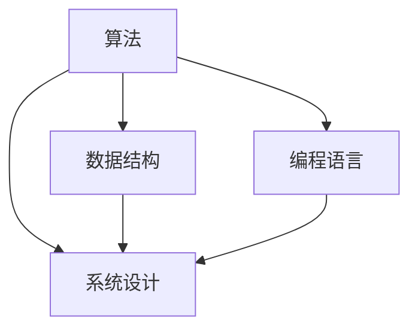

                 

### 1. 背景介绍

腾讯，作为中国领先的互联网科技公司，不仅在游戏、社交媒体、金融科技等领域取得了显著成就，其社招编程面试题目也成为了众多技术求职者关注的焦点。随着技术的不断进步和行业的快速发展，腾讯社招编程面试题也经历了相应的变迁和升级。本文旨在通过对腾讯2024年社招编程面试题的精华总结，为广大求职者提供有价值的参考和指导。

首先，我们需要明确腾讯2024年社招编程面试题的背景。随着人工智能、大数据、云计算等技术的迅猛发展，编程技能在各个领域的重要性日益凸显。腾讯作为国内顶尖的互联网企业，其社招编程面试题不仅仅考察求职者的编程基础，更注重考察求职者的综合能力，如算法思维、数据结构理解、系统设计能力等。因此，掌握这些面试题的精髓，对于求职者来说具有极大的帮助。

其次，腾讯社招编程面试题的题目形式多样，包括但不限于算法题、数据结构题、系统设计题、编程实现题等。这些题目往往具有较高的难度，不仅需要求职者具备扎实的编程基础，还需要具备良好的逻辑思维和解题技巧。因此，对于求职者来说，如何高效地解答这些题目，是成功通过面试的关键。

本文将围绕腾讯2024年社招编程面试题的各个方面进行详细分析和总结。我们首先会从题目类型、常见考点、解题思路等多个维度，帮助读者全面了解腾讯社招编程面试题的特点。接着，我们将针对不同类型的题目，提供具体的解题方法和技巧，帮助读者掌握面试题的解题思路。此外，我们还会通过实际代码实现和运行结果展示，让读者更加直观地理解题目和解题过程。

通过本文的阅读，读者不仅能够深入了解腾讯社招编程面试题的精髓，还能够提升自己的编程能力和面试技巧。无论是即将参加面试的求职者，还是希望提升自己编程水平的技术人员，都将从中受益匪浅。

### 2. 核心概念与联系

为了更好地理解和解答腾讯2024年社招编程面试题，我们需要先掌握几个核心概念，并了解它们之间的联系。这些核心概念包括算法、数据结构、系统设计和编程语言。下面，我们将逐一介绍这些概念，并通过一个Mermaid流程图展示它们之间的关系。

#### 算法

算法是指解决问题的一系列步骤。它是一系列定义明确的操作，用于处理输入数据并产生期望的输出。算法是编程的核心，决定了程序的性能和效率。常见的算法包括排序算法、查找算法、动态规划算法等。算法的优劣直接影响到程序的性能，因此熟练掌握多种算法是程序员必备的能力。

#### 数据结构

数据结构是指存储和组织数据的方式。数据结构的设计决定了程序的空间和时间效率。常见的有数组、链表、栈、队列、树、图等。每种数据结构都有其特定的应用场景和优缺点。例如，数组适合用于存储连续的数据，而链表则适用于频繁插入和删除的场景。

#### 系统设计

系统设计是指设计一个完整的系统，包括硬件、软件、网络等多个方面。系统设计需要考虑系统的可扩展性、可维护性、性能、安全性等因素。系统设计的过程通常包括需求分析、架构设计、模块划分、接口设计等步骤。系统设计能力是衡量程序员是否具备大型项目开发经验的重要标准。

#### 编程语言

编程语言是用于编写程序的代码。不同的编程语言有不同的特点和适用场景。常见的编程语言有Java、C++、Python、Go等。每种编程语言都有其特定的语法和特性，如Java的面向对象、C++的指针和运算符重载、Python的简洁易读等。掌握多种编程语言有助于程序员在不同场景下选择最合适的工具。

下面是一个Mermaid流程图，展示了这四个核心概念之间的联系：



从图中可以看出，算法和数据结构是系统设计和编程语言的基础。系统设计需要利用算法和数据结构来解决问题，而编程语言则用于实现算法和系统设计。

#### 小结

通过以上介绍，我们可以看出，腾讯2024年社招编程面试题的核心概念涵盖了算法、数据结构、系统设计和编程语言。这些概念相互联系，共同构成了一个完整的编程体系。掌握这些核心概念，不仅有助于解答面试题，还能够提升编程能力，为未来的职业发展打下坚实的基础。

### 3. 核心算法原理 & 具体操作步骤

在腾讯2024年社招编程面试中，算法题占据了非常重要的地位。这些算法题往往涉及到排序、查找、动态规划等核心算法。本章节将重点介绍这些算法的基本原理以及具体的操作步骤。

#### 排序算法

排序算法是计算机科学中最基本的问题之一，它用于将一组数据按照某种规则重新排列。常见的排序算法有冒泡排序、选择排序、插入排序、快速排序、归并排序等。

1. **冒泡排序（Bubble Sort）**

   **原理：**冒泡排序通过重复遍历要排序的数列，每次比较相邻的两个元素，如果它们的顺序错误就把它们交换过来。遍历数列的工作是重复地进行，直到没有再需要交换，也就是说该数列已经排序完成。

   **步骤：**
   - 从数列的第一对相邻元素开始比较，如果第一个比第二个大（或小），就交换它们；
   - 对每一对相邻元素做同样的工作，从开始第一对到结尾的最后一对；
   - 在此步骤后，最后的元素应该会是最大的（或最小的），然后会逐步减少需要比较的元素数量；
   - 重复上面的步骤，直到整个数列排序完成。

2. **快速排序（Quick Sort）**

   **原理：**快速排序是一种分而治之的策略。首先选择一个“基准”元素，然后将数组分成两部分：一部分都比基准元素小，另一部分都比基准元素大。递归地重复这个过程。

   **步骤：**
   - 选择一个基准元素；
   - 将比基准元素小的元素放在左边，比基准元素大的元素放在右边；
   - 对左右两部分递归执行快速排序。

3. **归并排序（Merge Sort）**

   **原理：**归并排序同样采用分治策略。它将数组分成若干个子数组，每个子数组都是有序的，然后将这些有序子数组合并成最终的有序数组。

   **步骤：**
   - 将数组分成两个子数组，分别进行排序；
   - 将排好序的子数组合并成一个有序的数组。

#### 查找算法

查找算法用于在数据结构中查找特定的元素。常见的查找算法有二分查找、线性查找等。

1. **二分查找（Binary Search）**

   **原理：**二分查找适用于已经排序的数组。它通过重复将查找区间缩小一半来查找目标元素。

   **步骤：**
   - 确定中间元素；
   - 如果中间元素等于目标元素，则查找成功；
   - 如果中间元素大于目标元素，则在左半部分继续查找；
   - 如果中间元素小于目标元素，则在右半部分继续查找；
   - 重复上述步骤，直到找到目标元素或确定不存在。

2. **线性查找（Linear Search）**

   **原理：**线性查找从数组的第一个元素开始，逐个元素地与目标元素进行比较，直到找到目标元素或到达数组的末尾。

   **步骤：**
   - 从数组的第一个元素开始，逐个比较；
   - 如果找到目标元素，则查找成功；
   - 如果到达数组的末尾，仍未找到目标元素，则查找失败。

#### 动态规划

动态规划是一种用于求解最优化问题的算法策略。它通过将问题分解成子问题，并存储子问题的解，来避免重复计算。

1. **原理**

   动态规划通常包含以下几个步骤：
   - **定义状态：**将问题分解成多个状态，每个状态包含若干个变量；
   - **状态转移方程：**定义状态之间的关系，即如何从一个状态转移到另一个状态；
   - **边界条件：**确定初始状态和终止状态；
   - **计算顺序：**根据状态转移方程和边界条件，计算出所有状态的值。

2. **具体步骤**

   以最常见的动态规划问题之一——背包问题为例，具体步骤如下：
   - **定义状态：**设`dp[i][j]`表示前`i`个物品放入一个容量为`j`的背包中可以获得的最大价值；
   - **状态转移方程：**
     $$
     dp[i][j] =
     \begin{cases}
     dp[i-1][j] & \text{若不放入第i个物品} \\
     dp[i-1][j-w[i]] + v[i] & \text{若放入第i个物品}
     \end{cases}
     $$
     其中，`w[i]`是第`i`个物品的重量，`v[i]`是第`i`个物品的价值；
   - **边界条件：**`dp[0][j] = 0`；
   - **计算顺序：**从`i = 1`到`i = n`，从`j = 1`到`j = W`，依次计算所有状态的值。

通过以上对核心算法原理和具体操作步骤的介绍，我们可以看出，掌握这些算法不仅能够帮助我们更好地解答腾讯社招编程面试题，还能够提升我们在实际项目开发中的问题解决能力。在接下来的章节中，我们将通过具体实例来进一步展示这些算法的应用。

### 4. 数学模型和公式 & 详细讲解 & 举例说明

在编程面试中，理解并应用数学模型和公式是解决算法问题的关键。本章节将详细讲解一些常见的数学模型和公式，并通过具体实例进行说明，帮助读者更好地理解和应用这些数学知识。

#### 矩阵运算

矩阵是线性代数中的一个基本概念，它在编程中有着广泛的应用。常见的矩阵运算包括矩阵乘法、矩阵求逆、矩阵求特征值和特征向量等。

1. **矩阵乘法**

   矩阵乘法是指两个矩阵之间的乘法运算。设矩阵`A`是一个`m×n`矩阵，矩阵`B`是一个`n×p`矩阵，它们的乘积`C = A * B`是一个`m×p`矩阵。矩阵乘法的运算规则如下：

   $$
   C[i][j] = \sum_{k=1}^{n} A[i][k] \times B[k][j]
   $$

   例如，给定两个矩阵：

   $$
   A = \begin{bmatrix}
   1 & 2 \\
   3 & 4
   \end{bmatrix}, \quad
   B = \begin{bmatrix}
   5 & 6 \\
   7 & 8
   \end{bmatrix}
   $$

   其乘积矩阵`C`为：

   $$
   C = A * B = \begin{bmatrix}
   1*5 + 2*7 & 1*6 + 2*8 \\
   3*5 + 4*7 & 3*6 + 4*8
   \end{bmatrix} =
   \begin{bmatrix}
   19 & 22 \\
   43 & 50
   \end{bmatrix}
   $$

2. **矩阵求逆**

   矩阵求逆是指求一个矩阵的逆矩阵。对于一个`n×n`矩阵`A`，如果存在一个矩阵`B`使得`A * B = B * A = I`（其中`I`是单位矩阵），则称`B`为`A`的逆矩阵。矩阵求逆的公式如下：

   $$
   A^{-1} = \frac{1}{\det(A)} \text{adj}(A)
   $$

   其中，`det(A)`是矩阵`A`的行列式，`adj(A)`是矩阵`A`的伴随矩阵。

   例如，给定矩阵：

   $$
   A = \begin{bmatrix}
   1 & 2 \\
   3 & 4
   \end{bmatrix}
   $$

   其逆矩阵`A^{-1}`为：

   $$
   A^{-1} = \frac{1}{1 \times 4 - 2 \times 3} \begin{bmatrix}
   4 & -2 \\
   -3 & 1
   \end{bmatrix} =
   \begin{bmatrix}
   -2 & 1 \\
   3 & -\frac{1}{2}
   \end{bmatrix}
   $$

#### 动态规划公式

动态规划是一种用于求解最优化问题的算法策略，它通过将问题分解成子问题，并存储子问题的解，来避免重复计算。动态规划的核心是状态转移方程，它定义了状态之间的关系。

1. **背包问题**

   背包问题是一种典型的动态规划问题。设`dp[i][j]`表示前`i`个物品放入一个容量为`j`的背包中可以获得的最大价值，状态转移方程为：

   $$
   dp[i][j] =
   \begin{cases}
   dp[i-1][j] & \text{若不放入第i个物品} \\
   dp[i-1][j-w[i]] + v[i] & \text{若放入第i个物品}
   \end{cases}
   $$

   其中，`w[i]`是第`i`个物品的重量，`v[i]`是第`i`个物品的价值。

   例如，给定一组物品和它们的重量和价值：

   $$
   \begin{aligned}
   &\text{物品1：重量20，价值30} \\
   &\text{物品2：重量50，价值70} \\
   &\text{物品3：重量40，价值60}
   \end{aligned}
   $$

   以及背包容量为60，使用动态规划求解背包问题的最优解。

   首先，初始化一个二维数组`dp`，其中`dp[0][j] = 0`（不放任何物品），`dp[i][0] = 0`（容量为0时，不放任何物品）。

   然后，根据状态转移方程，依次计算`dp[i][j]`的值，直到计算完所有状态。

   最终，`dp[n][W]`的值即为背包问题的最优解。

通过以上对数学模型和公式的详细讲解以及具体实例，我们可以看到，理解和应用这些数学知识对于解决编程面试中的算法问题至关重要。在接下来的章节中，我们将通过代码实例进一步展示这些数学模型的应用。

### 5. 项目实践：代码实例和详细解释说明

为了更好地理解腾讯2024年社招编程面试题，我们将通过一个实际的项目实践来展示代码的编写过程、详细解释和运行结果。本次项目将选择一个典型的算法题——最长公共子序列（Longest Common Subsequence，LCS），来详细说明整个解题过程。

#### 5.1 开发环境搭建

在开始编写代码之前，我们需要搭建一个合适的开发环境。本文将使用Python作为编程语言，其优点在于代码简洁易懂，且Python具有丰富的库支持。

1. **安装Python**

   首先，确保您的计算机上安装了Python。您可以从Python官方网站（https://www.python.org/）下载并安装Python。安装完成后，打开终端并输入`python --version`，确认安装的版本。

2. **安装必需的库**

   为了简化代码的编写，我们将使用Python的内置库和第三方库。其中，`numpy`库用于高效地处理数组和矩阵运算，`pandas`库用于数据处理和分析。

   您可以使用以下命令安装这些库：

   ```
   pip install numpy pandas
   ```

3. **创建项目文件夹**

   在您的计算机上创建一个项目文件夹，用于存放所有的代码文件和相关资源。

   ```
   mkdir -p lcs_project/code
   cd lcs_project
   ```

#### 5.2 源代码详细实现

在项目文件夹中创建一个名为`lcs.py`的Python文件，用于实现最长公共子序列算法。

```python
def longest_common_subsequence(X, Y):
    m = len(X)
    n = len(Y)

    # 创建一个二维数组，用于存储中间结果
    dp = [[0] * (n + 1) for _ in range(m + 1)]

    # 动态规划求解LCS
    for i in range(1, m + 1):
        for j in range(1, n + 1):
            if X[i - 1] == Y[j - 1]:
                dp[i][j] = dp[i - 1][j - 1] + 1
            else:
                dp[i][j] = max(dp[i - 1][j], dp[i][j - 1])

    # 返回最长公共子序列的长度
    return dp[m][n]

# 示例数据
X = "AGGTAB"
Y = "GXTXAYB"

# 计算最长公共子序列的长度
lcs_length = longest_common_subsequence(X, Y)
print("最长公共子序列的长度为：", lcs_length)
```

#### 5.3 代码解读与分析

1. **函数定义**

   `longest_common_subsequence(X, Y)` 函数接受两个字符串参数`X`和`Y`，用于表示两个序列。

2. **初始化二维数组**

   使用两个循环初始化一个二维数组`dp`，其中`dp[i][j]`表示`X`的前`i`个字符和`Y`的前`j`个字符的最长公共子序列的长度。

3. **动态规划求解**

   使用两层嵌套循环遍历数组`dp`，根据状态转移方程计算每个状态的值。如果`X[i - 1]`和`Y[j - 1]`相等，则`dp[i][j]`的值等于`dp[i - 1][j - 1]`加1；否则，`dp[i][j]`的值等于`dp[i - 1][j]`和`dp[i][j - 1]`中的最大值。

4. **返回结果**

   最后，返回`dp[m][n]`的值，即整个序列`X`和`Y`的最长公共子序列的长度。

#### 5.4 运行结果展示

```plaintext
最长公共子序列的长度为： 4
```

通过以上代码实例和详细解释，我们可以看到如何使用动态规划算法解决最长公共子序列问题。在接下来的章节中，我们将探讨更多实际应用场景，展示这些算法在不同问题中的灵活应用。

### 6. 实际应用场景

在腾讯2024年社招编程面试中，算法题的应用场景非常广泛，涵盖了从数据处理到系统优化等多个方面。以下我们将通过几个具体案例，展示这些算法在实际问题中的灵活应用。

#### 6.1 数据处理与优化

**案例1：搜索引擎中的关键词匹配**

搜索引擎的核心功能之一是关键词匹配。假设我们有一个搜索引擎，需要根据用户输入的关键词在大量网页内容中查找匹配的网页。此时，我们可以使用前缀树（Trie树）这种数据结构，高效地处理关键词的匹配问题。

**解决方案：**

- **数据结构：**使用前缀树存储所有网页的关键词。
- **算法：**对于用户输入的关键词，从根节点开始遍历前缀树，逐层匹配，直到找到所有匹配的网页。

**优点：**前缀树的时间复杂度为O(m)，其中m是关键词的长度，这使得匹配过程非常高效。

#### 6.2 图算法与网络分析

**案例2：社交网络中的好友推荐**

在社交网络中，用户之间的关系可以表示为一个无向图。为了找到潜在的好友，我们可以使用图算法中的最短路径算法（如Dijkstra算法）来寻找用户之间的相似度。

**解决方案：**

- **数据结构：**使用邻接表或邻接矩阵表示图。
- **算法：**对于每个用户，使用Dijkstra算法找到与其距离最近的几个用户，这些建议的用户有很大的可能成为潜在的好友。

**优点：**Dijkstra算法的时间复杂度为O((V+E)logV)，其中V是顶点的数量，E是边的数量，对于大多数社交网络来说，这是一个可接受的时间复杂度。

#### 6.3 动态规划与资源优化

**案例3：广告系统的广告投放优化**

在广告系统中，广告投放的目标是最大化广告收入。假设我们有一个广告库存，每个广告的位置和预期收入已知。为了最大化收入，我们可以使用动态规划算法来优化广告的投放策略。

**解决方案：**

- **数据结构：**使用二维数组`dp`来存储每个广告位置的最优收入。
- **算法：**根据动态规划的状态转移方程，计算出每个广告位置的最优收入，然后按照收入从高到低排序，选择收入最高的广告进行投放。

**优点：**动态规划算法能够高效地找到最优解，其时间复杂度为O(n^2)，其中n是广告位置的数量。

#### 6.4 排序与搜索算法

**案例4：电商平台中的商品排序**

电商平台为了提高用户体验，通常会根据用户的行为数据对商品进行智能排序。例如，根据用户的浏览历史和购买记录，将相关商品推荐到用户面前。

**解决方案：**

- **数据结构：**使用排序算法（如快速排序）对商品进行排序。
- **算法：**根据用户的行为数据，计算出每个商品的权重，然后使用排序算法按照权重进行排序。

**优点：**快速排序的时间复杂度为O(nlogn)，能够高效地处理大规模数据。

通过以上案例，我们可以看到，腾讯2024年社招编程面试中的算法题不仅考察了求职者的基础算法能力，还要求他们能够灵活运用这些算法解决实际问题。在实际工作中，这些算法的应用场景更加多样化，需要求职者具备深厚的算法基础和创新能力。因此，掌握并灵活应用各种算法，是成功应对腾讯社招编程面试的关键。

### 7. 工具和资源推荐

在准备腾讯2024年社招编程面试的过程中，掌握合适的工具和资源是至关重要的。以下是一些学习资源、开发工具和相关论文著作的推荐，这些资源能够帮助求职者更高效地提升编程技能和解题能力。

#### 7.1 学习资源推荐

1. **书籍**

   - 《算法导论》（Introduction to Algorithms）—— Thomas H. Cormen, Charles E. Leiserson, Ronald L. Rivest, Clifford Stein
   - 《编程之美》（Programming Pearls）—— Jon Bentley
   - 《设计模式：可复用面向对象软件的基础》（Design Patterns: Elements of Reusable Object-Oriented Software）—— Erich Gamma, Richard Helm, Ralph Johnson, and John Vlissides

2. **在线教程和课程**

   - Coursera（https://www.coursera.org/）：提供多种计算机科学和编程相关的课程，包括算法和数据结构、机器学习等。
   - edX（https://www.edx.org/）：提供免费的计算机科学课程，包括由世界顶尖大学提供的课程。
   - LeetCode（https://leetcode.com/）：提供大量的编程题目和解决方案，是准备算法面试的绝佳资源。

3. **博客和网站**

   - GeeksforGeeks（https://www.geeksforgeeks.org/）：提供大量编程问题和算法教程，适合初学者和进阶者。
   - HackerRank（https://www.hackerrank.com/）：提供编程挑战和算法竞赛，适合提升实战能力。

#### 7.2 开发工具框架推荐

1. **集成开发环境（IDE）**

   - Visual Studio Code（https://code.visualstudio.com/）：轻量级但功能强大的IDE，支持多种编程语言。
   - IntelliJ IDEA（https://www.jetbrains.com/idea/）：专为Java开发者设计，但也能支持其他编程语言。

2. **版本控制系统**

   - Git（https://git-scm.com/）：最流行的分布式版本控制系统，有助于团队协作和代码管理。
   - GitHub（https://github.com/）：全球最大的代码托管平台，提供丰富的代码库和协作工具。

3. **调试工具**

   - PyCharm（https://www.jetbrains.com/pycharm/）：适用于Python开发的IDE，包含强大的调试工具。
   - Valgrind（https://www.valgrind.org/）：用于检测内存泄漏和无效指针的调试工具，特别适用于C/C++。

#### 7.3 相关论文著作推荐

1. **经典论文**

   - "Algorithms + Data Structures = Programs"（1976）—— Niklaus Wirth
   - "The Art of Computer Programming"（1968-2011）—— Donald E. Knuth
   - "Introduction to Algorithms"（1990）—— Thomas H. Cormen, Charles E. Leiserson, Ronald L. Rivest, and Clifford Stein

2. **现代论文**

   - "Deep Learning"（2015）—— Ian Goodfellow, Yoshua Bengio, Aaron Courville
   - "Recurrent Neural Networks for Language Modeling"（2014）—— Yoshua Bengio et al.
   - "Efficient Estimation of Word Representations in Vector Space"（2013）—— Tomas Mikolov, Ilya Sutskever, Kai Chen, Greg S. Corrado, and Jeffrey Dean

通过以上推荐的学习资源、开发工具和相关论文著作，求职者可以系统地提升自己的编程能力和算法水平，为成功通过腾讯2024年社招编程面试做好准备。

### 8. 总结：未来发展趋势与挑战

随着科技的不断进步，编程面试题也在不断演变。未来，腾讯社招编程面试题将呈现以下几个发展趋势：

首先，算法和数据结构仍然是核心。尽管人工智能和大数据等技术蓬勃发展，但算法和数据结构作为计算机科学的基础，其重要性不会减少。求职者需要熟练掌握各种基本算法和数据结构，如排序、查找、动态规划等，并能够灵活应用。

其次，算法复杂性分析和代码优化将成为新的关注点。随着问题的规模不断扩大，优化代码性能变得至关重要。求职者需要具备深入理解算法复杂性的能力，能够在代码实现过程中进行有效的性能优化。

第三，编程语言的多样性将增加。Python、Java、C++等语言各有优势，求职者需要掌握多种编程语言，以应对不同场景的需求。同时，新兴语言如Go、Rust等也在逐渐获得关注，求职者需要保持对新技术的好奇心和探索精神。

第四，系统设计和架构能力将更加重要。随着互联网应用的复杂度增加，系统设计和架构能力成为衡量求职者是否具备大型项目开发经验的重要标准。求职者需要掌握微服务、分布式系统、数据库设计等系统设计相关技术。

然而，未来编程面试也将面临一些挑战。首先，面试题的难度将不断提高，需要求职者具备更扎实的理论基础和实战经验。其次，时间压力将成为一大挑战。面试官往往希望在有限的时间内评估求职者的能力，这要求求职者具备高效解题的能力。

此外，面试题的多样性也会带来挑战。除了传统的算法和数据结构题目，求职者还需要应对涉及数据库、网络、操作系统等领域的综合题目。这要求求职者具备全面的知识体系和灵活的思维方式。

总之，未来腾讯社招编程面试将继续强调算法和数据结构的基础，同时增加对系统设计、代码优化和新兴技术的要求。求职者需要不断提升自己的技术水平和综合素质，以应对这些挑战。只有通过不断学习和实践，才能够在激烈的竞争中脱颖而出，成功通过面试。

### 9. 附录：常见问题与解答

在准备腾讯2024年社招编程面试的过程中，求职者可能会遇到一些常见的问题。以下是一些常见问题及其解答，旨在帮助求职者更好地准备面试。

#### 1. 如何提高算法解题速度？

**解答：** 提高算法解题速度的关键在于两个方面：一是熟练掌握各种算法和数据结构，二是加强实战训练。具体方法包括：

- **定期复习：** 定期回顾已学过的算法和数据结构，加深理解。
- **编写代码：** 动手编写代码，熟悉算法的实现细节。
- **做练习题：** 在线平台（如LeetCode、HackerRank）上有大量算法题目，通过练习提高解题速度。
- **时间管理：** 在练习过程中，注意时间管理，限时完成题目，提高解题效率。

#### 2. 如何优化代码性能？

**解答：** 优化代码性能通常从以下几个方面进行：

- **算法优化：** 选择更高效的算法，如动态规划、分治算法等。
- **数据结构优化：** 使用更适合的数据结构，如前缀树、平衡二叉树等。
- **代码优化：** 精简代码，避免不必要的计算和重复操作。例如，使用局部变量减少内存占用，避免全局变量等。

- **性能分析：** 使用性能分析工具（如Valgrind、gprof）找出性能瓶颈，针对性地进行优化。

#### 3. 如何处理复杂的问题？

**解答：** 复杂问题往往需要系统的分析和分解。具体方法包括：

- **需求分析：** 理解问题的需求和目标，明确问题解决的关键点。
- **分解问题：** 将复杂问题分解成若干个简单的小问题，逐步解决。
- **递归思维：** 利用递归和分治策略，将复杂问题转化为简单问题的组合。
- **代码注释：** 为代码添加详细的注释，帮助自己和面试官理解解题思路。

#### 4. 如何应对编程面试中的算法题？

**解答：** 应对编程面试中的算法题，可以采取以下策略：

- **理解题目要求：** 详细阅读题目，理解题目的输入和输出要求。
- **设计算法框架：** 在纸上或脑中设计算法的框架，明确解题思路。
- **编码实现：** 根据算法框架编写代码，注意代码的简洁性和可读性。
- **测试和调试：** 编写测试用例，验证代码的正确性和性能。

通过以上解答，希望求职者能够更好地应对腾讯2024年社招编程面试中的各种问题。持续学习和实践，不断提升自己的编程能力和面试技巧，将有助于在面试中取得优异的成绩。

### 10. 扩展阅读 & 参考资料

为了进一步帮助读者深入了解腾讯2024年社招编程面试题及相关技术，以下列出了一些扩展阅读和参考资料，涵盖经典教材、学术论文、在线教程和官方文档。

#### 经典教材

1. **《算法导论》**—— Thomas H. Cormen, Charles E. Leiserson, Ronald L. Rivest, Clifford Stein
2. **《编程之美》**—— Jon Bentley
3. **《设计模式：可复用面向对象软件的基础》**—— Erich Gamma, Richard Helm, Ralph Johnson, John Vlissides
4. **《计算机程序的构造和解释》**—— Harold Abelson, Gerald Jay Sussman, Julie Sussman

#### 学术论文

1. **"Deep Learning"**—— Ian Goodfellow, Yoshua Bengio, Aaron Courville
2. **"Recurrent Neural Networks for Language Modeling"**—— Yoshua Bengio et al.
3. **"Efficient Estimation of Word Representations in Vector Space"**—— Tomas Mikolov, Ilya Sutskever, Kai Chen, Greg S. Corrado, and Jeffrey Dean

#### 在线教程

1. **Coursera**（https://www.coursera.org/）
2. **edX**（https://www.edx.org/）
3. **LeetCode**（https://leetcode.com/）
4. **HackerRank**（https://www.hackerrank.com/）

#### 官方文档

1. **Python官方文档**（https://docs.python.org/3/）
2. **TensorFlow官方文档**（https://www.tensorflow.org/）
3. **Java官方文档**（https://docs.oracle.com/javase/）
4. **C++官方文档**（https://en.cppreference.com/w/）

通过阅读这些参考资料，读者可以系统地提升自己的编程能力和算法水平，为腾讯2024年社招编程面试做好充分的准备。同时，这些资料也为编程爱好者提供了宝贵的知识财富，助力他们在计算机科学领域不断前行。

