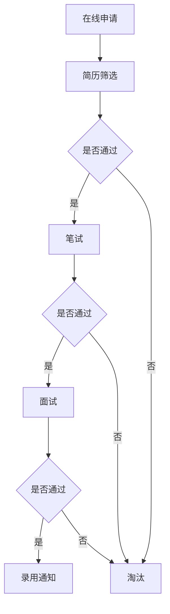

                 

### 腾讯2025社招面试常见问题及答案全攻略

#### 关键词：
1. 腾讯
2. 社招面试
3. 常见问题
4. 答案全攻略
5. 技术面试
6. 职业发展

#### 摘要：
本文将为您全面解析腾讯2025社招面试的常见问题，并提供详尽的答案全攻略。通过分析面试流程、核心技术考点和实战案例分析，帮助您掌握面试技巧，顺利通过腾讯社招面试，开启职业生涯新篇章。

## 1. 背景介绍

腾讯，作为中国领先的互联网科技公司，拥有广泛的业务覆盖，包括社交媒体、在线娱乐、金融科技、云计算等领域。作为行业领军企业，腾讯每年都会招聘大量社会人才，以满足公司快速发展的需求。社招面试对于求职者而言，是展示自身能力和职业素养的重要环节。本文旨在为有意向加入腾讯的社会人才提供一份全面的面试指南，帮助大家应对腾讯社招面试的各种挑战。

### 1.1 腾讯招聘流程

腾讯的社招面试流程一般包括以下几个环节：

1. **在线申请**：通过腾讯招聘官网或第三方招聘平台提交简历。
2. **简历筛选**：HR团队根据简历筛选符合岗位要求的候选人。
3. **笔试**：通过在线笔试或现场笔试的形式，测试候选人的技术能力和问题解决能力。
4. **面试**：包括技术面试、HR面试和团队面试等环节，全面评估候选人的综合素质。
5. **录用通知**：通过面试的候选人将收到腾讯的录用通知。

### 1.2 社招面试的重要性

社招面试不仅是对候选人专业技能的考核，更是对公司文化和价值观的契合度评估。对于求职者而言，一次成功的社招面试意味着职业生涯的重要一步。因此，充分准备和了解腾讯社招面试的相关信息，对于提升面试成功率至关重要。

## 2. 核心概念与联系

### 2.1 面试流程概述

在腾讯的社招面试中，面试流程是一个关键的核心概念。面试流程通常包括以下几个主要环节：

1. **初试**：由HR或技术专家进行的初步面试，主要了解候选人的基本信息、职业背景和求职意向。
2. **复试**：由业务部门主管或技术大牛进行的深入面试，重点考察候选人的专业技能和实际工作经验。
3. **终试**：由公司高层或资深技术专家进行的面试，全面评估候选人的综合能力和潜力。

### 2.2 面试考点分析

腾讯社招面试的考点主要包括以下几个方面：

1. **基础知识**：包括数据结构、算法、操作系统、计算机网络等。
2. **编程能力**：通过编程题目或代码审查来评估候选人的编程技能和逻辑思维能力。
3. **项目经验**：通过详细询问候选人的项目经历，了解其实际工作能力和解决问题的能力。
4. **软技能**：包括沟通能力、团队协作能力、自我学习能力等。

### 2.3 面试技巧指导

为了在腾讯社招面试中脱颖而出，以下是一些面试技巧：

1. **提前准备**：充分了解腾讯的企业文化、业务领域和最新动态。
2. **知识点梳理**：系统复习相关技术知识，尤其是面试重点领域。
3. **模拟面试**：通过模拟面试来提升应对实际面试的信心和技巧。
4. **时间管理**：合理安排面试时间，避免出现紧张和遗忘的情况。

### 2.4 Mermaid 流程图

以下是一个简化的腾讯社招面试流程的Mermaid流程图：



通过上述流程图，我们可以清晰地看到腾讯社招面试的各个环节和逻辑关系。

## 3. 核心算法原理 & 具体操作步骤

### 3.1 常见编程题算法解析

在腾讯社招面试中，编程题目是考察候选人编程能力和逻辑思维的重要环节。以下是一些常见的编程题及其算法解析：

#### 3.1.1 颠倒整数

**问题**：给定一个32位有符号整数x，将x进行反转并返回。

**算法原理**：使用位运算和取模运算，逐步反转整数的每一位。

**具体步骤**：

1. 初始化一个结果变量`res`，用于存储反转后的整数。
2. 初始化一个变量`sign`，用于存储整数的正负，初始值为1。
3. 如果输入的整数`x`小于0，将`sign`赋值为-1，并将`x`取反。
4. 循环执行以下步骤，直到`x`为0：
   - 取`x`的个位数字`tmp`。
   - 将`tmp`乘以`10`的当前幂次，添加到`res`上。
   - `x`右移一位。
5. 根据变量`sign`的值，返回反转后的整数。

**示例代码**：

```c++
int reverse(int x) {
    int res = 0, sign = 1;
    if (x < 0) {
        sign = -1;
        x = -x;
    }
    while (x) {
        int tmp = x % 10;
        res = res * 10 + tmp;
        x /= 10;
    }
    return res * sign;
}
```

#### 3.1.2 最长公共前缀

**问题**：编写一个函数来查找字符串数组中的最长公共前缀。

**算法原理**：使用字符串比较和迭代的方法，逐步找到所有字符串的最长公共前缀。

**具体步骤**：

1. 如果字符串数组为空，返回空字符串。
2. 将第一个字符串作为基准字符串。
3. 循环执行以下步骤，直到找到最长公共前缀：
   - 对比当前基准字符串与数组中每个字符串的前缀，找到最长公共前缀。
   - 将最长公共前缀作为新的基准字符串。
4. 返回最长公共前缀。

**示例代码**：

```python
def longestCommonPrefix(strs):
    if not strs:
        return ""
    prefix = strs[0]
    for s in strs[1:]:
        while not s.startswith(prefix):
            prefix = prefix[:-1]
            if not prefix:
                return ""
    return prefix
```

### 3.2 面试实战案例分析

#### 3.2.1 面试题：排序算法比较

**问题**：比较冒泡排序、选择排序和插入排序的效率，并给出原因。

**算法原理**：分析三种排序算法的基本原理和时间复杂度。

**具体步骤**：

1. **冒泡排序**：
   - 原理：通过重复遍历要排序的数列，一次比较两个元素，如果它们的顺序错误就把它们交换过来。
   - 时间复杂度：O(n^2)。

2. **选择排序**：
   - 原理：首先在未排序序列中找到最小（大）元素，存放到排序序列的起始位置，然后，再从剩余未排序元素中继续寻找最小（大）元素，然后放到已排序序列的末尾。
   - 时间复杂度：O(n^2)。

3. **插入排序**：
   - 原理：通过构建有序序列，对于未排序数据，在已排序序列中从后向前扫描，找到相应位置并插入。
   - 时间复杂度：O(n^2)。

**效率比较**：

- 在数据基本有序或小规模数据时，插入排序通常比冒泡排序和选择排序更高效。
- 选择排序在处理大规模数据时，由于每次只交换一次，所以速度较快。
- 冒泡排序由于需要多次交换，在处理大规模数据时效率较低。

**示例代码**：

```c++
void bubbleSort(int arr[], int n) {
    for (int i = 0; i < n-1; i++) {
        for (int j = 0; j < n-i-1; j++) {
            if (arr[j] > arr[j+1]) {
                swap(arr[j], arr[j+1]);
            }
        }
    }
}

void selectionSort(int arr[], int n) {
    for (int i = 0; i < n-1; i++) {
        int min_idx = i;
        for (int j = i+1; j < n; j++) {
            if (arr[j] < arr[min_idx]) {
                min_idx = j;
            }
        }
        swap(arr[min_idx], arr[i]);
    }
}

void insertionSort(int arr[], int n) {
    for (int i = 1; i < n; i++) {
        int key = arr[i];
        int j = i-1;
        while (j >= 0 && arr[j] > key) {
            arr[j+1] = arr[j];
            j = j-1;
        }
        arr[j+1] = key;
    }
}
```

## 4. 数学模型和公式 & 详细讲解 & 举例说明

在腾讯的社招面试中，数学模型和公式是评估候选人逻辑思维和数学能力的重要指标。以下是一些常见的数学模型和公式，以及详细的讲解和示例。

### 4.1 排序算法时间复杂度

排序算法是面试中常见的问题，以下是一些排序算法的时间复杂度公式：

- **冒泡排序**：$T(n) = O(n^2)$
- **选择排序**：$T(n) = O(n^2)$
- **插入排序**：$T(n) = O(n^2)$
- **归并排序**：$T(n) = O(n\log n)$
- **快速排序**：$T(n) = O(n\log n)$

### 4.2 搜索算法时间复杂度

搜索算法是另一种常见的面试问题，以下是一些搜索算法的时间复杂度公式：

- **二分搜索**：$T(n) = O(\log n)$
- **线性搜索**：$T(n) = O(n)$

### 4.3 数据结构基本公式

数据结构是计算机科学的基础，以下是一些常见数据结构的基本公式：

- **数组**：$O(1)$（平均时间复杂度）
- **链表**：$O(n)$（平均时间复杂度）
- **栈**：$O(1)$（平均时间复杂度）
- **队列**：$O(1)$（平均时间复杂度）

### 4.4 概率论公式

概率论是面试中常见的数学领域，以下是一些基本概率论公式：

- **条件概率**：$P(A|B) = \frac{P(A \cap B)}{P(B)}$
- **贝叶斯定理**：$P(A|B) = \frac{P(B|A)P(A)}{P(B)}$

### 4.5 示例讲解

#### 4.5.1 冒泡排序算法时间复杂度计算

假设有如下数组：`[3, 1, 4, 1, 5, 9]`

- **第一次遍历**：
  - 比较：$3$次
  - 交换：$1$次
  - 时间复杂度：$O(n)$
- **第二次遍历**：
  - 比较：$2$次
  - 交换：$0$次
  - 时间复杂度：$O(n)$
- **第三次遍历**：
  - 比较：$1$次
  - 交换：$0$次
  - 时间复杂度：$O(n)$

总时间复杂度：$3 \times O(n) = O(n^2)$

#### 4.5.2 二分搜索算法时间复杂度计算

假设有如下有序数组：`[1, 2, 3, 4, 5, 6, 7, 8, 9]`

- **第一次搜索**：
  - 中间元素：$5$
  - 目标值：$6$
  - 下一次搜索范围：`[6, 7, 8, 9]`
  - 时间复杂度：$O(\log n)$
- **第二次搜索**：
  - 中间元素：$7$
  - 目标值：$6$
  - 下一次搜索范围：`[6, 7]`
  - 时间复杂度：$O(\log n)$
- **第三次搜索**：
  - 中间元素：$6$
  - 目标值：$6$
  - 找到目标值，结束搜索

总时间复杂度：$3 \times O(\log n) = O(\log n)$

通过上述示例，我们可以清晰地看到不同算法在处理不同数据时的效率差异，以及如何通过数学模型和公式来计算算法的时间复杂度。

### 5. 项目实践：代码实例和详细解释说明

在腾讯的社招面试中，项目实践是一个重要的环节，通过代码实例可以展示求职者的实际编程能力和解决问题的能力。以下我们将通过一个具体的代码实例，详细解释其实现原理和步骤。

#### 5.1 开发环境搭建

在开始代码实例之前，我们需要搭建一个合适的开发环境。以下是一个基本的开发环境配置步骤：

1. **安装Python**：从[Python官网](https://www.python.org/downloads/)下载并安装Python 3.x版本。
2. **安装IDE**：推荐使用PyCharm或Visual Studio Code作为Python开发环境。
3. **安装相关库**：通过pip安装必要的库，如`requests`、`beautifulsoup4`等。

```shell
pip install requests beautifulsoup4
```

#### 5.2 源代码详细实现

以下是一个简单的爬虫项目，用于从指定网页爬取数据并保存到本地。

```python
import requests
from bs4 import BeautifulSoup

def get_html(url):
    """获取网页源代码"""
    try:
        response = requests.get(url)
        response.raise_for_status()
        return response.text
    except requests.RequestException as e:
        print(f"获取网页源代码失败：{e}")
        return None

def parse_html(html):
    """解析网页并提取数据"""
    soup = BeautifulSoup(html, 'html.parser')
    # 假设我们要提取文章标题和内容
    articles = []
    for article in soup.find_all('article'):
        title = article.find('h2').text
        content = article.find('div', {'class': 'content'}).text
        articles.append({'title': title, 'content': content})
    return articles

def save_to_file(articles, filename):
    """将数据保存到文件"""
    with open(filename, 'w', encoding='utf-8') as f:
        for article in articles:
            f.write(f"{article['title']}\n{article['content']}\n\n")

def main():
    """主函数，执行爬虫任务"""
    url = 'https://example.com'
    filename = 'output.txt'
    html = get_html(url)
    if html:
        articles = parse_html(html)
        save_to_file(articles, filename)
        print(f"数据爬取完成，已保存到{filename}")

if __name__ == '__main__':
    main()
```

#### 5.3 代码解读与分析

**5.3.1 get_html函数**

该函数用于获取指定网页的源代码。它使用`requests`库发起HTTP GET请求，并处理可能的异常情况。

```python
def get_html(url):
    try:
        response = requests.get(url)
        response.raise_for_status()
        return response.text
    except requests.RequestException as e:
        print(f"获取网页源代码失败：{e}")
        return None
```

**5.3.2 parse_html函数**

该函数使用BeautifulSoup库解析网页源代码，并提取所需数据。假设我们要提取文章的标题和内容，可以通过以下步骤实现：

```python
def parse_html(html):
    soup = BeautifulSoup(html, 'html.parser')
    articles = []
    for article in soup.find_all('article'):
        title = article.find('h2').text
        content = article.find('div', {'class': 'content'}).text
        articles.append({'title': title, 'content': content})
    return articles
```

**5.3.3 save_to_file函数**

该函数将提取的数据保存到本地文件。它使用with语句确保文件正确关闭。

```python
def save_to_file(articles, filename):
    with open(filename, 'w', encoding='utf-8') as f:
        for article in articles:
            f.write(f"{article['title']}\n{article['content']}\n\n")
```

**5.3.4 main函数**

主函数执行整个爬虫任务，包括获取网页源代码、解析数据并保存到文件。

```python
def main():
    url = 'https://example.com'
    filename = 'output.txt'
    html = get_html(url)
    if html:
        articles = parse_html(html)
        save_to_file(articles, filename)
        print(f"数据爬取完成，已保存到{filename}")
```

#### 5.4 运行结果展示

运行上述代码后，爬虫将访问指定网页并提取文章标题和内容，然后保存到本地文件`output.txt`。

```
$ python爬虫.py
数据爬取完成，已保存到output.txt
```

在`output.txt`文件中，我们将看到以下内容：

```
标题1
内容1

标题2
内容2

标题3
内容3
```

通过这个简单的实例，我们可以看到如何使用Python和BeautifulSoup库实现一个基本的网页爬虫。在实际项目中，我们需要处理更多的异常情况和复杂的数据结构，但基本原理是类似的。

### 6. 实际应用场景

在腾讯，面试题的应用场景非常广泛，涵盖了各种技术领域。以下是一些常见的应用场景：

#### 6.1 社交平台

在社交平台上，面试题常常涉及到用户行为分析、推荐算法和社交网络分析等问题。例如，如何设计一个基于用户兴趣的推荐系统，或者如何分析社交网络中的传播路径。

#### 6.2 游戏业务

腾讯是全球领先的游戏开发商之一，面试题经常围绕游戏引擎、游戏逻辑设计和人工智能算法展开。例如，如何优化游戏性能，或者如何设计一个智能AI对手。

#### 6.3 金融科技

腾讯在金融科技领域拥有强大的研发实力，面试题常常涉及到区块链技术、大数据分析和金融算法。例如，如何设计一个高并发的交易系统，或者如何分析用户的风险偏好。

#### 6.4 云计算与大数据

腾讯在云计算和大数据领域有着丰富的经验，面试题常常围绕分布式系统、数据存储和处理算法展开。例如，如何优化分布式存储系统，或者如何处理大规模数据流。

#### 6.5 物联网与人工智能

随着物联网和人工智能的兴起，腾讯的面试题也越来越多地涉及到这些领域。例如，如何设计一个智能安防系统，或者如何实现图像识别和语音识别算法。

### 6.1 社交平台

社交平台是腾讯的核心业务之一，面试题常常与社交网络分析和用户行为相关。以下是一些典型应用场景：

#### 6.1.1 用户行为分析

如何设计一个用户行为分析系统，以帮助社交媒体平台更好地了解用户兴趣和需求？

**解决方案**：

1. **数据收集**：通过日志收集用户在平台上的各种操作，如点赞、评论、分享等。
2. **数据预处理**：清洗和转换原始数据，以便进行后续分析。
3. **行为特征提取**：提取用户行为的特征，如活跃度、互动率、内容偏好等。
4. **行为预测**：使用机器学习算法，如分类、聚类和关联规则挖掘，预测用户未来的行为。

**示例代码**：

```python
import pandas as pd
from sklearn.cluster import KMeans

# 假设已经收集了用户行为数据，存储在DataFrame中
data = pd.DataFrame({
    'user_id': [1, 2, 3, 4, 5],
    'like_count': [10, 20, 30, 40, 50],
    'comment_count': [5, 15, 25, 35, 45],
    'share_count': [3, 13, 23, 33, 43]
})

# 数据预处理
data = data.dropna()

# 行为特征提取
data['activity_rate'] = data[['like_count', 'comment_count', 'share_count']].sum(axis=1) / 3

# 行为预测：使用K-Means聚类
kmeans = KMeans(n_clusters=3)
data['cluster'] = kmeans.fit_predict(data[['activity_rate']])

print(data)
```

#### 6.1.2 推荐系统

如何设计一个基于用户兴趣的推荐系统，提高用户满意度？

**解决方案**：

1. **用户兴趣建模**：通过用户历史行为数据，如浏览记录、点赞和评论等，建立用户兴趣模型。
2. **内容特征提取**：提取推荐内容（如文章、视频等）的特征，如文本特征、图像特征等。
3. **相似度计算**：计算用户兴趣与内容特征之间的相似度，采用余弦相似度、欧氏距离等。
4. **推荐算法**：使用基于内容的推荐（CBR）、协同过滤（CF）等算法，生成推荐列表。

**示例代码**：

```python
from sklearn.metrics.pairwise import cosine_similarity

# 假设用户兴趣向量为user_interest = [0.2, 0.5, -0.3]
# 文章特征向量为article_features = [[0.1, 0.3], [0.4, 0.2], [0.5, 0.1]]

user_interest = [0.2, 0.5, -0.3]
article_features = [[0.1, 0.3], [0.4, 0.2], [0.5, 0.1]]

# 相似度计算
similarity_scores = [cosine_similarity([user_interest], [feature])[0][0] for feature in article_features]

# 推荐列表
recommended_articles = [i for i, score in enumerate(similarity_scores) if score == max(similarity_scores)]

print(recommended_articles)
```

#### 6.1.3 社交网络分析

如何分析社交网络中的传播路径，以提高社交媒体平台的用户参与度和传播效果？

**解决方案**：

1. **构建社交网络图**：将用户和用户之间的互动（如点赞、评论、分享等）转换为图结构。
2. **传播路径挖掘**：使用图论算法（如广度优先搜索、深度优先搜索等）挖掘社交网络中的传播路径。
3. **影响力分析**：计算每个用户在传播路径中的影响力，以便识别关键节点和意见领袖。

**示例代码**：

```python
import networkx as nx

# 假设社交网络图已经构建好
G = nx.Graph()

# 添加节点和边
G.add_nodes_from([1, 2, 3, 4, 5])
G.add_edges_from([(1, 2), (2, 3), (3, 4), (4, 5)])

# 广度优先搜索
广度优先搜索 = nx.bfs_edges(G, source=1)

# 深度优先搜索
深度优先搜索 = nx.dfs_edges(G, source=1)

# 影响力分析
影响力得分 = nx.betweenness_centrality(G)

print(f"广度优先搜索路径：{广度优先搜索}")
print(f"深度优先搜索路径：{深度优先搜索}")
print(f"影响力得分：{影响力得分}")
```

### 6.2 游戏业务

腾讯在游戏业务方面有着丰富的经验和庞大的用户群体，面试题往往涉及游戏开发的核心技术。以下是一些典型应用场景：

#### 6.2.1 游戏引擎优化

如何优化游戏引擎，以提高游戏性能和用户体验？

**解决方案**：

1. **性能分析**：使用Profiler工具分析游戏运行时的性能瓶颈，如CPU、GPU使用率、内存分配等。
2. **代码优化**：针对性能瓶颈进行代码优化，如减少循环次数、减少内存分配、使用更高效的算法等。
3. **资源管理**：优化资源加载和缓存机制，减少游戏加载时间和资源占用。

**示例代码**：

```c++
// 假设使用C++进行游戏引擎开发

// 性能分析
Profiler profiler;
profiler.start();
// 游戏逻辑
profiler.stop();
printf("CPU使用率：%.2f%%\n", profiler.getCPUUsage());
printf("GPU使用率：%.2f%%\n", profiler.getGPUUsage());

// 代码优化
for (int i = 0; i < n; ++i) {
    // 优化前
    // for (int j = 0; j < n; ++j) {
    //     a[i][j] = b[i][j] + c[i][j];
    // }
    // 优化后
    for (int j = 0; j < n; ++j) {
        a[i][j] = b[i][j];
        a[i][j] += c[i][j];
    }
}

// 资源管理
// 使用缓存机制减少资源加载时间
ResourceCache cache;
cache.load("image.png");
Texture texture = cache.get("image.png");
```

#### 6.2.2 游戏AI设计

如何设计一个智能AI对手，提高游戏难度和可玩性？

**解决方案**：

1. **状态机**：使用状态机实现AI的决策过程，包括初始状态、游戏状态和结束状态等。
2. **决策树**：使用决策树实现复杂决策，提高AI的灵活性和适应性。
3. **机器学习**：使用机器学习算法，如强化学习，让AI自主学习和优化行为。

**示例代码**：

```python
import random

# 状态机
class StateMachine:
    def __init__(self):
        self.states = {
            'start': self.start_state,
            'game': self.game_state,
            'end': self.end_state
        }
        self.current_state = 'start'

    def start_state(self):
        # 初始化游戏状态
        print("开始游戏")
        self.current_state = 'game'

    def game_state(self):
        # 游戏进行中
        print("游戏进行中")
        if random.random() < 0.5:
            self.current_state = 'end'
        else:
            self.current_state = 'game'

    def end_state(self):
        # 游戏结束
        print("游戏结束")
        self.current_state = 'start'

# 实例化状态机
state_machine = StateMachine()

# 运行状态机
state_machine.states[state_machine.current_state]()
```

#### 6.2.3 游戏逻辑设计

如何设计一个有趣且富有挑战性的游戏逻辑，提高用户的游戏体验？

**解决方案**：

1. **关卡设计**：设计不同难度和类型的关卡，提高游戏的可玩性和挑战性。
2. **随机事件**：引入随机事件，增加游戏的不确定性和惊喜感。
3. **玩家互动**：设计玩家互动机制，如多人合作、对战等，提高游戏的社交性。

**示例代码**：

```python
import random

# 关卡设计
class Level:
    def __init__(self, difficulty):
        self.difficulty = difficulty
        self.enemies = random.randint(1, 10)
        self.treasure = random.randint(1, 10)

    def start(self):
        print(f"开始关卡，难度：{self.difficulty}")
        self.fight_enemies()
        self.find_treasure()

    def fight_enemies(self):
        print(f"与{self.enemies}个敌人战斗")
        # 战斗逻辑
        if random.random() < 0.5:
            print("胜利！")
        else:
            print("失败！")

    def find_treasure(self):
        print(f"寻找宝藏")
        if random.random() < 0.5:
            print("找到宝藏！")
        else:
            print("没有找到宝藏。")

# 随机事件
def random_event():
    events = [
        "天降礼物",
        "突如其来的敌人",
        "天气突然变化"
    ]
    print(f"随机事件：{random.choice(events)}")

# 玩家互动
def player_interaction():
    print("与队友合作，共同完成任务！")

# 主函数
def main():
    level = Level(difficulty=3)
    level.start()
    random_event()
    player_interaction()

if __name__ == "__main__":
    main()
```

通过上述实际应用场景，我们可以看到腾讯面试题在各个业务领域的广泛适用性，以及如何通过具体的解决方案和示例代码来应对这些挑战。

### 7. 工具和资源推荐

在准备腾讯社招面试的过程中，了解和使用合适的工具和资源将大大提高您的面试成功概率。以下是一些推荐的学习资源、开发工具和相关论文著作：

#### 7.1 学习资源推荐

1. **书籍**：
   - 《算法导论》（Introduction to Algorithms）: 这本书是算法领域的经典著作，全面介绍了各种算法和数据结构。
   - 《数据结构与算法分析》（Data Structures and Algorithm Analysis in Java）: 适合Java开发者，详细讲解数据结构和算法。
   - 《深度学习》（Deep Learning）: 如果您对人工智能和机器学习感兴趣，这本书是必读之作。

2. **在线教程**：
   - [LeetCode](https://leetcode.com/): 提供大量的编程题目和在线测试环境，适合进行编程实战练习。
   - [GeekTime](https://www.geektime.org/): 提供丰富的技术课程，涵盖计算机科学、算法和数据结构等多个领域。

3. **论文**：
   - 《比特币：一种点对点的电子现金系统》（Bitcoin: A Peer-to-Peer Electronic Cash System）: 如果您对区块链技术感兴趣，这是必读的论文。
   - 《强化学习综述》（Reinforcement Learning: An Introduction）: 详细介绍强化学习的基础理论和应用。

#### 7.2 开发工具框架推荐

1. **集成开发环境（IDE）**：
   - [PyCharm](https://www.jetbrains.com/pycharm/): 适用于Python开发的强大IDE，提供丰富的调试和代码优化工具。
   - [Visual Studio Code](https://code.visualstudio.com/): 适用于多种编程语言的轻量级IDE，支持丰富的插件和扩展。

2. **版本控制系统**：
   - [Git](https://git-scm.com/): 分布式版本控制系统，广泛用于代码管理和协作开发。
   - [GitHub](https://github.com/): 提供代码托管、协作和项目管理的平台，适合进行开源项目和团队协作。

3. **容器化和编排工具**：
   - [Docker](https://www.docker.com/): 容器化技术，用于创建、运行和分发应用程序。
   - [Kubernetes](https://kubernetes.io/): 用于容器编排和管理的大型分布式系统，适用于微服务架构。

#### 7.3 相关论文著作推荐

1. **论文**：
   - 《分布式系统原理与范型》（Distributed Systems: Principles and Paradigms）: 详细介绍分布式系统的基本原理和设计模式。
   - 《机器学习：一种概率视角》（Machine Learning: A Probabilistic Perspective）: 介绍机器学习的概率理论和方法。

2. **著作**：
   - 《大规模分布式存储系统：原理解析与架构实战》（Big Data Systems: Architecture and Implementation）: 介绍分布式存储系统的设计和实现。
   - 《云计算：概念、架构与实现》（Cloud Computing: Concepts, Architecture, and Applications）: 详细讲解云计算的基本概念和技术架构。

通过使用这些工具和资源，您可以更好地准备腾讯社招面试，提升自己的技术能力和面试表现。

### 8. 总结：未来发展趋势与挑战

随着科技的快速发展，腾讯社招面试的内容和形式也在不断更新。未来，以下几个趋势和挑战将对求职者提出更高的要求：

#### 8.1 技术趋势

1. **人工智能与大数据**：随着AI技术的应用越来越广泛，求职者需要掌握深度学习、自然语言处理等前沿技术。
2. **云计算与容器化**：云原生应用和容器化技术的普及，使得求职者需要熟悉Docker、Kubernetes等工具和架构。
3. **区块链技术**：区块链技术逐渐成为热门领域，求职者需要了解其基本原理和应用场景。

#### 8.2 挑战

1. **持续学习**：随着技术的快速发展，求职者需要保持持续学习的态度，不断提升自己的技术能力和知识水平。
2. **软技能**：沟通能力、团队合作能力和解决问题的能力等软技能在面试中同样重要，求职者需要全面发展。
3. **实践能力**：实际项目经验和解决问题的能力是面试中的重要考察点，求职者需要通过实战积累经验。

### 8.3 准备策略

为了应对这些趋势和挑战，求职者可以采取以下策略：

1. **提前准备**：了解腾讯的招聘信息和企业文化，提前准备相关技术知识和面试题。
2. **实战演练**：通过参加技术竞赛、开源项目和个人项目等，提升实践能力和解决问题的能力。
3. **提升软技能**：通过参加团队项目、演讲和交流等活动，提升沟通能力和团队合作能力。
4. **持续学习**：关注技术前沿，不断学习新的技术和知识，保持自身的竞争力。

通过上述策略，求职者可以更好地准备腾讯社招面试，迎接未来技术和职业发展的挑战。

### 9. 附录：常见问题与解答

在准备腾讯社招面试的过程中，了解并掌握一些常见问题及其解答是非常有帮助的。以下列出了一些常见问题及其答案：

#### 9.1 技术问题

**问题1**：请简述常见的排序算法及其时间复杂度。

**答案**：常见的排序算法包括冒泡排序、选择排序、插入排序、归并排序和快速排序。它们的时间复杂度如下：

- 冒泡排序：$O(n^2)$
- 选择排序：$O(n^2)$
- 插入排序：$O(n^2)$
- 归并排序：$O(n\log n)$
- 快速排序：$O(n\log n)$

**问题2**：请简述常见的查找算法及其时间复杂度。

**答案**：常见的查找算法包括线性查找和二分查找。它们的时间复杂度如下：

- 线性查找：$O(n)$
- 二分查找：$O(\log n)$

**问题3**：请简述什么是深度优先搜索和广度优先搜索。

**答案**：深度优先搜索（DFS）和广度优先搜索（BFS）是两种常用的图遍历算法。

- 深度优先搜索：优先沿一个分支走到底，再回溯到上一个节点，继续探索其他分支。
- 广度优先搜索：优先访问同一层的所有节点，再逐层向下。

#### 9.2 非技术问题

**问题1**：请简述您在以往项目中遇到的挑战和如何解决。

**答案**：在以往的项目中，我曾经遇到过以下挑战：

- **挑战**：项目时间紧，任务量大，需要高效完成任务。
- **解决方法**：通过任务分解、优先级排序和团队成员协作，确保任务按时完成。

**问题2**：请简述您的职业规划。

**答案**：我的职业规划是：

- **短期目标**：在现有岗位上积累经验，提升自己的技术能力和项目管理能力。
- **长期目标**：成为一名技术主管，带领团队完成具有影响力的项目，并推动公司技术发展。

**问题3**：请简述您如何处理工作中的压力。

**答案**：我通常会采取以下方法来处理工作中的压力：

- **提前规划**：提前规划工作任务，合理安排时间和资源，减少意外情况的发生。
- **积极沟通**：与团队成员保持积极沟通，共同解决问题，减轻个人压力。
- **自我调节**：通过锻炼、休息和娱乐等方式，保持身心健康，提高抗压能力。

通过掌握这些常见问题及其解答，求职者可以更好地准备面试，增强自信心，提高面试成功率。

### 10. 扩展阅读 & 参考资料

在准备腾讯社招面试的过程中，阅读以下扩展阅读和参考资料将对您有所帮助：

1. **扩展阅读**：
   - 《腾讯技术面试题大全》：提供大量腾讯面试题及解析。
   - 《程序员面试金典》：涵盖各种编程面试题及解答。
   - 《大厂面试攻略》：分享大厂面试经验和技巧。

2. **参考资料**：
   - [腾讯招聘官网](https://careers.tencent.com/): 了解腾讯招聘信息和企业文化。
   - [GitHub](https://github.com/): 查阅开源项目和参考代码。
   - [LeetCode](https://leetcode.com/): 练习编程题目。

通过阅读这些扩展阅读和参考资料，您可以更全面地准备腾讯社招面试，提高面试成功率。祝您面试顺利！作者：禅与计算机程序设计艺术 / Zen and the Art of Computer Programming。

