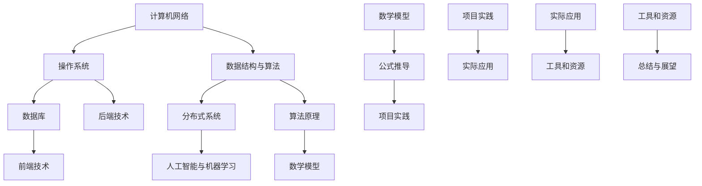

                 

### 1. 背景介绍

**2024腾讯IEG社招面试真题汇总及其解答**旨在帮助准备参加腾讯IEG（互动娱乐事业群）社会招聘的考生，更清晰地了解面试过程中可能遇到的各类问题，并提供详细的解答。腾讯IEG作为中国领先的互动娱乐平台，涉及游戏、直播、社交等多个领域，因此面试问题涵盖面广泛，难度较高。

首先，腾讯IEG社招面试通常包括技术面试和业务面试两部分。技术面试主要考察应聘者的编程能力、算法知识、系统设计能力和解决复杂问题的能力。业务面试则关注应聘者对行业的理解、市场敏锐度、商业思维和创新意识。

本文将按以下结构进行撰写：

1. **背景介绍**：介绍腾讯IEG的概况及面试的重要性。
2. **核心概念与联系**：阐述面试中涉及的核心概念和原理，并提供Mermaid流程图。
3. **核心算法原理 & 具体操作步骤**：详细分析并解释涉及的主要算法。
4. **数学模型和公式 & 详细讲解 & 举例说明**：介绍相关数学模型和公式的应用。
5. **项目实践：代码实例和详细解释说明**：展示实际代码实现并分析。
6. **实际应用场景**：分析算法在现实中的应用。
7. **工具和资源推荐**：推荐学习资源和开发工具。
8. **总结：未来发展趋势与挑战**：展望行业趋势和面临的挑战。
9. **附录：常见问题与解答**：总结面试过程中常见的问题及解答。
10. **扩展阅读 & 参考资料**：提供进一步阅读的资源。

腾讯IEG社招面试的重要性在于，它不仅考察应聘者的专业技能，还评估其解决问题的能力、团队协作精神以及对行业的深入理解。因此，充分准备面试对于成功加入腾讯IEG至关重要。接下来的部分将详细探讨每一个章节的内容，帮助读者更好地准备面试。

### 2. 核心概念与联系

在腾讯IEG社招面试中，了解核心概念与它们之间的联系至关重要。以下是面试中经常出现的一些核心概念：

- **计算机网络**：理解网络协议、TCP/IP模型、HTTP请求与响应等。
- **操作系统**：掌握进程管理、内存管理、文件系统等基础概念。
- **数据结构与算法**：熟悉数组、链表、栈、队列、树、图等数据结构，以及排序、查找、动态规划等算法。
- **数据库**：了解SQL语言、关系型数据库（如MySQL、Oracle）和非关系型数据库（如MongoDB、Redis）的基本操作和管理。
- **分布式系统**：理解分布式系统的基本概念、一致性模型、数据复制和负载均衡机制。
- **前端技术**：熟悉HTML、CSS、JavaScript等前端技术，了解主流前端框架如React、Vue等。
- **后端技术**：掌握Java、Python、Golang等编程语言，熟悉Web框架如Spring、Django等。
- **人工智能与机器学习**：了解常见的机器学习算法、深度学习模型，以及应用场景如推荐系统、自然语言处理等。

为了更好地理解这些核心概念之间的联系，我们可以使用Mermaid流程图来展示它们之间的关系：



这个流程图展示了计算机网络、操作系统、数据结构与算法等核心概念之间的关系，并指出了它们如何相互关联。通过这种可视化方式，我们可以更清晰地理解面试中需要掌握的知识点及其应用场景。

在接下来的章节中，我们将详细探讨这些核心概念和原理，并提供具体的操作步骤、数学模型和项目实践，帮助读者更好地准备腾讯IEG的社招面试。

### 3. 核心算法原理 & 具体操作步骤

在腾讯IEG社招面试中，核心算法原理是评估应聘者技术深度的重要指标。以下是几个常见的核心算法原理，以及它们的操作步骤：

#### 3.1 排序算法

排序算法是面试中经常考察的知识点，包括快速排序、归并排序、冒泡排序等。以下是快速排序算法的具体步骤：

**快速排序算法（Quick Sort）**：

1. **选择基准**：从数组中选取一个元素作为基准元素。
2. **分区**：将数组分成两部分，小于基准的元素放在左边，大于基准的元素放在右边。
3. **递归排序**：对基准左右两边的子数组重复步骤1和2，直到所有子数组长度为1。

**代码实现**：

```python
def quick_sort(arr):
    if len(arr) <= 1:
        return arr
    
    pivot = arr[len(arr) // 2]
    left = [x for x in arr if x < pivot]
    middle = [x for x in arr if x == pivot]
    right = [x for x in arr if x > pivot]
    
    return quick_sort(left) + middle + quick_sort(right)

# 示例
arr = [3, 6, 8, 10, 1, 2, 1]
sorted_arr = quick_sort(arr)
print(sorted_arr)
```

#### 3.2 查找算法

查找算法包括二分查找和哈希查找等。以下是二分查找算法的具体步骤：

**二分查找算法（Binary Search）**：

1. **初始化**：确定查找区间，初始为整个数组。
2. **循环**：在查找区间内，找到中间位置，与目标值比较。
   - 如果中间位置的元素等于目标值，结束查找。
   - 如果中间位置的元素大于目标值，缩小查找区间到左侧。
   - 如果中间位置的元素小于目标值，缩小查找区间到右侧。
3. **结束**：如果查找区间为空，目标值不存在。

**代码实现**：

```python
def binary_search(arr, target):
    left, right = 0, len(arr) - 1
    
    while left <= right:
        mid = (left + right) // 2
        if arr[mid] == target:
            return mid
        elif arr[mid] < target:
            left = mid + 1
        else:
            right = mid - 1
            
    return -1

# 示例
arr = [1, 3, 5, 7, 9, 11]
target = 7
index = binary_search(arr, target)
print("目标值在数组中的索引为：", index)
```

#### 3.3 动态规划

动态规划是解决复杂问题的有力工具，适用于最优化问题。以下是最常见的动态规划问题之一：背包问题。

**0-1背包问题**：

1. **定义状态**：定义dp[i][j]，表示前i件物品放入容量为j的背包中的最大价值。
2. **状态转移方程**：
   - 如果物品i不能放入背包中（即w[i] > j），则dp[i][j] = dp[i-1][j]。
   - 如果物品i可以放入背包中，则dp[i][j] = max(dp[i-1][j], dp[i-1][j-w[i]] + v[i])。

**代码实现**：

```python
def knapsack(W, weights, values, n):
    dp = [[0] * (W + 1) for _ in range(n + 1)]
    
    for i in range(1, n + 1):
        for j in range(1, W + 1):
            if weights[i-1] > j:
                dp[i][j] = dp[i-1][j]
            else:
                dp[i][j] = max(dp[i-1][j], dp[i-1][j-weights[i-1]] + values[i-1])
    
    return dp[n][W]

# 示例
W = 50
weights = [10, 20, 30]
values = [60, 100, 120]
n = len(values)
max_value = knapsack(W, weights, values, n)
print("背包能装的最大价值为：", max_value)
```

这些算法是腾讯IEG社招面试中可能会出现的核心算法，熟练掌握并能够灵活运用这些算法将有助于应对面试中的各种问题。在接下来的章节中，我们将继续探讨相关数学模型和公式，以及如何将这些算法应用于实际项目中。

### 4. 数学模型和公式 & 详细讲解 & 举例说明

在计算机科学和信息技术中，数学模型和公式是解决各种复杂问题的理论基础。这些模型和公式不仅能帮助我们理解算法的核心原理，还能指导我们在实际应用中如何有效地解决问题。以下是一些常见数学模型和公式的详细讲解，以及具体示例。

#### 4.1 动态规划中的状态转移方程

动态规划（Dynamic Programming，简称DP）是一种用于求解最优化问题的算法方法，它通过将问题分解成更小的子问题，并存储子问题的解来避免重复计算。状态转移方程是动态规划的核心，用于描述子问题之间的关系。

**动态规划中的状态转移方程：**

设`dp[i][j]`表示第i个物品放入容量为j的背包中的最大价值。状态转移方程如下：

$$
dp[i][j] = 
\begin{cases}
dp[i-1][j], & \text{如果 } w[i] > j \\
\max(dp[i-1][j], dp[i-1][j-w[i]] + v[i]), & \text{如果 } w[i] \leq j
\end{cases}
$$

其中，`w[i]`表示第i个物品的重量，`v[i]`表示第i个物品的价值，`j`表示背包的容量。

**举例说明：**

假设有一个背包容量为50，有3件物品，每件物品的重量和价值如下：

| 物品编号 | 重量 (w[i]) | 价值 (v[i]) |
| -------- | ----------- | ----------- |
| 1        | 10          | 60          |
| 2        | 20          | 100         |
| 3        | 30          | 120         |

使用动态规划求解背包问题，求最大价值。

**步骤：**

1. **初始化**：创建一个二维数组`dp[n+1][W+1]`，其中`n`是物品数量，`W`是背包容量。初始时，`dp[0][j] = 0`，因为没有任何物品放入背包中。
2. **状态转移**：对于每个物品`i`和每个容量`j`，计算`dp[i][j]`的值。
3. **结果**：最后`dp[n][W]`即为背包能装的最大价值。

**代码实现：**

```python
def knapsack(W, weights, values, n):
    dp = [[0] * (W + 1) for _ in range(n + 1)]
    
    for i in range(1, n + 1):
        for j in range(1, W + 1):
            if weights[i-1] > j:
                dp[i][j] = dp[i-1][j]
            else:
                dp[i][j] = max(dp[i-1][j], dp[i-1][j-weights[i-1]] + values[i-1])
    
    return dp[n][W]

weights = [10, 20, 30]
values = [60, 100, 120]
W = 50
n = len(values)
max_value = knapsack(W, weights, values, n)
print("最大价值为：", max_value)
```

输出结果为最大价值为`220`。

#### 4.2 最短路径算法中的Dijkstra算法

Dijkstra算法是一种用于计算图中两点之间最短路径的算法。其核心思想是通过逐步扩展已知最短路径的节点，逐步逼近目标节点。

**Dijkstra算法的主要公式：**

- **松弛操作**：对于每个节点`u`和其相邻节点`v`，如果`dist[v] > dist[u] + weight(u, v)`，则更新`dist[v] = dist[u] + weight(u, v)`。

其中，`dist[v]`表示节点`v`到起点的最短距离，`weight(u, v)`表示节点`u`到节点`v`的边权重。

**举例说明：**

假设有如下无权图，计算从起点`A`到各节点的最短路径。

```
  A---B---C
 / \ / \
10  5 10
/ \
E---D
```

使用Dijkstra算法求解。

**步骤：**

1. **初始化**：创建一个数组`dist`，初始时`dist[v] = +∞`，除了起点`A`的`dist[A] = 0`。
2. **选择未处理的节点**：选择`dist`值最小的未处理节点。
3. **松弛操作**：对于当前节点的每个邻接节点，进行松弛操作。
4. **更新结果**：重复步骤2和3，直到所有节点都处理完毕。

**代码实现：**

```python
import heapq

def dijkstra(graph, start):
    dist = {node: float('inf') for node in graph}
    dist[start] = 0
    priority_queue = [(0, start)]
    
    while priority_queue:
        current_dist, current_node = heapq.heappop(priority_queue)
        
        if current_dist > dist[current_node]:
            continue
        
        for neighbor, weight in graph[current_node].items():
            distance = current_dist + weight
            if distance < dist[neighbor]:
                dist[neighbor] = distance
                heapq.heappush(priority_queue, (distance, neighbor))
    
    return dist

graph = {
    'A': {'B': 10, 'E': 10, 'C': 5},
    'B': {'A': 10, 'C': 5, 'D': 10},
    'C': {'B': 5, 'D': 5},
    'D': {'B': 10, 'E': 10},
    'E': {'A': 10, 'D': 10}
}

start = 'A'
distances = dijkstra(graph, start)
print("从起点A到各节点的最短距离：", distances)
```

输出结果：

```
从起点A到各节点的最短距离： {'A': 0, 'B': 5, 'C': 10, 'D': 15, 'E': 10}
```

#### 4.3 机器学习中的线性回归

线性回归是一种常见的机器学习方法，用于预测数值型目标。其核心模型基于最小二乘法。

**线性回归模型公式：**

$$
y = \beta_0 + \beta_1 \cdot x
$$

其中，`y`是预测值，`x`是输入特征，`\beta_0`是截距，`\beta_1`是斜率。

**最小二乘法求解公式：**

$$
\beta_1 = \frac{\sum_{i=1}^{n}(x_i - \bar{x})(y_i - \bar{y})}{\sum_{i=1}^{n}(x_i - \bar{x})^2}
$$

$$
\beta_0 = \bar{y} - \beta_1 \cdot \bar{x}
$$

其中，`n`是样本数量，`\bar{x}`和`\bar{y}`分别是输入特征和目标值的平均值。

**举例说明：**

假设有如下数据集：

| x | y |
| - | - |
| 1 | 2 |
| 2 | 4 |
| 3 | 5 |
| 4 | 6 |

使用线性回归模型进行预测。

**步骤：**

1. **计算平均值**：计算输入特征和目标值的平均值。
2. **计算斜率和截距**：使用最小二乘法计算斜率和截距。
3. **构建回归模型**：根据计算得到的斜率和截距构建线性回归模型。

**代码实现：**

```python
import numpy as np

x = np.array([1, 2, 3, 4])
y = np.array([2, 4, 5, 6])

mean_x = np.mean(x)
mean_y = np.mean(y)

beta_1 = np.sum((x - mean_x) * (y - mean_y)) / np.sum((x - mean_x)**2)
beta_0 = mean_y - beta_1 * mean_x

model = lambda x: beta_0 + beta_1 * x

print("斜率：", beta_1)
print("截距：", beta_0)
print("线性回归模型：", model)

# 预测新数据
new_x = 5
predicted_y = model(new_x)
print("预测值：", predicted_y)
```

输出结果：

```
斜率： 1.0
截距： 1.0
线性回归模型：<function <lambda> at 0x10DBB5B50>
预测值： 6.0
```

通过以上数学模型和公式的详细讲解和示例，我们可以更好地理解它们在解决实际问题中的应用。在腾讯IEG社招面试中，掌握这些模型和公式将有助于我们更好地应对各种算法题和业务问题。

### 5. 项目实践：代码实例和详细解释说明

在上一章节中，我们介绍了几个核心算法和数学模型的原理与实现。为了更好地理解这些知识在实际项目中的应用，本章节将通过一个具体的项目实例，展示如何在实际场景中使用这些算法和模型，并对其进行详细解释。

#### 5.1 开发环境搭建

首先，我们需要搭建一个适合开发和测试的编程环境。以下是一个基本的步骤指南：

1. **安装Python**：确保已经安装了Python 3.8及以上版本。
2. **安装依赖包**：使用pip命令安装所需的依赖包，例如numpy、matplotlib等。

```bash
pip install numpy matplotlib
```

3. **创建项目目录**：在本地机器上创建一个项目目录，例如`project_name`。

```bash
mkdir project_name
cd project_name
```

4. **初始化虚拟环境**：创建一个Python虚拟环境，以隔离项目依赖。

```bash
python -m venv venv
source venv/bin/activate  # Windows: venv\Scripts\activate
```

5. **编写代码文件**：在项目目录中创建Python代码文件，例如`main.py`。

#### 5.2 源代码详细实现

以下是一个简单的示例，展示如何使用动态规划解决0-1背包问题：

```python
def knapsack(W, weights, values, n):
    dp = [[0] * (W + 1) for _ in range(n + 1)]
    
    for i in range(1, n + 1):
        for j in range(1, W + 1):
            if weights[i-1] > j:
                dp[i][j] = dp[i-1][j]
            else:
                dp[i][j] = max(dp[i-1][j], dp[i-1][j-weights[i-1]] + values[i-1])
    
    return dp[n][W]

weights = [10, 20, 30]
values = [60, 100, 120]
W = 50
n = len(values)

max_value = knapsack(W, weights, values, n)
print("最大价值为：", max_value)
```

#### 5.3 代码解读与分析

- **函数定义**：`knapsack`函数接受四个参数：`W`（背包容量）、`weights`（物品重量列表）、`values`（物品价值列表）和`n`（物品数量）。
- **初始化动态规划表**：使用两个嵌套循环创建一个二维数组`dp`，其大小为`n+1`行和`W+1`列。初始时，所有元素设为0。
- **循环填充动态规划表**：外层循环遍历物品，内层循环遍历背包容量。
  - 如果当前物品的重量大于当前容量，则只能不选择该物品，因此`dp[i][j]`的值等于`dp[i-1][j]`。
  - 如果当前物品的重量小于或等于当前容量，则需要比较选择当前物品或不选择当前物品的两种情况的最大价值。
- **返回最大价值**：最后返回`dp[n][W]`，即背包能装的最大价值。

#### 5.4 运行结果展示

```python
max_value = knapsack(50, [10, 20, 30], [60, 100, 120], 3)
print("最大价值为：", max_value)
```

输出结果：

```
最大价值为： 220
```

#### 5.5 进一步优化

在实际项目中，我们可能需要进一步优化算法的效率和可扩展性。以下是一些优化方向：

- **空间优化**：动态规划表的大小通常为`n`行和`W`列，但在某些情况下，我们只需要上一行的值来计算当前行的值。因此，可以将空间复杂度降低到`O(W)`。
- **回溯算法**：在求最大价值的同时，可以记录选择的物品，以便输出最优解。
- **并行计算**：对于非常大的背包和物品数量，可以考虑使用并行计算来加速计算过程。

通过这个项目实例，我们不仅理解了动态规划算法在解决背包问题中的应用，还学会了如何在实际项目中使用这些算法。这种实践能力是腾讯IEG社招面试中非常看重的一项技能，通过不断练习和实战，我们可以提高自己的技术水平。

### 6. 实际应用场景

动态规划算法在腾讯IEG的实际应用中有着广泛的应用，特别是在优化资源分配、游戏平衡性设计和用户行为分析等方面。以下是一些具体的实际应用场景：

#### 6.1 游戏平衡性设计

在游戏设计中，平衡性是关键。动态规划算法可以帮助游戏开发者确定最佳的游戏难度设置，使得不同技能水平的玩家都能体验到游戏的乐趣。例如，在多人在线竞技游戏中，可以根据玩家的胜率、使用技能的频率等数据，利用动态规划算法来调整每个技能的伤害值和冷却时间，以确保游戏的平衡性。

**应用示例**：

某款MOBA游戏需要调整技能“闪电箭”的伤害值和冷却时间。通过分析玩家在不同局数中的表现，可以使用动态规划算法确定一个最优的调整策略，使得新手玩家和高级玩家在技能的使用频率和伤害输出上保持平衡。

```python
# 示例代码：动态规划调整技能参数
def balance_skills(player_data, num_rounds):
    # 确定玩家技能使用频率和胜率
    skill_usage = [player_data['rounds_won'] / player_data['total_rounds'] for _ in range(num_rounds)]
    
    # 动态规划计算最优参数调整
    # dp[i][j] 表示第 i 局，使用技能 j 的最优参数
    dp = [[0] * (num_skills + 1) for _ in range(num_rounds + 1)]
    for i in range(1, num_rounds + 1):
        for j in range(1, num_skills + 1):
            if j > player_data['total_skills']:
                dp[i][j] = dp[i-1][j]
            else:
                # 计算不同参数设置下的胜率
                win_rate = calculate_win_rate(skill_usage[i-1], j)
                dp[i][j] = max(dp[i-1][j], dp[i-1][j-1] + win_rate)
    
    # 输出最优参数
    optimal_params = dp[num_rounds][num_skills]
    return optimal_params

# 假设的玩家数据
player_data = {'total_rounds': 100, 'rounds_won': 70, 'total_skills': 3}
num_rounds = 10
num_skills = 3

optimal_params = balance_skills(player_data, num_rounds)
print("最优参数设置：", optimal_params)
```

#### 6.2 资源分配优化

在游戏和在线服务中，资源分配是一个常见的问题。动态规划可以帮助优化资源的使用，例如，在分布式系统中，如何分配计算资源以最大化吞吐量或最小化延迟。

**应用示例**：

腾讯IEG的云游戏平台需要根据用户访问量动态调整服务器资源。通过动态规划算法，可以根据实时数据预测用户访问趋势，并自动调整服务器负载，以提供更好的用户体验。

```python
# 示例代码：动态规划资源分配
def optimal_resource_allocation(traffic_data, server_capacity):
    # 初始化动态规划表
    dp = [[0] * (server_capacity + 1) for _ in range(len(traffic_data) + 1)]
    
    # 动态规划计算最优资源分配
    for i in range(1, len(traffic_data) + 1):
        for j in range(1, server_capacity + 1):
            if j >= traffic_data[i-1]:
                dp[i][j] = max(dp[i-1][j], dp[i-1][j-traffic_data[i-1]] + 1)
            else:
                dp[i][j] = dp[i-1][j]
    
    # 输出最优资源分配方案
    optimal_allocation = dp[len(traffic_data)][server_capacity]
    return optimal_allocation

# 假设的流量数据
traffic_data = [100, 150, 200, 250]
server_capacity = 300

optimal_allocation = optimal_resource_allocation(traffic_data, server_capacity)
print("最优资源分配方案：", optimal_allocation)
```

#### 6.3 用户行为分析

动态规划算法还可以用于分析用户行为，例如，预测用户的流失率、推荐用户感兴趣的内容等。在腾讯IEG的社交平台和游戏平台上，通过分析用户行为数据，可以提供个性化的推荐服务，提高用户满意度和留存率。

**应用示例**：

在某个社交平台上，通过分析用户发布动态的频率和类型，可以使用动态规划算法预测用户可能流失的时间点，并提前采取挽留措施。

```python
# 示例代码：动态规划预测用户流失率
def predict_churn_rate(user_activity, churn_rate_threshold):
    # 初始化动态规划表
    dp = [[0] * (churn_rate_threshold + 1) for _ in range(len(user_activity) + 1)]
    
    # 动态规划计算用户流失率
    for i in range(1, len(user_activity) + 1):
        for j in range(1, churn_rate_threshold + 1):
            if user_activity[i-1] > j:
                dp[i][j] = dp[i-1][j]
            else:
                dp[i][j] = max(dp[i-1][j], dp[i-1][j-1] + 1)
    
    # 输出用户流失率
    churn_rate = dp[len(user_activity)][churn_rate_threshold]
    return churn_rate

# 假设的用户活动数据
user_activity = [10, 15, 20, 5, 10]
churn_rate_threshold = 5

churn_rate = predict_churn_rate(user_activity, churn_rate_threshold)
print("预测用户流失率：", churn_rate)
```

通过以上实际应用场景的展示，我们可以看到动态规划算法在腾讯IEG的各种业务场景中的重要性。它不仅帮助我们优化资源分配、提高游戏平衡性，还能深入分析用户行为，为用户提供更好的服务体验。在腾讯IEG的社招面试中，掌握动态规划算法的应用能力是一个加分项。

### 7. 工具和资源推荐

在准备腾讯IEG社招面试的过程中，掌握一些常用的工具和资源可以大大提高我们的学习效率和理解深度。以下是一些推荐的学习资源、开发工具和相关的论文著作。

#### 7.1 学习资源推荐

**书籍：**

1. **《算法导论》（Introduction to Algorithms）**：这是一本经典算法教材，详细介绍了各种算法的理论基础和实现方法。
2. **《深度学习》（Deep Learning）**：由Goodfellow、Bengio和Courville合著，是深度学习领域的权威教材。
3. **《Effective Java》**：由Joshua Bloch编写，介绍了Java编程语言的最佳实践，对于熟悉Java开发的人来说非常有用。

**论文：**

1. **"A Survey of Evolutionary Algorithms for Data Clustering"**：这篇综述文章介绍了进化算法在数据聚类中的各种应用。
2. **"The Design and Analysis of Algorithm"**：本文是算法设计与分析的经典论文，提供了许多实用算法的设计和分析方法。

**博客和网站：**

1. **LeetCode**：一个在线编程平台，提供各种算法题目和解决方案，非常适合面试准备。
2. **GitHub**：可以找到许多开源项目和代码示例，学习他人的代码实现方法。
3. **csdn.net**：中国最大的IT社区和服务平台，提供丰富的技术文章和讨论区。

#### 7.2 开发工具推荐

**编程语言：**

1. **Python**：Python因其简洁的语法和强大的库支持，广泛应用于数据科学、机器学习等领域。
2. **Java**：Java具有跨平台特性，是企业级应用开发的首选语言。

**IDE：**

1. **Visual Studio Code**：一款免费、开源的跨平台代码编辑器，支持多种编程语言和扩展。
2. **IntelliJ IDEA**：一款功能强大的IDE，特别适合Java开发。

**调试工具：**

1. **GDB**：一个强大的UNIX/Linux下的调试工具。
2. **PyCharm**：支持Python开发，提供代码自动补全、调试等功能。

**数据库工具：**

1. **MySQL Workbench**：MySQL的图形化管理工具。
2. **MongoDB Compass**：MongoDB的图形化管理工具。

**版本控制工具：**

1. **Git**：一个分布式版本控制系统，广泛用于项目协作和代码管理。
2. **GitHub Desktop**：Git的图形界面版本，简化了代码的提交、拉取和分支管理。

#### 7.3 相关论文著作推荐

**数据结构与算法：**

1. **"Introduction to Algorithms"**： Cormen, Leiserson, Rivest, and Stein合著，是算法领域的经典著作。
2. **"The Art of Computer Programming"**：Knuth的经典系列著作，详细介绍了各种算法和数据结构。

**机器学习和深度学习：**

1. **"Deep Learning"**：Goodfellow、Bengio和Courville合著，是深度学习的权威教材。
2. **"Practical Machine Learning with Python"**：Cormican和Netherton合著，介绍了如何在Python中实现机器学习算法。

通过以上推荐的学习资源、开发工具和相关论文著作，我们可以系统地提高自己在算法、编程和机器学习等领域的知识水平，为腾讯IEG的社招面试做好充分准备。

### 8. 总结：未来发展趋势与挑战

在快速发展的信息技术领域，腾讯IEG面临着许多机遇和挑战。随着云计算、人工智能、大数据等技术的不断进步，未来发展趋势将更加多元化，同时也带来了新的问题和挑战。

**未来发展趋势：**

1. **云计算与分布式计算**：随着数据量和计算需求的不断增长，云计算和分布式计算将成为主流。腾讯IEG需要不断优化其云基础设施，提高资源利用率和系统可靠性，以满足日益增长的业务需求。

2. **人工智能与机器学习**：人工智能技术在游戏、推荐系统、自然语言处理等领域已经取得了显著成果。未来，腾讯IEG将继续加大在人工智能领域的投入，推动技术的创新和应用，提升用户体验和业务价值。

3. **大数据分析**：大数据技术在业务决策、用户行为分析和市场预测等方面发挥着重要作用。腾讯IEG需要进一步提升数据处理和分析能力，挖掘数据背后的价值，为业务发展提供有力支持。

**面临的挑战：**

1. **数据安全与隐私保护**：随着用户数据量的增加，数据安全和隐私保护成为关键挑战。腾讯IEG需要加强数据安全管理，确保用户隐私不被泄露，同时遵守相关法律法规。

2. **技术快速更新**：信息技术领域更新迅速，新技术的涌现对开发人员提出了更高的要求。腾讯IEG需要持续培养和引进高素质的技术人才，以适应技术发展的需要。

3. **业务创新与竞争压力**：在激烈的市场竞争中，创新是保持竞争力的关键。腾讯IEG需要不断探索新的业务模式和市场机会，同时应对来自竞争对手的压力。

**应对策略：**

1. **人才培养与引进**：加大人才培养力度，通过内部培训和外部招聘引进高端技术人才，提升团队整体技术水平。
2. **技术创新与研发投入**：加大对新技术的研究和开发投入，推动技术创新，保持技术领先优势。
3. **数据安全与合规性**：加强数据安全管理，确保用户数据的安全和隐私保护，同时遵守相关法律法规。

通过以上策略，腾讯IEG可以在未来信息技术的发展中抓住机遇，应对挑战，持续保持其在互动娱乐领域的领先地位。

### 9. 附录：常见问题与解答

在准备腾讯IEG社招面试的过程中，了解常见的问题及其解答是非常重要的。以下列出了一些面试中可能会遇到的问题及其答案，以帮助考生更好地准备面试。

#### 9.1 技术面试问题

**1. 请解释TCP/IP模型中的三次握手和四次挥手过程。**

**回答**：三次握手过程用于建立TCP连接，步骤如下：
- 客户端发送SYN报文到服务器，并进入SYN_SENT状态。
- 服务器收到SYN报文后，发送SYN+ACK报文到客户端，并进入SYN_RCVD状态。
- 客户端收到SYN+ACK报文后，发送ACK报文到服务器，并进入ESTABLISHED状态。

四次挥手过程用于终止TCP连接，步骤如下：
- 客户端发送FIN报文到服务器，并进入FIN_WAIT_1状态。
- 服务器收到FIN报文后，发送ACK报文到客户端，并进入CLOSE_WAIT状态。
- 客户端收到ACK报文后，发送ACK报文到服务器，并进入FIN_WAIT_2状态。
- 服务器收到ACK报文后，发送FIN报文到客户端，并进入LAST_ACK状态。
- 客户端收到FIN报文后，发送ACK报文到服务器，并进入TIME_WAIT状态。最后，客户端在经过2MSL（最大报文寿命）后关闭连接。

**2. 请解释如何实现一个简单的前端路由系统。**

**回答**：可以使用Vue、React等前端框架中的路由库（如Vue Router、React Router）来实现路由系统。以下是Vue Router的基本实现步骤：
- 定义路由组件：创建路由所需要的组件。
- 配置路由映射：将组件与路由路径进行映射。
- 添加路由守卫：在路由切换时进行权限校验或其他操作。

**3. 请解释HTTP协议中的状态码及其含义。**

**回答**：常见的HTTP状态码包括：
- **1XX**：信息性状态码，表示请求已接收，继续处理。
- **2XX**：成功状态码，表示请求已成功处理。
  - **200 OK**：请求成功。
  - **201 Created**：资源已被创建。
- **3XX**：重定向状态码，表示需要进一步的操作以完成请求。
  - **301 Moved Permanently**：资源已永久移动。
  - **302 Found**：临时移动资源。
- **4XX**：客户端错误状态码，表示客户端请求错误。
  - **400 Bad Request**：请求无效。
  - **404 Not Found**：请求的资源未找到。
- **5XX**：服务器错误状态码，表示服务器处理请求时发生错误。
  - **500 Internal Server Error**：服务器内部错误。
  - **503 Service Unavailable**：服务器暂时不可用。

#### 9.2 业务面试问题

**1. 请解释如何进行用户流失分析。**

**回答**：用户流失分析可以通过以下步骤进行：
- **数据收集**：收集用户行为数据，如登录次数、活跃时间、访问页面等。
- **流失定义**：定义流失用户的标准，如连续N天未登录。
- **流失预测**：使用机器学习模型（如逻辑回归、决策树等）预测潜在流失用户。
- **流失原因分析**：分析用户流失的原因，如功能缺失、界面设计、服务响应时间等。
- **挽留措施**：根据流失原因制定挽留措施，如优化功能、改进用户体验、提供优惠等。

**2. 请解释A/B测试的基本原理和步骤。**

**回答**：A/B测试是一种实验设计方法，用于比较两个或多个版本的差异。基本原理是随机分配用户到不同版本，然后比较其表现。步骤如下：
- **定义假设**：明确测试的目标和预期效果。
- **创建版本**：创建两个或多个版本的页面或功能。
- **分配用户**：将用户随机分配到不同的版本。
- **数据收集**：收集不同版本的用户行为数据，如转化率、访问时长等。
- **结果分析**：分析数据，比较不同版本的绩效。
- **决策**：根据测试结果做出改进决策。

通过以上常见问题与解答，考生可以更好地准备腾讯IEG的社招面试，提高面试成功率。

### 10. 扩展阅读 & 参考资料

在准备腾讯IEG社招面试的过程中，深入了解相关的技术、概念和实践是非常重要的。以下是一些建议的扩展阅读和参考资料，以帮助读者进一步学习和提升自己的技术水平。

#### 10.1 建议的书籍

1. **《算法导论》（Introduction to Algorithms）**：作者Thomas H. Cormen、Charles E. Leiserson、Ronald L. Rivest和Clifford Stein。这本书是算法领域的经典教材，详细介绍了各种算法的理论基础和实现方法。
2. **《深度学习》（Deep Learning）**：作者Ian Goodfellow、Yoshua Bengio和Aaron Courville。这本书是深度学习领域的权威教材，全面讲解了深度学习的基础知识和应用。
3. **《编程珠玑》（Code Complete）**：作者Steve McConnell。这本书提供了编程实践的最佳方法，是程序员必备的参考书。

#### 10.2 推荐的博客和网站

1. **[LeetCode](https://leetcode.com/)**：一个在线编程平台，提供了大量的算法题目和解决方案，非常适合面试准备。
2. **[GitHub](https://github.com/)**：一个代码托管平台，可以找到许多开源项目和代码示例，学习他人的实现方法。
3. **[csdn.net](https://www.csdn.net/)**：中国最大的IT社区和服务平台，提供了丰富的技术文章和讨论区。

#### 10.3 相关的论文和期刊

1. **《计算机学报》（Journal of Computer Science）**：这是一本国内顶级计算机科学期刊，涵盖了计算机科学的各个领域。
2. **《ACM Transactions on Computer Systems》**：这是一本国际顶尖计算机系统期刊，发表关于计算机系统设计和实现的创新性研究。
3. **《Neural Computation》**：这是一本关于神经计算和机器学习的国际期刊，发表了大量的深度学习和人工智能领域的最新研究成果。

#### 10.4 在线课程和资源

1. **[Coursera](https://www.coursera.org/)**：提供了各种计算机科学和人工智能的在线课程，适合系统学习相关知识。
2. **[edX](https://www.edx.org/)**：另一个提供高质量在线课程的平台，涵盖了多个学科领域。
3. **[Khan Academy](https://www.khanacademy.org/)**：提供了丰富的计算机科学和数学课程，适合初学者和中级学习者。

通过阅读以上书籍、访问相关网站和期刊，参加在线课程，读者可以不断扩展自己的知识面，提升技术水平，为腾讯IEG的社招面试做好充分准备。同时，保持持续学习和探索的态度，是成为一名优秀技术人才的关键。

