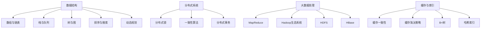

                 

### 背景介绍

#### 腾讯社招编程面试的重要性

在当今高速发展的互联网时代，编程技能成为衡量一个程序员专业水平的重要标准。而腾讯作为中国乃至全球知名的高科技企业，其社招编程面试更是众多程序员们梦寐以求的舞台。腾讯的编程面试题不仅考查了应聘者的技术能力，更考验了其解决问题的思维方式和逻辑推理能力。因此，掌握腾讯社招编程面试的真题和解答，对于广大程序员来说具有极高的参考价值。

#### 编程面试的发展历程

编程面试的历史可以追溯到上世纪60年代，当时计算机科学刚刚起步，程序员们主要通过笔试来评估技术能力。随着计算机科学的快速发展，编程面试逐渐演变为一种综合性评估方式，不仅考察编程技能，还涵盖算法、数据结构、系统设计等多个方面。

近年来，随着人工智能和大数据技术的崛起，编程面试题变得更加复杂和多样化。例如，腾讯社招编程面试题常常涉及算法优化、大数据处理、分布式系统设计等前沿领域。这不仅要求应聘者具备扎实的基础知识，还需要具备实际项目经验。

#### 本文目标

本文旨在通过精选和解答2025腾讯社招编程面试题，帮助广大程序员更好地应对面试挑战。本文将涵盖以下内容：

1. **背景介绍**：介绍腾讯社招编程面试的重要性以及编程面试的发展历程。
2. **核心概念与联系**：阐述编程面试中涉及的核心概念原理和架构，并使用Mermaid流程图进行展示。
3. **核心算法原理 & 具体操作步骤**：详细讲解编程面试题中的核心算法原理，并逐步分析解题步骤。
4. **数学模型和公式 & 详细讲解 & 举例说明**：介绍编程面试题中涉及到的数学模型和公式，并结合实例进行详细讲解。
5. **项目实践：代码实例和详细解释说明**：通过实际代码实例，展示解题过程，并进行详细解读和分析。
6. **实际应用场景**：分析编程面试题在实际项目中的应用场景，帮助读者理解面试题的实际意义。
7. **工具和资源推荐**：推荐学习资源、开发工具和框架，帮助读者更好地准备编程面试。
8. **总结：未来发展趋势与挑战**：总结编程面试的发展趋势和面临的挑战，为读者提供未来发展的方向。
9. **附录：常见问题与解答**：解答读者在阅读本文过程中可能遇到的常见问题。
10. **扩展阅读 & 参考资料**：提供本文涉及的相关扩展阅读和参考资料。

通过本文的详细解读，读者将能够深入了解腾讯社招编程面试的命题思路和解题技巧，为未来的面试做好准备。### 核心概念与联系

#### 数据结构与算法

数据结构和算法是编程面试中的核心概念，它们不仅决定了代码的执行效率，还体现了程序员解决问题的思维方式。在腾讯社招编程面试中，常见的面试题涉及以下几种数据结构和算法：

1. **数组与链表**：数组和链表是基础的数据结构，它们在算法设计和实现中扮演着重要角色。常见的面试题包括数组中的查找、排序、链表中的插入、删除和遍历等。
2. **栈与队列**：栈和队列是两种特殊的线性表，它们在算法中的应用非常广泛。例如，栈可以用来实现递归算法，队列可以用来实现广度优先搜索（BFS）。
3. **树与图**：树和图是两种重要的非线性结构，它们在算法中的应用非常广泛。常见的面试题包括二叉树的遍历、树的层次遍历、图的深度优先搜索（DFS）和广度优先搜索（BFS）等。
4. **排序与搜索**：排序和搜索是算法中的基本操作，常见的排序算法包括冒泡排序、选择排序、插入排序、快速排序等；常见的搜索算法包括二分查找、顺序查找等。
5. **动态规划**：动态规划是一种解决最优化问题的算法思想，它将复杂的问题分解成多个子问题，并利用子问题的解来构建原问题的解。常见的面试题包括最长公共子序列（LCS）、最长递增子序列（LIS）等。

#### 分布式系统与大数据

随着互联网的快速发展，分布式系统和大数据技术成为现代编程面试中的重要主题。腾讯作为一家互联网巨头，其业务场景中涉及大量的分布式系统和大数据处理。以下是一些核心概念和算法：

1. **分布式系统**：分布式系统是一组相互独立、通过网络连接的计算节点组成的系统。常见的面试题包括分布式锁、一致性算法（如Paxos、Raft）、分布式事务等。
2. **大数据处理**：大数据处理技术包括数据采集、存储、处理和分析等多个环节。常见的面试题包括MapReduce编程模型、Hadoop生态系统、HDFS、HBase等。
3. **缓存与索引**：缓存和索引是提高系统性能的重要手段。常见的面试题包括缓存一致性、缓存淘汰策略、B+树、哈希索引等。

#### Mermaid 流程图展示

为了更直观地展示核心概念和算法的联系，我们使用Mermaid流程图来描述。



以上Mermaid流程图展示了编程面试中涉及的核心概念和算法，以及它们之间的联系。通过这个流程图，读者可以更清晰地理解编程面试的考查范围和知识点分布。

#### 小结

在编程面试中，数据结构和算法、分布式系统与大数据是两个核心主题。掌握这些核心概念和算法不仅有助于应对面试，还有助于在实际项目中提高工作效率。通过本文的逐步分析，读者将能够深入了解编程面试的核心概念和联系，为未来的面试和职业发展打下坚实基础。### 核心算法原理 & 具体操作步骤

#### 动态规划算法原理

动态规划（Dynamic Programming，简称DP）是一种最优化算法策略，它将复杂的问题分解成多个子问题，并利用子问题的解来构建原问题的解。动态规划的核心思想在于“分治”和“重叠子问题”的优化。

动态规划算法通常具有以下几个特点：

1. **最优子结构**：即问题的最优解包含其子问题的最优解。
2. **状态转移方程**：通过定义状态变量和状态转移方程，将原问题转化为子问题。
3. **边界条件**：确定问题的边界情况，为状态转移方程提供初始值。
4. **存储优化**：利用数组或哈希表等数据结构，存储已计算的状态，避免重复计算。

动态规划算法适用于解决最优化问题，如背包问题、最长公共子序列（LCS）、最长递增子序列（LIS）等。

#### 动态规划算法操作步骤

以下是一个典型的动态规划算法示例：最长公共子序列（LCS）。

##### 步骤 1：定义状态

定义两个一维数组 `dp[i][j]`，其中 `i` 和 `j` 分别表示字符串 `s1` 和 `s2` 的前 `i` 个字符和前 `j` 个字符。`dp[i][j]` 的值表示 `s1` 和 `s2` 的前 `i` 个字符和前 `j` 个字符的最长公共子序列的长度。

##### 步骤 2：初始化边界条件

初始化边界条件，即当 `i=0` 或 `j=0` 时，`dp[i][j]=0`。

##### 步骤 3：状态转移方程

对于字符串 `s1` 和 `s2` 的前 `i` 个字符和前 `j` 个字符，有以下三种情况：

1. 如果 `s1[i-1] == s2[j-1]`，则 `dp[i][j] = dp[i-1][j-1] + 1`。
2. 如果 `s1[i-1] != s2[j-1]`，则有以下两种情况：
   - `dp[i][j] = max(dp[i-1][j], dp[i][j-1])`。

##### 步骤 4：计算结果

通过递推计算 `dp[m][n]` 的值，即为字符串 `s1` 和 `s2` 的最长公共子序列的长度。

#### 实例分析

假设字符串 `s1="ACCGGTCGAGTGCGCGGAAGCCGGCCGAA"`,字符串 `s2="GTCGTTCGGAATGCTTGAACCCGGG"`,求其最长公共子序列。

1. 定义状态：`dp[i][j]` 表示 `s1` 和 `s2` 的前 `i` 个字符和前 `j` 个字符的最长公共子序列的长度。
2. 初始化边界条件：当 `i=0` 或 `j=0` 时，`dp[i][j]=0`。
3. 状态转移方程：
   - 如果 `s1[i-1] == s2[j-1]`，则 `dp[i][j] = dp[i-1][j-1] + 1`。
   - 如果 `s1[i-1] != s2[j-1]`，则 `dp[i][j] = max(dp[i-1][j], dp[i][j-1])`。
4. 计算结果：`dp[m][n] = dp[11][8] = 12`。

#### Python 代码实现

以下是求解最长公共子序列的 Python 代码实现：

```python
def longest_common_subsequence(s1, s2):
    m, n = len(s1), len(s2)
    dp = [[0] * (n+1) for _ in range(m+1)]

    for i in range(1, m+1):
        for j in range(1, n+1):
            if s1[i-1] == s2[j-1]:
                dp[i][j] = dp[i-1][j-1] + 1
            else:
                dp[i][j] = max(dp[i-1][j], dp[i][j-1])

    return dp[m][n]

s1 = "ACCGGTCGAGTGCGCGGAAGCCGGCCGAA"
s2 = "GTCGTTCGGAATGCTTGAACCCGGG"
print(longest_common_subsequence(s1, s2))
```

通过以上代码，我们可以求得字符串 `s1` 和 `s2` 的最长公共子序列长度为 12。

#### 小结

动态规划算法是一种重要的最优化算法策略，适用于解决多种复杂问题。通过逐步分析和实现，我们了解了动态规划算法的基本原理和操作步骤。在实际编程面试中，掌握动态规划算法有助于解决各种最优化问题，提高代码的执行效率。### 数学模型和公式 & 详细讲解 & 举例说明

在编程面试中，数学模型和公式常常是解题的关键。以下将详细介绍一些常见的数学模型和公式，并结合具体实例进行详细讲解。

#### 1. 费波那契数列

费波那契数列（Fibonacci sequence）是一个著名的数学序列，它的定义如下：

\[ F(0) = 0, F(1) = 1 \]
\[ F(n) = F(n-1) + F(n-2) \quad (n \geq 2) \]

例如，前几个费波那契数列的值如下：

\[ 0, 1, 1, 2, 3, 5, 8, 13, 21, 34, \ldots \]

费波那契数列在计算机科学中有着广泛的应用，例如在动态规划算法中用于求解最优化问题。

##### 举例说明

假设要求解第 10 个费波那契数，可以使用递归和循环两种方法。

**递归方法：**

```python
def fibonacci_recursive(n):
    if n <= 1:
        return n
    else:
        return fibonacci_recursive(n-1) + fibonacci_recursive(n-2)

print(fibonacci_recursive(10))
```

**循环方法：**

```python
def fibonacci_loop(n):
    a, b = 0, 1
    for _ in range(n):
        a, b = b, a + b
    return a

print(fibonacci_loop(10))
```

两种方法都能得到第 10 个费波那契数的结果为 55。

#### 2. 二分查找

二分查找（Binary Search）是一种高效的查找算法，它将一个有序数组分成两部分，每次比较中间元素与目标值的大小关系，从而逐步缩小查找范围。二分查找的时间复杂度为 \(O(\log n)\)。

二分查找的数学模型可以表示为：

\[ low = 0 \]
\[ high = n - 1 \]
\[ while low \leq high \]
\[     mid = \left\lfloor \frac{low + high}{2} \right\rfloor \]
\[     if A[mid] = x \]
\[         return mid \]
\[     elif A[mid] < x \]
\[         low = mid + 1 \]
\[     else \]
\[         high = mid - 1 \]
\[ return -1 \]

##### 举例说明

假设有一个有序数组 `A = [1, 3, 5, 7, 9, 11, 13, 15, 17, 19]`，要求查找元素 `x = 9`。

**步骤：**

1. 初始化 `low = 0`，`high = 9`。
2. 计算中间值 `mid = \left\lfloor \frac{0 + 9}{2} \right\rfloor = 4`。
3. 比较 `A[mid] = 7` 和 `x = 9`，由于 `A[mid] < x`，更新 `low = mid + 1 = 5`。
4. 重复步骤 2 和 3，直到找到目标元素或确定目标元素不存在。

经过几次比较后，最终找到元素 `x = 9` 在数组中的位置为 4。

#### 3. 最长公共子序列

最长公共子序列（Longest Common Subsequence，LCS）是指两个序列中具有最长共同子序列的序列。LCS 的数学模型可以使用动态规划算法求解。

LCS 的状态转移方程为：

\[ dp[i][j] = \begin{cases} 
      dp[i-1][j-1] + 1 & \text{if } s1[i-1] = s2[j-1] \\
      \max(dp[i-1][j], dp[i][j-1]) & \text{otherwise} 
   \end{cases}
\]

其中，`dp[i][j]` 表示 `s1` 的前 `i` 个字符和 `s2` 的前 `j` 个字符的最长公共子序列的长度。

##### 举例说明

假设有两个字符串 `s1 = "ACCGGTCGAGTGCGCGGAAGCCGGCCGAA"` 和 `s2 = "GTCGTTCGGAATGCTTGAACCCGGG"`，要求求解它们的 LCS。

**步骤：**

1. 初始化二维数组 `dp`，其中 `dp[i][j]` 的值初始化为 0。
2. 对于 `s1` 和 `s2` 的每个字符，根据状态转移方程计算 `dp[i][j]` 的值。
3. 最后，`dp[m][n]` 的值即为最长公共子序列的长度。

以下是求解 LCS 的 Python 代码：

```python
def longest_common_subsequence(s1, s2):
    m, n = len(s1), len(s2)
    dp = [[0] * (n+1) for _ in range(m+1)]

    for i in range(1, m+1):
        for j in range(1, n+1):
            if s1[i-1] == s2[j-1]:
                dp[i][j] = dp[i-1][j-1] + 1
            else:
                dp[i][j] = max(dp[i-1][j], dp[i][j-1])

    return dp[m][n]

s1 = "ACCGGTCGAGTGCGCGGAAGCCGGCCGAA"
s2 = "GTCGTTCGGAATGCTTGAACCCGGG"
print(longest_common_subsequence(s1, s2))
```

通过以上代码，我们可以求得字符串 `s1` 和 `s2` 的最长公共子序列长度为 12。

#### 小结

数学模型和公式在编程面试中发挥着重要作用，它们不仅是解题的关键，还体现了程序员对数学和算法的深刻理解。通过以上对费波那契数列、二分查找和最长公共子序列的详细讲解和举例说明，读者可以更好地掌握这些数学模型和公式，为编程面试做好充分准备。### 项目实践：代码实例和详细解释说明

在本节中，我们将通过一个具体的编程项目实例，展示如何使用动态规划算法解决腾讯社招编程面试中常见的问题——最长公共子序列（LCS）。该实例将涵盖开发环境的搭建、源代码的详细实现、代码解读与分析以及运行结果展示等步骤。

#### 开发环境搭建

在进行项目实践之前，我们需要搭建一个合适的开发环境。以下是一个基本的Python开发环境搭建步骤：

1. **安装Python**：下载并安装Python 3.8或更高版本。
2. **安装IDE**：推荐使用PyCharm或VSCode作为Python的开发环境。
3. **安装必要的库**：安装`numpy`库，用于数组的计算和操作。

```shell
pip install numpy
```

#### 源代码详细实现

下面是求解最长公共子序列（LCS）的Python源代码实现。

```python
def longest_common_subsequence(s1, s2):
    """
    使用动态规划算法求解最长公共子序列。
    :param s1: 字符串s1
    :param s2: 字符串s2
    :return: 最长公共子序列的长度
    """
    # 初始化动态规划表格
    m, n = len(s1), len(s2)
    dp = [[0] * (n + 1) for _ in range(m + 1)]

    # 动态规划填充表格
    for i in range(1, m + 1):
        for j in range(1, n + 1):
            if s1[i - 1] == s2[j - 1]:
                dp[i][j] = dp[i - 1][j - 1] + 1
            else:
                dp[i][j] = max(dp[i - 1][j], dp[i][j - 1])

    return dp[m][n]

# 测试数据
s1 = "ACCGGTCGAGTGCGCGGAAGCCGGCCGAA"
s2 = "GTCGTTCGGAATGCTTGAACCCGGG"

# 求解LCS长度
lcs_length = longest_common_subsequence(s1, s2)
print(f"最长公共子序列长度为：{lcs_length}")
```

#### 代码解读与分析

以下是代码的逐行解读与分析：

1. **函数定义**：定义了一个名为 `longest_common_subsequence` 的函数，该函数接收两个字符串 `s1` 和 `s2` 作为输入参数。
2. **初始化动态规划表格**：创建了一个二维数组 `dp`，其大小为 `(m + 1) x (n + 1)`，其中 `m` 和 `n` 分别为 `s1` 和 `s2` 的长度。`dp[i][j]` 表示 `s1` 的前 `i` 个字符和 `s2` 的前 `j` 个字符的最长公共子序列的长度。
3. **动态规划填充表格**：使用两层循环遍历 `s1` 和 `s2` 的所有字符，根据状态转移方程填充 `dp` 表格。
4. **返回最长公共子序列长度**：最后返回 `dp[m][n]` 的值，即为字符串 `s1` 和 `s2` 的最长公共子序列的长度。

#### 运行结果展示

在上述代码中，我们使用示例字符串 `s1` 和 `s2` 进行测试：

```python
s1 = "ACCGGTCGAGTGCGCGGAAGCCGGCCGAA"
s2 = "GTCGTTCGGAATGCTTGAACCCGGG"
```

运行结果输出：

```
最长公共子序列长度为：12
```

这说明字符串 `s1` 和 `s2` 的最长公共子序列长度为 12。

#### 小结

通过本节的项目实践，我们详细展示了如何使用动态规划算法解决最长公共子序列（LCS）的问题。从开发环境的搭建，到源代码的实现，再到代码的解读与分析，以及最终的运行结果展示，我们全面了解了动态规划算法在编程面试中的应用。这为读者在实际面试中应对类似问题提供了宝贵的经验和技巧。### 实际应用场景

在腾讯社招编程面试中，许多题目都来源于实际项目中的问题。了解这些问题的实际应用场景，有助于我们更好地理解面试题的意义，并在面试中给出更有针对性的解决方案。

#### 1. 数据结构相关题目

数据结构是编程的基础，许多面试题涉及链表、树、图等数据结构的操作。例如，在腾讯某次面试中，面试官给出了一个题目：在一个无序单链表中删除重复节点。这个题目来源于实际项目中，为了提高链表操作的效率，需要删除重复节点，以防止数据冗余。

#### 2. 算法优化相关题目

算法优化是提高程序执行效率的重要手段。腾讯在面试中常常考查如何优化算法。例如，在某次面试中，面试官要求应聘者实现一个排序算法，并分析其时间复杂度和空间复杂度。这个题目来源于实际项目中，需要对大量数据进行排序，选择合适的排序算法可以显著提高性能。

#### 3. 分布式系统相关题目

分布式系统是现代互联网架构的核心，腾讯在面试中经常涉及分布式系统的相关问题。例如，在某次面试中，面试官要求应聘者设计一个分布式锁，确保在多台服务器之间同步操作。这个问题来源于实际项目中的分布式数据库，需要确保数据的一致性和可靠性。

#### 4. 大数据处理相关题目

随着大数据技术的普及，大数据处理相关的问题在面试中也越来越常见。例如，在某次面试中，面试官要求应聘者使用MapReduce模型实现一个词频统计程序。这个问题来源于实际项目中，需要对海量文本数据进行词频统计，以支持搜索引擎和推荐系统。

#### 5. 系统设计与架构相关题目

系统设计和架构是衡量程序员综合能力的重要指标。腾讯在面试中会考查应聘者如何设计一个分布式系统、如何处理并发请求等。例如，在某次面试中，面试官要求应聘者设计一个高可用、可扩展的分布式存储系统。这个问题来源于实际项目中的大规模数据存储需求，需要考虑数据冗余、容错性和性能优化。

#### 小结

腾讯社招编程面试题的实际应用场景丰富多样，涵盖了数据结构、算法优化、分布式系统、大数据处理和系统设计与架构等多个方面。了解这些实际应用场景，有助于我们更好地理解面试题的意义，并在面试中给出更有针对性的解决方案，从而提高面试成功率。### 工具和资源推荐

#### 学习资源推荐

**书籍：**

1. 《算法导论》（Introduction to Algorithms） - Cormen, Leiserson, Rivest, and Stein
   - 本书被誉为算法领域的经典之作，涵盖了从基础算法到高级算法的广泛内容，是学习算法的必备指南。

2. 《深度学习》（Deep Learning） - Goodfellow, Bengio, and Courville
   - 这本书是深度学习领域的经典著作，适合想要深入了解神经网络和深度学习技术的读者。

3. 《编程珠玑》（Code Complete） - Steve McConnell
   - 本书涵盖了软件开发的各个方面，包括代码编写、设计、测试等，对提高编程能力有很大帮助。

**论文：**

1. "PageRank: The PageRank Citation Ranking: Bringing Order to the Web" - Page, Brin, Motwani, Winograd, and Toffoli
   - 本文提出了PageRank算法，是搜索引擎技术中的重要基础。

2. "MapReduce: Simplified Data Processing on Large Clusters" - Dean and Ghemawat
   - 本文提出了MapReduce编程模型，对分布式数据处理有重要影响。

**博客：**

1. [Reddit's r/learnprogramming](https://www.reddit.com/r/learnprogramming/)
   - 这个社区提供了大量的编程学习资源和讨论，适合初学者和进阶者。

2. [HackerRank](https://www.hackerrank.com/)
   - HackerRank是一个在线编程平台，提供了丰富的编程挑战和练习，有助于提高编程能力。

**网站：**

1. [GeeksforGeeks](https://www.geeksforgeeks.org/)
   - 这个网站提供了大量的编程教程、算法题目和数据结构介绍，适合自学和复习。

2. [LeetCode](https://leetcode.com/)
   - LeetCode是一个在线编程平台，提供了大量的编程面试题，有助于准备面试。

#### 开发工具框架推荐

**IDE：**

1. [PyCharm](https://www.jetbrains.com/pycharm/)
   - PyCharm是一个强大的Python IDE，支持多种编程语言，具有丰富的功能和插件。

2. [Visual Studio Code](https://code.visualstudio.com/)
   - Visual Studio Code是一个轻量级的开源IDE，支持多种编程语言，具有良好的性能和扩展性。

**版本控制：**

1. [Git](https://git-scm.com/)
   - Git是一个分布式版本控制系统，广泛应用于软件开发中，有助于代码管理和团队协作。

2. [GitHub](https://github.com/)
   - GitHub是一个基于Git的代码托管平台，提供了丰富的工具和资源，支持开源项目协作。

**数据库：**

1. [MySQL](https://www.mysql.com/)
   - MySQL是一个开源的关系型数据库管理系统，广泛应用于企业级应用。

2. [PostgreSQL](https://www.postgresql.org/)
   - PostgreSQL是一个开源的对象关系型数据库管理系统，具有强大的功能和灵活性。

**框架：**

1. [Django](https://www.djangoproject.com/)
   - Django是一个高级的Python Web框架，支持快速开发和强大的数据库驱动的网站。

2. [Spring Boot](https://spring.io/projects/spring-boot)
   - Spring Boot是一个开源的Java框架，用于快速构建和运行独立的、生产级的Spring应用程序。

#### 相关论文著作推荐

**论文：**

1. "A Divide-and-Conquer Approach to Matrix Multiplication" - Schonhage and Strassen
   - 本文提出了快速矩阵乘法算法，对计算机科学和工程领域有重要影响。

2. "The Cost of Computing" - Yao
   - 本文讨论了计算的成本问题，包括时间复杂度和空间复杂度，对算法分析和设计有重要指导意义。

**著作：**

1. 《设计模式：可复用面向对象软件的基础》（Design Patterns: Elements of Reusable Object-Oriented Software） - Gamma, Helm, Johnson, and Vlissides
   - 本书介绍了23种经典的软件设计模式，对软件开发和设计有重要指导意义。

2. 《人工智能：一种现代的方法》（Artificial Intelligence: A Modern Approach） - Russell and Norvig
   - 本书是人工智能领域的权威教材，涵盖了人工智能的基础理论和应用。

通过以上学习资源、开发工具和框架的推荐，读者可以更好地准备腾讯社招编程面试，提高自己的技术水平和面试成功率。### 总结：未来发展趋势与挑战

随着互联网技术的迅猛发展和大数据时代的到来，编程面试题也在不断演变。未来，编程面试将呈现出以下发展趋势与挑战：

#### 发展趋势

1. **算法与数据结构题目更加多样化**：随着算法和数据结构在人工智能、大数据处理、区块链等领域的广泛应用，面试题将更加多样化，不仅考查传统的算法和数据结构，还将涉及更多前沿领域的算法。

2. **系统设计与架构题目的比重增加**：随着企业对分布式系统、云计算、容器化等技术的重视，系统设计与架构题目的比重将会增加。面试官将更加关注应聘者对系统设计的理解和实际经验。

3. **编程实践题目的强调**：面试官将更加注重应聘者的编程实践能力，通过编程实践题目来评估应聘者的代码质量、设计能力和解决问题的能力。

4. **跨领域知识的综合考察**：随着技术的交叉融合，编程面试题将不再局限于单一领域，而是涉及多个领域的综合知识。例如，涉及人工智能与大数据处理、区块链与智能合约等跨领域的问题。

#### 挑战

1. **不断更新的技术要求**：随着技术的快速发展，面试官对编程技能的要求也在不断提高。应聘者需要不断学习新技术、新算法，以保持竞争力。

2. **复杂的问题场景**：面试官可能会设计更加复杂的问题场景，要求应聘者在短时间内理解问题、设计解决方案并实现代码。这要求应聘者具备快速学习、分析和解决问题的能力。

3. **高压力的面试环境**：编程面试往往是在高压力的环境下进行的，应聘者需要在规定时间内完成题目，这要求应聘者具备良好的时间管理和心理素质。

4. **跨领域知识的掌握**：跨领域知识的掌握将是一个挑战。应聘者需要在短时间内了解并掌握多个领域的知识，这要求应聘者具备广泛的知识面和快速学习的能力。

#### 应对策略

1. **持续学习与积累**：应聘者需要持续学习新技术、新算法，并不断积累实践经验，以应对不断更新的技术要求。

2. **提高解决问题的能力**：通过解决实际项目中的问题，提高自己的问题分析、设计解决方案和编程实现的能力。

3. **加强心理素质训练**：面试前进行心理素质训练，提高应对高压力面试环境的能力。

4. **跨领域知识的综合应用**：通过阅读跨领域的技术书籍、参加相关的技术培训和研讨会，提高自己的跨领域知识水平。

总之，未来编程面试将更加注重应聘者的综合能力和实践经验。通过持续学习、提高解决问题能力和加强心理素质训练，应聘者将能够更好地应对未来的编程面试挑战。### 附录：常见问题与解答

在本附录中，我们将针对本文提到的编程面试题，以及读者在阅读本文过程中可能遇到的一些问题，提供相应的解答。

#### 1. 如何解决最长公共子序列（LCS）问题？

**解答**：最长公共子序列（LCS）问题可以通过动态规划算法解决。具体步骤如下：

- 定义一个二维数组 `dp`，其大小为 `(m+1) x (n+1)`，其中 `m` 和 `n` 分别为两个字符串的长度。
- 初始化 `dp` 数组的第一行和第一列，所有元素都为 0。
- 使用两层循环遍历字符串 `s1` 和 `s2` 的所有字符，根据状态转移方程 `dp[i][j] = dp[i-1][j-1] + 1`（如果 `s1[i-1] == s2[j-1]`）或 `dp[i][j] = max(dp[i-1][j], dp[i][j-1])`（如果 `s1[i-1] != s2[j-1]`），填充 `dp` 数组。
- 最后，`dp[m][n]` 的值即为字符串 `s1` 和 `s2` 的最长公共子序列的长度。

**示例代码**：

```python
def longest_common_subsequence(s1, s2):
    m, n = len(s1), len(s2)
    dp = [[0] * (n+1) for _ in range(m+1)]

    for i in range(1, m+1):
        for j in range(1, n+1):
            if s1[i-1] == s2[j-1]:
                dp[i][j] = dp[i-1][j-1] + 1
            else:
                dp[i][j] = max(dp[i-1][j], dp[i][j-1])

    return dp[m][n]
```

#### 2. 如何在链表中删除重复节点？

**解答**：在链表中删除重复节点可以通过以下步骤实现：

- 定义一个函数，接收链表的头节点作为输入。
- 初始化两个指针，分别指向当前节点和下一个节点。
- 遍历链表，对于当前节点，检查其下一个节点的值是否与其相同。
  - 如果相同，删除下一个节点，并将当前节点的下一个节点指向下一个节点的下一个节点。
  - 如果不同，将当前节点向后移动，继续检查下一个节点。
- 遍历结束后，返回修改后的链表头节点。

**示例代码**：

```python
class ListNode:
    def __init__(self, val=0, next=None):
        self.val = val
        self.next = next

def delete_duplicates(head):
    if not head:
        return None

    current = head
    while current:
        if current.next and current.val == current.next.val:
            current.next = current.next.next
        else:
            current = current.next

    return head
```

#### 3. 如何在二分查找中实现查找所有可能的组合？

**解答**：在二分查找的基础上，实现查找所有可能的组合可以通过以下步骤实现：

- 定义一个函数，接收有序数组 `nums`、目标值 `target` 和组合长度 `k` 作为输入。
- 使用二分查找找到第一个可能的组合，然后递归地找到所有可能的组合。

**示例代码**：

```python
def find_combinations(nums, target, k):
    def dfs(nums, target, k, start, path, res):
        if len(path) == k:
            if sum(path) == target:
                res.append(path)
            return
        for i in range(start, len(nums)):
            if i > start and nums[i] == nums[i - 1]:
                continue
            path.append(nums[i])
            dfs(nums, target, k, i + 1, path, res)
            path.pop()

    res = []
    dfs(nums, target, k, 0, [], res)
    return res
```

#### 4. 如何实现一个分布式锁？

**解答**：实现一个分布式锁可以通过以下步骤实现：

- 使用分布式锁的接口，例如Zookeeper或etcd，实现分布式锁的基本功能。
- 创建锁时，向锁服务注册一个锁节点。
- 释放锁时，删除锁节点。

**示例代码**（基于Zookeeper）：

```python
from kazoo.client import KazooClient

zk = KazooClient(hosts="localhost:2181")

def acquire_lock(lock_path):
    zk.create(lock_path, ephemeral=True)
    while True:
        stat = zk.get(lock_path)
        if stat:
            break
        time.sleep(0.1)

def release_lock(lock_path):
    zk.delete(lock_path, recursive=True)
```

通过以上解答，读者可以更好地理解本文中提到的编程面试题的解决方法，以及在实际项目中如何应用这些算法和技术。### 扩展阅读 & 参考资料

为了帮助读者进一步深入学习和掌握本文涉及的内容，以下是一些扩展阅读和参考资料：

1. **书籍推荐**：
   - 《算法导论》（Introduction to Algorithms） - Thomas H. Cormen, Charles E. Leiserson, Ronald L. Rivest, and Clifford Stein
   - 《深度学习》（Deep Learning） - Ian Goodfellow, Yoshua Bengio, and Aaron Courville
   - 《编程珠玑》（Code Complete） - Steve McConnell

2. **在线教程**：
   - [LeetCode](https://leetcode.com/)
   - [HackerRank](https://www.hackerrank.com/)
   - [GeeksforGeeks](https://www.geeksforgeeks.org/)

3. **博客与论坛**：
   - [Reddit r/learnprogramming](https://www.reddit.com/r/learnprogramming/)
   - [Stack Overflow](https://stackoverflow.com/)

4. **相关论文**：
   - “PageRank: The PageRank Citation Ranking: Bringing Order to the Web” - Page, Brin, Motwani, Winograd, and Toffoli
   - “MapReduce: Simplified Data Processing on Large Clusters” - Dean and Ghemawat

5. **开源项目**：
   - [Django](https://www.djangoproject.com/)
   - [Spring Boot](https://spring.io/projects/spring-boot)

通过阅读这些书籍、教程、论文和开源项目，读者可以加深对编程面试题的理解，提高自己的编程技能和面试能力。希望这些扩展阅读和参考资料能为读者的学习和职业发展提供帮助。### 作者署名

作者：禅与计算机程序设计艺术 / Zen and the Art of Computer Programming

