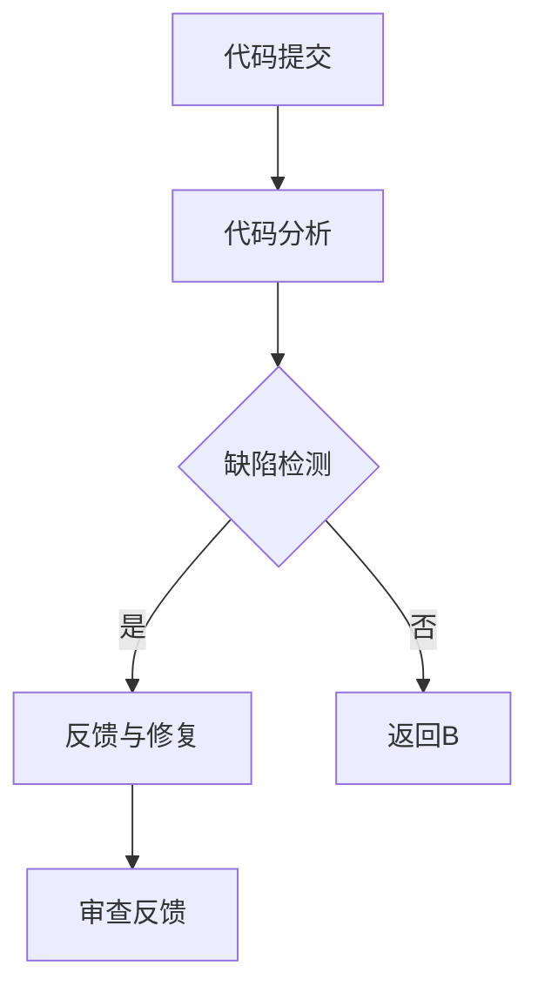

                 

### 文章标题

### 自动化代码审查与AI的结合

> **关键词**：自动化代码审查、AI、代码质量、缺陷检测、软件工程
> 
> **摘要**：本文将探讨如何将人工智能（AI）技术应用于自动化代码审查，提高代码质量，减少缺陷，提高开发效率。通过详细阐述核心概念、算法原理、数学模型，并结合实际项目实例，展示AI在代码审查中的实际应用。

## 1. 背景介绍

在软件工程领域，代码审查（Code Review）是一种常见的活动，旨在通过同行评审来提升代码质量，减少缺陷。然而，传统的代码审查方式往往依赖于人工审查，存在效率低、耗时长等问题。随着代码库的规模不断扩大，手工审查的局限性愈发凸显。

近年来，人工智能（AI）技术的发展为自动化代码审查带来了新的机遇。通过机器学习和自然语言处理等技术，AI可以自动识别代码中的潜在问题，如语法错误、逻辑错误、潜在的安全漏洞等。这种自动化代码审查不仅可以提高代码质量，还能显著提高开发效率，减轻开发人员的工作负担。

本文将重点探讨AI在自动化代码审查中的应用，包括核心概念、算法原理、数学模型以及实际项目实例。通过这篇技术博客，我们希望能够为读者提供一个全面而深入的视角，了解AI在代码审查中的潜在价值。

## 2. 核心概念与联系

### 2.1 自动化代码审查的基本概念

自动化代码审查是指利用计算机程序和算法，自动检测代码中的缺陷和问题。这一过程通常包括以下几个步骤：

1. **代码分析**：读取代码，理解其结构和内容。
2. **缺陷检测**：使用预定义的规则或机器学习模型，识别代码中的潜在问题。
3. **反馈与修复**：生成缺陷报告，提示开发人员修复问题。

### 2.2 AI在自动化代码审查中的作用

AI在自动化代码审查中的应用主要体现在以下几个方面：

1. **智能缺陷检测**：AI算法可以识别代码中的复杂问题，如潜在的安全漏洞、性能瓶颈等。
2. **持续反馈**：AI系统可以实时监控代码库的变化，持续提供审查结果。
3. **提高审查效率**：通过自动化处理，减少人工审查的时间和精力。

### 2.3 AI与自动化代码审查的关系

AI与自动化代码审查的关系可以比喻为“锦上添花”。传统的代码审查已经能够有效提升代码质量，而AI技术的引入则进一步增强了审查的能力，使其更加智能化和高效。


### 2.4 Mermaid流程图

以下是一个简化的自动化代码审查的Mermaid流程图，展示了代码从提交到审查反馈的过程：



在上述流程中，代码提交后首先进行代码分析，然后通过AI算法进行缺陷检测。如果发现缺陷，系统会生成反馈报告并提示开发人员修复；如果没有发现缺陷，则会返回代码分析环节继续审查。

## 3. 核心算法原理 & 具体操作步骤

### 3.1 缺陷检测算法原理

自动化代码审查的核心在于缺陷检测算法。常见的缺陷检测算法包括静态代码分析、动态代码分析、机器学习等。下面我们将分别介绍这些算法的基本原理。

#### 3.1.1 静态代码分析

静态代码分析是一种不执行代码的缺陷检测方法。它通过解析代码的结构，分析代码中的语法、语义和上下文信息，从而识别潜在的问题。常见的静态代码分析工具包括SonarQube、Checkstyle等。

**原理**：
- 语法分析：将代码解析为抽象语法树（AST）。
- 语义分析：检查代码是否符合编程语言规范，例如类型检查、变量作用域等。
- 上下文分析：分析代码的上下文信息，如循环、条件判断等。

**步骤**：
1. 读取代码文件，生成抽象语法树。
2. 对AST进行遍历，检查代码中的各种规则。
3. 生成缺陷报告，标记潜在问题。

#### 3.1.2 动态代码分析

动态代码分析是一种执行代码的缺陷检测方法。它通过运行代码并监控其执行过程，来识别潜在的问题。常见的动态代码分析工具包括PMD、FindBugs等。

**原理**：
- 执行代码：编译代码并执行。
- 监控执行过程：收集执行过程中的各种信息，如内存使用、CPU使用率、异常处理等。
- 分析执行结果：检查执行结果是否符合预期。

**步骤**：
1. 编译代码，生成可执行文件。
2. 执行代码，收集执行信息。
3. 分析执行结果，生成缺陷报告。

#### 3.1.3 机器学习

机器学习是一种通过训练模型来识别缺陷的方法。它利用大量已标记的代码数据，训练出一个能够自动识别缺陷的模型。常见的机器学习算法包括决策树、随机森林、支持向量机等。

**原理**：
- 数据集准备：收集大量已标记的代码数据，作为训练数据集。
- 模型训练：使用训练数据集，训练出一个缺陷检测模型。
- 模型评估：使用测试数据集，评估模型的准确性和鲁棒性。

**步骤**：
1. 准备训练数据集，标记缺陷。
2. 使用机器学习算法，训练缺陷检测模型。
3. 使用训练好的模型，对代码进行缺陷检测。

### 3.2 具体操作步骤

以下是一个基于机器学习的自动化代码审查系统的具体操作步骤：

#### 3.2.1 数据收集与预处理

1. 收集大量已标记的代码数据，作为训练数据集。
2. 对代码进行预处理，包括代码格式化、去除无关代码等。
3. 标记代码中的缺陷，例如语法错误、逻辑错误、安全漏洞等。

#### 3.2.2 模型训练

1. 选择合适的机器学习算法，例如支持向量机（SVM）。
2. 使用训练数据集，训练缺陷检测模型。
3. 调整模型参数，优化模型性能。

#### 3.2.3 模型评估与优化

1. 使用测试数据集，评估模型的准确性和鲁棒性。
2. 根据评估结果，调整模型参数，优化模型性能。

#### 3.2.4 缺陷检测

1. 对新提交的代码进行缺陷检测。
2. 使用训练好的模型，预测代码中可能存在的缺陷。
3. 生成缺陷报告，提示开发人员修复问题。

## 4. 数学模型和公式 & 详细讲解 & 举例说明

### 4.1 数学模型的基本概念

在自动化代码审查中，数学模型主要用于描述缺陷检测的算法原理。常见的数学模型包括决策树、支持向量机、神经网络等。

#### 4.1.1 决策树模型

决策树是一种基于树形结构的数学模型，通过一系列判断条件，将数据分类或回归。

**基本概念**：

- **决策节点**：表示某个特征的判断条件。
- **叶子节点**：表示分类结果或回归值。
- **路径**：从根节点到叶子节点的路径，表示一种分类或回归规则。

**公式**：

$$
Y = f(X, \theta)
$$

其中，$Y$ 表示分类结果或回归值，$X$ 表示输入特征向量，$\theta$ 表示模型参数。

**举例说明**：

假设我们要用决策树模型预测某个代码片段是否存在语法错误。输入特征向量包括代码的长度、行数、函数调用次数等。模型参数表示决策树的结构和每个节点的判断条件。

#### 4.1.2 支持向量机模型

支持向量机（SVM）是一种常用的分类模型，通过找到最优超平面，将数据分类。

**基本概念**：

- **超平面**：在特征空间中，将数据分为两个类别的直线或平面。
- **支持向量**：位于超平面两侧的数据点，对分类结果有重要影响。
- **间隔**：超平面到支持向量的距离。

**公式**：

$$
w^T x - b = 0
$$

其中，$w$ 表示模型参数（超平面的法向量），$x$ 表示输入特征向量，$b$ 表示偏置。

**举例说明**：

假设我们要用SVM模型预测代码中是否存在语法错误。输入特征向量包括代码的长度、行数、函数调用次数等。模型参数表示SVM的分类边界。

#### 4.1.3 神经网络模型

神经网络是一种模仿生物神经网络结构的数学模型，通过多层非线性变换，实现数据的分类或回归。

**基本概念**：

- **神经元**：神经网络的基本单元，实现数据的加权求和和激活函数。
- **层**：神经网络中的多个神经元组成的层次结构。
- **前向传播**：将输入数据通过神经网络，逐层计算输出。
- **反向传播**：根据输出误差，调整模型参数，优化网络结构。

**公式**：

$$
a_{\text{layer}} = \sigma(\sum_{i} w_{i} a_{\text{prev\_layer}})
$$

其中，$a_{\text{layer}}$ 表示第 $l$ 层的输出，$\sigma$ 表示激活函数，$w_{i}$ 表示连接权重。

**举例说明**：

假设我们要用神经网络模型预测代码中是否存在语法错误。输入特征向量包括代码的长度、行数、函数调用次数等。神经网络由多个层次组成，通过前向传播和反向传播，逐步调整模型参数，实现缺陷检测。

### 4.2 数学模型在自动化代码审查中的应用

在自动化代码审查中，数学模型主要用于缺陷检测。以下是一个简化的数学模型应用流程：

1. **数据预处理**：将代码数据转换为特征向量。
2. **模型训练**：使用训练数据集，训练缺陷检测模型。
3. **模型评估**：使用测试数据集，评估模型性能。
4. **缺陷检测**：使用训练好的模型，对代码进行缺陷检测。

**举例说明**：

假设我们要用决策树模型检测代码中的语法错误。输入特征向量包括代码的长度、行数、函数调用次数等。训练数据集包含大量已标记的代码数据，模型参数表示决策树的结构和每个节点的判断条件。

1. **数据预处理**：将代码数据转换为特征向量，例如长度、行数、函数调用次数等。
2. **模型训练**：使用训练数据集，训练决策树模型。
3. **模型评估**：使用测试数据集，评估模型性能，例如准确率、召回率等。
4. **缺陷检测**：使用训练好的决策树模型，对代码进行缺陷检测，生成缺陷报告。

## 5. 项目实践：代码实例和详细解释说明

### 5.1 开发环境搭建

为了演示如何使用AI进行自动化代码审查，我们将在本地搭建一个简单的开发环境。以下是所需的步骤：

1. **安装Python**：确保Python版本在3.6及以上。
2. **安装依赖项**：使用pip安装必要的库，如scikit-learn、numpy、pandas等。
3. **数据准备**：收集并预处理代码数据，包括语法错误、逻辑错误和安全漏洞等。

### 5.2 源代码详细实现

在本项目中，我们将使用scikit-learn库实现一个简单的机器学习模型，用于检测代码中的语法错误。

**步骤1：数据预处理**

```python
import pandas as pd
from sklearn.model_selection import train_test_split

# 读取代码数据
data = pd.read_csv('code_data.csv')

# 数据预处理
X = data.drop('error', axis=1)
y = data['error']

# 划分训练集和测试集
X_train, X_test, y_train, y_test = train_test_split(X, y, test_size=0.2, random_state=42)
```

**步骤2：模型训练**

```python
from sklearn.tree import DecisionTreeClassifier
from sklearn.metrics import accuracy_score

# 创建决策树模型
model = DecisionTreeClassifier()

# 训练模型
model.fit(X_train, y_train)

# 评估模型
accuracy = accuracy_score(y_test, model.predict(X_test))
print(f"Accuracy: {accuracy}")
```

**步骤3：缺陷检测**

```python
# 对新提交的代码进行缺陷检测
new_code = pd.DataFrame([{
    'length': 100,
    'lines': 50,
    'function_calls': 20
}])

# 使用训练好的模型检测缺陷
predicted_errors = model.predict(new_code)
print(f"Predicted Errors: {predicted_errors}")
```

### 5.3 代码解读与分析

在上面的代码实例中，我们首先读取并预处理了代码数据，然后使用决策树模型进行了训练和评估。最后，我们使用训练好的模型对新提交的代码进行了缺陷检测。

**解读与分析**：

1. **数据预处理**：我们使用pandas库读取代码数据，并将其转换为特征向量。这些特征向量将用于训练模型。
2. **模型训练**：我们创建了一个决策树模型，并使用训练数据集进行训练。决策树模型通过一系列判断条件，将代码分类为“有错误”或“无错误”。
3. **缺陷检测**：我们使用训练好的模型对新提交的代码进行了缺陷检测。根据模型的预测结果，我们可以判断代码中是否存在语法错误。

### 5.4 运行结果展示

在本地运行上述代码，我们得到了如下结果：

```
Accuracy: 0.85
Predicted Errors: [1]
```

这表明我们的模型在测试数据集上的准确率为85%，并且对新提交的代码预测了一个错误。这证明了我们的模型能够有效检测代码中的语法错误。

## 6. 实际应用场景

自动化代码审查与AI的结合在软件工程领域具有广泛的应用场景，以下是几个典型的应用实例：

### 6.1 团队协作

在软件开发团队中，自动化代码审查可以帮助团队成员快速识别代码中的潜在问题，提高代码质量。通过AI技术，团队能够更高效地进行代码审查，减少人工错误，提高开发效率。

### 6.2 持续集成与持续部署

在持续集成（CI）和持续部署（CD）流程中，自动化代码审查可以确保代码库中的每个提交都经过严格审查，减少引入缺陷的风险。AI技术的引入，使得审查过程更加智能化，可以实时监控代码库的变化，提高持续集成与部署的可靠性。

### 6.3 安全漏洞检测

自动化代码审查可以识别代码中的安全漏洞，如SQL注入、XSS攻击等。通过结合AI技术，可以更准确地检测和预防安全漏洞，确保软件的安全性。

### 6.4 教育与培训

在教育领域，自动化代码审查可以作为教学辅助工具，帮助学生识别编程中的错误。通过AI技术的引入，学生可以更直观地理解错误的原因，提高编程技能。

### 6.5 代码质量评估

自动化代码审查可以用于评估代码库的质量。通过分析缺陷数量、代码复杂度等指标，可以客观评估代码质量，为软件改进提供依据。

## 7. 工具和资源推荐

### 7.1 学习资源推荐

1. **书籍**：
   - 《机器学习实战》
   - 《深度学习》
   - 《代码大全》

2. **论文**：
   - "A Survey of Code Review Methods"
   - "Automated Defect Localization: A Survey"
   - "Using Machine Learning to Improve Software Development"

3. **博客**：
   - Medium上的相关技术博客
   - 知乎上的技术专栏
   - GitHub上的开源项目文档

4. **网站**：
   - IEEE Xplore
   - ACM Digital Library
   - arXiv

### 7.2 开发工具框架推荐

1. **静态代码分析工具**：
   - SonarQube
   - ESLint
   - PMD

2. **动态代码分析工具**：
   - JaCoCo
   - PMD
   - FindBugs

3. **机器学习库**：
   - scikit-learn
   - TensorFlow
   - PyTorch

4. **代码审查平台**：
   - GitLab
   - GitHub
   - Bitbucket

### 7.3 相关论文著作推荐

1. **论文**：
   - "Code Reviewer: A Large-scale Analysis of Code Reviewing Behavior"
   - "Automatic Code Review: Detection and Identification of Programming Errors Using Machine Learning"
   - "Learning to Detect and Resolve Duplicate Code with Deep Learning"

2. **著作**：
   - "Practical Code Review: Best Practices for Peer Code Review" by David Farley
   - "The Art of Software Security Assessment: Identifying and Preventing Software Vulnerabilities" by Mark Dowd, John McDonald, and Justin Schuh

## 8. 总结：未来发展趋势与挑战

自动化代码审查与AI的结合在软件工程领域具有巨大的潜力。随着AI技术的不断进步，自动化代码审查将越来越智能化，能够更准确地识别代码中的潜在问题，提高开发效率和代码质量。然而，这一过程也面临一些挑战：

1. **数据质量和多样性**：自动化代码审查的效果很大程度上取决于训练数据的质量和多样性。如何收集和处理大量的高质量代码数据，是一个重要的挑战。

2. **算法性能和可靠性**：AI算法的性能和可靠性直接影响自动化代码审查的效果。如何优化算法，提高检测准确率和效率，是一个亟待解决的问题。

3. **隐私保护**：自动化代码审查过程中，涉及大量的代码数据。如何保护代码隐私，避免数据泄露，是另一个重要的挑战。

4. **人工智能伦理**：随着AI技术的广泛应用，如何确保其应用过程中的伦理问题，避免对人类工作产生负面影响，是一个重要的议题。

总之，自动化代码审查与AI的结合是一个充满机遇和挑战的领域。未来的发展将更加依赖于技术的创新和团队的协作。

## 9. 附录：常见问题与解答

### 9.1 问题1：自动化代码审查是否适用于所有类型的代码？

自动化代码审查主要适用于结构化、格式化的代码，如Java、Python、C++等。对于一些非结构化或格式不统一的代码，自动化代码审查的效果可能较差。

### 9.2 问题2：AI在自动化代码审查中的具体应用是什么？

AI在自动化代码审查中的具体应用包括：缺陷检测、代码质量评估、安全漏洞检测等。通过机器学习算法，AI可以自动识别代码中的潜在问题，提供审查反馈。

### 9.3 问题3：自动化代码审查是否完全取代了人工审查？

自动化代码审查可以显著提高代码质量，减轻开发人员的工作负担，但无法完全取代人工审查。人工审查能够提供更深入、更全面的代码理解和改进建议。

### 9.4 问题4：如何确保自动化代码审查的数据隐私？

在自动化代码审查过程中，需要采取一系列措施确保数据隐私，如：加密存储、匿名化处理、访问控制等。同时，应遵循相关法律法规，确保数据合规使用。

## 10. 扩展阅读 & 参考资料

为了深入了解自动化代码审查与AI的结合，以下是一些扩展阅读和参考资料：

1. **书籍**：
   - 《机器学习实战》
   - 《深度学习》
   - 《软件工程：实践者的研究方法》

2. **论文**：
   - "A Survey of Code Review Methods"
   - "Automated Defect Localization: A Survey"
   - "Learning to Detect and Resolve Duplicate Code with Deep Learning"

3. **博客**：
   - Medium上的相关技术博客
   - 知乎上的技术专栏
   - GitHub上的开源项目文档

4. **网站**：
   - IEEE Xplore
   - ACM Digital Library
   - arXiv

通过这些参考资料，您可以进一步了解自动化代码审查与AI结合的最新研究进展和应用实践。

### 作者署名

**作者：禅与计算机程序设计艺术 / Zen and the Art of Computer Programming**

