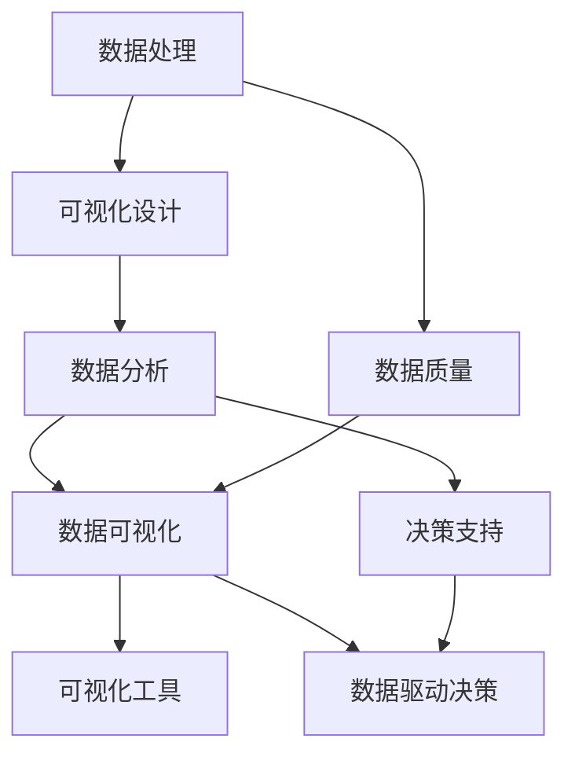

                 

### 背景介绍

在自动化创业领域，数据可视化作为一种重要的工具，正逐渐受到越来越多的关注。数据可视化不仅能够帮助创业公司更好地理解和分析其业务数据，还能够为决策者提供直观、清晰的决策依据。随着大数据技术的快速发展，如何有效地管理和分析海量的业务数据，成为了许多创业公司面临的重要挑战。

数据可视化作为大数据分析的一个重要环节，其重要性不容忽视。首先，通过数据可视化，创业公司可以直观地了解业务运行情况，发现潜在的问题和机遇。其次，数据可视化能够提高决策效率，帮助决策者快速地做出正确的决策。此外，数据可视化还可以提升公司的数据文化，使得员工能够更好地理解和使用数据，从而提高整个团队的协作效率。

目前，数据可视化技术在创业公司中的应用已经相当广泛。例如，许多创业公司使用数据可视化工具来监控网站流量、分析用户行为、评估市场趋势等。同时，随着人工智能和机器学习技术的不断进步，数据可视化技术也在不断地发展和完善。例如，一些创业公司已经开始探索如何将人工智能技术应用到数据可视化中，以实现更加智能、高效的可视化分析。

然而，尽管数据可视化技术在创业公司中的应用已经取得了一定的进展，但仍面临着一些挑战。首先，数据质量是一个重要的问题。只有高质量的数据，才能确保数据可视化结果的准确性和可靠性。其次，数据可视化工具的复杂性和学习成本也是一个挑战。许多创业公司缺乏专业的数据可视化技能，难以有效地使用这些工具。此外，数据可视化结果的解释和沟通也是一个难题，需要数据可视化学者具备一定的沟通能力和业务理解能力。

总之，数据可视化在自动化创业中具有重要的作用，但同时也面临着一些挑战。在接下来的文章中，我们将深入探讨数据可视化的核心概念、算法原理、数学模型、项目实践、应用场景、工具推荐以及未来发展趋势与挑战，希望能够为广大创业公司提供一些有价值的参考和指导。

### 核心概念与联系

数据可视化是自动化创业中的一个关键工具，它通过图形化的方式将复杂数据转换为直观、易理解的信息，从而帮助决策者更好地分析和理解数据。为了深入理解数据可视化的概念和原理，我们需要明确以下几个核心概念：

**1. 数据可视化（Data Visualization）：**
数据可视化是指使用图表、图形、图像等视觉元素来表示和分析数据。它的主要目的是将抽象的数据转换为具体的、易于理解的形式，以便于人们进行观察、分析和决策。

**2. 数据处理（Data Processing）：**
数据处理是指对原始数据进行清洗、转换、整合和分析的一系列过程。在数据可视化中，数据处理是基础，只有通过高质量的数据处理，才能获得准确和可靠的可视化结果。

**3. 可视化设计（Visual Design）：**
可视化设计是指利用设计原则和视觉元素来优化数据可视化的效果，使其既美观又易于理解。一个好的可视化设计可以提高数据可视化的效果，增强其表达力。

**4. 数据分析（Data Analysis）：**
数据分析是指通过统计、建模等方法对数据进行深入分析，以发现数据中的规律和趋势。在数据可视化中，数据分析是核心，通过数据分析，我们可以发现数据中的隐藏信息，从而做出更准确的决策。

**5. 可视化工具（Visualization Tools）：**
可视化工具是指用于创建和展示数据可视化图表和图形的软件或平台。常见的可视化工具有 Tableau、Power BI、D3.js 等。

**6. 数据驱动决策（Data-driven Decision Making）：**
数据驱动决策是指通过数据分析和可视化来支持决策过程，使决策更加科学和客观。在数据驱动决策中，数据可视化起到了关键的作用，它能够帮助决策者直观地理解数据，从而做出更准确的决策。

为了更好地理解这些核心概念之间的联系，我们可以使用 Mermaid 流程图来展示它们之间的关系：



在这个流程图中，数据处理是数据可视化、数据分析、数据驱动决策的基础。可视化设计则负责优化数据可视化的效果，使其更加美观和易于理解。数据分析通过深入分析数据，发现数据中的规律和趋势，为决策提供支持。数据可视化工具则用于创建和展示数据可视化结果。最后，数据驱动决策通过数据分析和可视化结果，帮助决策者做出更准确的决策。

通过这个流程图，我们可以清晰地看到各个核心概念之间的联系，以及它们在数据可视化中的重要性。这些概念和联系为我们理解和应用数据可视化提供了重要的理论基础和实践指导。

### 核心算法原理 & 具体操作步骤

数据可视化的核心在于如何将复杂数据转换为直观的视觉表示形式。这一过程涉及到多个关键算法和操作步骤。下面，我们将详细探讨这些算法原理和操作步骤，以便更好地理解和应用数据可视化。

#### 1. 数据转换

数据转换是数据可视化的重要基础，它包括数据清洗、转换和整合等步骤。

**1.1 数据清洗：**
数据清洗是数据预处理的关键步骤，其目的是去除数据中的噪声和错误，确保数据的质量和准确性。常见的数据清洗方法包括去除重复记录、填补缺失值、纠正错误数据等。

**1.2 数据转换：**
数据转换是将原始数据转换为适合可视化分析的形式。例如，将文本数据转换为数值数据，或将时间序列数据转换为图表数据。

**1.3 数据整合：**
数据整合是将来自不同数据源的数据进行合并和整合，以便于进行统一的数据分析。例如，将销售数据与客户数据、市场数据等整合在一起，以便于分析客户行为和市场趋势。

#### 2. 数据可视化技术

数据可视化技术包括多种图表类型和可视化方法，以下是几种常见的数据可视化技术：

**2.1 条形图（Bar Chart）：**
条形图用于显示不同类别之间的数量或比例差异。它通过长短不同的条形来表示数据的大小，非常适合比较不同类别的数据。

**2.2 折线图（Line Chart）：**
折线图用于显示数据随时间或其他变量的变化趋势。它通过连续的线条来表示数据的变化，非常适合分析数据的动态变化。

**2.3 饼图（Pie Chart）：**
饼图用于显示各部分占总体的比例。它通过不同大小的扇形来表示各部分的大小，非常适合展示构成和比例关系。

**2.4 散点图（Scatter Plot）：**
散点图用于显示两个变量之间的关系。它通过在坐标系中标记数据点来表示变量之间的相关性，非常适合分析变量之间的关系。

**2.5 地图（Map）：**
地图用于显示地理位置和空间分布。它通过颜色、标识等方式来表示不同地理位置的数据，非常适合分析地域性的数据分布。

#### 3. 可视化操作步骤

数据可视化的具体操作步骤可以分为以下几个阶段：

**3.1 数据准备：**
- 收集和整理原始数据，确保数据的质量和完整性。

**3.2 数据分析：**
- 进行数据清洗、转换和整合，以便于进行可视化分析。

**3.3 选择可视化类型：**
- 根据数据分析结果和业务需求，选择适合的可视化类型。

**3.4 设计可视化布局：**
- 设计可视化布局，包括图表的排列、标注和交互设计等。

**3.5 创建可视化图表：**
- 使用可视化工具创建图表，设置图表的样式和参数。

**3.6 可视化分析：**
- 对可视化结果进行分析，提取关键信息和发现。

**3.7 反馈和优化：**
- 根据可视化分析结果和用户反馈，对可视化进行优化和改进。

#### 4. 可视化算法原理

数据可视化中的算法主要涉及以下几个方面：

**4.1 色彩映射（Color Mapping）：**
色彩映射是将数据值映射到不同的颜色上，以表示数据的差异和趋势。常用的色彩映射算法包括线性映射、分位数映射、类别映射等。

**4.2 标注和注释（Annotation and Comment）：**
标注和注释用于在可视化图表中添加说明和解释，帮助用户更好地理解数据。

**4.3 交互设计（Interactive Design）：**
交互设计包括用户与可视化图表的交互方式，如缩放、筛选、过滤等。通过交互设计，用户可以更灵活地分析数据。

**4.4 数据聚合和分解（Aggregation and Decomposition）：**
数据聚合是将多个数据点合并成一个数据点，以便于整体分析。数据分解则是将一个数据点拆分成多个数据点，以便于详细分析。

通过上述核心算法原理和具体操作步骤，我们可以更好地理解和应用数据可视化技术。在自动化创业中，数据可视化不仅可以帮助企业更好地管理和分析业务数据，还可以支持科学决策和业务优化。在接下来的章节中，我们将通过具体的项目实践，进一步展示数据可视化技术的应用效果。

### 数学模型和公式 & 详细讲解 & 举例说明

数据可视化中的数学模型和公式是理解和应用数据可视化技术的重要基础。以下我们将详细讲解几个常用的数学模型和公式，并通过具体例子进行说明，帮助读者更好地理解这些概念。

#### 1. 色彩映射公式

色彩映射是数据可视化中常用的一种技术，它将数据值映射到不同的颜色上，以表示数据的差异和趋势。常用的色彩映射公式包括线性映射、分位数映射和类别映射。

**1.1 线性映射公式**

线性映射是最简单的色彩映射方法，公式如下：

\[ C = C_{min} + \frac{V - V_{min}}{V_{max} - V_{min}} \times (C_{max} - C_{min}) \]

其中：
- \( C \) 表示映射后的颜色；
- \( C_{min} \) 和 \( C_{max} \) 分别表示最小值和最大值映射的颜色；
- \( V \) 和 \( V_{min} \) 、\( V_{max} \) 分别表示原始数据和最小值、最大值。

例如，假设我们有一组数据 [10, 30, 50, 70, 90]，要求将其映射到不同的颜色上，我们可以选择蓝色（最小值映射为红色，最大值映射为蓝色），映射公式为：

\[ C = R + \frac{V - 10}{90 - 10} \times (B - R) \]

将数据代入公式，可以得到如下映射结果：
- 10 映射为红色：\( R \)
- 30 映射为橙色：\( R + \frac{30 - 10}{90 - 10} \times (B - R) \)
- 50 映射为绿色：\( R + \frac{50 - 10}{90 - 10} \times (B - R) \)
- 70 映射为青色：\( R + \frac{70 - 10}{90 - 10} \times (B - R) \)
- 90 映射为蓝色：\( B \)

**1.2 分位数映射公式**

分位数映射是一种更加灵活的色彩映射方法，它根据数据的不同分位数将数据映射到不同的颜色上。公式如下：

\[ C = C_{q1} + \frac{V - V_{q1}}{V_{q2} - V_{q1}} \times (C_{q2} - C_{q1}) \]

其中：
- \( C_{q1} \) 和 \( C_{q2} \) 分别表示第 q1 分位数和第 q2 分位数映射的颜色；
- \( V_{q1} \) 和 \( V_{q2} \) 分别表示第 q1 分位数和第 q2 分位数。

例如，假设我们有一组数据 [10, 30, 50, 70, 90]，要求根据中位数（50）和第一四分位数（30）进行分位数映射，映射公式为：

\[ C = C_{10} + \frac{V - 30}{50 - 30} \times (C_{50} - C_{10}) \]

将数据代入公式，可以得到如下映射结果：
- 10 映射为蓝色：\( C_{10} \)
- 30 映射为绿色：\( C_{10} + \frac{30 - 10}{50 - 30} \times (C_{50} - C_{10}) \)
- 50 映射为红色：\( C_{50} \)
- 70 映射为橙色：\( C_{10} + \frac{70 - 30}{50 - 30} \times (C_{50} - C_{10}) \)
- 90 映射为黄色：\( C_{10} + \frac{90 - 30}{50 - 30} \times (C_{50} - C_{10}) \)

**1.3 类别映射公式**

类别映射是一种将数据值映射到不同类别的颜色上的方法，公式如下：

\[ C = C_{k} \]

其中：
- \( C_{k} \) 表示第 k 个类别的颜色。

例如，假设我们有一组数据 [10, 30, 50, 70, 90]，要求将其分为两类，映射公式为：

\[ C = \begin{cases} 
R & \text{如果 } V \leq 50 \\
B & \text{如果 } V > 50 
\end{cases} \]

将数据代入公式，可以得到如下映射结果：
- 10 映射为红色：\( R \)
- 30 映射为红色：\( R \)
- 50 映射为蓝色：\( B \)
- 70 映射为蓝色：\( B \)
- 90 映射为蓝色：\( B \)

通过上述色彩映射公式，我们可以根据不同的需求选择合适的映射方法，以实现数据值的可视化表示。

#### 2. 数据聚合和分解公式

数据聚合和分解是数据可视化中用于处理大规模数据的常用技术。

**2.1 数据聚合公式**

数据聚合是将多个数据点合并成一个数据点的过程，公式如下：

\[ \text{聚合值} = \frac{1}{n} \sum_{i=1}^{n} V_i \]

其中：
- \( \text{聚合值} \) 表示聚合后的数据值；
- \( n \) 表示数据点的个数；
- \( V_i \) 表示第 i 个数据点的值。

例如，假设我们有一组数据 [10, 20, 30, 40, 50]，要求计算平均值，聚合公式为：

\[ \text{平均值} = \frac{10 + 20 + 30 + 40 + 50}{5} = 30 \]

**2.2 数据分解公式**

数据分解是将一个数据点拆分成多个数据点的过程，公式如下：

\[ V_i = \text{聚合值} \times \frac{V_i - V_{min}}{V_{max} - V_{min}} \]

其中：
- \( V_i \) 表示第 i 个数据点的值；
- \( \text{聚合值} \) 表示聚合后的数据值；
- \( V_{min} \) 和 \( V_{max} \) 分别表示最小值和最大值。

例如，假设我们有一组数据 [10, 20, 30, 40, 50]，要求按照比例分解为五个数据点，分解公式为：

\[ V_i = 30 \times \frac{V_i - 10}{50 - 10} \]

将数据代入公式，可以得到如下分解结果：
- 10 分解为 \( 30 \times \frac{10 - 10}{50 - 10} = 0 \)
- 20 分解为 \( 30 \times \frac{20 - 10}{50 - 10} = 6 \)
- 30 分解为 \( 30 \times \frac{30 - 10}{50 - 10} = 12 \)
- 40 分解为 \( 30 \times \frac{40 - 10}{50 - 10} = 18 \)
- 50 分解为 \( 30 \times \frac{50 - 10}{50 - 10} = 24 \)

通过数据聚合和分解，我们可以根据不同的需求对数据进行处理，以实现数据可视化的效果。

#### 3. 可视化效果评估公式

可视化效果评估是衡量数据可视化效果的重要手段。以下是一个常用的可视化效果评估公式：

\[ E = \frac{\text{信息量}}{\text{认知负荷}} \]

其中：
- \( E \) 表示可视化效果；
- \(\text{信息量}\) 表示数据可视化的信息传递效率；
- \(\text{认知负荷}\) 表示用户理解数据可视化所需的心理成本。

例如，假设一个数据可视化图表能够清晰地展示数据分布，用户容易理解其信息，认知负荷较低，而信息量较高，则其可视化效果 \( E \) 较高。

通过上述数学模型和公式的详细讲解，我们可以更好地理解和应用数据可视化技术，从而实现数据的有效可视化和分析。在实际应用中，根据具体需求和场景选择合适的数学模型和公式，可以大大提高数据可视化的效果和效率。

### 项目实践：代码实例和详细解释说明

在本节中，我们将通过一个实际的项目实践，展示如何使用数据可视化技术来分析和展示数据。为了更好地理解整个流程，我们将分阶段进行详细解释。

#### 1. 开发环境搭建

首先，我们需要搭建开发环境。在这个项目中，我们将使用 Python 和 Jupyter Notebook 作为主要开发工具，结合 Matplotlib 和 Seaborn 等库进行数据可视化。

**安装 Python:**
```bash
# 在终端中安装 Python
brew install python
```

**安装 Jupyter Notebook:**
```bash
# 安装 Jupyter Notebook
pip install notebook
```

**安装 Matplotlib 和 Seaborn:**
```bash
# 安装 Matplotlib
pip install matplotlib

# 安装 Seaborn
pip install seaborn
```

#### 2. 源代码详细实现

接下来，我们将编写代码来读取数据、进行数据分析，并生成可视化图表。

```python
# 导入必要的库
import pandas as pd
import matplotlib.pyplot as plt
import seaborn as sns

# 读取数据
data = pd.read_csv('example_data.csv')

# 数据预处理
# 假设数据中有列名为 'sales' 和 'month'
data['month'] = pd.to_datetime(data['month'])

# 数据分析
# 计算每月的销售额平均值
monthly_sales = data.groupby(data['month'].dt.strftime('%Y-%m'))['sales'].mean()

# 可视化：生成折线图
monthly_sales.plot()
plt.title('Monthly Sales Trend')
plt.xlabel('Month')
plt.ylabel('Average Sales')
plt.show()

# 可视化：生成散点图
sns.scatterplot(data=data, x='sales', y='month')
plt.title('Sales by Month')
plt.xlabel('Sales')
plt.ylabel('Month')
plt.show()

# 可视化：生成条形图
sales_by_month = data.groupby(data['month'].dt.strftime('%Y-%m'))['sales'].sum()
sales_by_month.plot(kind='bar')
plt.title('Monthly Sales by Month')
plt.xlabel('Month')
plt.ylabel('Total Sales')
plt.show()
```

#### 3. 代码解读与分析

上面的代码可以分为几个关键部分：

- **数据读取与预处理：**
  使用 Pandas 读取 CSV 数据，并对数据进行必要的预处理，如日期格式的转换。

- **数据分析：**
  对数据进行分组和计算，以生成每月的销售额平均值、每月的销售额总和等。

- **可视化图表生成：**
  使用 Matplotlib 和 Seaborn 生成不同的图表，包括折线图、散点图和条形图，以展示数据的不同方面。

#### 4. 运行结果展示

运行上述代码后，我们会得到以下可视化结果：

- **折线图：**展示每月的销售额平均值趋势，可以帮助我们了解销售额的波动情况。
- **散点图：**展示销售额与月份的关系，直观地显示销售额的分布。
- **条形图：**展示每月的销售额总和，便于比较各月之间的销售额差异。

通过这些图表，我们可以快速地了解和分析业务数据，从而做出相应的决策。

#### 5. 实践小结

在这个项目中，我们通过具体的代码实例展示了如何使用 Python 和数据可视化库来读取数据、进行数据分析，并生成多种可视化图表。这一实践过程不仅帮助我们理解了数据可视化的基本原理，还提高了我们对数据分析工具的使用熟练度。在实际应用中，根据具体业务需求和数据特点，我们可以灵活选择不同的图表类型和可视化方法，以实现最佳的数据展示效果。

### 实际应用场景

数据可视化技术在自动化创业中的应用场景广泛，涵盖了从市场分析到客户行为监测，再到业务流程优化的各个方面。以下是一些具体的应用场景：

#### 1. 市场分析

在市场分析中，数据可视化可以帮助企业深入了解市场趋势、竞争状况和客户需求。通过数据可视化工具，企业可以创建各种图表，如饼图、柱状图、折线图等，来展示市场数据。例如：

- **市场占有率分析：**使用饼图展示不同产品或服务的市场份额，帮助企业识别主要竞争对手。
- **销售趋势分析：**通过折线图展示销售数据的变化趋势，帮助企业预测市场需求，调整生产和营销策略。
- **价格弹性分析：**使用散点图展示价格与销售量的关系，帮助确定最佳价格策略。

#### 2. 客户行为监测

在客户行为监测方面，数据可视化可以帮助企业更好地理解客户的行为模式，从而优化产品和服务。以下是一些具体的例子：

- **用户活跃度分析：**通过折线图展示用户登录、浏览和购买等行为的时间分布，帮助企业识别用户活跃的高峰期和低谷期。
- **用户留存率分析：**使用柱状图展示不同时间段内的用户留存率，帮助企业评估产品或服务的吸引力。
- **用户路径分析：**通过热力图展示用户在网站或应用中的活动路径，帮助发现用户痛点，优化用户体验。

#### 3. 业务流程优化

在业务流程优化中，数据可视化可以帮助企业识别流程中的瓶颈和优化点，提高运营效率。以下是一些具体的例子：

- **生产流程监控：**通过实时数据可视化，展示生产设备的运行状态、产量和质量数据，帮助企业实时监控生产流程。
- **库存管理分析：**使用条形图或折线图展示库存水平、库存周转率等数据，帮助优化库存管理策略。
- **销售团队绩效分析：**通过柱状图或折线图展示不同销售团队的业绩指标，帮助企业评估销售团队的表现，制定相应的激励措施。

#### 4. 风险管理

在风险管理方面，数据可视化可以帮助企业识别潜在的风险，制定有效的风险控制措施。以下是一些具体的例子：

- **信用风险评估：**使用散点图展示借款人的信用评分与借款金额、利率等变量的关系，帮助银行和金融机构评估借款人的信用风险。
- **市场风险分析：**通过折线图和柱状图展示市场的波动情况，帮助投资机构评估市场风险，调整投资组合。
- **供应链风险监控：**使用实时数据可视化，展示供应链中的库存、运输和交货状态，帮助供应链管理者识别和应对供应链风险。

#### 5. 创新决策

在创新决策方面，数据可视化可以帮助企业发现新的业务机会和市场趋势，推动企业创新。以下是一些具体的例子：

- **产品创新趋势分析：**通过趋势图和聚类分析，帮助企业识别市场上的新兴产品和趋势，推动产品创新。
- **竞争对手分析：**使用网络图展示企业及其竞争对手之间的关系，帮助企业了解竞争对手的动态，制定相应的市场策略。

通过以上实际应用场景，我们可以看到数据可视化技术在自动化创业中的重要性。它不仅帮助企业更好地理解和分析数据，还支持科学的决策和业务优化。在未来，随着数据可视化技术的不断发展和创新，其应用场景将更加广泛，为企业创造更大的价值。

### 工具和资源推荐

在数据可视化领域，有许多优秀的工具和资源可以帮助企业和个人快速搭建数据可视化应用。以下是一些推荐的工具、学习资源和相关论文，供大家参考。

#### 1. 学习资源推荐

**书籍：**
- 《数据可视化：实现最佳实践的图形设计原则》（Data Visualization: Designing and Using Graphical and Tabular Summaries）
- 《用数据讲故事：有效沟通的视觉化方法》（Storytelling with Data: A Data Visualization Guide for Business Professionals）
- 《信息图形设计：创造信息丰富、引人入胜的可视化》（Information Graphics: A Comprehensive Illustrated Reference）

**在线课程：**
- Coursera上的《数据可视化与Tableau》课程
- Udemy上的《数据可视化：用Python和Matplotlib创建图表》课程
- edX上的《数据可视化与信息图形设计》课程

**博客和网站：**
- Tutsplus上的数据可视化教程
- VisualCortex的博客
- Data visualization by Chris

#### 2. 开发工具框架推荐

**数据可视化工具：**
- Tableau：一款功能强大的数据可视化工具，适合各种规模的企业使用。
- Power BI：微软推出的商业智能和数据分析工具，易于使用和部署。
- D3.js：一个基于JavaScript的动态数据可视化库，适用于创建复杂的交互式可视化图表。
- Plotly：一款支持多种编程语言的数据可视化库，提供丰富的图表类型和交互功能。

**数据管理工具：**
- Pandas：Python的数据分析库，用于数据清洗、转换和分析。
- DataCamp：提供交互式数据科学课程和工具，帮助用户快速掌握数据分析技能。
- RapidMiner：一个综合性的数据科学平台，支持数据预处理、分析和可视化。

**数据可视化框架：**
- Matplotlib：Python的绘图库，提供丰富的绘图函数和样式。
- Seaborn：基于Matplotlib的扩展库，提供更丰富的统计图表和可视化功能。
- Chart.js：一个基于HTML5 Canvas的轻量级图表库，适用于创建简单但美观的图表。

#### 3. 相关论文著作推荐

**论文：**
- “Information Visualization: A Survey” by Daniel A. Keim and Hans-Peter Kriegel（关于信息可视化的全面综述）
- “Interactive Data Visualization with Hypercomposites” by Michael Friendly（关于交互式数据可视化的研究）
- “Toward a Comprehensive Design Theory for Visualizations” by Andreas Opdahl and Gerlind Waller（关于数据可视化设计理论的研究）

**著作：**
- “Visual Thinking: Empathy, Creativity, and The Art of Science” by Don Norman（关于视觉认知和思维的书）
- “The Design of Everyday Things” by Don Norman（关于产品设计和人机交互的经典著作）
- “Information Architecture: Structuring & Classifying Web Sites” by Louis Rosenfeld and Peter Morville（关于网站设计和信息架构的书）

通过这些工具、资源和论文，用户可以更好地掌握数据可视化的技能和知识，提升数据分析和决策能力。无论是初学者还是有经验的专业人士，都可以从中受益，实现数据可视化技术的有效应用。

### 总结：未来发展趋势与挑战

数据可视化作为自动化创业中的一个关键工具，其在未来的发展趋势和面临的挑战同样值得关注。随着技术的不断进步，数据可视化正朝着更加智能化、个性化和高效化的方向发展，但同时也面临诸多挑战。

#### 未来发展趋势

1. **智能化数据分析：**随着人工智能和机器学习技术的快速发展，数据可视化将更加智能化。未来的数据可视化工具将能够自动识别数据中的模式、趋势和异常，为用户生成智能化的可视化报告和建议。

2. **个性化定制：**用户需求日益多样化，未来的数据可视化工具将提供更加个性化的定制服务，根据用户的专业背景、业务需求和偏好，自动调整可视化风格、图表类型和交互方式。

3. **实时数据分析：**实时数据可视化将变得越来越重要，特别是在金融市场、医疗监控和智能交通等领域。通过实时数据可视化，企业可以快速响应市场变化，提高业务决策的效率。

4. **跨平台整合：**数据可视化将不再局限于特定的平台或设备，而是实现跨平台整合，用户可以在不同的设备上无缝切换，获取一致的可视化体验。

5. **增强现实与虚拟现实：**随着AR和VR技术的发展，数据可视化将逐渐从平面扩展到三维空间，为用户提供更加沉浸式的数据体验。

#### 面临的挑战

1. **数据质量和隐私保护：**数据质量是数据可视化成功的关键，但当前数据质量参差不齐，如何确保数据质量成为一大挑战。同时，数据隐私保护也是一个重要议题，特别是在涉及敏感数据的情况下，如何保护用户隐私需要更多的关注。

2. **技术复杂性和学习成本：**数据可视化技术复杂，对专业知识和技能要求较高。目前市场上虽然有许多易用的工具，但要想真正掌握和应用这些工具，仍需要一定的时间和精力。

3. **可视化设计的艺术性：**一个好的数据可视化不仅需要技术支持，还需要优秀的可视化设计。设计能力不仅需要创意和审美，还需要对数据有深刻的理解。如何培养更多具备可视化设计能力的人才，是一个亟待解决的问题。

4. **多语言支持与国际化：**数据可视化工具需要支持多种语言，特别是在国际化应用场景中，如何确保可视化结果在不同语言和文化背景下的准确性和一致性，是未来需要解决的一个挑战。

5. **技术更新换代：**数据可视化技术更新迅速，如何保持技术的前沿性和实用性，避免落后于市场需求，是一个重要的挑战。

总之，数据可视化在自动化创业中具有广阔的应用前景，但也面临诸多挑战。未来，随着技术的不断进步和应用的深入，数据可视化将在智能化、个性化、实时性等方面取得更大的突破，同时也需要不断解决数据质量、隐私保护、技术复杂性等问题，以实现其最大化的商业价值和社会效益。

### 附录：常见问题与解答

#### 1. 数据可视化为什么重要？

数据可视化能够将复杂数据转换为直观的图形或图表，帮助用户快速理解和分析数据，从而做出更准确的决策。数据可视化不仅提高了决策效率，还增强了数据文化，提升了团队协作效率。

#### 2. 如何选择合适的数据可视化工具？

选择数据可视化工具需要考虑以下因素：
- **数据量：**对于大数据量，选择能够高效处理大量数据的工具；
- **易用性：**对于非技术人员，选择操作简便、学习成本低的工具；
- **图表类型：**根据数据分析需求，选择能够生成所需图表类型的工具；
- **交互性：**对于需要用户交互的分析，选择支持交互功能的工具。

#### 3. 数据可视化中的色彩映射是什么？

色彩映射是指将数据值映射到不同的颜色上，以表示数据的差异和趋势。色彩映射可以基于线性映射、分位数映射或类别映射等方法，帮助用户更直观地理解数据。

#### 4. 数据可视化中如何确保数据质量？

确保数据质量可以从以下几个方面入手：
- **数据清洗：**去除重复记录、填补缺失值、纠正错误数据；
- **数据验证：**确保数据来源可靠，数据格式正确；
- **数据监控：**定期检查数据质量，及时发现和处理数据问题。

#### 5. 数据可视化中的交互设计是什么？

交互设计是指用户与可视化图表之间的交互方式，如缩放、筛选、过滤等。良好的交互设计可以提高用户的体验，增强数据可视化的效果和实用性。

#### 6. 数据可视化在哪些行业有广泛应用？

数据可视化在金融、医疗、零售、制造、科技等多个行业有广泛应用。例如，金融行业用于分析市场趋势和风险评估，医疗行业用于诊断和疗效评估，零售行业用于消费者行为分析等。

#### 7. 如何评估数据可视化的效果？

可以使用以下方法评估数据可视化的效果：
- **信息传递效率：**数据可视化是否能够清晰地传递所需的信息；
- **用户满意度：**用户对数据可视化工具的满意度和使用频率；
- **认知负荷：**用户理解数据可视化结果所需的心理成本。

### 扩展阅读 & 参考资料

为了帮助读者更深入地了解数据可视化在自动化创业中的应用，以下是一些扩展阅读和参考资料：

- **书籍：**
  - 《数据可视化：实现最佳实践的图形设计原则》
  - 《用数据讲故事：有效沟通的视觉化方法》
  - 《信息图形设计：创造信息丰富、引人入胜的可视化》

- **在线课程：**
  - Coursera上的《数据可视化与Tableau》课程
  - Udemy上的《数据可视化：用Python和Matplotlib创建图表》课程
  - edX上的《数据可视化与信息图形设计》课程

- **博客和网站：**
  - Tutsplus上的数据可视化教程
  - VisualCortex的博客
  - Data visualization by Chris

- **论文：**
  - “Information Visualization: A Survey” by Daniel A. Keim and Hans-Peter Kriegel
  - “Interactive Data Visualization with Hypercomposites” by Michael Friendly
  - “Toward a Comprehensive Design Theory for Visualizations” by Andreas Opdahl and Gerlind Waller

- **技术文档和手册：**
  - Matplotlib官方文档
  - Seaborn官方文档
  - Tableau官方文档
  - Power BI官方文档

通过这些书籍、课程、博客和论文，读者可以系统地学习和掌握数据可视化的理论、方法和技术，更好地应用于自动化创业中。同时，这些资料也为进一步的研究和实践提供了宝贵的参考。希望本文能为广大创业者和数据科学爱好者带来有价值的启示和指导。

