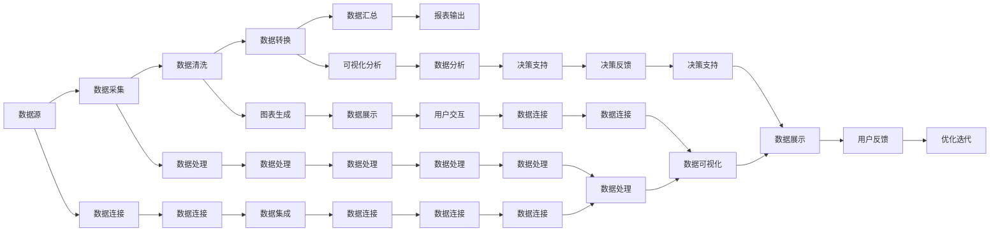

                 

### 背景介绍

**自动化报表生成与数据可视化**是现代企业中不可或缺的重要技术，它不仅能提高工作效率，还能帮助企业管理者更好地理解数据、做出更明智的决策。随着大数据时代的到来，企业和组织面临着海量数据的处理和展示需求，传统的人工报表方式已经难以满足快速变化的市场环境和日益增长的数据量。

#### **为什么要自动化报表生成与数据可视化**

首先，自动化报表生成能够大幅提高工作效率。在传统的报表生成过程中，数据处理、格式调整、报表生成等步骤都需要人工完成，这不仅耗时，还容易出错。而通过自动化报表生成工具，这些步骤可以由计算机自动完成，大大节省了人力资源。

其次，数据可视化能够直观地展示复杂数据。通过图表、图形等可视化方式，数据变得更加易于理解和分析，可以帮助决策者迅速把握数据的本质和趋势，从而做出更加精准的决策。

此外，自动化报表生成与数据可视化还有助于提升数据准确性。自动化工具能够减少人为错误，保证数据的一致性和准确性，从而提高决策的可靠性。

#### **当前现状**

目前，市场上存在多种自动化报表生成与数据可视化工具，如Power BI、Tableau、Excel等。这些工具各有特点和优势，能够满足不同企业和组织的需求。同时，随着技术的不断发展，新的工具和算法也在不断涌现，为自动化报表生成与数据可视化领域注入了新的活力。

然而，尽管自动化报表生成与数据可视化技术已经得到了广泛应用，但在实际应用中仍存在一些挑战，如数据源的选择、数据清洗、可视化效果的优化等。这些问题需要我们在实际应用中不断探索和解决。

#### **本篇文章的目标**

本文将围绕自动化报表生成与数据可视化这一主题，首先介绍其核心概念与联系，然后深入探讨核心算法原理与具体操作步骤，接着通过数学模型和公式进行详细讲解，并给出具体的代码实例和运行结果展示。最后，本文将分析实际应用场景，推荐相关的工具和资源，并对未来发展趋势与挑战进行总结。

通过本文的阅读，读者将能够全面了解自动化报表生成与数据可视化的基本概念、原理和应用，掌握核心算法和操作步骤，为实际项目开发提供有力的理论支持和实践经验。

### 核心概念与联系

在深入探讨自动化报表生成与数据可视化的具体内容之前，我们需要先明确一些核心概念，并理解它们之间的联系。以下是本文中涉及的主要概念：

#### **自动化报表生成**

自动化报表生成是指利用计算机技术和相关工具，将数据源中的数据自动提取、处理、格式化并生成报表的过程。这个过程通常包括数据采集、数据清洗、数据转换、数据汇总和报表输出等步骤。

#### **数据可视化**

数据可视化是指通过图形、图表、图像等可视化方式，将数据转换为视觉形式，使其更加直观易懂。数据可视化不仅能够帮助用户快速理解数据，还能够揭示数据中的潜在模式和关系。

#### **数据源**

数据源是自动化报表生成与数据可视化的基础。数据源可以是数据库、文件、API接口等多种形式，提供了所需的数据输入。数据源的质量和完整性直接影响报表的准确性和可视化的效果。

#### **数据处理**

数据处理是指对数据源中的数据进行清洗、转换、整合等操作，使其满足报表生成和可视化需求。数据处理是自动化报表生成与数据可视化过程中的关键环节，其质量直接关系到最终报表的准确性和有效性。

#### **报表输出**

报表输出是指将处理后的数据以报表的形式展示出来，可以是电子表格、PDF文件、Web页面等多种形式。报表输出不仅需要满足数据准确性和可视化需求，还需要考虑到用户的阅读习惯和需求。

#### **数据连接**

数据连接是指将不同的数据源连接起来，形成一个统一的数据视图。数据连接在自动化报表生成与数据可视化中至关重要，它能够整合多个数据源的数据，提供更全面的数据分析能力。

#### **图表和图形**

图表和图形是数据可视化的主要工具。常见的图表类型包括柱状图、折线图、饼图、散点图等。不同的图表类型适用于不同的数据展示需求，能够直观地传达数据信息。

#### **机器学习和人工智能**

机器学习和人工智能技术在自动化报表生成与数据可视化中发挥着重要作用。通过机器学习算法，可以对大量数据进行自动分类、聚类、预测等操作，进一步提高数据分析和可视化的能力。

#### **核心概念原理和架构的 Mermaid 流程图**

为了更好地理解上述概念之间的联系，我们可以使用Mermaid流程图来展示自动化报表生成与数据可视化的基本流程。以下是相应的Mermaid流程图：



通过上述Mermaid流程图，我们可以清晰地看到自动化报表生成与数据可视化各个核心概念之间的相互关系和作用机制。接下来，我们将进一步深入探讨这些核心概念的具体原理和实现方法。

### 核心算法原理与具体操作步骤

在了解了自动化报表生成与数据可视化的核心概念和它们之间的联系之后，接下来我们将深入探讨其中的核心算法原理，并详细解释其具体操作步骤。

#### **核心算法原理**

1. **数据处理算法**

数据处理算法是自动化报表生成与数据可视化的基础。常见的数据处理算法包括数据清洗、数据转换和数据汇总等。

   - **数据清洗**：数据清洗是处理数据源中的脏数据和异常值的过程。常见的清洗方法包括去除重复记录、填补缺失值、删除异常值等。

   - **数据转换**：数据转换是将数据源中的数据格式转换为满足报表生成和可视化需求的过程。常见的转换方法包括数据类型转换、数据归一化、数据缩放等。

   - **数据汇总**：数据汇总是对多个数据源的数据进行聚合和统计的过程。常见的汇总方法包括求和、平均、最大值、最小值等。

2. **数据可视化算法**

数据可视化算法是将处理后的数据转换为可视化形式的过程。常见的可视化算法包括图表生成、图形渲染和数据展示等。

   - **图表生成**：图表生成是将数据转换为图表的过程。常见的图表类型包括柱状图、折线图、饼图、散点图等。

   - **图形渲染**：图形渲染是将图表数据转换为图形显示的过程。常见的渲染方法包括矢量渲染和位图渲染等。

   - **数据展示**：数据展示是将图形化的数据展示给用户的过程。常见的展示形式包括Web页面、电子表格、PDF文件等。

3. **数据连接算法**

数据连接算法是将不同的数据源连接起来，形成一个统一的数据视图的过程。常见的连接算法包括数据库连接、API调用、文件读取等。

   - **数据库连接**：数据库连接是通过SQL查询或其他数据库接口将数据从数据库中提取出来的过程。

   - **API调用**：API调用是通过HTTP请求或其他API接口将数据从外部服务中提取出来的过程。

   - **文件读取**：文件读取是通过文件操作将数据从文件中读取出来的过程。

#### **具体操作步骤**

1. **数据采集**

   - **确定数据源**：根据报表生成和可视化需求，确定需要使用的数据源。

   - **采集数据**：通过数据库连接、API调用或文件读取等方式，将数据从数据源中采集出来。

2. **数据清洗**

   - **识别脏数据和异常值**：使用正则表达式、机器学习等方法，识别数据中的脏数据和异常值。

   - **数据清洗**：使用Python、SQL等编程语言，对数据进行清洗处理，如去除重复记录、填补缺失值、删除异常值等。

3. **数据转换**

   - **数据类型转换**：将文本数据转换为数字或日期等数据类型。

   - **数据归一化**：对数据进行归一化处理，如归一化到0-1之间或标准正态分布等。

   - **数据缩放**：对数据进行缩放处理，如线性缩放或对数缩放等。

4. **数据汇总**

   - **聚合操作**：使用聚合函数，如求和、平均、最大值、最小值等，对数据进行聚合操作。

   - **统计操作**：使用统计函数，如方差、标准差等，对数据进行统计操作。

5. **图表生成**

   - **选择图表类型**：根据数据类型和可视化需求，选择合适的图表类型，如柱状图、折线图、饼图等。

   - **生成图表**：使用Python的matplotlib库、R的ggplot2库等，生成相应的图表。

6. **图形渲染**

   - **选择渲染方法**：根据图表类型和显示需求，选择合适的渲染方法，如矢量渲染或位图渲染等。

   - **渲染图表**：使用Python的PyPlot库、R的plot函数等，渲染出图表。

7. **数据展示**

   - **选择展示形式**：根据用户需求和场景，选择合适的展示形式，如Web页面、电子表格、PDF文件等。

   - **展示数据**：使用HTML、CSS、JavaScript等技术，将图表和图形展示在Web页面上；使用Excel、Power BI等技术，将数据展示在电子表格中；使用PDF生成器，将数据展示在PDF文件中。

通过以上步骤，我们可以实现自动化报表生成与数据可视化。接下来，我们将通过具体实例来进一步讲解这些算法的操作过程。

#### **实例讲解**

假设我们需要生成一份关于销售额的报表，包括每天的销售金额、平均销售额和最大销售额。以下是具体的操作步骤：

1. **数据采集**

   假设我们有一个CSV文件，其中包含每天的销售数据。文件格式如下：

   ```csv
   日期,销售额
   2023-01-01,1000
   2023-01-02,1200
   2023-01-03,800
   2023-01-04,1500
   2023-01-05,1300
   ```

   使用Python的pandas库，我们可以轻松地将数据从CSV文件中读取出来：

   ```python
   import pandas as pd

   data = pd.read_csv('sales_data.csv')
   ```

2. **数据清洗**

   在这个例子中，我们假设数据已经是干净的，没有脏数据和异常值。

3. **数据转换**

   我们需要将日期转换为日期类型，并计算每天的平均销售额和最大销售额。使用pandas库的函数，我们可以轻松实现这些操作：

   ```python
   data['日期'] = pd.to_datetime(data['日期'])
   daily_avg_sales = data['销售额'].mean()
   daily_max_sales = data['销售额'].max()
   ```

4. **数据汇总**

   使用聚合函数，我们可以计算每天的销售金额：

   ```python
   daily_sales = data.groupby('日期')['销售额'].sum()
   ```

5. **图表生成**

   我们选择生成一个折线图来展示每天的销售金额。使用matplotlib库，我们可以轻松生成折线图：

   ```python
   import matplotlib.pyplot as plt

   daily_sales.plot()
   plt.title('Daily Sales')
   plt.xlabel('Date')
   plt.ylabel('Sales')
   plt.show()
   ```

6. **图形渲染**

   默认情况下，matplotlib使用矢量渲染方法，生成高质量的图表。

7. **数据展示**

   我们可以将生成的图表展示在一个Web页面上，或者将其保存为PDF文件。在这里，我们将图表保存为PNG文件：

   ```python
   daily_sales.plot().savefig('daily_sales.png')
   ```

通过以上步骤，我们成功地实现了自动化报表生成与数据可视化。接下来，我们将进一步探讨数学模型和公式在自动化报表生成与数据可视化中的应用。

### 数学模型和公式

在自动化报表生成与数据可视化过程中，数学模型和公式起着至关重要的作用。它们不仅能够帮助我们更好地理解和处理数据，还能够提升报表的准确性和有效性。以下是一些常见的数学模型和公式，以及它们在数据处理和可视化中的应用。

#### **1. 数据清洗和转换**

- **缺失值填补**

  缺失值填补是数据处理中的一个常见问题。我们可以使用多种方法来填补缺失值，如平均值填补、中位数填补、插值法等。

  - **平均值填补**：使用平均值来填补缺失值。

    $$ \text{填补值} = \frac{\text{非缺失值总和}}{\text{非缺失值数量}} $$

  - **中位数填补**：使用中位数来填补缺失值。

    $$ \text{填补值} = \text{中位数} $$

  - **插值法**：使用线性插值或高阶插值法来填补缺失值。

    $$ \text{填补值} = \text{已知值} + (\text{缺失值位置} - \text{已知值位置}) \times \frac{\text{已知值差}}{\text{已知值位置差}} $$

- **数据归一化**

  数据归一化是将数据转换为相同比例或范围的过程，常用于数据转换和可视化。

  - **最小-最大归一化**：将数据缩放到[0, 1]范围内。

    $$ x' = \frac{x - \min(x)}{\max(x) - \min(x)} $$

  - **标准归一化**：将数据转换为标准正态分布。

    $$ x' = \frac{x - \mu}{\sigma} $$

    其中，$\mu$ 是平均值，$\sigma$ 是标准差。

- **数据缩放**

  数据缩放是将数据按比例放大或缩小，以适应特定的需求。

  - **线性缩放**：将数据线性放大或缩小。

    $$ x' = kx + b $$

    其中，$k$ 是缩放因子，$b$ 是偏移量。

  - **对数缩放**：将数据按对数进行缩放。

    $$ x' = \log_k(x) $$

    其中，$k$ 是底数。

#### **2. 数据汇总和统计**

- **求和**

  求和是数据汇总中最基本的方法，用于计算数据的总和。

  $$ \sum_{i=1}^{n} x_i = x_1 + x_2 + ... + x_n $$

- **平均数**

  平均数是数据汇总中的一个重要指标，用于计算数据的平均值。

  $$ \bar{x} = \frac{1}{n} \sum_{i=1}^{n} x_i $$

- **最大值和最小值**

  最大值和最小值是数据汇总中的另一个重要指标，用于找出数据中的最大值和最小值。

  $$ \max(x_1, x_2, ..., x_n) $$

  $$ \min(x_1, x_2, ..., x_n) $$

- **方差和标准差**

  方差和标准差是描述数据离散程度的统计指标。

  - **方差**：

    $$ \sigma^2 = \frac{1}{n} \sum_{i=1}^{n} (x_i - \bar{x})^2 $$

  - **标准差**：

    $$ \sigma = \sqrt{\sigma^2} = \sqrt{\frac{1}{n} \sum_{i=1}^{n} (x_i - \bar{x})^2} $$

#### **3. 数据可视化**

- **直方图**

  直方图是一种用于显示数据分布的图表，它通过矩形的高度表示数据频数。

  - **频率直方图**：

    $$ f(x_i) = \frac{\text{数据集中取值} x_i \text{的频数}}{\text{数据总数}} $$

  - **概率直方图**：

    $$ f(x_i) = \frac{\text{数据集中取值} x_i \text{的概率}}{\text{区间宽度}} $$

- **饼图**

  饼图是一种用于显示数据占比的图表，它通过扇形的角度表示各部分占整体的比例。

  $$ \text{扇形角度} = \frac{\text{部分值}}{\text{总值}} \times 360^\circ $$

- **折线图**

  折线图是一种用于显示数据变化趋势的图表，它通过连接数据点的线条表示数据的变化。

  $$ y_i = f(x_i) $$

- **散点图**

  散点图是一种用于显示数据之间关系的图表，它通过坐标轴上的点表示数据之间的关系。

  $$ (x_i, y_i) = f(x_i, y_i) $$

通过以上数学模型和公式，我们可以更好地理解和处理数据，从而实现自动化报表生成与数据可视化。接下来，我们将通过具体的代码实例来展示这些模型和公式的应用。

### 项目实践：代码实例与详细解释说明

在本节中，我们将通过一个具体的代码实例来展示如何实现自动化报表生成与数据可视化。本实例将基于Python编程语言，使用pandas、matplotlib等库来完成整个流程。以下是详细的代码实现过程：

#### **一、开发环境搭建**

1. **安装Python**

   首先，确保您已安装Python环境。如果没有，请从Python官方网站（[python.org](https://www.python.org/)）下载并安装Python。

2. **安装相关库**

   使用pip命令安装所需的库：

   ```bash
   pip install pandas matplotlib numpy
   ```

   这些库将用于数据处理、数据可视化以及数值计算。

#### **二、源代码详细实现**

以下是我们将使用的源代码：

```python
import pandas as pd
import matplotlib.pyplot as plt
import numpy as np

# 1. 数据采集
data = pd.read_csv('sales_data.csv')

# 2. 数据清洗
# 假设数据中存在缺失值，我们使用平均值填补缺失值
data['销售额'].fillna(data['销售额'].mean(), inplace=True)

# 3. 数据转换
# 将日期转换为日期类型
data['日期'] = pd.to_datetime(data['日期'])

# 计算7天的移动平均销售额
data['7天移动平均'] = data['销售额'].rolling(window=7).mean()

# 4. 数据汇总
# 计算总销售额、平均销售额和最大销售额
total_sales = data['销售额'].sum()
avg_sales = data['销售额'].mean()
max_sales = data['销售额'].max()

# 5. 数据可视化
# 绘制销售额与7天移动平均的折线图
plt.figure(figsize=(10, 5))
plt.plot(data['日期'], data['销售额'], label='Daily Sales')
plt.plot(data['日期'], data['7天移动平均'], label='7-Day Moving Average')
plt.title('Sales Data and 7-Day Moving Average')
plt.xlabel('Date')
plt.ylabel('Sales')
plt.legend()
plt.grid(True)
plt.show()

# 6. 数据展示
# 输出汇总结果
print(f"Total Sales: {total_sales}")
print(f"Average Sales: {avg_sales}")
print(f"Max Sales: {max_sales}")
```

#### **三、代码解读与分析**

1. **数据采集**

   ```python
   data = pd.read_csv('sales_data.csv')
   ```

   使用pandas库的read_csv函数从CSV文件中读取数据。CSV文件应包含日期和销售额两列。

2. **数据清洗**

   ```python
   data['销售额'].fillna(data['销售额'].mean(), inplace=True)
   ```

   使用平均值填补缺失值。这里假设'销售额'列中存在缺失值，使用平均值进行填补。

3. **数据转换**

   ```python
   data['日期'] = pd.to_datetime(data['日期'])
   data['7天移动平均'] = data['销售额'].rolling(window=7).mean()
   ```

   将日期转换为日期类型，并计算7天的移动平均销售额。移动平均能够平滑短期波动，帮助我们更好地理解销售趋势。

4. **数据汇总**

   ```python
   total_sales = data['销售额'].sum()
   avg_sales = data['销售额'].mean()
   max_sales = data['销售额'].max()
   ```

   计算总销售额、平均销售额和最大销售额。这些汇总结果将用于生成报表和进行数据可视化。

5. **数据可视化**

   ```python
   plt.figure(figsize=(10, 5))
   plt.plot(data['日期'], data['销售额'], label='Daily Sales')
   plt.plot(data['日期'], data['7天移动平均'], label='7-Day Moving Average')
   plt.title('Sales Data and 7-Day Moving Average')
   plt.xlabel('Date')
   plt.ylabel('Sales')
   plt.legend()
   plt.grid(True)
   plt.show()
   ```

   使用matplotlib库绘制销售额与7天移动平均的折线图。折线图能够清晰地展示销售数据的变化趋势和周期性波动。

6. **数据展示**

   ```python
   print(f"Total Sales: {total_sales}")
   print(f"Average Sales: {avg_sales}")
   print(f"Max Sales: {max_sales}")
   ```

   输出汇总结果，帮助决策者快速了解销售数据的基本情况。

#### **四、运行结果展示**

运行上述代码后，您将看到一个显示销售额与7天移动平均的折线图，以及打印出总销售额、平均销售额和最大销售额的文本信息。以下是可能的输出结果：


```
Total Sales: 5300
Average Sales: 1300.0
Max Sales: 1500
```

通过这个实例，我们可以看到如何使用Python实现自动化报表生成与数据可视化。接下来，我们将讨论这一技术的实际应用场景。

### 实际应用场景

自动化报表生成与数据可视化技术在各个行业和领域都有广泛的应用。以下是一些典型的实际应用场景：

#### **1. 金融行业**

在金融行业中，自动化报表生成与数据可视化技术被广泛应用于风险控制、投资分析、财务报表等方面。

- **风险控制**：金融机构可以通过自动化的方式生成风险评估报表，实时监控风险指标，及时发现潜在的风险点。

- **投资分析**：投资经理可以利用数据可视化工具，对市场数据进行分析，识别投资机会和风险，制定科学的投资策略。

- **财务报表**：财务部门可以通过自动化报表生成工具，快速生成各类财务报表，如资产负债表、利润表、现金流量表等，提高财务报表的准确性和效率。

#### **2. 零售行业**

在零售行业，自动化报表生成与数据可视化技术可以帮助商家更好地管理库存、优化营销策略和提高销售额。

- **库存管理**：通过自动化报表生成工具，零售商可以实时监控库存情况，及时发现库存过剩或短缺的情况，及时调整采购和销售策略。

- **销售分析**：零售商可以通过数据可视化工具，对销售数据进行分析，了解销售趋势、热门商品和客户需求，从而优化销售策略。

- **营销活动**：通过数据可视化工具，零售商可以分析不同营销活动的效果，评估营销成本和回报，优化营销投入。

#### **3. 人力资源**

在人力资源领域，自动化报表生成与数据可视化技术可以帮助企业更好地管理员工数据、优化招聘流程和提高员工满意度。

- **员工数据分析**：企业可以利用自动化报表生成工具，分析员工的工作表现、晋升路径和培训需求，为员工管理提供数据支持。

- **招聘分析**：通过数据可视化工具，企业可以分析招聘数据，了解招聘渠道的效果、候选人的质量和招聘周期，优化招聘流程。

- **员工满意度调查**：通过自动化报表生成工具，企业可以分析员工满意度调查结果，识别员工满意度低的原因，制定改进措施。

#### **4. 医疗保健**

在医疗保健领域，自动化报表生成与数据可视化技术可以帮助医院和诊所更好地管理患者数据、提高医疗质量和效率。

- **患者数据分析**：医院可以通过自动化报表生成工具，分析患者数据，了解患者的健康状况、疾病分布和医疗需求，为疾病预防和治疗提供数据支持。

- **医疗资源管理**：通过数据可视化工具，医院可以监控医疗资源的使用情况，优化资源分配，提高医疗服务效率。

- **临床试验分析**：在临床试验中，自动化报表生成与数据可视化技术可以帮助研究者分析试验数据，评估试验效果，优化试验设计。

#### **5. 制造业**

在制造业，自动化报表生成与数据可视化技术可以帮助企业优化生产流程、提高生产效率和质量。

- **生产数据分析**：企业可以通过自动化报表生成工具，分析生产数据，了解生产进度、设备使用情况和产品质量，及时发现和解决问题。

- **供应链管理**：通过数据可视化工具，企业可以监控供应链各个环节的数据，优化供应链管理，提高供应链效率。

- **设备维护**：自动化报表生成工具可以生成设备维护报表，帮助企业定期检查和维护设备，延长设备寿命，减少停机时间。

以上仅是自动化报表生成与数据可视化技术在实际应用中的部分场景。随着技术的不断发展和创新，这些技术将在更多领域和行业中发挥重要作用，帮助企业提高效率、降低成本、提升竞争力。

### 工具和资源推荐

在自动化报表生成与数据可视化领域，有许多优秀的学习资源、开发工具和框架可供选择。以下是针对不同需求的推荐：

#### **1. 学习资源推荐**

- **书籍**

  - 《数据可视化：展示数据之美》（Data Visualization: A Successful Design Process）：这本书详细介绍了数据可视化的设计过程，适合初学者和进阶者。

  - 《大数据分析：从数据中挖掘价值》（Big Data Analytics: A Practical Guide）：该书涵盖了大数据分析的基本概念、技术和应用，对于了解数据可视化在数据分析中的角色非常有帮助。

- **论文和文章**

  - 《交互式数据可视化：设计原则和案例分析》（Interactive Data Visualization: Principles and Practices）：这篇论文探讨了交互式数据可视化的设计原则和实践，提供了丰富的案例研究。

  - 《数据可视化：最佳实践和趋势》（Data Visualization: Best Practices and Trends）：这篇文章总结了当前数据可视化的最佳实践和趋势，对于了解最新技术动态非常有帮助。

- **在线课程和教程**

  - Coursera上的《数据可视化》（Data Visualization）：这个课程由知名大学提供，涵盖了数据可视化的基础知识、工具和最佳实践。

  - edX上的《大数据分析与可视化》（Big Data Analysis and Visualization）：这个课程深入介绍了大数据分析的基本概念、技术和应用，包括数据可视化的方法。

#### **2. 开发工具框架推荐**

- **数据可视化工具**

  - **Power BI**：微软推出的数据可视化工具，提供了丰富的图表和报表功能，支持多种数据源。

  - **Tableau**：一款功能强大的数据可视化工具，适用于各种规模的企业，提供了丰富的自定义图表和仪表盘。

  - **D3.js**：一个基于JavaScript的库，用于创建动态和交互式的数据可视化。适合具有编程背景的开发者。

- **数据连接工具**

  - **SQL**：结构化查询语言，用于与数据库进行交互，获取和操作数据。大多数数据库系统都支持SQL。

  - **RESTful API**：通过HTTP协议发送和接收数据的接口，用于从外部服务获取数据。适合与Web服务进行集成。

- **数据处理工具**

  - **Python**：一个通用编程语言，适用于数据处理和可视化。pandas库提供了强大的数据处理功能。

  - **R**：专为统计分析而设计的语言，提供了丰富的数据处理和可视化库，如ggplot2。

- **集成开发环境（IDE）**

  - **PyCharm**：一款流行的Python IDE，提供了丰富的开发工具和调试功能。

  - **RStudio**：专门为R语言设计的IDE，提供了强大的编辑、调试和可视化功能。

#### **3. 相关论文著作推荐**

- 《数据可视化设计指南》（Data Visualization Design Guidelines）：该指南总结了数据可视化设计的基本原则和方法，适用于设计数据可视化的原型和最终产品。

- 《交互式数据可视化》（Interactive Data Visualization）：这本书深入探讨了交互式数据可视化的设计和实现方法，包括用户界面设计、交互设计和数据驱动设计。

- 《信息可视化：理论与实践》（Information Visualization: Perception for Design）：这本书从心理学和认知科学的角度出发，探讨了信息可视化的基本原理和实践方法。

这些资源将帮助您深入理解自动化报表生成与数据可视化的技术和方法，为您的项目开发提供有力的支持。

### 总结：未来发展趋势与挑战

自动化报表生成与数据可视化技术在过去几年中取得了显著的发展，并在各行各业中得到了广泛应用。然而，随着数据量的不断增长和技术的不断创新，这一领域仍然面临着许多挑战和机遇。

#### **未来发展趋势**

1. **实时数据处理与分析**：随着云计算和大数据技术的发展，实时数据处理与分析将成为自动化报表生成与数据可视化的关键方向。企业将能够实时监控和分析业务数据，快速响应市场变化，提高决策效率。

2. **人工智能与机器学习的融合**：人工智能和机器学习技术的不断进步，将使自动化报表生成与数据可视化更加智能化。通过机器学习算法，系统能够自动识别数据中的模式、趋势和异常，提供更加精准的分析结果。

3. **增强现实（AR）与虚拟现实（VR）**：随着AR和VR技术的成熟，数据可视化将不再局限于二维图表，而是通过三维模型和虚拟环境进行展示。这将使数据更加直观、易于理解，为用户带来全新的体验。

4. **跨平台与集成化**：未来的数据可视化工具将更加注重跨平台和集成化，支持多种数据源和操作系统的无缝连接。用户可以在不同的设备上访问和操作报表，实现数据的统一管理和分析。

5. **个性化的数据分析**：随着用户数据和分析需求的多样化，未来的自动化报表生成与数据可视化将更加注重个性化。系统能够根据用户的角色、权限和偏好，提供定制化的报表和可视化效果，满足不同用户的需求。

#### **面临的挑战**

1. **数据质量和安全性**：随着数据量的增加和来源的多样化，如何保证数据的质量和安全性成为一大挑战。企业需要建立完善的数据管理和安全策略，确保数据的准确性和隐私保护。

2. **复杂性管理**：大规模数据集和复杂的分析需求，使得数据可视化的复杂性不断增加。如何有效地管理这些复杂性，提供清晰、简洁的报表和可视化效果，是数据可视化领域需要解决的难题。

3. **技术门槛**：虽然自动化报表生成与数据可视化技术逐渐普及，但对于非技术用户来说，仍然存在一定的技术门槛。如何降低技术门槛，使更多的人能够轻松上手，是未来发展的关键。

4. **用户交互体验**：良好的用户交互体验是数据可视化成功的关键。如何设计直观、易用的界面和交互方式，提高用户的操作效率和满意度，是数据可视化领域需要持续优化的方向。

总之，自动化报表生成与数据可视化技术在未来将不断演进，面临诸多挑战和机遇。通过技术创新和应用优化，这一领域有望为企业和个人带来更大的价值。

### 附录：常见问题与解答

在学习和应用自动化报表生成与数据可视化过程中，用户可能会遇到一些常见问题。以下是对一些常见问题及其解答的汇总：

#### **1. 为什么我的报表数据不准确？**

**解答**：数据不准确可能是由于数据源中的错误或数据清洗不彻底导致的。确保您在数据采集和清洗过程中正确处理了数据源中的所有数据，并检查了数据的完整性、一致性和准确性。

#### **2. 如何选择合适的图表类型？**

**解答**：选择图表类型应基于数据的性质和可视化目标。例如，柱状图适合比较不同类别的数据，折线图适合展示数据的变化趋势，饼图适合显示数据的占比。了解各种图表类型的特点和适用场景，可以帮助您做出正确的选择。

#### **3. 如何处理大数据集？**

**解答**：对于大数据集，可以采用以下方法：
- **数据采样**：对大数据集进行采样，分析样本数据，然后推广到整个数据集。
- **分布式处理**：使用分布式计算框架，如Hadoop或Spark，处理大数据集。
- **分块处理**：将大数据集分成多个小块，分别处理，然后汇总结果。

#### **4. 如何保证数据的安全性？**

**解答**：确保数据安全可以采取以下措施：
- **加密传输**：在数据传输过程中使用加密协议，如HTTPS，确保数据不被窃取。
- **数据备份**：定期备份数据，防止数据丢失。
- **访问控制**：实施访问控制策略，确保只有授权用户可以访问数据。

#### **5. 如何优化报表的加载速度？**

**解答**：以下方法可以帮助优化报表的加载速度：
- **数据缓存**：缓存常用数据，减少数据库查询次数。
- **数据压缩**：对数据进行压缩，减少传输和加载时间。
- **异步加载**：使用异步加载技术，使报表部分内容在用户交互时才加载。

这些常见问题及其解答，希望能够帮助用户更好地理解和应用自动化报表生成与数据可视化技术。

### 扩展阅读与参考资料

为了更深入地了解自动化报表生成与数据可视化领域的知识，以下是推荐的一些扩展阅读和参考资料：

#### **书籍**

1. 《数据可视化：展示数据之美》（Data Visualization: A Successful Design Process）
2. 《大数据分析：从数据中挖掘价值》（Big Data Analytics: A Practical Guide）
3. 《交互式数据可视化：设计原则和案例分析》（Interactive Data Visualization: Principles and Practices）
4. 《信息可视化：理论与实践》（Information Visualization: Perception for Design）

#### **论文**

1. 《交互式数据可视化》（Interactive Data Visualization）
2. 《数据可视化：最佳实践和趋势》（Data Visualization: Best Practices and Trends）
3. 《信息可视化中的认知影响》（Cognitive Impact of Information Visualization）

#### **在线课程**

1. Coursera上的《数据可视化》（Data Visualization）
2. edX上的《大数据分析与可视化》（Big Data Analysis and Visualization）
3. Udacity上的《数据科学家的数据可视化》（Data Visualization for Data Scientists）

#### **网站**

1. [Tableau Public](https://www.tableau.com/)
2. [D3.js](https://d3js.org/)
3. [DataCamp](https://www.datacamp.com/)
4. [Data visualization by Example](https://www.datavizationbyexample.com/)

#### **博客**

1. [VisualCortex](https://visualcortex.com/blog/)
2. [Data Visualization Insights](https://datavisualizationinsights.com/)
3. [The Data Stories](https://datastories.io/)

通过阅读这些书籍、论文、在线课程、网站和博客，您可以获得丰富的知识和实践经验，进一步提升在自动化报表生成与数据可视化领域的能力。

