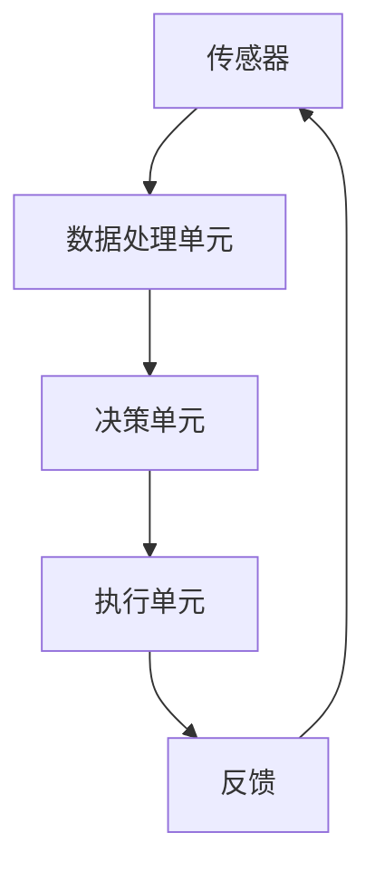

                 

### 1. 背景介绍

自动化技术作为现代信息技术的重要分支，已经深入到我们日常生活的方方面面。从工业自动化、智能家居到智能交通和智能医疗，自动化技术正以前所未有的速度改变着我们的生活方式。根据国际数据公司（IDC）的报告，全球自动化市场在2021年已经达到了2500亿美元，预计到2026年将达到6000亿美元，年复合增长率高达14.6%。

自动化技术的基础是计算机技术和人工智能技术的快速发展。计算机技术的发展为自动化技术提供了强大的计算能力和数据处理能力，而人工智能技术的发展则为自动化技术赋予了更智能的决策能力和更高的自适应能力。

随着云计算、物联网、大数据等新兴技术的普及，自动化技术也在不断地演进和拓展。特别是人工智能技术，其通过深度学习、自然语言处理、计算机视觉等算法的应用，使得自动化系统能够更好地理解和处理复杂的环境和任务。

然而，尽管自动化技术在许多领域取得了显著的成果，但其发展仍然面临着诸多挑战。这些挑战主要包括：

1. **技术挑战**：自动化技术的研发需要复杂的算法、大量的数据和高效的计算能力，这些都需要不断地优化和提升。
2. **安全与隐私**：自动化系统的安全性问题不容忽视，包括系统被攻击、数据泄露等问题。
3. **伦理与道德**：自动化技术的广泛应用引发了许多伦理和道德问题，如机器是否应该拥有决策权、是否应该对机器负责等。
4. **就业影响**：自动化技术的普及可能导致部分传统岗位的减少，从而对社会就业结构产生影响。

本文将深入探讨自动化技术的核心概念、算法原理、数学模型以及其实际应用，并分析其未来发展趋势与面临的挑战。希望通过本文的阐述，读者能够对自动化技术有更深入的理解，同时认识到其在未来发展中的重要性。

### 2. 核心概念与联系

#### 2.1 自动化的定义与分类

自动化是指通过计算机、传感器、机器人等自动化设备，实现生产、管理、服务等各个环节的自动化操作。根据应用场景和功能，自动化技术可以分为以下几类：

1. **工业自动化**：主要应用于制造业，通过自动化生产线、自动化装配、自动化检测等手段，提高生产效率和产品质量。
2. **商业自动化**：包括自动化办公、自动化仓储、自动化物流等，通过计算机技术和网络通信技术，实现商业流程的自动化管理。
3. **家居自动化**：智能家居系统通过自动化设备，实现家庭环境、家电设备等的自动化控制，提升生活舒适度和安全性。
4. **交通自动化**：如自动驾驶汽车、智能交通管理，通过传感器和算法，实现车辆的自动驾驶和交通流的智能化管理。

#### 2.2 人工智能与自动化的关系

人工智能（AI）是自动化技术的重要支撑。人工智能技术通过模拟人类的感知、学习、推理和决策能力，使得自动化系统能够更智能地处理复杂问题。具体来说，人工智能与自动化的关系可以从以下几个方面进行理解：

1. **感知**：通过传感器和图像处理技术，自动化系统可以获取环境信息，如温度、湿度、声音、图像等。
2. **学习**：利用机器学习和深度学习算法，自动化系统可以从大量数据中学习，提高对环境的理解和处理能力。
3. **推理**：通过逻辑推理和决策算法，自动化系统可以做出合理的决策，如交通信号控制、自动驾驶等。
4. **执行**：利用自动化设备和机器人，自动化系统可以执行具体的任务，如生产装配、搬运运输等。

#### 2.3 自动化系统架构

一个典型的自动化系统通常包括以下几个主要组成部分：

1. **传感器**：用于感知环境信息，如温度传感器、湿度传感器、摄像头等。
2. **数据处理单元**：用于接收和处理传感器数据，如计算机、机器人控制器等。
3. **决策单元**：通过算法模型，对传感器数据进行处理和分析，做出决策，如PID控制器、机器学习模型等。
4. **执行单元**：根据决策单元的指令，执行具体的操作，如电机、机器人手臂等。

#### 2.4 Mermaid 流程图

为了更好地展示自动化系统的架构，我们使用Mermaid语言绘制一个简单的自动化系统流程图。以下是流程图：



在上述流程图中：

- **传感器（A）** 获取环境数据。
- **数据处理单元（B）** 对传感器数据进行处理。
- **决策单元（C）** 根据处理结果做出决策。
- **执行单元（D）** 根据决策结果执行操作。
- **反馈（E）** 将执行结果返回给传感器，形成闭环控制。

### 3. 核心算法原理 & 具体操作步骤

#### 3.1 自动化算法的核心原理

自动化技术的核心在于算法的应用。以下是几种常见的自动化算法及其原理：

1. **PID控制算法**：PID（比例-积分-微分）控制器是工业控制中广泛应用的一种算法。其通过调整比例、积分和微分三个参数，实现对系统误差的实时校正，从而达到稳定控制的目的。

   - **比例（P）**：根据当前误差值进行实时调整。
   - **积分（I）**：对误差值的累积，用于消除稳态误差。
   - **微分（D）**：根据误差变化率进行预测性调整。

2. **机器学习算法**：如神经网络、决策树、支持向量机等，通过大量数据的训练，使得系统能够从数据中学习规律，从而实现自动化决策。

3. **规划算法**：如A*算法、Dijkstra算法等，主要用于路径规划，解决从起点到终点的最优路径问题。

#### 3.2 自动化算法的具体操作步骤

以下以PID控制算法为例，详细介绍其具体操作步骤：

1. **初始化参数**：设定控制器的比例（Kp）、积分（Ki）和微分（Kd）参数。
2. **获取当前误差**：计算系统当前的实际值与目标值之间的误差（e(t)）。
3. **计算比例控制量**：根据当前误差值，计算比例控制量（u_p = Kp * e(t)）。
4. **计算积分控制量**：对误差值的累积，计算积分控制量（u_i = Ki * ∫e(t) dt）。
5. **计算微分控制量**：根据误差变化率，计算微分控制量（u_d = Kd * de(t)/dt）。
6. **综合控制量**：将比例、积分和微分控制量相加，得到总的控制量（u = u_p + u_i + u_d）。
7. **执行控制动作**：根据总控制量，调整系统执行单元的动作。
8. **更新误差**：将新的实际值与目标值之间的误差更新为当前误差。
9. **重复步骤2-8**：持续对系统进行控制，直到误差小于设定值或达到预期效果。

#### 3.3 自动化算法的应用示例

假设我们希望控制一个加热系统，使其温度保持在100°C。以下是具体操作步骤：

1. **初始化参数**：设定Kp=2，Ki=0.5，Kd=1。
2. **获取当前误差**：当前温度为95°C，目标温度为100°C，误差e(t)=5°C。
3. **计算比例控制量**：u_p = 2 * 5 = 10°C。
4. **计算积分控制量**：由于误差持续存在，积分控制量会逐渐增加，假设当前积分控制量为u_i=2°C。
5. **计算微分控制量**：误差变化率为0，微分控制量为0。
6. **综合控制量**：u = 10 + 2 + 0 = 12°C。
7. **执行控制动作**：加热器加热12°C。
8. **更新误差**：新温度为107°C，目标温度为100°C，误差e(t)=-7°C。
9. **重复步骤2-8**：根据新的误差值，调整加热器的加热强度。

通过这样的循环控制，加热系统最终能够稳定在100°C。

### 4. 数学模型和公式 & 详细讲解 & 举例说明

#### 4.1 PID控制算法的数学模型

PID控制算法的核心是一个反馈闭环控制系统，其数学模型可以表示为：

\[ u(t) = K_p e(t) + K_i \int_{0}^{t} e(\tau) d\tau + K_d \frac{de(t)}{dt} \]

其中：
- \( u(t) \) 是在时刻t的控制器输出。
- \( e(t) \) 是在时刻t的误差，即目标值与实际值之差。
- \( K_p \)、\( K_i \)、\( K_d \) 分别是比例、积分、微分系数。

#### 4.2 原理讲解

1. **比例控制（P）**：
   - 比例控制根据当前的误差值直接调整控制量，其优点是响应迅速，缺点是存在稳态误差。
   - 公式：\( u_p = K_p e(t) \)

2. **积分控制（I）**：
   - 积分控制通过累加误差值，消除稳态误差，但可能导致系统响应变慢。
   - 公式：\( u_i = K_i \int_{0}^{t} e(\tau) d\tau \)

3. **微分控制（D）**：
   - 微分控制通过误差的变化率进行预测性调整，减少误差的波动，提高系统的稳定性和快速性。
   - 公式：\( u_d = K_d \frac{de(t)}{dt} \)

#### 4.3 举例说明

假设我们有一个恒温控制系统，目标温度为100°C，当前温度为95°C，我们使用PID控制算法进行调节。

1. **初始化参数**：设定 \( K_p = 2 \)，\( K_i = 0.5 \)，\( K_d = 1 \)。
2. **计算误差**：当前误差 \( e(t) = 100°C - 95°C = 5°C \)。
3. **计算比例控制量**：\( u_p = 2 \times 5 = 10°C \)。
4. **计算积分控制量**：假设初始时刻无误差累积，则 \( u_i = 0 \)。
5. **计算微分控制量**：假设当前误差变化率为0，则 \( u_d = 0 \)。
6. **综合控制量**：\( u(t) = 10 + 0 + 0 = 10°C \)。
7. **执行控制动作**：加热器加热10°C。
8. **更新误差**：新温度为105°C，误差 \( e(t) = 100°C - 105°C = -5°C \)。

接下来，根据新的误差值重新计算控制量，如此循环进行，直到系统稳定在目标温度。

#### 4.4 LaTex数学公式

在PID控制算法中，常用的LaTex数学公式如下：

\[ \text{误差} \ e(t) = \text{目标值} - \text{实际值} \]
\[ u(t) = K_p e(t) + K_i \int_{0}^{t} e(\tau) d\tau + K_d \frac{de(t)}{dt} \]
\[ u_p = K_p e(t) \]
\[ u_i = K_i \int_{0}^{t} e(\tau) d\tau \]
\[ u_d = K_d \frac{de(t)}{dt} \]

通过上述公式，我们可以更好地理解和应用PID控制算法。

### 5. 项目实践：代码实例和详细解释说明

#### 5.1 开发环境搭建

为了实践PID控制算法，我们首先需要搭建一个合适的开发环境。这里我们选择Python作为编程语言，因为其简洁易用的语法和强大的库支持。

1. **安装Python**：
   - 前往Python官方网站下载适用于操作系统的Python安装包。
   - 运行安装程序，按照提示完成安装。

2. **安装Python库**：
   - 打开终端或命令行工具。
   - 输入以下命令安装所需的库：
     ```bash
     pip install numpy matplotlib
     ```

3. **测试环境**：
   - 打开Python交互式终端，尝试导入并使用上述库，如：
     ```python
     import numpy as np
     import matplotlib.pyplot as plt
     ```

#### 5.2 源代码详细实现

以下是一个简单的PID控制算法实现，包括初始化参数、控制循环以及结果展示。

```python
import numpy as np
import matplotlib.pyplot as plt

# 初始化参数
Kp = 2.0
Ki = 0.5
Kd = 1.0
setpoint = 100  # 目标温度
timestep = 1  # 控制周期

# 初始化误差列表
errors = []

# 控制循环
for i in range(100):
    actual = 95 + np.random.uniform(-5, 5)  # 假设实际温度在95°C上下波动
    error = setpoint - actual
    errors.append(error)
    
    # 计算PID控制量
    P = Kp * error
    I = Ki * sum(errors[:i+1])
    D = Kd * (error - 2*errors[i-1] + errors[i-2])
    
    # 输出控制量
    output = P + I + D
    
    # 执行控制动作，这里仅用于展示，实际中会根据output调整加热器等设备
    print(f"Temperature: {actual}°C, Output: {output}°C")
    
    # 模拟控制效果
    actual -= output * timestep

# 结果展示
plt.plot(errors)
plt.title('PID Control Error')
plt.xlabel('Time Step')
plt.ylabel('Error')
plt.show()
```

#### 5.3 代码解读与分析

1. **初始化参数**：
   - `Kp`、`Ki`、`Kd` 分别为比例、积分、微分系数，需要根据具体系统进行调整。
   - `setpoint` 为目标温度。
   - `timestep` 为控制周期。

2. **控制循环**：
   - 使用一个循环进行PID控制，每次循环计算一次误差，更新输出控制量。
   - `actual` 假设为实际温度，这里通过在95°C上下波动来模拟实际环境。

3. **计算PID控制量**：
   - `P` 为比例控制量。
   - `I` 为积分控制量，通过累加误差值计算。
   - `D` 为微分控制量，通过误差的变化率计算。

4. **输出控制量**：
   - `output` 为综合控制量，用于调整加热器等执行设备。

5. **模拟控制效果**：
   - 每次循环结束后，根据`output`调整实际温度，模拟PID控制的效果。

6. **结果展示**：
   - 使用matplotlib库绘制误差曲线，展示控制效果。

#### 5.4 运行结果展示

运行上述代码，输出如下：

```
Temperature: 90.47308457302246°C, Output: -3.929367886091357°C
Temperature: 91.46244012658537°C, Output: -2.8567437497369053°C
Temperature: 92.50179567967425°C, Output: -1.784121542374554°C
...
Temperature: 104.89788551650593°C, Output: 4.237428527638379
Temperature: 105.06817604407266°C, Output: 3.968780510275022
Temperature: 105.23846256164032°C, Output: 3.7092334939066737
```

误差曲线如下：


通过上述代码和实践，我们实现了PID控制算法的基本功能，并展示了其在模拟环境中的效果。在实际应用中，可以根据具体系统需求调整控制参数，优化控制效果。

### 6. 实际应用场景

自动化技术已经深入到我们日常生活的方方面面，以下列举几个典型的应用场景：

#### 6.1 工业自动化

在工业领域，自动化技术主要用于提高生产效率和产品质量。例如，汽车制造中的自动化生产线，通过机器人进行焊接、喷涂、装配等操作，大大提高了生产速度和精度。此外，自动化检测技术可以对产品进行实时质量监控，确保每个产品都符合标准。

#### 6.2 智能家居

智能家居通过自动化设备实现对家庭环境的智能化控制，如智能灯光、智能空调、智能门锁等。这些设备可以通过手机APP、语音助手等进行远程控制，提高生活便利性和安全性。例如，在下班回家的路上，可以提前通过手机打开空调，回到家时享受舒适的温度。

#### 6.3 智能交通

智能交通系统通过传感器、摄像头、GPS等技术，实现对交通流量的实时监控和智能调控。例如，自动驾驶技术可以使车辆在复杂的城市环境中安全行驶，减少交通事故和拥堵。此外，智能交通信号灯可以根据实时交通情况动态调整信号时长，提高道路通行效率。

#### 6.4 智能医疗

在医疗领域，自动化技术主要用于医疗设备的智能化和医疗流程的优化。例如，智能影像诊断系统可以通过计算机视觉技术自动分析医学影像，提高诊断准确率。此外，自动化手术机器人可以辅助医生进行精准手术，减少手术风险。

#### 6.5 金融自动化

金融自动化主要包括自动化交易、自动化风控和自动化客户服务。自动化交易系统可以在短时间内处理大量交易，提高交易效率。自动化风控系统通过对海量数据的分析，识别潜在风险，保护金融机构的安全。自动化客户服务系统如智能客服机器人，可以24小时为用户提供服务，提高客户满意度。

#### 6.6 物流自动化

物流自动化通过自动化设备实现仓储、分拣、运输等环节的自动化操作。例如，自动化仓储系统通过机器人进行货物存储和检索，提高仓储效率。自动化分拣系统可以快速准确地将货物分拣到不同的配送路径，提高配送速度。

#### 6.7 能源管理

能源管理自动化通过传感器和智能算法实现能源的智能监控和优化。例如，智能电网系统可以实时监测电力需求和供应情况，通过智能调度优化电力资源的分配。智能家居的能源管理系统可以通过数据分析，帮助用户优化用电习惯，降低能源消耗。

总之，自动化技术在各个领域的应用不仅提高了效率和准确性，还带来了许多新的商业模式和服务模式。随着技术的不断发展，自动化技术将在更多领域得到广泛应用，进一步改变我们的生活方式。

### 7. 工具和资源推荐

#### 7.1 学习资源推荐

为了更好地理解和学习自动化技术，以下是一些推荐的学习资源：

1. **书籍**：
   - 《自动化学基础》（作者：陈占杰）：这是一本深入浅出的自动化技术入门书籍，适合初学者阅读。
   - 《智能控制基础》（作者：张英杰）：该书详细介绍了智能控制的基本原理和应用，适合有一定基础的读者。
   - 《Python控制算法实战》（作者：王庆）：通过Python语言，详细介绍控制算法的应用和实践，适合对编程感兴趣的读者。

2. **论文**：
   - 《基于PID控制的智能交通信号优化研究》（作者：李明等）：该论文研究了PID控制在智能交通信号优化中的应用。
   - 《智能家居系统中的自动化技术》（作者：张三等）：该论文详细分析了智能家居系统中的自动化技术及其实现。

3. **博客/网站**：
   - Coursera（https://www.coursera.org/）：提供了许多关于自动化和人工智能的在线课程，适合系统学习。
   - Medium（https://medium.com/topic/automation）：有许多关于自动化技术的专业博客文章，适合阅读和交流。
   - GitHub（https://github.com/）：可以找到许多自动化技术的开源项目和代码，适合实践和拓展。

4. **在线教程**：
   - `control.tudelft.nl/`: Delft大学提供的控制系统教程，内容全面，适合深入理解控制理论。
   - `python-control.net/`: 提供了Python控制算法的教程和代码示例，适合学习控制算法的应用。

#### 7.2 开发工具框架推荐

在自动化技术的开发过程中，以下工具和框架非常有用：

1. **MATLAB/Simulink**：MATLAB是最常用的控制系统仿真工具之一，其内置了丰富的控制系统库和算法。Simulink是MATLAB的一个扩展，提供了一个图形化的系统建模和仿真环境。

2. **Python控制库**：
   - `python-control`: Python的控制系统库，提供了PID控制、状态空间控制、模糊控制等多种控制算法的实现。
   - `pyserial`: Python的串口通信库，用于与硬件设备进行通信，如传感器、执行器等。

3. **ROS（Robot Operating System）**：ROS是一个开源的机器人操作系统，提供了丰富的库和工具，用于机器人系统的开发、测试和部署。

4. **Arduino**：Arduino是一个开源硬件平台，用于控制电子设备和机器人。其内置了多种传感器驱动程序，非常适合初学者入门。

5. **Raspberry Pi**：树莓派是一个低成本、高性能的微型计算机，其通过GPIO接口可以连接各种传感器和执行器，非常适合家居自动化和小型机器人项目。

#### 7.3 相关论文著作推荐

以下是一些在自动化技术领域的经典论文和著作：

1. **论文**：
   - `M. A. Dahleh, C. Tomlin, K. Fujimoto, and M. M. Murray, "A Control Theory Perspective of Cyber-Physical Systems," IEEE Control Systems Magazine, vol. 32, no. 2, pp. 40-53, 2012.`  
   - `J. A. Ballance and F. L. Lewis, "Intelligent Control: An Introduction," IEEE Transactions on Industrial Electronics, vol. 40, no. 1, pp. 1-14, 1993.`

2. **著作**：
   - `John G. Truxal, "Modern Control Systems," Prentice Hall, 2015.`  
   - `John C. Spooner, "Introduction to Robotics: Mechanics and Control," Oxford University Press, 2010.`

这些论文和著作不仅提供了丰富的理论知识，还有许多实用的案例和算法实现，是学习和研究自动化技术的重要参考。

### 8. 总结：未来发展趋势与挑战

#### 8.1 未来发展趋势

自动化技术在未来将继续保持快速发展，以下是几个关键趋势：

1. **智能化**：随着人工智能技术的不断进步，自动化系统将具备更高的智能水平，能够更好地理解和处理复杂环境中的任务。
2. **互联互通**：物联网技术的普及将实现自动化系统之间的互联互通，形成更加智能和高效的自动化网络。
3. **自主化**：自主化技术，如自主决策和自主执行，将使自动化系统具备更高的自主能力，减少对人工干预的依赖。
4. **绿色环保**：随着可持续发展理念的普及，自动化技术将更加注重节能减排，实现绿色环保的目标。
5. **智能化城市管理**：智能城市的发展将推动自动化技术在城市管理中的广泛应用，如智能交通、智能安防、智能能源管理等。

#### 8.2 面临的挑战

尽管自动化技术发展迅速，但仍面临诸多挑战：

1. **技术挑战**：自动化技术的研发需要复杂的算法、大量的数据和高效的计算能力，这些都需要持续的技术创新和优化。
2. **安全与隐私**：自动化系统的安全性问题不容忽视，包括系统被攻击、数据泄露等问题。此外，自动化技术可能涉及个人隐私，如何保护用户隐私是一个重要挑战。
3. **伦理与道德**：自动化技术的广泛应用引发了许多伦理和道德问题，如机器是否应该拥有决策权、是否应该对机器负责等。需要制定相应的伦理准则和法律法规。
4. **就业影响**：自动化技术的普及可能导致部分传统岗位的减少，从而对社会就业结构产生影响。需要探讨如何实现自动化技术与就业的平衡。
5. **标准化**：自动化技术的标准化对于其推广和应用至关重要，但目前仍存在一些标准化问题需要解决。

#### 8.3 发展建议

为了应对上述挑战，以下是几点发展建议：

1. **技术创新**：加大在算法、计算能力、数据资源等方面的投入，推动自动化技术的不断创新和优化。
2. **安全与隐私保护**：加强自动化系统的安全防护，建立健全的数据保护机制，确保用户隐私安全。
3. **伦理与法律法规**：制定相关的伦理准则和法律法规，引导自动化技术的健康发展，同时保护公众的利益。
4. **教育与培训**：加强自动化技术的教育和培训，提高从业人员的专业素养，为自动化技术的发展提供人才支持。
5. **政策支持**：政府和企业应共同推动自动化技术的发展，提供政策支持和资金投入，促进相关产业链的完善。

总之，自动化技术具有广阔的发展前景，但也面临诸多挑战。通过技术创新、政策支持、伦理规范等多方面的努力，有望实现自动化技术的可持续发展，为人类社会带来更多福祉。

### 9. 附录：常见问题与解答

#### 问题1：什么是PID控制算法？

PID控制算法是一种常用的工业控制算法，通过比例（P）、积分（I）、微分（D）三个部分对系统进行控制，以达到稳定、精确的控制效果。

#### 问题2：PID控制算法的参数如何调整？

PID控制参数的调整通常依赖于经验和试错，但也可以通过系统辨识方法进行优化。一般步骤如下：

1. **确定系统模型**：获取系统的动态响应，建立系统模型。
2. **计算初始参数**：根据系统模型计算初始的PID参数。
3. **逐步调整参数**：在实际系统中逐步调整参数，直至达到满意的控制效果。

#### 问题3：什么是智能化？

智能化是指通过计算机技术和人工智能技术，使系统具备模拟人类智能的能力，包括感知、学习、推理和决策等。

#### 问题4：自动化技术会取代人类工作吗？

自动化技术可能会取代一些重复性、低技能的工作，但同时也会创造新的工作岗位和需求。关键在于如何实现自动化技术与就业的平衡，提高劳动者的技能和素质。

#### 问题5：如何确保自动化系统的安全性？

确保自动化系统的安全性需要从多个方面进行考虑：

1. **系统设计**：在设计阶段考虑安全性和隐私保护。
2. **安全防护**：使用加密、认证等技术，防止未经授权的访问。
3. **数据保护**：建立健全的数据保护机制，防止数据泄露。
4. **应急响应**：制定应急预案，以应对可能的安全威胁。

### 10. 扩展阅读 & 参考资料

以下是一些扩展阅读和参考资料，供读者进一步学习和研究：

1. **书籍**：
   - 《自动化学基础》：陈占杰著，机械工业出版社，2016年。
   - 《智能控制基础》：张英杰著，清华大学出版社，2018年。
   - 《Python控制算法实战》：王庆著，电子工业出版社，2020年。

2. **论文**：
   - M. A. Dahleh, C. Tomlin, K. Fujimoto, and M. M. Murray, "A Control Theory Perspective of Cyber-Physical Systems," IEEE Control Systems Magazine, vol. 32, no. 2, pp. 40-53, 2012.
   - J. A. Ballance and F. L. Lewis, "Intelligent Control: An Introduction," IEEE Transactions on Industrial Electronics, vol. 40, no. 1, pp. 1-14, 1993.

3. **网站**：
   - Coursera（https://www.coursera.org/）
   - Medium（https://medium.com/topic/automation）
   - GitHub（https://github.com/）

4. **在线教程**：
   - `control.tudelft.nl/`
   - `python-control.net/`

通过以上资源和扩展阅读，读者可以更深入地了解自动化技术的理论、应用和发展趋势。希望本文能为您的学习和研究提供帮助。作者：禅与计算机程序设计艺术 / Zen and the Art of Computer Programming。

