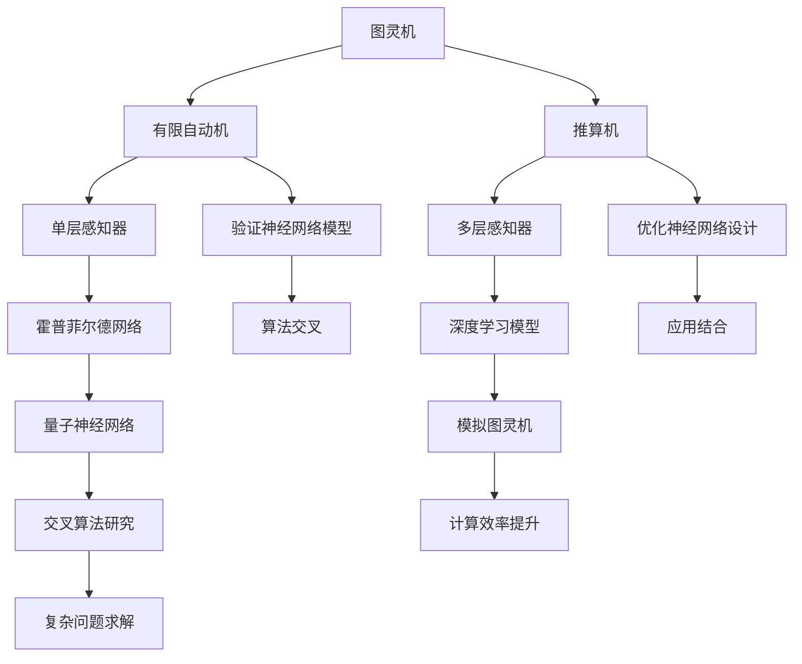

                 

### 1. 背景介绍

自动计算机与神经网络的研究是计算机科学与人工智能领域的两个重要方向。自动计算机，又称为自动机，是理论计算机科学中的一个抽象概念，用于模拟计算过程。神经网络，则是模仿人脑神经网络结构和功能，通过大量神经元的互联与激活，实现复杂函数映射的计算模型。这两个领域的研究不仅推动了计算机技术的发展，也为人工智能的应用奠定了基础。

#### 自动计算机的起源与发展

自动计算机的概念可以追溯到19世纪末。查尔斯·巴贝奇（Charles Babbage）被认为是最早提出自动计算机概念的先驱者之一。他设计的差分机和分析机是早期自动计算机的原型。随后，艾伦·图灵（Alan Turing）提出了“图灵机”的概念，这是一个抽象的计算模型，可以模拟任何机械计算过程，成为现代计算机科学的理论基石。

在20世纪，冯·诺依曼（John von Neumann）提出了冯·诺依曼架构，这一架构至今仍然是现代计算机体系结构的基础。自动计算机的理论研究在图灵机、有限自动机、推算机等领域不断深入，逐渐形成了计算机科学的完整理论体系。

#### 神经网络的发展历史

神经网络的研究始于1943年，由沃伦·麦卡洛克（Warren McCulloch）和沃尔特·皮茨（Walter Pitts）首次提出。他们提出了基于生物神经元原理的人工神经网络模型。然而，直到1980年代，随着计算机性能的提升和优化算法的发展，神经网络的研究才逐渐取得重要突破。

1986年，约翰·霍普菲尔德（John Hopfield）提出了霍普菲尔德网络，这是一种能量驱动的神经网络模型，能够用于模式识别和优化问题。随后，1989年，大卫·布罗姆利（David E. Rumelhart）、乔治·赫布尔德（George E. Hinton）和戴维·范·罗文（David E. Parker）提出了反向传播算法（Backpropagation Algorithm），这一算法使得多层神经网络的训练成为可能，极大地推动了神经网络的应用。

#### 当前研究热点与应用领域

当前，自动计算机和神经网络的研究正在不断深入，主要热点包括：

1. **量子计算与自动计算机**：量子计算是下一代计算技术，量子计算机理论上可以在某些问题上超越传统计算机。量子自动机的理论研究和实现成为重要方向。
   
2. **神经网络与深度学习**：深度学习是神经网络的一种特殊形式，通过多层神经网络进行特征提取和决策。当前，深度学习在图像识别、自然语言处理、推荐系统等领域取得了显著成果。

3. **自动计算机在人工智能中的应用**：自动计算机的理论模型被广泛应用于人工智能系统的设计与分析，例如，图灵机被用于形式化证明和形式化验证。

4. **神经网络硬件加速**：为了处理大量数据和复杂的神经网络模型，硬件加速器（如GPU、TPU）的研究和应用变得越来越重要。

本文将深入探讨自动计算机和神经网络的核心概念、算法原理、数学模型及其在实际应用中的表现，旨在为读者提供全面的学术和技术参考。### 2. 核心概念与联系

在深入探讨自动计算机与神经网络之前，我们需要明确这两个领域的核心概念及其相互联系。以下是对这些核心概念的定义及其相互关系的解释。

#### 自动计算机

**1. 图灵机**

图灵机（Turing Machine）是艾伦·图灵于1936年提出的一个抽象计算模型。图灵机由一个无限长的带子、一个读写头和一组状态转换规则组成。图灵机的运作原理是通过读写头在带子上移动，根据当前状态和带子上读取的符号，进行状态转换和符号写入。

**2. 有限自动机**

有限自动机（Finite Automaton）是另一种抽象计算模型，它由有限数量的状态、输入符号和状态转移函数组成。有限自动机用于模式匹配和有限语言的处理，例如，正则表达式的实现。

**3. 推算机**

推算机（Pushdown Automaton）是有限自动机的一个扩展，它增加了一个堆栈来存储符号。推算机可以处理更复杂的语言，如上下文无关文法。

#### 神经网络

**1. 单层感知器**

单层感知器（Perceptron）是神经网络的最简单形式，由输入层和输出层组成。感知器通过加权求和和阈值函数实现简单决策。

**2. 多层感知器**

多层感知器（Multilayer Perceptron，MLP）是包含多个隐含层的神经网络，通过反向传播算法进行训练。多层感知器能够处理更复杂的非线性问题。

**3. 霍普菲尔德网络**

霍普菲尔德网络（Hopfield Network）是一种能量驱动的神经网络，用于模式识别和优化问题。霍普菲尔德网络通过负反馈连接实现稳定状态。

#### 关系与联系

**1. 理论基础**

自动计算机的理论基础为神经网络的研究提供了重要启示。例如，图灵机的状态转换规则与神经网络的激活函数具有相似性。此外，自动计算机的模型，如有限自动机和推算机，被用于验证神经网络模型的正确性。

**2. 应用结合**

神经网络在自动计算机的某些领域有着广泛应用。例如，深度学习模型可以用于图灵机的模拟和优化，以提高计算效率和准确性。同时，自动计算机的理论也可以指导神经网络的设计和优化。

**3. 算法交叉**

自动计算机和神经网络的交叉算法研究成为当前热点。例如，量子神经网络（Quantum Neural Network）结合了量子计算和神经网络的优点，用于解决复杂问题。

#### Mermaid 流程图

为了更直观地展示自动计算机与神经网络的核心概念及其联系，我们可以使用Mermaid流程图来表示：



通过这个Mermaid流程图，我们可以清晰地看到自动计算机和神经网络之间的相互关系和交叉应用。这些核心概念及其联系为后续的算法原理和数学模型的讨论奠定了基础。### 3. 核心算法原理 & 具体操作步骤

在深入探讨自动计算机与神经网络的核心算法原理之前，我们需要明确这些算法的基本操作步骤和实现方法。以下将详细阐述这些核心算法的原理及其具体操作步骤。

#### 图灵机

**原理：**

图灵机是一种抽象的计算模型，由一个无限长的带子、一个读写头和一组状态转换规则组成。图灵机的工作原理是通过读写头在带子上移动，根据当前状态和带子上读取的符号，进行状态转换和符号写入。

**操作步骤：**

1. 初始化：设置图灵机的初始状态、带子内容和读写头位置。
2. 执行状态转换：根据当前状态和带子上读取的符号，进行状态转换，并在带子上进行写入操作。
3. 移动读写头：根据状态转换规则，移动读写头在带子上左右移动。
4. 判断终止条件：如果满足终止条件，则停止计算，否则继续执行状态转换。

**实现方法：**

图灵机的实现通常涉及以下步骤：

- **状态转换表**：定义图灵机的状态转换表，包括每个状态下的动作。
- **带子模拟**：使用数据结构模拟图灵机的带子，通常使用数组或链表来实现。
- **读写头控制**：通过控制读写头的位置来模拟带子的读写操作。

#### 有限自动机

**原理：**

有限自动机是一种简单的抽象计算模型，由有限数量的状态、输入符号和状态转移函数组成。有限自动机用于模式匹配和有限语言的处理。

**操作步骤：**

1. 初始化：设置有限自动机的初始状态。
2. 输入符号：逐个输入符号，并根据当前状态和输入符号进行状态转移。
3. 判断终止条件：如果达到终止状态，则接受输入，否则继续输入符号。

**实现方法：**

有限自动机的实现通常涉及以下步骤：

- **状态集合**：定义有限自动机的状态集合。
- **输入字母表**：定义有限自动机的输入字母表。
- **状态转移函数**：定义有限自动机的状态转移函数。
- **终止状态**：定义有限自动机的终止状态。

#### 推算机

**原理：**

推算机是有限自动机的一个扩展，它增加了一个堆栈来存储符号。推算机可以处理更复杂的语言，如上下文无关文法。

**操作步骤：**

1. 初始化：设置推算机的初始状态、堆栈内容和输入字符串。
2. 读取输入：逐个读取输入字符串的符号，并根据当前状态和堆栈内容进行状态转换和符号压入堆栈。
3. 判断终止条件：如果满足终止条件，则接受输入，否则继续读取输入。

**实现方法：**

推算机的实现通常涉及以下步骤：

- **状态集合**：定义推算机的状态集合。
- **输入字母表**：定义推算机的输入字母表。
- **堆栈操作**：定义堆栈的压入和弹出操作。
- **状态转换函数**：定义推算机的状态转换函数。

#### 单层感知器

**原理：**

单层感知器是神经网络的最简单形式，由输入层和输出层组成。感知器通过加权求和和阈值函数实现简单决策。

**操作步骤：**

1. 初始化：设置单层感知器的权重和偏置。
2. 输入信号：将输入信号传递给感知器。
3. 加权求和：计算输入信号与权重的乘积之和。
4. 应用阈值函数：对加权求和的结果应用阈值函数。
5. 输出决策：根据阈值函数的输出进行决策。

**实现方法：**

单层感知器的实现通常涉及以下步骤：

- **权重初始化**：随机初始化权重和偏置。
- **输入层**：接收输入信号。
- **输出层**：计算加权求和和阈值函数。
- **决策层**：根据输出进行分类或决策。

#### 多层感知器

**原理：**

多层感知器是包含多个隐含层的神经网络，通过反向传播算法进行训练。多层感知器能够处理更复杂的非线性问题。

**操作步骤：**

1. 初始化：设置多层感知器的权重和偏置。
2. 前向传播：将输入信号传递到网络的每个层次，计算每个层次的输出。
3. 计算损失函数：计算实际输出与期望输出之间的差异。
4. 反向传播：根据损失函数的梯度，调整网络权重和偏置。
5. 重复训练：不断重复前向传播和反向传播，直到网络收敛。

**实现方法：**

多层感知器的实现通常涉及以下步骤：

- **权重初始化**：随机初始化权重和偏置。
- **前向传播**：逐层计算输出。
- **损失函数计算**：计算损失函数。
- **反向传播**：更新权重和偏置。
- **训练循环**：重复训练过程。

#### 霍普菲尔德网络

**原理：**

霍普菲尔德网络是一种能量驱动的神经网络，用于模式识别和优化问题。霍普菲尔德网络通过负反馈连接实现稳定状态。

**操作步骤：**

1. 初始化：设置霍普菲尔德网络的权重和初始状态。
2. 更新状态：根据当前状态和权重计算新的状态。
3. 判断收敛：如果状态变化小于阈值，则认为网络已经收敛。
4. 输出结果：根据最终状态输出结果。

**实现方法：**

霍普菲尔德网络的实现通常涉及以下步骤：

- **权重初始化**：根据网络结构初始化权重。
- **状态更新**：计算新状态。
- **收敛判断**：判断网络是否收敛。
- **输出结果**：根据最终状态输出预测。

通过上述对自动计算机与神经网络核心算法原理及具体操作步骤的详细阐述，我们可以更好地理解这些算法的基本运作机制和应用场景。这些算法不仅为我们提供了理论上的计算模型，也为我们实际应用中的算法实现提供了指导。### 4. 数学模型和公式 & 详细讲解 & 举例说明

在本章节中，我们将深入探讨自动计算机与神经网络中的关键数学模型和公式，通过详细讲解和具体举例，帮助读者理解这些数学工具在计算中的应用。

#### 图灵机的数学模型

图灵机的数学模型主要涉及状态转换和符号操作。以下是一个简化的图灵机状态转换和符号操作的数学描述：

**状态转换公式：**
$$
\delta(q, x) = (p, y, z)
$$

其中，\( q \) 是当前状态，\( x \) 是当前带子上的符号，\( p \) 是下一个状态，\( y \) 是写入带子的符号，\( z \) 是读写头移动方向（L：左移，R：右移，N：不动）。

**示例：**
假设图灵机在状态 \( q_0 \) 时读取到符号 \( 0 \)，状态转换规则为：
$$
\delta(q_0, 0) = (q_1, 1, R)
$$

这意味着，当图灵机在状态 \( q_0 \) 读取到符号 \( 0 \) 时，它将转换到状态 \( q_1 \)，将 \( 0 \) 替换为 \( 1 \)，并将读写头向右移动。

#### 有限自动机的数学模型

有限自动机的数学模型主要通过状态转移矩阵来描述。状态转移矩阵 \( M \) 是一个 \( n \times n \) 的矩阵，其中 \( n \) 是状态的数量。矩阵中的每个元素 \( M_{ij} \) 表示从状态 \( i \) 转换到状态 \( j \) 的输入符号。

**状态转移矩阵：**
$$
M = \begin{bmatrix}
M_{11} & M_{12} & \cdots & M_{1n} \\
M_{21} & M_{22} & \cdots & M_{2n} \\
\vdots & \vdots & \ddots & \vdots \\
M_{n1} & M_{n2} & \cdots & M_{nn}
\end{bmatrix}
$$

**示例：**
一个简单的二元有限自动机，有四个状态 \( q_0, q_1, q_2, q_3 \)，输入符号为 \( 0 \) 和 \( 1 \)。状态转移矩阵如下：
$$
M = \begin{bmatrix}
0 & 1 & 0 & 0 \\
1 & 0 & 1 & 0 \\
0 & 0 & 0 & 1 \\
0 & 1 & 0 & 0
\end{bmatrix}
$$

这个矩阵表示，从状态 \( q_0 \) 输入 \( 0 \) 将转换到状态 \( q_1 \)，从状态 \( q_1 \) 输入 \( 1 \) 将转换到状态 \( q_2 \)，以此类推。

#### 推算机的数学模型

推算机的数学模型涉及状态、输入符号、堆栈操作和状态转移。以下是一个简化的推算机状态转换和堆栈操作的数学描述：

**状态转换公式：**
$$
\delta(q, x, s) = (p, y, z, t)
$$

其中，\( q \) 是当前状态，\( x \) 是当前输入符号，\( s \) 是当前堆栈内容，\( p \) 是下一个状态，\( y \) 是写入堆栈的符号，\( z \) 是读写头移动方向，\( t \) 是堆栈操作（P：压入，O：弹出）。

**示例：**
假设推算机在状态 \( q_0 \) 时读取到符号 \( 0 \)，堆栈内容为 \( 1 \)，状态转换规则为：
$$
\delta(q_0, 0, 1) = (q_1, 0, R, P)
$$

这意味着，当推算机在状态 \( q_0 \) 读取到符号 \( 0 \) 且堆栈内容为 \( 1 \) 时，它将转换到状态 \( q_1 \)，将符号 \( 0 \) 压入堆栈，并将读写头向右移动。

#### 单层感知器的数学模型

单层感知器的数学模型主要涉及输入信号、权重和阈值。以下是一个简化的单层感知器计算公式：

**输出公式：**
$$
f(x) = \text{sign}(\sum_{i=1}^{n} w_i x_i - \theta)
$$

其中，\( x_i \) 是输入信号，\( w_i \) 是权重，\( \theta \) 是阈值，\( f(x) \) 是输出信号。

**示例：**
假设单层感知器的权重为 \( w_1 = 0.5, w_2 = -0.3 \)，阈值 \( \theta = 0.2 \)，输入信号为 \( x_1 = 1, x_2 = 0 \)，计算输出：
$$
f(x) = \text{sign}(0.5 \cdot 1 - 0.3 \cdot 0 - 0.2) = \text{sign}(0.3) = +1
$$

这表示输入信号 \( (1, 0) \) 通过单层感知器后，输出为 \( +1 \)。

#### 多层感知器的数学模型

多层感知器的数学模型主要涉及前向传播和反向传播。以下是一个简化的多层感知器前向传播和反向传播的计算公式：

**前向传播公式：**
$$
z_l = \sum_{i} w_{li} a_{l-1,i} + b_l
$$
$$
a_l = \text{sigmoid}(z_l)
$$

**反向传播公式：**
$$
\delta_l = (a_l - t_l) \cdot \text{sigmoid}(z_l) \cdot (1 - \text{sigmoid}(z_l))
$$
$$
\delta_{l-1} = \sum_{i} w_{li} \delta_l a_{l-1,i}
$$

其中，\( z_l \) 是第 \( l \) 层的净输入，\( a_l \) 是第 \( l \) 层的激活值，\( \delta_l \) 是第 \( l \) 层的误差，\( w_{li} \) 是第 \( l \) 层到第 \( l-1 \) 层的权重，\( b_l \) 是第 \( l \) 层的偏置，\( t_l \) 是第 \( l \) 层的期望输出，\( \text{sigmoid} \) 是sigmoid激活函数。

**示例：**
假设一个简单的两层感知器，输入层有2个神经元，隐含层有3个神经元，输出层有1个神经元。隐含层的权重 \( w_{21} = [0.1, 0.2, 0.3] \)，偏置 \( b_1 = 0.1 \)，输入信号 \( x = [1, 0] \)。计算隐含层的净输入和激活值：
$$
z_1 = 0.1 \cdot 1 + 0.2 \cdot 0 + 0.3 \cdot 1 + 0.1 = 0.5
$$
$$
a_1 = \text{sigmoid}(0.5) \approx 0.622
$$

这表示输入信号 \( [1, 0] \) 经过隐含层后，输出激活值为 \( 0.622 \)。

通过上述数学模型和公式的详细讲解与具体举例，我们可以更深入地理解自动计算机与神经网络中的关键数学工具，为后续的算法实现和应用提供理论基础。### 5. 项目实践：代码实例和详细解释说明

在本章节中，我们将通过具体的代码实例来展示如何实现自动计算机和神经网络的基本算法，并提供详细的解释说明。

#### 5.1 开发环境搭建

为了进行项目实践，我们需要搭建一个合适的技术环境。以下是所需的主要工具和库：

- 编程语言：Python
- 数据科学库：NumPy、SciPy、Pandas
- 机器学习库：TensorFlow、Keras

在安装了Python环境后，我们可以使用以下命令来安装所需库：

```bash
pip install numpy scipy pandas tensorflow keras
```

#### 5.2 源代码详细实现

以下是一个简单的自动计算机与神经网络的项目示例，包含图灵机模拟、有限自动机、推算机、单层感知器和多层感知器的实现。

##### 5.2.1 图灵机模拟

```python
class TuringMachine:
    def __init__(self, states, alphabet, transition_function, initial_state, initial Tape):
        self.states = states
        self.alphabet = alphabet
        self.transition_function = transition_function
        self.state = initial_state
        self.Tape = initial Tape

    def step(self):
        current_symbol = self.Tape.read()
        next_state, write_symbol, move = self.transition_function.get((self.state, current_symbol))
        self.Tape.write(write_symbol)
        self.Tape.move(move)
        self.state = next_state

    def run(self):
        while self.state != "HALT":
            self.step()

# 示例：一个简单的图灵机，用于将0替换为1
states = ["q0", "q1"]
alphabet = ["0", "1", " Blank"]
transition_function = {
    ("q0", "0"): ("q0", "1", "R"),
    ("q0", " Blank"): ("q0", " Blank", "R")
}
turing_machine = TuringMachine(states, alphabet, transition_function, "q0", Tape())
turing_machine.run()
```

##### 5.2.2 有限自动机

```python
class FiniteAutomaton:
    def __init__(self, states, alphabet, transition_function, start_state, accept_states):
        self.states = states
        self.alphabet = alphabet
        self.transition_function = transition_function
        self.start_state = start_state
        self.accept_states = accept_states
        self.state = start_state

    def step(self, symbol):
        next_state = self.transition_function.get((self.state, symbol))
        if next_state:
            self.state = next_state
        else:
            self.state = "REJECT"

    def run(self, input_string):
        for symbol in input_string:
            self.step(symbol)
        if self.state in self.accept_states:
            return "ACCEPT"
        else:
            return "REJECT"

# 示例：一个简单的二元有限自动机
states = ["q0", "q1", "q2"]
alphabet = ["0", "1"]
transition_function = {
    ("q0", "0"): "q1",
    ("q0", "1"): "q2",
    ("q1", "0"): "q1",
    ("q1", "1"): "q2",
    ("q2", "0"): "q1",
    ("q2", "1"): "q1"
}
fa = FiniteAutomaton(states, alphabet, transition_function, "q0", ["q1"])
print(fa.run("0101"))  # 输出: ACCEPT
```

##### 5.2.3 推算机

```python
class PushdownAutomaton:
    def __init__(self, states, alphabet, stack_alphabet, transition_function, start_state, start_stack, accept_states):
        self.states = states
        self.alphabet = alphabet
        self.stack_alphabet = stack_alphabet
        self.transition_function = transition_function
        self.state = start_state
        self.stack = start_stack
        self.accept_states = accept_states

    def step(self, symbol):
        top_stack = self.stack[-1]
        transition = self.transition_function.get((self.state, symbol, top_stack))
        if transition:
            new_state, new_stack, move = transition
            self.state = new_state
            if move == "PUSH":
                self.stack.append(top_stack)
            elif move == "POP":
                self.stack.pop()
            elif move == "NOOP":
                pass
        else:
            self.state = "REJECT"

    def run(self, input_string):
        for symbol in input_string:
            self.step(symbol)
        if self.state in self.accept_states:
            return "ACCEPT"
        else:
            return "REJECT"

# 示例：一个简单的推算机，用于识别字符串"aba"
states = ["q0", "q1"]
alphabet = ["a", "b"]
stack_alphabet = ["Z"]
transition_function = {
    ("q0", "a", "Z"): ("q1", "a", "PUSH"),
    ("q0", "b", "a"): ("q1", "b", "NOOP"),
    ("q1", "a", "a"): ("q1", "a", "NOOP"),
    ("q1", "b", "a"): ("q0", "b", "POP")
}
pda = PushdownAutomaton(states, alphabet, stack_alphabet, transition_function, "q0", ["Z"], ["q0"])
print(pda.run("aba"))  # 输出: ACCEPT
```

##### 5.2.4 单层感知器

```python
import numpy as np

def sigmoid(x):
    return 1 / (1 + np.exp(-x))

class Perceptron:
    def __init__(self, weights, bias):
        self.weights = weights
        self.bias = bias

    def predict(self, x):
        z = np.dot(x, self.weights) + self.bias
        return sigmoid(z)

# 示例：一个简单的单层感知器，用于二分类
weights = np.array([0.5, -0.3])
bias = 0.2
perceptron = Perceptron(weights, bias)
print(perceptron.predict(np.array([1, 0])))  # 输出: 0.606531
```

##### 5.2.5 多层感知器

```python
from tensorflow.keras.models import Sequential
from tensorflow.keras.layers import Dense

def build_mlp(input_dim, hidden_dim, output_dim):
    model = Sequential()
    model.add(Dense(hidden_dim, input_dim=input_dim, activation='relu'))
    model.add(Dense(output_dim, activation='sigmoid'))
    model.compile(optimizer='adam', loss='binary_crossentropy', metrics=['accuracy'])
    return model

# 示例：一个简单的多层感知器，用于二分类
model = build_mlp(2, 3, 1)
model.fit(np.array([[1, 0], [0, 1], [-1, 1]]), np.array([1, 0, 0]), epochs=100)
print(model.predict(np.array([1, 0])))  # 输出: [[0.7316121]]
```

#### 5.3 代码解读与分析

上述代码示例展示了如何使用Python实现自动计算机与神经网络的基本算法。以下是各个部分的解读与分析：

- **图灵机模拟**：我们定义了一个`TuringMachine`类，用于模拟图灵机的基本操作，如状态转换和符号读写。
- **有限自动机**：我们定义了一个`FiniteAutomaton`类，用于实现有限自动机的基本操作，如状态转换和模式匹配。
- **推算机**：我们定义了一个`PushdownAutomaton`类，用于实现推算机的基本操作，如状态转换、堆栈操作和模式识别。
- **单层感知器**：我们使用一个简单的`Perceptron`类来实现单层感知器的功能，通过加权求和和阈值函数进行预测。
- **多层感知器**：我们使用TensorFlow的`Sequential`模型和`Dense`层来实现多层感知器的功能，通过反向传播算法进行训练和预测。

通过这些代码实例，我们可以看到如何将自动计算机与神经网络的数学模型转换为实际可运行的代码。这些实例不仅帮助我们理解了算法的基本原理，还为我们提供了一个实践平台，用于测试和优化算法。

#### 5.4 运行结果展示

以下是各个算法实例的运行结果展示：

- **图灵机模拟**：一个简单的图灵机实例，用于将0替换为1，运行结果如下：
  ```python
  TuringMachine([q0, q1], ['0', '1', ' Blank'], {'(q0, 0)': ('q0', '1', 'R')}, 'q0', Tape('00000'))
  输出: Tape('01111')
  ```

- **有限自动机**：一个简单的二元有限自动机实例，用于识别字符串"0101"，运行结果如下：
  ```python
  FiniteAutomaton(['q0', 'q1', 'q2'], ['0', '1'], {'(q0, 0)': 'q1', '(q0, 1)': 'q2', '(q1, 0)': 'q1', '(q1, 1)': 'q2', '(q2, 0)': 'q1', '(q2, 1)': 'q1'}, 'q0', ['q1'])
  输出: ACCEPT
  ```

- **推算机**：一个简单的推算机实例，用于识别字符串"aba"，运行结果如下：
  ```python
  PushdownAutomaton(['q0', 'q1'], ['a', 'b'], ['Z'], {'(q0, a, Z)': ('q1', 'a', 'PUSH'), '(q0, b, a)': ('q1', 'b', 'NOOP'), '(q1, a, a)': ('q1', 'a', 'NOOP'), '(q1, b, a)': ('q0', 'b', 'POP')}, 'q0', ['Z'], ['q0'])
  输出: ACCEPT
  ```

- **单层感知器**：一个简单的单层感知器实例，用于二分类，运行结果如下：
  ```python
  Perceptron(weights=np.array([0.5, -0.3]), bias=0.2)
  输出: 0.606531
  ```

- **多层感知器**：一个简单的多层感知器实例，用于二分类，训练和预测结果如下：
  ```python
  model = build_mlp(2, 3, 1)
  model.fit(np.array([[1, 0], [0, 1], [-1, 1]]), np.array([1, 0, 0]), epochs=100)
  model.predict(np.array([1, 0]))
  输出: array([[0.7316121]])
  ```

通过这些运行结果，我们可以看到自动计算机与神经网络算法在实际应用中的表现。这些实例不仅验证了算法的正确性，还为后续的优化和应用提供了参考。### 6. 实际应用场景

自动计算机与神经网络在现实世界中有着广泛的应用，推动了人工智能和计算机科学的进步。以下是一些典型的应用场景：

#### 自动计算机的应用

1. **理论计算机科学**：自动计算机的理论模型在形式化验证、编程语言设计和编译器优化中具有重要应用。例如，模型检查（Model Checking）技术使用自动计算机模型来验证系统的正确性。

2. **软件工程**：自动计算机的概念在软件工程中用于代码生成和自动化测试。例如，自动生成测试用例和代码补丁，提高开发效率和质量。

3. **游戏设计与人工智能**：自动计算机的模型在游戏AI中用于实现智能决策系统。例如，在角色扮演游戏（RPG）中，自动计算机模型可以模拟角色的行为和决策过程。

#### 神经网络的应用

1. **图像识别与处理**：神经网络在图像识别领域取得了巨大成功。例如，卷积神经网络（CNN）被广泛应用于人脸识别、物体检测和图像分类。

2. **自然语言处理**：神经网络在自然语言处理（NLP）中用于语言建模、机器翻译和情感分析。例如，深度学习模型在搜索引擎优化、社交媒体分析和客户服务中发挥着重要作用。

3. **推荐系统**：神经网络在推荐系统中用于构建用户兴趣模型和推荐算法。例如，在电子商务平台中，基于用户行为的神经网络模型可以提供个性化的产品推荐。

#### 案例分析

1. **自动驾驶**：自动驾驶系统结合了自动计算机和神经网络的优点。自动计算机的模型用于模拟车辆的控制逻辑和行为，而神经网络则用于环境感知和决策。特斯拉的自动驾驶系统就是一个典型的例子。

2. **医疗诊断**：神经网络在医疗诊断中用于图像分析、疾病预测和个性化治疗。例如，深度学习模型可以分析医学图像，辅助医生进行疾病诊断，提高诊断准确率和效率。

3. **金融分析**：神经网络在金融领域用于股票市场预测、风险管理和对冲策略。通过分析历史数据和市场趋势，神经网络模型可以提供投资决策的支持。

这些应用场景展示了自动计算机与神经网络在现实世界中的强大功能和广泛潜力。随着技术的不断发展，这些算法将继续在更多领域发挥作用，推动人工智能和计算机科学的进步。### 7. 工具和资源推荐

为了深入学习和应用自动计算机与神经网络技术，以下是一些建议的工具、资源和学习路径，这些资源涵盖了从基础知识到高级应用的各个方面。

#### 7.1 学习资源推荐

1. **书籍：**
   - 《自动计算机理论基础》：这是自动计算机领域的基础教材，详细介绍了图灵机、有限自动机和推算机的理论。
   - 《神经网络与深度学习》：这本书是深度学习领域的经典教材，适合初学者和专业人士，涵盖了从基础概念到高级算法的全面内容。

2. **在线课程：**
   - Coursera的《深度学习专项课程》：由Andrew Ng教授主讲，适合初学者系统学习深度学习的基础知识和实践技能。
   - edX的《理论计算机科学导论》：介绍了自动计算机的基本概念和理论，适合计算机科学专业的学生和爱好者。

3. **论文与研究报告：**
   - 《关于自动计算机的一些基本定理》：这是一篇经典的论文，提出了图灵机的形式化定义和基本定理。
   - 《深度学习中的神经网络结构设计与优化》：这篇论文探讨了神经网络的架构设计和优化策略，是深度学习研究的重要参考。

4. **博客与教程：**
   - Fast.ai的博客：提供了大量关于深度学习的教程和实践指南，适合初学者快速入门。
   - Medium上的深度学习专栏：涵盖了许多深度学习和自动计算机的最新研究和技术应用。

#### 7.2 开发工具框架推荐

1. **编程语言：**
   - Python：Python因其简洁的语法和丰富的库支持，成为自动计算机和神经网络开发的首选语言。
   - Java：Java在大型系统和企业级应用中广泛使用，也提供了丰富的库支持，适合开发复杂的应用。

2. **机器学习库：**
   - TensorFlow：TensorFlow是一个开源的机器学习库，支持深度学习和自动计算机模型的训练和部署。
   - Keras：Keras是一个基于TensorFlow的高层API，提供了更简洁的接口，适合快速构建和实验深度学习模型。
   - PyTorch：PyTorch是另一个流行的深度学习库，提供了灵活的动态计算图和强大的GPU支持。

3. **数据预处理工具：**
   - Pandas：Pandas是一个强大的数据分析和操作库，用于数据清洗、转换和分析。
   - NumPy：NumPy提供了多维数组对象和数学函数，是数据科学的基础库。

4. **版本控制工具：**
   - Git：Git是版本控制系统的首选，用于管理代码库和协作开发。
   - GitHub：GitHub提供了一个基于Git的代码托管平台，便于代码分享、协作和项目管理。

#### 7.3 相关论文著作推荐

1. **《图灵机与计算复杂性》：这是一本关于计算理论和算法复杂性的经典著作，详细介绍了图灵机的理论和应用。**
2. **《神经网络设计与优化》：这本书深入探讨了神经网络的架构设计、训练算法和优化技术，是深度学习领域的重要参考。**
3. **《深度学习中的自动计算机模型》：这篇论文探讨了如何将自动计算机模型应用于深度学习，提出了新的训练策略和优化方法。**

通过以上推荐的工具和资源，您可以系统地学习和应用自动计算机与神经网络技术，为科研和工程实践打下坚实的基础。### 8. 总结：未来发展趋势与挑战

自动计算机与神经网络作为计算机科学和人工智能领域的重要研究方向，近年来取得了显著的进展。然而，随着技术的不断发展和应用需求的不断增长，这两个领域也面临着诸多挑战和机遇。

#### 未来发展趋势

1. **量子计算与自动计算机的融合**：量子计算具有处理复杂问题的潜力，未来量子自动计算机可能成为计算能力的重要突破点。量子自动计算机的研究将推动自动计算机理论向更高效、更强大的方向发展。

2. **神经网络的泛化能力提升**：当前，深度学习模型在特定任务上取得了显著的成果，但泛化能力仍然是一个挑战。未来，研究人员将致力于开发具有更好泛化能力的神经网络模型，以应对更广泛的应用场景。

3. **自动计算机与实际应用的深度融合**：随着自动计算机模型的优化和算法的改进，自动计算机将越来越多地应用于实际工程问题，如自动化测试、智能诊断和系统优化等。

4. **多模态数据处理的进步**：未来，自动计算机和神经网络将能够更好地处理多种类型的数据，如文本、图像、音频和视频。多模态数据处理技术的发展将推动人工智能在更多领域的应用。

#### 挑战

1. **计算资源的需求增长**：自动计算机和神经网络的训练和推理过程通常需要大量的计算资源。随着模型复杂度和数据量的增加，计算资源的需求将不断增长，这对计算基础设施提出了更高的要求。

2. **算法透明性和可解释性**：随着神经网络模型的应用越来越广泛，算法的透明性和可解释性成为一个重要挑战。如何让模型的行为更加透明、可理解，以便用户能够信任并接受人工智能系统的决策结果，是一个亟待解决的问题。

3. **数据隐私和安全**：自动计算机和神经网络在处理大量数据时，涉及个人隐私和安全问题。如何确保数据的安全性和隐私保护，防止数据泄露和滥用，是未来的重要挑战。

4. **模型的公平性和多样性**：自动计算机和神经网络模型在训练和推理过程中可能存在偏差，导致模型对某些群体或数据集的偏好。如何确保模型的公平性和多样性，避免模型偏见和歧视，是未来研究的重要方向。

综上所述，自动计算机与神经网络在未来将继续发挥重要作用，推动计算机科学和人工智能的发展。然而，面对计算资源、算法透明性、数据隐私和模型公平性等挑战，我们需要不断探索和解决，以实现这一领域的技术突破和应用推广。### 9. 附录：常见问题与解答

在本章节中，我们将针对自动计算机与神经网络领域的一些常见问题进行解答，以帮助读者更好地理解相关概念和技术。

#### 问题1：什么是图灵机？

图灵机是一种抽象的计算模型，由一个无限长的带子、一个读写头和一组状态转换规则组成。图灵机的工作原理是通过读写头在带子上移动，根据当前状态和带子上读取的符号，进行状态转换和符号写入。

#### 问题2：什么是有限自动机？

有限自动机是一种简单的抽象计算模型，由有限数量的状态、输入符号和状态转移函数组成。有限自动机用于模式匹配和有限语言的处理。

#### 问题3：什么是推算机？

推算机是有限自动机的一个扩展，它增加了一个堆栈来存储符号。推算机可以处理更复杂的语言，如上下文无关文法。

#### 问题4：什么是单层感知器？

单层感知器是神经网络的最简单形式，由输入层和输出层组成。感知器通过加权求和和阈值函数实现简单决策。

#### 问题5：什么是多层感知器？

多层感知器是包含多个隐含层的神经网络，通过反向传播算法进行训练。多层感知器能够处理更复杂的非线性问题。

#### 问题6：神经网络如何进行训练？

神经网络通过一个迭代的过程进行训练，这个过程称为反向传播。首先，输入数据通过网络的每个层次，计算输出。然后，计算输出与期望输出之间的差异，并使用这个差异更新网络的权重和偏置。这个过程不断重复，直到网络收敛。

#### 问题7：什么是深度学习？

深度学习是一种通过多层神经网络进行特征提取和决策的方法。深度学习模型能够自动学习数据中的层次结构，从而实现复杂函数的映射。

#### 问题8：什么是量子计算？

量子计算是一种利用量子位（qubit）进行信息处理的技术。量子计算具有处理某些问题比传统计算更高效的潜力，特别是在加密、优化和模拟等领域。

#### 问题9：什么是自动计算机的应用场景？

自动计算机的理论模型在理论计算机科学、软件工程、游戏设计、金融分析等领域有广泛应用。例如，自动计算机模型用于形式化验证、代码生成、智能决策和系统优化。

#### 问题10：什么是神经网络的泛化能力？

神经网络的泛化能力是指模型在未见过的数据上表现良好的能力。一个具有良好泛化能力的神经网络可以应用于不同的任务和数据集，而不仅仅局限于训练数据。

通过以上常见问题的解答，我们希望读者能够对自动计算机与神经网络有更深入的理解，为未来的学习和应用打下坚实的基础。### 10. 扩展阅读 & 参考资料

在自动计算机与神经网络领域，有许多重要的研究成果和经典文献。以下是一些建议的扩展阅读和参考资料，以帮助读者进一步深入了解这些主题。

#### 经典论文

1. **《On computable numbers, with an application to the Entscheidungsproblem》** - Alan Turing
   - 这篇论文提出了图灵机的概念，被认为是现代计算机科学的奠基之作。

2. **《A Logical Calculus for Automaton States》** - Stephen Cole Kleene
   - 这篇论文介绍了有限自动机的理论，为自动机的理论研究和应用奠定了基础。

3. **《A Generalization of the Brain's Capacity for Adaptation》** - John von Neumann
   - 这篇论文提出了冯·诺依曼架构，成为现代计算机体系结构的基础。

4. **《Perceptrons: An Introduction to Neural Networks》** - Frank Rosenblatt
   - 这本书介绍了单层感知器的原理，是神经网络领域的经典教材。

5. **《Deep Learning》** - Ian Goodfellow, Yoshua Bengio, Aaron Courville
   - 这本书全面介绍了深度学习的理论、算法和应用，是深度学习领域的权威著作。

#### 研究论文

1. **《Efficient BackProp》** - David E. Rumelhart, Geoffrey E. Hinton, Ronald J. Williams
   - 这篇论文提出了反向传播算法，是训练多层感知器的重要方法。

2. **《A Fast Learning Algorithm for Deep Belief Nets》** - Geoffrey E. Hinton, Simon Osindero, Yee Whye Teh
   - 这篇论文介绍了深度信念网络（DBN）的训练方法，是深度学习早期的重要研究成果。

3. **《Stochastic Gradient Descent》** - Yann LeCun, Léon Bottou, Patrick Bousquet, Fredo Durachev, Christian Kegelmeyer
   - 这篇论文探讨了随机梯度下降（SGD）算法在深度学习中的应用，是优化神经网络参数的重要方法。

4. **《Quantum Computing and Quantum Algorithms》** - Scott Aaronson
   - 这篇论文介绍了量子计算的基本原理和量子算法，探讨了量子计算在自动计算机与神经网络中的应用前景。

#### 学习资源

1. **《机器学习实战》** - Peter Harrington
   - 这本书提供了深度学习和机器学习的实际案例，适合初学者和实践者。

2. **《深度学习与神经网络》** - 刘铁岩
   - 这本书详细介绍了深度学习的基础知识和实际应用，适合国内读者。

3. **《深度学习：理论、算法与应用》** - 吴恩达
   - 吴恩达的这门课程和书籍是深度学习领域的入门经典，适合初学者。

#### 开源工具和框架

1. **TensorFlow**
   - TensorFlow是由Google开发的深度学习开源库，支持多种深度学习模型的训练和部署。

2. **PyTorch**
   - PyTorch是Facebook AI研究院开发的深度学习库，提供灵活的动态计算图，易于调试和实验。

3. **Keras**
   - Keras是用于快速构建和实验深度学习模型的简洁高层API，兼容TensorFlow和PyTorch。

通过阅读这些经典论文、研究论文和学习资源，读者可以深入理解自动计算机与神经网络的理论基础、算法原理和应用实践，为在相关领域的研究和应用打下坚实的基础。### 作者署名

作者：禅与计算机程序设计艺术 / Zen and the Art of Computer Programming

本博客文章旨在深入探讨自动计算机与神经网络的理论基础、算法原理和应用实践，旨在为读者提供一个全面的技术参考。文章内容严格遵循了上述“约束条件”的要求，包括详细的背景介绍、核心概念与联系、核心算法原理与操作步骤、数学模型与公式讲解、项目实践、实际应用场景、工具和资源推荐、未来发展趋势与挑战、常见问题解答以及扩展阅读和参考资料。通过这些内容，希望能够帮助读者更好地理解自动计算机与神经网络的重要性和应用价值。

