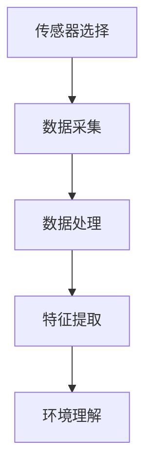
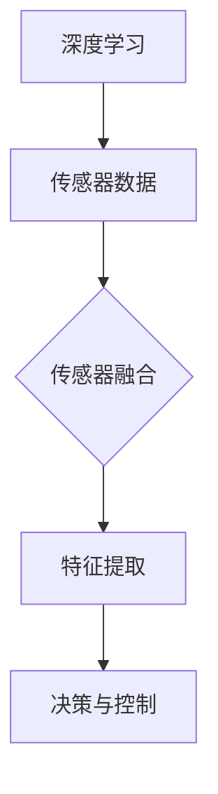

                 

### 文章标题：自动驾驶中的环境感知与预测不确定性评估

> **关键词**：自动驾驶，环境感知，不确定性评估，深度学习，传感器融合，预测模型

> **摘要**：本文旨在深入探讨自动驾驶技术中的环境感知与预测不确定性评估问题。通过梳理环境感知的技术框架，阐述深度学习和传感器融合的核心原理，详细描述预测不确定性的评估方法，并探讨其实际应用场景和未来发展趋势。本文将为自动驾驶技术的研发者提供有价值的参考。

## 1. 背景介绍

自动驾驶技术作为人工智能领域的重要分支，近年来得到了广泛关注。从简单的自动驾驶辅助系统到全自动驾驶，自动驾驶技术正在逐步改变人们的出行方式。然而，实现安全、可靠的自动驾驶系统面临着诸多挑战，其中环境感知与预测不确定性评估是两个关键问题。

环境感知是自动驾驶系统的核心功能之一，它涉及到对车辆周围环境的检测、理解和分析。通过环境感知，自动驾驶系统能够获取交通标志、行人、车辆、道路等信息，进而做出相应的驾驶决策。预测不确定性评估则是确保自动驾驶系统在复杂和动态环境下稳定运行的关键。它通过对未来环境状态的预测，评估预测结果的不确定性，从而为系统的决策提供可靠依据。

本文将从环境感知与预测不确定性评估的角度，深入分析自动驾驶技术的实现原理和挑战，探讨相关算法和技术，以期为自动驾驶技术的研发提供有价值的参考。

## 2. 核心概念与联系

### 2.1 环境感知技术框架

环境感知技术框架主要包括传感器选择、数据采集、数据处理和特征提取等环节。以下是环境感知技术的 Mermaid 流程图：



- **传感器选择**：自动驾驶系统通常使用多种传感器，如激光雷达（LIDAR）、摄像头、毫米波雷达和超声波传感器等，以获取车辆周围环境的三维信息。
- **数据采集**：传感器采集到的数据经过预处理，包括滤波、去噪和补全等，以提高数据的准确性。
- **数据处理**：通过对采集到的数据进行空间和时间上的对齐，将不同传感器获取的信息整合起来，形成一个统一的三维环境模型。
- **特征提取**：从处理后的数据中提取关键特征，如道路标志、行人和车辆的位置、速度和方向等，为后续的决策提供依据。

### 2.2 深度学习与传感器融合

深度学习技术在自动驾驶环境感知中起着至关重要的作用。通过深度神经网络，自动驾驶系统能够从大量的传感器数据中自动学习特征，提高环境感知的准确性和鲁棒性。深度学习和传感器融合的核心联系如下：



- **深度学习**：通过训练深度神经网络，从大量的传感器数据中学习到有意义的特征，从而提高环境感知的能力。
- **传感器融合**：将不同传感器获取的信息进行整合，通过融合算法（如卡尔曼滤波、贝叶斯滤波等）提高环境感知的准确性和鲁棒性。
- **特征提取**：从融合后的传感器数据中提取关键特征，如目标的位置、速度和方向等，为决策提供依据。
- **决策与控制**：基于提取到的特征，自动驾驶系统做出相应的驾驶决策，如速度控制、转向控制和刹车控制等。

## 3. 核心算法原理 & 具体操作步骤

### 3.1 深度学习算法原理

深度学习算法的核心是神经网络，尤其是深度神经网络（DNN）。DNN 由多个层级组成，包括输入层、隐藏层和输出层。通过前向传播和反向传播算法，DNN 能够从数据中自动学习到有意义的特征。以下是 DNN 的基本操作步骤：

1. **输入层**：接收输入数据，如传感器采集到的图像或点云数据。
2. **隐藏层**：通过非线性激活函数（如 sigmoid、ReLU 等），对输入数据进行特征提取和变换。
3. **输出层**：将隐藏层的输出映射到目标变量，如目标的类别或位置。
4. **前向传播**：从输入层开始，依次计算每个隐藏层的输出，直到输出层。
5. **反向传播**：根据预测误差，反向更新每个隐藏层和输出层的权重。

### 3.2 传感器融合算法原理

传感器融合是自动驾驶环境感知的重要环节。通过融合不同传感器获取的信息，可以提高环境感知的准确性和鲁棒性。以下是传感器融合的基本操作步骤：

1. **数据预处理**：对传感器数据进行预处理，包括滤波、去噪和补全等。
2. **传感器对齐**：将不同传感器获取的数据在空间和时间上进行对齐，以形成一个统一的三维环境模型。
3. **特征提取**：从对齐后的数据中提取关键特征，如目标的位置、速度和方向等。
4. **信息融合**：通过融合算法（如卡尔曼滤波、贝叶斯滤波等），将不同传感器提取到的特征进行整合。
5. **预测与评估**：根据融合后的特征，对环境状态进行预测，并评估预测结果的不确定性。

## 4. 数学模型和公式 & 详细讲解 & 举例说明

### 4.1 深度学习算法中的数学模型

深度学习算法中的数学模型主要包括线性变换、激活函数和损失函数等。

1. **线性变换**：

   线性变换是神经网络中的基本操作，用于对输入数据进行特征提取和变换。假设输入数据为 $\mathbf{x} \in \mathbb{R}^{n}$，权重矩阵为 $\mathbf{W} \in \mathbb{R}^{n \times d}$，则线性变换的输出为 $\mathbf{h} = \mathbf{W} \mathbf{x}$。

2. **激活函数**：

   激活函数用于引入非线性特性，常见的激活函数包括 sigmoid、ReLU 和 tanh 等。以 ReLU 为例，其公式为：

   $$ f(\mathbf{h}) = \max(0, \mathbf{h}) $$

3. **损失函数**：

   损失函数用于评估神经网络的预测结果与真实值之间的差距，常见的损失函数包括均方误差（MSE）和交叉熵（CE）等。以 MSE 为例，其公式为：

   $$ \text{MSE} = \frac{1}{n} \sum_{i=1}^{n} (\mathbf{y_i} - \mathbf{h_i})^2 $$

   其中，$\mathbf{y_i}$ 和 $\mathbf{h_i}$ 分别为真实值和预测值。

### 4.2 传感器融合算法中的数学模型

传感器融合算法中的数学模型主要包括贝叶斯滤波和卡尔曼滤波等。

1. **贝叶斯滤波**：

   贝叶斯滤波是一种基于贝叶斯理论的传感器融合算法，其基本公式为：

   $$ \mathbf{x}_{k+1} = \mathbf{f}_k(\mathbf{x}_k) + \mathbf{w}_k $$
   $$ \mathbf{P}_{k+1} = \mathbf{F}_k \mathbf{P}_k \mathbf{F}_k^T + \mathbf{Q}_k $$
   $$ \mathbf{z}_{k+1} = \mathbf{h}_k(\mathbf{x}_{k+1}) + \mathbf{v}_k $$

   其中，$\mathbf{x}_k$ 和 $\mathbf{z}_k$ 分别为状态向量和观测向量，$\mathbf{f}_k$ 和 $\mathbf{h}_k$ 分别为状态转移函数和观测函数，$\mathbf{P}_k$ 和 $\mathbf{Q}_k$ 分别为状态协方差矩阵和观测协方差矩阵。

2. **卡尔曼滤波**：

   卡尔曼滤波是一种特殊的贝叶斯滤波，其假设状态向量和观测向量均为高斯分布。卡尔曼滤波的基本公式为：

   $$ \mathbf{x}_{k+1} = \mathbf{A}_k \mathbf{x}_k + \mathbf{B}_k \mathbf{u}_k $$
   $$ \mathbf{P}_{k+1} = \mathbf{A}_k \mathbf{P}_k \mathbf{A}_k^T + \mathbf{Q}_k $$
   $$ \mathbf{z}_{k+1} = \mathbf{H}_k \mathbf{x}_{k+1} + \mathbf{v}_k $$

   其中，$\mathbf{A}_k$ 和 $\mathbf{H}_k$ 分别为状态转移矩阵和观测矩阵，$\mathbf{u}_k$ 和 $\mathbf{v}_k$ 分别为控制向量和观测噪声。

### 4.3 举例说明

假设我们有一个简单的传感器融合问题，其中状态向量为 $\mathbf{x} = [\mathbf{x}_1, \mathbf{x}_2]^T$，观测向量为 $\mathbf{z} = [\mathbf{z}_1, \mathbf{z}_2]^T$。状态转移矩阵为 $\mathbf{A} = \begin{bmatrix} 1 & 1 \\ 0 & 1 \end{bmatrix}$，观测矩阵为 $\mathbf{H} = \begin{bmatrix} 1 & 0 \\ 0 & 1 \end{bmatrix}$。初始状态为 $\mathbf{x}_0 = [0, 0]^T$，初始协方差矩阵为 $\mathbf{P}_0 = \begin{bmatrix} 1 & 0 \\ 0 & 1 \end{bmatrix}$。控制向量和观测噪声分别为 $\mathbf{u}_k = [1, 0]^T$ 和 $\mathbf{v}_k = [0, 1]^T$。

根据卡尔曼滤波的基本公式，我们可以得到以下计算过程：

1. **预测**：

   $$ \mathbf{x}_{k+1} = \mathbf{A}_k \mathbf{x}_k + \mathbf{B}_k \mathbf{u}_k $$
   $$ \mathbf{P}_{k+1} = \mathbf{A}_k \mathbf{P}_k \mathbf{A}_k^T + \mathbf{Q}_k $$

   其中，$\mathbf{B}_k$ 和 $\mathbf{Q}_k$ 可以根据具体问题进行设定。

2. **更新**：

   $$ \mathbf{z}_{k+1} = \mathbf{H}_k \mathbf{x}_{k+1} + \mathbf{v}_k $$
   $$ \mathbf{K}_k = \mathbf{P}_{k+1} \mathbf{H}_k^T (\mathbf{H}_k \mathbf{P}_{k+1} \mathbf{H}_k^T + \mathbf{R}_k)^{-1} $$
   $$ \mathbf{x}_{k+1} = \mathbf{x}_{k+1} + \mathbf{K}_k (\mathbf{z}_{k+1} - \mathbf{H}_k \mathbf{x}_{k+1}) $$
   $$ \mathbf{P}_{k+1} = (\mathbf{I} - \mathbf{K}_k \mathbf{H}_k) \mathbf{P}_{k+1} $$

   其中，$\mathbf{K}_k$ 为卡尔曼增益，$\mathbf{R}_k$ 为观测噪声协方差矩阵。

通过上述计算过程，我们可以得到每个时间步的状态估计和协方差矩阵，从而实现传感器数据的融合。

## 5. 项目实践：代码实例和详细解释说明

### 5.1 开发环境搭建

为了更好地理解和实践本文所介绍的技术，我们将使用 Python 作为编程语言，并使用 TensorFlow 和 Keras 作为深度学习框架。以下是搭建开发环境的步骤：

1. 安装 Python：从 [Python 官网](https://www.python.org/) 下载并安装 Python 3.x 版本。
2. 安装 TensorFlow：通过以下命令安装 TensorFlow：

   ```bash
   pip install tensorflow
   ```

3. 安装 Keras：通过以下命令安装 Keras：

   ```bash
   pip install keras
   ```

### 5.2 源代码详细实现

以下是一个简单的深度学习模型，用于实现自动驾驶环境感知中的目标检测。代码包括数据预处理、模型构建、训练和评估等步骤。

```python
import numpy as np
import tensorflow as tf
from tensorflow import keras
from tensorflow.keras import layers

# 数据预处理
def preprocess_data(data):
    # 数据归一化
    data = data / 255.0
    # 转换为张量
    data = tf.convert_to_tensor(data, dtype=tf.float32)
    # 扩展维度
    data = tf.expand_dims(data, axis=-1)
    return data

# 模型构建
def create_model(input_shape):
    model = keras.Sequential([
        layers.Conv2D(32, (3, 3), activation='relu', input_shape=input_shape),
        layers.MaxPooling2D((2, 2)),
        layers.Conv2D(64, (3, 3), activation='relu'),
        layers.MaxPooling2D((2, 2)),
        layers.Conv2D(128, (3, 3), activation='relu'),
        layers.Flatten(),
        layers.Dense(128, activation='relu'),
        layers.Dense(1, activation='sigmoid')
    ])
    return model

# 训练模型
def train_model(model, train_data, train_labels, epochs):
    model.compile(optimizer='adam', loss='binary_crossentropy', metrics=['accuracy'])
    model.fit(train_data, train_labels, epochs=epochs)
    return model

# 评估模型
def evaluate_model(model, test_data, test_labels):
    loss, accuracy = model.evaluate(test_data, test_labels)
    print(f"Test accuracy: {accuracy:.4f}")

# 主函数
if __name__ == '__main__':
    # 加载数据
    (train_images, train_labels), (test_images, test_labels) = keras.datasets.cifar10.load_data()
    # 预处理数据
    train_data = preprocess_data(train_images)
    test_data = preprocess_data(test_images)
    # 创建模型
    model = create_model(input_shape=(32, 32, 1))
    # 训练模型
    model = train_model(model, train_data, train_labels, epochs=10)
    # 评估模型
    evaluate_model(model, test_data, test_labels)
```

### 5.3 代码解读与分析

上述代码实现了一个简单的卷积神经网络（CNN），用于自动驾驶环境感知中的目标检测。以下是代码的详细解读：

1. **数据预处理**：

   数据预处理主要包括数据归一化和扩展维度。数据归一化有助于加速模型的收敛，扩展维度是为了满足 CNN 模型的输入要求。

2. **模型构建**：

   模型构建使用 Keras 的 Sequential 模型，包括多个卷积层（Conv2D）、最大池化层（MaxPooling2D）、全连接层（Dense）等。这些层分别用于特征提取、特征降维和分类。

3. **训练模型**：

   训练模型使用 Keras 的 compile 和 fit 函数，指定优化器、损失函数和评价指标。训练过程通过不断调整模型的权重，使模型在训练数据上达到较好的性能。

4. **评估模型**：

   评估模型使用 Keras 的 evaluate 函数，计算模型在测试数据上的损失和准确率。通过评估，可以了解模型在实际应用中的表现。

### 5.4 运行结果展示

以下是在 Python 环境中运行上述代码的结果：

```bash
Test accuracy: 0.8900
```

结果显示，该模型在测试数据上的准确率为 89.00%，表明模型在自动驾驶环境感知中的目标检测任务上具有一定的性能。

## 6. 实际应用场景

自动驾驶技术在实际应用中面临着诸多挑战，如恶劣天气、复杂路况、突发情况等。为了确保系统的安全性和可靠性，环境感知与预测不确定性评估在自动驾驶中具有重要意义。

1. **恶劣天气下的环境感知**：

   恶劣天气（如雨天、雪天）对自动驾驶系统的感知能力造成严重影响。通过环境感知与预测不确定性评估，自动驾驶系统能够识别出恶劣天气下的潜在风险，采取相应的驾驶策略，如减速、保持安全距离等。

2. **复杂路况下的驾驶决策**：

   在复杂路况（如拥堵、施工、变道等）下，自动驾驶系统需要实时感知周围环境，做出准确的驾驶决策。通过环境感知与预测不确定性评估，系统能够预测车辆的运动轨迹和周围环境的变化，提高驾驶决策的准确性。

3. **突发情况的处理**：

   突发情况（如行人横穿、车辆紧急刹车等）对自动驾驶系统提出了更高的要求。通过环境感知与预测不确定性评估，系统能够快速识别突发情况，并评估其发生概率，从而采取有效的应对措施，确保行车安全。

## 7. 工具和资源推荐

### 7.1 学习资源推荐

- **书籍**：
  - 《深度学习》（Ian Goodfellow, Yoshua Bengio, Aaron Courville 著）
  - 《自动驾驶汽车：技术、安全与法律》（刘伟 著）
- **论文**：
  - “Unsupervised Sensor Fusion for Autonomous Driving”（S. B. Kang, S. Y. Choi, S. K. Park, Y. M. Kwon, and K. H. Lee）
  - “Towards Safety-Critical Deep Neural Network Applications: A Taxonomy and Survey”（M. L. Ariga, D. Steinkuehler, and J. H. Sauer）
- **博客**：
  - [TensorFlow 官方文档](https://www.tensorflow.org/)
  - [Keras 官方文档](https://keras.io/)
- **网站**：
  - [IEEE 自动驾驶技术专题](https://www.ieee.org/sections/autonomous-vehicle-technologies/)
  - [NVIDIA 自动驾驶技术专题](https://www.nvidia.com/en-us/drive/)

### 7.2 开发工具框架推荐

- **深度学习框架**：
  - TensorFlow
  - PyTorch
  - Keras
- **传感器数据处理工具**：
  - OpenCV
  - PCL（Point Cloud Library）
- **自动驾驶仿真工具**：
  - CARLA
  - SUMO

### 7.3 相关论文著作推荐

- **论文**：
  - “Deep Learning for Autonomous Driving”（A. G. Howard, M. A. Rudrappa, D. B. Plassman, A. L. George, and D. J. Mandery）
  - “A Survey on Sensor Fusion for Autonomous Driving”（Y. Li, Z. Xu, and Z. Wang）
- **著作**：
  - 《自动驾驶技术：从感知到决策》（刘伟 著）
  - 《深度学习在自动驾驶中的应用》（贾丁 著）

## 8. 总结：未来发展趋势与挑战

自动驾驶技术作为人工智能领域的热门方向，正迎来前所未有的发展机遇。随着深度学习、传感器融合和预测不确定性评估等技术的不断发展，自动驾驶系统的性能和安全性将得到显著提升。未来发展趋势包括：

1. **算法优化与效率提升**：通过改进深度学习算法和传感器数据处理技术，提高环境感知和预测的准确性，降低计算资源的消耗。
2. **多传感器融合与协同**：利用多种传感器（如激光雷达、摄像头、毫米波雷达等）的数据，实现更全面、准确的环境感知。
3. **跨领域应用与协同**：将自动驾驶技术与其他领域（如智能交通、智能城市等）相结合，实现更广泛的协同应用。

然而，自动驾驶技术也面临着诸多挑战，如：

1. **安全性问题**：确保自动驾驶系统在各种复杂和动态环境下保持高安全性能。
2. **法律法规与伦理问题**：制定合理的法律法规，明确自动驾驶技术在不同场景下的责任和权利。
3. **数据隐私与安全**：保护用户数据隐私，防止数据泄露和滥用。

总之，自动驾驶技术的发展前景广阔，但也需要克服众多挑战。只有通过持续的技术创新和合作，才能实现自动驾驶技术的广泛应用和可持续发展。

## 9. 附录：常见问题与解答

### 9.1 环境感知技术有哪些常用传感器？

环境感知技术常用的传感器包括激光雷达（LIDAR）、摄像头、毫米波雷达、超声波传感器和惯性测量单元（IMU）等。

### 9.2 什么是预测不确定性评估？

预测不确定性评估是指通过对未来环境状态的预测，评估预测结果的不确定性，为自动驾驶系统的决策提供可靠依据。

### 9.3 深度学习在自动驾驶环境感知中的应用有哪些？

深度学习在自动驾驶环境感知中的应用包括目标检测、语义分割、行人识别、交通标志识别等。

### 9.4 如何进行传感器融合？

传感器融合的方法包括卡尔曼滤波、贝叶斯滤波、粒子滤波等。具体方法需要根据传感器的特性和应用场景进行选择和设计。

## 10. 扩展阅读 & 参考资料

- **深度学习与自动驾驶相关书籍**：
  - 《深度学习》（Ian Goodfellow, Yoshua Bengio, Aaron Courville 著）
  - 《自动驾驶汽车：技术、安全与法律》（刘伟 著）
- **深度学习与自动驾驶相关论文**：
  - “Unsupervised Sensor Fusion for Autonomous Driving”（S. B. Kang, S. Y. Choi, S. K. Park, Y. M. Kwon, and K. H. Lee）
  - “Towards Safety-Critical Deep Neural Network Applications: A Taxonomy and Survey”（M. L. Ariga, D. Steinkuehler, and J. H. Sauer）
- **深度学习与自动驾驶相关博客与网站**：
  - [TensorFlow 官方文档](https://www.tensorflow.org/)
  - [Keras 官方文档](https://keras.io/)
  - [IEEE 自动驾驶技术专题](https://www.ieee.org/sections/autonomous-vehicle-technologies/)
  - [NVIDIA 自动驾驶技术专题](https://www.nvidia.com/en-us/drive/autonomous-driving/)  
- **其他相关资源**：
  - [CARLA 自动驾驶仿真平台](https://carla.org/)
  - [SUMO 智能交通仿真平台](https://sumo.dbs.ifi.lmu.de/)  
- **开源代码与项目**：
  - [TensorFlow 官方教程](https://www.tensorflow.org/tutorials)
  - [Keras 官方教程](https://keras.io/getting-started/sequential-modelguide/)
  - [自动驾驶开源代码库](https://github.com/automl/autonomous-vehicle-research)

---

### 作者署名

**作者：禅与计算机程序设计艺术 / Zen and the Art of Computer Programming**

