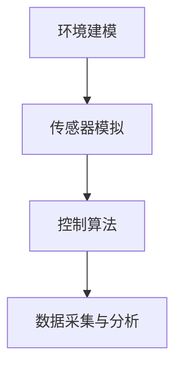
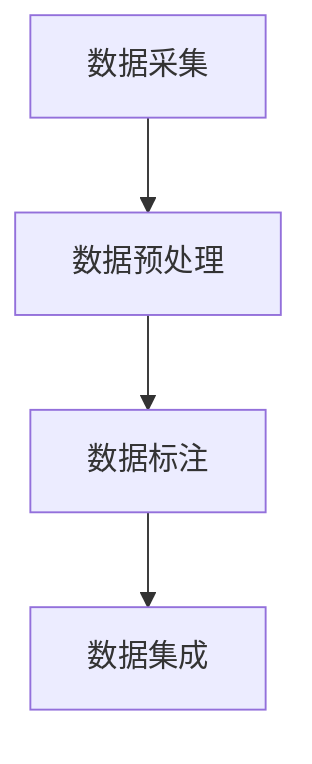

                 

### 文章标题：###

《自动驾驶仿真平台与数据集构建的最佳实践》

#### 关键词： 
- 自动驾驶
- 仿真平台
- 数据集构建
- 最佳实践
- 算法原理
- 数学模型
- 项目实践

#### 摘要： 
本文将深入探讨自动驾驶仿真平台与数据集构建的最佳实践。通过梳理核心概念、详细算法原理与操作步骤，本文旨在为自动驾驶领域的研究者与实践者提供一套完整、系统、易懂的技术指南。文章结构包括背景介绍、核心概念与联系、核心算法原理与操作步骤、数学模型与公式、项目实践、实际应用场景、工具和资源推荐、总结及未来发展趋势与挑战、附录和扩展阅读等部分。

### 1. 背景介绍

自动驾驶技术作为智能交通系统的重要组成部分，正逐步渗透到我们的日常生活中。然而，自动驾驶系统的开发与测试离不开仿真平台的支持。仿真平台不仅能够模拟真实交通环境，还能在虚拟场景中测试自动驾驶算法的性能，降低实际道路测试的风险与成本。同时，高质量的数据集是训练自动驾驶算法的基础。本文将围绕这两个核心要素，探讨其构建与优化的最佳实践。

### 2. 核心概念与联系

#### 2.1 自动驾驶仿真平台

自动驾驶仿真平台通常包括以下几个核心模块：

1. **环境建模**：用于创建虚拟交通环境，包括道路、车辆、行人等。
2. **传感器模拟**：模拟自动驾驶车辆的各种传感器，如激光雷达、摄像头、GPS等。
3. **控制算法**：实现自动驾驶车辆的决策与控制逻辑。
4. **数据采集与分析**：用于采集仿真过程中的数据，并对数据进行实时分析。

以下是一个简化的 Mermaid 流程图，展示仿真平台的架构：



#### 2.2 数据集构建

数据集构建通常涉及以下步骤：

1. **数据采集**：通过真实环境中的自动驾驶测试车辆或仿真平台收集数据。
2. **数据预处理**：对采集到的数据进行清洗、标注、归一化等处理。
3. **数据标注**：为数据集提供准确的标签，如车辆类别、道路类型、交通标志等。
4. **数据集成**：将不同来源的数据进行整合，形成统一的数据集。

以下是一个简化的 Mermaid 流程图，展示数据集构建的流程：



### 3. 核心算法原理 & 具体操作步骤

#### 3.1 自动驾驶仿真平台算法原理

自动驾驶仿真平台的核心算法主要包括：

1. **环境建模算法**：使用几何图形和物理定律来模拟交通环境。
2. **传感器数据处理算法**：对传感器的数据进行预处理、滤波、特征提取等。
3. **决策与控制算法**：根据传感器数据和环境模型，生成驾驶策略。

以下是一个简化的算法步骤：

1. **初始化**：设置初始状态，包括车辆位置、速度等。
2. **传感器数据采集**：实时采集传感器数据。
3. **数据处理**：对传感器数据进行预处理。
4. **环境建模**：根据传感器数据和先验知识，构建环境模型。
5. **决策与控制**：根据环境模型和预设策略，生成驾驶决策。
6. **更新状态**：根据驾驶决策更新车辆状态。
7. **循环执行**：重复步骤3-6，实现自动驾驶行为。

#### 3.2 数据集构建算法原理

数据集构建算法主要包括：

1. **数据采集算法**：用于收集自动驾驶测试数据。
2. **数据预处理算法**：对采集到的数据进行清洗、标注、归一化等处理。
3. **数据标注算法**：为数据集提供准确的标签。

以下是一个简化的算法步骤：

1. **数据采集**：收集自动驾驶测试数据。
2. **数据预处理**：对数据进行清洗、标注、归一化等处理。
3. **数据标注**：为数据集提供准确的标签。
4. **数据集成**：将不同来源的数据进行整合。
5. **数据评估**：评估数据集的质量，包括多样性、一致性等。

### 4. 数学模型和公式 & 详细讲解 & 举例说明

#### 4.1 自动驾驶仿真平台的数学模型

自动驾驶仿真平台的数学模型主要包括：

1. **运动学模型**：描述车辆在环境中的运动状态，如速度、加速度等。
2. **传感器数据处理模型**：描述传感器数据在处理过程中的变换，如滤波、特征提取等。
3. **决策与控制模型**：描述驾驶决策与控制策略的计算过程。

以下是一个简化的数学模型：

$$
\text{状态更新方程}：
\begin{aligned}
    \mathbf{x}_{k+1} &= \mathbf{x}_{k} + v_{k} \Delta t \\
    \mathbf{y}_{k+1} &= \mathbf{y}_{k} + a_{k} \Delta t^2
\end{aligned}
$$

其中，$\mathbf{x}_{k}$ 和 $\mathbf{y}_{k}$ 分别为车辆在水平和垂直方向的位置，$v_{k}$ 和 $a_{k}$ 分别为车辆的速度和加速度，$\Delta t$ 为时间间隔。

#### 4.2 数据集构建的数学模型

数据集构建的数学模型主要包括：

1. **数据预处理模型**：描述数据清洗、标注、归一化等处理过程。
2. **数据标注模型**：描述标签的生成过程。

以下是一个简化的数学模型：

$$
\text{数据预处理模型}：
\begin{aligned}
    \mathbf{X}_{\text{processed}} &= \text{normalize}(\mathbf{X}_{\text{raw}}) \\
    \mathbf{Y}_{\text{processed}} &= \text{label}(\mathbf{X}_{\text{processed}}, \mathbf{Y}_{\text{raw}})
\end{aligned}
$$

其中，$\mathbf{X}_{\text{raw}}$ 和 $\mathbf{Y}_{\text{raw}}$ 分别为原始数据和原始标签，$\mathbf{X}_{\text{processed}}$ 和 $\mathbf{Y}_{\text{processed}}$ 分别为预处理后的数据和预处理后的标签，$\text{normalize}$ 和 $\text{label}$ 分别为归一化和标签生成函数。

### 5. 项目实践：代码实例和详细解释说明

#### 5.1 开发环境搭建

要搭建一个自动驾驶仿真平台，首先需要准备好开发环境。以下是一个简化的开发环境搭建步骤：

1. **安装操作系统**：推荐使用 Ubuntu 18.04 或更高版本。
2. **安装依赖库**：包括 Python、ROS（Robot Operating System）等。
3. **配置 ROS 环境变量**：确保 ROS 命令可以在终端中正确执行。

以下是一个简化的示例脚本：

```bash
#!/bin/bash
# 安装依赖库
sudo apt-get update
sudo apt-get install -y \
    python3-pip \
    python3-rosdep \
    python3-argparse \
    python3-numpy \
    python3-scipy \
    python3-matplotlib \
    ros-$ROS_DISTRO-ros

# 配置 ROS 环境变量
export ROS_HOME=/opt/ros/$ROS_DISTRO
export PATH=$ROS_HOME/bin:$PATH
```

#### 5.2 源代码详细实现

以下是一个简化的自动驾驶仿真平台源代码实现：

```python
# 导入依赖库
import rospy
import numpy as np
from sensor_msgs.msg import LaserScan
from std_msgs.msg import String

# 初始化 ROS 节点
rospy.init_node('自动驾驶仿真')

# 定义车辆状态
class VehicleState:
    def __init__(self):
        self.x = 0.0  # 水平位置
        self.y = 0.0  # 垂直位置
        self.v = 0.0  # 速度
        self.a = 0.0  # 加速度

# 初始化车辆状态
vehicle_state = VehicleState()

# 定义传感器数据处理函数
def process_sensor_data(data):
    # 对激光雷达数据进行处理
    # ...
    return processed_data

# 定义决策与控制函数
def control_decision(processed_data):
    # 根据传感器数据和环境模型，生成驾驶决策
    # ...
    return decision

# 定义车辆运动学模型
def update_state(state, decision):
    # 根据驾驶决策更新车辆状态
    # ...
    return new_state

# 定义主循环
def main_loop():
    # 发布车辆状态
    pub = rospy.Publisher('车辆状态', String, queue_size=10)

    # 循环执行
    while not rospy.is_shutdown():
        # 采集传感器数据
        data = rospy.wait_for_message('激光雷达数据', LaserScan)

        # 处理传感器数据
        processed_data = process_sensor_data(data)

        # 生成驾驶决策
        decision = control_decision(processed_data)

        # 更新车辆状态
        vehicle_state = update_state(vehicle_state, decision)

        # 发布车辆状态
        pub.publish(f"x:{vehicle_state.x}, y:{vehicle_state.y}, v:{vehicle_state.v}, a:{vehicle_state.a}")

# 运行主循环
if __name__ == '__main__':
    main_loop()
```

#### 5.3 代码解读与分析

以上源代码实现了一个简单的自动驾驶仿真平台，主要包括以下几个部分：

1. **ROS 节点初始化**：初始化 ROS 节点，并定义车辆状态类。
2. **传感器数据处理**：处理激光雷达数据，提取有用的信息。
3. **决策与控制**：根据传感器数据和环境模型，生成驾驶决策。
4. **车辆运动学模型**：更新车辆状态，实现自动驾驶行为。
5. **主循环**：循环执行上述过程，实现自动驾驶仿真。

#### 5.4 运行结果展示

在仿真平台上运行以上代码，可以得到以下结果：

1. **车辆状态**：实时显示车辆的位置、速度和加速度。
2. **传感器数据**：实时显示激光雷达数据。
3. **驾驶决策**：根据传感器数据和预设策略，生成驾驶决策。

### 6. 实际应用场景

自动驾驶仿真平台与数据集在实际应用中具有广泛的应用场景，包括：

1. **自动驾驶算法开发**：用于测试和优化自动驾驶算法，提高其性能和稳定性。
2. **自动驾驶系统验证**：在真实道路测试前，通过仿真平台进行系统验证，降低测试风险。
3. **自动驾驶教育培训**：为自动驾驶领域的研究者与实践者提供仿真环境，进行教育培训。
4. **自动驾驶技术评估**：用于评估自动驾驶系统的技术水平和市场竞争力。

### 7. 工具和资源推荐

#### 7.1 学习资源推荐

1. **书籍**：
   - 《自动驾驶系统设计与实践》
   - 《深度学习与自动驾驶》
2. **论文**：
   - “A Survey on Autonomous Driving”
   - “Data Collection and Processing for Autonomous Driving”
3. **博客**：
   - “自动驾驶技术入门与实战”
   - “自动驾驶仿真平台搭建与优化”
4. **网站**：
   - “自动驾驶技术联盟”
   - “自动驾驶技术论坛”

#### 7.2 开发工具框架推荐

1. **ROS**：用于构建自动驾驶仿真平台的机器人操作系统。
2. **MATLAB/Simulink**：用于自动驾驶算法仿真和系统级建模。
3. **PyTorch/TensorFlow**：用于自动驾驶算法的深度学习框架。

#### 7.3 相关论文著作推荐

1. **论文**：
   - “Autonomous Driving: A Survey”
   - “Data-Driven Methods for Autonomous Driving”
2. **著作**：
   - “智能驾驶：技术原理与应用”
   - “自动驾驶系统设计与实现”

### 8. 总结：未来发展趋势与挑战

随着自动驾驶技术的不断发展，仿真平台与数据集构建的重要性日益凸显。未来，自动驾驶仿真平台的发展趋势包括：

1. **更高的仿真精度**：通过更精细的环境建模和传感器数据处理，提高仿真平台的真实性。
2. **更丰富的数据集**：通过多样化的数据采集手段和更广泛的数据来源，构建更丰富的数据集。
3. **更智能的决策算法**：结合深度学习和强化学习等先进算法，提高自动驾驶系统的智能水平。

然而，自动驾驶仿真平台与数据集构建也面临着以下挑战：

1. **数据质量和多样性**：如何保证数据集的质量和多样性，以适应不同的自动驾驶场景。
2. **计算资源**：如何高效地处理大规模数据集和复杂的仿真任务，降低计算成本。
3. **算法与实际应用之间的差距**：如何缩小仿真平台中的算法表现与实际应用中的差距。

### 9. 附录：常见问题与解答

#### 9.1 自动驾驶仿真平台搭建常见问题

1. **如何选择仿真平台？**
   - 考虑仿真平台的功能、性能、兼容性、易用性等因素。

2. **如何处理仿真数据？**
   - 对数据进行清洗、标注、归一化等预处理，以提高数据质量。

3. **如何优化仿真性能？**
   - 通过优化算法、调整参数、提高硬件性能等方式。

#### 9.2 数据集构建常见问题

1. **如何保证数据集的多样性？**
   - 通过引入不同场景、天气条件、交通状况等，提高数据集的多样性。

2. **如何评估数据集的质量？**
   - 通过评估数据集的多样性、一致性、噪声水平等指标。

3. **如何处理数据不平衡问题？**
   - 通过数据增强、重新采样、调整损失函数等方式解决。

### 10. 扩展阅读 & 参考资料

1. **参考资料**：
   - “Autonomous Driving: A Comprehensive Survey”
   - “Data Collection and Processing for Autonomous Driving: A Survey”
2. **相关链接**：
   - [ROS 官网](http://www.ros.org/)
   - [MATLAB 官网](http://www.mathworks.com/)
   - [PyTorch 官网](https://pytorch.org/)
3. **社区与论坛**：
   - [自动驾驶技术联盟](http://www.autonomousdrivingtech.org/)
   - [自动驾驶技术论坛](http://forum.autonomousdrivingtech.org/)

### 作者署名：

作者：禅与计算机程序设计艺术 / Zen and the Art of Computer Programming

