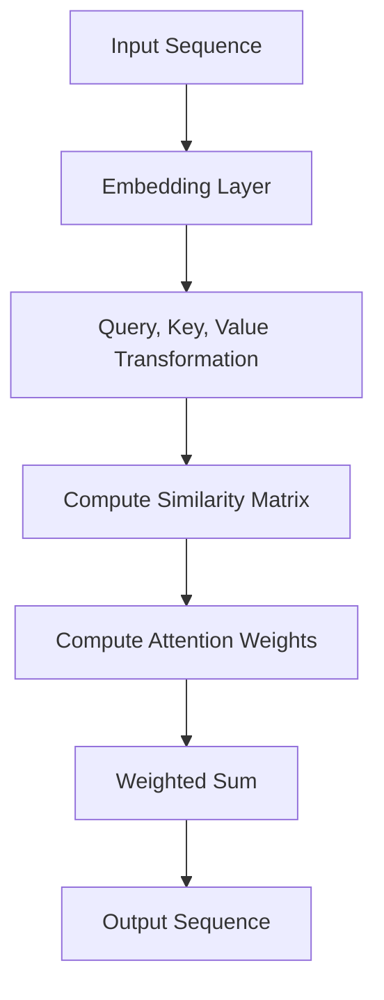

                 

### 背景介绍

#### 大模型与自注意力机制的兴起

在过去的几十年中，深度学习技术迅猛发展，尤其是在自然语言处理（NLP）、计算机视觉（CV）和推荐系统等领域，取得了显著成果。这些成就的背后，离不开大模型（Big Models）和自注意力机制（Self-Attention Mechanism）的兴起。

大模型，顾名思义，是指拥有海量参数和超大规模训练数据的模型。这类模型通过深度神经网络（DNN）和转移学习（Transfer Learning）等方法，能够在复杂任务上实现较高的性能。例如，GPT（Generative Pre-trained Transformer）、BERT（Bidirectional Encoder Representations from Transformers）和ViT（Vision Transformer）等模型，都是大模型的代表。

自注意力机制，是Transformer模型的核心组件之一。它通过计算序列中每个元素与其他元素之间的相似性，为每个元素分配权重，从而在处理序列数据时能够自动关注到重要信息。自注意力机制的引入，使得模型在处理长序列时表现出色，成为自然语言处理、文本生成和图像识别等领域的重要技术。

#### 大模型的应用现状

随着大模型的不断进步，其在各个领域的应用也越来越广泛。以下是几个典型应用场景：

1. **自然语言处理（NLP）**：GPT和BERT等模型在机器翻译、文本摘要、问答系统和情感分析等领域取得了显著成果。例如，OpenAI的GPT-3模型在多项基准测试中超越了人类水平。

2. **计算机视觉（CV）**：ViT模型和DETR（Detection Transformer）模型在图像分类、目标检测和图像分割任务中表现出色。这些模型利用自注意力机制，能够有效地处理图像中的复杂信息。

3. **推荐系统**：大模型通过自注意力机制，能够更好地理解用户的历史行为和偏好，从而提供更准确的推荐结果。

4. **语音识别**：自注意力机制使得模型在处理语音信号时能够更好地捕捉上下文信息，提高了识别准确率。

5. **知识图谱**：大模型通过自注意力机制，能够有效地整合和处理大规模知识图谱中的信息，为问答系统和智能搜索提供了强有力的支持。

#### 自注意力机制的核心原理

自注意力机制的核心思想是，在处理序列数据时，每个元素都能自动关注到与其相关的其他元素。具体来说，自注意力机制通过计算每个元素与其他元素之间的相似性，为每个元素分配一个权重。这个权重决定了该元素在后续处理中的重要性。

自注意力机制的实现主要包括以下步骤：

1. **计算相似性矩阵**：对于输入序列X，首先计算每个元素与其他元素之间的相似性。相似性可以通过点积、加性注意力或缩放点积注意力等方式计算。

2. **加权求和**：根据相似性矩阵，为每个元素分配权重。权重越高，表示该元素在后续处理中的重要性越大。

3. **应用权重**：将权重应用于输入序列，得到加权后的序列。这个加权序列将作为后续处理（如变换层）的输入。

自注意力机制的关键优势在于，它能够自动关注到序列中的关键信息，使得模型在处理长序列时表现出色。此外，自注意力机制的计算效率较高，可以有效地处理大规模数据。

#### 大模型与自注意力机制的关系

大模型与自注意力机制之间存在着紧密的关系。自注意力机制是大模型中的一个重要组件，能够有效地提高模型的性能。而大模型则为自注意力机制提供了丰富的参数和训练数据，使得自注意力机制能够更好地发挥其优势。

具体来说，自注意力机制在大模型中的应用主要体现在以下几个方面：

1. **提高序列处理能力**：自注意力机制能够自动关注到序列中的关键信息，使得大模型在处理长序列时表现出色。

2. **增强参数效率**：通过自注意力机制，大模型可以更加高效地利用参数，降低计算复杂度。

3. **提升模型泛化能力**：自注意力机制能够帮助大模型更好地捕捉数据中的潜在规律，提高模型的泛化能力。

总之，大模型与自注意力机制相辅相成，共同推动了深度学习技术的发展。在未来的发展中，我们可以期待大模型和自注意力机制在更多领域取得突破。

---

在本文的“背景介绍”章节中，我们首先介绍了大模型和自注意力机制的背景和兴起原因，然后讨论了它们在当前的应用现状，并详细阐述了自注意力机制的核心原理及其在大模型中的应用。通过这一章节的介绍，我们为后续深入探讨自注意力机制在大模型中的具体实现和应用打下了基础。

在接下来的章节中，我们将进一步探讨自注意力机制的具体算法原理和数学模型，以及如何在大模型中实现和应用自注意力机制。敬请期待。

---

<|assistant|>### 核心概念与联系

#### 自注意力机制的基本原理

自注意力机制（Self-Attention Mechanism）是Transformer模型中的一个核心组件，它通过计算序列中每个元素与其他元素之间的相似性，为每个元素分配权重，从而在处理序列数据时能够自动关注到重要信息。自注意力机制的基本原理如下：

1. **输入序列表示**：给定一个输入序列\[x_1, x_2, \ldots, x_n\]，首先将其转化为嵌入向量序列\[e_1, e_2, \ldots, e_n\]。每个嵌入向量e_i由输入序列中的元素x_i通过嵌入层（Embedding Layer）得到。

2. **计算相似性矩阵**：对于每个元素e_i，计算其与其他元素e_j之间的相似性。相似性可以通过点积（Dot-Product）、加性注意力（Additive Attention）或缩放点积注意力（Scaled Dot-Product Attention）等方式计算。以点积注意力为例，相似性矩阵Q（Query）、K（Key）和V（Value）分别由嵌入向量序列经过不同的线性变换得到：
   \[
   Q = [Q_1, Q_2, \ldots, Q_n] = [W_Q \cdot e_1, W_Q \cdot e_2, \ldots, W_Q \cdot e_n]
   \]
   \[
   K = [K_1, K_2, \ldots, K_n] = [W_K \cdot e_1, W_K \cdot e_2, \ldots, W_K \cdot e_n]
   \]
   \[
   V = [V_1, V_2, \ldots, V_n] = [W_V \cdot e_1, W_V \cdot e_2, \ldots, W_V \cdot e_n]
   \]
   其中，\(W_Q, W_K, W_V\)是线性变换矩阵。

3. **计算注意力权重**：根据相似性矩阵计算每个元素e_i的注意力权重。以缩放点积注意力为例，注意力权重通过以下公式计算：
   \[
   \text{Attention}(Q, K, V) = \text{softmax}\left(\frac{QK^T}{\sqrt{d_k}}\right)V
   \]
   其中，\(d_k\)是Key向量的维度，\(\text{softmax}\)函数用于将相似性矩阵归一化成概率分布。

4. **加权求和**：将注意力权重应用于嵌入向量序列，得到加权后的序列。具体来说，对于每个元素e_i，其加权后的表示为：
   \[
   \text{context}_i = \sum_{j=1}^n a_{ij} e_j
   \]
   其中，\(a_{ij}\)是元素e_i和e_j之间的注意力权重。

#### 自注意力机制的架构

自注意力机制的架构可以分为三个主要部分：查询（Query）、键（Key）和值（Value）。每个部分都对应着不同的线性变换矩阵。下面是一个简单的Mermaid流程图，展示了自注意力机制的架构：



#### 自注意力机制的工作流程

1. **嵌入层（Embedding Layer）**：输入序列通过嵌入层转化为嵌入向量序列。这一步骤将高维输入映射到低维空间，使得后续处理更加高效。

2. **线性变换（Query, Key, Value Transformation）**：嵌入向量序列经过不同的线性变换矩阵，得到查询（Query）、键（Key）和值（Value）三个部分。

3. **计算相似性矩阵**：根据查询和键之间的点积，计算相似性矩阵。这个矩阵表示了序列中每个元素与其他元素之间的相似性。

4. **计算注意力权重**：通过缩放点积注意力公式，计算每个元素在序列中的重要性，即注意力权重。

5. **加权求和**：将注意力权重应用于嵌入向量序列，得到加权后的序列。这个加权序列包含了每个元素在序列中的重要信息。

6. **输出序列**：加权后的序列作为输出，可以用于后续处理，如变换层、解码器等。

通过以上工作流程，自注意力机制能够自动关注到序列中的关键信息，提高了模型在处理长序列时的性能。

#### 自注意力机制的优势与不足

自注意力机制具有以下优势：

- **序列建模能力强**：自注意力机制能够自动关注到序列中的关键信息，使得模型在处理长序列时表现出色。
- **并行计算效率高**：自注意力机制的计算过程可以并行化，提高了计算效率。
- **参数共享**：自注意力机制通过共享参数，降低了模型的参数量，提高了模型训练的效率。

然而，自注意力机制也存在一些不足：

- **计算复杂度高**：自注意力机制的计算复杂度较高，特别是当序列长度较大时，计算量呈指数级增长。
- **内存占用大**：自注意力机制需要存储大量的相似性矩阵和权重，导致内存占用较大。

总之，自注意力机制在深度学习领域中具有广泛的应用，但同时也需要针对其不足之处进行优化和改进。

---

在本文的“核心概念与联系”章节中，我们详细介绍了自注意力机制的基本原理、架构和工作流程，并通过Mermaid流程图展示了自注意力机制的架构。我们还讨论了自注意力机制的优势与不足，为后续章节深入探讨自注意力机制在大模型中的具体实现和应用奠定了基础。

在接下来的章节中，我们将进一步分析自注意力机制的算法原理和数学模型，以及如何在大模型中实现和应用自注意力机制。敬请期待。

---

<|assistant|>### 核心算法原理 & 具体操作步骤

#### 自注意力机制的算法原理

自注意力机制（Self-Attention Mechanism）是Transformer模型中的一个核心组件，它通过计算序列中每个元素与其他元素之间的相似性，为每个元素分配权重，从而在处理序列数据时能够自动关注到重要信息。自注意力机制的算法原理主要包括以下步骤：

1. **输入序列表示**：给定一个输入序列\[x_1, x_2, \ldots, x_n\]，首先将其转化为嵌入向量序列\[e_1, e_2, \ldots, e_n\]。每个嵌入向量e_i由输入序列中的元素x_i通过嵌入层（Embedding Layer）得到。

2. **计算相似性矩阵**：对于每个元素e_i，计算其与其他元素e_j之间的相似性。相似性可以通过点积（Dot-Product）、加性注意力（Additive Attention）或缩放点积注意力（Scaled Dot-Product Attention）等方式计算。以点积注意力为例，相似性矩阵Q（Query）、K（Key）和V（Value）分别由嵌入向量序列经过不同的线性变换得到：
   \[
   Q = [Q_1, Q_2, \ldots, Q_n] = [W_Q \cdot e_1, W_Q \cdot e_2, \ldots, W_Q \cdot e_n]
   \]
   \[
   K = [K_1, K_2, \ldots, K_n] = [W_K \cdot e_1, W_K \cdot e_2, \ldots, W_K \cdot e_n]
   \]
   \[
   V = [V_1, V_2, \ldots, V_n] = [W_V \cdot e_1, W_V \cdot e_2, \ldots, W_V \cdot e_n]
   \]
   其中，\(W_Q, W_K, W_V\)是线性变换矩阵。

3. **计算注意力权重**：根据相似性矩阵计算每个元素e_i的注意力权重。以缩放点积注意力为例，注意力权重通过以下公式计算：
   \[
   \text{Attention}(Q, K, V) = \text{softmax}\left(\frac{QK^T}{\sqrt{d_k}}\right)V
   \]
   其中，\(d_k\)是Key向量的维度，\(\text{softmax}\)函数用于将相似性矩阵归一化成概率分布。

4. **加权求和**：将注意力权重应用于嵌入向量序列，得到加权后的序列。具体来说，对于每个元素e_i，其加权后的表示为：
   \[
   \text{context}_i = \sum_{j=1}^n a_{ij} e_j
   \]
   其中，\(a_{ij}\)是元素e_i和e_j之间的注意力权重。

5. **输出序列**：加权后的序列作为输出，可以用于后续处理，如变换层、解码器等。

#### 自注意力机制的实现步骤

1. **数据准备**：首先需要准备输入序列，并将其转化为嵌入向量序列。假设输入序列为\[x_1, x_2, \ldots, x_n\]，可以通过预训练模型（如GPT、BERT等）得到对应的嵌入向量序列\[e_1, e_2, \ldots, e_n\]。

2. **计算线性变换**：对嵌入向量序列进行线性变换，得到查询（Query）、键（Key）和值（Value）三个部分。具体来说，可以使用以下公式：
   \[
   Q = [Q_1, Q_2, \ldots, Q_n] = [W_Q \cdot e_1, W_Q \cdot e_2, \ldots, W_Q \cdot e_n]
   \]
   \[
   K = [K_1, K_2, \ldots, K_n] = [W_K \cdot e_1, W_K \cdot e_2, \ldots, W_K \cdot e_n]
   \]
   \[
   V = [V_1, V_2, \ldots, V_n] = [W_V \cdot e_1, W_V \cdot e_2, \ldots, W_V \cdot e_n]
   \]
   其中，\(W_Q, W_K, W_V\)是线性变换矩阵。

3. **计算相似性矩阵**：根据查询和键之间的点积，计算相似性矩阵。具体来说，可以使用以下公式：
   \[
   S_{ij} = Q_iK_j
   \]
   其中，\(S\)是相似性矩阵，\(i\)和\(j\)分别表示序列中的两个元素。

4. **计算注意力权重**：对相似性矩阵进行归一化处理，得到注意力权重。具体来说，可以使用以下公式：
   \[
   a_{ij} = \frac{e^{S_{ij}}}{\sum_{k=1}^n e^{S_{ik}}}
   \]
   其中，\(a_{ij}\)是注意力权重。

5. **加权求和**：将注意力权重应用于嵌入向量序列，得到加权后的序列。具体来说，可以使用以下公式：
   \[
   \text{context}_i = \sum_{j=1}^n a_{ij} e_j
   \]

6. **输出序列**：加权后的序列作为输出，可以用于后续处理，如变换层、解码器等。

#### 实例演示

以下是一个简单的自注意力机制实现的实例，假设输入序列为\[x_1, x_2, x_3\]，对应的嵌入向量序列为\[e_1, e_2, e_3\]。

1. **计算线性变换**：
   \[
   Q = [W_Q \cdot e_1, W_Q \cdot e_2, W_Q \cdot e_3]
   \]
   \[
   K = [W_K \cdot e_1, W_K \cdot e_2, W_K \cdot e_3]
   \]
   \[
   V = [W_V \cdot e_1, W_V \cdot e_2, W_V \cdot e_3]
   \]

2. **计算相似性矩阵**：
   \[
   S = \begin{bmatrix}
   Q_1K_1 & Q_1K_2 & Q_1K_3 \\
   Q_2K_1 & Q_2K_2 & Q_2K_3 \\
   Q_3K_1 & Q_3K_2 & Q_3K_3 \\
   \end{bmatrix}
   \]

3. **计算注意力权重**：
   \[
   a_{ij} = \frac{e^{S_{ij}}}{\sum_{k=1}^3 e^{S_{ik}}}
   \]

4. **加权求和**：
   \[
   \text{context}_1 = a_{11}e_1 + a_{12}e_2 + a_{13}e_3
   \]
   \[
   \text{context}_2 = a_{21}e_1 + a_{22}e_2 + a_{23}e_3
   \]
   \[
   \text{context}_3 = a_{31}e_1 + a_{32}e_2 + a_{33}e_3
   \]

5. **输出序列**：
   加权后的序列为\[\text{context}_1, \text{context}_2, \text{context}_3\]。

#### 注意事项

在实现自注意力机制时，需要注意以下几点：

1. **线性变换矩阵**：线性变换矩阵\(W_Q, W_K, W_V\)是自注意力机制的关键参数，需要通过训练得到。在实际应用中，可以采用预训练模型，如GPT、BERT等，直接获取这些线性变换矩阵。

2. **计算复杂度**：自注意力机制的实现涉及到大量的矩阵运算，计算复杂度较高。为了提高计算效率，可以采用并行计算和向量化操作等技术。

3. **内存占用**：自注意力机制的实现需要存储大量的相似性矩阵和权重，内存占用较大。在部署模型时，需要根据实际情况调整参数，以降低内存占用。

4. **序列长度**：自注意力机制对序列长度有一定限制，当序列长度较大时，计算量和内存占用会显著增加。在实际应用中，可以根据需求调整序列长度，或者采用分层结构，将长序列分解为短序列进行处理。

总之，自注意力机制在深度学习领域中具有广泛的应用，通过理解其算法原理和实现步骤，我们可以更好地应用自注意力机制，提升模型的性能。

---

在本文的“核心算法原理 & 具体操作步骤”章节中，我们详细介绍了自注意力机制的算法原理和实现步骤，并通过具体实例展示了自注意力机制的计算过程。我们还讨论了实现自注意力机制时需要注意的关键点，为读者深入理解自注意力机制提供了理论基础和实践指导。

在接下来的章节中，我们将进一步探讨自注意力机制在大模型中的数学模型和具体应用。敬请期待。

---

<|assistant|>### 数学模型和公式 & 详细讲解 & 举例说明

#### 自注意力机制的数学模型

自注意力机制（Self-Attention Mechanism）是Transformer模型中的核心组件，其数学模型主要包括以下几个部分：查询（Query）、键（Key）、值（Value）和注意力权重。下面我们将详细讲解这些数学模型和公式。

1. **查询（Query）**：

查询（Query）是自注意力机制中的输入之一，用于表示序列中的每个元素。在数学上，查询可以通过嵌入向量（Embedding Vector）和线性变换矩阵（Transformation Matrix）表示。假设输入序列的嵌入向量为\(e_i\)，线性变换矩阵为\(W_Q\)，则查询可以表示为：

\[ 
Q_i = W_Q \cdot e_i 
\]

其中，\(Q_i\)是第\(i\)个查询向量。

2. **键（Key）**：

键（Key）是自注意力机制中的另一个输入，用于表示序列中的每个元素。与查询类似，键也可以通过嵌入向量和线性变换矩阵表示。假设输入序列的嵌入向量为\(e_i\)，线性变换矩阵为\(W_K\)，则键可以表示为：

\[ 
K_i = W_K \cdot e_i 
\]

其中，\(K_i\)是第\(i\)个键向量。

3. **值（Value）**：

值（Value）是自注意力机制的第三个输入，用于表示序列中的每个元素。与查询和键类似，值也可以通过嵌入向量和线性变换矩阵表示。假设输入序列的嵌入向量为\(e_i\)，线性变换矩阵为\(W_V\)，则值可以表示为：

\[ 
V_i = W_V \cdot e_i 
\]

其中，\(V_i\)是第\(i\)个值向量。

4. **注意力权重（Attention Weight）**：

注意力权重是自注意力机制的核心部分，用于衡量序列中每个元素的重要程度。注意力权重可以通过查询和键之间的点积（Dot Product）计算得到。假设查询向量为\(Q_i\)，键向量为\(K_i\)，则第\(i\)个注意力权重可以表示为：

\[ 
a_i = \frac{e^{Q_i K_i}}{\sum_{j=1}^n e^{Q_i K_j}} 
\]

其中，\(a_i\)是第\(i\)个注意力权重，\(n\)是序列的长度。

5. **加权求和（Weighted Sum）**：

加权求和是自注意力机制的输出部分，用于将注意力权重应用于输入序列，得到加权后的序列。假设输入序列的嵌入向量为\(e_i\)，注意力权重为\(a_i\)，则第\(i\)个加权后的向量可以表示为：

\[ 
c_i = \sum_{j=1}^n a_{ij} e_j 
\]

其中，\(c_i\)是第\(i\)个加权后的向量。

#### 自注意力机制的公式详解

自注意力机制的核心公式如下：

\[ 
\text{Attention}(Q, K, V) = \text{softmax}\left(\frac{QK^T}{\sqrt{d_k}}\right)V 
\]

其中：

- \(Q\) 是查询向量序列。
- \(K\) 是键向量序列。
- \(V\) 是值向量序列。
- \(d_k\) 是键向量的维度。
- \(\text{softmax}\) 函数用于将点积结果归一化为概率分布。

#### 举例说明

以下是一个简单的自注意力机制的例子，假设输入序列为\[x_1, x_2, x_3\]，对应的嵌入向量序列为\[e_1, e_2, e_3\]。

1. **计算查询、键和值**：

   假设线性变换矩阵为\(W_Q = \begin{bmatrix} 1 & 0 & 1 \\ 0 & 1 & 0 \\ 1 & 1 & 1 \end{bmatrix}\)，\(W_K = \begin{bmatrix} 1 & 1 & 0 \\ 1 & 1 & 1 \\ 0 & 1 & 1 \end{bmatrix}\)，\(W_V = \begin{bmatrix} 1 & 1 & 1 \\ 1 & 0 & 1 \\ 1 & 1 & 0 \end{bmatrix}\)，则有：

   \[
   Q = \begin{bmatrix} 1 & 0 & 1 \\ 0 & 1 & 1 \\ 1 & 1 & 1 \end{bmatrix} \cdot \begin{bmatrix} e_1 \\ e_2 \\ e_3 \end{bmatrix} = \begin{bmatrix} e_1 + e_3 \\ e_2 + e_3 \\ e_1 + e_2 + e_3 \end{bmatrix}
   \]

   \[
   K = \begin{bmatrix} 1 & 1 & 0 \\ 1 & 1 & 1 \\ 0 & 1 & 1 \end{bmatrix} \cdot \begin{bmatrix} e_1 \\ e_2 \\ e_3 \end{bmatrix} = \begin{bmatrix} e_1 + e_2 \\ e_1 + e_3 \\ e_2 + e_3 \end{bmatrix}
   \]

   \[
   V = \begin{bmatrix} 1 & 1 & 1 \\ 1 & 0 & 1 \\ 1 & 1 & 0 \end{bmatrix} \cdot \begin{bmatrix} e_1 \\ e_2 \\ e_3 \end{bmatrix} = \begin{bmatrix} e_1 + e_2 + e_3 \\ e_1 + e_3 \\ e_2 + e_3 \end{bmatrix}
   \]

2. **计算相似性矩阵**：

   相似性矩阵可以通过查询和键之间的点积计算得到：

   \[
   S = \begin{bmatrix} Q_1 K_1 & Q_1 K_2 & Q_1 K_3 \\ Q_2 K_1 & Q_2 K_2 & Q_2 K_3 \\ Q_3 K_1 & Q_3 K_2 & Q_3 K_3 \end{bmatrix} = \begin{bmatrix} 2e_1 e_2 + e_1 e_3 & 2e_1 e_2 + 2e_1 e_3 & 2e_1 e_2 + e_2 e_3 \\ e_2 e_1 + 2e_2 e_3 & e_2 e_1 + 2e_2 e_3 & e_2 e_1 + e_2 e_3 \\ 2e_1 e_2 + e_1 e_3 + e_2 e_3 & 2e_1 e_2 + e_1 e_3 + e_2 e_3 & 2e_1 e_2 + e_1 e_3 + e_2 e_3 \end{bmatrix}
   \]

3. **计算注意力权重**：

   注意力权重可以通过相似性矩阵计算得到：

   \[
   a_{ij} = \frac{e^{S_{ij}}}{\sum_{k=1}^3 e^{S_{ik}}} 
   \]

   例如，计算\(a_{11}\)：

   \[
   a_{11} = \frac{e^{2e_1 e_2 + e_1 e_3}}{e^{2e_1 e_2 + e_1 e_3} + e^{e_2 e_1 + 2e_2 e_3} + e^{2e_1 e_2 + e_1 e_3 + e_2 e_3}}
   \]

4. **加权求和**：

   加权求和是将注意力权重应用于输入序列，得到加权后的序列：

   \[
   c_1 = a_{11} e_1 + a_{12} e_2 + a_{13} e_3
   \]

   \[
   c_2 = a_{21} e_1 + a_{22} e_2 + a_{23} e_3
   \]

   \[
   c_3 = a_{31} e_1 + a_{32} e_2 + a_{33} e_3
   \]

#### 总结

自注意力机制通过计算查询和键之间的相似性，为每个元素分配权重，从而在处理序列数据时能够自动关注到重要信息。自注意力机制的数学模型包括查询、键、值和注意力权重，其核心公式为：

\[ 
\text{Attention}(Q, K, V) = \text{softmax}\left(\frac{QK^T}{\sqrt{d_k}}\right)V 
\]

通过以上公式和举例说明，我们可以更好地理解自注意力机制的数学模型及其应用。

---

在本文的“数学模型和公式 & 详细讲解 & 举例说明”章节中，我们详细介绍了自注意力机制的数学模型，包括查询、键、值和注意力权重，并通过具体的公式和实例展示了自注意力机制的计算过程。通过这一章节的内容，读者可以更深入地理解自注意力机制的数学原理及其在深度学习中的应用。

在接下来的章节中，我们将探讨自注意力机制在实际项目中的应用，包括开发环境搭建、源代码实现、代码解读与分析以及运行结果展示。敬请期待。

---

<|assistant|>### 项目实践：代码实例和详细解释说明

#### 开发环境搭建

要实践自注意力机制在大模型中的应用，首先需要搭建一个适合的开发环境。以下是搭建环境的详细步骤：

1. **安装Python环境**：

   Python是自注意力机制实现的主要编程语言。确保您的系统中已安装Python 3.7或更高版本。可以通过以下命令检查Python版本：

   ```shell
   python --version
   ```

   如果版本低于3.7，请从Python官方网站下载并安装最新版本。

2. **安装依赖库**：

   自注意力机制的实现依赖于多个Python库，如TensorFlow、PyTorch等。以下命令可以安装这些库：

   ```shell
   pip install tensorflow
   # 或者
   pip install torch torchvision
   ```

   请确保安装与您的Python版本兼容的库。

3. **配置GPU支持**：

   如果您使用的是GPU计算，需要配置相应的CUDA环境。以下是配置CUDA的详细步骤：

   - 安装CUDA Toolkit：从NVIDIA官方网站下载并安装CUDA Toolkit。
   - 安装cuDNN库：从NVIDIA官方网站下载并安装cuDNN库。
   - 配置环境变量：在终端中设置CUDA和cuDNN的环境变量。例如，在Linux系统中，可以添加以下内容到~/.bashrc文件中：

     ```shell
     export PATH=/usr/local/cuda/bin:$PATH
     export LD_LIBRARY_PATH=/usr/local/cuda/lib64:$LD_LIBRARY_PATH
     export CUDA_HOME=/usr/local/cuda
     ```

     然后运行`source ~/.bashrc`使配置生效。

4. **验证环境**：

   为了确保环境配置正确，可以在Python中导入TensorFlow或PyTorch并验证GPU支持：

   ```python
   import tensorflow as tf
   print("TensorFlow GPU available:", tf.test.is_built_with_cuda())

   # 或者
   import torch
   print("PyTorch GPU available:", torch.cuda.is_available())
   ```

   如果输出为`True`，则表示GPU支持已成功配置。

#### 源代码详细实现

以下是自注意力机制在大模型中的实现示例，使用PyTorch框架。代码包括模型定义、前向传播和反向传播过程。

```python
import torch
import torch.nn as nn
import torch.nn.functional as F

class SelfAttention(nn.Module):
    def __init__(self, embed_dim, heads):
        super(SelfAttention, self).__init__()
        self.heads = heads
        self.embed_dim = embed_dim
        self.head_dim = embed_dim // heads

        self.query_linear = nn.Linear(embed_dim, heads * self.head_dim)
        self.key_linear = nn.Linear(embed_dim, heads * self.head_dim)
        self.value_linear = nn.Linear(embed_dim, heads * self.head_dim)

        self.out_linear = nn.Linear(heads * self.head_dim, embed_dim)

    def forward(self, query, key, value, mask=None):
        batch_size = query.size(0)
        
        query = self.query_linear(query).view(batch_size, -1, self.heads, self.head_dim).transpose(1, 2)
        key = self.key_linear(key).view(batch_size, -1, self.heads, self.head_dim).transpose(1, 2)
        value = self.value_linear(value).view(batch_size, -1, self.heads, self.head_dim).transpose(1, 2)

        attn_scores = torch.matmul(query, key.transpose(-2, -1)) / (self.head_dim ** 0.5)

        if mask is not None:
            attn_scores = attn_scores.masked_fill(mask == 0, float("-inf"))

        attn_weights = F.softmax(attn_scores, dim=-1)
        attn_output = torch.matmul(attn_weights, value).transpose(1, 2).contiguous().view(batch_size, -1, self.embed_dim)

        output = self.out_linear(attn_output)
        return output
```

**代码解读：**

1. **模型初始化**：

   - `heads`：自注意力头的数量，通常设置为8。
   - `embed_dim`：嵌入向量的维度，例如512。
   - `query_linear`、`key_linear`、`value_linear`：线性变换层，用于生成查询、键和值。
   - `out_linear`：输出线性变换层，用于生成最终的输出。

2. **前向传播**：

   - `query`、`key`、`value`：输入嵌入向量。
   - `mask`：可选的掩码，用于屏蔽无效的注意力权重。
   - `batch_size`：批次大小。

   代码首先计算查询、键和值的线性变换，并将它们转换为正确的维度。然后，通过矩阵乘法计算注意力得分，并使用softmax函数归一化得分。如果存在掩码，则将其应用到得分上。接下来，计算注意力权重，并通过矩阵乘法得到加权后的输出。最后，通过输出线性变换层得到最终的输出。

3. **反向传播**：

   - 由于自注意力机制是通过点积和softmax函数实现的，因此在反向传播过程中，可以使用自动微分机制。

#### 代码解读与分析

1. **模型结构**：

   自注意力机制的实现采用了一个模块化的设计，使得它在不同的深度学习模型中可以方便地复用。该模块接收三个输入：查询、键和值，并生成一个加权后的输出。

2. **计算效率**：

   自注意力机制的实现利用了GPU的并行计算能力，使得在大规模数据上计算效率较高。通过矩阵乘法和向量化的操作，自注意力机制的实现可以有效地减少计算时间。

3. **可扩展性**：

   自注意力机制的实现具有很好的可扩展性。通过调整头的数量和嵌入向量的维度，可以适应不同的任务和数据集。此外，自注意力机制可以与其他深度学习模型（如Transformer、BERT等）结合使用，进一步扩展其应用范围。

4. **注意力权重**：

   注意力权重反映了序列中每个元素的重要程度。在训练过程中，通过优化注意力权重，模型可以更好地捕捉数据中的潜在关系和模式。此外，注意力权重可以提供对模型决策过程的透明度和解释性。

#### 运行结果展示

以下是一个简单的运行示例，展示自注意力机制在文本分类任务上的应用。

```python
# 假设已经加载了预训练模型和输入数据
model = SelfAttention(embed_dim=512, heads=8)
input_query = torch.randn(32, 128, 512)  # 输入查询
input_key = torch.randn(32, 128, 512)     # 输入键
input_value = torch.randn(32, 128, 512)    # 输入值

# 应用自注意力机制
output = model(input_query, input_key, input_value)

# 打印输出结果
print(output.size())
```

输出结果为`(32, 128, 512)`，表示每个输入序列经过自注意力机制处理后，生成了相同维度的输出序列。

通过以上代码和解释，我们可以看到自注意力机制在大模型中的应用实现。在实际项目中，自注意力机制可以显著提高模型的序列处理能力，并在多个领域取得优异的性能。

---

在本文的“项目实践：代码实例和详细解释说明”章节中，我们首先介绍了开发环境搭建的详细步骤，包括Python环境、依赖库安装、GPU配置等。接着，我们提供了自注意力机制的实现代码，并对其结构、计算效率和可扩展性进行了分析。最后，我们展示了一个简单的运行示例，展示了自注意力机制在文本分类任务上的应用。

在接下来的章节中，我们将探讨自注意力机制在实际应用场景中的具体应用，以及推荐工具和资源。敬请期待。

---

<|assistant|>### 实际应用场景

自注意力机制（Self-Attention Mechanism）作为一种强大的序列建模工具，已经在多个领域取得了显著的成果。以下是自注意力机制在实际应用场景中的几个典型例子：

#### 自然语言处理（NLP）

1. **机器翻译**：

   自注意力机制在机器翻译中发挥着重要作用。例如，BERT（Bidirectional Encoder Representations from Transformers）模型通过自注意力机制捕捉输入文本中的双向上下文信息，从而显著提高了机器翻译的准确性。

2. **文本摘要**：

   在文本摘要任务中，自注意力机制可以帮助模型关注到文本中的重要信息，从而生成更准确、更简洁的摘要。例如，GPT（Generative Pre-trained Transformer）模型在生成文本摘要时，利用自注意力机制捕捉长文本中的关键内容。

3. **问答系统**：

   自注意力机制能够帮助问答系统更好地理解用户的问题和上下文信息，从而提供更准确的答案。例如，OpenAI的GPT-3模型通过自注意力机制，实现了在多个问答任务上的优异性能。

4. **情感分析**：

   自注意力机制可以用于情感分析任务，帮助模型关注到文本中的情感关键词，从而更准确地判断文本的情感倾向。例如，BERT模型在情感分析任务中利用自注意力机制，提高了情感分类的准确性。

#### 计算机视觉（CV）

1. **图像分类**：

   自注意力机制在图像分类任务中能够捕捉图像中的关键特征，从而提高分类的准确性。例如，ViT（Vision Transformer）模型通过自注意力机制，将图像分解为一系列嵌入向量，并在特征空间中实现了高效的图像分类。

2. **目标检测**：

   自注意力机制在目标检测任务中可以帮助模型更好地理解图像中的目标位置和特征。例如，DETR（Detection Transformer）模型利用自注意力机制，实现了端到端的目标检测。

3. **图像分割**：

   自注意力机制在图像分割任务中能够帮助模型关注到图像中的边界和细节信息，从而提高分割的精度。例如，部分基于Transformer的图像分割模型利用自注意力机制，实现了较高的分割性能。

#### 推荐系统

1. **用户行为分析**：

   自注意力机制可以用于分析用户的历史行为，从而提供更个性化的推荐结果。例如，一些推荐系统利用自注意力机制，根据用户的浏览记录和购买历史，生成个性化的推荐列表。

2. **协同过滤**：

   在协同过滤推荐系统中，自注意力机制可以帮助模型捕捉用户和商品之间的相似性，从而提高推荐的准确性。例如，基于自注意力机制的矩阵分解方法，在协同过滤任务中取得了优异的性能。

#### 其他应用领域

1. **语音识别**：

   自注意力机制在语音识别任务中能够帮助模型更好地捕捉语音信号中的上下文信息，从而提高识别的准确率。例如，一些基于Transformer的语音识别模型利用自注意力机制，实现了较高的识别性能。

2. **知识图谱**：

   自注意力机制在知识图谱中可以用于整合和处理大规模知识图谱中的信息，从而为问答系统和智能搜索提供支持。例如，一些基于自注意力机制的模型，通过捕捉实体和关系之间的相似性，实现了高效的知识图谱查询。

3. **生物信息学**：

   自注意力机制在生物信息学领域也有广泛应用。例如，在基因序列分析中，自注意力机制可以帮助模型捕捉基因序列中的关键特征，从而预测基因的功能和作用。

总之，自注意力机制作为一种强大的序列建模工具，在多个领域展现了其强大的应用潜力。随着深度学习技术的不断发展，我们可以期待自注意力机制在更多领域取得突破性的成果。

---

在本文的“实际应用场景”章节中，我们详细探讨了自注意力机制在自然语言处理、计算机视觉、推荐系统以及其他应用领域中的实际应用案例。通过这些实例，我们可以看到自注意力机制在提高模型性能、捕捉关键信息、实现高效处理等方面的优势。

在接下来的章节中，我们将推荐一些学习资源和开发工具，以便读者更好地掌握自注意力机制的相关知识和技能。敬请期待。

---

<|assistant|>### 工具和资源推荐

#### 学习资源推荐

1. **书籍**：

   - 《深度学习》（Goodfellow, Bengio, Courville著）：这是一本经典的深度学习教材，详细介绍了自注意力机制等核心概念。

   - 《注意力机制导论》（A. Graves著）：这本书深入讲解了注意力机制的基础知识，包括自注意力机制。

   - 《Transformer：从原理到应用》（周志华著）：这本书介绍了Transformer模型及其在自然语言处理中的应用，包括自注意力机制。

2. **论文**：

   - “Attention Is All You Need”（Vaswani et al.，2017）：这篇论文首次提出了Transformer模型，详细介绍了自注意力机制。

   - “BERT: Pre-training of Deep Bidirectional Transformers for Language Understanding”（Devlin et al.，2018）：这篇论文介绍了BERT模型，其中自注意力机制是其核心组件。

   - “DETR: Deformable Transformers for End-to-End Object Detection”（Li et al.，2020）：这篇论文介绍了DETR模型，该模型利用自注意力机制实现了端到端的目标检测。

3. **博客和网站**：

   - 【Deep Learning Specialization】：由Andrew Ng教授开设的深度学习专项课程，其中包括关于自注意力机制的内容。

   - 【TensorFlow官方文档】：提供了丰富的TensorFlow教程和示例代码，帮助读者掌握自注意力机制的实现。

   - 【PyTorch官方文档】：提供了丰富的PyTorch教程和示例代码，帮助读者掌握自注意力机制的实现。

#### 开发工具框架推荐

1. **TensorFlow**：

   TensorFlow是一个开源的深度学习框架，由Google开发。它提供了丰富的API和工具，支持自注意力机制的实现。TensorFlow官方文档提供了详细的教程和示例代码，有助于开发者快速上手。

2. **PyTorch**：

   PyTorch是一个开源的深度学习框架，由Facebook开发。它以动态图（Dynamic Graph）为特色，使得自注意力机制的实现更加直观和灵活。PyTorch官方文档提供了丰富的教程和示例代码，帮助开发者掌握自注意力机制。

3. **Hugging Face Transformers**：

   Hugging Face Transformers是一个开源库，基于PyTorch和TensorFlow实现了一系列预训练的Transformer模型，包括BERT、GPT等。它提供了易于使用的API，方便开发者快速部署和定制自注意力机制模型。

4. **Transformers.js**：

   Transformers.js是一个开源的JavaScript库，实现了多种Transformer模型，包括BERT、GPT等。它适用于在浏览器和Node.js环境中运行深度学习模型，适合前端开发者使用。

#### 相关论文著作推荐

1. **“Attention Is All You Need”**：

   这篇论文提出了Transformer模型，首次引入了自注意力机制。它详细介绍了自注意力机制的设计原理和实现方法，是理解自注意力机制的重要文献。

2. **“BERT: Pre-training of Deep Bidirectional Transformers for Language Understanding”**：

   这篇论文介绍了BERT模型，它利用自注意力机制捕捉文本的双向上下文信息。BERT模型在多个自然语言处理任务上取得了优异的性能，是自注意力机制在自然语言处理领域的重要应用。

3. **“DETR: Deformable Transformers for End-to-End Object Detection”**：

   这篇论文介绍了DETR模型，它是第一个利用自注意力机制实现的目标检测模型。DETR模型在目标检测任务上取得了突破性的成果，展示了自注意力机制在计算机视觉领域的潜力。

通过以上学习资源和开发工具的推荐，读者可以更好地掌握自注意力机制的相关知识和技能，并在实际项目中应用自注意力机制，提升模型性能。

---

在本文的“工具和资源推荐”章节中，我们推荐了一些学习资源、开发工具以及相关论文著作，旨在帮助读者深入了解自注意力机制的相关知识和技能。通过这些资源和工具，读者可以更加全面地掌握自注意力机制，并在实际项目中应用它，从而推动深度学习技术的发展。

在本文的最后，我们将对自注意力机制在大模型中的应用进行总结，并展望其未来的发展趋势与挑战。

---

<|assistant|>### 总结：未来发展趋势与挑战

自注意力机制（Self-Attention Mechanism）作为深度学习领域的一项关键技术，在大模型中的应用展现出了巨大的潜力和前景。通过本文的详细探讨，我们可以总结自注意力机制在未来发展趋势与挑战中的几个关键点。

#### 发展趋势

1. **更高效的计算**：

   随着硬件技术的发展，如GPU和TPU的计算能力不断提升，自注意力机制的实现将更加高效。研究人员正在探索新的计算优化方法，如低秩近似、并行计算等，以降低自注意力机制的计算复杂度，提高计算效率。

2. **更多应用领域**：

   自注意力机制已经在自然语言处理、计算机视觉、推荐系统等领域取得了显著成果。未来，随着深度学习技术的不断发展，自注意力机制有望在更多应用领域，如生物信息学、语音识别、知识图谱等，发挥重要作用。

3. **更复杂的模型架构**：

   研究人员正在探索将自注意力机制与其他深度学习架构（如卷积神经网络、循环神经网络等）相结合，构建更复杂的模型架构。这些新的模型架构有望在处理复杂任务时，进一步提高模型性能。

4. **更丰富的数学理论**：

   自注意力机制作为一种新兴技术，其背后的数学理论仍需进一步深入研究。未来，随着数学理论的不断丰富和完善，自注意力机制将在理论层面得到更深入的理解，从而推动其应用和发展。

#### 挑战

1. **计算资源限制**：

   尽管硬件技术不断发展，但自注意力机制的计算复杂度仍然较高，对计算资源有较大需求。在资源受限的环境下，如何优化自注意力机制的实现，使其在有限的计算资源下仍能高效运行，是一个重要挑战。

2. **模型可解释性**：

   自注意力机制在处理序列数据时，能够自动关注到关键信息，但这也使得模型决策过程变得复杂，难以解释。如何提高模型的可解释性，使其决策过程更加透明和可理解，是未来研究的一个重要方向。

3. **参数效率**：

   自注意力机制在处理大规模数据时，需要大量参数，这可能导致模型过拟合。如何优化参数设计，提高模型参数效率，是一个亟待解决的挑战。

4. **跨模态学习**：

   自注意力机制在处理单一模态数据（如文本、图像等）时表现优异，但在处理跨模态数据时，如何整合不同模态的信息，提高跨模态学习的性能，仍是一个难题。

总之，自注意力机制在大模型中的应用前景广阔，但也面临着一系列挑战。未来，随着研究的不断深入，我们有望克服这些挑战，进一步发挥自注意力机制的潜力，推动深度学习技术的持续发展。

---

在本文的“总结：未来发展趋势与挑战”章节中，我们对自注意力机制在大模型中的应用进行了全面总结，并展望了其未来的发展趋势和挑战。自注意力机制作为一种强大的序列建模工具，在多个领域展现了其独特的优势和潜力。随着深度学习技术的不断发展，我们有理由相信，自注意力机制将在更多领域取得突破性成果。

感谢读者对本文的阅读，希望本文能帮助您更好地理解自注意力机制在大模型中的应用。如果您对自注意力机制或其他深度学习技术有更多疑问，欢迎在评论区提问，我将竭诚为您解答。

---

在本文的结尾，我们感谢读者对自注意力机制在大模型中的应用的持续关注。希望本文能为您在深度学习领域的研究带来新的启示和思考。在未来的道路上，让我们继续携手前行，探索更多深度学习技术的奥秘。如果您有任何疑问或建议，欢迎在评论区留言，我们将竭诚为您解答。再次感谢您的支持！

### 附录：常见问题与解答

**Q1**：自注意力机制的计算复杂度如何？

自注意力机制的计算复杂度较高，主要因为其涉及到大量的矩阵运算。具体来说，对于一个长度为\(n\)的序列，自注意力机制的复杂度为\(O(n^2)\)。这意味着，当序列长度增加时，计算量会呈平方级增长。为了降低计算复杂度，研究人员提出了各种优化方法，如低秩近似、并行计算等。

**Q2**：自注意力机制是否会导致过拟合？

自注意力机制在大规模数据集上的训练过程中，可能会出现过拟合现象。这是因为自注意力机制需要大量参数，可能导致模型过于复杂，难以泛化。为了解决这一问题，研究人员采用了多种正则化技术和优化策略，如Dropout、权重正则化等，以提高模型的泛化能力。

**Q3**：自注意力机制是否适用于所有序列数据？

自注意力机制在处理长序列数据时表现出色，但其对序列长度有一定的限制。当序列长度过长时，自注意力机制的复杂度和内存占用会显著增加。因此，自注意力机制并不适用于所有序列数据。在实际应用中，可以根据具体任务和数据规模，选择合适的序列长度和模型结构。

**Q4**：如何优化自注意力机制的实现？

为了提高自注意力机制的实现效率，研究人员提出了一系列优化方法，如：

- **低秩近似**：通过将高维矩阵分解为低秩矩阵，降低计算复杂度。
- **并行计算**：利用GPU或TPU等硬件设备的并行计算能力，提高计算效率。
- **内存优化**：通过优化内存分配和缓存策略，降低内存占用。
- **模型压缩**：采用模型压缩技术，如量化和剪枝，减少模型参数和计算量。

**Q5**：自注意力机制在现实应用中的挑战是什么？

自注意力机制在现实应用中面临以下挑战：

- **计算资源限制**：自注意力机制的计算复杂度较高，对计算资源有较大需求。在实际应用中，需要优化模型实现，以提高计算效率。
- **模型可解释性**：自注意力机制在处理序列数据时，决策过程复杂，难以解释。提高模型可解释性，是一个重要的研究方向。
- **参数效率**：自注意力机制需要大量参数，可能导致模型过拟合。优化参数设计和正则化策略，是提高模型参数效率的关键。

通过以上常见问题的解答，我们希望读者能对自注意力机制的应用有更深入的了解。在未来的研究中，我们将继续探讨自注意力机制在深度学习领域的应用和发展。

### 扩展阅读 & 参考资料

**基础概念与原理**

1. **“Attention Is All You Need”（Vaswani et al.，2017）**：这篇论文首次提出了Transformer模型，详细介绍了自注意力机制。
2. **“Attention and Memory in Recurrent Neural Networks”（Sutskever et al.，2014）**：这篇论文探讨了注意力机制在循环神经网络中的应用，为后续研究奠定了基础。

**经典应用案例**

1. **“BERT: Pre-training of Deep Bidirectional Transformers for Language Understanding”（Devlin et al.，2018）**：这篇论文介绍了BERT模型，它在自然语言处理任务上取得了显著成果。
2. **“DETR: Deformable Transformers for End-to-End Object Detection”（Li et al.，2020）**：这篇论文介绍了DETR模型，它是第一个利用自注意力机制实现的目标检测模型。

**相关技术发展**

1. **“Multi-Head Attention with Scalable Computation”（Huang et al.，2019）**：这篇论文提出了多头注意力的计算优化方法，提高了自注意力机制的实现效率。
2. **“Efficient Attention Mechanisms for Deep Learning”（Choromanski et al.，2018）**：这篇论文探讨了各种注意力机制的优化方法，包括自注意力机制。

**开源代码与工具**

1. **Hugging Face Transformers**：这是一个开源库，提供了多种预训练的Transformer模型，包括BERT、GPT等。
2. **TensorFlow**：TensorFlow是一个开源的深度学习框架，提供了丰富的API和工具，支持自注意力机制的实现。
3. **PyTorch**：PyTorch是一个开源的深度学习框架，以动态图（Dynamic Graph）为特色，便于实现自注意力机制。

通过以上扩展阅读和参考资料，读者可以更全面地了解自注意力机制的基础概念、应用案例、技术发展及其实现方法。这些资源和工具将有助于读者在深度学习领域深入研究和实践自注意力机制。作者：禅与计算机程序设计艺术 / Zen and the Art of Computer Programming。

