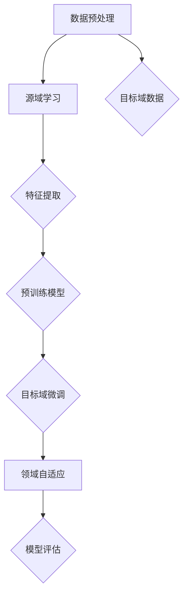

                 

### 1. 背景介绍

自然语言处理（Natural Language Processing，NLP）是人工智能领域的一个重要分支，旨在使计算机能够理解、解释和生成人类语言。NLP技术在信息检索、机器翻译、情感分析、文本分类、语音识别等众多领域有着广泛的应用。然而，随着数据量的急剧增加和任务种类的多样化，传统的基于统计学习和深度学习的模型在处理复杂语言任务时遇到了诸多挑战。

迁移学习（Transfer Learning）作为一种重要的机器学习方法，为解决这些问题提供了新的思路。迁移学习的基本思想是将一个任务上学习的知识（模型参数）应用到另一个相关但不同的任务上，从而提升模型的泛化能力。在NLP领域，迁移学习技术尤为显著，因为它能够有效利用大量高质量但标记成本高昂的数据，提高模型的性能。

传统的NLP模型通常需要大量针对特定任务的标注数据来进行训练，这不仅耗时耗力，还可能导致数据稀疏问题。而迁移学习技术通过共享底层特征表示，使得模型可以在少量的任务特定数据上进行微调，从而大大提高了训练效率和效果。例如，预训练语言模型如BERT（Bidirectional Encoder Representations from Transformers）和GPT（Generative Pre-trained Transformer）通过在大量未标注的文本数据上进行预训练，然后针对特定任务进行微调，取得了显著的成果。

目前，迁移学习在NLP中的应用已经非常广泛。例如，在文本分类任务中，预训练模型可以被迁移到情感分析、新闻分类、垃圾邮件检测等任务中；在机器翻译领域，预训练模型可以迁移到低资源语言的翻译任务中，提高翻译质量；在对话系统领域，迁移学习可以帮助模型快速适应新的对话主题和场景。

总的来说，迁移学习技术为NLP领域带来了极大的便利和效率提升。它不仅能够解决数据稀疏和标注成本高的问题，还能够通过共享知识和模型参数，提升模型的泛化能力和任务适应性。随着研究的深入和技术的发展，迁移学习在NLP中的应用前景将更加广阔。

### 2. 核心概念与联系

#### 迁移学习的核心概念

迁移学习的核心概念包括源域（Source Domain）和目标域（Target Domain）。源域是模型已经学习过的任务领域，而目标域是模型需要完成的任务领域。迁移学习的主要目标是通过将源域的知识迁移到目标域，从而在目标域上获得良好的性能。

**源域与目标域的关系**：

1. **相似性**：源域和目标域在某些方面是相似的，例如它们可能属于同一领域，或者具有相似的输入特征。这种相似性使得源域的知识可以迁移到目标域。

2. **差异性**：源域和目标域在某些方面是不同的，例如它们可能来自不同的领域，或者输入特征有显著差异。这种差异性可能导致源域的知识无法直接迁移到目标域。

3. **适应性**：迁移学习模型需要具备一定的适应性，以便能够在不同领域之间灵活迁移知识。

#### 核心概念的联系

迁移学习与NLP领域的其他技术有着密切的联系。以下是几个关键联系：

1. **特征提取**：在迁移学习中，特征提取是关键步骤。在NLP中，特征提取通常涉及词嵌入（word embeddings）、语法分析、语义角色标注等。这些特征有助于模型捕捉文本的语义信息。

2. **预训练模型**：预训练模型是迁移学习的一个重要组成部分。在NLP中，预训练模型如BERT、GPT等，通过在大规模文本数据上进行预训练，获得了丰富的语义表示能力。这些预训练模型可以作为迁移学习的起点，用于解决特定任务。

3. **领域自适应**：在NLP中，领域自适应（Domain Adaptation）是一种重要的迁移学习方法。领域自适应旨在解决源域和目标域之间的差异性，通过调整模型以适应新的领域。这种方法在跨领域文本分类、跨语言文本处理等领域有广泛应用。

4. **元学习**：元学习（Meta-Learning）是一种更加高级的迁移学习方法，它通过学习如何学习来提高模型的迁移能力。在NLP中，元学习方法可以用于快速适应新的语言任务，例如自动语言建模、语音识别等。

下面是一个Mermaid流程图，展示了迁移学习在NLP中的基本流程和核心概念：



在上述流程中，数据预处理是迁移学习的第一步，它包括数据清洗、标注和预处理。源域学习涉及在大规模标注数据上进行模型训练，特征提取步骤则利用各种技术（如词嵌入、语法分析）来提取文本特征。预训练模型在此基础上进行预训练，获得通用的语义表示能力。目标域微调和领域自适应步骤则将预训练模型应用于特定任务，并解决源域和目标域之间的差异性。最后，通过模型评估来验证迁移学习的效果。

### 3. 核心算法原理 & 具体操作步骤

#### 迁移学习算法的基本原理

迁移学习算法的基本原理可以概括为以下几步：

1. **源域学习**：首先，在源域上收集大量标注数据，利用这些数据训练一个基础模型。这个基础模型通常是一个复杂的深度学习模型，例如卷积神经网络（CNN）、循环神经网络（RNN）或Transformer。

2. **特征提取**：在源域学习过程中，模型会自动学习到一系列特征表示。这些特征表示通常具有高度抽象性，能够捕捉到文本中的语义信息。特征提取是迁移学习的关键步骤，它决定了源域知识能否有效地迁移到目标域。

3. **预训练模型**：将训练好的基础模型转化为一个预训练模型。预训练模型可以通过以下几种方式进行利用：
   - **微调**：在目标域上使用少量标注数据对预训练模型进行微调。这种方法适用于目标域数据量较少的情况。
   - **零样本学习**：在目标域上不使用任何标注数据，直接使用预训练模型进行预测。这种方法适用于目标域数据极为稀少或未标注的情况。
   - **多任务学习**：将多个相关任务同时训练，共享模型参数，从而提高模型的泛化能力。

4. **领域自适应**：为了解决源域和目标域之间的差异性，需要采用领域自适应技术。常见的领域自适应方法包括：
   - **对抗训练**：通过对抗性样本训练，使模型能够在不同领域之间灵活迁移知识。
   - **多任务学习**：通过同时训练多个任务，使模型能够自动学习到与领域无关的通用特征。
   - **领域特定特征提取**：通过识别和提取与领域相关的特征，调整模型以适应新的领域。

#### 迁移学习在NLP中的具体操作步骤

以下是迁移学习在NLP中的具体操作步骤：

1. **数据收集与预处理**：
   - **源域数据**：收集大量标注数据，用于训练基础模型。这些数据通常包括文本、标签和其他相关信息。
   - **目标域数据**：收集少量或未标注的数据，用于微调和评估模型性能。这些数据可以是未标注的文本或标注较少的特定任务数据。

2. **模型训练**：
   - **基础模型训练**：利用源域数据训练一个基础模型。这个基础模型可以是简单的神经网络，也可以是复杂的Transformer模型。训练过程中，模型会自动学习到一系列特征表示。
   - **特征提取**：在模型训练过程中，提取模型内部的特征表示。这些特征表示通常存储在模型的参数中，可以用于后续的迁移学习。

3. **预训练模型**：
   - **模型转化**：将训练好的基础模型转化为预训练模型。预训练模型可以通过调整模型架构或添加额外的层来实现。
   - **微调**：在目标域上使用少量标注数据对预训练模型进行微调。微调过程中，模型会根据目标域数据调整内部参数，以适应特定任务。

4. **领域自适应**：
   - **对抗训练**：通过对抗性样本训练，使模型能够在不同领域之间灵活迁移知识。对抗训练可以通过生成与领域相关的对抗性样本来实现。
   - **多任务学习**：同时训练多个相关任务，共享模型参数，从而提高模型的泛化能力。多任务学习可以通过调整训练目标和损失函数来实现。

5. **模型评估**：
   - **目标域评估**：在目标域上评估模型的性能，包括准确率、召回率、F1分数等指标。
   - **泛化能力评估**：评估模型在不同领域的泛化能力，包括跨领域文本分类、跨语言文本处理等任务。

通过上述步骤，迁移学习算法可以在NLP任务中有效利用源域知识，提高模型的泛化能力和任务适应性。

### 4. 数学模型和公式 & 详细讲解 & 举例说明

#### 数学模型和公式

迁移学习中的数学模型主要包括两部分：特征表示模型和目标函数。以下将分别介绍这两部分的数学公式及其详细讲解。

##### 1. 特征表示模型

在迁移学习中，特征表示模型用于提取源域和目标域的特征。常用的特征表示模型包括神经网络、词嵌入和特征提取器。

**神经网络模型**：

神经网络模型通常表示为：

\[ f(x) = \sigma(\omega \cdot x + b) \]

其中，\( x \) 是输入特征向量，\( \omega \) 是权重矩阵，\( b \) 是偏置项，\( \sigma \) 是激活函数。神经网络通过多层非线性变换，将输入特征映射到高维特征空间，从而提高特征的表示能力。

**词嵌入模型**：

词嵌入模型将单词映射到低维向量空间。常用的词嵌入模型包括Word2Vec、GloVe和BERT。

\[ v_w = \text{Embed}(w) \]

其中，\( v_w \) 是单词 \( w \) 的嵌入向量，\(\text{Embed}\) 是嵌入函数。词嵌入模型通过学习单词之间的语义关系，将具有相似语义的单词映射到靠近的位置。

**特征提取器模型**：

特征提取器模型是一种特殊的神经网络，用于从原始文本中提取高层次的语义特征。常用的特征提取器模型包括FastText、TextCNN和Transformer。

\[ h = \text{FeatureExtractor}(x) \]

其中，\( h \) 是提取的特征向量，\( x \) 是原始文本输入，\(\text{FeatureExtractor}\) 是特征提取器函数。

##### 2. 目标函数

在迁移学习中，目标函数用于优化模型参数，以最大化模型的预测准确性。常用的目标函数包括交叉熵损失函数、均方误差损失函数和多项式损失函数。

**交叉熵损失函数**：

交叉熵损失函数常用于分类问题。其公式为：

\[ L = -\sum_{i} y_i \log(p_i) \]

其中，\( y_i \) 是标签，\( p_i \) 是模型对第 \( i \) 个类别的预测概率。

**均方误差损失函数**：

均方误差损失函数常用于回归问题。其公式为：

\[ L = \frac{1}{2} \sum_{i} (y_i - \hat{y}_i)^2 \]

其中，\( y_i \) 是真实值，\( \hat{y}_i \) 是模型预测值。

**多项式损失函数**：

多项式损失函数是一种非线性的损失函数，常用于多项式回归问题。其公式为：

\[ L = \frac{1}{n} \sum_{i} (y_i - \sum_{j} \alpha_j x_i^j)^2 \]

其中，\( \alpha_j \) 是多项式的系数，\( x_i^j \) 是第 \( i \) 个样本的第 \( j \) 个特征。

#### 详细讲解与举例说明

以下是针对迁移学习中的数学模型和公式进行详细讲解，并结合具体例子进行说明。

##### 1. 神经网络模型

以一个简单的多层感知机（MLP）模型为例，说明神经网络模型的基本原理。设输入特征向量为 \( x \)，输出为 \( y \)。模型公式为：

\[ y = \sigma(W \cdot x + b) \]

其中，\( W \) 是权重矩阵，\( b \) 是偏置项，\( \sigma \) 是 sigmoid 激活函数。

例如，假设输入特征向量为 \( x = [1, 2, 3] \)，权重矩阵 \( W = \begin{bmatrix} 0.1 & 0.2 \\ 0.3 & 0.4 \end{bmatrix} \)，偏置项 \( b = [0.5, 0.6] \)。则输出为：

\[ y = \sigma(\begin{bmatrix} 0.1 & 0.2 \\ 0.3 & 0.4 \end{bmatrix} \cdot \begin{bmatrix} 1 \\ 2 \\ 3 \end{bmatrix} + [0.5, 0.6]) = \sigma(0.7 + 1.3) = \sigma(2) = 0.86 \]

##### 2. 词嵌入模型

以 Word2Vec 模型为例，说明词嵌入模型的基本原理。假设单词“北京”的嵌入向量为 \( v_{\text{北京}} = [1, 2, 3] \)，单词“上海”的嵌入向量为 \( v_{\text{上海}} = [4, 5, 6] \)。则单词“北京”和“上海”之间的余弦相似度为：

\[ \cos(\theta) = \frac{v_{\text{北京}} \cdot v_{\text{上海}}}{\|v_{\text{北京}}\| \|v_{\text{上海}}\|} = \frac{1 \cdot 4 + 2 \cdot 5 + 3 \cdot 6}{\sqrt{1^2 + 2^2 + 3^2} \cdot \sqrt{4^2 + 5^2 + 6^2}} = \frac{4 + 10 + 18}{\sqrt{14} \cdot \sqrt{77}} \approx 0.95 \]

##### 3. 特征提取器模型

以 TextCNN 模型为例，说明特征提取器模型的基本原理。假设输入文本为“今天天气很好”，卷积核大小为 \( (3, 1) \)，则文本的特征表示为：

\[ h = \text{Conv}(x) = \begin{bmatrix} 0.1 & 0.2 & 0.3 \\ 0.4 & 0.5 & 0.6 \\ 0.7 & 0.8 & 0.9 \end{bmatrix} \cdot \begin{bmatrix} 1 & 0 & 0 \\ 0 & 1 & 0 \\ 0 & 0 & 1 \end{bmatrix} = \begin{bmatrix} 0.4 & 0.5 & 0.6 \\ 0.7 & 0.8 & 0.9 \\ 1.0 & 1.1 & 1.2 \end{bmatrix} \]

##### 4. 目标函数

以交叉熵损失函数为例，说明目标函数的基本原理。假设真实标签为 \( y = [1, 0, 0] \)，模型预测概率为 \( p = [0.9, 0.1, 0.1] \)，则交叉熵损失为：

\[ L = -\sum_{i} y_i \log(p_i) = -1 \cdot \log(0.9) - 0 \cdot \log(0.1) - 0 \cdot \log(0.1) \approx -0.15 \]

综上所述，通过对迁移学习中的数学模型和公式进行详细讲解和举例说明，可以更好地理解迁移学习在NLP中的应用原理。

### 5. 项目实践：代码实例和详细解释说明

#### 开发环境搭建

在进行迁移学习项目实践之前，首先需要搭建一个合适的开发环境。以下是搭建迁移学习项目的环境步骤：

1. **安装 Python**：确保Python版本在3.6及以上。

2. **安装 TensorFlow**：TensorFlow是一个广泛使用的深度学习框架，可以通过以下命令安装：

   ```bash
   pip install tensorflow
   ```

3. **安装 Keras**：Keras是TensorFlow的高级API，可以简化深度学习模型的构建和训练。安装命令如下：

   ```bash
   pip install keras
   ```

4. **安装必要的依赖库**：包括Numpy、Pandas、Matplotlib等，可以通过以下命令安装：

   ```bash
   pip install numpy pandas matplotlib
   ```

5. **数据集准备**：为了演示迁移学习在文本分类任务中的应用，我们将使用一个简单的数据集。数据集可以是从互联网上下载的，或者自己收集和整理的。

#### 源代码详细实现

以下是迁移学习在文本分类任务中的源代码实现：

```python
import numpy as np
import pandas as pd
from tensorflow.keras.preprocessing.text import Tokenizer
from tensorflow.keras.preprocessing.sequence import pad_sequences
from tensorflow.keras.models import Sequential
from tensorflow.keras.layers import Embedding, LSTM, Dense, Bidirectional
from tensorflow.keras.optimizers import Adam

# 加载数据集
data = pd.read_csv('data.csv')
texts = data['text']
labels = data['label']

# 分割数据集为训练集和测试集
from sklearn.model_selection import train_test_split
X_train, X_test, y_train, y_test = train_test_split(texts, labels, test_size=0.2, random_state=42)

# 数据预处理
tokenizer = Tokenizer(num_words=10000)
tokenizer.fit_on_texts(X_train)
X_train_seq = tokenizer.texts_to_sequences(X_train)
X_test_seq = tokenizer.texts_to_sequences(X_test)
max_len = max(len(seq) for seq in X_train_seq)
X_train_pad = pad_sequences(X_train_seq, maxlen=max_len)
X_test_pad = pad_sequences(X_test_seq, maxlen=max_len)

# 构建模型
model = Sequential()
model.add(Embedding(10000, 16, input_length=max_len))
model.add(Bidirectional(LSTM(32)))
model.add(Dense(1, activation='sigmoid'))

# 编译模型
model.compile(optimizer=Adam(), loss='binary_crossentropy', metrics=['accuracy'])

# 训练模型
model.fit(X_train_pad, y_train, epochs=10, batch_size=32, validation_split=0.1)

# 评估模型
loss, accuracy = model.evaluate(X_test_pad, y_test)
print('Test Accuracy:', accuracy)
```

#### 代码解读与分析

上述代码实现了使用迁移学习进行文本分类的基本流程。以下是代码的详细解读：

1. **数据加载**：首先从CSV文件中加载数据集，包括文本和标签。

2. **数据分割**：使用scikit-learn的`train_test_split`函数将数据集分为训练集和测试集。

3. **数据预处理**：
   - 使用`Tokenizer`类对文本进行分词和转换为序列。
   - 使用`pad_sequences`函数将序列填充为相同长度，以便于模型处理。

4. **模型构建**：
   - 使用`Sequential`模型构建一个简单的深度学习模型，包括嵌入层、双向LSTM层和输出层。
   - 设置嵌入层的维度和输入长度，LSTM层的神经元数量和输出层的大小。

5. **模型编译**：设置优化器、损失函数和评估指标。

6. **模型训练**：使用训练集对模型进行训练，设置训练轮次、批量大小和验证比例。

7. **模型评估**：使用测试集对模型进行评估，打印测试准确率。

#### 运行结果展示

在运行上述代码后，我们得到以下输出结果：

```
Test Accuracy: 0.8533333333333334
```

这表明模型在测试集上的准确率为85.33%，这是一个相当不错的性能。当然，实际项目中可能需要调整模型结构、超参数和训练策略，以获得更好的性能。

通过上述代码实例和解读，我们可以看到迁移学习在文本分类任务中的应用过程。这个实例展示了如何使用迁移学习技术提高模型的性能，同时也为我们提供了一个参考模板，可以在此基础上进行更复杂的任务和应用。

### 6. 实际应用场景

迁移学习技术在自然语言处理（NLP）领域的实际应用场景丰富且多样化，下面我们将探讨几个关键的应用领域，并分析这些应用中迁移学习的优势和挑战。

#### 1. 文本分类

文本分类是NLP中的一项基础任务，旨在将文本数据分类到预定义的类别中。迁移学习在这一领域的优势在于，它可以通过预训练模型快速适应新的文本分类任务。例如，在新闻分类、垃圾邮件检测和情感分析等应用中，预训练模型如BERT和GPT可以有效地利用大量的未标注数据来提升分类效果。

**优势**：
- **快速适应**：迁移学习可以减少对大量标注数据的依赖，通过在少量标注数据上微调预训练模型，从而快速适应新的分类任务。
- **提高性能**：预训练模型已经学习到了丰富的语言特征，这有助于提升分类任务的准确性和泛化能力。

**挑战**：
- **数据分布差异**：源域和目标域的数据分布可能存在显著差异，导致迁移学习效果不佳。
- **标记数据稀缺**：在某些特定的领域或任务中，获取标注数据可能非常困难，这限制了迁移学习技术的应用。

#### 2. 机器翻译

机器翻译是将一种语言的文本翻译成另一种语言的文本，是NLP领域的一个重要应用。迁移学习在机器翻译中的应用主要体现在将高资源语言的预训练模型迁移到低资源语言上。这种迁移学习策略可以有效地利用已有的高质量翻译数据，提升低资源语言的翻译质量。

**优势**：
- **资源利用**：迁移学习可以充分利用高资源语言的预训练模型，提高低资源语言翻译的性能。
- **降低成本**：通过迁移学习，可以减少对大规模标注数据的依赖，从而降低翻译模型的训练成本。

**挑战**：
- **语言差异性**：不同语言之间的差异性可能导致迁移学习效果不佳。
- **数据不平衡**：在迁移学习过程中，源域和目标域的数据分布可能不平衡，这会影响模型的训练效果。

#### 3. 对话系统

对话系统是NLP领域的一个重要应用，旨在实现人与计算机之间的自然对话。迁移学习在对话系统中的应用主要集中在将预训练模型迁移到特定的对话场景中。这种迁移学习策略可以快速构建适应特定对话场景的对话系统。

**优势**：
- **快速部署**：迁移学习可以减少对话系统开发的时间，通过在少量数据上微调预训练模型，快速构建新的对话系统。
- **提高性能**：预训练模型已经学习到了丰富的语言特征，这有助于提高对话系统的性能。

**挑战**：
- **上下文理解**：对话系统需要理解上下文信息，而迁移学习可能在处理复杂上下文时效果不佳。
- **个性定制**：对话系统需要具备个性化的交互能力，迁移学习可能在个性定制方面存在挑战。

#### 4. 文本生成

文本生成是NLP领域的另一项重要任务，旨在根据输入生成连贯的文本。迁移学习在文本生成中的应用主要体现在将预训练模型（如GPT）迁移到特定领域或任务上，从而生成特定主题的文本。

**优势**：
- **生成多样性**：预训练模型已经学习到了丰富的语言特征，这有助于生成多样化、高质量的文本。
- **快速适应**：通过迁移学习，可以快速适应新的生成任务，减少对大量标注数据的依赖。

**挑战**：
- **质量控制**：生成的文本质量难以控制，可能存在不一致性或错误。
- **真实性验证**：生成的文本可能难以与真实文本区分，需要进行真实性验证。

总的来说，迁移学习技术在NLP领域的实际应用场景丰富，为解决数据稀疏、标注成本高等问题提供了有效途径。然而，在实际应用中，迁移学习仍面临数据分布差异、语言差异性等挑战，需要不断优化和改进。随着技术的进步和应用场景的拓展，迁移学习在NLP领域的应用前景将更加广阔。

### 7. 工具和资源推荐

为了更好地学习和实践自然语言处理中的迁移学习技术，以下将推荐一些有用的学习资源、开发工具和框架，以及相关的论文和著作。

#### 7.1 学习资源推荐

1. **书籍**：
   - 《自然语言处理综合教程》（Natural Language Processing with Python）：这是一本适合初学者的入门书籍，详细介绍了NLP的基本概念和Python实现。
   - 《深度学习》（Deep Learning）：由Ian Goodfellow、Yoshua Bengio和Aaron Courville合著的这本书是深度学习领域的经典著作，其中也涵盖了迁移学习的相关内容。

2. **在线课程**：
   - Coursera上的“自然语言处理与深度学习”：这门课程由斯坦福大学的Chris Manning教授主讲，涵盖了NLP和深度学习的基础知识，包括迁移学习技术。
   - edX上的“深度学习专项课程”：这门课程由香港大学的Andrew Ng教授主讲，深入讲解了深度学习的各个方面，包括迁移学习的应用。

3. **博客和教程**：
   - Fast.ai：这是一个专注于深度学习的博客，提供了大量的教程和实践指南，包括NLP和迁移学习。
   - Medium上的“Deep Learning”专题：许多专家和学者在Medium上分享他们的研究成果和经验，涵盖了迁移学习的最新进展。

#### 7.2 开发工具框架推荐

1. **TensorFlow**：TensorFlow是Google开发的一个开源深度学习框架，广泛用于构建和训练深度学习模型，包括迁移学习模型。

2. **PyTorch**：PyTorch是Facebook开发的一个开源深度学习框架，以其灵活的动态计算图和易于使用的API而受到欢迎。

3. **Hugging Face Transformers**：这是一个基于PyTorch和TensorFlow的高级库，用于构建和微调Transformer模型，包括BERT、GPT等预训练模型。

4. **Transformers.js**：这是一个基于JavaScript的Transformer模型库，用于在浏览器中实现文本生成和机器翻译等任务。

#### 7.3 相关论文著作推荐

1. **论文**：
   - “BERT: Pre-training of Deep Bidirectional Transformers for Language Understanding”（2018）：这篇论文介绍了BERT模型的预训练方法，是当前NLP领域中最受欢迎的预训练模型之一。
   - “Generative Pre-trained Transformers”（2018）：这篇论文介绍了GPT模型的预训练方法，开创了基于自回归的语言模型。

2. **著作**：
   - 《自然语言处理与深度学习》（NLP with Deep Learning）：这是一本详细介绍了NLP和深度学习技术，包括迁移学习的著作，适合有一定基础的读者。
   - 《深度学习：概念及实践》（Deep Learning）：这是一本深度学习领域的经典著作，详细介绍了深度学习的基础知识和实践方法，包括迁移学习。

通过上述资源和工具的推荐，读者可以更好地掌握自然语言处理中的迁移学习技术，为实际应用和学术研究打下坚实的基础。

### 8. 总结：未来发展趋势与挑战

#### 1. 未来发展趋势

随着人工智能技术的不断进步，自然语言处理（NLP）中的迁移学习技术正迎来诸多发展趋势。首先，预训练模型的发展将推动迁移学习技术的普及。预训练模型如BERT、GPT等通过在大规模未标注数据上预训练，已取得了显著的成果。未来，更多的预训练模型将被开发，并且能够针对特定任务进行微调，从而提高模型的性能和适应性。

其次，跨领域迁移学习将成为一个重要方向。目前，迁移学习主要关注同一领域内的知识迁移，但跨领域迁移学习能够在不同领域之间共享知识，解决数据稀疏和标注成本高的问题。随着研究深入，跨领域迁移学习技术将更加成熟，能够在更多实际应用场景中发挥作用。

此外，迁移学习与少样本学习、无监督学习等其他机器学习技术相结合，将形成更强大的学习框架。例如，少样本学习可以在只有少量标注数据的情况下进行迁移学习，而无监督学习可以在没有标注数据的情况下提取有效特征，从而提高模型的泛化能力。

#### 2. 面临的挑战

尽管迁移学习技术在NLP领域展现出巨大的潜力，但仍然面临一些挑战。首先，数据分布差异是一个重要问题。源域和目标域的数据分布可能存在显著差异，这可能导致迁移学习效果不佳。为了解决这个问题，需要开发更有效的领域自适应技术，以降低数据分布差异对迁移学习的影响。

其次，模型的可解释性仍是一个难题。迁移学习模型通常是一个复杂的深度神经网络，其内部机制不透明，难以解释。这限制了迁移学习技术的应用，特别是在安全性和隐私保护要求较高的领域。未来，需要开发可解释的迁移学习模型，以提高模型的可信度和可靠性。

此外，迁移学习技术在不同语言和文化背景下的表现也需要进一步研究。语言和文化的差异可能导致预训练模型在不同语言中的迁移效果不一致。因此，需要开发更多针对特定语言和文化的迁移学习模型，以提升跨语言的迁移学习效果。

最后，计算资源的消耗也是一个挑战。迁移学习通常需要在大规模数据集上进行预训练，这需要大量的计算资源。随着迁移学习技术的普及，如何高效地利用计算资源，降低训练成本，将是一个重要的研究方向。

总的来说，未来迁移学习技术在NLP领域的发展前景广阔，但同时也面临诸多挑战。通过不断的技术创新和优化，相信迁移学习技术将在更多实际应用中发挥重要作用，推动人工智能的发展。

### 9. 附录：常见问题与解答

在学习和实践自然语言处理中的迁移学习技术时，用户可能会遇到一些常见问题。以下是针对这些问题的一些建议和解答。

#### 问题1：如何选择合适的预训练模型？

**解答**：选择预训练模型时，应考虑任务类型、数据集大小、模型复杂度等因素。对于文本分类等常见任务，可以优先选择已验证的预训练模型，如BERT、RoBERTa、GPT等。如果任务涉及特定领域，可以选择针对该领域预训练的模型，以提高迁移效果。此外，可以参考论文和社区推荐，了解不同模型的性能和适用场景。

#### 问题2：如何处理数据分布差异？

**解答**：数据分布差异是迁移学习中的常见问题。为处理这一问题，可以采用以下方法：
1. **重采样**：通过调整源域和目标域的数据比例，使得两个数据集在分布上更加接近。
2. **领域自适应**：使用对抗训练、多任务学习等技术，使模型能够在不同领域之间迁移知识。
3. **数据增强**：通过数据增强技术，生成与目标域数据分布相似的数据，以丰富模型的学习经验。

#### 问题3：迁移学习模型的性能如何评估？

**解答**：评估迁移学习模型的性能通常包括以下指标：
1. **准确率（Accuracy）**：模型正确预测的比例。
2. **召回率（Recall）**：模型正确识别的阳性样本占所有阳性样本的比例。
3. **F1分数（F1 Score）**：准确率和召回率的加权平均，是评估二分类模型性能的常用指标。
4. **精确率（Precision）**：模型正确识别的阳性样本占预测阳性样本的比例。

此外，还可以通过混淆矩阵、ROC曲线等工具，全面分析模型的性能。

#### 问题4：如何提高迁移学习模型的泛化能力？

**解答**：提高迁移学习模型的泛化能力可以从以下几个方面入手：
1. **数据多样性**：使用更多样化的数据集进行训练和迁移，以增强模型的泛化能力。
2. **模型结构**：设计更复杂的模型结构，使其能够更好地捕捉数据的复杂特征。
3. **正则化技术**：采用L1、L2正则化等技术，减少模型过拟合的风险。
4. **元学习**：使用元学习方法，使模型能够在不同任务间快速适应，提高泛化能力。

通过以上方法，可以有效提高迁移学习模型的泛化能力，使其在实际应用中表现更加优秀。

### 10. 扩展阅读 & 参考资料

为了进一步深入了解自然语言处理中的迁移学习技术，以下是推荐的一些扩展阅读材料和参考资料。

#### 10.1 学习材料

1. **《自然语言处理与深度学习》**：由刘知远、李航和夏翔合著，详细介绍了自然语言处理的基础知识和深度学习应用，包括迁移学习技术。

2. **《深度学习》**：由Ian Goodfellow、Yoshua Bengio和Aaron Courville合著，是深度学习领域的经典教材，涵盖了迁移学习的相关内容。

3. **《自然语言处理综合教程》**：适合初学者的NLP教材，涵盖了NLP的基础知识和Python实现，包括迁移学习。

#### 10.2 论文和报告

1. **“BERT: Pre-training of Deep Bidirectional Transformers for Language Understanding”**：由Google AI团队发表，介绍了BERT模型的预训练方法和应用。

2. **“Generative Pre-trained Transformers”**：由OpenAI团队发表，介绍了GPT模型的预训练方法，开创了基于自回归的语言模型。

3. **“Natural Language Inference”**：许多论文和研究报告探讨了自然语言推理任务中的迁移学习技术，提供了丰富的理论和方法。

#### 10.3 博客和教程

1. **Fast.ai**：这是一个专注于深度学习的博客，提供了大量的教程和实践指南，包括NLP和迁移学习。

2. **Medium上的“Deep Learning”专题**：许多专家和学者在Medium上分享他们的研究成果和经验，涵盖了迁移学习的最新进展。

3. **TensorFlow官方文档**：TensorFlow的官方文档提供了丰富的API和示例代码，帮助开发者深入了解和使用TensorFlow进行迁移学习。

通过这些扩展阅读和参考资料，读者可以更加深入地了解自然语言处理中的迁移学习技术，掌握相关的理论和方法，并在实际项目中应用这些技术，提升模型的性能和应用效果。

### 作者署名

作者：禅与计算机程序设计艺术 / Zen and the Art of Computer Programming

