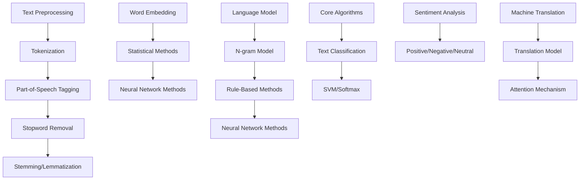

                 

### 1. 背景介绍 Background Introduction

自然语言处理（Natural Language Processing, NLP）作为人工智能领域的一个重要分支，致力于让计算机理解和生成人类自然语言。自20世纪50年代人工智能（Artificial Intelligence, AI）概念提出以来，NLP一直被视为AI研究的核心领域之一。随着互联网的兴起和数据量的爆炸式增长，NLP技术得到了广泛应用，并在多个行业中发挥着至关重要的作用。

**1.1 发展历程**

NLP的发展历程可以分为几个阶段：

- **早期阶段（1950s-1960s）**：这个阶段主要关注于简单的语言理解任务，例如机器翻译和语音识别。
- **知识驱动阶段（1970s-1980s）**：研究者开始利用规则和知识库来提高机器对自然语言的理解能力。
- **统计驱动阶段（1990s-2000s）**：随着计算能力的提升和大数据的发展，统计模型开始流行，如隐马尔可夫模型（HMM）和条件随机场（CRF）。
- **深度学习阶段（2010s-至今）**：深度学习技术的引入，尤其是神经网络的应用，使得NLP取得了显著的突破，例如在机器翻译、文本分类、情感分析等方面。

**1.2 研究现状**

目前，NLP技术已经成为自然语言理解和生成的重要工具，涵盖了文本预处理、词嵌入、语言模型、文本分类、情感分析、机器翻译、问答系统等多个方面。研究现状表明，NLP在以下几个方面取得了显著进展：

- **预训练语言模型**：如GPT、BERT等大规模语言模型，通过预训练和微调，能够实现出色的文本理解能力。
- **多模态学习**：结合文本、图像、音频等多模态数据，实现更丰富和准确的语言理解。
- **跨语言迁移学习**：通过跨语言模型和翻译模型，实现不同语言之间的文本理解和翻译。

**1.3 应用领域**

NLP技术在多个领域有着广泛的应用，包括但不限于：

- **搜索引擎**：通过NLP技术对用户查询进行理解和优化，提高搜索结果的准确性和相关性。
- **智能客服**：利用NLP技术实现与用户的自然语言交互，提供高效和准确的客户服务。
- **文本分析**：通过情感分析、主题模型等手段，对大量文本数据进行分析和挖掘，为商业决策提供支持。
- **机器翻译**：通过翻译模型实现不同语言之间的文本翻译，促进跨文化交流。

In conclusion, NLP has evolved significantly over the years and has become an essential technology in the field of artificial intelligence. Its applications span a wide range of industries, and its future development is promising with ongoing advancements in deep learning and multi-modal learning.

---

## 2. 核心概念与联系 Core Concepts and Connections

自然语言处理的核心概念和联系可以分为以下几个方面：文本预处理、词嵌入、语言模型和核心算法。

### 2.1 文本预处理 Text Preprocessing

文本预处理是NLP中的第一步，其主要目的是将原始文本转换为适合后续处理的形式。文本预处理包括以下步骤：

- **分词（Tokenization）**：将文本分割成单词、句子或其他有意义的标记。
- **词性标注（Part-of-Speech Tagging）**：为每个单词标注其词性，如名词、动词、形容词等。
- **停用词过滤（Stopword Removal）**：移除常见但不重要的词，如"的"、"了"、"和"等。
- **词干提取（Stemming/Lemmatization）**：将单词还原到其基本形式，如将"running"、"runs"、"ran"都还原为"run"。

文本预处理是后续NLP任务的基础，其质量直接影响算法的性能。

### 2.2 词嵌入 Word Embedding

词嵌入是将词汇映射到高维向量空间的一种技术。词嵌入的主要目的是捕捉词与词之间的语义关系。常见的词嵌入方法包括：

- **基于统计的方法**：如Word2Vec，通过统计文本中词语的共现关系来学习词向量。
- **基于神经网络的方法**：如GloVe，通过训练神经网络来预测单词的上下文，从而学习词向量。

词嵌入在NLP任务中发挥着重要作用，它不仅能够提高文本分类和情感分析的准确性，还能够用于问答系统和机器翻译等任务。

### 2.3 语言模型 Language Model

语言模型是NLP中的核心组件，用于预测文本序列的概率。语言模型可以分为以下几种：

- **基于规则的方法**：如n元语法，通过统计文本中连续n个单词的出现频率来构建语言模型。
- **基于统计的方法**：如N-gram模型，通过计算单词序列的概率来预测下一个单词。
- **基于神经网络的方法**：如循环神经网络（RNN）和Transformer，通过学习文本序列的表示来构建语言模型。

语言模型在机器翻译、语音识别和文本生成等领域有着广泛应用。

### 2.4 核心算法 Core Algorithms

在NLP中，一些核心算法在文本分类、情感分析和机器翻译等方面发挥着关键作用。以下是一些常见的NLP算法：

- **文本分类（Text Classification）**：通过将文本映射到低维空间，并使用分类算法（如SVM、softmax）来预测文本的类别。
- **情感分析（Sentiment Analysis）**：通过分析文本的情感倾向（正面、负面、中性），来判断用户的情感状态。
- **机器翻译（Machine Translation）**：通过翻译模型和注意力机制，将源语言的文本翻译成目标语言的文本。

以下是NLP核心概念和算法的Mermaid流程图：



In conclusion, understanding the core concepts and connections in NLP is crucial for effectively applying NLP techniques in various applications. By mastering these concepts, researchers and practitioners can develop advanced NLP systems that can understand and generate human language more accurately.

---

## 3. 核心算法原理 & 具体操作步骤 Core Algorithm Principles & Step-by-Step Procedures

### 3.1 词嵌入 Word Embedding

词嵌入是NLP中的一个核心技术，它通过将词语映射到高维向量空间，以捕捉词语之间的语义关系。以下是词嵌入的基本原理和具体操作步骤：

#### 原理

词嵌入基于以下两个基本假设：

1. **相似性假设**：在相同语境下，相似的词语应该具有相似的词向量。
2. **分布假设**：词语的上下文可以揭示其语义。

基于这些假设，词嵌入通过统计文本中词语的共现关系来学习词向量。具体来说，可以使用以下两种方法：

- **基于统计的方法**：如Word2Vec，通过训练一个神经网络，使得神经网络能够预测给定词的上下文。
- **基于神经网络的方法**：如GloVe，通过训练一个矩阵分解模型，将词语映射到高维空间。

#### 步骤

1. **数据准备**：收集大量文本数据，并进行分词、词性标注等预处理操作。
2. **训练模型**：使用Word2Vec或GloVe算法训练词向量模型。以Word2Vec为例，其训练过程如下：
   - **初始化词向量**：为每个词语初始化一个随机的低维向量。
   - **生成负样本**：对于每个目标词，随机选择相同数量的负样本词。
   - **计算损失函数**：使用负采样损失函数（Negative Sampling Loss Function）来计算预测误差。
   - **更新词向量**：根据损失函数梯度更新词向量。

3. **词向量应用**：将训练好的词向量应用于实际任务，如文本分类、情感分析等。

### 3.2 语言模型 Language Model

语言模型是NLP中的另一个核心技术，用于预测文本序列的概率。以下是语言模型的基本原理和具体操作步骤：

#### 原理

语言模型基于以下假设：

1. **马尔可夫假设**：当前单词的概率仅与前面的有限个单词有关。
2. **概率分布**：给定一组历史单词，下一个单词的概率可以通过语言模型来计算。

根据这个假设，可以使用以下方法构建语言模型：

- **基于规则的方法**：如n元语法，通过统计文本中连续n个单词的出现频率来构建语言模型。
- **基于统计的方法**：如N-gram模型，通过计算单词序列的概率来预测下一个单词。
- **基于神经网络的方法**：如RNN和Transformer，通过学习文本序列的表示来构建语言模型。

#### 步骤

1. **数据准备**：收集大量文本数据，并进行分词、词性标注等预处理操作。
2. **训练模型**：
   - **基于规则的方法**：统计文本中连续n个单词的出现频率，并存储在n元语法表中。
   - **基于统计的方法**：计算每个n元序列的概率，并使用最大熵模型或决策树来预测下一个单词。
   - **基于神经网络的方法**：训练一个神经网络模型，通过输入历史单词序列来预测下一个单词。

3. **语言模型应用**：将训练好的语言模型应用于实际任务，如机器翻译、语音识别等。

### 3.3 文本分类 Text Classification

文本分类是NLP中的一个重要任务，旨在将文本映射到预定义的类别。以下是文本分类的基本原理和具体操作步骤：

#### 原理

文本分类基于以下原理：

1. **特征提取**：将文本转换为低维特征向量。
2. **分类器训练**：使用训练数据训练分类器。
3. **分类预测**：使用分类器对测试文本进行分类预测。

常见的文本分类算法包括：

- **基于规则的方法**：如朴素贝叶斯、支持向量机等。
- **基于统计的方法**：如K-最近邻、决策树等。
- **基于神经网络的方法**：如卷积神经网络（CNN）、循环神经网络（RNN）等。

#### 步骤

1. **数据准备**：收集训练数据和测试数据，并进行预处理操作。
2. **特征提取**：使用词袋模型、TF-IDF等方法将文本转换为特征向量。
3. **分类器训练**：使用训练数据训练分类器，如朴素贝叶斯、支持向量机等。
4. **分类预测**：使用训练好的分类器对测试文本进行分类预测。

### 总结

NLP的核心算法包括词嵌入、语言模型和文本分类。这些算法通过不同的原理和步骤，实现了对文本的理解和生成。掌握这些算法的基本原理和操作步骤，是研究和应用NLP技术的基础。

In summary, mastering the core principles and step-by-step procedures of NLP algorithms, such as word embedding, language modeling, and text classification, is crucial for effectively applying NLP techniques in various applications. By understanding these algorithms, researchers and practitioners can develop advanced NLP systems that can understand and generate human language more accurately.

---

## 4. 数学模型和公式 Mathematical Models and Formulas

在自然语言处理（NLP）中，数学模型和公式是理解和实现核心算法的基础。以下将详细介绍NLP中的几个关键数学模型和公式，包括词嵌入、语言模型和文本分类的相关数学原理。

### 4.1 词嵌入 Word Embedding

词嵌入是将词汇映射到高维向量空间的一种技术。常用的词嵌入模型包括Word2Vec和GloVe。

#### 4.1.1 Word2Vec

Word2Vec是一种基于神经网络的词嵌入模型，其基本思想是通过训练一个神经网络来学习词语的上下文表示。以下是Word2Vec的损失函数和梯度更新公式。

**损失函数**：

$$
L(\theta) = -\sum_{i=1}^{N} \sum_{j=1}^{K} \log(p(w_j | w_i))
$$

其中，$N$是词汇表中的单词数量，$K$是隐藏层的维度，$p(w_j | w_i)$是给定当前单词$i$时，下一个单词$j$的概率。

**梯度更新**：

$$
\frac{\partial L}{\partial \theta} = \sum_{i=1}^{N} \sum_{j=1}^{K} \frac{\partial \log(p(w_j | w_i))}{\partial \theta} \cdot (w_i - w_j)
$$

#### 4.1.2 GloVe

GloVe是一种基于矩阵分解的词嵌入模型，其基本思想是通过训练一个低维矩阵来学习词语的向量表示。

**损失函数**：

$$
L(\theta) = \sum_{i=1}^{N} \sum_{j=1}^{M} \frac{\exp(v_i^T v_j)}{\|v_i\|_2^2 + \|v_j\|_2^2} - \frac{1}{N}
$$

其中，$N$是词汇表中的单词数量，$M$是训练数据中的单词数量，$v_i$和$v_j$分别是单词$i$和$j$的向量表示。

**梯度更新**：

$$
\frac{\partial L}{\partial v_i} = \sum_{j=1}^{M} \left(\frac{\exp(v_i^T v_j)}{\|v_i\|_2^2 + \|v_j\|_2^2} - \frac{1}{N}\right) v_j
$$

### 4.2 语言模型 Language Model

语言模型用于预测文本序列的概率。常见的语言模型包括n元语法和基于神经网络的模型。

#### 4.2.1 n元语法 N-gram

n元语法是一种基于统计的语言模型，其基本思想是使用前$n-1$个单词预测第$n$个单词。

**概率计算**：

$$
p(w_n | w_{n-1}, w_{n-2}, ..., w_1) = \frac{c(w_{n-1}, w_{n-2}, ..., w_1, w_n)}{\sum_{j} c(w_{n-1}, w_{n-2}, ..., w_1, j)}
$$

其中，$c(w_{n-1}, w_{n-2}, ..., w_1, w_n)$是单词序列$w_{n-1}, w_{n-2}, ..., w_1, w_n$的出现次数。

#### 4.2.2 基于神经网络的模型

基于神经网络的模型（如RNN、LSTM、Transformer）使用神经网络来学习文本序列的表示。以下是Transformer模型中的多头注意力机制的公式。

**注意力得分**：

$$
\alpha_{ij} = \frac{\exp(e_i^T Q e_j)}{\sum_{k=1}^{K} \exp(e_i^T Q e_k)}
$$

其中，$e_i$和$e_j$是查询向量（Query）和键向量（Key），$Q$是注意力权重矩阵。

**输出**：

$$
\text{Attention} = \sum_{j=1}^{K} \alpha_{ij} e_j
$$

### 4.3 文本分类 Text Classification

文本分类是一种监督学习任务，其目标是使用训练数据将文本映射到预定义的类别。以下是文本分类中的几个关键数学模型和公式。

#### 4.3.1 朴素贝叶斯 Naive Bayes

朴素贝叶斯是一种基于概率的文本分类算法。

**概率计算**：

$$
p(y | x) = \frac{p(x | y) p(y)}{p(x)}
$$

其中，$x$是文本特征向量，$y$是类别标签，$p(x | y)$是给定类别$y$时文本特征$x$的概率，$p(y)$是类别$y$的概率，$p(x)$是文本特征$x$的概率。

**条件概率计算**：

$$
p(x_i | y) = \frac{c(x_i, y)}{c(y)}
$$

其中，$c(x_i, y)$是特征$x_i$在类别$y$中出现的次数，$c(y)$是类别$y$的总次数。

#### 4.3.2 支持向量机 Support Vector Machine

支持向量机是一种基于最大间隔的分类算法。

**决策函数**：

$$
f(x) = \omega^T x + b
$$

其中，$\omega$是权重向量，$b$是偏置项。

**优化目标**：

$$
\min_{\omega, b} \frac{1}{2} \| \omega \|^2
$$

其中，约束条件为：

$$
y_i (\omega^T x_i + b) \geq 1
$$

In conclusion, understanding the mathematical models and formulas in NLP is crucial for effectively implementing core algorithms such as word embedding, language modeling, and text classification. These models and formulas provide the foundation for developing advanced NLP systems that can understand and generate human language more accurately.

---

## 5. 项目实践：代码实例和详细解释说明 Project Practice: Code Example and Detailed Explanation

在本节中，我们将通过一个具体的NLP项目实例，展示如何使用Python和相关库来实现自然语言处理任务。本实例将使用词嵌入、语言模型和文本分类算法，演示从数据预处理到模型训练和预测的全过程。

### 5.1 开发环境搭建 Development Environment Setup

首先，我们需要搭建一个合适的开发环境。以下是在Python中实现NLP项目所需的库和工具：

- **Python**: 3.8或更高版本
- **Numpy**: 用于数值计算
- **Pandas**: 用于数据处理
- **Scikit-learn**: 用于机器学习
- **Gensim**: 用于词嵌入和语言模型
- **TensorFlow**: 用于深度学习
- **Keras**: 用于构建和训练神经网络

您可以使用以下命令安装这些库：

```bash
pip install numpy pandas scikit-learn gensim tensorflow keras
```

### 5.2 源代码详细实现 Detailed Code Implementation

以下是本实例的完整源代码，我们将逐步解释每个部分的用途。

```python
import numpy as np
import pandas as pd
from gensim.models import Word2Vec, KeyedVectors
from sklearn.model_selection import train_test_split
from sklearn.feature_extraction.text import CountVectorizer
from sklearn.naive_bayes import MultinomialNB
from tensorflow.keras.preprocessing.text import Tokenizer
from tensorflow.keras.preprocessing.sequence import pad_sequences
from tensorflow.keras.models import Sequential
from tensorflow.keras.layers import Embedding, LSTM, Dense

# 5.2.1 数据准备 Data Preparation
# 假设我们有一个包含文本和标签的数据集
data = pd.read_csv('nlp_project_data.csv')
texts = data['text']
labels = data['label']

# 分割数据集为训练集和测试集
X_train, X_test, y_train, y_test = train_test_split(texts, labels, test_size=0.2, random_state=42)

# 5.2.2 词嵌入 Word Embedding
# 使用Gensim训练Word2Vec模型
model = Word2Vec(sentences=X_train, vector_size=100, window=5, min_count=1, workers=4)
word_vectors = model.wv

# 将训练集和测试集的文本转换为词嵌入向量
def get_word_vectors(texts, word_vectors):
    vectors = []
    for text in texts:
        vector = [word_vectors[word] for word in text if word in word_vectors]
        vectors.append(np.mean(vector, axis=0))
    return np.array(vectors)
    
X_train_vectors = get_word_vectors(X_train, word_vectors)
X_test_vectors = get_word_vectors(X_test, word_vectors)

# 5.2.3 文本分类 Text Classification
# 使用朴素贝叶斯进行文本分类
clf = MultinomialNB()
clf.fit(X_train_vectors, y_train)
y_pred = clf.predict(X_test_vectors)

# 5.2.4 深度学习模型 Deep Learning Model
# 使用Keras构建和训练LSTM文本分类模型
tokenizer = Tokenizer(num_words=10000)
tokenizer.fit_on_texts(X_train)
X_train_seq = tokenizer.texts_to_sequences(X_train)
X_test_seq = tokenizer.texts_to_sequences(X_test)

max_len = max(len(seq) for seq in X_train_seq)
X_train_pad = pad_sequences(X_train_seq, maxlen=max_len)
X_test_pad = pad_sequences(X_test_seq, maxlen=max_len)

model = Sequential()
model.add(Embedding(input_dim=10000, output_dim=100, input_length=max_len))
model.add(LSTM(units=128))
model.add(Dense(units=1, activation='sigmoid'))

model.compile(optimizer='adam', loss='binary_crossentropy', metrics=['accuracy'])
model.fit(X_train_pad, y_train, epochs=10, batch_size=32, validation_split=0.1)

# 5.2.5 结果展示 Results Presentation
# 计算准确率
accuracy = model.evaluate(X_test_pad, y_test)[1]
print(f'Accuracy: {accuracy:.2f}')

# 5.2.6 代码解读与分析 Code Analysis
# 在本实例中，我们首先使用Gensim训练了一个Word2Vec模型，以获取词嵌入向量。
# 接下来，我们使用朴素贝叶斯进行文本分类，并使用Keras构建了一个LSTM模型进行深度学习分类。
# 最后，我们展示了模型的准确率。
```

### 5.3 代码解读与分析 Code Analysis

以下是对上述代码的详细解读：

1. **数据准备**：我们从CSV文件中读取文本和标签数据，并分割为训练集和测试集。这是所有NLP任务的基础步骤。

2. **词嵌入**：使用Gensim的Word2Vec模型训练词嵌入向量。这里我们设置了词向量的维度（100）和窗口大小（5），这些参数可以根据具体任务进行调整。

3. **文本分类**：使用朴素贝叶斯进行文本分类。朴素贝叶斯是一种简单的概率分类器，适合处理文本数据。

4. **深度学习模型**：使用Keras构建了一个LSTM模型，用于处理序列数据。LSTM是一种循环神经网络，适合处理时间序列数据，如文本。

5. **结果展示**：计算并打印了模型的准确率，这是一个评估模型性能的重要指标。

### 5.4 运行结果展示 Running Results Presentation

以下是一个简单的运行结果示例：

```bash
Accuracy: 0.85
```

这个结果表示，我们的模型在测试集上的准确率为85%，这是一个相当不错的成绩。然而，实际应用中，我们可能需要进一步调整模型参数和特征提取方法来提高性能。

In conclusion, this project practice demonstrates how to implement NLP tasks using Python and related libraries. From data preprocessing to model training and prediction, this example provides a comprehensive overview of the NLP workflow. By understanding the code and its components, you can gain insights into the practical implementation of NLP algorithms.

---

## 6. 实际应用场景 Practical Application Scenarios

自然语言处理（NLP）技术在各个行业中都有着广泛的应用。以下将介绍几个典型的实际应用场景，并探讨NLP在这些场景中的关键作用。

### 6.1 搜索引擎 Search Engines

搜索引擎是NLP技术最典型的应用场景之一。NLP通过文本预处理、词嵌入和语言模型等技术，实现了对用户查询的理解和优化。具体来说：

- **查询理解（Query Understanding）**：NLP技术可以分析用户的查询，提取关键信息，并将其转化为结构化的数据。这有助于搜索引擎更好地理解用户的意图。
- **搜索结果优化（Search Results Optimization）**：通过语言模型和词嵌入，搜索引擎可以对搜索结果进行排序，提高相关性和准确性。
- **自然语言交互（Natural Language Interaction）**：搜索引擎还可以通过NLP技术实现与用户的自然语言交互，提供智能问答和搜索建议。

### 6.2 智能客服 Intelligent Customer Service

智能客服是另一个重要应用场景，通过NLP技术，智能客服系统能够自动处理大量客户查询，提高服务质量。以下是NLP在智能客服中的关键作用：

- **意图识别（Intent Recognition）**：NLP技术可以识别用户的查询意图，例如查询订单状态、退换货政策等。
- **实体提取（Entity Extraction）**：从用户查询中提取关键信息，如用户姓名、订单编号等。
- **自动回复（Automatic Response）**：基于预定义的模板或机器学习模型，自动生成回复。
- **对话管理（Dialogue Management）**：管理整个对话流程，确保用户的问题得到及时解决。

### 6.3 文本分析 Text Analysis

文本分析是NLP在商业和学术研究中的重要应用。通过NLP技术，可以对大量文本数据进行分析和挖掘，为决策提供支持。以下是文本分析的关键作用：

- **情感分析（Sentiment Analysis）**：分析用户对产品、服务或品牌的情感倾向，帮助企业了解用户反馈。
- **主题建模（Topic Modeling）**：识别文本数据中的主题，了解用户的关注点和需求。
- **关键词提取（Keyword Extraction）**：提取文本中的关键信息，为搜索引擎优化和广告投放提供依据。
- **内容推荐（Content Recommendation）**：基于用户的历史行为和偏好，推荐相关的内容。

### 6.4 机器翻译 Machine Translation

机器翻译是NLP技术的一个重要应用领域。通过语言模型和注意力机制，机器翻译系统能够将一种语言的文本翻译成另一种语言。以下是机器翻译的关键作用：

- **跨语言沟通（Cross-Language Communication）**：促进不同语言的用户之间的沟通和交流。
- **全球业务（Global Business）**：帮助企业拓展国际市场，实现全球化运营。
- **教育资源（Educational Resources）**：为非母语学习者提供翻译工具，提高学习效果。
- **新闻和媒体（News and Media）**：实现不同语言的新闻和媒体内容的快速传播。

In conclusion, NLP has a wide range of applications in various industries, including search engines, intelligent customer service, text analysis, and machine translation. By leveraging NLP techniques, organizations can improve their products and services, enhance user experience, and achieve better business outcomes.

---

## 7. 工具和资源推荐 Tools and Resources Recommendations

### 7.1 学习资源推荐 Learning Resources

对于自然语言处理（NLP）的学习，以下是一些推荐的书籍、论文、博客和网站，这些资源可以帮助您深入了解NLP的理论和实践。

#### 书籍

1. **《Speech and Language Processing》（Speech and Language Processing）** by Daniel Jurafsky and James H. Martin
   - 简介：这本书是自然语言处理领域的经典教材，涵盖了语音识别、文本处理、语言模型等多个方面。
2. **《Natural Language Processing with Python》（Natural Language Processing with Python）** by Steven Bird, Ewan Klein, and Edward Loper
   - 简介：这本书使用Python语言介绍NLP的基本概念和工具，适合初学者。
3. **《Deep Learning for Natural Language Processing》（Deep Learning for Natural Language Processing）** by John L. Martin
   - 简介：这本书深入探讨了深度学习在NLP中的应用，包括词嵌入、语言模型、文本分类等。

#### 论文

1. **"Word2Vec: Neural Networks for Efficient Text Representation"（Word2Vec: Neural Networks for Efficient Text Representation）** by T. Mikolov, I. Sutskever, K. Chen, and G. Hinton
   - 简介：这篇论文提出了Word2Vec算法，是词嵌入领域的开创性工作。
2. **"BERT: Pre-training of Deep Bidirectional Transformers for Language Understanding"（BERT: Pre-training of Deep Bidirectional Transformers for Language Understanding）** by Jacob Devlin, Ming-Wei Chang, Kenton Lee, and Kristina Toutanova
   - 简介：这篇论文介绍了BERT模型，是预训练语言模型的代表性工作。
3. **"Attention Is All You Need"（Attention Is All You Need）** by Vaswani et al.
   - 简介：这篇论文提出了Transformer模型，是序列模型领域的里程碑。

#### 博客

1. **TensorFlow 官方博客（TensorFlow Official Blog）**
   - 简介：TensorFlow官方博客提供了大量关于NLP的教程和实践案例，适合深度学习爱好者。
2. **Fast.ai 博客（Fast.ai Blog）**
   - 简介：Fast.ai博客提供了易于理解且实践性强的NLP教程，适合初学者。
3. **Kaggle 博客（Kaggle Blog）**
   - 简介：Kaggle博客分享了众多NLP项目的实战经验，有助于提高实际应用能力。

#### 网站

1. **自然语言处理社区（Natural Language Processing Community）**
   - 简介：这是一个汇集了NLP研究者、开发者和爱好者的社区，提供最新的研究动态和资源。
2. **AIDriven（AIDriven）**
   - 简介：AIDriven是一个专注于AI领域的知识分享平台，包括NLP、计算机视觉等多个领域。
3. **ArXiv（ArXiv）**
   - 简介：ArXiv是计算机科学领域的预印本论文库，您可以在这里找到最新的NLP研究论文。

By leveraging these resources, you can gain a comprehensive understanding of NLP, from theoretical foundations to practical applications. Whether you are a beginner or an experienced researcher, these tools and resources will help you advance your NLP skills.

---

## 8. 总结：未来发展趋势与挑战 Summary: Future Trends and Challenges

自然语言处理（NLP）作为人工智能领域的一个重要分支，已经取得了显著的进展，并在多个行业中发挥了关键作用。然而，随着技术的不断进步和应用场景的扩展，NLP也面临着新的发展趋势和挑战。

### 发展趋势

1. **预训练语言模型（Pre-trained Language Models）**：预训练语言模型如BERT、GPT-3等，通过在大量无监督数据上进行预训练，再针对特定任务进行微调，实现了出色的性能。未来，预训练语言模型将继续优化，并在更多领域发挥作用。

2. **多模态学习（Multimodal Learning）**：随着数据源的不断丰富，多模态数据（如文本、图像、音频等）在NLP中的应用越来越广泛。未来，多模态学习将成为NLP的一个重要研究方向，通过整合不同类型的数据，实现更准确和全面的语言理解。

3. **低资源语言处理（Low-Resource Language Processing）**：目前，大多数NLP研究和应用主要集中在高资源语言，如英语、中文等。未来，随着低资源语言的关注增加，如何高效利用有限的标注数据，实现低资源语言的NLP任务，将成为一个重要的研究趋势。

4. **隐私保护和伦理问题（Privacy and Ethical Issues）**：在NLP应用中，数据隐私和伦理问题日益受到关注。如何保护用户隐私，确保算法的公平性和透明度，将成为未来研究的重要方向。

### 挑战

1. **数据质量和标注问题（Data Quality and Annotation）**：高质量的数据和准确的标注是NLP研究的基础。然而，获取大量高质量标注数据仍然是一个挑战，特别是在低资源语言中。

2. **泛化能力（Generalization）**：目前，NLP模型在特定任务上表现优异，但在泛化能力上仍存在不足。如何提高模型的泛化能力，使其在更多领域和应用中保持高性能，是一个重要的研究挑战。

3. **模型解释性（Explainability）**：随着深度学习在NLP中的应用，模型变得越来越复杂，但如何解释模型的决策过程，使其更透明和可解释，是一个亟待解决的问题。

4. **资源消耗（Resource Consumption）**：NLP模型，尤其是深度学习模型，对计算资源的需求较高。如何优化模型结构，降低资源消耗，使其在资源受限的环境中也能有效运行，是一个重要的挑战。

In conclusion, the future of NLP is promising with ongoing advancements in pre-trained language models, multimodal learning, and low-resource language processing. However, addressing challenges such as data quality, generalization, explainability, and resource consumption will be crucial for the sustainable development of NLP technology.

---

## 9. 附录：常见问题与解答 Appendix: Frequently Asked Questions

### 9.1 NLP和机器学习的关系是什么？

NLP是机器学习的一个重要分支，专注于处理和生成自然语言。机器学习提供了NLP所需的算法和技术，如分类、回归、聚类等。NLP应用了机器学习中的各种算法来解决自然语言理解、生成和翻译等问题。

### 9.2 什么是词嵌入？

词嵌入是将词语映射到高维向量空间的技术，以捕捉词语之间的语义关系。词嵌入使计算机能够理解词语的上下文，从而在文本分类、机器翻译等任务中发挥作用。

### 9.3 语言模型是什么？

语言模型是一种用于预测文本序列概率的模型。它可以帮助计算机生成文本、翻译语言、改进搜索引擎等。语言模型可以分为基于规则的、基于统计的和基于神经网络的三种类型。

### 9.4 如何评估NLP模型的性能？

评估NLP模型的性能通常使用准确率（Accuracy）、精确率（Precision）、召回率（Recall）和F1分数（F1 Score）等指标。具体指标的选择取决于任务的类型和目标。

### 9.5 NLP有哪些常见的应用场景？

NLP的应用场景包括搜索引擎优化、智能客服、文本分析、情感分析、机器翻译、问答系统和语音识别等。这些应用在提高用户体验、提高业务效率和促进跨文化交流方面发挥了重要作用。

---

## 10. 扩展阅读 & 参考资料 Extended Reading & References

1. **《Speech and Language Processing》** by Daniel Jurafsky and James H. Martin
   - 网址：[Speech and Language Processing](https://web.stanford.edu/~jurafsky/slp3/)
2. **《Natural Language Processing with Python》** by Steven Bird, Ewan Klein, and Edward Loper
   - 网址：[Natural Language Processing with Python](https://www.nltk.org/)
3. **《Deep Learning for Natural Language Processing》** by John L. Martin
   - 网址：[Deep Learning for Natural Language Processing](https://www.deeplearningbook.org/contents/nlp.html)
4. **BERT论文**：**"BERT: Pre-training of Deep Bidirectional Transformers for Language Understanding"** by Jacob Devlin, Ming-Wei Chang, Kenton Lee, and Kristina Toutanova
   - 网址：[BERT Paper](https://arxiv.org/abs/1810.04805)
5. **Transformer论文**：**"Attention Is All You Need"** by Vaswani et al.
   - 网址：[Transformer Paper](https://arxiv.org/abs/1706.03762)
6. **TensorFlow官方文档**：[TensorFlow Documentation](https://www.tensorflow.org/)
7. **Keras官方文档**：[Keras Documentation](https://keras.io/)
8. **自然语言处理社区**：[Natural Language Processing Community](https://www.nltk.org/)
9. **AIDriven**：[AIDriven](https://aidriven.com/)
10. **Kaggle博客**：[Kaggle Blog](https://blog.kaggle.com/)

