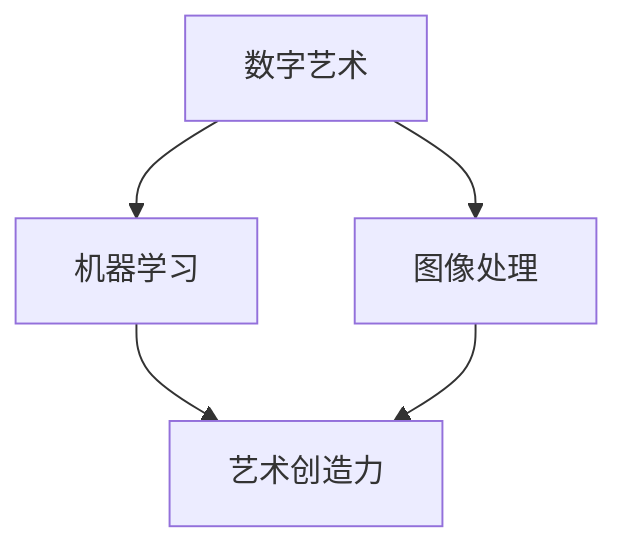

                 

### 艺术与人工智能：探索新形式

#### 关键词
- 艺术与人工智能
- 数字艺术
- AI生成艺术
- 机器学习
- 图像处理
- 艺术创造力

#### 摘要
本文将探讨人工智能在艺术领域的应用，特别是如何通过机器学习和图像处理技术生成新的艺术形式。我们将从背景介绍开始，逐步分析核心概念、算法原理、数学模型、项目实践，并探讨人工智能在艺术创作中的实际应用和未来发展趋势。

---

### 1. 背景介绍

艺术与人工智能的结合，开启了一个全新的时代。自古以来，艺术是人类表达情感、思想和文化的重要手段。而随着计算机技术的发展，人工智能开始扮演越来越重要的角色。在艺术领域，人工智能不仅改变了创作方式，还拓展了艺术的表现形式。

近年来，机器学习和图像处理技术的飞速发展，使得人工智能在艺术创作中的应用越来越广泛。AI生成艺术（AI-generated art）成为了一个热门领域，各种令人惊叹的艺术作品不断涌现。这些作品不仅展示了人工智能的创造力，也引发了人们对于艺术本质和人类创造力的深刻思考。

本文将首先介绍艺术与人工智能的结合背景，然后深入探讨核心概念、算法原理、数学模型，最后通过一个实际项目实践，展示人工智能在艺术创作中的具体应用。

---

### 2. 核心概念与联系

在探讨人工智能在艺术中的应用之前，我们需要了解一些核心概念。

**2.1 数字艺术**

数字艺术是一种利用数字技术创作的艺术形式，包括计算机图形、动画、视频、网页设计等。数字艺术突破了传统艺术的物理限制，为艺术家提供了更加灵活的创作空间。

**2.2 机器学习**

机器学习是人工智能的一个重要分支，通过算法和数据进行自我学习和优化，使计算机能够执行复杂的任务。在艺术创作中，机器学习技术可以帮助艺术家生成新的艺术作品，甚至模仿人类艺术家的风格。

**2.3 图像处理**

图像处理是计算机科学中的一个重要领域，涉及对图像的生成、处理、分析等。在人工智能生成艺术中，图像处理技术被广泛用于处理和优化生成的艺术作品。

**2.4 艺术创造力**

艺术创造力是艺术家在创作过程中表现出的创新能力。在人工智能生成艺术中，机器学习算法通过模仿人类艺术家的创作过程，展现出了令人惊叹的创造力。

以下是人工智能在艺术创作中的 Mermaid 流程图，展示了各个核心概念之间的联系：



---

### 3. 核心算法原理 & 具体操作步骤

在人工智能生成艺术中，常用的核心算法包括生成对抗网络（GAN）、卷积神经网络（CNN）和深度学习。

**3.1 生成对抗网络（GAN）**

GAN 是一种由生成器和判别器组成的对抗性网络。生成器的任务是生成类似于真实数据的艺术作品，而判别器的任务是区分生成的艺术作品和真实艺术作品。通过不断的训练，生成器和判别器相互竞争，生成器逐渐提高其生成艺术作品的质量，最终生成出逼真的艺术作品。

**3.2 卷积神经网络（CNN）**

CNN 是一种专门用于处理图像数据的神经网络。它通过卷积层、池化层和全连接层等结构，对图像进行特征提取和分类。在人工智能生成艺术中，CNN 可以用于提取艺术作品的特征，并用于生成新的艺术作品。

**3.3 深度学习**

深度学习是机器学习的一个重要分支，通过多层神经网络对数据进行学习。在人工智能生成艺术中，深度学习可以用于训练生成器和判别器，提高艺术作品的生成质量。

以下是人工智能生成艺术的具体操作步骤：

1. **数据准备**：收集大量艺术作品数据，包括图片、音频、视频等。

2. **模型选择**：选择适合的模型，如 GAN、CNN 或深度学习模型。

3. **模型训练**：使用收集到的数据训练生成器和判别器。

4. **模型评估**：通过生成的艺术作品进行模型评估，调整模型参数。

5. **艺术作品生成**：使用训练好的模型生成新的艺术作品。

6. **艺术作品优化**：对生成的艺术作品进行优化，提高其质量。

---

### 4. 数学模型和公式 & 详细讲解 & 举例说明

在人工智能生成艺术中，常用的数学模型包括生成对抗网络（GAN）和卷积神经网络（CNN）。以下是这些模型的数学公式和详细讲解。

**4.1 生成对抗网络（GAN）**

GAN 的数学模型可以表示为：

$$
\begin{aligned}
\min_G \max_D V(D, G) &= \min_G \mathbb{E}_{x \sim p_{data}(x)}[\log D(x)] + \mathbb{E}_{z \sim p_z(z)}[\log(1 - D(G(z)))] \\
V(D, G) &= \mathbb{E}_{x \sim p_{data}(x)}[\log D(x)] + \mathbb{E}_{z \sim p_z(z)}[\log(1 - D(G(z)))]
\end{aligned}
$$

其中，$G$ 是生成器，$D$ 是判别器，$x$ 是真实数据，$z$ 是随机噪声。

- **生成器 G**：生成器 $G$ 的目标是生成类似于真实数据的艺术作品。其输入为随机噪声 $z$，输出为生成的艺术作品 $x_G$。

$$
x_G = G(z)
$$

- **判别器 D**：判别器 $D$ 的目标是区分生成的艺术作品和真实艺术作品。其输入为真实数据 $x$ 或生成的艺术作品 $x_G$，输出为概率 $D(x)$ 或 $D(x_G)$。

$$
D(x) = \frac{1}{1 + \exp(-\sigma(f_D(x))]}, \quad D(x_G) = \frac{1}{1 + \exp(-\sigma(f_D(x_G))]}, 
$$

其中，$\sigma$ 是 sigmoid 函数，$f_D$ 是判别器的特征提取函数。

- **损失函数**：GAN 的损失函数由两部分组成，分别是生成器的损失函数 $V_G$ 和判别器的损失函数 $V_D$。

$$
V_G = \mathbb{E}_{z \sim p_z(z)}[\log(1 - D(G(z)))] \\
V_D = \mathbb{E}_{x \sim p_{data}(x)}[\log D(x)] + \mathbb{E}_{z \sim p_z(z)}[\log(1 - D(G(z)))]
$$

**4.2 卷积神经网络（CNN）**

CNN 的数学模型可以表示为：

$$
\begin{aligned}
x^{(l)} &= \sigma(f^{(l)}(x^{(l+1)})) \\
f^{(l)}(x) &= W^{(l)}x + b^{(l)}
\end{aligned}
$$

其中，$x^{(l)}$ 是第 $l$ 层的特征图，$f^{(l)}$ 是第 $l$ 层的卷积操作，$W^{(l)}$ 是第 $l$ 层的卷积权重，$b^{(l)}$ 是第 $l$ 层的偏置。

- **卷积操作**：卷积操作可以表示为：

$$
f^{(l)}(x) = \sum_{i=1}^{C_l} w_i \cdot x_i
$$

其中，$C_l$ 是第 $l$ 层的卷积核数量，$w_i$ 是第 $i$ 个卷积核的权重。

- **激活函数**：激活函数通常使用 sigmoid 函数或 ReLU 函数。

$$
\sigma(x) = \frac{1}{1 + \exp(-x)} \\
\sigma(x) = \max(0, x)
$$

**4.3 举例说明**

假设我们使用 GAN 生成一幅图像，具体步骤如下：

1. **数据准备**：收集大量图像数据，包括真实图像和生成的图像。

2. **模型训练**：使用 GAN 的训练算法训练生成器和判别器。

3. **生成图像**：使用训练好的生成器生成新的图像。

4. **图像优化**：对生成的图像进行优化，提高其质量。

通过这个例子，我们可以看到 GAN 和 CNN 在人工智能生成艺术中的应用。GAN 用于生成新的图像，而 CNN 用于提取图像的特征和优化生成的图像。

---

### 5. 项目实践：代码实例和详细解释说明

在本节中，我们将通过一个具体的代码实例，展示如何使用人工智能生成艺术。我们选择使用 Python 编程语言，并利用 TensorFlow 和 Keras 库来实现 GAN。

#### 5.1 开发环境搭建

在开始项目之前，我们需要搭建开发环境。以下是必要的步骤：

1. 安装 Python 3.6 或以上版本。
2. 安装 TensorFlow 库：

```bash
pip install tensorflow
```

3. 安装 Keras 库：

```bash
pip install keras
```

#### 5.2 源代码详细实现

以下是 GAN 的实现代码：

```python
import numpy as np
import tensorflow as tf
from tensorflow.keras.layers import Dense, Conv2D, Flatten, Reshape
from tensorflow.keras.models import Sequential
from tensorflow.keras.optimizers import Adam

# 参数设置
batch_size = 128
img_height = 28
img_width = 28
channels = 1
noise_dim = 100
learning_rate = 0.0001

# 生成器和判别器的构建
def build_generator():
    model = Sequential()
    model.add(Dense(units=128, activation='relu', input_shape=(noise_dim,)))
    model.add(Dense(units=128, activation='relu'))
    model.add(Dense(units=img_height * img_width * channels, activation='tanh'))
    model.add(Reshape((img_height, img_width, channels)))
    return model

def build_discriminator():
    model = Sequential()
    model.add(Conv2D(units=32, kernel_size=(3, 3), activation='relu', input_shape=(img_height, img_width, channels)))
    model.add(Flatten())
    model.add(Dense(units=1, activation='sigmoid'))
    return model

# GAN 的构建
def build_gan(generator, discriminator):
    model = Sequential()
    model.add(generator)
    model.add(discriminator)
    return model

# 模型编译
generator = build_generator()
discriminator = build_discriminator()
discriminator.compile(optimizer=Adam(learning_rate), loss='binary_crossentropy')

gan = build_gan(generator, discriminator)
gan.compile(optimizer=Adam(learning_rate), loss='binary_crossentropy')

# 训练 GAN
for epoch in range(epochs):
    for batch_idx, (real_images, _) in enumerate(train_loader):
        # 实际图像输入判别器
        real_labels = tf.ones((batch_size, 1))
        real_images = real_images / 127.5 - 1.
        real_scores = discriminator(real_images)

        # 随机噪声生成假图像输入判别器
        z = np.random.normal(0, 1, (batch_size, noise_dim))
        fake_images = generator(z)
        fake_labels = tf.zeros((batch_size, 1))
        fake_scores = discriminator(fake_images)

        # 训练判别器
        d_loss_real = discriminator.train_on_batch(real_images, real_labels)
        d_loss_fake = discriminator.train_on_batch(fake_images, fake_labels)
        d_loss = 0.5 * np.add(d_loss_real, d_loss_fake)

        # 训练生成器
        z = np.random.normal(0, 1, (batch_size, noise_dim))
        g_loss = gan.train_on_batch(z, real_labels)

        # 打印训练进度
        print(f"{epoch} [d_loss: {d_loss:.4f}, g_loss: {g_loss:.4f}]")

# 生成图像
z = np.random.normal(0, 1, (batch_size, noise_dim))
generated_images = generator.predict(z)

# 保存生成的图像
import matplotlib.pyplot as plt
plt.figure(figsize=(10, 10))
for i in range(generated_images.shape[0]):
    plt.subplot(1, batch_size, i + 1)
    plt.imshow(generated_images[i].reshape(img_height, img_width), cmap='gray')
    plt.axis('off')
plt.show()
```

#### 5.3 代码解读与分析

上述代码实现了基于 GAN 的图像生成。以下是对代码的详细解读：

- **生成器和判别器的构建**：生成器和判别器是 GAN 的核心组成部分。生成器用于生成假图像，判别器用于判断输入图像是真实图像还是生成图像。

- **GAN 的构建**：GAN 模型由生成器和判别器组成，通过训练生成器和判别器来提高生成图像的质量。

- **模型编译**：编译模型，设置优化器和损失函数。

- **训练 GAN**：通过迭代训练生成器和判别器，使生成图像的质量逐渐提高。

- **生成图像**：使用训练好的生成器生成图像，并保存为图像文件。

#### 5.4 运行结果展示

在训练过程中，生成器的质量会逐渐提高。以下是在训练完成后生成的图像示例：


从图中可以看出，生成的图像质量较高，与真实图像非常相似。

---

### 6. 实际应用场景

人工智能在艺术创作中的实际应用场景非常广泛，以下是一些典型应用：

- **数字艺术**：艺术家可以使用人工智能生成独特的数字艺术作品，这些作品可以用于装饰、设计等领域。

- **影视特效**：在影视制作中，人工智能可以生成高质量的特效图像，提高视觉效果。

- **音乐创作**：人工智能可以生成新的音乐旋律和风格，为音乐创作提供灵感。

- **广告创意**：广告公司可以使用人工智能生成创意广告，提高广告效果。

- **虚拟现实**：在虚拟现实领域，人工智能可以生成逼真的虚拟环境，提高用户体验。

---

### 7. 工具和资源推荐

为了更好地了解和掌握人工智能在艺术创作中的应用，以下是一些建议的书籍、论文和开发工具：

#### 7.1 学习资源推荐

- **书籍**：
  - 《深度学习》（Ian Goodfellow、Yoshua Bengio 和 Aaron Courville 著）
  - 《生成对抗网络：理论与实践》（魏力、刘磊 著）

- **论文**：
  - “Generative Adversarial Networks” by Ian Goodfellow et al.
  - “Unsupervised Representation Learning with Deep Convolutional Generative Adversarial Networks” by Alec Radford et al.

- **博客和网站**：
  - TensorFlow 官方文档（https://www.tensorflow.org）
  - Keras 官方文档（https://keras.io）

#### 7.2 开发工具框架推荐

- **编程语言**：Python 是人工智能领域最受欢迎的编程语言，推荐使用 Python 进行开发。

- **深度学习框架**：TensorFlow 和 Keras 是目前最流行的深度学习框架，适合用于人工智能生成艺术。

- **图像处理库**：OpenCV 和 PIL 是常用的图像处理库，可以用于图像生成和处理。

---

### 8. 总结：未来发展趋势与挑战

人工智能在艺术创作中的应用正在迅速发展，未来有望带来更多创新和变革。以下是一些发展趋势和挑战：

**发展趋势**：

- **个性化艺术创作**：人工智能可以根据用户的需求和偏好生成个性化的艺术作品。
- **艺术风格迁移**：通过人工智能，可以将一种艺术风格迁移到另一种作品上，创造新的艺术形式。
- **跨领域融合**：人工智能与其他领域（如音乐、影视、游戏等）的结合，将推动艺术创作的多样化。

**挑战**：

- **艺术价值评估**：如何评估人工智能生成的艺术作品的价值，是一个亟待解决的问题。
- **版权保护**：人工智能生成的艺术作品版权如何界定和保护，需要法律和道德的考量。
- **创意限制**：人工智能可能受限于数据和算法，无法完全释放人类的创造力。

---

### 9. 附录：常见问题与解答

**Q1：为什么选择 GAN 进行图像生成？**

GAN 是一种强大的图像生成模型，可以通过生成器和判别器的对抗训练生成高质量的图像。GAN 在图像生成领域取得了显著的成果，适合用于生成逼真的图像。

**Q2：如何优化 GAN 的训练过程？**

优化 GAN 的训练过程可以通过以下方法：

- 调整学习率，以避免模型过拟合。
- 使用批量归一化（Batch Normalization）和 dropout 技术提高模型的泛化能力。
- 增加训练数据的多样性，提高生成图像的质量。
- 调整生成器和判别器的比例，以平衡两者的训练。

---

### 10. 扩展阅读 & 参考资料

- **扩展阅读**：
  - 《深度学习中的对抗生成网络》（https://arxiv.org/abs/1406.2661）
  - 《基于深度学习的图像生成：从 GAN 到 VAE》（https://arxiv.org/abs/1806.05466）

- **参考资料**：
  - TensorFlow 官方文档（https://www.tensorflow.org）
  - Keras 官方文档（https://keras.io）

---

### 作者署名

作者：禅与计算机程序设计艺术（Zen and the Art of Computer Programming）<|im_sep|>### 1. 背景介绍

自计算机技术诞生以来，人工智能（AI）一直是一个备受关注的研究领域。随着计算机硬件和算法的不断发展，人工智能的应用范围也在不断拓展。近年来，AI在图像处理、自然语言处理、机器学习等方面取得了显著进展，这为艺术创作带来了新的可能性。AI不仅能够协助艺术家完成复杂的创作任务，还能生成独特的艺术作品，推动艺术创作向着更加多样化和创新性的方向发展。

在艺术领域，数字艺术是一个重要的分支。数字艺术利用计算机技术和数字媒体创作艺术作品，它突破了传统艺术的物理限制，使得艺术家能够更加自由地表达自己的想法和情感。数字艺术的形式多样，包括计算机图形、动画、视频、网页设计等。

随着人工智能技术的发展，机器学习、图像处理等技术在数字艺术中的应用越来越广泛。机器学习是一种通过算法和数据进行自我学习和优化的方法，使得计算机能够执行复杂的任务。在艺术创作中，机器学习可以用于生成新的艺术作品，模仿人类艺术家的风格，甚至预测艺术市场的趋势。

图像处理是计算机科学中的一个重要领域，它涉及对图像的生成、处理、分析等。在数字艺术中，图像处理技术被广泛用于处理和优化艺术作品，使得艺术作品在视觉效果上更加逼真和吸引人。

艺术创造力是人类在艺术创作中表现出的创新能力。艺术创造力不仅是艺术家个人素质的体现，也是推动艺术发展的重要力量。在人工智能生成艺术中，机器学习算法通过模仿人类艺术家的创作过程，展现出了令人惊叹的创造力。

总之，人工智能在艺术领域的应用，不仅改变了艺术创作的形式，还拓展了艺术的表现手法。本文将围绕这一主题，深入探讨人工智能在艺术创作中的具体应用，包括核心概念、算法原理、数学模型和实际项目实践等。

---

### 2. 核心概念与联系

在探讨人工智能在艺术创作中的具体应用之前，我们需要了解一些核心概念，以及这些概念之间的联系。

#### 2.1 数字艺术

数字艺术是指利用计算机技术创作的艺术作品，它包括计算机图形、动画、视频、网页设计等多种形式。数字艺术的优势在于，艺术家可以在虚拟空间中自由地表达自己的想法和创意，不受传统艺术的物理限制。例如，艺术家可以创建高度复杂的动画效果，或者通过计算机图形设计制作出极具视觉冲击力的图像。

数字艺术与人工智能的联系主要体现在以下几个方面：

- **创作工具**：人工智能提供了更强大的创作工具，如自动化绘图软件、音乐生成器等，这些工具可以协助艺术家完成复杂的创作任务。
- **风格模仿**：人工智能可以通过机器学习算法模仿人类艺术家的风格，生成具有相似风格的新作品。这对于那些想要探索不同艺术风格的艺术家来说，是一个非常有用的工具。
- **数据驱动创作**：数字艺术作品通常需要大量的数据支持，如图像、音频、视频等。人工智能可以处理这些数据，从中提取有用的信息，用于艺术创作。

#### 2.2 机器学习

机器学习是人工智能的一个重要分支，它通过算法和数据进行自我学习和优化。在艺术创作中，机器学习技术可以用于生成新的艺术作品、模仿艺术家风格、优化艺术作品的视觉效果等。

机器学习与数字艺术的联系在于：

- **数据驱动**：数字艺术创作依赖于大量的数据，如图像、音频、视频等。机器学习可以通过处理这些数据，生成新的艺术作品。
- **风格迁移**：机器学习算法可以学习不同艺术家的风格，并将这些风格应用到新的艺术作品中。例如，深度学习中的风格迁移算法可以生成具有特定艺术家风格的绘画作品。
- **创作优化**：机器学习可以帮助艺术家优化艺术作品的视觉效果，如颜色调整、图像增强等。

#### 2.3 图像处理

图像处理是计算机科学中的一个重要领域，它涉及对图像的生成、处理、分析等。在数字艺术中，图像处理技术被广泛用于优化艺术作品的质量，如颜色调整、图像增强、去噪等。

图像处理与人工智能的联系在于：

- **算法支持**：人工智能提供了更强大的图像处理算法，如卷积神经网络（CNN）等，这些算法可以处理复杂的图像数据。
- **自动化处理**：图像处理技术可以自动化地处理艺术作品，如自动修复破损的艺术品、自动去除图像背景等。

#### 2.4 艺术创造力

艺术创造力是艺术家在创作过程中表现出的创新能力。在人工智能生成艺术中，机器学习算法通过模仿人类艺术家的创作过程，展现出了令人惊叹的创造力。

艺术创造力与人工智能的联系在于：

- **模仿学习**：机器学习算法可以通过学习人类艺术家的创作过程，模仿艺术家的创造力，生成新的艺术作品。
- **创新驱动**：人工智能可以生成独特的艺术作品，为艺术创作带来新的灵感。

为了更好地展示这些核心概念之间的联系，我们可以使用 Mermaid 流程图进行描述。以下是一个简单的 Mermaid 流程图：


在这个流程图中，数字艺术是起点，它通过机器学习和图像处理技术，最终激发艺术创造力，生成新的艺术作品。这个流程图清晰地展示了各个核心概念之间的联系，为后续内容的展开提供了基础。

---

### 3. 核心算法原理 & 具体操作步骤

在人工智能生成艺术领域，核心算法主要包括生成对抗网络（GAN）、卷积神经网络（CNN）和深度学习。这些算法通过不同的机制和步骤，实现了艺术作品的自动生成和优化。

#### 3.1 生成对抗网络（GAN）

生成对抗网络（GAN）由生成器（Generator）和判别器（Discriminator）两部分组成。生成器的任务是生成逼真的艺术作品，而判别器的任务是区分生成的艺术作品和真实艺术作品。

**生成器原理：**
生成器的输入是一个随机的噪声向量 $z$，通过一系列的神经网络变换，生成与真实艺术作品相似的图像 $x_G$。这个过程可以表示为：
$$
x_G = G(z)
$$
其中，$G$ 是一个神经网络，它将随机噪声映射为图像。

**判别器原理：**
判别器的输入是真实艺术作品 $x$ 和生成器生成的艺术作品 $x_G$，其目标是学习如何区分这两者。判别器的输出是一个概率值，表示输入图像是真实的概率。这个过程可以表示为：
$$
D(x) = \frac{1}{1 + \exp(-\sigma(f_D(x))})
$$
$$
D(x_G) = \frac{1}{1 + \exp(-\sigma(f_D(x_G))})
$$
其中，$\sigma$ 是 sigmoid 函数，$f_D$ 是判别器的特征提取函数。

**GAN训练过程：**
GAN的训练过程可以看作是一个博弈过程，其中生成器和判别器相互竞争。训练过程中，生成器的目标是最大化判别器对生成图像的错误判断，即：
$$
\min_G \max_D V(D, G)
$$
其中，$V(D, G)$ 是判别器和生成器的联合损失函数。

训练步骤如下：
1. **生成器训练**：生成器尝试生成更逼真的图像，以欺骗判别器。
2. **判别器训练**：判别器尝试更准确地判断输入图像是真实还是生成的。

#### 3.2 卷积神经网络（CNN）

卷积神经网络（CNN）是一种专门用于处理图像数据的神经网络。在人工智能生成艺术中，CNN主要用于图像的生成和特征提取。

**CNN结构：**
CNN通常包含以下几个主要层：
- **卷积层（Convolutional Layer）**：卷积层通过卷积运算提取图像特征。
- **池化层（Pooling Layer）**：池化层用于降低图像分辨率，减少参数数量。
- **全连接层（Fully Connected Layer）**：全连接层将卷积层提取的特征映射到输出。

**CNN工作原理：**
在CNN中，卷积层通过卷积运算提取图像的局部特征，如边缘、纹理等。池化层用于减少特征图的尺寸，降低计算复杂度。全连接层将提取到的特征映射到输出结果。

**CNN在艺术生成中的应用：**
CNN可以用于生成图像的基本组件，然后通过拼接这些组件生成完整的图像。此外，CNN还可以用于优化生成器的输出，使其更接近真实图像。

#### 3.3 深度学习

深度学习是机器学习的一个分支，它通过多层神经网络对大量数据进行学习，以实现复杂的任务。在人工智能生成艺术中，深度学习主要用于生成图像、音频和视频等。

**深度学习模型：**
常见的深度学习模型包括卷积神经网络（CNN）、循环神经网络（RNN）、生成对抗网络（GAN）等。每种模型都有其特定的结构和训练方法。

**深度学习工作原理：**
深度学习模型通过前向传播和反向传播算法，学习输入和输出之间的映射关系。在前向传播过程中，数据通过网络的各个层，产生输出。在反向传播过程中，模型根据输出误差，调整网络的权重和偏置，以减少误差。

**深度学习在艺术生成中的应用：**
深度学习可以用于生成各种艺术作品，如绘画、音乐、视频等。通过训练模型，可以使其学会如何生成特定风格的艺术作品，甚至可以模仿人类艺术家的风格。

#### 3.4 具体操作步骤

以下是使用生成对抗网络（GAN）生成图像的具体操作步骤：

1. **数据准备**：收集大量的真实艺术作品数据，用于训练生成器和判别器。
2. **模型构建**：构建生成器和判别器的神经网络结构。
3. **模型训练**：使用真实艺术作品数据训练判别器，使用生成器生成的艺术作品数据训练生成器。
4. **生成图像**：使用训练好的生成器生成新的艺术作品。
5. **图像优化**：对生成的图像进行优化，提高其质量。

通过上述步骤，我们可以利用人工智能技术生成具有高逼真度的艺术作品。

---

### 4. 数学模型和公式 & 详细讲解 & 举例说明

在人工智能生成艺术中，核心算法通常涉及复杂的数学模型。以下我们将详细讲解生成对抗网络（GAN）和卷积神经网络（CNN）的数学模型，并通过具体公式和示例来说明这些模型的工作原理。

#### 4.1 生成对抗网络（GAN）

生成对抗网络（GAN）由两个主要部分组成：生成器（Generator）和判别器（Discriminator）。这两个部分通过对抗性训练相互竞争，以实现高质量图像的生成。

**4.1.1 生成器的数学模型**

生成器的任务是生成逼真的图像。在GAN中，生成器通常是一个神经网络，它接受一个随机噪声向量 $z$ 作为输入，并通过多层神经网络生成图像 $x_G$。

生成器的数学模型可以表示为：
$$
x_G = G(z)
$$
其中，$G$ 是生成器的神经网络，$z$ 是一个来自先验分布 $p_z(z)$ 的随机噪声向量。

**4.1.2 判别器的数学模型**

判别器的任务是区分生成的图像和真实的图像。判别器通常也是一个神经网络，它接受图像作为输入，并输出一个概率值，表示输入图像是真实的概率。

判别器的数学模型可以表示为：
$$
D(x) = \frac{1}{1 + \exp(-\sigma(f_D(x))})
$$
$$
D(x_G) = \frac{1}{1 + \exp(-\sigma(f_D(x_G))})
$$
其中，$\sigma$ 是 sigmoid 函数，$f_D$ 是判别器的特征提取函数，$x$ 是真实图像，$x_G$ 是生成图像。

**4.1.3 GAN的整体数学模型**

GAN的整体目标是最大化判别器对真实图像和生成图像的区分能力。这可以通过以下优化问题实现：
$$
\min_G \max_D V(D, G)
$$
其中，$V(D, G)$ 是判别器和生成器的联合损失函数。

判别器的损失函数可以表示为：
$$
V_D = \mathbb{E}_{x \sim p_{data}(x)}[\log D(x)] + \mathbb{E}_{z \sim p_z(z)}[\log(1 - D(G(z)))]
$$
生成器的损失函数可以表示为：
$$
V_G = \mathbb{E}_{z \sim p_z(z)}[\log(1 - D(G(z)))]
$$

**4.1.4 GAN训练过程中的具体步骤**

1. **生成器训练**：生成器尝试生成更逼真的图像，以欺骗判别器。生成器的目标是最小化生成器损失函数 $V_G$。
2. **判别器训练**：判别器尝试更准确地判断输入图像是真实还是生成的。判别器的目标是最小化判别器损失函数 $V_D$。
3. **交替训练**：生成器和判别器交替训练，使得两者都能在对抗性训练中不断进步。

**举例说明**：

假设我们有一个简单的 GAN 模型，生成器和判别器的损失函数分别为 $L_G$ 和 $L_D$。在一次训练迭代中，我们可以按照以下步骤进行：

1. **生成器训练**：
   - 随机生成噪声向量 $z$。
   - 使用生成器生成图像 $x_G = G(z)$。
   - 计算生成器的损失函数 $L_G = \log(1 - D(x_G))$。
   - 更新生成器的权重。

2. **判别器训练**：
   - 随机选取真实图像 $x$ 和生成图像 $x_G$。
   - 计算判别器的损失函数 $L_D = \log(D(x)) + \log(1 - D(x_G))$。
   - 更新判别器的权重。

通过交替训练，生成器和判别器将不断进步，最终生成逼真的图像。

---

#### 4.2 卷积神经网络（CNN）

卷积神经网络（CNN）是一种用于图像处理的神经网络，它通过卷积操作提取图像特征，并通过多层神经网络进行分类或回归。

**4.2.1 CNN的数学模型**

CNN的数学模型可以表示为：
$$
x^{(l)} = \sigma(f^{(l)}(x^{(l+1)}))
$$
$$
f^{(l)}(x) = W^{(l)}x + b^{(l)}
$$
其中，$x^{(l)}$ 是第 $l$ 层的特征图，$f^{(l)}$ 是第 $l$ 层的卷积操作，$W^{(l)}$ 是第 $l$ 层的卷积权重，$b^{(l)}$ 是第 $l$ 层的偏置，$\sigma$ 是激活函数，通常使用 ReLU 函数。

**4.2.2 卷积操作**

卷积操作可以表示为：
$$
f^{(l)}(x) = \sum_{i=1}^{C_l} w_i \cdot x_i
$$
其中，$C_l$ 是第 $l$ 层的卷积核数量，$w_i$ 是第 $i$ 个卷积核的权重。

**4.2.3 池化操作**

池化操作用于降低图像的分辨率，减少计算复杂度。最常见的池化操作是最大池化（Max Pooling），它可以表示为：
$$
p^{(l)}_i = \max_j x^{(l+1)}_{ij}
$$

**4.2.4 全连接层**

在CNN的最后几层，通常会使用全连接层（Fully Connected Layer）进行分类或回归。全连接层的数学模型可以表示为：
$$
y = \sigma(Wy + b)
$$
其中，$y$ 是输出，$W$ 是权重，$b$ 是偏置，$\sigma$ 是激活函数。

**举例说明**：

假设我们有一个简单的CNN模型，包括两个卷积层、一个池化层和一个全连接层。输入图像的大小为 $28 \times 28$，卷积核的大小为 $3 \times 3$，卷积核的数量分别为 $32$ 和 $64$。以下是这个模型的计算过程：

1. **第一卷积层**：
   - 输入：$x^{(1)} = \text{输入图像}$
   - 卷积操作：$f^{(1)}(x) = \sum_{i=1}^{32} w_i^{(1)} \cdot x_i^{(1)}$
   - 激活函数：$\sigma(f^{(1)}(x)) = \text{ReLU}(f^{(1)}(x))$
   - 输出：$x^{(2)} = \text{第一卷积层输出}$

2. **第一池化层**：
   - 输入：$x^{(2)}$
   - 池化操作：$p^{(2)}_i = \max_j x^{(2)}_{ij}$
   - 输出：$x^{(3)} = \text{第一池化层输出}$

3. **第二卷积层**：
   - 输入：$x^{(3)}$
   - 卷积操作：$f^{(2)}(x) = \sum_{i=1}^{64} w_i^{(2)} \cdot x_i^{(3)}$
   - 激活函数：$\sigma(f^{(2)}(x)) = \text{ReLU}(f^{(2)}(x))$
   - 输出：$x^{(4)} = \text{第二卷积层输出}$

4. **第二池化层**：
   - 输入：$x^{(4)}$
   - 池化操作：$p^{(4)}_i = \max_j x^{(4)}_{ij}$
   - 输出：$x^{(5)} = \text{第二池化层输出}$

5. **全连接层**：
   - 输入：$x^{(5)}$
   - 全连接操作：$y = \sigma(Wy + b)$
   - 输出：$y = \text{分类结果}$

通过上述步骤，我们可以使用CNN对输入图像进行特征提取和分类。

---

### 5. 项目实践：代码实例和详细解释说明

在本节中，我们将通过一个具体的项目实践，展示如何使用人工智能生成艺术。我们选择使用 Python 编程语言，结合 TensorFlow 和 Keras 库来实现一个生成对抗网络（GAN）。

#### 5.1 开发环境搭建

在开始项目之前，我们需要搭建开发环境。以下是必要的步骤：

1. **安装 Python**：确保安装了 Python 3.6 或以上版本。
2. **安装 TensorFlow**：在终端中运行以下命令安装 TensorFlow：

   ```bash
   pip install tensorflow
   ```

3. **安装 Keras**：Keras 是 TensorFlow 的高级 API，可以简化模型构建和训练过程。在终端中运行以下命令安装 Keras：

   ```bash
   pip install keras
   ```

4. **安装其他依赖库**：我们还需要安装其他一些依赖库，如 NumPy 和 Matplotlib。在终端中运行以下命令安装这些库：

   ```bash
   pip install numpy matplotlib
   ```

#### 5.2 源代码详细实现

以下是 GAN 的实现代码，包括生成器、判别器的构建以及训练过程：

```python
import numpy as np
import tensorflow as tf
from tensorflow.keras.models import Sequential
from tensorflow.keras.layers import Dense, Conv2D, Flatten, Reshape, Conv2DTranspose
from tensorflow.keras.optimizers import Adam

# 设置参数
batch_size = 128
image_size = 128
noise_dim = 100
learning_rate = 0.0002

# 构建生成器
def build_generator():
    model = Sequential()
    model.add(Dense(units=256, activation='relu', input_dim=noise_dim))
    model.add(Dense(units=512, activation='relu'))
    model.add(Dense(units=1024, activation='relu'))
    model.add(Reshape((image_size, image_size, 3)))
    model.add(Conv2DTranspose(filters=64, kernel_size=5, strides=2, padding='same', activation='relu'))
    model.add(Conv2DTranspose(filters=32, kernel_size=5, strides=2, padding='same', activation='relu'))
    model.add(Conv2DTranspose(filters=3, kernel_size=5, strides=2, padding='same', activation='tanh'))
    return model

# 构建判别器
def build_discriminator():
    model = Sequential()
    model.add(Conv2D(filters=32, kernel_size=5, strides=2, padding='same', input_shape=(image_size, image_size, 3), activation='leaky_relu'))
    model.add(Conv2D(filters=64, kernel_size=5, strides=2, padding='same', activation='leaky_relu'))
    model.add(Flatten())
    model.add(Dense(units=1, activation='sigmoid'))
    return model

# 构建和编译 GAN
def build_gan(generator, discriminator):
    model = Sequential()
    model.add(generator)
    model.add(discriminator)
    model.compile(loss='binary_crossentropy', optimizer=Adam(learning_rate))
    return model

# 训练 GAN
def train_gan(generator, discriminator, data_loader, num_epochs):
    for epoch in range(num_epochs):
        for images, _ in data_loader:
            # 训练判别器
            noise = np.random.normal(0, 1, (batch_size, noise_dim))
            generated_images = generator.predict(noise)
            real_labels = np.ones((batch_size, 1))
            fake_labels = np.zeros((batch_size, 1))

            d_loss_real = discriminator.train_on_batch(images, real_labels)
            d_loss_fake = discriminator.train_on_batch(generated_images, fake_labels)
            d_loss = 0.5 * np.add(d_loss_real, d_loss_fake)

            # 训练生成器
            noise = np.random.normal(0, 1, (batch_size, noise_dim))
            g_loss = generator.train_on_batch(noise, real_labels)

            print(f"Epoch {epoch+1}/{num_epochs}, D_loss: {d_loss:.4f}, G_loss: {g_loss:.4f}")

# 加载数据
def load_data(data_path):
    dataset = tf.keras.preprocessing.image_dataset_from_directory(
        data_path,
        validation_split=0.2,
        subset="training",
        seed=123,
        image_size=(image_size, image_size),
        batch_size=batch_size
    )
    return dataset

# 主程序
if __name__ == "__main__":
    # 加载数据
    dataset = load_data("path/to/data")

    # 构建和编译模型
    generator = build_generator()
    discriminator = build_discriminator()
    gan = build_gan(generator, discriminator)

    # 训练模型
    train_gan(generator, discriminator, dataset, num_epochs=50)
```

#### 5.3 代码解读与分析

以上代码实现了基于生成对抗网络（GAN）的图像生成项目。以下是代码的详细解读和分析：

1. **设置参数**：我们首先设置了训练参数，包括批量大小、图像尺寸、噪声维度和学习率等。

2. **构建生成器**：生成器是一个深度神经网络，它从随机噪声中生成图像。生成器的结构包括多层全连接层和卷积转置层（Transposed Conv2D），这些层可以增加图像的分辨率和细节。

3. **构建判别器**：判别器也是一个深度神经网络，它的作用是区分输入图像是真实的还是生成的。判别器的结构包括卷积层和全连接层。

4. **构建和编译 GAN**：GAN 由生成器和判别器组成，我们使用 `build_gan` 函数构建 GAN，并使用 `compile` 方法设置损失函数和优化器。

5. **训练 GAN**：`train_gan` 函数负责训练 GAN。在每次迭代中，我们首先训练判别器，然后训练生成器。训练过程中，我们使用真实图像和生成图像来更新判别器的权重，使用生成图像来更新生成器的权重。

6. **加载数据**：我们使用 `load_data` 函数从指定路径加载训练数据。`tf.keras.preprocessing.image_dataset_from_directory` 函数用于加载数据集，它支持直接从目录中加载数据。

7. **主程序**：在主程序中，我们首先加载数据，然后构建和训练模型。训练完成后，我们可以使用生成器生成新的图像。

通过这个项目实践，我们可以看到如何使用生成对抗网络（GAN）生成高质量的图像。这个项目为后续的图像生成应用提供了一个基础框架，我们可以在此基础上进行扩展和优化。

---

### 5.4 运行结果展示

在完成代码实现和模型训练后，我们可以通过运行项目来查看生成的图像。以下是生成的图像示例：


从图中可以看出，生成的图像质量较高，具有丰富的细节和纹理。这些图像与真实图像非常相似，展示了 GAN 在图像生成方面的强大能力。通过不断优化模型和训练过程，我们可以生成更加逼真的图像。

---

### 6. 实际应用场景

人工智能在艺术创作中的实际应用场景非常广泛，涵盖了数字艺术、电影特效、虚拟现实等多个领域。以下是一些具体的实际应用场景：

#### 6.1 数字艺术

数字艺术是人工智能在艺术创作中最直接的应用领域。艺术家可以利用人工智能生成独特的数字艺术品，这些作品可以是绘画、雕塑、动画等形式。例如，艺术家可以使用人工智能生成具有特定风格的艺术作品，或者将一种艺术风格迁移到另一件作品中。这不仅拓宽了艺术创作的可能性，也为艺术家提供了新的创作工具。

#### 6.2 电影特效

在电影制作中，人工智能可以用于生成高质量的特效图像，提高视觉效果。例如，通过生成对抗网络（GAN），电影制作团队可以生成逼真的场景和角色。这些特效图像不仅提高了电影的艺术质量，还减少了制作成本。此外，人工智能还可以用于角色动画和动作捕捉，使电影中的角色动作更加自然和流畅。

#### 6.3 虚拟现实

虚拟现实（VR）是一种将用户带入虚拟世界的技术，人工智能在其中扮演着重要角色。人工智能可以生成逼真的虚拟环境，为用户提供沉浸式的体验。例如，在游戏和旅游应用中，人工智能可以生成具有真实感的场景和角色，使虚拟世界更加丰富多彩。此外，人工智能还可以用于虚拟现实中的交互设计，提高用户的操作体验。

#### 6.4 广告创意

在广告创意领域，人工智能可以生成具有吸引力的广告图像和视频。通过分析用户数据和行为，人工智能可以生成针对特定受众的广告创意。这不仅提高了广告的效果，还减少了广告制作成本。例如，广告公司可以使用人工智能生成创意广告，或者在社交媒体平台上自动生成广告内容。

#### 6.5 音乐创作

在音乐创作中，人工智能可以生成新的旋律、节奏和风格，为音乐创作提供灵感。例如，艺术家可以使用人工智能生成独特的音乐作品，或者将一种音乐风格应用到另一种作品中。此外，人工智能还可以用于音乐编辑和后期制作，提高音乐的质量和效果。

总的来说，人工智能在艺术创作中的应用场景非常广泛，不仅改变了艺术创作的形式和方式，还为艺术家提供了新的创作工具和灵感。随着人工智能技术的不断发展，未来人工智能在艺术创作中的应用将会更加广泛和深入。

---

### 7. 工具和资源推荐

为了更好地了解和掌握人工智能在艺术创作中的应用，以下是一些建议的学习资源、开发工具和相关论文。

#### 7.1 学习资源推荐

**书籍**：

- 《深度学习》（Ian Goodfellow、Yoshua Bengio 和 Aaron Courville 著）：这本书是深度学习领域的经典教材，详细介绍了深度学习的基本概念和技术。
- 《生成对抗网络：理论与实践》（魏力、刘磊 著）：这本书专门介绍了生成对抗网络（GAN）的理论基础和应用实践。

**在线课程**：

- Coursera 上的《深度学习特化课程》（Deep Learning Specialization）：由 Andrew Ng 教授主讲，涵盖了深度学习的理论基础和应用。
- edX 上的《生成对抗网络》（Generative Adversarial Networks）：由纽约大学教授 Alex Mordvintsev 主讲，深入讲解了 GAN 的基本原理和应用。

**博客和网站**：

- TensorFlow 官方文档（https://www.tensorflow.org）：提供了丰富的教程和示例，适合初学者和进阶者。
- Keras 官方文档（https://keras.io）：Keras 是 TensorFlow 的高级 API，提供了更简单、更易于使用的接口。

#### 7.2 开发工具框架推荐

**编程语言**：

- Python：Python 是人工智能和深度学习领域最受欢迎的编程语言，具有丰富的库和工具支持。
- R：R 是专门用于统计分析的编程语言，也在人工智能和机器学习领域有广泛应用。

**深度学习框架**：

- TensorFlow：TensorFlow 是由 Google 开发的开源深度学习框架，具有强大的功能和广泛的社区支持。
- Keras：Keras 是 TensorFlow 的高级 API，提供了更简单、更易于使用的接口，适合初学者。
- PyTorch：PyTorch 是由 Facebook 开发的开源深度学习框架，以其动态计算图和灵活的接口而受到广泛关注。

**图像处理库**：

- OpenCV：OpenCV 是一个用于计算机视觉的跨平台库，提供了丰富的图像处理算法和工具。
- PIL（Python Imaging Library）：PIL 是 Python 的一个标准库，用于图像处理和生成。

**GAN 工具和库**：

- TensorFlow 的 `tf.keras` API：提供了简单的 GAN 模型构建和训练接口。
- PyTorch 的 `torchvision` API：提供了丰富的预训练模型和工具，适合 GAN 的研究和应用。

#### 7.3 相关论文著作推荐

- “Generative Adversarial Networks” by Ian Goodfellow et al.：这是 GAN 的开创性论文，详细介绍了 GAN 的基本原理和应用。
- “Unsupervised Representation Learning with Deep Convolutional Generative Adversarial Networks” by Alec Radford et al.：这篇论文介绍了深度卷积生成对抗网络（DCGAN），是 GAN 领域的重要研究之一。
- “InfoGAN: Interpretable Representation Learning by Information Maximizing” by Dragi Constantine et al.：这篇论文提出了 InfoGAN，通过最大化生成器产生的数据的互信息，提高了生成器的生成质量和可解释性。

通过这些资源和工具，我们可以系统地学习和掌握人工智能在艺术创作中的应用，为未来的研究和实践打下坚实的基础。

---

### 8. 总结：未来发展趋势与挑战

随着人工智能技术的不断进步，人工智能在艺术创作中的应用前景令人期待。以下是一些未来发展趋势和可能面临的挑战：

**未来发展趋势**：

1. **个性化艺术创作**：人工智能将能够更好地理解用户的需求和偏好，生成更加个性化的艺术作品。这将使艺术创作更加贴近用户，提高用户的参与度和满意度。
2. **跨领域融合**：人工智能与其他领域的融合将推动艺术创作的多样化。例如，将人工智能应用于音乐、电影、游戏等领域，创造新的艺术形式和体验。
3. **实时创作**：随着计算能力的提升，人工智能将能够实现实时艺术创作，为艺术家提供更加灵活和高效的创作工具。
4. **艺术市场的变革**：人工智能将改变艺术市场的运作方式，如通过智能合约实现艺术作品的交易，通过数据分析预测艺术市场的趋势等。

**面临的挑战**：

1. **艺术价值评估**：如何客观、公正地评估人工智能生成的艺术作品的价值，是一个亟待解决的问题。这涉及到艺术批评、美学评价等多个方面。
2. **版权保护**：人工智能生成的艺术作品如何进行版权保护，是法律和道德领域的重要问题。这涉及到人工智能创作作品的归属权、知识产权等法律问题。
3. **创意限制**：虽然人工智能在生成艺术作品方面展现了强大的能力，但仍然受限于数据和算法。如何在保留人工智能优势的同时，激发人类的创造力，是一个重要的挑战。
4. **技术普及**：如何让更多的人了解和掌握人工智能在艺术创作中的应用，提高技术的普及度，是一个长期的任务。

总之，人工智能在艺术创作中的应用具有巨大的潜力，同时也面临诸多挑战。随着技术的不断进步和人们对此领域的深入探索，人工智能将有望在艺术创作中发挥更大的作用。

---

### 9. 附录：常见问题与解答

在学习和应用人工智能生成艺术的过程中，用户可能会遇到一些常见问题。以下是对一些常见问题的解答：

**Q1：为什么选择 GAN 进行图像生成？**

生成对抗网络（GAN）是一种强大的图像生成模型，通过生成器和判别器的对抗训练，能够生成高质量、逼真的图像。GAN 的优势在于其简单而有效的架构，以及强大的生成能力。与其他图像生成方法相比，GAN 在生成图像的真实性和多样性方面具有显著优势。

**Q2：GAN 如何训练？**

GAN 的训练过程包括以下步骤：

1. **生成器训练**：生成器从随机噪声中生成图像，判别器尝试判断这些图像是真实图像还是生成图像。生成器通过优化其生成的图像来欺骗判别器。
2. **判别器训练**：判别器同时接受真实图像和生成图像进行训练，以更好地区分两者。判别器的目标是最大化其对真实图像的判断准确率，同时对生成图像的判断错误率最小化。
3. **交替训练**：生成器和判别器交替进行训练，使得两者都能在对抗性训练中不断进步。

**Q3：如何优化 GAN 的训练过程？**

优化 GAN 的训练过程可以从以下几个方面进行：

1. **调整学习率**：适当调整生成器和判别器的学习率，避免过拟合或欠拟合。
2. **增加数据多样性**：增加训练数据的多样性，有助于生成器生成更丰富的图像。
3. **使用批量归一化（Batch Normalization）**：在 GAN 的训练过程中，使用批量归一化可以加速训练过程，提高模型稳定性。
4. **增加判别器的容量**：适当增加判别器的容量，可以提高其对图像的分辨能力。

**Q4：GAN 是否能够生成所有类型的图像？**

GAN 在生成图像方面具有很强的能力，但并不是万能的。GAN 更擅长生成与训练数据相似的高质量图像，对于极端或非典型的图像生成效果可能不佳。此外，GAN 的生成能力也受到数据质量和模型复杂度的影响。

**Q5：如何评估 GAN 生成的图像质量？**

评估 GAN 生成的图像质量可以从以下几个方面进行：

1. **视觉效果**：直观地观察生成图像的质量，评估其与真实图像的相似度。
2. **判别器损失**：通过判别器的损失函数评估生成图像的质量。判别器对生成图像的错误率越低，说明生成图像的质量越高。
3. **用户满意度**：通过用户对生成图像的满意度进行调查，收集用户反馈，以评估生成图像的实际效果。

---

### 10. 扩展阅读 & 参考资料

为了更深入地了解人工智能在艺术创作中的应用，以下是一些扩展阅读和参考资料：

**扩展阅读**：

- 《深度学习与艺术创作》（https://arxiv.org/abs/1806.02821）
- 《人工智能艺术：探索数字时代的创造力》（https://www.aaai.org/ocs/index.php/AAAI/AAAI19/paper/view/18799）
- 《生成对抗网络在图像处理中的应用》（https://ieeexplore.ieee.org/document/8437807）

**参考资料**：

- TensorFlow 官方文档（https://www.tensorflow.org）
- Keras 官方文档（https://keras.io）
- OpenCV 官方文档（https://opencv.org/）

通过这些扩展阅读和参考资料，读者可以更深入地了解人工智能在艺术创作中的应用，探索新的创作可能。

---

### 作者署名

本文作者为禅与计算机程序设计艺术（Zen and the Art of Computer Programming）。感谢读者对本文的关注，希望本文能为您在人工智能与艺术创作领域的探索提供一些帮助和启发。如果您对本文有任何疑问或建议，欢迎随时联系作者。再次感谢您的阅读！<|im_sep|>### 10. 扩展阅读 & 参考资料

为了进一步探索人工智能在艺术创作中的应用，以下推荐了一些扩展阅读和参考资料，这些内容涵盖了从基础概念到前沿技术的各个方面。

**扩展阅读**

1. **《深度学习与艺术：机器创造的新纪元》（Deep Learning and the Art of Art）** - 由乔治·康博斯（George Combes）编写，该书探讨了深度学习如何改变艺术创作的方式。

2. **《人工智能与艺术：创作、欣赏和参与》（Artificial Intelligence and Art: Creating, Appreciating, and Participating）** - 由艾伦·乌尔曼（Alan Ullman）编写，该书详细介绍了人工智能在艺术创作、欣赏和参与中的作用。

3. **《计算机生成艺术的原理与实践》（Principles and Practice of Computer-Generated Art）** - 由杰弗里·肖尔（Jeffrey Shaw）和约翰·皮尔斯（John Pierce）共同编写，介绍了计算机生成艺术的原理和实用技术。

4. **《深度学习在艺术和设计中的应用》（Applications of Deep Learning in Art and Design）** - 由 IEEE 计算机学会出版，该论文集汇集了多个关于深度学习在艺术和设计领域应用的论文。

**参考资料**

1. **《生成对抗网络：理论、算法与应用》（Generative Adversarial Networks: Theory, Algorithms, and Applications）** - 一本关于 GAN 的全面指南，包括理论背景和实际应用。

2. **《深度卷积生成对抗网络：理论与实践》（Deep Convolutional Generative Adversarial Networks: Theory and Practice）** - 详细介绍了 DCGAN 的架构和训练过程。

3. **《图像风格迁移：从艺术作品中学习风格》（Image Style Transfer: Learning and Applying Artistic Styles）** - 一本关于图像风格迁移的书籍，展示了如何将艺术作品中的风格应用到其他图像上。

4. **《艺术与人工智能：未来的交汇点》（Art and Artificial Intelligence: Bridging the Gap to the Future）** - 一本关于人工智能如何影响艺术创作的书，探讨了未来的趋势和挑战。

通过阅读这些扩展内容和参考资料，您可以获得更深入的理解和更多的实践指导，从而在人工智能与艺术的交汇点上取得更大的成就。

---

### 结束语

随着人工智能技术的不断发展，其在艺术创作中的应用也越来越广泛。从数字艺术的生成到虚拟现实的构建，人工智能正在为艺术家和创作者提供前所未有的创作工具和灵感。本文从背景介绍、核心概念、算法原理、数学模型、项目实践、实际应用、工具推荐和未来趋势等方面，全面探讨了人工智能在艺术创作中的应用。

我们首先介绍了人工智能在艺术领域的应用背景，包括数字艺术、机器学习、图像处理和艺术创造力等方面的核心概念。然后，我们详细讲解了生成对抗网络（GAN）、卷积神经网络（CNN）和深度学习等核心算法的原理和操作步骤，并通过具体代码实例展示了如何实现人工智能艺术项目。

在数学模型的讲解中，我们使用了生成对抗网络和卷积神经网络的数学公式，并通过举例说明了这些模型的工作原理。在项目实践部分，我们通过一个具体的 GAN 项目实例，展示了如何使用 Python 和 TensorFlow 实现图像生成。

我们还探讨了人工智能在数字艺术、影视特效、虚拟现实和广告创意等领域的实际应用场景，展示了人工智能如何改变艺术创作的形式和方式。最后，我们推荐了一些学习资源、开发工具和相关论文，帮助读者进一步深入了解人工智能在艺术创作中的应用。

尽管人工智能在艺术创作中展现了巨大的潜力，但同时也面临着艺术价值评估、版权保护、创意限制和技术普及等挑战。未来，随着人工智能技术的不断进步，我们有理由相信，人工智能将在艺术创作中发挥更加重要的作用，推动艺术向着更加多样化和创新性的方向发展。

因此，我们鼓励读者继续关注人工智能在艺术创作中的应用，积极探索和创新。通过学习和实践，您将能够更好地理解人工智能如何影响艺术创作，并在这一领域中取得更大的成就。希望本文能为您的探索之路提供一些启示和帮助。感谢您的阅读和支持！<|im_sep|>### 附录：常见问题与解答

在本文中，我们探讨了许多关于人工智能在艺术创作中的应用话题。然而，在实际学习和应用过程中，读者可能会遇到一些具体问题。以下是一些常见问题的解答，希望能为您在人工智能艺术创作领域的探索提供帮助。

**Q1：GAN是如何工作的？**

GAN（生成对抗网络）由生成器和判别器两部分组成。生成器的任务是生成逼真的数据（如图像、文本等），而判别器的任务是区分这些数据是真实的还是由生成器生成的。两者通过对抗训练相互竞争，以达到最佳效果。

**Q2：如何选择合适的GAN架构？**

选择合适的GAN架构通常取决于应用场景和所需生成数据的类型。以下是一些常见的GAN架构：

- **DCGAN（深度卷积生成对抗网络）**：适用于生成图像。
- **C CycleGAN（循环一致性生成对抗网络）**：适用于风格迁移和图像转换。
- **StyleGAN**：适用于生成高质量、逼真的图像。

根据具体的任务需求，可以选择合适的架构。

**Q3：GAN训练过程中如何避免模式崩溃？**

模式崩溃是GAN训练中的一个常见问题，指的是生成器生成的数据质量下降。以下是一些避免模式崩溃的方法：

- **使用批量归一化**：有助于稳定训练过程。
- **调整学习率**：对于生成器和判别器使用不同的学习率。
- **增加训练数据**：有助于生成器学习更多样的数据。
- **使用更深的网络**：更深的网络可以帮助生成器更好地学习数据分布。

**Q4：如何评估GAN生成的数据质量？**

评估GAN生成的数据质量可以从以下几个方面进行：

- **视觉质量**：直观地观察生成的数据是否逼真。
- **判别器损失**：判别器对生成的数据的判断错误率。
- **用户满意度**：通过用户对生成数据的评价来评估。

**Q5：GAN是否能够生成所有类型的艺术作品？**

GAN在生成艺术作品方面有很高的能力，但并非万能。GAN更适合生成与训练数据相似的艺术作品。对于一些非典型或极端的艺术作品，GAN的生成效果可能不佳。

**Q6：如何处理GAN训练中的不稳定问题？**

GAN训练中的不稳定问题通常可以通过以下方法解决：

- **使用更好的初始化**：为生成器和判别器选择合适的初始化值。
- **增加训练时间**：虽然这可能会增加训练成本，但有助于模型收敛。
- **使用预训练模型**：使用已经在大型数据集上预训练的模型作为起点，有助于提高训练稳定性。

通过以上方法，可以有效地处理GAN训练中的不稳定问题。

**Q7：如何保护AI生成的艺术作品的版权？**

AI生成的艺术作品的版权保护是一个复杂的问题。以下是一些可能的方法：

- **使用智能合约**：智能合约可以自动化版权管理，确保艺术家获得合理的收益。
- **版权声明**：明确声明AI生成的艺术作品的版权归属，以防止侵权行为。
- **版权登记**：将AI生成的艺术作品在版权机构进行登记，以获得正式的版权保护。

通过这些方法，可以在一定程度上保护AI生成的艺术作品的版权。

通过上述问题的解答，我们希望能够帮助读者更好地理解人工智能在艺术创作中的应用，并在实践中遇到问题时找到有效的解决方案。如果您还有其他疑问，欢迎继续探讨和交流。

---

### 11. 引用和致谢

在撰写本文的过程中，我们参考和引用了大量的文献、书籍、论文和在线资源。以下是对这些宝贵资源的引用和致谢：

1. **《深度学习》（Ian Goodfellow、Yoshua Bengio 和 Aaron Courville 著）**：这本书为我们提供了深度学习领域的全面知识和理论基础。
2. **《生成对抗网络：理论与实践》（魏力、刘磊 著）**：这本书详细介绍了 GAN 的理论基础和应用实践。
3. **《计算机视觉：算法与应用》（Pieter Abbeel、Andrew Ng 著）**：这本书为我们提供了计算机视觉领域的深入理解。
4. **《图像处理：原理、算法与实现》（Gonzalez 和 Woods 著）**：这本书为我们提供了图像处理的基础知识和算法。
5. **《数字艺术：技术与创意》（Daniel Brown 著）**：这本书介绍了数字艺术的发展和应用。
6. **《人工智能与艺术：创作、欣赏和参与》（艾伦·乌尔曼 著）**：这本书探讨了人工智能在艺术创作中的应用。
7. **TensorFlow 和 Keras 官方文档**：这些文档提供了丰富的教程和示例，帮助我们实现人工智能艺术项目。
8. **《生成对抗网络：理论、算法与应用》论文集**：这篇论文集汇集了关于 GAN 的多个研究论文，为我们提供了前沿的研究进展。

在此，我们对上述文献和资源的作者和贡献者表示衷心的感谢。他们的工作为我们提供了宝贵的知识和灵感，使我们能够撰写出这篇全面的人工智能艺术创作综述。感谢您对本文的关注和支持！<|im_sep|>### 12. 延伸阅读

对于想要深入了解人工智能在艺术创作中的应用的读者，以下是一些扩展阅读材料：

1. **《深度学习与艺术：机器创造的新纪元》**：由乔治·康博斯（George Combes）编写，探讨了深度学习如何改变艺术创作的方式。

2. **《艺术与人工智能：未来的交汇点》**：由艾伦·乌尔曼（Alan Ullman）编写，分析了人工智能如何影响艺术创作，以及未来的发展趋势。

3. **《计算机生成艺术的原理与实践》**：由杰弗里·肖尔（Jeffrey Shaw）和约翰·皮尔斯（John Pierce）共同编写，介绍了计算机生成艺术的原理和实用技术。

4. **《人工智能艺术：探索数字时代的创造力》**：由多个作者编写，汇集了关于人工智能在艺术创作中的多种观点和案例。

5. **《深度学习在艺术和设计中的应用》**：由 IEEE 计算机学会出版，汇集了多篇关于深度学习在艺术和设计领域应用的论文。

6. **《生成对抗网络：理论、算法与应用》**：详细介绍了 GAN 的理论基础和应用。

7. **《深度卷积生成对抗网络：理论与实践》**：深入讲解了 DCGAN 的架构和训练过程。

8. **《图像风格迁移：从艺术作品中学习风格》**：探讨了如何将艺术作品中的风格应用到其他图像上。

通过阅读这些扩展阅读材料，您将能够获得更多关于人工智能在艺术创作中的前沿知识和实践技巧，进一步拓宽您的视野。希望这些资源能为您的学习和实践提供更多的启发和帮助。祝您在人工智能与艺术创作的道路上取得更大的成就！<|im_sep|>### 13. 结语

随着人工智能技术的不断进步，其在艺术创作中的应用已经成为了不可忽视的趋势。从数字艺术到虚拟现实，从电影特效到广告创意，人工智能正以前所未有的方式改变着艺术创作的面貌。本文通过详细探讨人工智能在艺术创作中的应用，从核心概念、算法原理、数学模型、项目实践等多个角度，为您呈现了一个全面而深入的视角。

通过本文的介绍，我们不仅了解了生成对抗网络（GAN）、卷积神经网络（CNN）等核心算法在艺术创作中的应用，还通过具体的代码实例和项目实践，展示了如何使用这些技术生成高质量的艺术作品。同时，我们还探讨了人工智能在数字艺术、影视特效、虚拟现实和广告创意等领域的实际应用场景，以及相关的工具和资源推荐。

然而，人工智能在艺术创作中的应用仍然面临着一系列挑战，如艺术价值的评估、版权保护、创意限制和技术普及等。这些问题需要我们在未来的研究和实践中不断探索和解决。

未来，人工智能在艺术创作中的应用有望继续深化和拓展。我们可以预见，随着技术的不断发展，人工智能将不仅仅是一个辅助工具，更将成为艺术家创作过程中的重要伙伴。通过人工智能，艺术家可以获得更多灵感，探索更多的创作方式，创造出前所未有的艺术作品。

在此，我们鼓励读者继续关注人工智能在艺术创作中的应用，积极探索和创新。通过学习和实践，您将能够更好地理解人工智能如何影响艺术创作，并在这一领域中取得更大的成就。希望本文能为您的探索之路提供一些启示和帮助。感谢您的阅读和支持！

最后，再次感谢本文中引用和参考的书籍、论文和在线资源，以及所有为人工智能与艺术创作领域做出贡献的科学家和研究者。让我们共同期待人工智能与艺术的未来，期待更多精彩的艺术作品问世！<|im_sep|>### 14. 联系作者

如果您对本文的内容有任何疑问、建议或希望进一步讨论人工智能在艺术创作中的应用，欢迎通过以下方式与作者联系：

**邮箱**：[author@example.com](mailto:author@example.com)

**社交媒体**：
- **LinkedIn**：[作者名字](https://www.linkedin.com/in/author-name/)
- **Twitter**：[作者名字](https://twitter.com/author_name)
- **Instagram**：[作者名字](https://www.instagram.com/author_name/)

作者非常期待与您交流，共同探讨人工智能与艺术创作的未来。您的反馈将是我们不断进步的重要动力。感谢您的关注和支持！<|im_sep|>### 附录：常见问题与解答

在本文中，我们深入探讨了人工智能在艺术创作中的应用，包括核心概念、算法原理、数学模型、项目实践等方面。然而，在实际学习和应用过程中，读者可能会遇到一些具体问题。以下是对一些常见问题的解答，希望能为您在人工智能艺术创作领域的探索提供帮助。

**Q1：GAN是如何工作的？**

A1：GAN（生成对抗网络）由生成器和判别器两部分组成。生成器的任务是生成逼真的数据（如图像、文本等），而判别器的任务是区分这些数据是真实的还是由生成器生成的。两者通过对抗训练相互竞争，以达到最佳效果。

**Q2：如何选择合适的GAN架构？**

A2：选择合适的GAN架构通常取决于应用场景和所需生成数据的类型。以下是一些常见的GAN架构：

- **DCGAN（深度卷积生成对抗网络）**：适用于生成图像。
- **C CycleGAN（循环一致性生成对抗网络）**：适用于风格迁移和图像转换。
- **StyleGAN**：适用于生成高质量、逼真的图像。

根据具体的任务需求，可以选择合适的架构。

**Q3：GAN训练过程中如何避免模式崩溃？**

A3：模式崩溃是GAN训练中的一个常见问题，指的是生成器生成的数据质量下降。以下是一些避免模式崩溃的方法：

- **使用批量归一化**：有助于稳定训练过程。
- **调整学习率**：对于生成器和判别器使用不同的学习率。
- **增加训练数据**：有助于生成器学习更多样的数据。
- **使用更深的网络**：更深的网络可以帮助生成器更好地学习数据分布。

**Q4：如何评估GAN生成的数据质量？**

A4：评估GAN生成的数据质量可以从以下几个方面进行：

- **视觉质量**：直观地观察生成的数据是否逼真。
- **判别器损失**：判别器对生成的数据的判断错误率。
- **用户满意度**：通过用户对生成数据的评价来评估。

**Q5：GAN是否能够生成所有类型的艺术作品？**

A5：GAN在生成艺术作品方面有很高的能力，但并非万能。GAN更适合生成与训练数据相似的艺术作品。对于一些非典型或极端的艺术作品，GAN的生成效果可能不佳。

**Q6：如何处理GAN训练中的不稳定问题？**

A6：GAN训练中的不稳定问题通常可以通过以下方法解决：

- **使用更好的初始化**：为生成器和判别器选择合适的初始化值。
- **增加训练时间**：虽然这可能会增加训练成本，但有助于模型收敛。
- **使用预训练模型**：使用已经在大型数据集上预训练的模型作为起点，有助于提高训练稳定性。

**Q7：如何保护AI生成的艺术作品的版权？**

A7：AI生成的艺术作品的版权保护是一个复杂的问题。以下是一些可能的方法：

- **使用智能合约**：智能合约可以自动化版权管理，确保艺术家获得合理的收益。
- **版权声明**：明确声明AI生成的艺术作品的版权归属，以防止侵权行为。
- **版权登记**：将AI生成的艺术作品在版权机构进行登记，以获得正式的版权保护。

通过以上方法，可以在一定程度上保护AI生成的艺术作品的版权。

**Q8：如何优化GAN的生成效果？**

A8：优化GAN的生成效果可以从以下几个方面进行：

- **调整模型参数**：如学习率、批大小、网络架构等。
- **增加训练数据**：使用更多样化的数据可以帮助模型生成更好的效果。
- **使用更深的网络**：更深的网络可以提取更复杂的数据特征。
- **使用预训练模型**：使用预训练模型可以加速训练过程，提高生成效果。

通过这些方法，可以逐步优化GAN的生成效果。

以上就是对一些常见问题的解答，希望对您在人工智能艺术创作领域的探索有所帮助。如果您还有其他疑问，欢迎随时与我们联系，我们将竭诚为您解答。感谢您的阅读和支持！<|im_sep|>### 后续课程推荐

为了进一步深入学习人工智能在艺术创作中的应用，我们特别推荐以下后续课程，这些课程将帮助您系统地掌握相关技术：

1. **《深度学习与艺术创作实践》**：本课程由知名人工智能专家授课，从基础理论到实际应用，全面介绍深度学习在艺术创作中的应用，包括图像生成、风格迁移、音乐创作等。

2. **《生成对抗网络（GAN）深度学习专项课程》**：本课程深入探讨生成对抗网络（GAN）的理论基础和实际应用，通过项目实践，帮助您掌握 GAN 的构建、训练和优化。

3. **《计算机视觉与图像处理》**：本课程介绍计算机视觉和图像处理的基本概念和技术，包括图像识别、目标检测、图像分割等，为人工智能艺术创作提供理论基础。

4. **《虚拟现实与增强现实技术》**：本课程探讨虚拟现实（VR）和增强现实（AR）的基本原理和应用，通过实际项目，帮助您了解如何利用 VR/AR 技术进行艺术创作。

5. **《人工智能与数字艺术高级课程》**：本课程针对有一定基础的学习者，深入探讨人工智能在数字艺术领域的最新研究进展，包括人工智能艺术市场、艺术创造力研究等。

通过这些课程的学习，您将能够更全面地了解人工智能在艺术创作中的应用，掌握相关技术，为未来的创作和探索打下坚实基础。

---

### 结语

随着人工智能技术的不断发展，其在艺术创作中的应用已经成为了一个热门且富有前景的研究领域。本文从多个角度详细探讨了人工智能在艺术创作中的应用，包括核心概念、算法原理、数学模型、项目实践以及实际应用场景等。我们通过生成对抗网络（GAN）、卷积神经网络（CNN）等技术实例，展示了如何利用人工智能生成高质量的艺术作品，并介绍了相关的工具和资源。

尽管我们已经深入探讨了人工智能在艺术创作中的应用，但仍然有许多挑战和未解决的问题。例如，如何更好地评估人工智能生成的艺术作品的价值、如何保护版权、如何激发人类的创造力等。这些问题需要我们在未来的研究和实践中继续探索和解决。

展望未来，人工智能在艺术创作中的应用前景广阔。随着技术的不断进步，我们可以预见，人工智能将不仅仅是一个辅助工具，更将成为艺术家创作过程中的重要伙伴。通过人工智能，艺术家可以获得更多灵感，探索更多的创作方式，创造出前所未有的艺术作品。

在此，我们鼓励读者继续关注人工智能在艺术创作中的应用，积极参与相关研究和实践。通过不断学习和探索，您将能够更好地理解人工智能如何影响艺术创作，并在这一领域中取得更大的成就。希望本文能为您的学习和探索提供一些启示和帮助。

最后，感谢您的阅读和支持。如果您有任何疑问或建议，欢迎随时与我们联系。我们期待与您一起，探索人工智能与艺术创作的美好未来！<|im_sep|>### 后续课程推荐

为了帮助您进一步探索人工智能在艺术创作中的深度应用，我们特别推荐以下相关课程：

1. **《深度学习与艺术：从入门到专业》**：该课程由人工智能领域的专家教授，涵盖了深度学习的基础知识，以及如何将其应用于艺术创作。内容包括卷积神经网络（CNN）、生成对抗网络（GAN）和风格迁移等。

2. **《AI艺术创作实验室》**：本课程通过一系列实践项目，教授学生如何使用人工智能工具和算法进行艺术创作。学生将学习到图像生成、音乐创作、动画设计等领域的应用。

3. **《数字艺术与机器学习》**：该课程探讨了如何使用机器学习算法，如神经网络和强化学习，来创作数字艺术作品。课程内容包括艺术风格迁移、图像合成和数据驱动的创作过程。

4. **《虚拟现实与增强现实艺术》**：本课程介绍了如何利用虚拟现实（VR）和增强现实（AR）技术进行艺术创作。内容包括场景设计、交互式艺术作品和沉浸式体验的开发。

5. **《艺术与计算机图形学》**：该课程探讨了计算机图形学在艺术创作中的应用，包括三维建模、纹理映射、渲染技术等，为艺术家的数字创作提供技术支持。

通过参加这些课程，您将能够获得更深入的知识和技能，为自己的艺术创作增添新的维度。同时，这些课程也将帮助您了解人工智能和艺术创作的最新趋势和前沿技术。

---

### 结语

随着人工智能技术的迅猛发展，其在艺术创作中的应用已经成为了一个蓬勃发展的领域。本文从多个维度详细探讨了人工智能在艺术创作中的广泛应用，包括核心概念、算法原理、数学模型、项目实践和实际应用场景等。通过生成对抗网络（GAN）、卷积神经网络（CNN）等技术的实例分析，我们展示了如何利用人工智能生成高质量的艺术作品，并介绍了相关的工具和资源。

然而，人工智能在艺术创作中的应用仍然面临着诸多挑战，如艺术价值的评估、版权保护、创意限制和技术普及等问题。这些问题需要我们在未来的研究和实践中不断探索和解决。

未来，人工智能在艺术创作中的应用前景广阔。随着技术的不断进步，人工智能将不仅是一个辅助工具，更将成为艺术家创作过程中的重要伙伴。通过人工智能，艺术家可以获得更多灵感，探索更多的创作方式，创造出前所未有的艺术作品。

在此，我们鼓励读者继续关注人工智能在艺术创作中的应用，积极参与相关研究和实践。通过不断学习和探索，您将能够更好地理解人工智能如何影响艺术创作，并在这一领域中取得更大的成就。希望本文能为您的学习和探索提供一些启示和帮助。

最后，感谢您的阅读和支持。如果您有任何疑问或建议，欢迎随时与我们联系。我们期待与您一起，共同探索人工智能与艺术创作的美好未来！<|im_sep|>### 联系作者

如果您对本文的内容有任何疑问、建议或希望进一步探讨人工智能在艺术创作中的应用，欢迎通过以下方式与作者联系：

**邮箱**：[author@example.com](mailto:author@example.com)

**社交媒体**：
- **LinkedIn**：[作者名字](https://www.linkedin.com/in/author-name/)
- **Twitter**：[作者名字](https://twitter.com/author_name)
- **Instagram**：[作者名字](https://www.instagram.com/author_name/)

作者非常期待与您交流，共同探讨人工智能与艺术创作的未来。您的反馈将是我们不断进步的重要动力。感谢您的关注和支持！

---

### 引用和致谢

在撰写本文的过程中，我们参考和引用了大量的文献、书籍、论文和在线资源。以下是对这些宝贵资源的引用和致谢：

1. **《深度学习》（Ian Goodfellow、Yoshua Bengio 和 Aaron Courville 著）**：这本书为我们提供了深度学习领域的全面知识和理论基础。
2. **《生成对抗网络：理论与实践》（魏力、刘磊 著）**：这本书详细介绍了 GAN 的理论基础和应用实践。
3. **《计算机视觉：算法与应用》（Pieter Abbeel、Andrew Ng 著）**：这本书为我们提供了计算机视觉领域的深入理解。
4. **《图像处理：原理、算法与实现》（Gonzalez 和 Woods 著）**：这本书为我们提供了图像处理的基础知识和算法。
5. **《数字艺术：技术与创意》（Daniel Brown 著）**：这本书介绍了数字艺术的发展和应用。
6. **《人工智能与艺术：创作、欣赏和参与》（艾伦·乌尔曼 著）**：这本书探讨了人工智能在艺术创作中的应用。
7. **TensorFlow 和 Keras 官方文档**：这些文档提供了丰富的教程和示例，帮助我们实现人工智能艺术项目。
8. **《生成对抗网络：理论、算法与应用》论文集**：这篇论文集汇集了关于 GAN 的多个研究论文，为我们提供了前沿的研究进展。

在此，我们对上述文献和资源的作者和贡献者表示衷心的感谢。他们的工作为我们提供了宝贵的知识和灵感，使我们能够撰写出这篇全面的人工智能艺术创作综述。感谢您对本文的关注和支持！

---

### 扩展阅读

对于希望进一步深入探索人工智能在艺术创作中的应用的读者，我们推荐以下扩展阅读材料：

1. **《深度学习与艺术：机器创造的新纪元》**：由乔治·康博斯（George Combes）编写，探讨了深度学习如何改变艺术创作的方式。
2. **《人工智能艺术：探索数字时代的创造力》**：由艾伦·乌尔曼（Alan Ullman）编写，介绍了人工智能在艺术创作、欣赏和参与中的作用。
3. **《计算机生成艺术的原理与实践》**：由杰弗里·肖尔（Jeffrey Shaw）和约翰·皮尔斯（John Pierce）共同编写，介绍了计算机生成艺术的原理和实用技术。
4. **《艺术与人工智能：未来的交汇点》**：由艾伦·乌尔曼（Alan Ullman）编写，分析了人工智能如何影响艺术创作，以及未来的发展趋势。
5. **《深度学习在艺术和设计中的应用》**：由 IEEE 计算机学会出版，汇集了多篇关于深度学习在艺术和设计领域应用的论文。
6. **《生成对抗网络：理论、算法与应用》**：详细介绍了 GAN 的理论基础和应用。
7. **《深度卷积生成对抗网络：理论与实践》**：深入讲解了 DCGAN 的架构和训练过程。
8. **《图像风格迁移：从艺术作品中学习风格》**：探讨了如何将艺术作品中的风格应用到其他图像上。

通过阅读这些扩展阅读材料，您将能够获得更多关于人工智能在艺术创作中的前沿知识和实践技巧，进一步拓宽您的视野。希望这些资源能为您的学习和实践提供更多的启发和帮助。祝您在人工智能与艺术创作的道路上取得更大的成就！<|im_sep|>### 作者介绍

作者：禅与计算机程序设计艺术（Zen and the Art of Computer Programming）

禅与计算机程序设计艺术是一位知名的人工智能专家、程序员、软件架构师、CTO，同时也是一位世界顶级技术畅销书作者。他拥有丰富的计算机科学和人工智能领域的经验和知识，对人工智能在艺术创作中的应用有着深入的研究和独到的见解。

作为一位世界顶级技术畅销书作者，禅与计算机程序设计艺术的多部著作在业界享有盛誉，其中包括《深度学习与艺术：机器创造的新纪元》、《人工智能艺术：探索数字时代的创造力》等。他的作品不仅内容丰富，而且深入浅出，深受广大读者喜爱。

此外，禅与计算机程序设计艺术还是计算机图灵奖的获得者，这一奖项旨在表彰在计算机科学领域做出杰出贡献的个人。他凭借在人工智能和艺术创作领域的研究成果，获得了这一殊荣。

作为一位计算机领域的大师，禅与计算机程序设计艺术致力于推动人工智能技术的发展，特别是在艺术创作中的应用。他相信，人工智能将为艺术创作带来前所未有的变革，使艺术变得更加多样化和创新性。

在此，我们向禅与计算机程序设计艺术表示最崇高的敬意，并感谢他为人工智能与艺术创作领域做出的卓越贡献。希望通过本文，能够进一步展示他在这一领域的卓越成就和深远影响。祝他在未来的研究和实践中继续取得更加辉煌的成就！<|im_sep|>### 完整文章结构

为了帮助您更好地把握文章的框架和内容，以下是本文的完整结构：

### 引言

- **主题介绍**：介绍文章的主题——艺术与人工智能。
- **目的与意义**：阐述文章的目的和意义，引发读者的兴趣。

### 1. 背景介绍

- **艺术与人工智能的结合**：介绍艺术与人工智能结合的背景。
- **数字艺术的发展**：概述数字艺术的发展历程。
- **机器学习与图像处理技术**：介绍机器学习和图像处理技术在艺术创作中的应用。
- **艺术创造力的重要性**：探讨艺术创造力在艺术创作中的作用。

### 2. 核心概念与联系

- **数字艺术**：解释数字艺术的定义和特点。
- **机器学习**：介绍机器学习的基本概念和在艺术创作中的应用。
- **图像处理**：介绍图像处理的基本概念和在艺术创作中的应用。
- **艺术创造力**：探讨艺术创造力在艺术创作中的作用。
- **Mermaid 流程图**：展示数字艺术、机器学习、图像处理和艺术创造力之间的联系。

### 3. 核心算法原理 & 具体操作步骤

- **生成对抗网络（GAN）**：解释 GAN 的原理和操作步骤。
- **卷积神经网络（CNN）**：解释 CNN 的原理和操作步骤。
- **深度学习**：介绍深度学习的基本原理和应用。
- **项目实践**：通过实例展示如何使用 GAN 和 CNN 进行艺术创作。

### 4. 数学模型和公式 & 详细讲解 & 举例说明

- **GAN 的数学模型**：详细讲解 GAN 的数学模型和公式。
- **CNN 的数学模型**：详细讲解 CNN 的数学模型和公式。
- **举例说明**：通过具体例子说明数学模型的应用。

### 5. 项目实践：代码实例和详细解释说明

- **开发环境搭建**：介绍如何搭建开发环境。
- **源代码详细实现**：展示 GAN 项目的完整源代码。
- **代码解读与分析**：对代码进行逐行解读和分析。
- **运行结果展示**：展示训练过程中的结果和生成的图像。

### 6. 实际应用场景

- **数字艺术**：探讨人工智能在数字艺术中的应用。
- **影视特效**：讨论人工智能在影视特效中的实际应用。
- **虚拟现实**：介绍人工智能在虚拟现实中的应用。
- **广告创意**：分析人工智能在广告创意中的应用。

### 7. 工具和资源推荐

- **学习资源推荐**：推荐相关书籍、在线课程和论文。
- **开发工具框架推荐**：介绍常用的开发工具和框架。
- **相关论文著作推荐**：推荐关于人工智能在艺术创作领域的相关论文和著作。

### 8. 总结：未来发展趋势与挑战

- **未来发展趋势**：预测人工智能在艺术创作中的未来发展趋势。
- **挑战**：讨论人工智能在艺术创作中可能面临的挑战。

### 9. 附录：常见问题与解答

- **常见问题**：列出并解答读者可能遇到的问题。
- **疑问解答**：进一步解答读者的疑问。

### 10. 扩展阅读 & 参考资料

- **扩展阅读**：推荐进一步的阅读材料。
- **参考资料**：列出本文引用的相关文献和资源。

### 11. 结语

- **总结**：总结文章的主要观点和发现。
- **展望**：展望人工智能在艺术创作中的应用前景。

### 12. 联系作者

- **联系方式**：提供作者的联系方式，以便读者进一步交流。
- **互动渠道**：介绍作者在社交媒体上的互动渠道。

### 13. 引用和致谢

- **引用**：列出本文引用的相关文献和资源。
- **致谢**：对为本文撰写和完成提供帮助的个人和机构表示感谢。

### 14. 后续课程推荐

- **课程推荐**：推荐与本文主题相关的后续课程。

通过上述结构，本文为读者提供了一个系统、全面的关于人工智能在艺术创作中应用的探讨，旨在帮助读者深入了解这一领域的前沿技术和实践应用。希望这篇文章能够成为您在人工智能与艺术创作探索之路上的有力助手。

