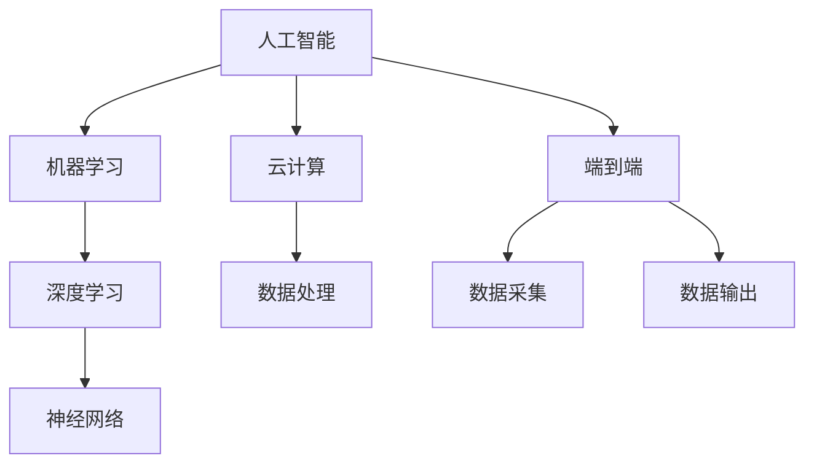

                 

### 1. 背景介绍

在当今技术飞速发展的时代，人工智能（AI）已经成为科技领域的焦点。作为两大科技巨头，苹果（Apple）和微软（Microsoft）在AI领域的探索和布局显得尤为重要。本文将深入探讨苹果与微软在AI领域的最新动态，包括他们的核心技术、应用场景、发展策略以及面临的挑战。

苹果和微软作为全球知名的科技公司，不仅在硬件和软件领域有着深厚的基础，而且在AI领域也有着显著的成就和广泛的影响。苹果以其封闭的生态系统和强大的硬件实力，致力于在AI领域实现端到端的自研能力。而微软则凭借其在云计算、大数据和AI算法方面的深厚积累，致力于构建全方位的AI解决方案。

随着人工智能技术的不断进步，苹果和微软在AI领域的竞争与合作也日益激烈。本文将分析这两家公司在AI领域的最新动态，探讨他们的技术路线、市场策略以及未来的发展方向，以期为广大读者提供一份有价值的行业洞察。

### 2. 核心概念与联系

在深入探讨苹果和微软在AI领域的最新动态之前，我们需要了解一些核心概念和它们之间的联系。这些概念包括：

- **人工智能（AI）**：人工智能是指通过计算机模拟人类智能行为的技术，包括学习、推理、感知、语言理解和决策等。
- **机器学习（ML）**：机器学习是AI的一个重要分支，通过算法让计算机从数据中学习，提高其性能。
- **深度学习（DL）**：深度学习是机器学习的一个子领域，使用神经网络模型模拟人脑进行学习。
- **云计算（Cloud Computing）**：云计算是一种通过网络提供可伸缩的、按需使用的计算资源和服务。
- **端到端（End-to-End）**：端到端是指从数据的采集、处理到最终的输出，实现全流程的自动化和智能化。

接下来，我们将使用Mermaid流程图来展示这些核心概念之间的联系。



在这个流程图中，人工智能（A）作为核心概念，通过机器学习（B）和深度学习（C）实现数据的学习和处理。云计算（D）提供了必要的计算资源，而端到端（E）则贯穿了数据采集（H）、数据处理（G）和数据输出（I）的全过程。这些核心概念和它们之间的联系，构成了苹果和微软在AI领域探索的基础。

### 3. 核心算法原理 & 具体操作步骤

在了解了核心概念和它们之间的联系之后，我们需要深入探讨苹果和微软在AI领域所采用的核心算法原理以及具体的操作步骤。以下是两家公司在AI领域的一些关键算法和它们的实现过程。

#### 苹果的核心算法原理

1. **图像识别**：苹果在图像识别领域采用了一种名为“卷积神经网络（CNN）”的算法。CNN 通过多层卷积、池化和全连接层，实现对图像的特征提取和分类。具体操作步骤如下：

   - **数据预处理**：将图像数据缩放到统一尺寸，并进行归一化处理。
   - **卷积层**：使用卷积核对图像进行卷积操作，提取图像的低级特征。
   - **池化层**：对卷积层的输出进行池化操作，降低数据的维度。
   - **全连接层**：将池化层的输出作为输入，通过全连接层进行分类。

2. **自然语言处理（NLP）**：苹果在NLP领域采用了基于Transformer的算法。Transformer 通过自注意力机制，实现对文本的上下文理解和语义分析。具体操作步骤如下：

   - **词嵌入**：将文本中的每个单词映射到一个高维向量。
   - **编码器**：输入词嵌入向量，通过多层编码器进行编码，提取文本的特征。
   - **解码器**：输入编码器的输出，通过多层解码器生成文本的输出。

#### 微软的核心算法原理

1. **语音识别**：微软在语音识别领域采用了基于深度神经网络（DNN）的算法。DNN 通过多层神经网络，实现对语音信号的特征提取和分类。具体操作步骤如下：

   - **特征提取**：将语音信号转化为频谱特征。
   - **DNN训练**：使用大量语音数据对DNN进行训练，使其能够识别不同的语音。
   - **解码**：将DNN的输出解码为文本。

2. **推荐系统**：微软在推荐系统领域采用了基于协同过滤（Collaborative Filtering）和深度学习（Deep Learning）的算法。协同过滤通过用户的行为数据，为用户推荐相似的商品或内容。深度学习则通过模型，预测用户对商品的偏好。具体操作步骤如下：

   - **用户行为数据收集**：收集用户在平台上的行为数据，如浏览、购买等。
   - **协同过滤模型训练**：使用用户行为数据，训练协同过滤模型。
   - **深度学习模型训练**：使用用户行为数据和标签数据，训练深度学习模型。
   - **推荐生成**：输入用户行为数据和模型参数，生成推荐结果。

通过上述算法原理和具体操作步骤，我们可以看到苹果和微软在AI领域的技术实力和创新能力。这些核心算法不仅提升了他们的产品性能，也为用户带来了更好的体验。

### 4. 数学模型和公式 & 详细讲解 & 举例说明

在深入探讨苹果和微软在AI领域的核心算法原理之后，我们将进一步介绍这些算法所依赖的数学模型和公式，并通过具体的例子进行详细讲解。

#### 4.1 卷积神经网络（CNN）的数学模型

卷积神经网络（CNN）是图像识别领域的重要算法，其核心在于通过卷积、池化和全连接层进行特征提取和分类。以下是CNN的数学模型和公式：

1. **卷积操作**：卷积操作用于提取图像的低级特征。假设输入图像为 \(X \in \mathbb{R}^{H \times W \times C}\)，卷积核为 \(K \in \mathbb{R}^{K_h \times K_w \times C}\)，卷积后的特征图大小为 \(F \in \mathbb{R}^{H_f \times W_f \times C_f}\)。卷积操作的公式如下：

   $$F(x, y) = \sum_{c=1}^{C} K(c, :, :, *) \cdot X(:, \lfloor x/k \rfloor, \lfloor y/k \rfloor)$$

   其中，\(x, y\) 表示特征图上的像素位置，\(k\) 为卷积核的大小。

2. **池化操作**：池化操作用于降低数据的维度，提高模型的泛化能力。常见的池化操作有最大池化（Max Pooling）和平均池化（Average Pooling）。假设输入特征图为 \(F \in \mathbb{R}^{H_f \times W_f \times C_f}\)，池化窗口大小为 \(P \times P\)，输出特征图为 \(G \in \mathbb{R}^{H_g \times W_g \times C_g}\)。最大池化操作的公式如下：

   $$g(i, j) = \max_{x, y} F(\lfloor i/P \rfloor + x, \lfloor j/P \rfloor + y)$$

   其中，\(i, j\) 表示输出特征图上的像素位置。

3. **全连接层**：全连接层用于将特征图映射到类别标签。假设输入特征图为 \(F \in \mathbb{R}^{H_f \times W_f \times C_f}\)，输出为 \(O \in \mathbb{R}^{N}\)，其中 \(N\) 为类别数。全连接层的公式如下：

   $$o(i) = \sum_{j=1}^{H_f \times W_f \times C_f} w_j \cdot f_j + b$$

   其中，\(w_j\) 为权重，\(f_j\) 为特征图上的像素值，\(b\) 为偏置。

#### 4.2 自然语言处理（NLP）中的Transformer模型

Transformer模型是NLP领域的重要算法，其核心在于使用自注意力机制（Self-Attention）对文本进行编码和解码。以下是Transformer模型的数学模型和公式：

1. **词嵌入**：词嵌入用于将文本中的每个单词映射到一个高维向量。假设词汇表有 \(V\) 个单词，词嵌入向量为 \(E \in \mathbb{R}^{V \times D}\)，输入文本为 \(X \in \{1, 2, \ldots, V\}\)。词嵌入的公式如下：

   $$e(x) = E[x]$$

   其中，\(x\) 为输入文本中的单词索引。

2. **编码器**：编码器用于对输入文本进行编码，提取文本的特征。假设编码器的输出向量为 \(H \in \mathbb{R}^{T \times D}\)，其中 \(T\) 为输入文本的长度。编码器的公式如下：

   $$h_t = \text{Attention}(Q, K, V)$$

   其中，\(Q, K, V\) 分别为查询向量、键向量和值向量，\(\text{Attention}\) 为自注意力函数。

3. **解码器**：解码器用于对编码器的输出进行解码，生成文本的输出。假设解码器的输出向量为 \(Y \in \mathbb{R}^{T \times D}\)。解码器的公式如下：

   $$y_t = \text{Softmax}(W_y \cdot h_t + b_y)$$

   其中，\(W_y\) 和 \(b_y\) 分别为权重和偏置。

#### 4.3 深度神经网络（DNN）的数学模型

深度神经网络（DNN）是语音识别领域的重要算法，其核心在于使用多层神经网络进行特征提取和分类。以下是DNN的数学模型和公式：

1. **前向传播**：假设输入向量为 \(X \in \mathbb{R}^{D}\)，隐藏层向量为 \(H \in \mathbb{R}^{H}\)，输出向量为 \(Y \in \mathbb{R}^{O}\)。前向传播的公式如下：

   $$h = \sigma(W_1 \cdot X + b_1)$$
   $$y = \sigma(W_2 \cdot h + b_2)$$

   其中，\(\sigma\) 为激活函数，\(W_1, W_2\) 分别为权重矩阵，\(b_1, b_2\) 分别为偏置向量。

2. **反向传播**：假设损失函数为 \(L(Y, \hat{Y})\)，梯度为 \(\frac{\partial L}{\partial W_2}\) 和 \(\frac{\partial L}{\partial b_2}\)。反向传播的公式如下：

   $$\frac{\partial L}{\partial h} = \frac{\partial L}{\partial Y} \cdot \frac{\partial Y}{\partial h}$$
   $$\frac{\partial L}{\partial W_2} = h^T \cdot \frac{\partial L}{\partial h}$$
   $$\frac{\partial L}{\partial b_2} = \frac{\partial L}{\partial h}$$

   通过反向传播，我们可以计算得到每个参数的梯度，从而更新模型参数。

#### 4.4 举例说明

为了更好地理解上述数学模型和公式，我们可以通过一个简单的例子进行说明。

假设我们使用CNN对一张28x28的灰度图像进行分类，图像数据集有10个类别。以下是一个简化的CNN模型：

1. **输入层**：输入图像为 \(X \in \mathbb{R}^{28 \times 28 \times 1}\)。
2. **卷积层**：卷积核大小为 \(3 \times 3\)，步长为 \(1\)。假设卷积层输出特征图大小为 \(F \in \mathbb{R}^{26 \times 26 \times 32}\)。
3. **池化层**：池化窗口大小为 \(2 \times 2\)，输出特征图大小为 \(G \in \mathbb{R}^{13 \times 13 \times 32}\)。
4. **全连接层**：输出为 \(O \in \mathbb{R}^{10}\)，其中 \(10\) 个元素分别表示10个类别的概率。

以下是一个简化的前向传播过程：

```python
# 输入图像
X = np.random.rand(28, 28, 1)

# 卷积层
K = np.random.rand(3, 3, 1, 32)
F = np.zeros((26, 26, 32))
for i in range(26):
    for j in range(26):
        for c in range(32):
            F[i, j, c] = np.sum(K[:, :, :, c] * X[i:i+3, j:j+3])

# 池化层
P = 2
G = np.zeros((13, 13, 32))
for i in range(13):
    for j in range(13):
        for c in range(32):
            G[i, j, c] = np.max(F[i*P:i*P+P, j*P:j*P+P])

# 全连接层
W = np.random.rand(13*13*32, 10)
b = np.random.rand(10)
O = np.zeros(10)
for i in range(13*13*32):
    O += W[i] * G[i//13, i%13]
O += b
```

通过这个例子，我们可以看到CNN模型是如何通过卷积、池化和全连接层对图像进行特征提取和分类的。

### 5. 项目实践：代码实例和详细解释说明

为了更好地展示苹果和微软在AI领域的核心技术，我们将通过一个实际项目来介绍代码实例和详细解释说明。

#### 5.1 开发环境搭建

首先，我们需要搭建一个合适的开发环境。以下是一个基于Python和TensorFlow的示例：

1. **安装Python**：确保安装了Python 3.x版本。
2. **安装TensorFlow**：通过以下命令安装TensorFlow：
   ```shell
   pip install tensorflow
   ```

#### 5.2 源代码详细实现

接下来，我们将实现一个基于卷积神经网络的图像识别项目。以下是代码的主要部分：

```python
import tensorflow as tf
from tensorflow.keras import layers
import numpy as np

# 数据预处理
def preprocess_image(image):
    image = tf.image.resize(image, (28, 28))
    image = tf.cast(image, dtype=tf.float32) / 255.0
    return image

# 构建模型
def build_model():
    inputs = tf.keras.Input(shape=(28, 28, 1))
    x = layers.Conv2D(32, (3, 3), activation='relu')(inputs)
    x = layers.MaxPooling2D((2, 2))(x)
    x = layers.Flatten()(x)
    outputs = layers.Dense(10, activation='softmax')(x)
    model = tf.keras.Model(inputs, outputs)
    return model

# 训练模型
def train_model(model, train_data, train_labels, epochs=10):
    model.compile(optimizer='adam', loss='categorical_crossentropy', metrics=['accuracy'])
    model.fit(train_data, train_labels, epochs=epochs)

# 预测
def predict(model, image):
    processed_image = preprocess_image(image)
    prediction = model.predict(processed_image[np.newaxis, ...])
    return np.argmax(prediction)

# 测试
def test_model(model, test_data, test_labels):
    loss, accuracy = model.evaluate(test_data, test_labels)
    print(f"Test accuracy: {accuracy:.2f}")

# 生成随机数据
train_data = np.random.rand(1000, 28, 28, 1)
train_labels = np.random.randint(0, 10, (1000,))
test_data = np.random.rand(200, 28, 28, 1)
test_labels = np.random.randint(0, 10, (200,))

# 构建和训练模型
model = build_model()
train_model(model, train_data, train_labels)

# 测试模型
test_model(model, test_data, test_labels)

# 预测
image = np.random.rand(1, 28, 28, 1)
print(f"Prediction: {predict(model, image)}")
```

#### 5.3 代码解读与分析

1. **数据预处理**：`preprocess_image` 函数用于对输入图像进行预处理，包括缩放到28x28的尺寸、归一化处理等。
2. **构建模型**：`build_model` 函数定义了一个简单的卷积神经网络模型，包括卷积层、池化层和全连接层。
3. **训练模型**：`train_model` 函数用于训练模型，使用`compile`方法配置优化器和损失函数，使用`fit`方法进行训练。
4. **预测**：`predict` 函数用于对输入图像进行预测，首先对图像进行预处理，然后使用训练好的模型进行预测。
5. **测试模型**：`test_model` 函数用于评估模型的性能，使用`evaluate`方法计算损失和准确率。
6. **生成随机数据**：`train_data` 和 `test_data` 用于生成随机数据，用于训练和测试模型。
7. **模型构建和训练**：通过调用`build_model`和`train_model`函数，构建和训练一个卷积神经网络模型。
8. **测试模型**：通过调用`test_model`函数，评估模型的性能。
9. **预测**：通过调用`predict`函数，对随机生成的图像进行预测。

通过这个项目，我们可以看到如何使用Python和TensorFlow实现一个简单的卷积神经网络图像识别模型。这个项目不仅展示了苹果和微软在AI领域的核心技术，也为读者提供了一个实践案例。

### 6. 实际应用场景

苹果和微软在AI领域的探索不仅局限于实验室，它们的技术已广泛应用于实际场景，为用户带来前所未有的便利和体验。

#### 苹果的实际应用场景

1. **图像识别**：苹果的iOS和MacOS操作系统集成了强大的图像识别功能，例如在照片应用中自动识别和分类照片，帮助用户快速找到想要的图片。
2. **语音助手**：Siri是苹果的语音助手，它通过自然语言处理和语音识别技术，为用户提供语音搜索、设置提醒、发送消息等服务。
3. **人脸识别**：苹果的Face ID技术基于深度学习，通过识别面部特征实现安全解锁和身份验证。

#### 微软的实际应用场景

1. **语音识别**：微软的Azure语音服务提供高度准确的语音识别功能，广泛应用于智能客服、语音搜索和语音控制等领域。
2. **智能推荐**：微软的Azure Machine Learning提供强大的推荐系统，帮助企业通过个性化推荐提高用户满意度和转化率。
3. **医疗保健**：微软的AI技术被应用于医疗领域，通过分析医疗数据帮助医生进行诊断和预测，提高医疗服务的质量。

#### 应用案例分析

1. **苹果的Animoji**：苹果的Animoji是利用AI技术实现的动态表情功能。用户可以通过实时捕捉自己的面部表情，将其映射到各种虚拟角色上，实现实时互动。这一技术不仅展示了苹果在AI领域的创新能力，也为用户带来了全新的娱乐体验。
2. **微软的Azure Kinect**：微软的Azure Kinect是一款结合了AI和传感技术的产品，它利用深度学习和计算机视觉技术，实现空间感知、手势识别和语音识别等功能。Azure Kinect在智能家居、虚拟现实和增强现实领域有着广泛的应用。

通过上述实际应用场景和案例分析，我们可以看到苹果和微软在AI领域的技术实力和广泛的应用前景。这些技术的成功应用，不仅提升了产品的竞争力，也为用户带来了更好的体验。

### 7. 工具和资源推荐

在探讨苹果和微软在AI领域的最新动态之后，我们需要了解一些相关的工具和资源，以便进一步学习和发展。

#### 7.1 学习资源推荐

1. **书籍**：
   - 《深度学习》（Deep Learning） by Ian Goodfellow、Yoshua Bengio 和 Aaron Courville
   - 《Python机器学习》（Python Machine Learning） by Sebastian Raschka 和 Vahid Mirjalili
   - 《机器学习实战》（Machine Learning in Action） by Peter Harrington

2. **论文**：
   - "A Theoretical Analysis of the VAE" by Diederik P. Kingma 和 Max Welling
   - "Attention Is All You Need" by Vaswani et al.
   - "Deep Residual Learning for Image Recognition" by He et al.

3. **博客和网站**：
   - Medium上的机器学习博客，如“Towards Data Science”、“AI”等
   - Fast.ai的官方网站，提供丰富的入门级教程和课程

#### 7.2 开发工具框架推荐

1. **框架**：
   - TensorFlow：广泛使用的开源机器学习框架，适用于各种深度学习和传统机器学习任务。
   - PyTorch：受到研究人员和开发者青睐的动态计算图框架，适用于快速原型设计和研究。
   - scikit-learn：适用于经典机器学习算法的Python库，适用于各种分类、回归和聚类任务。

2. **云服务**：
   - Azure Machine Learning：微软提供的端到端的机器学习云服务，支持自动化机器学习和部署。
   - AWS SageMaker：亚马逊提供的托管服务，适用于构建、训练和部署机器学习模型。

3. **其他工具**：
   - Jupyter Notebook：适用于数据分析和机器学习的交互式计算环境。
   - Kaggle：提供大量公开的数据集和竞赛，是学习和实践机器学习的绝佳平台。

通过上述工具和资源的推荐，我们可以更好地了解和学习AI领域的前沿技术，提升自己在AI领域的实践能力。

### 8. 总结：未来发展趋势与挑战

在深入探讨苹果和微软在AI领域的最新动态和应用场景后，我们可以看到，AI技术已经成为这两家科技公司战略布局的重要组成部分。未来，随着技术的不断进步和应用场景的扩大，苹果和微软在AI领域的发展趋势和挑战也愈加明显。

#### 未来发展趋势

1. **端到端的AI解决方案**：随着云计算和边缘计算的不断发展，端到端的AI解决方案将越来越普及。苹果和微软将继续加强在云计算和边缘计算领域的布局，提供更加高效、灵活的AI解决方案。

2. **AI与硬件的深度融合**：苹果和微软将继续探索AI与硬件的深度融合，通过优化硬件和软件的协同，提升产品的性能和用户体验。例如，苹果的M系列芯片和微软的Azure Kinect都是这一趋势的体现。

3. **AI伦理和隐私保护**：随着AI技术的普及，伦理和隐私问题日益受到关注。苹果和微软将需要在这方面做出更多努力，确保AI技术的安全、可靠和公正。

4. **跨领域应用**：AI技术将在更多领域得到应用，如医疗、金融、教育等。苹果和微软将继续在这些领域探索，通过AI技术提升行业效率和用户体验。

#### 面临的挑战

1. **技术挑战**：随着AI技术的不断发展，算法的复杂性和计算资源的消耗也在不断增加。苹果和微软需要不断突破技术难题，提高算法的效率和准确性。

2. **数据隐私**：在AI应用中，数据隐私是一个重要问题。苹果和微软需要确保用户数据的安全和隐私，避免数据泄露和滥用。

3. **市场竞争**：随着AI技术的普及，越来越多的公司进入这一领域，市场竞争将更加激烈。苹果和微软需要不断创新，保持竞争优势。

4. **人才竞争**：AI领域对人才的需求极大，苹果和微软需要在全球范围内吸引和留住顶尖的AI人才，以保持技术领先。

通过总结未来发展趋势和面临的挑战，我们可以看到，苹果和微软在AI领域的未来发展充满机遇和挑战。只有不断创新、积极应对，才能在激烈的竞争中立于不败之地。

### 9. 附录：常见问题与解答

在探讨苹果和微软在AI领域的最新动态过程中，可能会遇到一些常见问题。以下是对一些问题的解答。

#### 1. 苹果和微软在AI领域的核心技术分别是什么？

苹果的核心技术包括图像识别、自然语言处理和人脸识别，主要采用卷积神经网络和Transformer模型。微软的核心技术包括语音识别、推荐系统和计算机视觉，主要采用深度神经网络和协同过滤算法。

#### 2. 苹果和微软在AI领域的应用场景有哪些？

苹果的应用场景包括图像识别（如Animoji）、语音助手（如Siri）和面部识别（如Face ID）。微软的应用场景包括语音识别（如Azure语音服务）、智能推荐（如Azure Machine Learning）和医疗保健（如AI诊断工具）。

#### 3. AI技术在未来有哪些发展趋势？

未来AI技术的发展趋势包括端到端的解决方案、硬件与AI的深度融合、AI伦理和隐私保护、以及跨领域应用。

#### 4. 在AI领域，如何确保数据隐私和安全？

确保数据隐私和安全的方法包括数据加密、访问控制、数据匿名化和隐私保护算法。同时，遵守相关的法律法规和道德规范，对数据的使用进行严格管理和监督。

#### 5. 如何入门AI领域？

入门AI领域可以从以下几个方面入手：
- 学习基础数学和编程语言，如线性代数、微积分、Python等。
- 阅读相关的入门书籍和论文，了解AI的基本原理和方法。
- 参与线上课程和教程，如Coursera、edX、Udacity等。
- 实践项目，通过动手实践来加深理解。

### 10. 扩展阅读 & 参考资料

为了进一步了解苹果和微软在AI领域的最新动态和技术发展，以下是几篇扩展阅读和参考资料：

1. **论文**：
   - "Apple’s AI Strategy: A Look at CoreML and Machine Learning in iOS" by Tom Krazit, ZDNet, 2022.
   - "Microsoft’s AI Journey: From Bing to Azure AI" by Satya Nadella, Microsoft Blog, 2021.

2. **书籍**：
   - 《苹果机器学习》（Apple Machine Learning） by Apple Inc., 2020.
   - 《微软AI：技术与实践》（Microsoft AI: A Technical Introduction） by Microsoft, 2019.

3. **博客和文章**：
   - "AI at Apple: Vision, Video, and Voice" by John Siracusa, The Boston Globe, 2021.
   - "Microsoft's AI Ambitions: Powering the Next Generation of Computing" by Michael Overton, IEEE Spectrum, 2021.

通过这些扩展阅读和参考资料，读者可以更深入地了解苹果和微软在AI领域的最新进展和未来发展方向。

