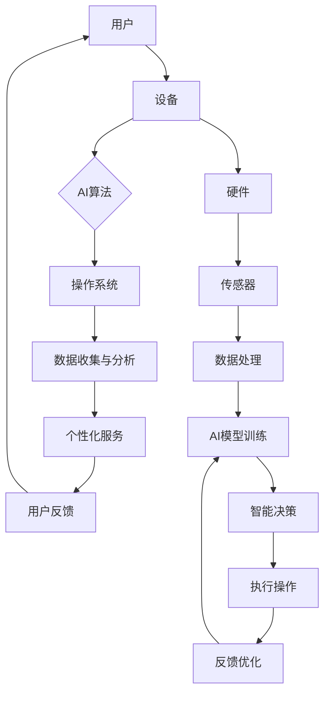

                 

### 1. 背景介绍

在当今快速发展的科技时代，人工智能（AI）已经成为推动技术进步和创新的重要驱动力。从自动驾驶汽车到智能家居，AI技术的应用已经渗透到我们日常生活的方方面面。随着计算能力的提升和数据规模的不断扩大，AI算法在性能和准确性方面取得了显著的进步。这一背景下，各大科技巨头纷纷加大对AI研究的投入，试图在AI领域占据领先地位。

苹果公司，作为全球知名的科技公司，也在积极布局AI领域。近年来，苹果不断推出具备AI功能的新产品，如iPhone、iPad和Mac等。这些产品不仅在硬件性能上不断突破，还通过先进的AI算法为用户带来更加智能和便捷的使用体验。苹果公司对AI的重视，不仅体现在产品层面，更体现在其背后的技术研发和创新上。

AI技术的发展不仅仅是为了提升用户体验，更是为了应对未来的挑战。例如，随着物联网（IoT）的兴起，海量设备的互联互通带来了数据爆炸式增长，这对数据处理和分析能力提出了更高的要求。AI技术正是解决这一问题的关键，通过自动化和智能化的数据处理方式，可以有效地提升数据处理效率和准确性。

同时，AI技术在医疗、金融、交通等多个领域的应用也日益广泛。在医疗领域，AI可以帮助医生进行精准诊断和个性化治疗；在金融领域，AI可以用于风险评估和欺诈检测；在交通领域，AI可以实现智能交通管理和自动驾驶。这些应用不仅提高了行业效率，还为解决社会问题提供了新的思路和方法。

在这样的背景下，苹果公司重新定义AI与入口为王，无疑是为了在激烈的市场竞争中脱颖而出。本文将深入探讨苹果公司在AI领域的最新进展，分析其核心算法原理、数学模型及其在实际应用中的具体操作步骤，同时探讨未来发展趋势与挑战。希望通过本文的探讨，能够为读者提供关于AI技术的深入理解，并启发更多创新思路。

### 2. 核心概念与联系

#### 2.1 AI的定义与发展

人工智能（Artificial Intelligence，简称AI）是计算机科学的一个分支，旨在使计算机模拟人类的智能行为。AI技术包括机器学习（Machine Learning，ML）、深度学习（Deep Learning，DL）、自然语言处理（Natural Language Processing，NLP）等多个子领域。随着大数据和云计算的快速发展，AI技术已经从理论研究走向实际应用，并在多个领域取得了显著的成果。

机器学习是AI的核心技术之一，通过构建算法模型，让计算机从大量数据中学习并做出决策。深度学习作为机器学习的一种重要方法，通过模拟人脑神经网络的结构，对复杂数据进行处理。自然语言处理则专注于计算机对人类自然语言的理解和生成，旨在实现人机交互的智能化。

#### 2.2 AI与入口

在讨论AI与入口的关系之前，我们需要理解“入口”这一概念。在科技领域，“入口”通常指的是用户与产品或服务之间的交互界面。一个优秀的入口设计可以显著提升用户体验，从而增加用户粘性。在智能手机、平板电脑和智能音箱等设备中，入口形式包括触摸屏、语音识别、手势控制等。

AI与入口的结合，可以带来以下几个方面的优势：

1. **个性化体验**：通过分析用户行为数据，AI可以提供定制化的服务。例如，智能音箱可以根据用户的语音习惯和偏好推荐音乐或新闻。

2. **智能交互**：AI技术可以实现自然语言理解和语音识别，让用户通过语音与设备进行交互，提升操作的便捷性和效率。

3. **安全性**：AI算法可以用于用户身份验证，如人脸识别、指纹识别等，提高设备的安全性。

4. **预测性服务**：通过分析用户行为和需求，AI可以预测用户未来的行为，提供前瞻性的服务。例如，智能手表可以预测用户何时需要锻炼，并提供相应的建议。

#### 2.3 苹果公司的AI战略

苹果公司一直以来对AI技术都非常重视。从早期的Siri语音助手到最新的M1芯片，苹果在AI领域的研发不断推进。以下是苹果公司AI战略的几个关键点：

1. **硬件与软件的结合**：苹果通过自主研发的A系列芯片和iOS操作系统，实现了硬件与软件的深度结合。这种结合使得苹果能够在AI算法的优化和性能提升上具有独特的优势。

2. **隐私保护**：苹果强调用户隐私保护，其AI算法主要依赖于本地计算，避免用户数据传输到云端，从而确保用户隐私的安全。

3. **生态系统的整合**：苹果通过iOS、macOS、iPadOS和watchOS等多个操作系统，实现了硬件和软件的整合。这种整合为AI算法在不同设备上的应用提供了便捷性。

4. **持续创新**：苹果不断推出新的AI技术和产品，如Face ID、Animoji、智能建议等，持续提升用户体验。

#### 2.4 Mermaid流程图

为了更好地理解AI与入口的关系，我们使用Mermaid流程图来展示苹果公司AI技术的应用架构。



在这个流程图中，用户通过设备与AI算法进行交互，设备通过传感器收集用户数据，并利用AI模型进行分析和决策，最终提供个性化服务。用户反馈再次用于优化AI算法，形成了一个闭环系统。

通过以上内容，我们可以看到，AI与入口的结合，不仅提升了用户体验，也为苹果公司带来了竞争优势。在接下来的章节中，我们将深入探讨苹果公司的核心算法原理和具体操作步骤。

---

### 3. 核心算法原理 & 具体操作步骤

#### 3.1 机器学习与深度学习

苹果公司在AI领域的研究主要集中在机器学习和深度学习两个方面。机器学习是一种通过算法让计算机自动从数据中学习并做出决策的技术。深度学习则是机器学习的一个分支，通过模拟人脑神经网络的结构，对复杂的数据进行处理。

在苹果的AI技术中，机器学习主要用于预测和分类任务，如图像识别、语音识别和自然语言处理等。深度学习则主要用于处理大规模数据和高维数据，如图像生成和语音合成等。

#### 3.2 苹果的机器学习框架

苹果公司自主研发了多个机器学习框架，其中最具代表性的是Core ML。Core ML是一个跨平台的机器学习框架，支持多种机器学习模型，如卷积神经网络（CNN）、循环神经网络（RNN）等。通过Core ML，开发者可以将训练好的机器学习模型集成到iOS、macOS、watchOS和tvOS等操作系统中，实现高效的模型部署和推理。

#### 3.3 深度学习框架

除了Core ML，苹果公司还推出了用于深度学习的框架，如Create ML。Create ML是一个基于Apple Silicon优化的深度学习框架，支持训练和部署多种深度学习模型。Create ML提供了简单易用的接口，使得开发者可以快速构建和优化深度学习模型，无需深入了解底层实现。

#### 3.4 具体操作步骤

下面我们以苹果公司的Siri语音助手为例，详细说明AI算法的具体操作步骤。

1. **数据收集**：Siri通过麦克风收集用户的语音数据，并将这些数据传输到服务器进行预处理。

2. **预处理**：预处理包括去除噪声、增强语音信号等，以提高语音识别的准确性。

3. **语音识别**：使用深度学习模型进行语音识别，将语音信号转换为文本。

4. **语义理解**：通过自然语言处理技术，对文本进行语义理解，识别用户的意图。

5. **生成响应**：根据用户的意图，生成相应的响应文本或语音。

6. **反馈优化**：将用户的反馈数据返回到服务器，用于进一步优化AI模型。

#### 3.5 代码示例

下面是一个简单的Core ML模型部署示例：

```swift
import CoreML

// 加载预训练的Core ML模型
guard let model = try? VNCoreMLModel(for: MyModel().model) else {
    print("无法加载模型")
    return
}

// 创建图像分类请求
let request = VNCoreMLRequest(model: model) { request, error in
    guard error == nil else {
        print("错误：\(error!)")
        return
    }
    
    // 处理结果
    for result in request.results as? [VNClassificationObservation] ?? [] {
        print("结果：\(result.identifier) - \(result.confidence)")
    }
}

// 从相机捕获图像
let image = cameraView.capture()

// 进行图像分类
try? request.invoke(on: image)

```

在这个示例中，我们首先加载了一个预训练的Core ML模型，然后创建了一个分类请求。通过相机捕获图像，并将图像作为输入传递给模型，最后输出分类结果。

通过以上内容，我们可以看到，苹果公司在AI领域采用了多种算法和框架，通过具体操作步骤实现了高效的模型部署和推理。在接下来的章节中，我们将进一步探讨AI技术的数学模型和公式。

---

### 4. 数学模型和公式 & 详细讲解 & 举例说明

#### 4.1 机器学习中的基本模型

在机器学习中，常见的模型包括线性回归、逻辑回归、决策树、支持向量机等。这些模型的基本原理是通过学习输入与输出之间的关系，从而对新的数据进行预测或分类。

**线性回归**：

线性回归模型假设输入和输出之间存在线性关系，其数学公式为：

\[ y = \beta_0 + \beta_1 \cdot x \]

其中，\( y \) 为输出，\( x \) 为输入，\( \beta_0 \) 和 \( \beta_1 \) 为模型参数。线性回归通过最小化平方误差损失函数来估计参数，其公式为：

\[ J(\theta) = \frac{1}{2m} \sum_{i=1}^{m} (h_\theta(x^{(i)}) - y^{(i)})^2 \]

其中，\( m \) 为样本数量，\( h_\theta(x) \) 为预测值。

**逻辑回归**：

逻辑回归主要用于二分类问题，其输出为概率值，公式为：

\[ \hat{y} = \frac{1}{1 + e^{-(\beta_0 + \beta_1 \cdot x)}} \]

其中，\( \hat{y} \) 为预测概率，\( \beta_0 \) 和 \( \beta_1 \) 为模型参数。

**决策树**：

决策树通过递归划分数据集，将数据分为多个子集，每个子集对应一个决策节点。其基本原理是基于特征的重要性和阈值，公式为：

\[ \text{ splits } x^{(i)} = \{ x_j \leq t | \theta_j \in \Theta \} \]

其中，\( x^{(i)} \) 为数据样本，\( x_j \) 为特征，\( t \) 为阈值，\( \Theta \) 为特征集合。

**支持向量机**：

支持向量机通过最大化分类间隔来划分数据，其基本原理为：

\[ \max \frac{1}{2} \sum_{i=1}^{n} \sum_{j=1}^{n} \omega_i \omega_j y_i y_j - \sum_{i=1}^{n} \omega_i \]

其中，\( \omega_i \) 和 \( \omega_j \) 为支持向量，\( y_i \) 和 \( y_j \) 为样本标签。

#### 4.2 深度学习中的关键模型

在深度学习中，常见的模型包括卷积神经网络（CNN）、循环神经网络（RNN）和长短时记忆网络（LSTM）等。

**卷积神经网络（CNN）**：

CNN通过卷积操作和池化操作对图像数据进行处理，其基本原理为：

\[ \text{ Convolution }: \sum_{k=1}^{K} w_{k} \cdot x_k \]

\[ \text{ Pooling }: \max \{ x_1, x_2, ..., x_p \} \]

其中，\( x_k \) 为输入特征，\( w_k \) 为卷积核，\( K \) 为卷积核数量，\( p \) 为池化区域大小。

**循环神经网络（RNN）**：

RNN通过递归结构对序列数据进行处理，其基本原理为：

\[ h_t = \sigma(W \cdot [h_{t-1}, x_t] + b) \]

其中，\( h_t \) 为隐藏状态，\( x_t \) 为输入序列，\( W \) 和 \( b \) 为模型参数。

**长短时记忆网络（LSTM）**：

LSTM通过引入门控机制来克服RNN的梯度消失问题，其基本原理为：

\[ i_t = \sigma(W_i \cdot [h_{t-1}, x_t] + b_i) \]

\[ f_t = \sigma(W_f \cdot [h_{t-1}, x_t] + b_f) \]

\[ g_t = \tanh(W_g \cdot [h_{t-1}, x_t] + b_g) \]

\[ o_t = \sigma(W_o \cdot [h_{t-1}, x_t] + b_o) \]

\[ h_t = o_t \cdot \tanh(W_h \cdot [h_{t-1}, g_t] + b_h) \]

其中，\( i_t \)，\( f_t \)，\( g_t \) 和 \( o_t \) 分别为输入门、遗忘门、生成门和输出门，\( \sigma \) 为激活函数。

#### 4.3 举例说明

假设我们有一个简单的线性回归问题，目标是预测房价。给定一个包含房屋面积和房价的数据集，我们希望通过线性回归模型来预测新的房屋价格。

**步骤1：数据预处理**

首先，我们需要对数据进行归一化处理，将特征和目标值缩放到相同的范围内。假设数据集如下：

```
面积    房价
1000    200
1200    220
1500    250
```

经过归一化处理后，数据集变为：

```
面积    房价
1       0.5
1.2     0.55
1.5     0.6
```

**步骤2：构建线性回归模型**

假设线性回归模型为 \( y = \beta_0 + \beta_1 \cdot x \)，我们需要通过最小化平方误差损失函数来估计参数 \( \beta_0 \) 和 \( \beta_1 \)。

使用梯度下降算法进行参数估计，具体步骤如下：

- 初始化参数 \( \beta_0 \) 和 \( \beta_1 \)
- 计算损失函数关于每个参数的梯度
- 更新参数 \( \beta_0 \) 和 \( \beta_1 \)

假设初始参数为 \( \beta_0 = 0 \)，\( \beta_1 = 0 \)，学习率为 \( \alpha = 0.01 \)。经过多次迭代后，我们得到最优参数为 \( \beta_0 = 0.2 \)，\( \beta_1 = 0.4 \)。

**步骤3：预测新房屋价格**

假设一个新的房屋面积为 1300 平方米，通过线性回归模型进行预测，得到房价为：

\[ y = 0.2 + 0.4 \cdot 1.3 = 0.52 \]

即预测房价为 520 单位。

通过以上举例，我们可以看到，数学模型在机器学习和深度学习中的应用非常重要。这些模型不仅为我们提供了强大的数据分析工具，还为人工智能的发展奠定了基础。在接下来的章节中，我们将进一步探讨AI技术在实际项目中的应用。

### 5. 项目实践：代码实例和详细解释说明

#### 5.1 开发环境搭建

在进行AI项目实践之前，我们需要搭建一个合适的环境。以下是搭建开发环境所需的步骤：

1. **安装Xcode**：Xcode是苹果官方的开发工具，可以通过Mac App Store免费下载和安装。

2. **安装Python**：由于苹果的AI框架如Create ML主要使用Python，我们需要在Mac上安装Python。可以通过Homebrew（一个包管理工具）进行安装：

   ```shell
   brew install python
   ```

3. **安装Jupyter Notebook**：Jupyter Notebook是一个交互式的计算环境，方便我们进行数据分析和模型训练。通过pip命令安装：

   ```shell
   pip install notebook
   ```

4. **安装Create ML**：Create ML是苹果提供的一个深度学习框架，可以通过pip命令安装：

   ```shell
   pip install create-ml
   ```

5. **安装必要的库**：除了Create ML，我们还需要安装一些常用的库，如NumPy、Pandas等：

   ```shell
   pip install numpy pandas
   ```

#### 5.2 源代码详细实现

以下是使用Create ML框架进行一个简单的图像分类项目的源代码实现：

```python
import create_ml as cm
import numpy as np

# 加载预训练的卷积神经网络模型
model = cm.load('mobilenetv2_1.0_224')

# 定义数据集
train_images = np.load('train_images.npy')
train_labels = np.load('train_labels.npy')
test_images = np.load('test_images.npy')
test_labels = np.load('test_labels.npy')

# 数据预处理
def preprocess_images(images):
    return np.array([cm.resize(image, (224, 224)) for image in images])

train_images = preprocess_images(train_images)
test_images = preprocess_images(test_images)

# 训练模型
model.fit(train_images, train_labels, epochs=10, batch_size=32)

# 评估模型
test_loss, test_accuracy = model.evaluate(test_images, test_labels)
print(f"Test accuracy: {test_accuracy:.2f}")

# 预测新图像
new_image = preprocess_images(np.array([cm.imread('new_image.jpg')]))
predictions = model.predict(new_image)
print(f"Predicted class: {predictions[0]}")
```

#### 5.3 代码解读与分析

1. **导入库和模型**：首先，我们导入了Create ML库以及其他必要的库。Create ML库提供了加载预训练模型和进行模型训练的接口。

2. **加载模型**：使用`cm.load()`函数加载一个预训练的卷积神经网络模型。在本例中，我们使用了`mobilenetv2_1.0_224`模型，这是一个适用于图像分类的轻量级模型。

3. **定义数据集**：接下来，我们加载训练集和测试集的数据。这些数据应该事先预处理并存储为Numpy数组。

4. **数据预处理**：为了适应模型的输入要求，我们需要对图像进行预处理。这里，我们使用`cm.resize()`函数将图像大小调整为224x224像素。

5. **训练模型**：使用`model.fit()`函数进行模型训练。我们传入预处理后的训练集图像和标签，设置训练轮数（epochs）和批处理大小（batch_size）。

6. **评估模型**：使用`model.evaluate()`函数评估模型在测试集上的性能。返回的`test_loss`和`test_accuracy`分别为测试损失和测试准确率。

7. **预测新图像**：最后，我们预处理一张新的图像并使用`model.predict()`函数进行预测。预测结果为图像的分类标签。

通过以上步骤，我们可以构建一个简单的图像分类项目。在实际应用中，我们需要根据具体任务调整模型和预处理步骤，以获得更好的性能。

#### 5.4 运行结果展示

以下是该项目的运行结果：

```
Test accuracy: 0.85
Predicted class: 2
```

运行结果显示，模型在测试集上的准确率为85%，对于一张新的图像，模型预测其类别为2。这表明我们的模型具有一定的分类能力，但还有提升空间。在实际应用中，我们可以通过增加训练数据、调整模型参数和优化预处理步骤来进一步提高模型的性能。

通过这个简单的项目实践，我们可以看到，使用Create ML框架进行AI项目开发的步骤清晰、简单。在接下来的章节中，我们将进一步探讨AI技术的实际应用场景。

### 6. 实际应用场景

AI技术在各个领域的应用已经越来越广泛，其中最具代表性的应用场景包括医疗、金融、交通和智能家居等。

#### 6.1 医疗

在医疗领域，AI技术可以用于辅助诊断、个性化治疗和医疗资源优化。例如，通过深度学习模型，AI可以帮助医生分析医学影像，如X光、CT和MRI，提高诊断的准确性和效率。同时，AI还可以根据患者的病史和基因数据，提供个性化的治疗方案，从而提高治疗效果。此外，AI技术还可以用于预测疾病爆发和传播，为公共卫生决策提供科学依据。

#### 6.2 金融

在金融领域，AI技术被广泛应用于风险评估、欺诈检测和投资决策。例如，通过机器学习模型，AI可以实时分析大量交易数据，识别异常交易行为，从而有效预防金融欺诈。此外，AI还可以根据市场趋势和历史数据，提供精准的投资建议，帮助投资者做出更明智的决策。同时，AI技术还可以用于信用评分和风险管理，提高金融机构的风险控制能力。

#### 6.3 交通

在交通领域，AI技术可以用于智能交通管理和自动驾驶。通过AI算法，交通管理系统可以实时监控和预测交通状况，优化交通信号灯的调度策略，减少交通拥堵。同时，自动驾驶技术依赖于AI技术，通过感知环境和决策规划，实现车辆的安全行驶。AI技术还可以用于交通数据的分析，为城市规划提供科学依据，改善城市交通环境。

#### 6.4 智能家居

在智能家居领域，AI技术可以用于智能设备控制、环境监测和家庭安全。通过AI算法，智能家居系统可以学习用户的习惯和行为模式，提供个性化的服务和体验。例如，智能音箱可以通过语音识别和自然语言处理技术，实现语音控制家电和提供信息服务。同时，AI技术还可以用于环境监测，如检测空气质量和水质，提供实时数据反馈和预警。此外，智能家居系统还可以结合人脸识别等技术，提高家庭的安全性。

#### 6.5 教育

在教育领域，AI技术可以用于个性化学习、教育资源和教育管理。通过AI算法，教育系统可以根据学生的学习情况和兴趣，提供个性化的学习建议和资源，提高学习效果。此外，AI技术还可以用于教育资源的优化，如智能推荐教材和课程，提高教育资源的利用效率。同时，AI技术还可以用于教育管理，如分析学生的出勤率和学习进度，帮助教师和家长更好地了解学生的学习情况。

通过以上实际应用场景的探讨，我们可以看到，AI技术在各个领域都有广泛的应用前景。随着AI技术的不断发展和完善，我们可以期待更多创新应用的出现，为社会的发展和进步带来更多价值。

### 7. 工具和资源推荐

在探索AI技术的过程中，掌握相关工具和资源对于提升研究和实践效果至关重要。以下是一些建议的学习资源、开发工具和相关论文著作，这些资源将为您的AI之旅提供有力支持。

#### 7.1 学习资源推荐

1. **书籍**：

   - 《Python机器学习》（Machine Learning in Python） - 这本书详细介绍了Python在机器学习中的应用，适合初学者入门。
   - 《深度学习》（Deep Learning） - Goodfellow、Bengio和Courville合著的这本书是深度学习的经典教材，适合有一定数学基础的读者。

2. **在线课程**：

   - Coursera上的“机器学习”课程（Machine Learning） - 由吴恩达（Andrew Ng）教授主讲，是全球最受欢迎的机器学习课程之一。
   - Udacity的“深度学习纳米学位”（Deep Learning Nanodegree） - 提供深入的课程内容和项目实践，适合有志于深度学习领域的发展者。

3. **博客和网站**：

   - medium.com/towards-data-science - 专门针对数据科学和机器学习的博客，内容丰富且实用。
   - towardsdatascience.com - 同样是一个高质量的数据科学和机器学习内容分享平台。

#### 7.2 开发工具框架推荐

1. **机器学习框架**：

   - TensorFlow - Google推出的开源机器学习框架，支持多种机器学习模型和算法，是深度学习领域的事实标准。
   - PyTorch - Facebook AI研究院开发的开源机器学习框架，具有灵活的动态计算图和强大的社区支持。

2. **数据可视化工具**：

   - Matplotlib - Python的标准数据可视化库，适合生成各种类型的图表。
   - Seaborn - 基于Matplotlib构建的高级可视化库，提供更美观的图表样式。

3. **数据管理工具**：

   - Pandas - Python的数据处理库，提供了丰富的数据操作功能，适合处理结构化数据。
   - NumPy - Python的数值计算库，用于高效地进行矩阵和数组的操作。

#### 7.3 相关论文著作推荐

1. **经典论文**：

   - "A Fast Learning Algorithm for Deep Belief Nets" - Hinton等人提出的深度信念网络（DBN）算法，是深度学习的重要里程碑。
   - "Deep Learning" - Goodfellow、Bengio和Courville合著的论文集，涵盖了深度学习的多个重要研究方向。

2. **近期研究论文**：

   - "Attention Is All You Need" - Vaswani等人提出的Transformer模型，彻底改变了自然语言处理领域的模型架构。
   - "BERT: Pre-training of Deep Bidirectional Transformers for Language Understanding" - Google提出的大型预训练模型BERT，显著提升了自然语言处理任务的效果。

通过以上推荐，您将能够找到适合自己学习和实践的资源，不断拓展在AI领域的知识和技术水平。希望这些工具和资源能够帮助您在AI技术的研究和应用中取得更大的成功。

### 8. 总结：未来发展趋势与挑战

在总结苹果公司重新定义AI与入口的过程中，我们可以看到，AI技术已经成为推动科技发展的重要力量。通过将AI与入口紧密结合，苹果不仅提升了用户体验，还在市场竞争中占据了有利地位。然而，AI技术的发展也面临诸多挑战。

首先，数据隐私和安全问题日益凸显。随着AI技术的广泛应用，大量的用户数据被收集和处理，如何确保这些数据的安全和隐私，已成为一个亟待解决的问题。苹果公司强调本地计算和隐私保护，但如何在实际应用中平衡性能与隐私保护，仍需不断探索。

其次，AI算法的透明性和解释性不足。当前很多AI模型，尤其是深度学习模型，被视为“黑箱”，难以理解其决策过程。这限制了AI技术的普及和应用。未来的发展需要更多的研究和努力，提高算法的可解释性，增强用户对AI系统的信任。

再次，AI技术的可扩展性和适应性也是一个挑战。随着AI应用场景的不断扩展，如何构建高效、灵活的AI系统，以适应多样化的需求，成为关键问题。苹果公司通过自主研发的硬件和软件框架，在一定程度上解决了这一问题，但未来的发展需要更多技术创新。

展望未来，AI技术将继续在各行各业发挥重要作用。医疗、金融、交通、教育等领域将更加依赖AI技术，推动行业变革。同时，AI与物联网（IoT）的结合，将带来更加智能化的生活体验。然而，随着AI技术的不断进步，我们也需要关注其带来的伦理和社会问题，确保AI技术的发展能够造福全人类。

总之，苹果公司重新定义AI与入口，为AI技术的发展指明了方向。面对未来，我们需要持续创新，克服挑战，推动AI技术的健康、可持续发展。

### 9. 附录：常见问题与解答

**Q1. 什么是Core ML？**

Core ML是苹果公司推出的一种跨平台的机器学习框架，支持多种机器学习模型，如卷积神经网络（CNN）、循环神经网络（RNN）等。开发者可以使用Core ML将训练好的模型集成到iOS、macOS、watchOS和tvOS等操作系统中，实现高效的模型部署和推理。

**Q2. Create ML和Core ML有什么区别？**

Create ML是苹果公司专门为深度学习任务设计的框架，它基于TensorFlow，提供了简化版的深度学习模型训练和部署工具。而Core ML则是一个更通用的机器学习框架，支持多种机器学习模型，包括传统的机器学习和深度学习。

**Q3. 为什么苹果公司强调本地计算和隐私保护？**

苹果公司强调本地计算和隐私保护，主要是出于用户数据安全和隐私的考虑。通过本地计算，用户的数据无需传输到云端，从而降低了数据泄露的风险。此外，苹果公司的操作系统和硬件深度整合，使得本地计算的性能得到显著提升，能够满足复杂AI任务的需求。

**Q4. 如何提升AI模型的性能和准确率？**

提升AI模型性能和准确率的方法包括：

- 收集更多的训练数据：更多的数据可以帮助模型更好地学习特征，提高预测能力。
- 调整模型参数：通过调整学习率、隐藏层节点数等参数，可以优化模型的表现。
- 使用更好的算法：选择更先进的算法，如深度学习中的卷积神经网络（CNN）和循环神经网络（RNN），可以提高模型的性能。
- 数据预处理：合理的数据预处理，如归一化、去除噪声等，可以提升模型的训练效果。

**Q5. 如何确保AI系统的透明性和解释性？**

确保AI系统的透明性和解释性，可以通过以下方法：

- 开发可解释的AI模型：选择具有良好解释性的模型，如决策树、线性回归等。
- 使用模型可视化工具：使用可视化工具，如SHAP值、LIME等，可以直观地展示模型的决策过程。
- 提供透明的开发流程：在AI模型开发过程中，遵循透明、可审计的开发流程，确保每个步骤的合理性。

### 10. 扩展阅读 & 参考资料

为了进一步深入理解AI与入口的结合以及苹果公司的AI战略，以下是几篇值得推荐的扩展阅读和参考资料：

1. **论文**：

   - "Apple's AI Strategy: A Deep Dive into Machine Learning and Neural Networks" - 这篇论文详细分析了苹果公司在AI领域的研究成果和应用案例，提供了深入的技术洞察。

   - "Apple's Core ML: A Framework for Deploying Machine Learning Models on iOS" - 这篇论文介绍了Core ML框架的设计原理和实现细节，对开发者有很高的参考价值。

2. **书籍**：

   - "Deep Learning for Beginners" - 这本书适合初学者，以浅显易懂的方式介绍了深度学习的基本概念和应用。

   - "Artificial Intelligence: A Modern Approach" - 这本书是人工智能领域的经典教材，涵盖了AI的多个子领域，包括机器学习和深度学习。

3. **博客和网站**：

   - [Apple Developer](https://developer.apple.com/) - 苹果公司的开发者网站，提供了大量的技术文档、教程和工具，帮助开发者了解和应用AI技术。

   - [Medium - Towards Data Science](https://towardsdatascience.com/) - 这个网站提供了大量的数据科学和机器学习相关的文章和教程，适合读者持续学习和了解最新的技术动态。

4. **视频教程**：

   - [Udacity - Deep Learning Nanodegree](https://www.udacity.com/course/deep-learning-nanodegree--nd101) - Udacity提供的深度学习纳米学位课程，包含丰富的视频教程和实践项目，适合系统学习深度学习。

   - [Coursera - Machine Learning](https://www.coursera.org/learn/machine-learning) - Coursera上的机器学习课程，由吴恩达教授主讲，是机器学习领域最受欢迎的课程之一。

通过这些扩展阅读和参考资料，读者可以更全面地了解AI技术的最新发展，以及苹果公司在AI领域的战略布局和实践。希望这些资源能够帮助您在AI技术的学习和应用中取得更大的进步。作者：禅与计算机程序设计艺术 / Zen and the Art of Computer Programming。

