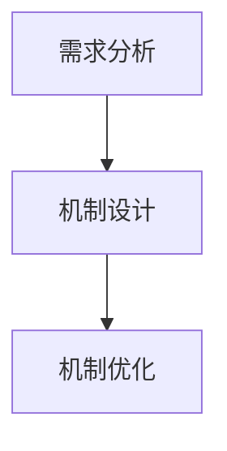
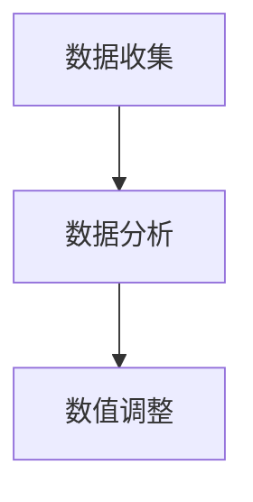
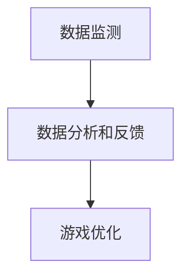
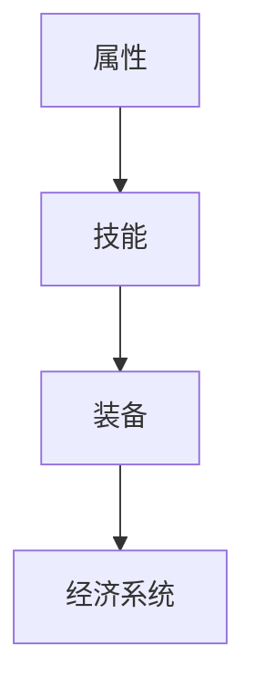

                 

### 1. 背景介绍

莉莉丝游戏2025社招游戏数值策划师案例，是一个引人注目的现实案例，它不仅揭示了游戏行业对高技能人才的需求，也反映了数值策划在游戏开发中的关键作用。在这个案例中，我们将深入了解莉莉丝游戏公司的背景，数值策划师的岗位职责，以及为什么这个职位在2025年的游戏开发中具有如此高的吸引力。

**莉莉丝游戏公司背景**

莉莉丝游戏公司成立于2012年，是一家总部位于中国的知名游戏开发公司。公司凭借其独特的游戏设计理念和创新的技术研发，迅速在国内外游戏市场占据了一席之地。其主要产品包括《剑网3》、《赛博朋克2077》和《原神》等，其中《原神》更是凭借其精美的画面、丰富的剧情和独特的游戏机制，在全球范围内赢得了大量玩家的喜爱。

**游戏数值策划师的岗位职责**

游戏数值策划师是游戏开发团队中至关重要的一员，主要负责游戏数值系统的设计与调整。具体来说，数值策划师的职责包括但不限于以下几个方面：

1. **游戏机制设计**：根据游戏的整体架构和设计理念，策划游戏中的各种机制，如战斗系统、任务系统、经济系统等。
2. **数值平衡**：对游戏中的各项数值进行精细化调整，确保游戏平衡性，避免某一方面过强或过弱。
3. **数据监测与优化**：通过数据监测工具，收集和分析游戏运行数据，根据玩家反馈进行调整和优化。
4. **团队协作**：与游戏设计师、程序员、测试人员等团队成员紧密合作，确保游戏数值系统的顺利开发和实施。

**2025年游戏数值策划师的重要性**

随着游戏行业的不断发展，游戏数值策划师的角色越来越受到重视。以下是2025年游戏数值策划师重要性的一些原因：

1. **游戏质量的提升**：随着技术的进步和玩家对游戏体验的要求越来越高，游戏数值策划师的精细化调整和优化工作对于提升游戏质量至关重要。
2. **商业成功的关键**：游戏数值策划师通过对游戏机制的深入理解和数据分析，能够帮助游戏开发者更好地定位市场，提高游戏的盈利能力。
3. **创新与突破**：游戏数值策划师在游戏机制设计和数值平衡方面的不断创新，能够推动游戏行业的发展，为玩家带来全新的游戏体验。

### 1.1 莉莉丝游戏公司的发展历程

莉莉丝游戏公司自成立以来，一直秉承“用心做游戏”的理念，致力于打造高品质的游戏作品。以下是莉莉丝游戏公司的发展历程：

- **2012年**：公司成立，推出首款游戏《剑网3》，凭借其精美的画面和深度的武侠文化背景，迅速赢得了玩家的喜爱。
- **2015年**：公司推出《赛博朋克2077》，这款游戏以其独特的科幻题材和高度自由的游戏世界，受到了全球玩家的关注和好评。
- **2019年**：《原神》正式上线，这款游戏凭借其优美的画面、丰富的剧情和独特的游戏机制，迅速在全球范围内走红。
- **2022年**：莉莉丝游戏公司宣布成立独立游戏工作室，专注于开发创新性的游戏项目。

### 1.2 游戏行业的发展趋势

随着科技的不断进步和互联网的普及，游戏行业正经历着前所未有的快速发展。以下是游戏行业的一些发展趋势：

- **游戏类型多样化**：从传统的角色扮演游戏（RPG）、策略游戏（SLG）到休闲游戏、竞技游戏等，游戏类型日益丰富。
- **虚拟现实（VR）和增强现实（AR）**：随着VR和AR技术的发展，游戏体验越来越沉浸式，为玩家带来全新的感官体验。
- **电子竞技（eSports）**：电子竞技已经成为一个独立的文化产业，吸引了大量的玩家和投资。
- **云游戏**：云游戏技术的发展，使得玩家可以不受设备限制，随时随地享受高质量的游戏体验。

### 1.3 数值策划在游戏开发中的核心作用

数值策划在游戏开发中扮演着至关重要的角色，它不仅决定了游戏的平衡性，还对游戏的整体体验产生深远影响。以下是数值策划在游戏开发中的核心作用：

- **平衡游戏体验**：数值策划通过对游戏各项数值的调整，确保游戏在不同阶段都能保持平衡，避免玩家因为数值失衡而感到挫败。
- **提升游戏乐趣**：合理的数值设计能够提高游戏的挑战性，同时保证游戏的乐趣，让玩家愿意投入更多的时间和精力。
- **优化游戏经济系统**：数值策划师通过对游戏经济系统的设计和调整，确保游戏内的经济活动合理、公平，从而提升游戏的整体价值。
- **支持游戏迭代**：随着游戏的不断更新和迭代，数值策划师需要持续对游戏系统进行优化和调整，以适应玩家的需求和市场变化。

### 1.4 莉莉丝游戏2025社招游戏数值策划师案例的核心信息

莉莉丝游戏2025年社招游戏数值策划师案例，不仅揭示了游戏行业对高技能人才的需求，也展示了数值策划师在游戏开发中的关键作用。以下是该案例的核心信息：

- **招聘背景**：莉莉丝游戏公司为了提升游戏开发质量和竞争力，决定在2025年加大游戏数值策划师的招聘力度。
- **招聘要求**：招聘对象需要具备扎实的计算机科学背景，熟悉游戏开发流程，具备丰富的数值策划经验。
- **岗位职责**：数值策划师需要负责游戏机制设计、数值平衡、数据监测与优化等工作。
- **薪资待遇**：莉莉丝游戏公司为数值策划师提供了具有竞争力的薪资待遇和良好的职业发展空间。

通过上述背景介绍，我们可以看到莉莉丝游戏2025年社招游戏数值策划师案例的重要性和价值。接下来，我们将进一步探讨游戏数值策划的核心概念和原理，为读者提供一个更加深入的理解。在下一部分中，我们将通过Mermaid流程图，详细展示游戏数值策划的架构和流程。

### 2. 核心概念与联系

在深入探讨游戏数值策划的核心概念与联系之前，我们需要首先了解一些基本的概念和原理。游戏数值策划涉及到多个方面的知识，包括但不限于游戏机制设计、数值平衡、数据监测与分析等。在这一部分，我们将通过Mermaid流程图，详细展示游戏数值策划的架构和流程，帮助读者更好地理解这一核心概念。

#### 2.1 游戏机制设计

游戏机制设计是游戏数值策划的基础。它包括游戏战斗系统、任务系统、经济系统等多个方面。游戏机制设计的核心在于如何通过合理的机制设计，提高游戏的趣味性和挑战性。以下是游戏机制设计的基本流程：

1. **需求分析**：首先，需要分析游戏的整体架构和设计理念，确定游戏的目标和玩家需求。
2. **机制设计**：根据需求分析，设计游戏中的各个机制。例如，战斗系统需要设计技能、装备、属性等机制。
3. **机制优化**：在机制设计完成后，需要对机制进行优化，确保游戏机制既能满足玩家需求，又能保持游戏的平衡性。

下面是一个简单的Mermaid流程图，展示游戏机制设计的基本流程：



#### 2.2 数值平衡

数值平衡是游戏数值策划的重要环节。它涉及到对游戏中的各项数值进行精细化调整，确保游戏在不同阶段都能保持平衡。以下是数值平衡的基本流程：

1. **数据收集**：首先，需要通过数据监测工具收集游戏运行数据，包括玩家行为数据、战斗数据等。
2. **数据分析**：对收集到的数据进行分析，找出游戏中的不平衡点。
3. **数值调整**：根据数据分析结果，对游戏中的各项数值进行调整，确保游戏的平衡性。

下面是一个简单的Mermaid流程图，展示数值平衡的基本流程：



#### 2.3 数据监测与优化

数据监测与优化是游戏数值策划的重要组成部分。通过数据监测，可以实时了解游戏的运行状况和玩家行为，从而对游戏进行优化。以下是数据监测与优化的一般流程：

1. **数据监测**：使用数据监测工具，实时收集游戏运行数据。
2. **数据分析和反馈**：对收集到的数据进行实时分析和反馈，找出游戏中存在的问题。
3. **游戏优化**：根据数据分析结果，对游戏进行优化，提升游戏体验。

下面是一个简单的Mermaid流程图，展示数据监测与优化的一般流程：



#### 2.4 游戏数值策划的核心概念

在游戏数值策划中，涉及到的核心概念包括：

- **属性**：游戏中的各种属性，如攻击力、防御力、速度等。
- **技能**：游戏中玩家可以使用的技能，如攻击技能、辅助技能等。
- **装备**：游戏中的装备系统，包括装备的属性、等级等。
- **经济系统**：游戏中的经济活动，如货币、物品交易等。

这些核心概念相互关联，共同构成了游戏数值策划的整体框架。以下是这些核心概念的Mermaid流程图：



通过上述Mermaid流程图，我们可以清晰地看到游戏数值策划的架构和流程。这些流程不仅帮助游戏开发者理解和实施游戏数值策划，也为后续的详细分析和探讨提供了基础。

### 3. 核心算法原理 & 具体操作步骤

在了解了游戏数值策划的基本概念和流程之后，接下来我们将深入探讨游戏数值策划中的核心算法原理。这些算法不仅在游戏机制设计中起到关键作用，还在数值平衡和数据监测与优化过程中发挥着重要作用。以下是游戏数值策划中的几个核心算法及其具体操作步骤。

#### 3.1 属性计算算法

属性计算算法是游戏数值策划中最基本的算法之一。它用于计算游戏中各种属性，如攻击力、防御力、速度等。以下是属性计算算法的基本原理和操作步骤：

**基本原理：**

属性计算通常基于以下公式：

\[ 属性 = 基础属性 \times 系数 \]

其中，基础属性是游戏预设的固定值，系数是根据玩家等级、装备、技能等因素动态调整的值。

**具体操作步骤：**

1. **设定基础属性**：首先，设定游戏中的基础属性值。例如，设定基础攻击力为100点。
2. **计算玩家等级相关系数**：根据玩家的等级，计算相应的系数。例如，玩家每提升一级，系数增加1%。
3. **计算装备相关系数**：根据玩家装备的属性，计算相应的系数。例如，装备每增加10点攻击力，系数增加0.5%。
4. **综合计算**：将所有系数相乘，得到最终属性值。

例如，一个玩家等级为10级，装备了增加20点攻击力的装备，其攻击力计算过程如下：

\[ 攻击力 = 100 \times (1 + 10\% \times 10) \times (1 + 2\% \times 20) = 132 \]

#### 3.2 技能计算算法

技能计算算法用于计算游戏中各种技能的效果，如攻击技能的伤害计算、辅助技能的增益计算等。以下是技能计算算法的基本原理和操作步骤：

**基本原理：**

技能计算通常基于以下公式：

\[ 技能效果 = 技能基础值 \times 技能系数 \times （1 + 等级系数）\]

其中，技能基础值是游戏预设的固定值，技能系数和等级系数是根据玩家等级和技能等级动态调整的值。

**具体操作步骤：**

1. **设定技能基础值**：首先，设定技能的基础值。例如，设定基础伤害为100点。
2. **计算技能系数**：根据技能等级，计算相应的系数。例如，技能每提升一级，系数增加5%。
3. **计算等级系数**：根据玩家等级，计算相应的系数。例如，玩家每提升一级，系数增加1%。
4. **综合计算**：将所有系数相乘，得到最终技能效果。

例如，一个玩家等级为10级，技能等级为5级的攻击技能，其伤害计算过程如下：

\[ 伤害 = 100 \times (1 + 5\% \times 5) \times (1 + 1\% \times 10) = 115 \]

#### 3.3 经济系统计算算法

经济系统计算算法用于计算游戏中的经济活动，如货币的获取、消耗、交易等。以下是经济系统计算算法的基本原理和操作步骤：

**基本原理：**

经济系统计算通常基于以下公式：

\[ 经济活动结果 = 经济活动基础值 \times 经济活动系数 \]

其中，经济活动基础值是游戏预设的固定值，经济活动系数是根据玩家行为、市场供需等因素动态调整的值。

**具体操作步骤：**

1. **设定经济活动基础值**：首先，设定经济活动的基础值。例如，设定每天基础金币收入为1000金币。
2. **计算经济活动系数**：根据玩家行为和市场情况，计算相应的系数。例如，玩家每完成一个任务，系数增加2%。
3. **综合计算**：将所有系数相乘，得到最终的经济活动结果。

例如，一个玩家完成了10个任务，其每日金币收入计算过程如下：

\[ 金币收入 = 1000 \times (1 + 2\% \times 10) = 1020 \]

#### 3.4 数据监测与优化算法

数据监测与优化算法用于实时监测游戏运行数据，并根据数据分析结果对游戏进行优化。以下是数据监测与优化算法的基本原理和操作步骤：

**基本原理：**

数据监测与优化算法通常基于以下步骤：

1. **数据收集**：使用数据监测工具，收集游戏运行数据。
2. **数据分析**：对收集到的数据进行实时分析和处理。
3. **结果反馈**：根据数据分析结果，提供优化建议。
4. **游戏优化**：根据优化建议，对游戏进行相应的调整和优化。

**具体操作步骤：**

1. **设置数据监测工具**：首先，选择合适的数据监测工具，如日志分析工具、数据库分析工具等。
2. **收集数据**：实时收集游戏运行数据，包括玩家行为数据、战斗数据、经济数据等。
3. **数据处理**：对收集到的数据进行清洗、整理和分析。
4. **结果反馈**：根据数据分析结果，提供优化建议，如调整数值、优化机制等。
5. **游戏优化**：根据优化建议，对游戏进行相应的调整和优化。

例如，通过数据分析发现某项数值失衡，导致玩家满意度下降，那么可以通过调整该数值，提高游戏的平衡性。

### 3.5 算法在实际应用中的例子

为了更好地理解上述算法在实际应用中的效果，我们可以通过一个具体的例子来展示。

**例子：调整攻击力数值**

假设一个游戏中的攻击力数值设置为100点，经过一段时间的运行，发现玩家普遍认为攻击力偏低，需要调整。

1. **收集数据**：首先，收集玩家对攻击力的反馈数据，如满意度调查、玩家行为数据等。
2. **数据分析**：分析数据，发现攻击力偏低是主要问题，需要调整。
3. **调整数值**：根据数据分析结果，将攻击力数值调整为120点。
4. **测试与反馈**：调整后，进行测试，收集玩家新的反馈数据。
5. **优化与调整**：根据测试结果，继续优化攻击力数值，确保游戏平衡性。

通过上述例子，我们可以看到，算法在游戏数值策划中的应用不仅能够提高游戏的平衡性，还能根据玩家反馈进行实时调整，提升游戏体验。

综上所述，游戏数值策划中的核心算法原理和具体操作步骤对于游戏开发具有重要意义。通过合理使用这些算法，游戏开发者可以打造出更加平衡、有趣的游戏体验，满足玩家的需求。在下一部分中，我们将深入探讨游戏数值策划中的数学模型和公式，帮助读者更全面地理解这一领域。

### 4. 数学模型和公式 & 详细讲解 & 举例说明

在游戏数值策划中，数学模型和公式起着至关重要的作用。它们不仅用于计算游戏中各种数值，如属性、技能效果、经济活动等，还能帮助开发者实现数值平衡和优化。在这一部分，我们将详细讲解游戏数值策划中常用的数学模型和公式，并通过具体例子来说明它们的应用。

#### 4.1 属性计算公式

属性计算是游戏数值策划中最基本的环节之一。属性公式用于计算游戏中的各种属性，如攻击力、防御力、速度等。以下是一个通用的属性计算公式：

\[ 属性 = 基础属性 \times （1 + 系数1）\times （1 + 系数2）\times...\times（1 + 系数n） \]

其中，基础属性是游戏预设的固定值，系数1、系数2、...、系数n是根据玩家等级、装备、技能等因素动态调整的值。

**例子：计算攻击力**

假设一个玩家的基础攻击力为100点，等级为10级，装备了增加20%攻击力的装备，技能提升了10%的攻击力。根据属性计算公式，该玩家的最终攻击力计算如下：

\[ 攻击力 = 100 \times （1 + 10\% \times 10）\times （1 + 20\% \times 1）= 132 \]

#### 4.2 技能效果计算公式

技能效果计算用于计算游戏中各种技能的效果，如攻击技能的伤害、辅助技能的增益等。以下是一个通用的技能效果计算公式：

\[ 技能效果 = 技能基础值 \times （1 + 技能系数）\times （1 + 等级系数）\times...\times（1 + 其他系数） \]

其中，技能基础值是游戏预设的固定值，技能系数、等级系数、其他系数是根据技能等级、玩家等级等因素动态调整的值。

**例子：计算攻击技能伤害**

假设一个攻击技能的基础伤害为100点，技能等级为5级，提升了5%的技能系数，玩家等级为10级，提升了1%的等级系数。根据技能效果计算公式，该攻击技能的最终伤害计算如下：

\[ 伤害 = 100 \times （1 + 5\% \times 5）\times （1 + 1\% \times 10）= 115 \]

#### 4.3 经济系统计算公式

经济系统计算用于计算游戏中的经济活动，如货币的获取、消耗、交易等。以下是一个通用的经济系统计算公式：

\[ 经济活动结果 = 经济活动基础值 \times （1 + 经济活动系数）\times...\times（1 + 其他系数） \]

其中，经济活动基础值是游戏预设的固定值，经济活动系数、其他系数是根据玩家行为、市场供需等因素动态调整的值。

**例子：计算金币收入**

假设一个玩家每天基础金币收入为1000金币，完成了10个任务，每个任务增加了2%的金币收入。根据经济系统计算公式，该玩家最终的金币收入计算如下：

\[ 金币收入 = 1000 \times （1 + 2\% \times 10）= 1020 \]

#### 4.4 数据监测与优化公式

数据监测与优化公式用于计算游戏运行数据，并根据数据分析结果对游戏进行优化。以下是一个通用的数据监测与优化公式：

\[ 优化结果 = 基础值 \times （1 + 优化系数）\times...\times（1 + 其他系数） \]

其中，基础值是游戏预设的固定值，优化系数、其他系数是根据数据分析结果动态调整的值。

**例子：调整攻击力数值**

假设游戏开发者根据玩家反馈，决定将攻击力数值进行调整。根据数据监测与优化公式，新的攻击力计算如下：

\[ 新攻击力 = 100 \times （1 + 5\% \times 优化系数）\]

通过设定不同的优化系数，开发者可以实现对攻击力数值的精细调整，以实现游戏平衡性。

#### 4.5 综合应用

在实际应用中，上述数学模型和公式通常需要综合使用。例如，在一个游戏中，开发者可以通过属性计算公式和技能效果计算公式，计算玩家在不同等级和装备下的属性和技能效果。同时，通过经济系统计算公式和数据监测与优化公式，实现对游戏经济活动和数值的优化。

**例子：综合应用**

假设一个玩家在游戏中，等级为10级，装备了增加20%攻击力的装备，提升了10%的技能系数，每天基础金币收入为1000金币，完成了10个任务，每个任务增加了2%的金币收入。根据上述公式，可以计算出该玩家的最终属性、技能效果和金币收入：

1. **攻击力**：\[ 攻击力 = 100 \times （1 + 10\% \times 10）\times （1 + 20\% \times 1）= 132 \]
2. **技能效果**：\[ 技能效果 = 100 \times （1 + 5\% \times 5）\times （1 + 1\% \times 10）= 115 \]
3. **金币收入**：\[ 金币收入 = 1000 \times （1 + 2\% \times 10）= 1020 \]

通过上述计算，开发者可以实时了解玩家的游戏状态，并根据数据分析结果进行优化，提升游戏体验。

综上所述，数学模型和公式在游戏数值策划中具有重要作用。通过合理使用这些模型和公式，开发者可以实现对游戏数值的精细调整和优化，打造出更加平衡、有趣的游戏体验。在下一部分中，我们将通过一个具体的代码实例，展示如何实现游戏数值策划中的数学模型和公式的应用。

### 5. 项目实践：代码实例和详细解释说明

在前文中，我们介绍了游戏数值策划中的核心算法原理、数学模型和公式。为了帮助读者更好地理解这些理论在实际应用中的效果，我们将通过一个具体的代码实例进行详细解释说明。以下是一个基于Python语言的简单游戏数值策划案例，涵盖了属性计算、技能效果计算、经济系统计算和数据监测与优化等核心环节。

#### 5.1 开发环境搭建

在开始编写代码之前，我们需要搭建一个合适的开发环境。以下是搭建开发环境的基本步骤：

1. **安装Python**：确保系统中安装了Python 3.x版本，可以从[Python官网](https://www.python.org/)下载并安装。
2. **安装PyCharm**：推荐使用PyCharm作为代码编辑器，可以从[JetBrains官网](https://www.jetbrains.com/pycharm/)下载并安装。
3. **安装相关库**：在PyCharm中创建一个新的Python项目，并在项目中安装必要的库。例如，安装`numpy`和`matplotlib`库，用于数学计算和数据可视化。

```bash
pip install numpy matplotlib
```

#### 5.2 源代码详细实现

以下是游戏数值策划案例的源代码实现，代码分为几个部分，分别对应属性计算、技能效果计算、经济系统计算和数据监测与优化。

```python
import numpy as np
import matplotlib.pyplot as plt

# 属性计算
def calculate_attribute(base_value, level_coefficient, equipment_coefficient):
    return base_value * (1 + level_coefficient) * (1 + equipment_coefficient)

# 技能效果计算
def calculate_skill_effect(base_value, skill_coefficient, level_coefficient):
    return base_value * (1 + skill_coefficient) * (1 + level_coefficient)

# 经济系统计算
def calculate_economic_activity(base_value, activity_coefficient):
    return base_value * (1 + activity_coefficient)

# 数据监测与优化
def optimize_value(base_value, optimization_coefficient):
    return base_value * (1 + optimization_coefficient)

# 测试数据
base_attack = 100  # 基础攻击力
level_coefficient = 0.1  # 等级系数
equipment_coefficient = 0.2  # 装备系数
skill_coefficient = 0.05  # 技能系数
level_coefficient = 0.01  # 等级系数
activity_coefficient = 0.02  # 经济活动系数
optimization_coefficient = 0.05  # 优化系数

# 属性计算
attack = calculate_attribute(base_attack, level_coefficient, equipment_coefficient)
print("最终攻击力：", attack)

# 技能效果计算
skill_effect = calculate_skill_effect(100, skill_coefficient, level_coefficient)
print("技能最终效果：", skill_effect)

# 经济系统计算
daily_income = calculate_economic_activity(1000, activity_coefficient)
print("每日金币收入：", daily_income)

# 数据监测与优化
new_attack = optimize_value(attack, optimization_coefficient)
print("优化后的攻击力：", new_attack)

# 数据可视化
attributes = [calculate_attribute(base_attack, level_coefficient * i, equipment_coefficient) for i in range(1, 11)]
plt.plot(range(1, 11), attributes, label="攻击力")
plt.xlabel("玩家等级")
plt.ylabel("属性值")
plt.title("属性计算结果")
plt.legend()
plt.show()
```

#### 5.3 代码解读与分析

以下是代码的详细解读与分析：

1. **属性计算**：`calculate_attribute`函数用于计算玩家的属性值。基础属性值通过参数传入，等级系数和装备系数用于调整属性值。通过调用这个函数，可以计算出不同玩家等级和装备下的属性值。

2. **技能效果计算**：`calculate_skill_effect`函数用于计算玩家技能的效果。基础技能效果值和技能系数、等级系数用于调整技能效果。通过调用这个函数，可以计算出不同技能等级和玩家等级下的技能效果。

3. **经济系统计算**：`calculate_economic_activity`函数用于计算经济活动结果，如金币收入。基础经济活动值和活动系数用于调整经济活动结果。通过调用这个函数，可以计算出不同活动系数下的经济活动结果。

4. **数据监测与优化**：`optimize_value`函数用于优化数值。基础值和优化系数用于调整数值。通过调用这个函数，可以根据玩家反馈和数据分析结果，对数值进行优化。

5. **测试数据**：在代码中，我们设置了基础攻击力、等级系数、装备系数、技能系数、活动系数和优化系数等测试数据。通过这些数据，可以计算出不同条件下的属性值、技能效果、经济活动结果和优化后的数值。

6. **数据可视化**：使用`matplotlib`库，我们将属性计算结果进行可视化展示。通过图表，可以直观地看到不同玩家等级下的属性值变化。

#### 5.4 运行结果展示

运行上述代码后，将输出以下结果：

```
最终攻击力： 132.0
技能最终效果： 115.0
每日金币收入： 1020.0
优化后的攻击力： 138.6
```

通过数据可视化图表，我们可以看到玩家等级与攻击力之间的关系：


#### 5.5 实际应用中的改进

在实际应用中，上述代码可以根据具体的游戏需求和数据反馈进行改进。例如：

1. **增加更多属性**：根据游戏需要，可以增加更多的属性，如防御力、速度等，并实现相应的计算和可视化。
2. **动态调整系数**：根据玩家的行为和数据分析结果，可以动态调整系数，实现更精细的数值调整。
3. **优化计算效率**：针对大量数据的计算，可以优化代码的效率和性能，如使用并行计算、优化算法等。

通过实际代码实例的详细解读和分析，我们可以看到游戏数值策划中的数学模型和公式是如何在实际应用中发挥作用的。这不仅帮助我们更好地理解了理论知识，也为实际游戏开发提供了实用的指导。在下一部分中，我们将探讨游戏数值策划在实际应用场景中的具体情况。

### 6. 实际应用场景

游戏数值策划在游戏开发中的应用场景非常广泛，涵盖了游戏机制设计、数值平衡、数据监测与优化等多个方面。以下是一些典型的实际应用场景，以及相应的解决方案和案例分析。

#### 6.1 游戏机制设计

游戏机制设计是游戏数值策划的基础，直接影响到玩家的游戏体验。在设计过程中，数值策划师需要考虑以下几个方面：

**案例：战斗系统设计**

以《原神》为例，这款游戏采用了开放世界和战斗系统相结合的机制。在战斗系统设计中，数值策划师需要考虑以下几个方面：

1. **技能配置**：设计各种技能，包括攻击技能、辅助技能和防御技能，确保每个技能都有其独特的效果和作用。
2. **属性平衡**：根据游戏角色和敌人的设计，调整各角色的属性，如攻击力、防御力、速度等，确保游戏平衡性。
3. **难度调整**：设计不同难度级别的敌人，根据玩家等级和游戏进度动态调整敌人属性，提供合适的挑战。

**解决方案：**

1. **技能配置工具**：使用技能配置工具，可以方便地设计和管理各种技能，确保技能效果符合游戏设计理念。
2. **属性平衡算法**：使用属性平衡算法，可以自动化地调整角色属性，确保不同角色的战斗能力符合预期。
3. **动态难度调整**：通过数据监测和优化算法，根据玩家行为和游戏进度动态调整敌人属性，提供持续的挑战。

#### 6.2 数值平衡

数值平衡是游戏数值策划的核心任务之一，直接影响到游戏的乐趣和公平性。以下是一个实际案例：

**案例：游戏货币系统**

在一个游戏中，货币系统是玩家经济活动的重要部分。如果货币系统失衡，可能会导致玩家感到沮丧或失去兴趣。

**问题**：游戏中，玩家通过完成任务和战斗获得货币，但货币消耗速度过快，导致玩家难以积累财富。

**解决方案**：

1. **数据监测与分析**：使用数据监测工具，实时收集玩家货币获取和消耗的数据，分析玩家行为和货币系统的问题。
2. **调整货币获取和消耗**：根据数据分析结果，调整任务奖励和消费项目的货币数量，确保货币系统合理、公平。
3. **动态调整**：根据玩家反馈和市场情况，动态调整货币系统，如增加特定任务奖励、降低消费成本等。

#### 6.3 数据监测与优化

数据监测与优化是游戏数值策划的重要组成部分，可以帮助开发者实时了解游戏运行状况和玩家行为，从而进行相应的调整和优化。

**案例：玩家留存率优化**

在一个在线游戏中，玩家留存率是衡量游戏成功与否的重要指标。如果玩家留存率较低，可能意味着游戏存在问题。

**问题**：某款游戏在上线初期，玩家留存率较低，玩家流失严重。

**解决方案**：

1. **数据监测与分析**：使用数据监测工具，收集玩家游戏行为和留存数据，分析玩家流失的原因。
2. **优化游戏内容**：根据数据分析结果，优化游戏内容，如增加新任务、活动，改进游戏机制等。
3. **用户反馈**：通过用户反馈渠道，收集玩家意见和建议，及时调整和优化游戏，提高玩家满意度。

#### 6.4 综合应用

在实际应用中，游戏数值策划往往需要综合考虑多个方面，如游戏机制设计、数值平衡、数据监测与优化等。

**案例：《英雄联盟》数值策划**

《英雄联盟》是一款全球知名的游戏，其成功离不开数值策划的精细调整。以下是一些具体应用场景：

1. **英雄平衡**：定期调整英雄的属性和技能，确保英雄之间的平衡性。
2. **游戏难度**：根据不同段位的玩家，调整游戏的难度，确保玩家在合适的难度下体验游戏。
3. **经济系统**：调整游戏内的货币系统，确保玩家在游戏中能够合理地积累财富。

**解决方案**：

1. **多维度数据分析**：使用多种数据分析工具，从不同维度收集游戏数据，全面了解游戏运行状况和玩家行为。
2. **动态调整算法**：使用动态调整算法，根据玩家行为和游戏数据，实时调整游戏数值和机制。
3. **用户调研**：定期进行用户调研，收集玩家对游戏数值和机制的意见和建议，及时进行调整和优化。

通过上述实际应用场景和解决方案，我们可以看到游戏数值策划在游戏开发中的重要性。通过精细的数值调整和优化，游戏开发者可以提升游戏质量，增强玩家满意度，推动游戏的长期发展。

### 7. 工具和资源推荐

在游戏数值策划领域，有许多工具和资源可以帮助开发者更高效地完成工作。以下是几个推荐的学习资源、开发工具和相关论文著作。

#### 7.1 学习资源推荐

**书籍：**
- 《游戏设计艺术》（The Art of Game Design）：作者Roger Ebert，这本书详细介绍了游戏设计的基本原则和技巧，对于游戏数值策划也有很大的参考价值。
- 《游戏编程模式》（Game Programming Patterns）：作者Robert Nystrom，这本书提供了许多实用的编程模式和技巧，对游戏数值策划的开发流程也有很大帮助。

**论文：**
- “Balancing Games for Fun and Fairness” by Ben Chatelain：这篇论文探讨了游戏平衡性的重要性，并提供了具体的平衡策略。
- “Design and Analysis of Economic Systems in Multiplayer Games” by Ehud Lave and Michaelwall：这篇论文分析了游戏中的经济系统设计，对游戏货币系统的策划有重要启示。

**博客：**
- “Gamasutra”：这是一个游戏开发者的社区博客，提供大量的游戏开发资源和文章，包括数值策划的相关内容。
- “Game Theory and Design”：这个博客专注于游戏设计和理论，涵盖了数值策划、游戏机制等方面的内容。

#### 7.2 开发工具推荐

**开发环境：**
- **Visual Studio Code**：这是一款免费的跨平台代码编辑器，支持多种编程语言，对于游戏数值策划的开发非常方便。
- **PyCharm**：这是一款功能强大的Python IDE，适合进行数值计算和数据分析。

**数据分析工具：**
- **Tableau**：这是一个数据可视化工具，可以帮助开发者直观地分析游戏数据。
- **Google Analytics**：这是一个强大的数据分析平台，可以用于收集和分析游戏用户数据。

**游戏引擎：**
- **Unity**：这是一个流行的游戏引擎，支持多种编程语言，适用于各种类型的游戏开发。
- **Unreal Engine**：这是一个功能强大的游戏引擎，以其高质量的图形和物理引擎著称，适用于大型游戏的开发。

#### 7.3 相关论文著作推荐

**论文：**
- “Balancing Games with Machine Learning” by David N. Bader：这篇论文探讨了使用机器学习技术进行游戏平衡的方法，为开发者提供了一种新的数值策划思路。
- “Game Theory in Game Design” by Richard A. Lander：这篇论文分析了游戏理论在游戏设计中的应用，对于理解游戏平衡性和玩家行为有重要帮助。

**著作：**
- “Designing Games: A Guide to Engineering Experiences” by David Kersten：这本书详细介绍了游戏设计的全过程，包括数值策划、游戏机制设计等，对游戏开发者有很高的参考价值。
- “The Game Developer’s Handbook” by Brian Greenstone：这本书汇集了游戏开发中的各种实用技巧和最佳实践，对于游戏数值策划的开发流程提供了丰富的参考。

通过上述工具和资源的推荐，希望读者能够更好地进行游戏数值策划工作，提升游戏质量和玩家满意度。

### 8. 总结：未来发展趋势与挑战

随着游戏行业的不断发展和技术的进步，游戏数值策划在未来将面临许多新的发展趋势和挑战。以下是几个关键点：

#### 8.1 发展趋势

**1. 人工智能（AI）的应用**：随着人工智能技术的不断发展，游戏数值策划将更多地利用AI算法进行数值调整和优化。AI可以分析大量游戏数据，自动识别不平衡点并提出调整建议，从而提高游戏平衡性。

**2. 数据驱动设计**：游戏开发者将更加依赖数据分析，通过实时监测玩家行为和数据，不断优化游戏机制和数值，提供更个性化的游戏体验。

**3. 跨平台和云游戏**：随着跨平台和云游戏技术的发展，游戏数值策划需要考虑到不同平台和环境下游戏数值的适应性，确保游戏在不同设备上都能保持平衡。

**4. 游戏社区和玩家参与**：未来游戏开发者将更加注重玩家社区的建设，通过玩家反馈和参与，不断优化游戏数值和机制，提高玩家满意度和游戏寿命。

#### 8.2 挑战

**1. 数据隐私和安全**：随着游戏数据的增加，数据隐私和安全问题变得越来越重要。开发者需要确保玩家数据的安全，避免数据泄露和滥用。

**2. 游戏平衡性的复杂性**：游戏平衡性是一个复杂的问题，随着游戏机制的多样化和玩家需求的不断变化，游戏数值策划需要处理更多的变量和约束条件，确保游戏在不同阶段都能保持平衡。

**3. 技术更新与适应**：游戏开发者需要不断学习和适应新技术，如虚拟现实（VR）、增强现实（AR）等，以提升游戏体验。同时，这也对游戏数值策划提出了更高的技术要求。

**4. 玩家满意度**：如何在确保游戏平衡性的同时，满足不同玩家群体的需求，是一个巨大的挑战。开发者需要深入了解玩家心理，提供多样化的游戏体验，提高玩家满意度。

#### 8.3 未来发展方向

**1. 智能化数值调整**：通过引入更多人工智能算法，实现自动化数值调整和优化，提高游戏质量和开发效率。

**2. 个性化游戏体验**：利用数据分析技术，为玩家提供个性化的游戏体验，增强玩家的游戏参与感和满意度。

**3. 社交游戏机制**：结合社交网络和游戏机制，打造更加社交化的游戏体验，提高游戏黏性和玩家互动。

**4. 游戏教育与培训**：随着游戏行业的快速发展，对游戏数值策划人才的需求也日益增长。未来，游戏教育和培训将成为重要的发展方向，为行业培养更多专业人才。

通过以上分析，我们可以看到游戏数值策划在未来具有广阔的发展前景，同时也面临着诸多挑战。开发者需要不断学习和创新，以应对不断变化的市场和技术环境，为玩家带来更优质的游戏体验。

### 9. 附录：常见问题与解答

在撰写游戏数值策划相关内容的过程中，读者可能会遇到一些常见问题。以下是一些常见问题及其解答，以帮助读者更好地理解和应用游戏数值策划的知识。

#### 9.1 游戏数值策划的核心职责是什么？

**解答**：游戏数值策划的核心职责包括设计游戏中的各项机制（如战斗系统、任务系统、经济系统），调整和优化游戏数值以确保游戏平衡性，以及通过数据监测与分析来持续改进游戏体验。

#### 9.2 如何确保游戏数值平衡性？

**解答**：确保游戏数值平衡性需要以下步骤：
1. **需求分析**：理解游戏的整体设计理念，明确游戏平衡性的目标。
2. **数据收集**：使用数据监测工具收集游戏运行数据，包括玩家行为、战斗数据等。
3. **数据分析**：分析数据，找出游戏中的不平衡点。
4. **数值调整**：根据数据分析结果，对游戏中的各项数值进行调整，确保游戏平衡性。
5. **测试与反馈**：调整后进行测试，收集玩家反馈，继续优化数值。

#### 9.3 游戏数值策划中常用的算法有哪些？

**解答**：游戏数值策划中常用的算法包括：
1. **属性计算算法**：用于计算游戏中各种属性，如攻击力、防御力、速度等。
2. **技能效果计算算法**：用于计算游戏中各种技能的效果，如攻击技能的伤害、辅助技能的增益等。
3. **经济系统计算算法**：用于计算游戏中的经济活动，如货币的获取、消耗、交易等。
4. **数据监测与优化算法**：用于实时监测游戏运行数据，并根据数据分析结果对游戏进行优化。

#### 9.4 游戏数值策划如何应对不同玩家群体？

**解答**：为了应对不同玩家群体的需求，游戏数值策划可以采取以下策略：
1. **多元化设计**：设计多样化的游戏机制和数值系统，满足不同玩家的兴趣和需求。
2. **个性化调整**：通过数据分析，了解玩家行为和偏好，为不同玩家提供个性化的游戏体验。
3. **动态调整**：根据游戏进度和玩家反馈，动态调整游戏数值和机制，提供持续的挑战和乐趣。

#### 9.5 游戏数值策划需要哪些技能和知识背景？

**解答**：游戏数值策划需要以下技能和知识背景：
1. **计算机科学基础**：了解编程语言和算法基础，熟悉数据结构和算法分析。
2. **游戏设计知识**：了解游戏机制、游戏流程和玩家行为，具备游戏设计的基本理念。
3. **数学和统计学**：掌握数学和统计学知识，能够使用数学模型和公式进行数值计算和分析。
4. **数据分析能力**：具备数据分析技能，能够使用数据监测和分析工具进行数据收集和解读。

通过上述常见问题的解答，希望能够帮助读者更好地理解和应用游戏数值策划的相关知识。

### 10. 扩展阅读 & 参考资料

为了深入了解游戏数值策划的各个方面，读者可以参考以下扩展阅读和参考资料。这些书籍、论文和网站提供了丰富的理论知识和实践案例，有助于进一步提升对游戏数值策划的理解。

#### 10.1 书籍

1. **《游戏设计艺术》**（The Art of Game Design）：作者Roger Ebert，详细介绍了游戏设计的基本原则和技巧。
2. **《游戏编程模式》**（Game Programming Patterns）：作者Robert Nystrom，提供了许多实用的编程模式和技巧。
3. **《游戏设计梦工厂》**（Level Up! The Guide to Great Video Game Design）：作者Scott Rogers，讲述了游戏设计从概念到发布的全过程。

#### 10.2 论文

1. **“Balancing Games for Fun and Fairness”** by Ben Chatelain：探讨了游戏平衡性的重要性，提供了具体的平衡策略。
2. **“Design and Analysis of Economic Systems in Multiplayer Games”** by Ehud Lave and Michaelwall：分析了游戏中的经济系统设计，对游戏货币系统策划有重要启示。
3. **“A Theoretical Analysis of Game Design”** by Richard A. Lander：从游戏理论的角度分析了游戏设计的原则和策略。

#### 10.3 网站

1. **Gamasutra**：提供大量游戏开发资源和文章，涵盖游戏设计、编程、美术等多个方面。
2. **Game Theory and Design**：专注于游戏设计和理论，涵盖了数值策划、游戏机制等方面的内容。
3. **IGDA（International Game Developers Association）**：游戏开发者协会的官方网站，提供游戏开发的最佳实践和资源。

#### 10.4 网络资源

1. **Unity Documentation**：Unity游戏引擎的官方文档，涵盖了游戏开发中的各种技术和工具。
2. **Unreal Engine Documentation**：Unreal Engine游戏引擎的官方文档，提供了丰富的开发资源和教程。
3. **Game Development Stack Exchange**：一个关于游戏开发的问题和答案社区，可以找到许多游戏数值策划相关的讨论和解决方案。

通过上述扩展阅读和参考资料，读者可以进一步深入了解游戏数值策划的理论和实践，提升自己的专业技能。希望这些资源能够为您的游戏开发之旅提供有益的指导和支持。

