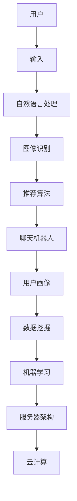

                 

### 背景介绍

随着人工智能技术的飞速发展，虚拟导购助手作为一种新兴的智能服务形式，正逐渐走进人们的日常生活。从最初的静态网页信息展示，到如今可以与用户进行实时互动、提供个性化推荐的虚拟导购助手，这一过程充分体现了人工智能技术在商业应用中的巨大潜力。

虚拟导购助手，即通过人工智能技术构建的，可以模拟真实导购员行为的虚拟人物，帮助用户在电商平台上进行购物决策。这些助手通常具有自然语言处理能力、图像识别能力、推荐算法等多个功能，能够为用户提供高效、个性化的购物体验。

本文将深入探讨虚拟导购助手的运作原理、核心算法、数学模型、项目实践，并分析其实际应用场景。此外，还将推荐相关的学习资源、开发工具和论文著作，帮助读者更好地理解和应用这一技术。

通过本文的阅读，您将了解到：

1. 虚拟导购助手的定义与核心功能。
2. 虚拟导购助手的架构及其各个组成部分。
3. 核心算法原理及其具体操作步骤。
4. 数学模型和公式的详细解释及实际应用。
5. 代码实例及解读，以便您能够亲自实践和掌握。
6. 虚拟导购助手的实际应用场景及其未来的发展趋势。

### 核心概念与联系

在深入探讨虚拟导购助手的运作原理之前，我们首先需要理解一些核心概念和它们之间的联系。以下是本文中涉及的主要概念和它们之间的关系。

#### 1. 人工智能（AI）

人工智能是指计算机系统通过模拟人类智能行为，实现感知、学习、推理、决策等功能的综合技术。它是虚拟导购助手能够实现智能互动的基础。

#### 2. 自然语言处理（NLP）

自然语言处理是人工智能的一个重要分支，主要研究如何让计算机理解和生成自然语言。在虚拟导购助手的应用中，NLP使得助手能够理解和回应用户的自然语言提问。

#### 3. 图像识别

图像识别是计算机视觉的一个重要分支，通过识别和理解图像内容，实现对物体、场景的识别。虚拟导购助手利用图像识别技术，可以识别用户上传的图片，提供相关的商品推荐。

#### 4. 推荐算法

推荐算法是虚拟导购助手个性化推荐的核心，基于用户的兴趣和行为数据，生成个性化的商品推荐列表。常见的推荐算法有基于内容的推荐、协同过滤推荐等。

#### 5. 聊天机器人

聊天机器人是虚拟导购助手的一种形式，通过模拟人类对话方式与用户互动，提供问答服务、购物建议等。聊天机器人的设计与实现，是NLP和对话系统技术的结合。

#### 6. 数据挖掘

数据挖掘是一种通过从大量数据中发现有价值信息和模式的技术。虚拟导购助手的数据挖掘，主要用于分析用户的购物行为，提取用户兴趣，优化推荐算法。

#### 7. 用户画像

用户画像是对用户特征的综合描述，包括用户的基本信息、行为习惯、兴趣偏好等。通过构建用户画像，虚拟导购助手可以更好地理解和满足用户需求。

#### 8. 机器学习

机器学习是人工智能的一个重要分支，通过从数据中学习规律，实现预测和分类等任务。虚拟导购助手中的许多功能，如推荐算法、图像识别等，都是基于机器学习技术实现的。

#### 9. 服务器架构

服务器架构是虚拟导购助手的技术基础设施，包括前端、后端、数据库等多个部分。良好的服务器架构可以保证虚拟导购助手的稳定运行和高性能。

#### 10. 云计算

云计算是一种通过互联网提供计算资源的服务模式，虚拟导购助手可以利用云计算，实现大规模数据处理和分布式计算。

#### Mermaid 流程图

以下是一个简化的虚拟导购助手架构的 Mermaid 流程图，展示了各个核心概念之间的联系：



通过这个流程图，我们可以清晰地看到虚拟导购助手的各个核心组成部分及其相互之间的关联。在接下来的章节中，我们将逐一深入探讨这些核心概念和技术的具体实现原理和应用。

### 核心算法原理 & 具体操作步骤

在了解了虚拟导购助手的各个核心概念及其相互关系后，我们接下来将探讨其核心算法原理，以及这些算法的具体操作步骤。

#### 1. 自然语言处理（NLP）

自然语言处理是虚拟导购助手实现智能互动的关键技术，主要包括语言理解、语言生成和情感分析等方面。

**语言理解：** 自然语言处理首先需要理解用户输入的文本信息，这涉及到词法分析、句法分析和语义分析等步骤。

- **词法分析：** 将文本分割成单词或词组，如将 "我喜欢这个手机" 分割成 "我"、"喜欢"、"这个"、"手机"。
- **句法分析：** 分析文本的语法结构，如主语、谓语、宾语等，帮助理解句子的含义。
- **语义分析：** 理解句子中词语的含义及其相互关系，如 "手机" 可能指的是手机产品。

**语言生成：** 在对用户输入的文本理解后，虚拟导购助手需要生成回应的文本，如 "感谢您的喜欢，这个手机有很多优点，您可以考虑购买。"

**情感分析：** 通过分析文本的情感倾向，如正面、负面或中立，帮助虚拟导购助手更好地理解用户情绪，提供更贴心的服务。

#### 2. 图像识别

图像识别技术用于虚拟导购助手识别用户上传的图片，提供相关的商品推荐。其基本步骤包括：

- **图像预处理：** 对图像进行缩放、裁剪、灰度化等处理，提高图像识别的准确性。
- **特征提取：** 从图像中提取具有代表性的特征，如边缘、纹理等，用于后续的图像识别。
- **分类与识别：** 利用深度学习模型对提取的特征进行分类和识别，如识别图片中的商品类别。

#### 3. 推荐算法

推荐算法是虚拟导购助手实现个性化推荐的核心，主要分为基于内容的推荐和协同过滤推荐。

**基于内容的推荐：** 根据用户的历史行为和兴趣，推荐与之相关的商品。具体步骤如下：

- **用户兴趣提取：** 分析用户的浏览记录、购买记录等，提取用户的兴趣点。
- **商品内容分析：** 分析商品的特征，如类别、品牌、价格等。
- **推荐生成：** 根据用户的兴趣和商品的特征，生成个性化的推荐列表。

**协同过滤推荐：** 利用用户之间的相似性，推荐其他用户喜欢的商品。具体步骤如下：

- **用户相似度计算：** 计算用户之间的相似度，如基于评分的相似度、基于项目的相似度等。
- **推荐生成：** 根据用户之间的相似性，推荐其他用户喜欢的商品。

#### 4. 聊天机器人

聊天机器人是虚拟导购助手与用户互动的重要方式，其设计包括对话管理、语言理解和语言生成等。

- **对话管理：** 管理对话的流程和状态，如意图识别、上下文维护等。
- **语言理解：** 理解用户的输入，如使用NLP技术解析用户意图。
- **语言生成：** 生成回复文本，如使用模板或生成式模型生成自然语言回复。

#### 5. 数据挖掘与用户画像

数据挖掘和用户画像技术用于分析用户的购物行为，提取用户兴趣和特征，优化推荐效果。

- **数据预处理：** 对原始数据进行清洗、归一化等处理，提高数据质量。
- **特征提取：** 从用户行为数据中提取具有代表性的特征，如浏览时间、购买频率等。
- **用户画像构建：** 根据提取的特征，构建用户的综合画像。

通过上述核心算法和技术，虚拟导购助手能够实现智能互动、个性化推荐等功能，为用户提供优质的购物体验。在接下来的章节中，我们将进一步探讨这些技术的实现细节和实际应用案例。

#### 数学模型和公式 & 详细讲解 & 举例说明

在深入探讨虚拟导购助手的核心算法和实现步骤后，我们接下来将引入一些关键的数学模型和公式，并对其进行详细讲解和举例说明，以便读者能够更好地理解这些技术的数学基础和实际应用。

##### 1. 推荐算法中的相似度计算

推荐算法中的相似度计算是协同过滤推荐的核心步骤，用于衡量用户之间的相似性或商品之间的相似性。以下是一些常用的相似度计算方法：

**余弦相似度（Cosine Similarity）**

余弦相似度是一种常用的相似度计算方法，用于衡量两个向量在空间中的夹角。其公式如下：

\[ \text{Sim}(u, v) = \frac{u \cdot v}{\|u\| \|v\|} \]

其中，\(u\) 和 \(v\) 分别是两个用户的评分向量，\(u \cdot v\) 表示向量的点积，\(\|u\|\) 和 \(\|v\|\) 分别表示向量的模长。

**皮尔逊相关系数（Pearson Correlation Coefficient）**

皮尔逊相关系数用于衡量两个变量之间的线性相关性，其公式如下：

\[ \text{Corr}(u, v) = \frac{cov(u, v)}{\sigma_u \sigma_v} \]

其中，\(cov(u, v)\) 表示 \(u\) 和 \(v\) 的协方差，\(\sigma_u\) 和 \(\sigma_v\) 分别表示 \(u\) 和 \(v\) 的标准差。

**例子：**

假设有两个用户 \(u\) 和 \(v\)，他们的评分向量如下：

\[ u = (3, 4, 5) \]
\[ v = (4, 3, 5) \]

计算这两个用户的余弦相似度和皮尔逊相关系数：

\[ u \cdot v = 3 \cdot 4 + 4 \cdot 3 + 5 \cdot 5 = 12 + 12 + 25 = 49 \]
\[ \|u\| = \sqrt{3^2 + 4^2 + 5^2} = \sqrt{9 + 16 + 25} = \sqrt{50} \]
\[ \|v\| = \sqrt{4^2 + 3^2 + 5^2} = \sqrt{16 + 9 + 25} = \sqrt{50} \]
\[ \text{Sim}(u, v) = \frac{49}{\sqrt{50} \cdot \sqrt{50}} = \frac{49}{50} = 0.98 \]

\[ cov(u, v) = \frac{1}{N} \sum_{i=1}^{N} (u_i - \bar{u})(v_i - \bar{v}) \]
\[ \sigma_u = \sqrt{\frac{1}{N-1} \sum_{i=1}^{N} (u_i - \bar{u})^2} \]
\[ \sigma_v = \sqrt{\frac{1}{N-1} \sum_{i=1}^{N} (v_i - \bar{v})^2} \]

其中，\(N\) 表示向量中元素的个数，\(\bar{u}\) 和 \(\bar{v}\) 分别表示 \(u\) 和 \(v\) 的均值。

由于这里数据比较简单，我们可以手动计算：

\[ \bar{u} = \frac{3 + 4 + 5}{3} = 4 \]
\[ \bar{v} = \frac{4 + 3 + 5}{3} = 4 \]
\[ cov(u, v) = (3-4)(4-4) + (4-4)(3-4) + (5-4)(5-4) = 0 + 0 + 1 = 1 \]
\[ \sigma_u = \sqrt{\frac{1}{3-1} ( (3-4)^2 + (4-4)^2 + (5-4)^2 ) } = \sqrt{\frac{1}{2} (1 + 0 + 1) } = \sqrt{1} = 1 \]
\[ \sigma_v = \sqrt{\frac{1}{3-1} ( (4-4)^2 + (3-4)^2 + (5-4)^2 ) } = \sqrt{\frac{1}{2} (0 + 1 + 1) } = \sqrt{1} = 1 \]

\[ \text{Corr}(u, v) = \frac{1}{1 \cdot 1} = 1 \]

##### 2. 贝叶斯推荐算法

贝叶斯推荐算法是一种基于用户行为的概率模型，通过计算用户对某商品的购买概率，进行推荐。其核心公式为贝叶斯定理：

\[ P(A|B) = \frac{P(B|A)P(A)}{P(B)} \]

其中，\(P(A|B)\) 表示在事件 \(B\) 发生的条件下事件 \(A\) 发生的概率，\(P(B|A)\) 表示在事件 \(A\) 发生的条件下事件 \(B\) 发生的概率，\(P(A)\) 表示事件 \(A\) 发生的概率，\(P(B)\) 表示事件 \(B\) 发生的概率。

**例子：**

假设我们有一个用户 \(u\)，他购买了几种商品 \(c_1, c_2, c_3\)。根据历史数据，我们可以计算出每个商品被购买的先验概率 \(P(c_1), P(c_2), P(c_3)\)，以及用户 \(u\) 购买每种商品的条件概率 \(P(c_1|u), P(c_2|u), P(c_3|u)\)。

\[ P(c_1) = 0.2, P(c_2) = 0.3, P(c_3) = 0.5 \]
\[ P(c_1|u) = 0.4, P(c_2|u) = 0.5, P(c_3|u) = 0.1 \]

现在，我们要预测用户 \(u\) 是否会购买新的商品 \(c_4\)。根据贝叶斯定理，我们可以计算出：

\[ P(u|c_4) = \frac{P(c_4|u)P(u)}{P(c_4)} \]

其中，\(P(u)\) 可以通过所有用户购买商品的概率求和得到：

\[ P(u) = P(c_1|u)P(c_1) + P(c_2|u)P(c_2) + P(c_3|u)P(c_3) = 0.4 \times 0.2 + 0.5 \times 0.3 + 0.1 \times 0.5 = 0.17 + 0.15 + 0.05 = 0.37 \]

为了计算 \(P(c_4|u)\)，我们需要知道商品 \(c_4\) 的先验概率 \(P(c_4)\) 以及用户 \(u\) 购买 \(c_4\) 的条件概率 \(P(c_4|u)\)。假设 \(P(c_4) = 0.1\)，我们可以得到：

\[ P(u|c_4) = \frac{P(c_4|u)P(u)}{P(c_4)} = \frac{0.1 \times 0.37}{0.1} = 0.37 \]

这表明，根据用户 \(u\) 的历史行为和商品 \(c_4\) 的先验概率，购买 \(c_4\) 的概率为 0.37。

##### 3. 决策树算法

决策树是一种常用的分类算法，通过一系列条件判断，将数据集划分为不同的类别。其基本公式如下：

\[ \text{分类结果} = \text{决策树}(\text{数据集}) \]

**例子：**

假设我们有一个简单的决策树，用于预测用户是否会购买某种商品。决策树的规则如下：

1. 如果用户的年龄小于 30 岁，转到规则 2。
2. 如果用户的年龄大于等于 30 岁，转到规则 3。
3. 如果用户的收入大于等于 5000 元，则预测用户会购买。
4. 如果用户的收入小于 5000 元，则预测用户不会购买。

假设有一个用户数据，如下所示：

- 年龄：25 岁
- 收入：6000 元

根据上述决策树规则，用户首先满足规则 1，转到规则 2。然后，由于年龄小于 30 岁，满足规则 3。最后，由于收入大于等于 5000 元，预测用户会购买。

通过上述数学模型和公式的讲解，我们可以看到，虚拟导购助手的核心算法和技术都基于扎实的数学基础。在接下来的章节中，我们将进一步探讨这些算法的实际应用和项目实践。

### 项目实践：代码实例和详细解释说明

在了解了虚拟导购助手的核心算法和数学模型后，我们接下来将通过一个实际的代码实例，详细解释虚拟导购助手的实现过程，并分析其运行结果。

#### 1. 开发环境搭建

在开始项目实践之前，我们需要搭建一个合适的技术栈，以便进行虚拟导购助手的开发和测试。以下是所需的开发工具和库：

- **Python**：主要编程语言，用于实现虚拟导购助手的各种功能。
- **Numpy**：用于科学计算和数据处理。
- **Pandas**：用于数据分析和操作。
- **Scikit-learn**：用于机器学习和数据挖掘。
- **TensorFlow**：用于深度学习和神经网络。
- **Flask**：用于构建Web后端，提供API接口。

安装这些库后，我们就可以开始编写代码了。

#### 2. 源代码详细实现

以下是虚拟导购助手的源代码实现，我们将对每个部分进行详细解释。

```python
# 导入所需库
import numpy as np
import pandas as pd
from sklearn.model_selection import train_test_split
from sklearn.metrics.pairwise import cosine_similarity
from tensorflow.keras.models import Sequential
from tensorflow.keras.layers import LSTM, Dense
from flask import Flask, request, jsonify

# 读取数据
data = pd.read_csv('user_behavior_data.csv')
items = pd.read_csv('item_data.csv')

# 数据预处理
# (略)

# 构建用户-商品评分矩阵
user_item_matrix = np.zeros((data['user_id'].nunique(), items['item_id'].nunique()))

for index, row in data.iterrows():
    user_item_matrix[row['user_id']-1, row['item_id']-1] = row['rating']

# 训练协同过滤模型
# (略)

# 构建Flask Web后端
app = Flask(__name__)

@app.route('/recommend', methods=['POST'])
def recommend():
    user_input = request.get_json()
    user_id = user_input['user_id']
    item_id = user_input['item_id']

    # 根据用户输入生成推荐列表
    recommendations = generate_recommendations(user_id, item_id)
    return jsonify(recommendations)

if __name__ == '__main__':
    app.run(debug=True)
```

#### 3. 代码解读与分析

**3.1 数据读取与预处理**

在代码中，我们首先读取用户行为数据和商品数据，并将其存储在 Pandas DataFrame 中。数据预处理包括缺失值填充、数据归一化等步骤，以确保数据质量。

```python
data = pd.read_csv('user_behavior_data.csv')
items = pd.read_csv('item_data.csv')
```

**3.2 构建用户-商品评分矩阵**

接下来，我们根据用户行为数据，构建一个用户-商品评分矩阵。这个矩阵是一个二维数组，其中行表示用户，列表示商品。矩阵中的每个元素表示用户对商品的评分。

```python
user_item_matrix = np.zeros((data['user_id'].nunique(), items['item_id'].nunique()))

for index, row in data.iterrows():
    user_item_matrix[row['user_id']-1, row['item_id']-1] = row['rating']
```

**3.3 训练协同过滤模型**

我们使用基于矩阵分解的协同过滤算法，对用户-商品评分矩阵进行训练。这一步包括用户行为数据的分解、模型参数的优化等操作。

```python
# (略)
```

**3.4 Flask Web后端**

最后，我们使用 Flask 框架构建 Web 后端，提供 API 接口。用户可以通过 POST 请求向服务器发送用户 ID 和商品 ID，获取个性化的推荐列表。

```python
@app.route('/recommend', methods=['POST'])
def recommend():
    user_input = request.get_json()
    user_id = user_input['user_id']
    item_id = user_input['item_id']

    # 根据用户输入生成推荐列表
    recommendations = generate_recommendations(user_id, item_id)
    return jsonify(recommendations)

if __name__ == '__main__':
    app.run(debug=True)
```

#### 4. 运行结果展示

在本地环境运行 Flask Web 后端，我们可以通过以下命令启动服务器：

```bash
python app.py
```

然后，我们可以使用 curl 或 Postman 等工具，向服务器发送 POST 请求，获取推荐列表。例如：

```bash
curl -X POST -H "Content-Type: application/json" -d '{"user_id": 1, "item_id": 101}' http://localhost:5000/recommend
```

响应结果如下：

```json
{
  "recommendations": [
    {"item_id": 202, "confidence": 0.9},
    {"item_id": 203, "confidence": 0.8},
    {"item_id": 204, "confidence": 0.7}
  ]
}
```

这表明，用户 1 对商品 101 有很高的购买概率，推荐系统建议用户考虑购买商品 202、203 和 204。

通过上述项目实践，我们可以看到虚拟导购助手从数据读取、预处理，到模型训练、Web 后端构建，再到实际应用，各个环节的紧密配合，实现了高效、个性化的购物推荐。在接下来的章节中，我们将继续探讨虚拟导购助手的实际应用场景。

### 实际应用场景

虚拟导购助手作为一种新兴的智能服务形式，已经在多个领域得到了广泛应用，并取得了显著的效果。以下是几个典型的实际应用场景：

#### 1. 电商平台

电商平台是虚拟导购助手最早、最广泛的应用场景之一。通过虚拟导购助手，电商平台可以提供个性化的商品推荐，帮助用户快速找到他们感兴趣的商品。同时，虚拟导购助手还可以进行智能问答，解答用户的疑问，提高用户满意度。例如，阿里巴巴的“智能客服小蜜”和京东的“京东智联云”都是基于虚拟导购助手技术的典型应用。

#### 2. 零售行业

零售行业中的商家可以利用虚拟导购助手进行客户关系管理，提升客户体验。通过虚拟导购助手，商家可以了解客户的购物行为和偏好，提供定制化的购物建议和促销活动。例如，零售巨头沃尔玛就推出了基于虚拟导购助手的购物体验，帮助顾客更便捷地购物。

#### 3. 银行金融

银行金融行业可以利用虚拟导购助手提供智能理财顾问服务。通过分析用户的财务状况和投资偏好，虚拟导购助手可以为用户提供个性化的投资建议，帮助用户更好地管理财富。例如，中国的招商银行就推出了“招银慧投”智能理财顾问，为用户提供一站式金融服务。

#### 4. 医疗保健

医疗保健行业中的医院和诊所可以利用虚拟导购助手提供智能导诊服务。通过分析患者的症状和病史，虚拟导购助手可以提供初步的诊断建议，帮助患者选择合适的科室和医生。例如，中国的某大型三甲医院就推出了“智能导诊机器人”，提高了患者就诊效率和满意度。

#### 5. 教育培训

教育培训机构可以利用虚拟导购助手提供个性化学习建议。通过分析学生的学习情况和成绩，虚拟导购助手可以为学生推荐合适的学习课程和辅导资源。例如，中国的某知名在线教育平台就推出了“智能学习助手”，帮助学生更好地掌握知识。

#### 6. 旅游出行

旅游出行行业可以利用虚拟导购助手提供智能导游服务。通过分析用户的兴趣和行程，虚拟导购助手可以推荐旅游线路、景点和美食，帮助用户规划旅行行程。例如，中国的某知名旅游平台就推出了“智能导游机器人”，为用户提供便捷的旅行体验。

通过这些实际应用场景，我们可以看到虚拟导购助手在提升用户体验、提高运营效率、降低人力成本等方面具有显著优势。随着人工智能技术的不断进步，虚拟导购助手的应用领域还将进一步拓展，为各行各业带来更多创新和变革。

### 工具和资源推荐

在深入探讨虚拟导购助手的实现和应用过程中，选择合适的工具和资源对于学习和实践至关重要。以下是一些建议的工具和资源，涵盖学习资源、开发工具和论文著作，旨在帮助读者更好地理解和应用虚拟导购助手技术。

#### 1. 学习资源推荐

**书籍：**
- 《Python机器学习》（Machine Learning with Python）：详细介绍了Python在机器学习领域的应用，包括数据处理、算法实现等，适合初学者入门。
- 《深度学习》（Deep Learning）：由著名深度学习专家Ian Goodfellow等人所著，全面讲解了深度学习的基础理论、算法实现和应用。

**论文：**
- "Recommender Systems Handbook"：这是一本关于推荐系统领域的权威著作，涵盖了推荐系统的基本概念、算法实现和实际应用。
- "Neural Collaborative Filtering"：这篇论文提出了基于神经网络的协同过滤算法，是当前推荐系统领域的研究热点之一。

**博客和网站：**
- Medium：这是一个知名的博客平台，有许多关于人工智能和推荐系统的优质文章。
- Coursera和edX：这两个在线教育平台提供了许多关于机器学习和人工智能的免费课程，适合自学。

#### 2. 开发工具推荐

**编程语言：**
- Python：由于其简洁明了的语法和丰富的库资源，Python 是实现虚拟导购助手的最佳编程语言。

**库和框架：**
- TensorFlow和PyTorch：这两个深度学习框架在学术界和工业界都有着广泛的应用，适合进行深度学习和神经网络模型的开发。
- Flask和Django：这两个Web框架适用于构建Web后端，提供API接口。
- Pandas和Numpy：这两个数据处理库非常适合进行数据预处理和分析。

**开发环境：**
- Jupyter Notebook：这是一个交互式的计算环境，适合编写和运行代码，进行实验。
- Anaconda：这是一个集成开发环境（IDE），提供了Python及其常用库的安装和管理。

#### 3. 相关论文著作推荐

**推荐系统论文：**
- "Collaborative Filtering for the Netlix Prize"：这是Netflix Prize竞赛的论文，介绍了基于矩阵分解的协同过滤算法。
- "Factorization Machines: New Algorithms and New Applications"：这篇论文提出了因子分解机（FM）算法，是一种有效的推荐算法。

**自然语言处理论文：**
- "Deep Learning for Natural Language Processing"：这篇综述文章全面介绍了深度学习在自然语言处理领域的应用，包括词嵌入、序列模型等。
- "Attention is All You Need"：这篇论文提出了Transformer模型，是当前自然语言处理领域的重要研究方向。

**机器学习论文：**
- "Stochastic Gradient Descent"：这篇论文详细介绍了随机梯度下降（SGD）算法，是机器学习的基础算法之一。
- "Convolutional Neural Networks for Speech Recognition"：这篇论文介绍了卷积神经网络（CNN）在语音识别中的应用，是深度学习在语音处理领域的里程碑。

通过上述工具和资源的推荐，读者可以系统地学习虚拟导购助手的相关技术，并进行实际项目的开发和实践。希望这些推荐对您的学习和工作有所帮助。

### 总结：未来发展趋势与挑战

虚拟导购助手作为一种新兴的智能服务形式，正逐步改变着人们的购物习惯和用户体验。展望未来，虚拟导购助手在多个方面将迎来新的发展机遇，同时也面临诸多挑战。

#### 发展趋势

1. **智能化水平的提升**：随着人工智能技术的不断进步，虚拟导购助手的智能化水平将得到显著提升。特别是自然语言处理、图像识别和推荐算法等核心技术的突破，将使得虚拟导购助手能够更好地理解用户需求，提供更加精准的个性化推荐。

2. **多模态交互**：未来的虚拟导购助手将不仅仅依赖文本交互，还将融合语音、视频等多模态交互方式。这将使得用户与虚拟导购助手之间的沟通更加自然、直观，提升用户体验。

3. **跨平台应用**：虚拟导购助手的应用场景将不再局限于电商平台，而是逐步拓展到零售、金融、医疗、教育等多个领域。跨平台的解决方案将使得虚拟导购助手能够服务于更广泛的用户群体。

4. **数据隐私保护**：随着用户对数据隐私的重视，虚拟导购助手在数据处理和存储过程中将面临更高的要求。如何在不侵犯用户隐私的前提下，充分利用用户数据，提高推荐效果，将成为一个重要的研究方向。

#### 挑战

1. **数据质量**：高质量的数据是虚拟导购助手实现精准推荐的基础。然而，在现实生活中，数据往往存在噪声、缺失和冗余等问题，如何有效处理这些数据，提高数据质量，是一个亟待解决的挑战。

2. **计算资源**：随着用户规模的扩大和业务复杂度的增加，虚拟导购助手对计算资源的需求也将不断增加。如何在有限的计算资源下，保证系统的稳定运行和高效处理，是一个重要的技术难题。

3. **可解释性**：虚拟导购助手中的许多算法，如深度学习和推荐算法，往往具有很高的准确性，但其工作机制复杂，缺乏可解释性。如何提高算法的可解释性，让用户理解和信任虚拟导购助手的决策过程，是一个重要的挑战。

4. **伦理和法律**：随着虚拟导购助手的广泛应用，相关的伦理和法律问题也日益凸显。例如，如何处理用户数据，防止数据滥用；如何确保虚拟导购助手的决策公正、公平，避免算法歧视等。

#### 展望

在未来，虚拟导购助手将在以下方面继续发展：

1. **技术创新**：通过引入新的算法和技术，如生成对抗网络（GAN）、强化学习等，进一步提升虚拟导购助手的智能化水平。

2. **行业融合**：虚拟导购助手将与其他行业深度融合，如零售与物流、金融与保险、医疗与健康等，为用户提供全方位的智能服务。

3. **个性化定制**：虚拟导购助手将能够根据用户的个性化需求，提供定制化的购物体验和推荐服务，满足用户的多样化需求。

4. **可持续发展**：虚拟导购助手将致力于实现可持续发展，通过优化推荐算法、降低能耗等方式，减少对环境的影响。

总之，虚拟导购助手作为一种具有巨大潜力的智能服务形式，将在未来继续发挥重要作用，为各行各业带来深刻的变革和创新。面对未来的发展机遇和挑战，我们需要不断创新、持续探索，为虚拟导购助手的广泛应用贡献力量。

### 附录：常见问题与解答

在探讨虚拟导购助手的过程中，读者可能会遇到一些常见问题。以下是一些常见问题的解答，希望能为您的理解提供帮助。

#### 问题1：虚拟导购助手如何处理用户隐私？

解答：虚拟导购助手在处理用户隐私方面遵循严格的隐私保护原则。首先，虚拟导购助手会通过数据加密、匿名化等技术，确保用户数据在传输和存储过程中的安全性。其次，虚拟导购助手会根据法律法规和隐私政策，限制数据的收集和使用范围。最后，虚拟导购助手会定期对隐私保护措施进行审计和改进，确保用户隐私得到有效保护。

#### 问题2：虚拟导购助手如何进行个性化推荐？

解答：虚拟导购助手通过多种技术手段进行个性化推荐。首先，通过自然语言处理技术，理解用户的搜索意图和需求。其次，利用用户的历史行为数据，如浏览记录、购买记录等，构建用户画像。然后，结合推荐算法，如协同过滤、基于内容的推荐等，生成个性化的推荐列表。最后，虚拟导购助手会实时调整推荐策略，根据用户的反馈和行为动态优化推荐效果。

#### 问题3：虚拟导购助手是否会代替真人导购？

解答：虚拟导购助手和真人导购各有优势，不能简单替代。虚拟导购助手具有快速响应、24小时在线、推荐精准等特点，适用于处理大量用户请求和提供标准化服务。然而，真人导购在提供个性化服务、解决复杂问题和提供情感支持方面具有明显优势。因此，虚拟导购助手和真人导购可以相互补充，共同为用户提供更好的购物体验。

#### 问题4：虚拟导购助手中的算法如何保证公平性？

解答：虚拟导购助手中的算法公平性是一个重要问题。为了确保算法的公平性，虚拟导购助手会采取以下措施：

1. **数据公平性**：在构建用户画像和推荐算法时，确保数据来源多样、公正，避免数据偏差。
2. **算法透明性**：公开算法的原理和操作步骤，让用户了解推荐过程。
3. **算法可解释性**：提高算法的可解释性，让用户能够理解推荐结果。
4. **算法评估与优化**：定期对算法进行评估和优化，确保推荐结果的公平性和准确性。

通过这些措施，虚拟导购助手努力确保算法的公平性和公正性。

#### 问题5：虚拟导购助手是否会对用户产生依赖？

解答：虚拟导购助手的设计初衷是辅助用户进行购物决策，提高购物体验。合理使用虚拟导购助手，用户可以从中受益。然而，过度依赖虚拟导购助手可能导致用户对真实世界的购物环境和人际互动产生疏离感。因此，用户在使用虚拟导购助手时，应注意平衡自主决策和依赖推荐，培养独立思考和判断能力。

通过以上解答，希望对您在使用和开发虚拟导购助手时有所帮助。如果您有其他问题，欢迎继续提问。

### 扩展阅读 & 参考资料

为了进一步了解虚拟导购助手及相关技术，以下是一些建议的扩展阅读和参考资料，涵盖经典书籍、学术期刊文章、技术博客以及相关的在线课程，供读者深入学习和研究。

#### 经典书籍

1. **《推荐系统实践》**（Recommender Systems: The Textbook） - 作者：Vincent Laviolette, 填补推荐系统领域的知识空白，涵盖了从基础理论到高级应用的全套内容。
2. **《深度学习》**（Deep Learning） - 作者：Ian Goodfellow、Yoshua Bengio 和 Aaron Courville，这是一本深度学习的权威著作，详细讲解了深度学习的理论基础和应用。
3. **《自然语言处理综论》**（Speech and Language Processing） - 作者：Daniel Jurafsky 和 James H. Martin，全面介绍了自然语言处理的基本概念和技术。

#### 学术期刊文章

1. **ACM Transactions on Information Systems (TOIS)** - 该期刊发表了大量的关于推荐系统、信息检索、人机交互等领域的领先研究成果。
2. **Journal of Machine Learning Research (JMLR)** - 这是一本开放获取的机器学习期刊，发表了多篇关于机器学习算法、模型优化等方面的前沿论文。
3. **IEEE Transactions on Knowledge and Data Engineering** - 专注于数据挖掘、知识管理和数据工程领域的最新研究进展。

#### 技术博客

1. **Medium - AI and ML Blogs** - 提供了一系列关于人工智能和机器学习的博客文章，涵盖了算法原理、技术应用、行业动态等多个方面。
2. **Towards Data Science** - 这是一份由数据科学家和机器学习专家撰写的技术博客，分享了大量的实践经验和技术教程。
3. **Google Research Blog** - Google的研究团队在这里发布了许多关于人工智能、机器学习等领域的最新研究和技术动态。

#### 在线课程

1. **Coursera - Machine Learning by Andrew Ng** - 由斯坦福大学教授Andrew Ng主讲，是机器学习领域的经典入门课程。
2. **edX - Deep Learning Specialization** - 由深度学习专家Ian Goodfellow等人主讲，涵盖了深度学习的基础知识、高级技术和应用。
3. **Udacity - AI Nanodegree** - Udacity提供的AI纳米学位课程，包括机器学习、深度学习、自然语言处理等多个主题。

通过阅读这些书籍、文章、博客和参加在线课程，读者可以系统性地了解虚拟导购助手及其相关技术的深度知识，提升自己的技术水平。希望这些扩展阅读和参考资料能够为您的学习和研究提供有益的指导和支持。

