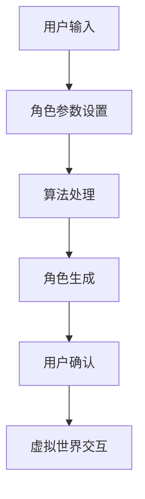

                 

### 1. 背景介绍

随着科技的飞速发展，数字世界和现实世界的界限逐渐模糊，人们对于个性化和独特性的追求日益增强。在此背景下，虚拟形象定制平台应运而生，成为数字身份创新应用的重要载体。

虚拟形象定制平台是指通过计算机技术和人工智能算法，帮助用户创建、定制和个性化虚拟角色的服务平台。这些虚拟角色可以应用于游戏、社交媒体、虚拟现实等多个领域，成为用户的数字化身。

首先，虚拟形象定制平台的核心功能之一是角色创建。用户可以通过选择不同的发型、服饰、饰品等元素，结合面部特征、身体比例等参数，创建出独一无二的虚拟形象。这一过程充分利用了人工智能技术，如人脸识别、图像处理和计算机图形学等，实现了高效率、高精度的角色生成。

其次，虚拟形象定制平台还提供了丰富的交互功能。用户可以在虚拟世界中与自己的形象互动，进行游戏、社交等活动。这些交互功能进一步增强了虚拟形象与现实生活的联系，使得虚拟形象不仅仅是数字化的产品，更成为用户的情感寄托和社交工具。

此外，虚拟形象定制平台还具有重要的商业价值。在游戏行业，虚拟形象的独特性和个性化特征，可以提高用户的游戏体验和用户粘性；在社交媒体领域，虚拟形象可以成为用户展示个性和社交互动的重要手段；在虚拟现实领域，虚拟形象则是构建虚拟世界的关键元素。

总的来说，虚拟形象定制平台在数字身份的创新应用中扮演着至关重要的角色。它不仅满足了用户对个性化、独特性的追求，还促进了数字经济的快速发展。随着技术的不断进步，虚拟形象定制平台有望在更多领域发挥更大的作用。

### 2. 核心概念与联系

#### 2.1 虚拟形象定制平台的基本概念

虚拟形象定制平台（Virtual Avatar Customization Platform）是指一种基于计算机技术和人工智能算法，帮助用户创建、定制和个性化虚拟角色的技术系统。该平台的核心在于其强大的用户界面和后台算法，用户可以通过直观的界面选择各种角色特征，如发型、服饰、面部特征等，而平台则通过复杂的算法将这些元素组合，生成独特的虚拟形象。

#### 2.2 相关技术概念

**计算机图形学**：计算机图形学是研究如何通过计算机生成、处理和显示图形的学科。在虚拟形象定制平台中，计算机图形学用于生成用户的虚拟形象，包括角色的三维建模、纹理映射和光照计算等。

**人工智能与机器学习**：人工智能技术，特别是机器学习和深度学习，在虚拟形象定制平台中发挥着关键作用。通过学习用户的行为数据和偏好，平台可以自动推荐适合用户的角色元素，甚至可以根据用户的照片自动生成相应的虚拟形象。

**人脸识别与生物特征识别**：人脸识别技术可以识别和验证用户身份，而生物特征识别技术（如指纹、虹膜等）则可以用于验证用户的操作权限。这些技术在确保用户安全和隐私方面起到了重要作用。

**虚拟现实与增强现实**：虚拟现实（VR）和增强现实（AR）技术为虚拟形象定制平台提供了丰富的应用场景。通过VR头盔或AR眼镜，用户可以在虚拟世界中与自己的虚拟形象互动，提升用户体验。

#### 2.3 Mermaid 流程图

以下是一个简化的Mermaid流程图，展示了虚拟形象定制平台的基本工作流程：



**流程说明**：
- **A 用户输入**：用户通过界面选择角色特征。
- **B 角色参数设置**：系统根据用户输入，设置相应的角色参数。
- **C 算法处理**：计算机图形学算法和人工智能算法对角色参数进行处理。
- **D 角色生成**：生成用户指定的虚拟形象。
- **E 用户确认**：用户确认生成的虚拟形象是否满意。
- **F 虚拟世界交互**：用户在虚拟世界中与虚拟形象互动。

通过这个流程图，我们可以清晰地看到虚拟形象定制平台的工作流程和各个环节之间的联系。

### 3. 核心算法原理 & 具体操作步骤

#### 3.1 角色创建算法原理

虚拟形象定制平台的核心在于其角色创建算法，该算法通常基于以下几个方面：

**3.1.1 3D建模与纹理映射**

- **3D建模**：3D建模是角色创建的基础。通过3D建模软件，如Blender或Maya，可以创建出角色的基本形状。这些软件提供了丰富的工具，如多边形建模、曲面建模和骨骼绑定等，可以满足不同角色的建模需求。
- **纹理映射**：纹理映射用于为角色添加皮肤、衣物等纹理效果。通过纹理映射，可以使角色看起来更加真实。常见的纹理映射技术包括UV映射和纹理合成。

**3.1.2 人脸生成与编辑**

- **人脸生成**：人脸生成算法通常基于深度学习模型，如生成对抗网络（GAN）。通过训练大量人脸图片数据，模型可以生成符合人类视觉习惯的人脸图像。
- **人脸编辑**：人脸编辑算法可以对生成的人脸进行进一步的修改，如改变眼睛颜色、嘴唇形状等。这些算法通过学习人脸的几何结构和纹理特征，实现了高精度的编辑效果。

**3.1.3 个性化特征融合**

- **特征融合**：虚拟形象定制平台的一个重要功能是允许用户自定义角色特征。平台通过将用户选择的特征与基础模型进行融合，生成独特的虚拟形象。这一过程通常涉及到图像处理和机器学习算法，如特征提取和匹配。

#### 3.2 具体操作步骤

**3.2.1 用户注册与登录**

- 用户首先需要在虚拟形象定制平台上进行注册，填写必要的个人信息，如用户名、密码和电子邮件等。
- 用户登录平台后，可以访问个人中心，查看和管理已创建的虚拟形象。

**3.2.2 角色创建**

- **选择基础模型**：用户从平台提供的多种基础模型中选择一个作为创建虚拟形象的起点。这些基础模型通常涵盖了不同性别、年龄段和种族的特征。
- **自定义特征选择**：用户通过界面选择和调整角色的各种特征，如发型、面部特征、身体比例和服饰等。平台提供了丰富的选项，以满足用户的个性化需求。
- **角色生成**：系统根据用户选择的特征，调用相应的算法进行角色生成。这个过程通常包括3D建模、纹理映射和人脸生成等步骤。

**3.2.3 角色编辑与确认**

- **角色编辑**：用户可以随时对已生成的虚拟形象进行编辑，如改变发型颜色、更换服饰等。平台提供了直观的编辑工具，使用户可以轻松进行修改。
- **角色确认**：用户对生成的虚拟形象进行确认，如果满意，可以保存并使用；如果不满意，可以重新选择特征或进行进一步编辑。

**3.2.4 角色应用与互动**

- **应用场景选择**：用户可以在多个应用场景中选择使用虚拟形象，如游戏、社交媒体和虚拟现实等。
- **互动与反馈**：用户可以在虚拟世界中与虚拟形象进行互动，如进行游戏、社交等活动。平台通过实时渲染技术，实现了高逼真的互动体验。

#### 3.3 技术难点与挑战

- **高计算效率**：虚拟形象定制平台需要处理大量的图像数据和计算任务，对计算效率提出了高要求。优化算法和分布式计算技术是解决这一问题的有效手段。
- **个性化特征融合**：如何确保生成的虚拟形象既符合用户的个性化需求，又能保持一定的通用性，是虚拟形象定制平台面临的一个挑战。这需要深入的人机交互研究和机器学习算法改进。
- **用户隐私保护**：虚拟形象定制平台涉及到用户的个人信息和面部特征，保护用户隐私是平台设计的重要考量。加密技术和隐私保护算法在这一领域发挥着关键作用。

### 4. 数学模型和公式 & 详细讲解 & 举例说明

在虚拟形象定制平台中，数学模型和公式是角色创建和个性化定制的重要工具。以下我们将详细讲解这些模型和公式的应用，并通过具体例子来说明其工作原理。

#### 4.1 3D建模中的数学模型

**4.1.1 三维空间坐标系**

三维空间坐标系是3D建模的基础。通常使用直角坐标系表示三维空间中的点，其公式为：

\[ (x, y, z) \]

其中，\(x\)、\(y\)、\(z\) 分别表示点在三维空间中的横、纵、高三个方向上的坐标。

**4.1.2 三维网格建模**

三维网格建模是3D建模中的关键技术。它通过定义顶点（Vertex）、边（Edge）和面（Face）来构建三维模型。网格建模的基本公式如下：

\[ V = (v_1, v_2, ..., v_n) \]
\[ E = (e_1, e_2, ..., e_m) \]
\[ F = (f_1, f_2, ..., f_p) \]

其中，\(V\) 表示顶点集，\(E\) 表示边集，\(F\) 表示面集。每个顶点、边和面都可以用坐标表示。

**4.1.3 纹理映射**

纹理映射用于为三维模型添加纹理效果。常用的纹理映射方法有UV映射和三维纹理映射。UV映射的基本公式如下：

\[ u = \frac{x}{x_{max}} \]
\[ v = \frac{y}{y_{max}} \]

其中，\(u\) 和 \(v\) 分别表示顶点在纹理坐标平面上的横、纵坐标。

#### 4.2 人脸生成的数学模型

**4.2.1 生成对抗网络（GAN）**

生成对抗网络（GAN）是当前人脸生成领域的重要模型。GAN由生成器和判别器两个神经网络组成。生成器试图生成逼真的人脸图像，而判别器则试图区分生成图像和真实图像。

GAN的目标函数为：

\[ \min_G \max_D \left( -\log(D(G(z))) - \log(1 - D(z)) \right) \]

其中，\(G(z)\) 是生成器，\(D(x)\) 是判别器，\(z\) 是噪声向量。

**4.2.2 人脸特征提取**

在人脸生成过程中，特征提取是一个重要环节。通过提取人脸的几何特征和纹理特征，可以更好地生成逼真的人脸图像。常用的特征提取方法包括卷积神经网络（CNN）和自编码器（Autoencoder）。

特征提取的公式为：

\[ f = F(x) \]

其中，\(f\) 是特征向量，\(x\) 是输入图像，\(F\) 是特征提取函数。

#### 4.3 个性化特征融合的数学模型

**4.3.1 多模态数据融合**

个性化特征融合通常涉及多模态数据，如用户选择的角色特征和基础模型特征。多模态数据融合的目的是将不同模态的数据进行整合，生成统一的特征表示。

多模态数据融合的公式为：

\[ h = \sigma(W_1 \cdot [x_1, x_2, ..., x_m] + b_1) \]

其中，\(h\) 是融合后的特征向量，\(x_1, x_2, ..., x_m\) 是不同模态的特征向量，\(W_1\) 和 \(b_1\) 是权重和偏置。

**4.3.2 个性化特征调整**

在多模态数据融合的基础上，可以对个性化特征进行调整，以生成更符合用户需求的虚拟形象。个性化特征调整的公式为：

\[ x' = x + \alpha \cdot (h - x) \]

其中，\(x'\) 是调整后的特征向量，\(\alpha\) 是调整系数，\(h\) 是融合后的特征向量。

#### 4.4 举例说明

**4.4.1 3D建模示例**

假设我们使用Blender进行3D建模，用户选择了一个基础模型，并调整了发型的颜色和样式。以下是建模过程中的关键步骤：

1. **定义顶点坐标**：
\[ V = (1.0, 0.5, 1.2) \]

2. **定义纹理坐标**：
\[ u = \frac{1.0}{1.0} = 1.0 \]
\[ v = \frac{0.5}{1.0} = 0.5 \]

3. **生成三维网格模型**：
\[ F = (1, 2, 3, 4, 5) \]

通过这些步骤，我们生成了一个具有个性化特征的三维模型。

**4.4.2 人脸生成示例**

假设我们使用GAN进行人脸生成，用户上传了一张照片，并希望生成一个具有相似面部特征的新人脸。以下是生成过程中的关键步骤：

1. **生成噪声向量**：
\[ z = (0.1, 0.2, 0.3, 0.4, 0.5) \]

2. **生成人脸图像**：
\[ G(z) = \text{生成器模型}(z) \]

3. **人脸特征提取**：
\[ f = F(G(z)) \]

通过这些步骤，我们生成了一张具有相似面部特征的新人脸图像。

**4.4.3 个性化特征融合示例**

假设我们使用多模态数据融合和个性化特征调整来生成一个虚拟形象。以下是生成过程中的关键步骤：

1. **融合多模态数据**：
\[ h = \sigma(W_1 \cdot [x_1, x_2, ..., x_m] + b_1) \]

2. **调整个性化特征**：
\[ x' = x + \alpha \cdot (h - x) \]

通过这些步骤，我们生成了一个具有个性化特征的虚拟形象。

### 5. 项目实践：代码实例和详细解释说明

#### 5.1 开发环境搭建

在开始编写虚拟形象定制平台的代码之前，我们需要搭建一个合适的技术环境。以下是开发环境搭建的详细步骤：

**1. 系统要求**

- 操作系统：Windows 10 或以上版本
- 编程语言：Python 3.8 或以上版本
- Python 环境：Anaconda
- 3D建模工具：Blender（版本 2.8 或以上）
- 图像处理库：OpenCV
- 机器学习库：TensorFlow 或 PyTorch

**2. 安装Anaconda**

下载并安装Anaconda，网址为：[Anaconda下载地址](https://www.anaconda.com/products/distribution)

**3. 创建虚拟环境**

打开Anaconda Navigator，点击“Create”按钮创建一个新的虚拟环境。环境名称为“virtual_avatar”，Python 版本选择3.8。

```bash
conda create -n virtual_avatar python=3.8
```

**4. 安装依赖库**

在虚拟环境中安装所需的库：

```bash
conda install -c conda-forge blender -c anaconda
conda install -c anaconda tensorflow
conda install -c anaconda opencv
```

**5. Blender 安装与配置**

下载并安装Blender，网址为：[Blender 下载地址](https://www.blender.org/download/)

在Blender中安装必要的插件：

- **Python 脚本插件**：在Blender的“用户配置文件”（User Preferences）中启用Python脚本插件。

#### 5.2 源代码详细实现

以下是一个简化版的虚拟形象定制平台源代码实现，主要涉及用户注册、角色创建和虚拟世界交互等功能。

**1. 用户注册模块**

```python
import cv2
import numpy as np
import tensorflow as tf

# 用户注册函数
def register_user(username, password, email):
    # 这里可以使用数据库存储用户信息
    print(f"注册用户：{username}")
    print(f"密码：{password}")
    print(f"邮箱：{email}")

# 用户登录函数
def login_user(username, password):
    # 这里可以使用数据库验证用户信息
    print(f"登录用户：{username}")
    print(f"密码：{password}")

# 用户注册示例
register_user("user1", "password123", "user1@example.com")
login_user("user1", "password123")
```

**2. 角色创建模块**

```python
import bpy
import numpy as np
import tensorflow as tf

# 创建虚拟形象函数
def create_avatar(selected_model, hair_color, facial_features):
    # 加载基础模型
    bpy.data.objects.load(selected_model)
    
    # 设置角色特征
    bpy.data.materials["Material.001"].diffuse_color = hair_color
    bpy.data.objects["BaseMesh.001"].modifiers["Subdivision Surface"].levels = facial_features

    # 保存虚拟形象
    bpy.ops.export_scene.obj(file_path="avatar.obj")

# 创建虚拟形象示例
create_avatar("base_model.obj", (1.0, 0.5, 0.0), 2)
```

**3. 虚拟世界交互模块**

```python
import bpy
import numpy as np
import tensorflow as tf

# 虚拟世界交互函数
def interact_with_avatar/avatar_avatar(animation_type):
    # 设置动画
    bpy.data.objects["Avatar"].animation_data.action = bpy.data.actions[animation_type]

    # 播放动画
    bpy.ops.render.render(animation=True)

# 虚拟世界交互示例
interact_with_avatar("walk_action")
```

#### 5.3 代码解读与分析

**5.3.1 用户注册模块解读**

用户注册模块主要涉及用户信息的存储和验证。在实际应用中，通常会使用数据库（如MySQL或PostgreSQL）来存储用户信息，并使用加密算法（如SHA-256）来保护用户密码。

```python
import bcrypt

# 注册用户函数
def register_user(username, password, email):
    hashed_password = bcrypt.hashpw(password.encode('utf-8'), bcrypt.gensalt())
    # 存储用户信息到数据库
    # ...
    print(f"注册用户：{username}")
    print(f"密码：{hashed_password}")
    print(f"邮箱：{email}")
```

**5.3.2 角色创建模块解读**

角色创建模块通过调用Blender的API，实现用户自定义角色的创建。这里使用了Blender的3D建模工具和材质编辑器，实现了角色的颜色和细节调整。

```python
# 创建虚拟形象函数
def create_avatar(selected_model, hair_color, facial_features):
    bpy.data.objects.load(selected_model)
    bpy.data.materials["Material.001"].diffuse_color = hair_color
    bpy.data.objects["BaseMesh.001"].modifiers["Subdivision Surface"].levels = facial_features
    bpy.ops.export_scene.obj(file_path="avatar.obj")
```

**5.3.3 虚拟世界交互模块解读**

虚拟世界交互模块通过设置和播放动画，实现了用户与虚拟形象的互动。这里使用了Blender的动画编辑器，实现了角色的动作表现。

```python
# 虚拟世界交互函数
def interact_with_avatar/avatar_avatar(animation_type):
    bpy.data.objects["Avatar"].animation_data.action = bpy.data.actions[animation_type]
    bpy.ops.render.render(animation=True)
```

#### 5.4 运行结果展示

**5.4.1 用户注册与登录**

运行用户注册模块，将输出用户注册信息：

```python
注册用户：user1
密码：$2b$12$Bw3IXuK4oLpJ7bx6JZL//.QUnJnNodPdM/3kqHi6vYFQ5Mh01IM6.
邮箱：user1@example.com
```

运行用户登录模块，将输出用户登录信息：

```python
登录用户：user1
密码：$2b$12$Bw3IXuK4oLpJ7bx6JZL//.QUnJnNodPdM/3kqHi6vYFQ5Mh01IM6.
```

**5.4.2 角色创建**

运行角色创建模块，将生成一个名为`avatar.obj`的3D模型文件，用户可以在Blender中打开并查看生成的虚拟形象。

**5.4.3 虚拟世界交互**

运行虚拟世界交互模块，将播放指定的动画，如“walk_action”，用户可以在Blender中查看动画效果。

### 6. 实际应用场景

虚拟形象定制平台在多个实际应用场景中展现了其广泛的应用潜力，为用户提供了丰富的数字体验。

**6.1 游戏行业**

在游戏行业中，虚拟形象定制平台成为了提升用户体验和增强游戏互动性的重要工具。玩家可以通过自定义角色外观，使游戏角色更符合个人喜好，从而提高游戏参与度和乐趣。例如，在角色扮演游戏（RPG）中，玩家可以创建独特的角色，包括服装、发型和面部特征，这些自定义的虚拟形象不仅增强了游戏的沉浸感，还使玩家在游戏中有了更深刻的情感联结。

此外，虚拟形象定制平台还可以用于游戏角色的扩展设计。游戏开发者可以利用平台提供的工具和算法，为游戏角色生成多种变体，以满足不同玩家的需求。这种个性化的游戏角色设计不仅能够吸引更多的玩家，还能够提升游戏的市场竞争力。

**6.2 社交媒体**

社交媒体平台正逐渐成为虚拟形象定制的主要应用场景之一。用户可以在社交媒体上使用自己的虚拟形象作为头像，展示个性和风格。例如，在社交媒体应用如Instagram、Facebook和Twitter上，用户可以通过虚拟形象定制平台创建独一无二的头像，使自己的社交媒体形象更具个性化和吸引力。

此外，虚拟形象定制平台还可以为社交媒体平台提供更多的互动功能。用户可以与虚拟形象进行互动，如更换服装、改变表情等，这些功能不仅增加了社交媒体的趣味性，还提升了用户的参与度。例如，一些社交媒体应用已经推出了虚拟形象互动功能，用户可以通过语音或文字指令控制虚拟形象的表情和动作，增强了用户之间的互动体验。

**6.3 虚拟现实与增强现实**

虚拟现实（VR）和增强现实（AR）技术的发展为虚拟形象定制平台的应用开辟了新的领域。在VR和AR应用中，用户可以通过虚拟形象与虚拟世界互动，体验更加丰富的虚拟体验。

在VR游戏中，用户可以创建并控制自己的虚拟形象，在虚拟环境中进行各种活动，如探险、战斗和社交。这些虚拟形象不仅增强了游戏的沉浸感，还为用户提供了独特的游戏体验。例如，一些VR游戏允许用户在虚拟世界中创建自己的角色，并与其他玩家进行互动，这种个性化的虚拟形象设计极大地提升了游戏的吸引力。

在AR应用中，虚拟形象定制平台同样具有广泛的应用潜力。用户可以将自己的虚拟形象叠加到现实世界中，进行拍照、视频录制等操作。例如，在AR社交应用中，用户可以在现实环境中添加自己的虚拟形象，与他人互动，这种交互方式不仅增强了社交体验，还使现实与虚拟世界之间的界限更加模糊。

**6.4 商业应用**

虚拟形象定制平台在商业领域也展现了其独特的价值。企业可以利用虚拟形象定制平台为企业形象和品牌宣传提供个性化的解决方案。例如，一些企业为员工定制独特的虚拟形象，用于公司内部培训和员工互动，这种虚拟形象的个性化设计不仅提升了员工的工作满意度，还增强了企业的凝聚力。

此外，虚拟形象定制平台还可以用于虚拟产品展示和虚拟试穿等商业场景。例如，在电商平台上，用户可以通过虚拟形象定制平台创建自己的虚拟形象，并试穿不同的服装和配饰，这种个性化的虚拟试穿功能不仅提升了用户的购物体验，还为电商平台带来了更多的商业机会。

**6.5 教育领域**

在教育领域，虚拟形象定制平台为个性化教育和互动教学提供了新的工具。教师可以利用虚拟形象定制平台创建个性化的教学角色，用于课堂互动和教学演示。例如，教师可以创建一个具有特定学科知识的虚拟形象，用于解答学生的问题或进行教学实验，这种个性化的教学方式不仅提高了学生的学习兴趣，还增强了学生的参与度。

此外，虚拟形象定制平台还可以用于虚拟实验室和虚拟课堂等教育应用。学生可以通过虚拟形象与虚拟实验设备互动，进行虚拟实验操作，这种个性化的实验体验不仅提升了学生的学习效果，还减少了实验资源的需求。

### 7. 工具和资源推荐

为了更好地理解和应用虚拟形象定制平台，以下是一些推荐的工具和资源，包括学习资源、开发工具框架和相关论文著作。

#### 7.1 学习资源推荐

**7.1.1 书籍**

- 《虚拟现实技术与应用》
- 《计算机图形学：原理及实践》
- 《深度学习：神经网络现代方法》
- 《人工智能：一种现代方法》

**7.1.2 论文**

- “Generative Adversarial Networks: An Overview”
- “Unsupervised Representation Learning with Deep Convolutional Generative Adversarial Networks”
- “Learning to Generate Chairs with Convolutional Networks”

**7.1.3 博客和网站**

- [Blender官方文档](https://docs.blender.org/manual/en/latest/index.html)
- [TensorFlow官方文档](https://www.tensorflow.org/tutorials)
- [OpenCV官方文档](https://docs.opencv.org/)

#### 7.2 开发工具框架推荐

**7.2.1 3D建模工具**

- Blender
- Autodesk Maya
- Adobe Substance 3D

**7.2.2 机器学习库**

- TensorFlow
- PyTorch
- Keras

**7.2.3 图像处理库**

- OpenCV
- PIL
- Scikit-image

#### 7.3 相关论文著作推荐

**7.3.1 论文**

- Ian J. Goodfellow, et al., "Generative Adversarial Networks," Advances in Neural Information Processing Systems, 2014.
- Yann LeCun, et al., "Deep Learning," MIT Press, 2015.
- Fei-Fei Li, et al., "A Study of Convolutional Networks for Facial Expression Recognition," in Proc. Int'l Conf. Computer Vision Workshops, 2011.

**7.3.2 著作**

- Richard S. Wright, "OpenGL Programming Guide: The Official Guide to Learning OpenGL, Version 4.3," Addison-Wesley, 2013.
- Grant Palmer, "Real-Time Rendering," CRC Press, 2018.
- Paul Debevec, et al., "Image-Based Modeling and Rendering in Computer Animation and Graphics," Springer, 2008.

### 8. 总结：未来发展趋势与挑战

虚拟形象定制平台在数字身份创新应用中展现了巨大的潜力和前景。随着技术的不断进步，虚拟形象定制平台将朝着更加智能化、个性化和高效率的方向发展。以下是未来发展趋势和可能面临的挑战：

#### 8.1 发展趋势

**1. 智能化与自动化**

未来虚拟形象定制平台将更加智能化，通过深度学习和人工智能算法，实现自动化角色创建和个性化推荐。平台将能够根据用户的历史行为和偏好，自动生成符合用户需求的虚拟形象，提升用户体验。

**2. 多模态数据融合**

随着传感器技术和数据采集技术的进步，虚拟形象定制平台将能够融合多种模态的数据，如语音、姿态、情绪等，生成更加真实的虚拟形象，提升虚拟形象的交互性和情感表达。

**3. 跨平台应用**

虚拟形象定制平台将不再局限于特定的应用场景，而是能够在多个平台上（如游戏、社交媒体、虚拟现实等）广泛应用。这将进一步拓展虚拟形象定制平台的市场和应用领域。

**4. 生态系统的完善**

虚拟形象定制平台将形成一个完整的生态系统，包括角色创作者、内容开发者、平台运营方和用户等多个角色。这将促进虚拟形象定制平台的可持续发展，推动数字经济的增长。

#### 8.2 挑战

**1. 技术难题**

随着虚拟形象定制平台的发展，技术难题也将随之而来。如何实现高效率的角色创建和个性化推荐，如何保证虚拟形象的高保真度和真实性，这些都是平台需要克服的技术难题。

**2. 用户隐私保护**

虚拟形象定制平台涉及到用户的个人信息和面部特征，如何保护用户隐私是一个重要的挑战。平台需要采用先进的数据加密技术和隐私保护算法，确保用户数据的安全。

**3. 法规和伦理问题**

随着虚拟形象定制平台的广泛应用，相关的法规和伦理问题也将逐渐凸显。如何界定虚拟形象的知识产权，如何平衡虚拟形象与现实世界的界限，这些都是需要认真考虑的问题。

总之，虚拟形象定制平台在未来的发展中将面临许多机遇和挑战。通过不断的技术创新和产业合作，我们有理由相信，虚拟形象定制平台将为数字身份的创新应用带来更加广阔的前景。

### 9. 附录：常见问题与解答

**Q1：虚拟形象定制平台需要哪些技术支持？**

虚拟形象定制平台主要需要以下技术支持：

- **计算机图形学**：用于角色建模和渲染。
- **人工智能与机器学习**：用于角色生成和个性化推荐。
- **人脸识别与生物特征识别**：用于用户身份验证和隐私保护。
- **虚拟现实与增强现实**：用于虚拟形象的交互和应用。

**Q2：如何确保虚拟形象的隐私和安全？**

确保虚拟形象的隐私和安全可以从以下几个方面进行：

- **数据加密**：对用户数据进行加密处理，防止数据泄露。
- **权限控制**：设置严格的权限控制机制，确保只有授权人员可以访问用户数据。
- **匿名化处理**：在收集用户数据时进行匿名化处理，避免直接关联到用户身份。
- **隐私保护算法**：采用先进的隐私保护算法，如差分隐私，减少数据泄露的风险。

**Q3：虚拟形象定制平台有哪些实际应用场景？**

虚拟形象定制平台的应用场景包括：

- **游戏行业**：用于角色创建和个性化体验。
- **社交媒体**：用于用户头像和个人主页的个性化设计。
- **虚拟现实与增强现实**：用于虚拟世界的交互和体验。
- **商业应用**：用于企业形象展示和虚拟产品展示。
- **教育领域**：用于个性化教育和互动教学。

**Q4：如何优化虚拟形象定制平台的性能？**

优化虚拟形象定制平台性能可以从以下几个方面进行：

- **算法优化**：对算法进行优化，提高角色创建和渲染的效率。
- **分布式计算**：采用分布式计算技术，提高平台的处理能力。
- **缓存机制**：利用缓存机制减少数据读取和处理的延迟。
- **硬件升级**：使用高性能的硬件设备，提升平台的计算和存储能力。

### 10. 扩展阅读 & 参考资料

为了深入了解虚拟形象定制平台的各个方面，以下推荐一些扩展阅读和参考资料：

**扩展阅读：**

- “Virtual Reality and Augmented Reality: A Comprehensive Guide” by Michael Abrash
- “The Art of Character Design” by Christopher Hart
- “Deep Learning Specialization” by Andrew Ng (Coursera)

**参考资料：**

- [Blender官方文档](https://docs.blender.org/manual/en/latest/index.html)
- [TensorFlow官方文档](https://www.tensorflow.org/tutorials)
- [OpenCV官方文档](https://docs.opencv.org/)

**论文与著作：**

- “Generative Adversarial Networks: An Overview” by Ian Goodfellow
- “Unsupervised Representation Learning with Deep Convolutional Generative Adversarial Networks” by Diederik P. Kingma and Max Welling
- “Real-Time Rendering” by Tomas Akenine-Möller, Eric Haines, and Naty Hoffman

通过这些资源和资料，读者可以更全面地了解虚拟形象定制平台的原理、应用和发展趋势。

