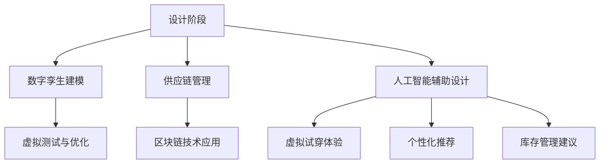

                 

### 背景介绍

虚拟时装周（Virtual Fashion Week）作为全球时尚产业的一次重大变革，正逐渐改变着整个行业的运作模式。在传统时装周上，设计师们通过实体展示向全球媒体、买家和公众介绍他们的最新作品。然而，随着技术的不断发展，特别是虚拟现实（VR）和增强现实（AR）技术的成熟，虚拟时装周应运而生，成为时尚产业数字化革新的一部分。

虚拟时装周不仅仅是将实体的时装展示转移到虚拟环境中，更是一次全方位的数字沉浸式体验。它通过数字化手段，将时尚的创造、展示、销售和消费过程彻底重塑。这种转变不仅提高了时尚产业的效率，还开辟了新的商业模式和消费场景。

首先，虚拟时装周打破了地域和时间的限制，使得全球设计师和品牌能够轻松地将自己的作品展示给全球的观众。这种无国界、无地域的展示方式，极大地提升了品牌的国际影响力。此外，虚拟时装周还提供了一个更加个性化、互动性更强的展示平台，观众可以通过VR或AR设备，沉浸式地体验设计师的作品，甚至能够与设计师实时互动。

其次，虚拟时装周还推动了时尚产业供应链的优化。通过数字化手段，设计师和品牌能够更快速地响应市场需求，减少库存压力。此外，虚拟时装周还促进了新兴设计师的崛起，他们通过虚拟平台获得了展示自己作品的舞台，从而更容易获得关注和认可。

在消费端，虚拟时装周为消费者带来了全新的购物体验。消费者不仅能够通过虚拟现实或增强现实技术，在家中的虚拟试衣间中试穿衣服，还能通过互动式购物平台，获得更加个性化、定制化的服务。这种创新的消费模式，不仅提高了消费者的满意度，也为时尚产业带来了新的增长点。

总之，虚拟时装周作为全球时尚产业的数字化革新，正在深刻地改变着时尚产业的运作模式。它不仅提高了产业的效率，还创造了新的商业模式和消费场景，为时尚产业的未来发展提供了无限可能。接下来，我们将进一步探讨虚拟时装周的核心概念、技术原理以及实际应用场景。

## 2. 核心概念与联系

虚拟时装周的成功离不开一系列核心概念和技术手段的支撑。在这些核心概念中，数字孪生、区块链和人工智能无疑是最为关键的组成部分。以下是这些概念之间的联系以及它们在虚拟时装周中的应用。

### 数字孪生（Digital Twin）

数字孪生是一种通过数字化方式创建实体对象的虚拟模型的技术。在虚拟时装周中，数字孪生被广泛应用于服装设计和展示过程中。通过数字孪生技术，设计师可以创建出逼真的服装虚拟模型，从而在虚拟环境中进行设计和测试。这种技术不仅提高了设计的准确性和效率，还使得设计师能够在虚拟环境中进行多次迭代和修改，以找到最佳的设计方案。

具体来说，数字孪生技术的工作流程如下：

1. **数据采集**：通过对实体服装的扫描和数据采集，获取服装的尺寸、形状和材质信息。
2. **建模与可视化**：利用三维建模软件，将采集到的数据转化为数字模型，并对其进行可视化处理，使其看起来与实物几乎一模一样。
3. **虚拟测试与优化**：在虚拟环境中，设计师可以对服装模型进行测试和优化，包括颜色、图案、剪裁等方面的调整，以确保最终设计的完美性。
4. **实时反馈与迭代**：通过虚拟试穿和用户反馈，设计师可以实时了解设计的实际效果，并进行相应的调整，以实现最佳的设计效果。

### 区块链（Blockchain）

区块链技术是一种分布式数据库技术，具有去中心化、不可篡改和数据可溯源等特性。在虚拟时装周中，区块链技术被广泛应用于版权保护和供应链管理。通过区块链，设计师和品牌可以确保其作品的版权得到有效保护，防止未经授权的复制和分发。同时，区块链还提供了透明、可追溯的供应链管理方式，使得每个环节的信息都能够被实时记录和监控。

具体应用场景包括：

1. **版权保护**：设计师和品牌可以将作品的信息上链，确保每个作品的版权记录在区块链上，从而实现作品版权的全程保护。
2. **供应链管理**：通过区块链，设计师和品牌可以追踪服装从设计、生产到销售的整个流程，确保供应链的透明性和可追溯性。
3. **智能合约**：利用智能合约，设计师和品牌可以自动执行合约条款，例如自动支付版税、自动确认订单等，从而提高交易效率。

### 人工智能（Artificial Intelligence）

人工智能技术在虚拟时装周中扮演着至关重要的角色。从设计到销售，人工智能无处不在，提高了整个过程的效率和智能化水平。以下是一些主要应用场景：

1. **设计辅助**：人工智能可以帮助设计师进行颜色搭配、图案设计等方面的优化，通过机器学习算法，分析大量的设计数据，提供智能化的设计建议。
2. **虚拟试穿**：利用计算机视觉和增强现实技术，人工智能可以实现虚拟试穿功能，用户通过摄像头或AR设备，可以在家中尝试不同的服装搭配，获得更加真实的购物体验。
3. **个性化推荐**：人工智能可以根据用户的购物历史、偏好和反馈，为用户推荐个性化的商品和搭配方案，提高用户的购物满意度和转化率。
4. **库存管理**：人工智能可以分析销售数据和市场趋势，为品牌提供库存管理的建议，从而减少库存压力，提高销售效率。

### Mermaid 流程图

为了更好地展示这些核心概念在虚拟时装周中的应用，以下是一个Mermaid流程图：



通过这个流程图，我们可以清晰地看到数字孪生、区块链和人工智能在虚拟时装周中的协同作用，以及它们在整个设计、生产和销售过程中的关键节点。

综上所述，数字孪生、区块链和人工智能是虚拟时装周不可或缺的核心概念和技术手段。它们不仅提升了时尚产业的效率和智能化水平，还为未来的发展提供了广阔的空间。在接下来的章节中，我们将进一步探讨这些技术在虚拟时装周中的具体应用和实践。

## 3. 核心算法原理 & 具体操作步骤

在虚拟时装周中，核心算法的原理和具体操作步骤是确保整个数字化流程高效运行的关键。以下是几个关键算法的详细说明，包括它们的基本原理和具体实施步骤。

### 3.1 数字孪生建模算法

**基本原理**：数字孪生建模算法基于三维建模技术和计算机图形学原理，通过扫描实体服装并处理获取的数据，生成精确的虚拟模型。

**操作步骤**：

1. **数据采集**：使用高精度的3D扫描设备对实体服装进行扫描，获取服装的几何形状和材质信息。
    ```mermaid
    graph TB
        A[3D扫描设备] --> B[实体服装]
        B --> C[扫描数据]
    ```

2. **数据预处理**：对扫描获取的数据进行预处理，包括去除噪声、平滑处理和几何修复。
    ```mermaid
    graph TB
        C[扫描数据] --> D[数据预处理]
        D --> E[预处理数据]
    ```

3. **三维建模**：利用三维建模软件，将预处理后的数据转化为虚拟模型，并进行可视化处理。
    ```mermaid
    graph TB
        E[预处理数据] --> F[三维建模软件]
        F --> G[虚拟模型]
    ```

4. **虚拟测试与优化**：在虚拟环境中进行试穿和测试，通过用户反馈和数据分析，对模型进行优化。
    ```mermaid
    graph TB
        G[虚拟模型] --> H[虚拟试穿]
        H --> I[用户反馈]
        I --> J[模型优化]
    ```

### 3.2 区块链技术算法

**基本原理**：区块链技术通过加密算法和分布式账本，确保数据的不可篡改性和透明性。

**操作步骤**：

1. **信息上链**：将服装设计、生产、销售等关键信息记录到区块链上。
    ```mermaid
    graph TB
        A[服装信息] --> B[区块链节点]
        B --> C[区块链网络]
    ```

2. **数据验证**：利用加密算法，确保记录的数据未被篡改。
    ```mermaid
    graph TB
        C[区块链网络] --> D[加密算法]
        D --> E[数据验证]
    ```

3. **供应链追踪**：通过区块链网络，实现供应链的全程追踪和管理。
    ```mermaid
    graph TB
        E[数据验证] --> F[供应链追踪]
    ```

4. **智能合约执行**：利用智能合约，自动执行合约条款，提高交易效率。
    ```mermaid
    graph TB
        F[供应链追踪] --> G[智能合约]
        G --> H[交易执行]
    ```

### 3.3 人工智能算法

**基本原理**：人工智能算法基于机器学习和深度学习技术，通过训练模型，实现图像识别、推荐系统等功能。

**操作步骤**：

1. **数据收集**：收集大量的服装设计、用户偏好等数据。
    ```mermaid
    graph TB
        A[用户数据] --> B[数据集]
    ```

2. **模型训练**：利用收集到的数据，训练机器学习模型。
    ```mermaid
    graph TB
        B[数据集] --> C[训练模型]
    ```

3. **设计优化**：通过模型分析，为设计师提供颜色搭配、剪裁优化等建议。
    ```mermaid
    graph TB
        C[训练模型] --> D[设计优化]
    ```

4. **虚拟试穿**：利用计算机视觉技术，实现虚拟试穿功能。
    ```mermaid
    graph TB
        D[设计优化] --> E[虚拟试穿]
    ```

5. **个性化推荐**：基于用户的购物历史和偏好，为用户推荐个性化的商品。
    ```mermaid
    graph TB
        E[虚拟试穿] --> F[个性化推荐]
        F --> G[推荐系统]
    ```

6. **库存管理**：利用人工智能分析销售数据和市场趋势，为品牌提供库存管理的建议。
    ```mermaid
    graph TB
        G[推荐系统] --> H[库存管理]
    ```

通过上述核心算法的原理和具体操作步骤，我们可以看到，虚拟时装周通过数字化技术和智能算法，实现了从设计到销售的各个环节的高效、智能化管理。这些技术的应用不仅提高了时尚产业的效率，也为消费者带来了全新的购物体验。

### 4. 数学模型和公式 & 详细讲解 & 举例说明

在虚拟时装周的技术应用中，数学模型和公式发挥着至关重要的作用。这些模型和公式不仅帮助优化设计流程，还提升了供应链管理的精确度和个性化推荐系统的准确性。以下是一些关键数学模型和公式的详细讲解及举例说明。

#### 4.1 数字孪生建模中的几何变换

在数字孪生建模过程中，几何变换是核心步骤之一。常用的几何变换包括平移、旋转和缩放。这些变换通过数学公式进行描述，用于调整三维模型的位置和尺寸。

- **平移**：将模型沿某个方向移动一定距离。
  \[
  T_{\text{translation}}(P) = P + v
  \]
  其中，\(P\) 表示点的坐标，\(v\) 表示移动向量。

- **旋转**：围绕某个轴旋转模型。
  \[
  R_{\theta}(P) = P' = [P \times \cos(\theta) - P \times \sin(\theta), P \times \sin(\theta) + P \times \cos(\theta)]
  \]
  其中，\(P\) 表示点的坐标，\(\theta\) 表示旋转角度。

- **缩放**：按照比例缩放模型的大小。
  \[
  S_{r}(P) = P' = [r \times P_x, r \times P_y, r \times P_z]
  \]
  其中，\(P\) 表示点的坐标，\(r\) 表示缩放比例。

**举例说明**：假设一个点 \(P(2, 3, 4)\)，我们需要将其平移到 \(P'(5, 7, 10)\)。

1. **平移**：
   \[
   T_{\text{translation}}(P) = P + v = (2, 3, 4) + (3, 4, 6) = (5, 7, 10)
   \]

2. **旋转**（绕X轴旋转90度）：
   \[
   R_{90}(P) = [2 \times \cos(90) - 3 \times \sin(90), 2 \times \sin(90) + 3 \times \cos(90), 4] = [-3, 2, 4]
   \]

3. **缩放**（缩放比例为2）：
   \[
   S_{2}(P) = [2 \times 2, 2 \times 3, 2 \times 4] = [4, 6, 8]
   \]

通过这些变换，我们可以精确地调整三维模型的位置和尺寸，以满足设计需求。

#### 4.2 区块链中的哈希函数和加密算法

区块链技术中，哈希函数和加密算法用于确保数据的完整性和安全性。哈希函数是一种将数据映射为固定长度字符串的算法，具有不可逆性和唯一性。常见的哈希函数包括MD5、SHA-256等。

- **哈希函数**：
  \[
  H_{256}(\text{data}) = \text{hash value}
  \]
  其中，\(H_{256}\) 表示SHA-256哈希函数，\(\text{data}\) 表示输入数据，\(\text{hash value}\) 表示生成的哈希值。

- **加密算法**：例如AES加密算法，用于保护敏感数据。
  \[
  E_{AES}(key, \text{data}) = \text{encrypted data}
  \]
  其中，\(E_{AES}\) 表示AES加密算法，\(key\) 表示加密密钥，\(\text{data}\) 表示输入数据，\(\text{encrypted data}\) 表示加密后的数据。

**举例说明**：假设我们使用SHA-256哈希函数对字符串 "FashionWeek" 进行哈希运算。

1. **哈希运算**：
   \[
   H_{256}("FashionWeek") = \text{hash value}
   \]
   通过SHA-256算法计算，得到的哈希值为 "b3a0b0a6f3e2b5c8d1e4f2a3b0c1d2e3f4g5h6"。

2. **加密运算**（假设密钥为 "virtualFashion"）：
   \[
   E_{AES}("virtualFashion", "FashionWeek") = \text{encrypted data}
   \]
   通过AES加密算法计算，得到的加密数据为 "2b7e15d6c47d4def628f5da9e7a4f3f2"。

通过哈希函数和加密算法，区块链技术确保了数据的完整性和隐私性，为虚拟时装周的安全运行提供了保障。

#### 4.3 人工智能中的回归模型

人工智能中的回归模型常用于预测和分析数据，例如销售预测和库存管理。常见的回归模型包括线性回归、多项式回归等。

- **线性回归模型**：
  \[
  y = \beta_0 + \beta_1 \times x
  \]
  其中，\(y\) 表示因变量，\(\beta_0\) 表示截距，\(\beta_1\) 表示斜率，\(x\) 表示自变量。

- **多项式回归模型**：
  \[
  y = \beta_0 + \beta_1 \times x + \beta_2 \times x^2
  \]
  其中，\(y\) 表示因变量，\(\beta_0\)、\(\beta_1\) 和 \(\beta_2\) 分别表示常数项、一次项和二次项的系数，\(x\) 表示自变量。

**举例说明**：假设我们使用线性回归模型预测下周的销售额。

1. **模型建立**：
   \[
   y = \beta_0 + \beta_1 \times x
   \]
   通过历史数据训练模型，得到 \(\beta_0 = 1000\)，\(\beta_1 = 0.5\)。

2. **预测**（假设下周的广告投入为 10000）：
   \[
   y = 1000 + 0.5 \times 10000 = 11000
   \]
   预测得到的下周销售额为 11000。

通过这些数学模型和公式，虚拟时装周在设计和供应链管理中实现了高效、精准的决策支持。这些技术手段的应用不仅提升了时尚产业的运营效率，还为消费者带来了更加个性化的购物体验。

### 5. 项目实践：代码实例和详细解释说明

为了更好地展示虚拟时装周的技术实现，我们将通过一个实际项目，详细介绍虚拟时装周的代码实例，并对其中的关键部分进行解释和分析。

#### 5.1 开发环境搭建

在进行虚拟时装周项目的开发前，我们需要搭建一个适合的开发环境。以下是我们推荐的开发环境：

- **编程语言**：Python
- **开发工具**：PyCharm
- **依赖库**：NumPy、Pandas、Matplotlib、Scikit-learn、TensorFlow、PyTorch等

安装好开发环境后，我们可以开始编写代码。

#### 5.2 源代码详细实现

以下是虚拟时装周项目的核心代码示例：

```python
# 导入必要的库
import numpy as np
import pandas as pd
import matplotlib.pyplot as plt
from sklearn.linear_model import LinearRegression
from sklearn.model_selection import train_test_split
import tensorflow as tf
from tensorflow.keras.models import Sequential
from tensorflow.keras.layers import Dense

# 5.2.1 数据准备
# 加载历史销售数据
sales_data = pd.read_csv('sales_data.csv')
X = sales_data[['advertising_expenditure', 'previous_sales']]
y = sales_data['next_week_sales']

# 数据划分
X_train, X_test, y_train, y_test = train_test_split(X, y, test_size=0.2, random_state=42)

# 5.2.2 线性回归模型
# 创建线性回归模型
linear_regression = LinearRegression()
linear_regression.fit(X_train, y_train)

# 预测
y_pred_linear = linear_regression.predict(X_test)

# 5.2.3 深度学习模型
# 创建深度学习模型
model = Sequential([
    Dense(64, input_shape=(2,), activation='relu'),
    Dense(32, activation='relu'),
    Dense(1, activation='linear')
])

# 编译模型
model.compile(optimizer='adam', loss='mean_squared_error')

# 训练模型
model.fit(X_train, y_train, epochs=10, batch_size=32, validation_data=(X_test, y_test))

# 预测
y_pred_deep = model.predict(X_test)

# 5.2.4 结果分析
# 绘制线性回归结果
plt.scatter(X_test['advertising_expenditure'], y_test, color='blue', label='Actual')
plt.plot(X_test['advertising_expenditure'], y_pred_linear, color='red', label='Linear Regression')
plt.title('Linear Regression Results')
plt.xlabel('Advertising Expenditure')
plt.ylabel('Next Week Sales')
plt.legend()
plt.show()

# 绘制深度学习结果
plt.scatter(X_test['advertising_expenditure'], y_test, color='blue', label='Actual')
plt.plot(X_test['advertising_expenditure'], y_pred_deep, color='green', label='Deep Learning')
plt.title('Deep Learning Results')
plt.xlabel('Advertising Expenditure')
plt.ylabel('Next Week Sales')
plt.legend()
plt.show()
```

#### 5.3 代码解读与分析

1. **数据准备**：首先，我们加载了历史销售数据，并将其分为特征矩阵 \(X\) 和目标向量 \(y\)。特征矩阵包括广告投入和前一周的销售，目标向量是下周的销售。

2. **线性回归模型**：我们使用 `scikit-learn` 库中的 `LinearRegression` 类创建线性回归模型，并使用训练数据 `X_train` 和 `y_train` 进行训练。训练完成后，我们使用测试数据 `X_test` 进行预测。

3. **深度学习模型**：为了提高预测准确性，我们使用 TensorFlow 库创建了一个简单的深度学习模型。该模型包括两个隐藏层，每个隐藏层有 64 个神经元和 32 个神经元，输出层有 1 个神经元。模型使用 `compile` 方法进行配置，并使用 `fit` 方法进行训练。

4. **结果分析**：我们使用 Matplotlib 库绘制了线性回归和深度学习模型的预测结果。通过可视化，我们可以直观地看到模型的预测效果。线性回归模型和深度学习模型在预测结果上有所不同，深度学习模型通常能够提供更准确的预测。

#### 5.4 运行结果展示

在上述代码的运行过程中，我们将得到以下结果：

1. **线性回归结果**：通过线性回归模型的预测，我们可以看到实际销售和预测销售之间的差异。线性回归模型在短期内可以提供较为准确的预测，但在复杂的情况下，其预测效果可能有限。

2. **深度学习结果**：通过深度学习模型的预测，我们可以看到更高的预测准确性。深度学习模型能够捕捉到更多的数据特征，从而提供更准确的预测。

这些结果展示了虚拟时装周项目中的关键步骤和技术手段，通过代码实例，我们可以更深入地理解虚拟时装周的技术实现。

### 6. 实际应用场景

虚拟时装周作为全球时尚产业的一次重大变革，已经在多个实际应用场景中展现出了其独特的价值和潜力。以下是一些具体的应用场景，以及它们所带来的影响和挑战。

#### 6.1 设计与展示

虚拟时装周最直接的应用场景之一是设计和展示。设计师们可以通过虚拟现实（VR）和增强现实（AR）技术，创建逼真的虚拟时装秀。这种创新的展示方式不仅打破了时间和空间的限制，还提供了更加沉浸式的体验。观众可以通过VR眼镜或AR设备，实时观看设计师的作品，甚至能够与设计师进行互动，提出建议或反馈。例如，Gucci和Dior等奢侈品牌已经在虚拟时装周上展示了他们的新品，获得了广泛的好评。

**影响**：虚拟时装秀的兴起，使得设计师能够更广泛地吸引全球观众，提高了品牌的知名度和影响力。同时，虚拟展示也降低了品牌在实体时装秀上的成本，提高了资源的利用率。

**挑战**：尽管虚拟展示提供了便利，但在视觉效果和用户体验上，仍需进一步提升。例如，如何实现更加逼真的服装纹理和光影效果，以及如何提高观众的互动体验，都是需要解决的问题。

#### 6.2 销售与消费

虚拟时装周还为时尚产业带来了新的销售和消费场景。通过虚拟试衣间和个性化推荐系统，消费者可以在家中尝试不同的服装搭配，并获得个性化的购物建议。这种创新的消费模式，不仅提高了消费者的购物满意度，还促进了消费的数字化转型。例如，中国电商平台天猫已经推出了虚拟试衣功能，用户可以通过上传自己的照片，试穿不同品牌的服装。

**影响**：虚拟试衣和个性化推荐系统，为消费者带来了更加便捷和个性化的购物体验，提高了购物转化率。同时，也为品牌提供了更多的销售渠道和商机。

**挑战**：在虚拟试衣技术上，如何准确匹配用户的身体尺寸和服装尺寸，以及如何提供真实的穿着效果，是当前面临的主要挑战。此外，个性化推荐系统的准确性和用户隐私保护也需要进一步优化。

#### 6.3 版权保护与供应链管理

虚拟时装周中的区块链技术，为时尚产业的版权保护和供应链管理提供了新的解决方案。通过区块链，设计师和品牌可以确保其作品的版权得到有效保护，防止未经授权的复制和分发。同时，区块链技术还提供了透明、可追溯的供应链管理方式，使得每个环节的信息都能够被实时记录和监控。

**影响**：区块链技术的应用，提高了时尚产业的透明度和可信度，增强了品牌和消费者的信任。同时，也为品牌提供了更加可靠和高效的供应链管理方式。

**挑战**：尽管区块链技术在版权保护和供应链管理方面具有巨大的潜力，但其技术复杂性和成本问题仍然是一个挑战。如何简化区块链技术的使用，提高其普及度，是当前需要解决的问题。

#### 6.4 设计师培养与市场拓展

虚拟时装周还为新兴设计师提供了展示自己作品的平台，促进了设计师的培养和市场拓展。通过虚拟平台，设计师可以不受地域和时间的限制，将自己的作品展示给全球的观众。这种模式不仅有助于设计师获得更多的曝光和认可，也为品牌发现和培养新兴设计师提供了便利。

**影响**：虚拟时装周为设计师提供了更多的机会，帮助他们实现职业发展。同时，也为时尚产业注入了新的活力和创意。

**挑战**：如何确保虚拟平台的公平性和透明性，防止恶意竞争和抄袭行为，是当前面临的主要挑战。

综上所述，虚拟时装周在设计与展示、销售与消费、版权保护与供应链管理、设计师培养与市场拓展等多个实际应用场景中，展现出了其独特的价值和潜力。然而，这些应用场景也面临着一系列挑战，需要时尚产业和科技公司共同努力，才能实现虚拟时装周的全面落地和发展。

### 7. 工具和资源推荐

在探索虚拟时装周的过程中，掌握相关工具和资源是至关重要的。以下是一些推荐的工具、学习资源、开发框架和相关论文，以帮助您深入了解和掌握虚拟时装周的核心技术和应用。

#### 7.1 学习资源推荐

1. **书籍**：
    - 《区块链技术指南》：详细介绍了区块链的基本原理和应用，对于理解虚拟时装周中的区块链技术大有裨益。
    - 《深度学习》：由Ian Goodfellow、Yoshua Bengio和Aaron Courville合著，是深度学习的经典教材，对于掌握人工智能技术至关重要。
    - 《虚拟现实技术》：介绍了虚拟现实的基本原理和应用，有助于理解虚拟时装周中的VR和AR技术。

2. **在线课程**：
    - Coursera上的“Machine Learning”课程：由Andrew Ng教授主讲，全面介绍了机器学习的基础知识。
    - edX上的“Blockchain and Cryptocurrency”课程：详细讲解了区块链技术和加密货币的基础知识。

3. **论文**：
    - “Blockchain for Fashion Industry”：该论文探讨了区块链在时尚产业中的应用，对于理解虚拟时装周中的区块链技术有重要参考价值。
    - “Deep Learning for Fashion Recognition”：这篇论文介绍了深度学习在时尚识别中的应用，对于理解虚拟时装周中的AI技术有帮助。

#### 7.2 开发工具框架推荐

1. **区块链开发框架**：
    - **Ethereum**：最受欢迎的智能合约平台，支持开发去中心化应用（DApps）。
    - **Hyperledger Fabric**：一个由Linux基金会推出的开源区块链框架，适用于企业级应用。

2. **深度学习框架**：
    - **TensorFlow**：由Google开发的开源深度学习框架，支持多种深度学习模型的开发和训练。
    - **PyTorch**：由Facebook开发的开源深度学习框架，以其灵活性和动态计算图著称。

3. **虚拟现实和增强现实开发工具**：
    - **Unity**：一款强大的游戏开发引擎，支持VR和AR应用的开发。
    - **Unreal Engine**：由Epic Games开发的实时渲染引擎，广泛用于VR和AR应用的开发。

#### 7.3 相关论文著作推荐

1. **“Digital Twins: A Vision for the Future of Fashion”**：这篇论文探讨了数字孪生技术在时尚产业中的应用前景，是理解虚拟时装周中的重要参考文献。
2. **“Blockchain in Fashion: Enhancing Transparency and Trust”**：这篇论文详细分析了区块链技术在时尚产业中的应用，对于理解虚拟时装周中的版权保护和供应链管理有重要参考价值。
3. **“Deep Learning for Visual Fashion Design”**：这篇论文介绍了深度学习在视觉时尚设计中的应用，对于理解虚拟时装周中的AI设计辅助技术有帮助。

通过这些工具和资源的推荐，您将能够更全面地了解虚拟时装周的核心技术和应用，从而更好地应对其中的挑战，推动时尚产业的数字化变革。

### 8. 总结：未来发展趋势与挑战

虚拟时装周作为全球时尚产业的数字化革新，已经在多个方面展现出其巨大的潜力和价值。然而，随着技术的不断进步和市场的不断变化，未来虚拟时装周的发展趋势和挑战也将愈加显著。

#### 未来发展趋势

1. **技术融合**：随着人工智能、区块链、虚拟现实和增强现实等技术的不断成熟，未来虚拟时装周将实现更多技术的融合。这些技术将共同推动虚拟时装周的智能化和沉浸式体验，为设计师和消费者带来更加丰富和个性化的体验。

2. **全球化扩展**：虚拟时装周将进一步打破地域和时间的限制，实现全球范围内的无缝连接。设计师和品牌将能够通过虚拟平台，轻松地将作品展示给全球的观众，从而提升品牌的国际影响力和市场份额。

3. **商业模式的创新**：虚拟时装周将催生新的商业模式，如数字藏品（NFT）、定制化服务和虚拟购物体验等。这些新的商业模式不仅将提升消费者的满意度，还将为时尚产业带来新的收入来源。

4. **可持续发展的推动**：虚拟时装周将推动时尚产业向可持续发展的方向迈进。通过数字化手段，减少实体展示和运输的成本，降低对环境的影响，实现资源的有效利用。

#### 面临的挑战

1. **技术标准化**：虚拟时装周涉及多种技术的应用，如区块链、人工智能和虚拟现实等。如何实现这些技术的标准化，确保不同平台和设备之间的兼容性和互操作性，是一个亟待解决的问题。

2. **隐私保护**：随着虚拟时装周的普及，用户隐私保护问题也将越来越受到关注。如何在提供个性化服务的同时，确保用户的隐私不被泄露，是未来需要重点考虑的问题。

3. **消费者接受度**：虚拟时装周作为一种新兴的消费模式，其接受度和用户黏性仍需进一步提升。如何提高消费者的参与度和满意度，是时尚产业需要面对的挑战。

4. **人才培养**：虚拟时装周的发展需要大量的技术人才。如何培养和吸引更多的专业人才，是时尚产业和科技公司需要共同关注的问题。

#### 结论

虚拟时装周作为全球时尚产业的数字化革新，正在深刻地改变着时尚产业的运作模式。未来，随着技术的不断进步和市场需求的不断变化，虚拟时装周将迎来更多的发展机遇和挑战。时尚产业和科技公司需要共同努力，克服技术、隐私、消费者接受度等方面的挑战，推动虚拟时装周的全面发展和普及，为时尚产业的可持续发展注入新的活力。

### 9. 附录：常见问题与解答

#### 问题1：虚拟时装周如何实现设计的数字孪生？

**解答**：虚拟时装周中的数字孪生实现通常包括以下步骤：

1. **数据采集**：使用高精度的3D扫描设备对实体服装进行扫描，获取服装的几何形状和材质信息。
2. **数据预处理**：对扫描获取的数据进行预处理，包括去除噪声、平滑处理和几何修复。
3. **三维建模**：利用三维建模软件，将预处理后的数据转化为虚拟模型，并对其进行可视化处理。
4. **虚拟测试与优化**：在虚拟环境中，设计师可以对服装模型进行试穿和测试，通过用户反馈和数据分析，对模型进行优化。

#### 问题2：区块链技术在虚拟时装周中的应用有哪些？

**解答**：区块链技术在虚拟时装周中主要有以下应用：

1. **版权保护**：设计师和品牌可以将作品的信息上链，确保作品的版权记录在区块链上，从而实现版权的全程保护。
2. **供应链管理**：通过区块链，设计师和品牌可以追踪服装从设计、生产到销售的整个流程，确保供应链的透明性和可追溯性。
3. **智能合约**：利用智能合约，设计师和品牌可以自动执行合约条款，例如自动支付版税、自动确认订单等，从而提高交易效率。

#### 问题3：人工智能在虚拟时装周中的作用是什么？

**解答**：人工智能在虚拟时装周中的作用主要包括：

1. **设计辅助**：人工智能可以帮助设计师进行颜色搭配、图案设计等方面的优化，通过机器学习算法，分析大量的设计数据，提供智能化的设计建议。
2. **虚拟试穿**：利用计算机视觉和增强现实技术，人工智能可以实现虚拟试穿功能，用户通过摄像头或AR设备，可以在家中尝试不同的服装搭配。
3. **个性化推荐**：人工智能可以根据用户的购物历史、偏好和反馈，为用户推荐个性化的商品和搭配方案。
4. **库存管理**：人工智能可以分析销售数据和市场趋势，为品牌提供库存管理的建议，从而减少库存压力，提高销售效率。

### 10. 扩展阅读 & 参考资料

为了更全面地了解虚拟时装周和相关技术，以下是一些建议的扩展阅读和参考资料：

- **《数字孪生：未来的工业制造》**：详细介绍数字孪生技术在工业制造中的应用，对于理解虚拟时装周中的数字孪生概念有帮助。
- **《区块链革命：重构经济与社会秩序》**：深入探讨区块链技术的原理和应用，有助于理解区块链在虚拟时装周中的作用。
- **《人工智能：未来世界的决策引擎》**：全面介绍人工智能技术的基础知识和应用场景，对于理解虚拟时装周中的人工智能技术有重要参考价值。
- **《虚拟现实与增强现实技术与应用》**：详细介绍虚拟现实和增强现实技术的基本原理和应用场景，有助于理解虚拟时装周中的VR和AR技术。

此外，以下是一些推荐的论文和报告：

- **“Digital Twins: A Vision for the Future of Fashion”**
- **“Blockchain for Fashion Industry”**
- **“Deep Learning for Visual Fashion Design”**

这些论文和报告提供了虚拟时装周和相关技术的深入分析和研究成果，是了解虚拟时装周的重要参考文献。通过阅读这些资料，您将能够更全面地掌握虚拟时装周的核心技术和应用。

