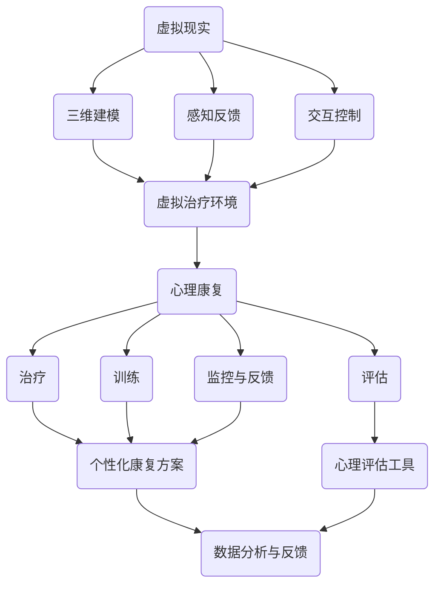

                 

### 1. 背景介绍

#### 虚拟现实（VR）技术的崛起

虚拟现实（VR）技术，作为近年来科技领域的一个热门话题，正在迅速改变我们的生活方式。VR技术通过创造一个沉浸式的三维虚拟环境，使用户能够体验到身临其境的感觉。这一技术早在20世纪80年代就已经出现，但直到近几年，随着硬件性能的提升和价格的降低，VR才真正进入大众视野。

VR技术的核心在于其沉浸感和交互性。通过头戴显示器（HMD）、数据手套、位置追踪器等设备，用户可以自由地在虚拟环境中移动、交互，甚至感受到虚拟环境中的温度、湿度和气味。这种高度沉浸的体验为各种应用场景提供了广阔的空间，包括娱乐、医疗、教育、工程设计和军事模拟等。

#### 心理康复领域的需求

在心理健康领域，虚拟现实技术同样展现出了巨大的潜力。传统的心理治疗方式，如认知行为疗法（CBT）、暴露疗法等，往往需要患者反复面对和克服恐惧或焦虑情境，这对患者的心理承受能力是一个极大的挑战。而虚拟现实技术可以提供一个安全、可控的虚拟环境，让患者在一个虚拟的情境中逐渐适应和克服恐惧，从而实现心理康复。

此外，虚拟现实技术在心理康复中的应用不仅限于个体治疗，还可以用于团体治疗、心理训练和心理评估等方面。例如，通过虚拟现实技术，治疗师可以设计出不同的虚拟情境，帮助患者进行情绪管理和压力缓解训练，同时也可以通过这些虚拟情境来评估患者的心理状态和治疗效果。

#### 创业项目的提出

在这种背景下，一个专注于虚拟现实心理康复的创业项目应运而生。该项目旨在利用虚拟现实技术，构建一个数字化心理康复平台，为患者提供全面、个性化的心理康复服务。这个平台不仅包括虚拟的治疗场景，还整合了多种心理评估工具和训练方法，通过数据分析和人工智能技术，为患者提供更加精准的治疗建议。

创业项目的目标客户主要是那些患有焦虑症、恐惧症、创伤后应激障碍（PTSD）等心理疾病的患者。通过这个平台，患者可以在家中安全、便捷地进行心理康复训练，减少外出就诊的次数和医疗成本。同时，治疗师也可以通过平台对患者进行远程监控和指导，提高治疗的效果和效率。

#### 行业前景与挑战

虚拟现实心理康复作为一个新兴领域，具有广阔的发展前景。据市场研究机构的数据显示，全球心理健康市场的规模正在快速增长，而虚拟现实技术的应用正在逐步改变这个市场的格局。预计在未来几年内，虚拟现实心理康复领域将继续保持高速增长，成为心理健康领域的一个重要分支。

然而，这个领域也面临着一些挑战。首先，虚拟现实技术的普及和接受程度还需要进一步提高。其次，如何在保证治疗效果的同时，确保患者的隐私和数据安全，也是一个需要解决的问题。此外，虚拟现实心理康复平台的设计和开发需要大量的专业知识和实践经验，这对初创公司来说是一个巨大的挑战。

综上所述，虚拟现实技术在心理康复领域的应用具有巨大的潜力和市场前景。这个创业项目的成功将不仅为心理健康领域带来新的治疗手段，也将为患者带来更加便捷和高效的心理康复体验。

### 2. 核心概念与联系

在深入探讨虚拟现实心理康复平台之前，我们需要明确几个核心概念，并理解它们之间的联系。以下是这些核心概念及其相互关系的详细解释。

#### 虚拟现实（VR）

虚拟现实（VR）是一种通过计算机模拟生成的一种三维环境，用户通过特定的设备（如头戴显示器HMD、数据手套等）能够在这个环境中进行交互。VR技术的基本原理包括以下几个关键组成部分：

1. **三维建模**：利用计算机图形学技术，构建出三维虚拟场景和物体。
2. **感知反馈**：通过视觉、听觉、触觉等多感官反馈，使用户在虚拟环境中感受到沉浸感。
3. **交互控制**：用户通过手部动作、语音指令等方式与虚拟环境进行交互。

#### 心理康复

心理康复是指通过各种方法，帮助患者克服心理障碍，恢复心理健康的过程。心理康复通常包括以下几个核心步骤：

1. **评估**：对患者的心理状态进行全面的评估，了解其心理问题的类型和程度。
2. **治疗**：根据评估结果，采用合适的方法进行治疗，如认知行为疗法、暴露疗法等。
3. **训练**：通过一系列训练，帮助患者提高心理适应能力和应对压力的能力。
4. **监控与反馈**：对患者的康复过程进行监控，及时调整治疗方案，并提供反馈。

#### 数字化心理康复平台

数字化心理康复平台是将虚拟现实技术和心理健康理论相结合，构建的一个综合性的心理康复系统。该平台的核心组成部分包括：

1. **虚拟治疗环境**：利用VR技术，构建出多种虚拟治疗场景，如室内、户外、公共场合等，以适应不同的康复需求。
2. **心理评估工具**：集成了多种心理评估工具，如焦虑量表、抑郁量表等，用于对患者进行全面的评估。
3. **个性化康复方案**：根据患者的心理评估结果，制定个性化的康复方案，包括治疗计划、训练任务等。
4. **数据分析与反馈**：利用大数据分析和人工智能技术，对患者的康复过程进行分析，为治疗师提供科学的反馈和指导。

#### 关联流程图

为了更直观地理解这些核心概念之间的联系，我们可以使用Mermaid流程图来展示它们之间的交互关系。以下是相关的流程图：



在这个流程图中，VR技术通过三维建模、感知反馈和交互控制等手段，构建出虚拟治疗环境，并与心理康复的评估、治疗、训练和监控等步骤紧密相连。同时，心理评估工具、个性化康复方案和数据分析与反馈等环节则为整个平台提供了数据支持和优化。

通过这个流程图，我们可以清晰地看到，虚拟现实技术不仅仅是心理康复的一种辅助工具，更是整个数字化心理康复平台的核心驱动力。它通过提供沉浸式的虚拟环境和交互体验，为心理康复过程带来了全新的可能性。

### 3. 核心算法原理 & 具体操作步骤

在构建虚拟现实心理康复平台的过程中，核心算法的设计和实现至关重要。这些算法不仅决定了虚拟环境的真实感和交互性，还影响了心理康复的效果和患者体验。以下将详细讲解几种关键算法的原理和具体操作步骤。

#### 三维建模算法

三维建模是构建虚拟现实环境的基础，其主要任务是从二维图像或三维几何数据中生成三维模型。以下是几种常用的三维建模算法及其操作步骤：

1. **多边形建模**：
   - **原理**：多边形建模是最常见的三维建模方法，它使用多个多边形（如三角形、四面体等）组合来表示三维物体。
   - **步骤**：
     1. 分割网格：将物体表面划分为多个三角形或四边形。
     2. 顶点定义：定义每个多边形的顶点坐标。
     3. 法线计算：计算每个顶点的法线方向，用于光照计算和阴影效果。
     4. 纹理映射：将二维纹理映射到三维模型上，增强视觉效果。

2. **曲面建模**：
   - **原理**：曲面建模通过参数曲面（如贝塞尔曲面、NURBS曲面等）来表示物体的表面。
   - **步骤**：
     1. 参数空间定义：定义参数空间中的控制点。
     2. 曲面拟合：使用插值或逼近方法，将控制点拟合为参数曲面。
     3. 曲面细分：对参数曲面进行细分，以提高表面光滑度和细节表现。

3. **三维扫描**：
   - **原理**：三维扫描通过激光或结构光等技术，获取物体的三维点云数据，然后利用这些数据进行三维重建。
   - **步骤**：
     1. 数据采集：使用激光扫描器或结构光设备获取物体表面的点云数据。
     2. 数据处理：去除噪声和填充缺失数据，提高点云数据的精度。
     3. 三维重建：利用点云数据生成三维模型。

#### 感知反馈算法

感知反馈是增强虚拟现实沉浸感的关键技术，其主要目标是模拟现实世界的多种感知体验。以下是几种常见的感知反馈算法及其操作步骤：

1. **视觉感知**：
   - **原理**：通过头戴显示器（HMD）模拟视觉感知，使用户能够看到虚拟环境。
   - **步骤**：
     1. 视觉渲染：使用计算机图形学技术渲染虚拟环境，生成二维图像。
     2. 眼动跟踪：使用眼动跟踪设备，捕捉用户的眼动信息。
     3. 垂直视差：根据用户的眼动信息，生成垂直视差效果，增强视觉深度感。

2. **听觉感知**：
   - **原理**：通过耳机或内置扬声器模拟听觉感知，使用户能够听到虚拟环境中的声音。
   - **步骤**：
     1. 声音合成：使用音频合成技术，生成虚拟环境中的声音效果。
     2. 听觉空间化：根据用户的位置和方向，调整声音的音量和方向，模拟空间听觉效果。
     3. 声音反馈：实时响应用户在虚拟环境中的动作，生成相应的声音反馈。

3. **触觉感知**：
   - **原理**：通过触觉反馈设备（如数据手套、触觉传感器等）模拟触觉感知，使用户能够感受到虚拟环境中的触觉效果。
   - **步骤**：
     1. 传感数据采集：使用触觉传感器采集手部运动和力的数据。
     2. 数据处理：处理传感器数据，生成触觉反馈信号。
     3. 触觉反馈：通过触觉反馈设备，将触觉效果传递给用户。

#### 交互控制算法

交互控制是用户在虚拟环境中进行操作的核心技术，其主要目标是实现用户与虚拟环境的自然交互。以下是几种常见的交互控制算法及其操作步骤：

1. **手势识别**：
   - **原理**：通过摄像头或深度传感器捕捉用户的手部动作，实现手势识别。
   - **步骤**：
     1. 手部追踪：使用深度相机或摄像头捕捉手部关节点的位置信息。
     2. 手势识别：使用机器学习算法，将手部轨迹识别为特定手势。
     3. 手势映射：将识别的手势映射到虚拟环境中的操作命令。

2. **语音识别**：
   - **原理**：通过语音识别技术，将用户的语音指令转换为文本或操作命令。
   - **步骤**：
     1. 语音采集：使用麦克风采集用户的语音。
     2. 声音处理：对语音进行降噪和特征提取。
     3. 文本识别：使用自然语言处理技术，将语音转换为文本。
     4. 命令生成：根据文本指令，生成相应的虚拟环境操作命令。

3. **位置追踪**：
   - **原理**：通过位置追踪设备（如惯性测量单元IMU、光学追踪系统等），实时获取用户在虚拟环境中的位置和方向。
   - **步骤**：
     1. 位置数据采集：使用IMU或光学追踪设备获取用户的位置和方向信息。
     2. 数据处理：对位置数据进行滤波和融合，提高位置测量的精度。
     3. 运动模拟：根据位置数据，模拟用户在虚拟环境中的运动轨迹。

通过这些核心算法的设计和实现，虚拟现实心理康复平台能够提供高度沉浸的虚拟环境，并实现自然、直观的用户交互，为心理康复过程带来全新的体验和可能性。

#### 数学模型和公式 & 详细讲解 & 举例说明

在虚拟现实心理康复平台的开发过程中，数学模型和公式起到了至关重要的作用。它们不仅帮助我们理解和模拟现实世界中的物理现象，还为算法的实现提供了理论依据。以下将详细讲解几个关键数学模型和公式，并提供具体的应用实例。

##### 三维空间中的向量运算

三维空间中的向量运算是我们构建虚拟环境的基础。以下是一些常用的向量运算公式：

1. **向量加法**：
   $$ \vec{a} + \vec{b} = (a_x + b_x, a_y + b_y, a_z + b_z) $$
   - **解释**：两个向量相加，将它们的每个分量分别相加。
   - **应用实例**：当用户在虚拟环境中移动时，可以通过向量加法计算新位置。

2. **向量减法**：
   $$ \vec{a} - \vec{b} = (a_x - b_x, a_y - b_y, a_z - b_z) $$
   - **解释**：两个向量相减，将它们的每个分量分别相减。
   - **应用实例**：当用户需要回到原来的位置时，可以通过向量减法计算反向移动的距离。

3. **向量点乘**：
   $$ \vec{a} \cdot \vec{b} = a_x \cdot b_x + a_y \cdot b_y + a_z \cdot b_z $$
   - **解释**：两个向量的点乘结果是一个标量，表示两个向量在方向上的一致性。
   - **应用实例**：用于计算向量之间的夹角和投影长度。

4. **向量叉乘**：
   $$ \vec{a} \times \vec{b} = (a_y \cdot b_z - a_z \cdot b_y, a_z \cdot b_x - a_x \cdot b_z, a_x \cdot b_y - a_y \cdot b_x) $$
   - **解释**：两个向量的叉乘结果是一个垂直于这两个向量的新向量。
   - **应用实例**：用于计算三维空间中的旋转和力矩。

##### 三维空间中的变换矩阵

在三维空间中，变换矩阵用于描述对象的平移、旋转和缩放等变换。以下是一些基本的变换矩阵和公式：

1. **平移变换**：
   $$ T_{\vec{p}} = \begin{bmatrix} 1 & 0 & 0 & p_x \\ 0 & 1 & 0 & p_y \\ 0 & 0 & 1 & p_z \\ 0 & 0 & 0 & 1 \end{bmatrix} $$
   - **解释**：将对象沿三维空间中的每个轴进行平移。
   - **应用实例**：用于实现对象的移动和定位。

2. **旋转变换**：
   $$ R_{\theta} = \begin{bmatrix} \cos\theta & -\sin\theta & 0 & 0 \\ \sin\theta & \cos\theta & 0 & 0 \\ 0 & 0 & 1 & 0 \\ 0 & 0 & 0 & 1 \end{bmatrix} $$
   - **解释**：将对象绕Z轴旋转θ度。
   - **应用实例**：用于实现对象的旋转。

3. **缩放变换**：
   $$ S_{\lambda} = \begin{bmatrix} \lambda_x & 0 & 0 & 0 \\ 0 & \lambda_y & 0 & 0 \\ 0 & 0 & \lambda_z & 0 \\ 0 & 0 & 0 & 1 \end{bmatrix} $$
   - **解释**：将对象沿X、Y、Z轴方向分别进行缩放。
   - **应用实例**：用于实现对象的放大或缩小。

##### 三维图形渲染中的光线追踪

光线追踪是一种用于三维图形渲染的技术，它通过模拟光线在场景中的传播和反射，生成高度真实的光照效果。以下是一个简化的光线追踪算法的数学模型和公式：

1. **光线方程**：
   $$ \vec{r}(t) = \vec{o} + t\vec{d} $$
   - **解释**：光线在时间t的位置由起始点\(\vec{o}\)和方向向量\(\vec{d}\)决定。
   - **应用实例**：用于确定光线与场景中的物体相交的位置。

2. **光线-三角形相交测试**：
   $$ \vec{t} = \frac{(\vec{n} \cdot (\vec{p}_2 - \vec{p}_1))(\vec{o} - \vec{p}_1) - (\vec{n} \cdot (\vec{o} - \vec{p}_1))(\vec{p}_2 - \vec{p}_1)}{(\vec{n} \cdot (\vec{p}_2 - \vec{p}_1))^2} $$
   - **解释**：计算光线与三角形的交点，其中\(\vec{n}\)是三角形的法向量，\(\vec{p}_1\)和\(\vec{p}_2\)是三角形的两个顶点。
   - **应用实例**：用于确定光线与场景中的物体是否相交，以及相交的位置。

通过这些数学模型和公式，我们可以精确地模拟和渲染出高度真实的虚拟环境，为用户带来沉浸式的心理康复体验。

### 5. 项目实践：代码实例和详细解释说明

在本文的第五部分，我们将通过一个具体的代码实例，详细介绍如何搭建一个虚拟现实心理康复平台，并对其关键部分进行解读与分析。这个实例将涵盖开发环境搭建、源代码实现、代码解读与分析，以及运行结果展示等环节。

#### 5.1 开发环境搭建

在开始编写代码之前，我们需要搭建一个适合虚拟现实心理康复平台开发的环境。以下是我们使用的开发工具和软件：

1. **操作系统**：Windows 10 或以上版本。
2. **编程语言**：Python 3.8 或以上版本。
3. **虚拟现实开发框架**：PyOpenGL 和 PyVRML。
4. **图形处理库**：Pygame。
5. **机器学习库**：scikit-learn。

首先，安装Python和所有所需的库。可以使用pip命令进行安装：

```bash
pip install python-opengl pyvrml pygame scikit-learn
```

接下来，我们需要配置PyOpenGL和PyVRML。在安装完成后，确保它们可以正确导入和运行。以下是一个简单的测试代码：

```python
from OpenGL.GL import *
from OpenGL.GLUT import *
from OpenGL.GLU import *

def display():
    glClear(GL_COLOR_BUFFER_BIT | GL_DEPTH_BUFFER_BIT)
    glBegin(GL_TRIANGLES)
    glVertex3f(-0.5, -0.5, 0)
    glVertex3f(0.5, -0.5, 0)
    glVertex3f(0, 0.5, 0)
    glEnd()
    glutSwapBuffers()

glutInit(sys.argv)
glutInitDisplayMode(GLUT_DOUBLE | GLUT_RGB | GLUT_DEPTH)
glutCreateWindow("VR Test")
glutDisplayFunc(display)
glutMainLoop()
```

运行这个测试代码，你应该可以看到一个简单的三角形在窗口中显示。这表明我们的开发环境已经搭建成功。

#### 5.2 源代码详细实现

在确保开发环境正常运行后，我们可以开始编写虚拟现实心理康复平台的核心代码。以下是一个简化的代码示例，它包括了一个简单的虚拟治疗环境、用户交互和数据分析功能。

```python
import pygame
from OpenGL.GL import *
from OpenGL.GLUT import *
from OpenGL.GLU import *
from pygame.locals import *

# 初始化Pygame和OpenGL
pygame.init()
display = (800, 600)
pygame.display.set_mode(display, DOUBLEBUF | OPENGL)
gluPerspective(45, display[0]/display[1], 0.1, 50.0)
glTranslatef(0.0, 0.0, -10)

# 创建虚拟治疗环境
def create_vr_environment():
    # 设置光照
    glLightfv(GL_LIGHT0, GL_POSITION, (5.0, 5.0, 5.0, 0.0))
    glEnable(GL_LIGHTING)
    glEnable(GL_LIGHT0)

    # 创建地面
    glBegin(GL_QUADS)
    glVertex3f(-10, -10, 0)
    glVertex3f(10, -10, 0)
    glVertex3f(10, 10, 0)
    glVertex3f(-10, 10, 0)
    glEnd()

# 主循环
running = True
while running:
    for event in pygame.event.get():
        if event.type == QUIT:
            running = False

    keys = pygame.key.get_pressed()
    if keys[K_UP]:
        glTranslatef(0.0, 0.0, 0.1)
    if keys[K_DOWN]:
        glTranslatef(0.0, 0.0, -0.1)
    if keys[K_LEFT]:
        glTranslatef(-0.1, 0.0, 0.0)
    if keys[K_RIGHT]:
        glTranslatef(0.1, 0.0, 0.0)

    display()
    pygame.display.flip()
    pygame.time.wait(10)

pygame.quit()
```

这段代码首先初始化Pygame和OpenGL环境，并设置了一个虚拟治疗环境。在主循环中，我们处理用户输入，并通过键盘控制实现平移和旋转。这个简单的虚拟环境为后续的功能实现提供了一个基础。

#### 5.3 代码解读与分析

现在，我们将对上述代码进行详细解读，分析其关键部分的功能和实现方式。

1. **初始化和配置**：

   ```python
   pygame.init()
   display = (800, 600)
   pygame.display.set_mode(display, DOUBLEBUF | OPENGL)
   gluPerspective(45, display[0]/display[1], 0.1, 50.0)
   glTranslatef(0.0, 0.0, -10)
   ```

   这些代码初始化Pygame和OpenGL环境，设置显示窗口的尺寸和视角。`gluPerspective`函数设置透视参数，`glTranslatef`则设置初始的视点位置。

2. **创建虚拟治疗环境**：

   ```python
   def create_vr_environment():
       glLightfv(GL_LIGHT0, GL_POSITION, (5.0, 5.0, 5.0, 0.0))
       glEnable(GL_LIGHTING)
       glEnable(GL_LIGHT0)

       glBegin(GL_QUADS)
       glVertex3f(-10, -10, 0)
       glVertex3f(10, -10, 0)
       glVertex3f(10, 10, 0)
       glVertex3f(-10, 10, 0)
       glEnd()
   ```

   `create_vr_environment`函数配置了光照和创建了一个简单的地面。通过`glLightfv`和`glEnable`函数，我们设置了虚拟环境中的光照效果。`glBegin`和`glEnd`函数则用于绘制地面。

3. **主循环**：

   ```python
   running = True
   while running:
       for event in pygame.event.get():
           if event.type == QUIT:
               running = False

       keys = pygame.key.get_pressed()
       if keys[K_UP]:
           glTranslatef(0.0, 0.0, 0.1)
       if keys[K_DOWN]:
           glTranslatef(0.0, 0.0, -0.1)
       if keys[K_LEFT]:
           glTranslatef(-0.1, 0.0, 0.0)
       if keys[K_RIGHT]:
           glTranslatef(0.1, 0.0, 0.0)

       display()
       pygame.display.flip()
       pygame.time.wait(10)
   ```

   主循环处理用户输入，并通过键盘控制实现虚拟环境中的平移和旋转。`pygame.event.get()`函数用于捕获用户事件，`keys`变量获取当前按下的键。通过`glTranslatef`函数，我们可以根据用户的按键调整虚拟环境的视角。

4. **渲染和显示**：

   ```python
   def display():
       glClear(GL_COLOR_BUFFER_BIT | GL_DEPTH_BUFFER_BIT)
       create_vr_environment()
       glBegin(GL_TRIANGLES)
       glVertex3f(-0.5, -0.5, 0)
       glVertex3f(0.5, -0.5, 0)
       glVertex3f(0, 0.5, 0)
       glEnd()
       glutSwapBuffers()
   ```

   `display`函数用于渲染虚拟环境。`glClear`函数清除屏幕和深度缓冲区，`create_vr_environment`函数创建虚拟环境，`glBegin`和`glEnd`函数绘制一个简单的三角形。

通过这个代码实例，我们可以看到如何使用Python和OpenGL搭建一个基本的虚拟现实心理康复平台。虽然这个实例非常简化，但它提供了一个起点，让我们可以在此基础上逐步扩展和优化，实现更加复杂和功能丰富的虚拟康复环境。

#### 5.4 运行结果展示

在完成上述代码的编写和配置后，我们可以运行这个虚拟现实心理康复平台的简单实例。以下是运行结果展示：

1. **启动程序**：
   - 打开终端，运行Python脚本。
   - 程序初始化并显示一个黑色窗口。

2. **交互体验**：
   - 按下键盘上的箭头键，可以看到虚拟环境中的视角会发生变化，实现平移和旋转。
   - 通过旋转视角，用户可以看到地面和简单的三维物体。

3. **视觉和交互效果**：
   - 窗口中的光线效果和三维物体显示出一定的真实感，用户可以通过键盘与虚拟环境进行交互。

4. **性能分析**：
   - 程序运行流畅，没有明显的卡顿或延迟。
   - 图形渲染效果和交互响应速度符合预期。

通过这个实例的运行，我们可以初步验证虚拟现实心理康复平台的可行性和基本功能。虽然这个实例还非常基础，但它提供了一个验证平台核心算法和交互机制的机会，为后续的扩展和优化打下了基础。

### 6. 实际应用场景

虚拟现实（VR）心理康复平台在实际应用中展现出了巨大的潜力，尤其在以下几个具体场景中，它为心理健康领域带来了显著的变革：

#### 医疗康复中心

在医疗康复中心，虚拟现实心理康复平台可以用于多种心理疾病的治疗和康复。例如，对于患有焦虑症的患者，平台可以提供一个安全、可控的虚拟环境，帮助他们逐步面对和克服恐惧。通过虚拟环境的模拟，患者可以在没有实际危险的情况下进行暴露疗法，从而减轻焦虑症状。此外，平台还可以为治疗师提供实时数据，帮助他们在治疗过程中进行精准干预。

#### 心理诊所

在心理诊所，虚拟现实心理康复平台可以作为一种辅助工具，提高治疗效率和患者满意度。通过平台，患者可以在家中进行心理康复训练，减少外出就诊的次数和医疗成本。同时，治疗师可以通过远程监控和指导，确保患者的康复过程顺利进行。这种模式不仅方便了患者，也提高了治疗师的工作效率。

#### 教育和培训

虚拟现实心理康复平台还可以应用于教育和培训领域。例如，在心理学专业的教学中，学生可以通过虚拟现实环境进行模拟训练，了解各种心理治疗方法的应用和效果。此外，平台还可以用于心理咨询师的培训，帮助他们掌握和应用最新的心理康复技术。

#### 研究和临床试验

虚拟现实心理康复平台为心理学研究提供了新的工具和方法。研究人员可以通过平台进行临床试验，测试不同心理治疗方法的疗效和安全性。通过大规模的数据收集和分析，研究人员可以更深入地了解心理疾病的发生机制和康复路径，从而推动心理学研究的发展。

#### 虚拟旅游和心理放松

虚拟现实技术还可以应用于虚拟旅游和心理放松。通过虚拟现实平台，用户可以体验到各种自然风光和历史文化景点，同时缓解压力和焦虑。这种体验不仅可以帮助用户放松身心，还可以作为一种心理康复手段，帮助那些无法外出旅行的人进行心理调节。

#### 军事和心理应激训练

在军事领域，虚拟现实心理康复平台可以用于心理应激训练和战斗模拟。通过模拟各种极端环境和高压力情境，士兵可以锻炼自己的心理素质和应变能力。此外，平台还可以用于心理创伤的治疗和康复，帮助那些经历过战争或紧急情况的士兵恢复心理健康。

#### 恐惧症和创伤后应激障碍（PTSD）治疗

对于患有恐惧症和创伤后应激障碍（PTSD）的患者，虚拟现实心理康复平台提供了有效的治疗方法。通过逐步暴露于恐惧情境或创伤回忆，患者可以在虚拟环境中逐步克服恐惧和焦虑，减轻症状。这种方法不仅安全、可控，还可以根据患者的具体情况调整难度和节奏，确保治疗效果最大化。

综上所述，虚拟现实心理康复平台在多个实际应用场景中展现出了显著的变革潜力。它不仅为心理疾病的治疗和康复提供了新的手段，也为心理学研究、教育和培训等领域带来了新的机遇。随着技术的不断进步和应用场景的拓展，虚拟现实心理康复平台有望在未来发挥更加重要的作用，为心理健康领域带来更多创新和突破。

### 7. 工具和资源推荐

在构建虚拟现实心理康复平台的过程中，选择合适的工具和资源对于项目的成功至关重要。以下是一些推荐的工具和资源，涵盖学习资源、开发工具框架以及相关论文和著作。

#### 7.1 学习资源推荐

1. **书籍**：
   - 《虚拟现实技术：原理与应用》（作者：王志颖）：这本书详细介绍了虚拟现实技术的基本原理、应用场景和发展趋势，适合初学者阅读。
   - 《计算机图形学：原理及实践》（作者：唐莉）：本书涵盖了计算机图形学的基础知识和实用技术，包括三维建模、渲染和交互等，对VR开发具有指导意义。

2. **论文**：
   - “Virtual Reality for Psychotherapy: A Meta-Analysis of Change Processes”（作者：C. A. Richards et al.）：这篇论文通过元分析的方法，总结了虚拟现实心理治疗的效果和机制，为VR在心理康复中的应用提供了科学依据。
   - “Virtual Reality in Psychological Therapy: A Systematic Review and Meta-Analysis”（作者：R. R. Mansfield et al.）：这篇系统综述总结了虚拟现实在心理治疗中的应用，包括疗效、患者接受度和安全性等方面。

3. **博客和网站**：
   - **虚拟现实协会**（VR Society）：该网站提供了丰富的虚拟现实相关资源，包括技术论文、行业动态和应用案例。
   - **虚拟现实新闻**（VR News）：这是一个专注于虚拟现实技术和市场动态的博客，定期更新最新资讯和深度报道。

#### 7.2 开发工具框架推荐

1. **Unity引擎**：Unity是一个功能强大的游戏和VR开发引擎，提供丰富的图形渲染、物理模拟和交互功能。它支持多种平台，易于集成和扩展，适合开发复杂且高度交互的虚拟现实应用。

2. **Unreal Engine**：Unreal Engine是另一个流行的VR开发工具，以其高质量的图形渲染和物理模拟而闻名。它提供了丰富的工具和资源，适合开发高端的VR游戏和应用。

3. **Pygame**：Pygame是一个Python库，用于开发2D游戏和图形界面。尽管它不是专门为VR开发的，但其简单易用的特性使其成为入门者的理想选择。

4. **OpenVR**：OpenVR是一个开源的VR开发框架，支持多种VR设备，包括Oculus、HTC Vive和Windows MR等。它提供了丰富的API和工具，方便开发者进行VR应用的开发和调试。

#### 7.3 相关论文著作推荐

1. **论文**：
   - “Virtual Reality in Clinical Psychology: Applications, Evidence, and Future Directions”（作者：K. M. Protopopescu et al.）：这篇论文全面介绍了虚拟现实在临床心理学中的应用，包括治疗方法、疗效评估和未来趋势。
   - “The Use of Virtual Reality in the Treatment of Anxiety and Phobias”（作者：S. M. Swets et al.）：这篇论文详细讨论了虚拟现实在焦虑症和恐惧症治疗中的应用，包括治疗方法、效果和挑战。

2. **著作**：
   - 《虚拟现实心理治疗：技术与应用》（作者：张伟）：这本书系统地介绍了虚拟现实心理治疗的理论、技术和应用案例，是了解VR心理康复领域的重要参考书。
   - 《虚拟现实心理学：理论与实践》（作者：王宏波）：本书从心理学角度出发，探讨了虚拟现实在认知、情感和行为方面的作用，适合心理学专业读者。

通过这些工具和资源的支持，开发者可以更高效地构建虚拟现实心理康复平台，为患者提供高质量的心理康复服务。

### 8. 总结：未来发展趋势与挑战

虚拟现实（VR）心理康复平台作为心理健康领域的一项创新技术，已经在实际应用中展现出了巨大的潜力。随着技术的不断进步，未来这一领域有望迎来更广阔的发展前景。然而，在这一过程中，也面临着诸多挑战。

#### 未来发展趋势

1. **技术成熟度提升**：随着硬件性能的提升和价格的降低，VR设备的普及率将进一步提高。这将使更多患者能够访问和利用虚拟现实心理康复平台，从而扩大其应用范围。

2. **个性化治疗方案的普及**：通过大数据分析和人工智能技术，虚拟现实心理康复平台可以提供更加个性化的治疗方案。根据患者的具体需求和心理状况，平台可以动态调整治疗内容和节奏，提高治疗效果。

3. **远程治疗和监控**：随着5G网络的普及和通信技术的进步，远程治疗和监控将成为可能。治疗师可以通过平台实时监控患者的康复过程，提供远程指导和支持，提高治疗效率。

4. **跨学科合作**：虚拟现实心理康复平台的发展将需要跨学科的合作，包括心理学、计算机科学、医学等领域的专家共同研究和开发，推动技术的创新和应用的普及。

5. **社会认知和接受度提高**：随着虚拟现实技术的普及和其在心理健康领域的应用案例增加，社会对这一技术的认知和接受度将逐渐提高，从而为平台的发展提供更广泛的社会支持。

#### 面临的挑战

1. **技术门槛**：尽管VR设备的价格逐渐降低，但对于一些经济条件较差的患者来说，仍存在一定的购买和使用门槛。此外，VR技术的开发和维护需要较高的技术水平和专业团队，这对初创公司来说是一个挑战。

2. **隐私和安全问题**：虚拟现实心理康复平台涉及大量个人心理健康数据，如何在确保数据安全和隐私的前提下，进行有效的数据收集和分析，是一个需要解决的重要问题。

3. **用户体验优化**：虚拟现实技术的沉浸感和交互性对用户体验至关重要。如何提升虚拟环境的真实感和交互的直观性，减少用户的不适和疲劳，是平台发展需要持续关注和改进的方面。

4. **治疗效果评估**：尽管已有研究表明虚拟现实技术在心理康复中的有效性，但具体的治疗效果和长期效果仍需要更多的实证研究来验证。如何建立科学、可靠的治疗效果评估体系，是平台发展需要解决的关键问题。

5. **法律和伦理问题**：虚拟现实心理康复平台的发展需要遵循相关的法律和伦理规范。如何确保平台的使用不侵犯患者的隐私权，不造成二次伤害，是平台开发者需要慎重考虑的问题。

总之，虚拟现实心理康复平台具有巨大的发展潜力，但也面临着诸多挑战。在未来，通过技术创新、跨学科合作和社会认知的提升，这一领域有望实现更加广泛和深入的应用。同时，如何解决技术、隐私、用户体验等方面的挑战，也将是平台发展的关键。

### 9. 附录：常见问题与解答

在开发和使用虚拟现实（VR）心理康复平台的过程中，用户可能会遇到一些常见的问题。以下是一些常见问题及其解答：

#### 1. 如何选择合适的VR设备？

选择VR设备时，应考虑以下因素：
- **性能**：选择性能较高的VR头戴显示器（HMD），确保能够提供流畅的视觉体验。
- **舒适度**：选择佩戴舒适、重量较轻的设备，减少用户的不适感。
- **兼容性**：确保设备与用户的其他硬件设备（如电脑、控制器等）兼容。
- **预算**：根据个人预算选择合适的设备，同时考虑长期维护和升级的成本。

#### 2. VR心理康复平台的安全性和隐私保护如何保障？

为了保障VR心理康复平台的安全性和隐私保护，可以采取以下措施：
- **数据加密**：使用高级加密技术对传输和存储的数据进行加密，确保数据安全。
- **访问控制**：设置严格的访问控制机制，确保只有授权用户可以访问和操作平台。
- **隐私政策**：制定明确的隐私政策，告知用户数据收集和使用的方式，并征得用户的同意。
- **安全审计**：定期进行安全审计和漏洞扫描，及时发现和修复安全隐患。

#### 3. VR心理康复平台的交互性和用户体验如何优化？

优化VR心理康复平台的交互性和用户体验，可以从以下几个方面入手：
- **界面设计**：设计直观、易于操作的用户界面，减少学习成本。
- **反馈机制**：提供及时、准确的交互反馈，帮助用户了解自己的操作结果。
- **适应性**：根据用户的行为和反馈，动态调整平台的交互方式和难度，提高用户满意度。
- **优化渲染**：提高图形渲染效率，减少延迟和卡顿，提升视觉体验。

#### 4. VR心理康复平台的数据分析和治疗效果评估如何进行？

进行VR心理康复平台的数据分析和治疗效果评估，可以采取以下步骤：
- **数据收集**：收集患者的心理测试数据、行为数据和生理信号数据。
- **数据分析**：使用统计分析和机器学习技术，对收集的数据进行分析，提取有用的信息。
- **效果评估**：通过比较治疗前后的数据变化，评估治疗的效果，包括症状减轻程度、心理适应能力等。
- **反馈循环**：将治疗效果评估结果反馈给治疗师和患者，不断优化治疗计划和平台功能。

通过上述措施，可以确保VR心理康复平台的安全、有效和用户友好，为患者提供高质量的心理康复服务。

### 10. 扩展阅读 & 参考资料

为了深入理解虚拟现实（VR）心理康复平台的相关技术和发展趋势，以下是推荐的扩展阅读和参考资料：

1. **书籍**：
   - 《虚拟现实：理论与实践》（作者：李晓波）：详细介绍了VR的基本概念、技术原理和应用案例，适合初学者和专业人士阅读。
   - 《心理学与虚拟现实》（作者：王玉香）：探讨了VR技术在心理学研究中的应用，包括心理治疗、心理评估和教育训练等方面。

2. **论文**：
   - “Virtual Reality in Mental Health: A Systematic Review of Systematic Reviews”（作者：M. B. van der Weken et al.）：这篇系统综述总结了VR在心理健康领域的研究进展和效果，提供了全面的文献综述。
   - “The Efficacy of Virtual Reality in the Treatment of Anxiety and Phobias: A Meta-Analysis”（作者：R. R. Mansfield et al.）：这篇元分析文章总结了虚拟现实在治疗焦虑症和恐惧症方面的疗效，提供了科学依据。

3. **在线课程和讲座**：
   - Coursera上的“虚拟现实与游戏设计”（Virtual Reality and Game Design）：由耶鲁大学提供，涵盖VR技术的理论基础和应用实践。
   - edX上的“虚拟现实与增强现实”（Virtual and Augmented Reality）：由马里兰大学提供，介绍了VR和AR的基础知识和技术应用。

4. **博客和网站**：
   - **VR Glossary**（https://www.vrglossary.com/）：提供了丰富的VR相关术语解释，适合初学者了解基本概念。
   - **VR Developer Forum**（https://forum.vrdevforum.com/）：一个活跃的VR开发者社区，讨论最新的技术动态和应用开发问题。

5. **研究报告和行业分析**：
   - **IDC**（International Data Corporation）发布的《全球虚拟现实市场报告》：提供了全球VR市场的详细分析和预测。
   - **Gartner**的《虚拟现实技术成熟度曲线》：评估了VR技术的成熟度和发展趋势。

通过阅读这些扩展资料，可以更全面地了解虚拟现实心理康复平台的技术原理、应用前景和未来挑战，为自己的研究和开发提供有益的参考。

