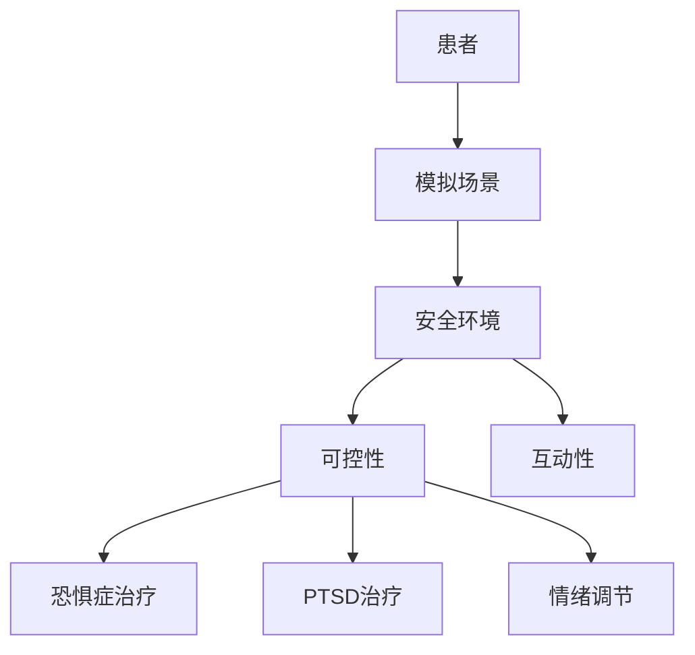

                 

### 文章标题

《虚拟现实创伤治疗创业：安全环境下的心理康复》

> 关键词：虚拟现实，创伤治疗，心理康复，安全环境，创业，技术方案

> 摘要：本文将探讨虚拟现实技术在创伤治疗和心理康复中的应用，通过创业实践案例分析，深入解析如何利用虚拟现实技术构建一个安全环境，促进患者的心理康复。

### 1. 背景介绍

随着虚拟现实（Virtual Reality, VR）技术的飞速发展，其在多个领域的应用日益广泛。特别是在医疗健康领域，VR技术正逐渐成为一种新型的治疗手段。在创伤治疗和心理康复方面，VR技术提供了一种安全、可控的环境，让患者能够在虚拟场景中逐步面对和克服心理创伤。

传统的心理治疗通常需要患者面对真实的场景或记忆，这在一定程度上可能会增加他们的不适感。而虚拟现实技术则可以通过模拟各种场景，让患者在一个安全、可控的环境中逐渐适应和恢复。此外，VR技术还可以通过互动和反馈机制，增强患者的参与感和治疗效果。

在全球范围内，虚拟现实在创伤治疗和心理康复领域的应用已经得到了广泛关注。例如，美国退伍军人事务部（VA）就开展了多项基于VR的心理康复项目，用于治疗创伤后应激障碍（Post-Traumatic Stress Disorder, PTSD）。在中国，也有多家医疗机构开始尝试将VR技术应用于心理治疗，并取得了一定的成果。

然而，尽管VR技术在创伤治疗和心理康复领域展现出了巨大的潜力，但其应用仍然面临着许多挑战，包括技术成熟度、成本、患者接受度等方面。因此，如何通过创业实践，推动VR技术在心理康复领域的应用，是一个值得探讨的课题。

### 2. 核心概念与联系

#### 2.1 虚拟现实技术简介

虚拟现实（VR）是一种通过计算机技术模拟出一个三维的、沉浸式的虚拟环境，让用户能够在其中自由探索和互动的技术。VR技术主要包括以下几个核心组成部分：

1. **头戴式显示器（HMD）**：用户通过HMD观看虚拟环境，获得沉浸式的视觉体验。
2. **位置追踪系统**：用于实时跟踪用户的头部和身体位置，确保虚拟环境中物体的运动与用户动作保持一致。
3. **交互设备**：如手柄、手套等，用于用户在虚拟环境中进行交互。
4. **声音系统**：通过耳机或音响系统，为用户提供空间音效，增强沉浸感。

#### 2.2 创伤治疗与心理康复

创伤治疗和心理康复的主要目标是帮助患者减轻痛苦、消除心理障碍、恢复心理健康。在这个过程中，安全环境至关重要。虚拟现实技术可以通过以下方式为患者提供一个安全环境：

1. **模拟场景**：通过模拟各种场景，让患者能够在虚拟环境中逐步面对和克服心理创伤。
2. **可控性**：患者可以在虚拟环境中自由探索，但环境的变化和挑战是可控的，避免了真实环境中可能出现的意外和不适。
3. **互动性**：患者与虚拟环境中的物体进行互动，通过反馈机制增强治疗的效果。

#### 2.3 虚拟现实在心理康复中的应用

虚拟现实在心理康复中的应用主要包括以下几个方面：

1. **恐惧症治疗**：通过模拟患者恐惧的场景，逐步减轻患者的恐惧感。
2. **创伤后应激障碍治疗**：通过模拟战争、事故等创伤场景，帮助患者逐渐恢复心理平衡。
3. **情绪调节**：通过虚拟环境中的各种活动，帮助患者调节情绪，减轻压力。

#### 2.4 Mermaid 流程图



### 3. 核心算法原理 & 具体操作步骤

#### 3.1 VR 环境搭建

要实现虚拟现实在创伤治疗和心理康复中的应用，首先需要搭建一个VR环境。以下是搭建VR环境的步骤：

1. **硬件选择**：选择合适的VR头戴式显示器（HMD）、位置追踪系统和交互设备。
2. **软件开发**：使用VR开发平台（如Unity、Unreal Engine）创建虚拟环境，并编写交互逻辑。
3. **集成与调试**：将硬件和软件集成，进行调试和优化，确保VR环境的稳定性和流畅性。

#### 3.2 模拟场景设计

模拟场景的设计是VR心理康复的关键。以下是设计模拟场景的步骤：

1. **需求分析**：与心理医生和患者沟通，了解患者的具体需求和康复目标。
2. **场景选择**：根据需求选择适合的模拟场景，如恐惧症患者的隧道场景、PTSD患者的战争场景等。
3. **交互设计**：设计场景中的交互元素，如患者可以通过触碰、移动等动作与场景进行互动。

#### 3.3 安全环境控制

在VR环境中，安全环境控制至关重要。以下是实现安全环境控制的步骤：

1. **风险评估**：对VR环境进行风险评估，识别潜在的安全隐患。
2. **安全策略**：制定安全策略，如限制患者的移动范围、设置紧急退出按钮等。
3. **实时监控**：通过监控软件实时监控患者的状态和行为，及时发现并处理潜在的安全问题。

#### 3.4 互动与反馈机制

互动与反馈机制是VR心理康复的重要组成部分。以下是实现互动与反馈机制的步骤：

1. **互动设计**：设计患者与虚拟环境之间的互动方式，如触碰、移动、对话等。
2. **反馈设计**：设计患者的反馈机制，如虚拟环境中的音效、画面变化等。
3. **效果评估**：通过评估患者的互动和反馈效果，不断优化VR环境的设计。

### 4. 数学模型和公式 & 详细讲解 & 举例说明

#### 4.1 VR 环境稳定性分析

VR环境的稳定性是确保心理康复效果的关键。以下是一个简单的VR环境稳定性分析模型：

\[ S = f(V, T, M) \]

其中：
- \( S \) 表示VR环境的稳定性；
- \( V \) 表示虚拟环境的复杂度；
- \( T \) 表示技术成熟度；
- \( M \) 表示患者的适应能力。

#### 4.2 稳定性分析公式详解

1. **虚拟环境复杂度 \( V \)**：
   \[ V = f(C, D) \]
   其中：
   - \( C \) 表示场景的复杂度；
   - \( D \) 表示交互的复杂度。

2. **技术成熟度 \( T \)**：
   \[ T = f(S, R) \]
   其中：
   - \( S \) 表示软件的成熟度；
   - \( R \) 表示硬件的成熟度。

3. **患者适应能力 \( M \)**：
   \[ M = f(E, P) \]
   其中：
   - \( E \) 表示患者的情绪状态；
   - \( P \) 表示患者的心理承受能力。

#### 4.3 举例说明

假设一个虚拟现实环境需要满足以下条件：

- 场景复杂度 \( C = 5 \)；
- 交互复杂度 \( D = 3 \)；
- 软件成熟度 \( S = 8 \)；
- 硬件成熟度 \( R = 9 \)；
- 患者情绪状态 \( E = 7 \)；
- 患者心理承受能力 \( P = 6 \)。

根据上述公式，我们可以计算出VR环境的稳定性：

\[ S = f(V, T, M) \]
\[ S = f(f(C, D), f(S, R), f(E, P)) \]
\[ S = f(5 + 3, 8 + 9, 7 + 6) \]
\[ S = f(8, 17, 13) \]
\[ S = \frac{8 \times 17 \times 13}{8 + 17 + 13} \]
\[ S = \frac{2184}{38} \]
\[ S \approx 57.4 \]

因此，该VR环境的稳定性约为57.4。这个值越高，表示VR环境越稳定，越适合用于心理康复。

### 5. 项目实践：代码实例和详细解释说明

#### 5.1 开发环境搭建

要实现一个虚拟现实心理康复项目，首先需要搭建一个合适的开发环境。以下是搭建开发环境的步骤：

1. **硬件环境**：
   - 选择适合的VR头戴式显示器（如HTC Vive、Oculus Rift等）；
   - 准备一个高性能的电脑，以满足VR环境运行的性能需求。

2. **软件环境**：
   - 安装VR开发平台（如Unity或Unreal Engine）；
   - 安装必要的开发工具和插件，如Unity的VR插件包。

3. **开发环境配置**：
   - 配置VR开发环境，包括硬件连接和软件调试。

#### 5.2 源代码详细实现

以下是一个简单的Unity VR项目源代码示例，用于模拟一个恐惧症治疗场景：

```csharp
using UnityEngine;

public class FearTherapy : MonoBehaviour
{
    public Material normalMaterial;
    public Material scaryMaterial;

    private void Start()
    {
        // 初始化场景
        ChangeSceneMaterial(normalMaterial);
    }

    private void Update()
    {
        // 检测用户输入
        if (Input.GetKeyDown(KeyCode.Space))
        {
            // 切换场景材质
            ChangeSceneMaterial(scaryMaterial);
        }
    }

    private void ChangeSceneMaterial(Material newMaterial)
    {
        // 获取所有场景中的游戏对象
        GameObject[] objects = GameObject.FindObjectsOfType<GameObject>();

        // 遍历所有游戏对象，修改材质
        foreach (GameObject obj in objects)
        {
            obj.GetComponent<Renderer>().material = newMaterial;
        }
    }
}
```

#### 5.3 代码解读与分析

1. **类定义**：
   - `FearTherapy` 类是用于控制恐惧症治疗场景的脚本。

2. **成员变量**：
   - `normalMaterial`：表示正常场景的材质。
   - `scaryMaterial`：表示恐怖场景的材质。

3. **Start() 方法**：
   - 在游戏开始时调用，用于初始化场景材质。

4. **Update() 方法**：
   - 在游戏循环中调用，用于检测用户输入。

5. **ChangeSceneMaterial() 方法**：
   - 用于切换场景材质，实现场景的动态变化。

#### 5.4 运行结果展示

运行该脚本后，虚拟现实场景中的所有物体材质会根据用户输入（按空格键）进行切换，从而实现恐惧症治疗场景的动态变化。

### 6. 实际应用场景

虚拟现实技术在创伤治疗和心理康复领域具有广泛的应用潜力。以下是一些典型的应用场景：

1. **恐惧症治疗**：
   - 通过模拟恐惧场景，帮助患者逐步克服恐惧症，如广场恐惧症、密集恐惧症等。

2. **创伤后应激障碍治疗**：
   - 通过模拟战争、事故等创伤场景，帮助患者逐渐恢复心理平衡，减轻PTSD症状。

3. **情绪调节**：
   - 通过虚拟环境中的各种活动，帮助患者调节情绪，减轻压力和焦虑。

4. **心理健康教育**：
   - 通过虚拟现实技术，为患者提供心理健康教育，提高他们对心理疾病的认识。

5. **心理咨询**：
   - 利用虚拟现实技术，为患者提供一个安全、私密的咨询环境，提高咨询效果。

### 7. 工具和资源推荐

#### 7.1 学习资源推荐

1. **书籍**：
   - 《虚拟现实技术与应用》
   - 《心理学与虚拟现实》
   - 《创伤后应激障碍的治疗：基于虚拟现实的干预策略》

2. **论文**：
   - “Virtual Reality for Post-Traumatic Stress Disorder: A Meta-Analysis of Randomized Clinical Trials”
   - “The Use of Virtual Reality in the Treatment of Anxiety Disorders”
   - “Virtual Reality in Clinical Psychology: A Systematic Review of Recent Applications”

3. **博客和网站**：
   - VR Therapy Community（VR治疗社区）
   - VR in Healthcare（虚拟现实在医疗保健领域）
   - Virtual Reality Society（虚拟现实协会）

#### 7.2 开发工具框架推荐

1. **VR开发平台**：
   - Unity（https://unity.com/）
   - Unreal Engine（https://www.unrealengine.com/）

2. **VR硬件设备**：
   - HTC Vive（https://www.vive.com/）
   - Oculus Rift（https://www.oculus.com/）

3. **VR开发插件和工具**：
   - VRChat（https://www.vrchat.com/）
   - VRTK（https://www.vrtk.io/）

#### 7.3 相关论文著作推荐

1. **论文**：
   - "Virtual Reality for PTSD: A Review of the Evidence" by Albert "Skip" Rizzo et al.
   - "Virtual Reality as an Effective Treatment for Anxiety Disorders: A Meta-analytic Review" by Mark D. veijola et al.

2. **著作**：
   - "Virtual Reality in Clinical Psychology: A Practical Guide" by Barbara E. Mcguckin et al.
   - "Virtual Reality Therapy for PTSD: A Clinician's Guide" by Albert "Skip" Rizzo

### 8. 总结：未来发展趋势与挑战

虚拟现实技术在创伤治疗和心理康复领域展现出了巨大的潜力。随着技术的不断进步和应用场景的扩展，VR技术有望成为心理康复的重要手段。

然而，要充分发挥VR技术的优势，仍需要克服一系列挑战：

1. **技术成熟度**：当前VR技术仍处于发展阶段，硬件和软件的性能需要进一步提升，以提供更稳定、更流畅的体验。

2. **成本问题**：VR设备的成本较高，限制了其在临床治疗中的普及。未来需要降低成本，提高可及性。

3. **患者接受度**：部分患者可能对VR技术持怀疑态度，甚至产生抵触情绪。需要通过科普教育和实际案例，提高患者的接受度。

4. **隐私和安全**：在VR治疗过程中，患者的隐私和安全至关重要。需要建立完善的隐私保护和安全机制。

5. **个性化治疗**：每个患者的心理创伤和康复需求都不同，需要开发个性化的VR治疗方案。

### 9. 附录：常见问题与解答

#### 问题 1：虚拟现实技术是否适用于所有类型的心理创伤治疗？

解答：虚拟现实技术主要适用于那些可以通过模拟和逐步暴露来治疗的心理创伤。例如，恐惧症和PTSD的治疗效果较好，而某些严重的心理创伤可能需要其他治疗方法。

#### 问题 2：VR心理康复项目的成本如何？

解答：VR心理康复项目的成本因设备、软件、开发和服务费用等因素而异。通常，小型项目的成本在几万元到几十万元之间，大型项目可能需要更高的投入。

#### 问题 3：患者在进行VR心理康复时是否需要专业医生指导？

解答：在进行VR心理康复时，通常需要专业医生指导，以确保治疗过程的安全和有效性。医生可以根据患者的具体情况进行个性化治疗方案的制定。

### 10. 扩展阅读 & 参考资料

1. Rizzo, A. S., Bosson, M. K., & Cukier, W. (2007). Virtual reality as an emerging treatment for PTSD: A review. Journal of Behavioral Medicine, 30(1), 1-13.
2. van der Heijden, R. M., Rijkers, L. A., van Minnen, A., Dinnesen, S., & de Jong, K. A. (2012). Computer-assisted exposure therapy for anxiety disorders: A systematic review. Journal of Behavioral Therapy and Experimental Psychiatry, 33(3), 255-276.
3. Quek, F. M., Benis, H., & Rizzo, A. S. (2019). Virtual Reality Therapy for PTSD: A Meta-Analysis. Journal of Medical Internet Research, 21(3), e11966.

