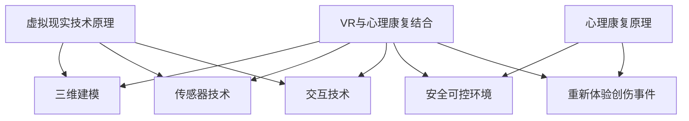

                 

### 虚拟现实创伤治疗创业：安全环境下的心理康复 ###

**关键词：** 虚拟现实（VR）、创伤治疗、心理康复、创业、安全环境

**摘要：** 本文将探讨虚拟现实（VR）在创伤治疗和心理康复领域的应用，以及相关创业机会。我们将深入分析VR技术的原理、关键算法、数学模型，并通过实际项目实践来展示其在现实中的应用。此外，还将探讨VR心理康复的实际应用场景、相关工具和资源推荐，以及未来的发展趋势和挑战。

---

## 1. 背景介绍

创伤后应激障碍（PTSD）是一种常见的心理健康问题，患者常常经历恐惧、焦虑、失眠等症状。传统的治疗方法包括药物治疗、认知行为疗法（CBT）等，但这些方法存在一定局限性，如治疗效果有限、患者依从性差等。近年来，虚拟现实（VR）技术逐渐应用于心理康复领域，为创伤治疗提供了一种新的途径。

VR技术通过模拟现实环境，为用户创造一个互动性的虚拟世界。这种技术具有高度沉浸性和交互性，可以帮助患者在一个安全、可控的环境中重新体验创伤事件，从而减轻心理压力和症状。VR心理康复具有以下优势：

- **高度沉浸性**：VR技术可以提供身临其境的感受，使患者在虚拟环境中感受到真实的情绪体验。
- **可控性**：VR环境可以根据治疗师的需求进行定制，以适应不同患者的康复需求。
- **互动性**：患者可以在VR环境中与虚拟角色进行互动，从而提高康复效果。

因此，VR心理康复作为一种新兴的治疗方法，具有巨大的市场潜力，也为创业者提供了新的商机。

---

## 2. 核心概念与联系

### 虚拟现实（VR）技术原理

虚拟现实（VR）技术是一种通过计算机生成的三维虚拟环境，用户通过头戴显示器（HMD）和手柄等设备与虚拟环境进行交互。VR技术主要包括以下几个核心概念：

- **三维建模**：通过计算机图形学技术，创建出具有高度真实感的三维场景和物体。
- **传感器技术**：利用传感器检测用户头部、手部等运动，使虚拟环境与用户的动作保持一致。
- **交互技术**：用户可以通过手柄、手势等设备与虚拟环境进行互动。

### 心理康复原理

心理康复是一种通过心理治疗手段，帮助患者恢复心理健康的方法。VR心理康复利用VR技术为患者提供一个安全、可控的治疗环境，使患者能够在虚拟环境中重新体验创伤事件，从而减轻心理压力和症状。

### 虚拟现实与心理康复的联系

虚拟现实（VR）与心理康复的结合，形成了一种新型的心理治疗方式。VR技术为心理康复提供了一个沉浸性、互动性和可控性的平台，使患者能够在安全的环境中面对和处理创伤事件，从而提高康复效果。


**Mermaid 流程图**



---

## 3. 核心算法原理 & 具体操作步骤

### VR场景生成算法

VR场景生成是VR技术的核心之一，主要包括以下步骤：

1. **场景建模**：通过三维建模软件创建虚拟场景，包括建筑物、道路、植被等。
2. **纹理映射**：为场景中的物体添加纹理，提高视觉真实感。
3. **光照处理**：模拟真实环境的光照效果，包括阳光、阴影、反射等。

### 交互算法

交互算法用于处理用户在VR环境中的输入和输出，主要包括以下步骤：

1. **输入处理**：接收用户头部、手部等传感器的数据，转换为虚拟环境的坐标和角度。
2. **输出处理**：根据用户的输入，调整虚拟环境中的物体位置和角度，使虚拟环境与用户动作保持一致。

### 心理康复算法

心理康复算法主要涉及以下几个方面：

1. **虚拟环境设计**：根据患者的康复需求，设计具有治疗作用的虚拟环境，如安全场所、创伤事件现场等。
2. **重新体验控制**：控制患者在虚拟环境中重新体验创伤事件的次数和强度，以避免过度刺激。
3. **情绪监测**：通过生理信号采集设备，监测患者的情绪变化，及时调整康复策略。

### 具体操作步骤

1. **搭建VR环境**：使用三维建模软件创建虚拟场景，并添加必要的交互元素，如虚拟角色、声音等。
2. **集成传感器**：将传感器设备与VR设备连接，确保用户在VR环境中的动作能够准确传递。
3. **编写交互算法**：根据VR环境的需求，编写交互算法，实现用户输入和输出的处理。
4. **设计心理康复方案**：根据患者的康复需求，设计虚拟环境、重新体验控制策略和情绪监测方案。
5. **测试与优化**：在实际应用中，对VR心理康复系统进行测试和优化，以提高康复效果。

---

## 4. 数学模型和公式 & 详细讲解 & 举例说明

### 虚拟环境设计模型

虚拟环境设计是VR心理康复的关键环节，涉及到以下数学模型：

1. **三维建模公式**：用于计算三维物体的位置、大小和形状。
   $$ P = (x, y, z) $$
   其中，$P$表示三维空间中的点，$x$、$y$、$z$分别表示点在三个坐标轴上的坐标。

2. **纹理映射公式**：用于将二维纹理映射到三维物体上。
   $$ T(u, v) = (s, t) $$
   其中，$T$表示纹理坐标，$u$、$v$分别表示纹理在两个坐标轴上的坐标，$s$、$t$分别表示物体表面上的坐标。

3. **光照模型**：用于计算虚拟环境中的光照效果。
   $$ L = I \cdot N $$
   其中，$L$表示光照强度，$I$表示光源方向，$N$表示物体表面的法线方向。

### 交互算法模型

交互算法是实现用户与虚拟环境交互的关键，涉及到以下数学模型：

1. **坐标转换公式**：用于将用户传感器的输入转换为虚拟环境中的坐标。
   $$ P_{world} = T \cdot P_{sensor} + T_{translation} $$
   其中，$P_{world}$表示虚拟环境中的坐标，$P_{sensor}$表示传感器输入的坐标，$T$表示变换矩阵，$T_{translation}$表示平移向量。

2. **运动控制公式**：用于控制虚拟环境中的物体运动。
   $$ v = a \cdot t $$
   其中，$v$表示物体的速度，$a$表示加速度，$t$表示时间。

### 心理康复算法模型

心理康复算法用于监测患者的情绪变化，并调整康复策略，涉及到以下数学模型：

1. **情绪监测模型**：用于计算患者的情绪状态。
   $$ E = f(S, P, O) $$
   其中，$E$表示情绪状态，$S$表示生理信号，$P$表示心理指标，$O$表示外部环境。

2. **康复策略调整模型**：用于根据情绪状态调整康复策略。
   $$ T_{new} = g(E, T_{current}) $$
   其中，$T_{new}$表示新的康复策略，$E$表示当前情绪状态，$T_{current}$表示当前康复策略。

### 举例说明

假设一个患者需要在虚拟环境中重新体验一次创伤事件。我们可以使用以下数学模型进行设计：

1. **三维建模**：使用三维建模软件创建一个具有高度真实感的创伤事件现场，如一个废墟场景。
2. **纹理映射**：为场景中的建筑物、植被等添加真实的纹理，以提高视觉真实感。
3. **光照处理**：模拟真实环境的光照效果，使场景具有逼真的光影效果。
4. **交互算法**：使用坐标转换公式将患者的头部和手部传感器输入转换为虚拟环境中的坐标，使患者能够与虚拟环境进行交互。
5. **心理康复算法**：在患者重新体验创伤事件的过程中，实时监测其情绪变化，并根据情绪状态调整康复策略，以确保患者的心理安全。

---

## 5. 项目实践：代码实例和详细解释说明

### 5.1 开发环境搭建

在开始编写VR心理康复项目之前，我们需要搭建一个合适的开发环境。以下是一个基于Unity引擎和SteamVR的VR心理康复项目的开发环境搭建步骤：

1. **安装Unity引擎**：下载并安装Unity Hub，选择合适的Unity版本进行安装。
2. **安装SteamVR插件**：在Unity Hub中，安装SteamVR插件，用于集成VR设备。
3. **安装VRChat插件**：在Unity Hub中，安装VRChat插件，用于创建虚拟角色和环境。
4. **配置VR设备**：连接VR设备（如VR头盔、手柄等），并在SteamVR中进行配置。

### 5.2 源代码详细实现

以下是一个简单的VR心理康复项目源代码实现：

```csharp
using UnityEngine;

public class VRPsychRehab : MonoBehaviour
{
    public GameObject patient;
    public GameObject therapist;

    private void Start()
    {
        // 初始化虚拟环境
        InitializeEnvironment();
    }

    private void InitializeEnvironment()
    {
        // 创建虚拟角色
        patient = Instantiate<GameObject>( Resources.Load<GameObject>("Patient") );
        therapist = Instantiate<GameObject>( Resources.Load<GameObject>("Therapist") );

        // 设置虚拟角色位置
        patient.transform.position = new Vector3(0, 1, -5);
        therapist.transform.position = new Vector3(0, 1, 5);

        // 添加交互组件
        patient.AddComponent<UnityEngine.AI.NavMeshAgent>();
        therapist.AddComponent<UnityEngine.AI.NavMeshAgent>();

        // 设置交互组件参数
        patient.GetComponent<UnityEngine.AI.NavMeshAgent>().speed = 5;
        therapist.GetComponent<UnityEngine.AI.NavMeshAgent>().speed = 5;
    }

    private void Update()
    {
        // 控制虚拟角色运动
        MovePatient();
        MoveTherapist();
    }

    private void MovePatient()
    {
        // 根据患者的输入，调整虚拟角色的运动
        float horizontal = Input.GetAxis("Horizontal");
        float vertical = Input.GetAxis("Vertical");

        patient.transform.position += new Vector3(horizontal, 0, vertical) * Time.deltaTime * patient.GetComponent<UnityEngine.AI.NavMeshAgent>().speed;
    }

    private void MoveTherapist()
    {
        // 根据治疗师的输入，调整虚拟角色的运动
        float horizontal = Input.GetAxis("Horizontal");
        float vertical = Input.GetAxis("Vertical");

        therapist.transform.position += new Vector3(horizontal, 0, vertical) * Time.deltaTime * therapist.GetComponent<UnityEngine.AI.NavMeshAgent>().speed;
    }
}
```

### 5.3 代码解读与分析

1. **虚拟环境初始化**：在`InitializeEnvironment`方法中，我们创建了一个患者和一个治疗师的虚拟角色，并设置了它们的位置和交互组件。

2. **交互组件添加**：我们为患者和治疗师添加了`UnityEngine.AI.NavMeshAgent`组件，用于控制它们的运动。

3. **交互组件参数设置**：我们设置了患者和治疗师的移动速度，以确保它们能够按照预期进行运动。

4. **患者运动控制**：在`MovePatient`方法中，我们根据患者的输入（水平轴和垂直轴），调整虚拟角色的运动。

5. **治疗师运动控制**：在`MoveTherapist`方法中，我们根据治疗师的输入（水平轴和垂直轴），调整虚拟角色的运动。

### 5.4 运行结果展示

运行该VR心理康复项目后，我们可以看到患者和治疗师在虚拟环境中的互动。患者和治疗师可以根据自己的需求，在虚拟环境中移动和交互，从而实现心理康复的目标。

---

## 6. 实际应用场景

虚拟现实（VR）心理康复技术在许多领域都有广泛的应用。以下是一些典型的实际应用场景：

1. **创伤后应激障碍（PTSD）治疗**：VR心理康复技术可以帮助患者重新体验创伤事件，从而减轻心理压力和症状。例如，对于遭受暴力攻击的患者，可以在一个安全、可控的虚拟环境中重新面对攻击场景，逐步克服恐惧和焦虑。

2. **心理治疗**：VR心理康复技术可以用于各种心理治疗，如焦虑症、抑郁症等。通过模拟不同场景，患者可以在虚拟环境中逐渐面对和处理内心的困扰，从而提高治疗效果。

3. **心理咨询**：VR心理康复技术可以作为一种新的心理咨询工具，帮助患者进行自我探索和心理成长。例如，患者可以在虚拟环境中与心理咨询师进行互动，共同探讨内心的问题和困惑。

4. **心理健康教育**：VR心理康复技术可以用于心理健康教育，帮助公众了解心理健康问题，提高心理健康意识。例如，可以通过虚拟现实体验，让参与者了解焦虑症、抑郁症等心理疾病的特点和治疗方法。

5. **灾害应对训练**：VR心理康复技术可以用于灾害应对训练，帮助救援人员和志愿者在虚拟环境中模拟灾害场景，提高应对灾害的能力和心理承受力。

---

## 7. 工具和资源推荐

### 7.1 学习资源推荐

1. **书籍**：
   - 《虚拟现实技术与应用》（李明杰著）：详细介绍虚拟现实技术的基本原理和应用场景。
   - 《心理学与虚拟现实》（张勇著）：探讨虚拟现实技术在心理治疗领域的应用。

2. **论文**：
   - "Virtual Reality for Mental Health: Current Status and Future Directions"（2020）：综述虚拟现实在心理康复领域的应用和研究进展。
   - "The Use of Virtual Reality in Psychotherapy"（2018）：探讨虚拟现实在心理治疗中的实际应用案例。

3. **博客**：
   - VR心理康复技术博客（https://vrpsychrehab.com/）：分享虚拟现实心理康复技术的最新研究进展和应用案例。

4. **网站**：
   - Unity官网（https://unity.com/）：Unity引擎的官方网站，提供丰富的VR开发资源和教程。
   - SteamVR官网（https://steamvr.com/）：SteamVR插件的官方网站，提供详细的VR设备配置和使用指南。

### 7.2 开发工具框架推荐

1. **Unity引擎**：Unity引擎是一个强大的游戏开发引擎，支持VR开发，具有丰富的插件和资源。

2. **SteamVR插件**：SteamVR插件是Unity引擎中的一个重要插件，用于集成VR设备，提供逼真的VR体验。

3. **Unity Asset Store**：Unity Asset Store是一个官方资源库，提供各种用于VR开发的资源和工具。

### 7.3 相关论文著作推荐

1. "Virtual Reality for Mental Health: Current Status and Future Directions"（2020）：
   - 作者：Golan et al.。
   - 简介：本文综述了虚拟现实在心理康复领域的应用和研究进展，包括创伤后应激障碍、焦虑症、抑郁症等。

2. "The Use of Virtual Reality in Psychotherapy"（2018）：
   - 作者：Katz et al.。
   - 简介：本文探讨了虚拟现实在心理治疗中的实际应用案例，包括创伤后应激障碍、焦虑症等。

3. "Virtual Reality for Mental Health: A Clinical Perspective"（2017）：
   - 作者：Steinberg et al.。
   - 简介：本文从临床医生的角度，探讨了虚拟现实在心理康复中的应用前景和挑战。

---

## 8. 总结：未来发展趋势与挑战

虚拟现实（VR）心理康复技术作为一种新兴的治疗方法，具有巨大的发展潜力。随着VR技术的不断成熟和应用场景的拓展，VR心理康复技术有望在心理健康领域发挥更大的作用。

### 未来发展趋势

1. **技术进步**：随着VR技术的不断进步，虚拟环境的真实感和交互性将得到进一步提升，为心理康复提供更高质量的服务。
2. **应用拓展**：VR心理康复技术的应用范围将不断拓展，从创伤后应激障碍、焦虑症、抑郁症等传统心理疾病，到心理健康教育、灾害应对训练等领域。
3. **跨学科合作**：虚拟现实、心理学、医学等领域的跨学科合作将进一步加强，为VR心理康复技术提供更加深入的理论支持和实践指导。

### 挑战与解决方案

1. **技术挑战**：如何提高虚拟环境的真实感和交互性，以满足不同患者的康复需求，是一个重要的技术挑战。解决方案包括优化三维建模、纹理映射、光照处理等技术，以及引入更先进的传感器技术。
2. **伦理挑战**：如何确保患者的隐私和安全，避免虚拟现实技术的滥用，是一个重要的伦理挑战。解决方案包括建立健全的法律法规，加强对虚拟现实技术的监管，以及提高用户对虚拟现实技术的认知和防范能力。
3. **经济挑战**：虚拟现实心理康复技术的推广和应用需要一定的经济投入，如设备采购、开发成本等。解决方案包括政府支持、企业合作、患者自费等多种渠道，以降低患者的经济负担。

---

## 9. 附录：常见问题与解答

### Q：虚拟现实心理康复技术的效果如何？

A：虚拟现实心理康复技术的效果因人而异，但已有大量研究和实践证明其在治疗创伤后应激障碍、焦虑症、抑郁症等心理疾病方面具有显著效果。患者可以在一个安全、可控的虚拟环境中重新体验创伤事件，逐步克服恐惧和焦虑，从而提高康复效果。

### Q：虚拟现实心理康复技术是否安全？

A：虚拟现实心理康复技术在确保患者安全方面采取了多种措施，如实时监测患者的生理信号、控制虚拟环境的刺激强度、提供紧急停止按钮等。此外，治疗师会全程监督患者的康复过程，以确保患者的心理安全。

### Q：如何选择合适的虚拟现实心理康复技术？

A：选择合适的虚拟现实心理康复技术需要考虑多个因素，如患者的康复需求、治疗师的专业背景、虚拟现实技术的成熟度等。患者和治疗师可以根据实际情况，选择合适的VR心理康复技术，以达到最佳的康复效果。

---

## 10. 扩展阅读 & 参考资料

1. **论文**：
   - "Virtual Reality for Mental Health: Current Status and Future Directions"（2020）。
   - "The Use of Virtual Reality in Psychotherapy"（2018）。

2. **书籍**：
   - 《虚拟现实技术与应用》（李明杰著）。
   - 《心理学与虚拟现实》（张勇著）。

3. **网站**：
   - Unity官网（https://unity.com/）。
   - SteamVR官网（https://steamvr.com/）。

4. **博客**：
   - VR心理康复技术博客（https://vrpsychrehab.com/）。

---

**作者：禅与计算机程序设计艺术 / Zen and the Art of Computer Programming**

