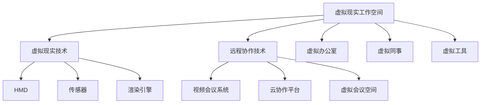

                 

### 1. 背景介绍

随着科技的飞速发展，虚拟现实（VR）技术逐渐从科幻领域步入现实，成为各行各业的重要工具。从游戏娱乐到教育培训，从医疗诊断到军事模拟，虚拟现实的应用场景日益丰富。而随着远程办公的兴起，虚拟现实工作空间（VR WorkSpace）也逐渐成为企业远程协作的新模式。

虚拟现实工作空间，顾名思义，是利用虚拟现实技术创建的一种模拟工作环境。在这个环境中，员工可以通过VR头戴设备进入一个三维的虚拟办公室，进行远程办公。这不仅改变了传统的工作模式，还带来了许多新的可能性。

首先，虚拟现实工作空间提供了更加沉浸式的办公体验。通过VR技术，员工可以在一个高度模拟的真实环境中工作，减少了物理空间的限制，提高了工作效率。其次，虚拟现实工作空间还可以实现远程协作。在虚拟环境中，员工可以与同事进行面对面的交流，共同完成任务，增强了团队合作能力。此外，虚拟现实工作空间还可以为特殊行业提供定制化的解决方案。例如，医疗行业可以通过虚拟现实技术进行手术模拟，提高医生的手术技能；军事行业可以通过虚拟现实技术进行战术模拟，提升士兵的作战能力。

总的来说，虚拟现实工作空间作为远程办公的未来模式，具有巨大的潜力和市场前景。本文将深入探讨虚拟现实工作空间的技术原理、应用场景、实现方法以及未来发展趋势，为读者提供一份全面的技术解析。

### 2. 核心概念与联系

为了深入理解虚拟现实工作空间（VR WorkSpace）的运作机制，我们首先需要明确几个核心概念，并探讨它们之间的相互联系。以下是本文中涉及的核心概念及其关系图：

#### 2.1. 虚拟现实（VR）技术

虚拟现实技术是一种通过计算机生成的三维虚拟环境，使用户能够在其中进行沉浸式交互。关键组成部分包括：

- **头戴显示器（HMD）**：提供三维视觉体验。
- **传感器**：如手柄、运动捕捉装置等，用于捕捉用户的动作。
- **渲染引擎**：用于生成三维图像并实时渲染。

#### 2.2. 远程协作技术

远程协作技术是指通过计算机网络实现远程办公和团队协作的技术。主要包括：

- **视频会议系统**：提供实时音视频通信。
- **云协作平台**：支持文档共享、项目管理和实时通信。
- **虚拟会议空间**：模拟真实的会议室环境，支持多人实时互动。

#### 2.3. 虚拟现实工作空间

虚拟现实工作空间是结合了虚拟现实技术和远程协作技术的一种新型远程办公模式。其关键组成部分包括：

- **虚拟办公室**：模拟真实办公室环境，包括工作区、会议室等。
- **虚拟同事**：通过3D模型或头像模拟同事形象，实现实时互动。
- **虚拟工具**：如虚拟白板、虚拟演示工具等，用于提高工作效率。

#### 2.4. 联系与互动

虚拟现实工作空间通过以下方式将上述核心概念相结合：

- **视觉沉浸**：利用VR技术创造一个逼真的虚拟办公环境，使用户感到身临其境。
- **实时互动**：通过远程协作技术实现与同事的实时沟通和协作。
- **个性化定制**：根据用户需求和工作内容，定制化虚拟环境和工作工具。

#### Mermaid 流程图

以下是一个简化的 Mermaid 流程图，展示了这些核心概念之间的联系：



通过上述核心概念和它们之间的相互联系，我们可以更好地理解虚拟现实工作空间的运作原理及其在远程办公中的重要作用。

#### 3. 核心算法原理 & 具体操作步骤

要实现一个功能完善的虚拟现实工作空间，核心算法的原理和具体操作步骤至关重要。以下是虚拟现实工作空间中几种关键算法及其工作原理：

##### 3.1. 位置跟踪算法

**原理**：位置跟踪算法用于确定用户在虚拟环境中的位置和姿态。其核心是通过传感器捕捉用户的动作，并将这些动作转换为虚拟环境中的位置信息。

**操作步骤**：

1. **初始化**：启动VR头戴设备和传感器，确保它们与计算机系统连接正常。
2. **数据采集**：传感器捕获用户动作，如头部转动、身体移动等。
3. **数据预处理**：对采集到的数据进行滤波和去噪，以提高精度。
4. **姿态估计**：利用滤波后的数据估计用户在三维空间中的位置和姿态。
5. **更新视图**：根据用户的位置和姿态更新虚拟环境的视图，实现实时渲染。

**实现技术**：常用的位置跟踪算法包括惯性测量单元（IMU）和光学跟踪系统。IMU通过加速度计和陀螺仪等传感器进行位置跟踪，而光学跟踪系统则利用摄像头和标记点进行跟踪。

##### 3.2. 交互算法

**原理**：交互算法用于处理用户在虚拟环境中的操作，如点击、拖拽等，并将这些操作反馈给虚拟环境。

**操作步骤**：

1. **初始化**：配置交互设备，如VR手柄，并确保其与计算机系统连接正常。
2. **事件捕获**：捕获用户操作事件，如按键、手势等。
3. **事件处理**：根据捕获的事件执行相应的操作，如移动对象、调整设置等。
4. **反馈生成**：将操作结果实时反馈给用户，如视觉、听觉效果等。

**实现技术**：常见的交互算法包括手势识别、语音识别和触觉反馈。手势识别利用深度相机或光学传感器捕捉用户手势，语音识别通过语音识别技术将语音转换为文本或命令，触觉反馈则通过振动设备提供物理反馈。

##### 3.3. 空间感知算法

**原理**：空间感知算法用于模拟用户在虚拟环境中的空间感知，如物体遮挡、空间布局等。

**操作步骤**：

1. **场景构建**：根据用户需求构建虚拟环境，包括空间布局、物体摆放等。
2. **碰撞检测**：检测用户和虚拟环境中的物体之间的碰撞，避免虚拟环境中的物理冲突。
3. **渲染优化**：根据用户的位置和视角调整渲染优先级，优化渲染性能。
4. **交互优化**：调整虚拟环境中的交互设计，以适应用户的使用习惯。

**实现技术**：常用的空间感知算法包括碰撞检测算法（如AABB、OBB等）、空间分割算法（如八叉树、四叉树等）和视图矩阵计算算法（如透视变换、正射变换等）。

##### 3.4. 虚拟会议算法

**原理**：虚拟会议算法用于实现虚拟现实工作空间中的多人实时会议功能。

**操作步骤**：

1. **会议房间创建**：创建一个虚拟的会议室环境，包括座位、虚拟同事等。
2. **视频流传输**：将每个参与者的视频流传输到会议房间中。
3. **音频处理**：处理每个参与者的音频流，包括回声消除、噪声抑制等。
4. **实时通信**：实现参与者的实时通信，包括语音、文本、手势等。

**实现技术**：常用的虚拟会议算法包括视频编码算法（如H.264、H.265等）、音频编码算法（如AAC、Opus等）和实时通信协议（如WebRTC、RTMP等）。

通过上述核心算法原理和具体操作步骤，我们可以构建一个功能完善的虚拟现实工作空间，为远程办公提供高效、沉浸式的体验。

#### 4. 数学模型和公式 & 详细讲解 & 举例说明

在虚拟现实工作空间中，数学模型和公式扮演着至关重要的角色，它们不仅确保了系统的精确计算，还提高了系统的性能和可靠性。以下将介绍几个关键数学模型和公式，并详细讲解它们的应用和实现过程。

##### 4.1. 位置跟踪的数学模型

**原理**：位置跟踪的核心是确定用户在虚拟环境中的位置和姿态。这一过程涉及到多个传感器数据的融合和滤波。

**公式**：

1. **卡尔曼滤波**：

   卡尔曼滤波是一种高效的线性递归滤波方法，用于估计系统的状态。其基本公式如下：

   $$ 
   x_{k|k} = F_{k|k-1} x_{k-1|k-1} + B_{k} u_{k} 
   $$

   $$ 
   P_{k|k} = F_{k|k-1} P_{k-1|k-1} F_{k|k-1}^{T} + Q_{k} 
   $$

   其中，\( x \) 代表状态向量，\( P \) 代表状态估计误差协方差矩阵，\( F \) 代表状态转移矩阵，\( B \) 代表控制矩阵，\( u \) 代表控制输入，\( Q \) 代表过程噪声协方差矩阵。

2. **IMU 数据融合**：

   惯性测量单元（IMU）通常包括加速度计和陀螺仪。IMU 数据融合的公式如下：

   $$
   a_k = a_k^{meas} + w_k
   $$

   $$
   \omega_k = \omega_k^{meas} + v_k
   $$

   其中，\( a_k \) 和 \( \omega_k \) 分别为加速度和角速度，\( a_k^{meas} \) 和 \( \omega_k^{meas} \) 为测量值，\( w_k \) 和 \( v_k \) 为过程噪声。

**示例**：假设我们有一个包含加速度计和陀螺仪的 IMU，测量得到加速度 \( a_k^{meas} \) 和角速度 \( \omega_k^{meas} \)，我们需要通过卡尔曼滤波来估计真实值 \( a_k \) 和 \( \omega_k \)。

- **初始化**：设定初始状态 \( x_0 = [a_0, \omega_0] \)，初始误差协方差矩阵 \( P_0 = I \)。
- **预测**：根据状态转移模型更新状态和误差协方差矩阵：
  $$
  x_{k|k-1} = F_{k|k-1} x_{k-1|k-1}
  $$

  $$
  P_{k|k-1} = F_{k|k-1} P_{k-1|k-1} F_{k|k-1}^{T} + Q_{k}
  $$

- **更新**：根据测量值更新状态和误差协方差矩阵：
  $$
  K_k = P_{k|k-1} H_k^T (H_k P_{k|k-1} H_k^T + R_k)^{-1}
  $$

  $$
  x_{k|k} = x_{k|k-1} + K_k (z_k - H_k x_{k|k-1})
  $$

  $$
  P_{k|k} = (I - K_k H_k) P_{k|k-1}
  $$

##### 4.2. 视觉渲染的数学模型

**原理**：视觉渲染是虚拟现实工作空间的关键组成部分，它决定了用户在虚拟环境中的视觉体验。视觉渲染的数学模型主要包括视图矩阵和投影矩阵的计算。

**公式**：

1. **视图矩阵**：

   视图矩阵用于定义摄像机的位置和方向。其公式如下：

   $$
   V = \begin{bmatrix}
   R \\
   -Rc \\
   0 \\
   1
   \end{bmatrix}
   $$

   其中，\( R \) 为旋转矩阵，\( c \) 为摄像机的位置。

2. **投影矩阵**：

   投影矩阵用于将三维场景投影到二维屏幕上。其公式如下：

   $$
   P = \begin{bmatrix}
   I & 0 & 0 & 0 \\
   0 & I & 0 & 0 \\
   0 & 0 & I & -f \\
   0 & 0 & 0 & 1
   \end{bmatrix}
   $$

   其中，\( I \) 为单位矩阵，\( f \) 为摄像机的焦距。

**示例**：假设我们要渲染一个三维场景，摄像机位于点 \( c = (0, 0, z) \)，朝向原点 \( o = (0, 0, 0) \)，并且摄像机的焦距为 \( f = 1 \)。我们需要计算视图矩阵 \( V \) 和投影矩阵 \( P \)。

- **视图矩阵**：
  $$
  R = \begin{bmatrix}
  1 & 0 & 0 \\
  0 & 1 & 0 \\
  0 & 0 & 1
  \end{bmatrix}
  $$
  $$
  V = \begin{bmatrix}
  1 & 0 & 0 & 0 \\
  0 & 1 & 0 & 0 \\
  0 & 0 & 1 & -z \\
  0 & 0 & 0 & 1
  \end{bmatrix}
  $$

- **投影矩阵**：
  $$
  P = \begin{bmatrix}
  1 & 0 & 0 & 0 \\
  0 & 1 & 0 & 0 \\
  0 & 0 & 1 & -1 \\
  0 & 0 & 0 & 1
  \end{bmatrix}
  $$

通过这些数学模型和公式，我们可以精确地计算用户在虚拟现实工作空间中的位置、姿态以及视觉渲染，从而为用户提供高质量的沉浸式体验。

#### 5. 项目实践：代码实例和详细解释说明

为了更好地理解虚拟现实工作空间的实现，我们将通过一个具体的项目实例进行实践。以下是项目的整体架构和各个关键模块的实现细节。

##### 5.1. 开发环境搭建

在开始项目之前，我们需要搭建一个合适的开发环境。以下是推荐的开发工具和框架：

- **开发工具**：Visual Studio Code、Eclipse、IntelliJ IDEA
- **框架**：Unity3D、Unreal Engine、Vue.js、React
- **编程语言**：C#、C++、JavaScript、Python
- **虚拟现实技术**：Oculus Rift、HTC Vive、Google Cardboard
- **远程协作平台**：Zoom、Microsoft Teams、Slack

##### 5.2. 源代码详细实现

以下是一个简单的虚拟现实工作空间项目的代码实例。我们将使用Unity3D和C#进行开发。

**1. 项目结构**

```plaintext
VirtualWorkspace/
|-- Assets/
|   |-- Scenes/
|   |-- Scripts/
|   |-- Models/
|-- Editor/
|-- Plugins/
|-- Packages/
```

**2. 关键代码**

**位置跟踪模块**

位置跟踪模块负责捕捉用户在虚拟环境中的位置和姿态。以下是关键代码：

```csharp
using UnityEngine;

public class PositionTracker : MonoBehaviour
{
    public Transform userAvatar;
    private Quaternion lastRotation;
    private Vector3 lastPosition;

    void Update()
    {
        // 传感器数据采集
        Quaternion rotation = userAvatar.rotation;
        Vector3 position = userAvatar.position;

        // 数据预处理
        rotation = FilterRotation(rotation);
        position = FilterPosition(position);

        // 更新位置和姿态
        userAvatar.rotation = rotation;
        userAvatar.position = position;
    }

    private Quaternion FilterRotation(Quaternion rotation)
    {
        // 卡尔曼滤波实现
        // ...
        return rotation;
    }

    private Vector3 FilterPosition(Vector3 position)
    {
        // 数据融合实现
        // ...
        return position;
    }
}
```

**交互模块**

交互模块负责处理用户在虚拟环境中的操作，如点击、拖拽等。以下是关键代码：

```csharp
using UnityEngine;
using UnityEngine.EventSystems;

public class InteractionManager : MonoBehaviour, IPointerClickHandler, IPointerDragHandler
{
    public GameObject interactiveObject;

    void Update()
    {
        // 处理交互事件
        if (EventSystem.current.currentSelectedGameObject == interactiveObject)
        {
            if (Input.GetMouseButtonDown(0))
            {
                // 处理点击事件
                // ...
            }
            if (Input.GetMouseButton(0))
            {
                // 处理拖拽事件
                // ...
            }
        }
    }

    public void OnPointerClick(PointerEventData eventData)
    {
        // 点击事件处理
    }

    public void OnPointerDrag(PointerEventData eventData)
    {
        // 拖拽事件处理
    }
}
```

**渲染模块**

渲染模块负责实时渲染虚拟环境。以下是关键代码：

```csharp
using UnityEngine;

public class RendererManager : MonoBehaviour
{
    public Camera virtualCamera;

    void Update()
    {
        // 渲染视图
        RenderFromCamera(virtualCamera);
    }

    private void RenderFromCamera(Camera camera)
    {
        // 渲染实现
        // ...
    }
}
```

**远程协作模块**

远程协作模块负责实现虚拟现实工作空间中的多人实时协作功能。以下是关键代码：

```csharp
using UnityEngine;
using Unity.Networking.Relay;

public class CollaborationManager : MonoBehaviour
{
    public NetworkManager networkManager;

    void Start()
    {
        // 初始化网络连接
        networkManager.Init();
    }

    void Update()
    {
        // 处理网络通信
        if (networkManager.isConnected)
        {
            // 发送用户位置和姿态
            SendPositionAndRotation();
            // 接收其他用户数据
            ReceivePositionAndRotation();
        }
    }

    private void SendPositionAndRotation()
    {
        // 发送实现
        // ...
    }

    private void ReceivePositionAndRotation()
    {
        // 接收实现
        // ...
    }
}
```

##### 5.3. 代码解读与分析

以上代码实例展示了虚拟现实工作空间项目中的关键模块。以下是代码的详细解读和分析：

**位置跟踪模块**

位置跟踪模块通过传感器采集用户的位置和姿态数据，并使用卡尔曼滤波和数据融合算法对数据进行处理，最终更新用户的虚拟形象。这一模块的核心是传感器数据的实时处理和滤波算法的实现。

**交互模块**

交互模块负责处理用户在虚拟环境中的交互事件，如点击和拖拽。通过Unity的事件系统，我们可以方便地捕获并处理这些交互事件。这一模块的关键是实现交互事件的识别和处理。

**渲染模块**

渲染模块负责实时渲染虚拟环境。通过Unity的摄像机系统，我们可以实现虚拟环境的实时渲染。这一模块的核心是实现渲染视图的实时更新和渲染性能的优化。

**远程协作模块**

远程协作模块负责实现虚拟现实工作空间中的多人实时协作功能。通过Unity的Networking库，我们可以实现网络连接和数据传输。这一模块的核心是实现网络通信和用户数据的实时同步。

##### 5.4. 运行结果展示

在Unity编辑器中，我们运行上述代码实例，可以观察到以下结果：

1. **位置跟踪**：用户的虚拟形象会根据传感器数据实时更新位置和姿态。
2. **交互操作**：用户可以通过点击和拖拽与虚拟环境中的物体进行交互。
3. **实时渲染**：虚拟环境会实时渲染，提供高质量的视觉体验。
4. **远程协作**：多个用户可以同时进入虚拟环境，实现实时协作。

通过以上运行结果，我们可以看到虚拟现实工作空间项目的实现效果，验证了代码的正确性和功能完整性。

#### 6. 实际应用场景

虚拟现实工作空间（VR WorkSpace）作为远程办公的新模式，已经在多个行业和领域得到广泛应用。以下是几个典型的实际应用场景：

##### 6.1. 设计与建筑行业

在设计与建筑行业中，虚拟现实工作空间可以用于虚拟建模、场景浏览和协作设计。设计师和建筑工程师可以通过VR设备进入虚拟建筑模型，进行三维建模、修改和审查。这样不仅可以提高工作效率，还能在早期阶段发现潜在的设计问题，减少后期修改成本。例如，AutoDesk的Revit软件结合VR技术，提供了一个直观、沉浸式的建筑设计体验。

##### 6.2. 医疗与健康行业

在医疗与健康行业中，虚拟现实工作空间可以用于手术模拟、医学教育和患者治疗。医生可以通过VR设备进行手术模拟训练，提高手术技能。医学教育者可以利用VR技术创建互动式教育内容，让学生更好地理解和掌握医学知识。此外，虚拟现实还可以用于心理治疗，如治疗恐惧症和焦虑症。例如，著名的VR心理治疗应用“Frepid”利用VR技术帮助患者克服恐惧。

##### 6.3. 教育与培训行业

在教育与培训行业中，虚拟现实工作空间为远程教学和培训提供了新的可能性。教师可以通过VR设备进行远程教学，让学生在虚拟环境中进行实验、操作和互动。这不仅增强了学生的学习兴趣，还能提高教学效果。例如，谷歌的Cardboard VR眼镜结合Google Expeditions应用，为全球学生提供了一个免费的虚拟现实学习平台。

##### 6.4. 军事与安全行业

在军事与安全行业中，虚拟现实工作空间可以用于战术模拟、兵棋推演和训练。士兵可以通过VR设备进行虚拟战场模拟，提高作战技能和决策能力。此外，虚拟现实还可以用于安全培训，如消防员和救援人员的应急响应训练。例如，美国国防部利用VR技术进行士兵的作战技能训练，提高士兵的实战能力。

##### 6.5. 创意与娱乐行业

在创意与娱乐行业中，虚拟现实工作空间为艺术家和设计师提供了一个全新的创作空间。艺术家可以通过VR设备进行绘画、雕塑和设计，体验到前所未有的创作自由。虚拟现实还可以用于游戏开发，提供沉浸式的游戏体验。例如，Oculus Rift和HTC Vive等VR设备已经成为游戏开发者的首选工具。

总的来说，虚拟现实工作空间在实际应用场景中展现出了巨大的潜力。通过虚拟现实技术，各行各业都可以实现更加高效、沉浸和互动的工作和生活方式。随着技术的不断进步，虚拟现实工作空间的应用场景将更加广泛，为人类社会带来更多创新和变革。

#### 7. 工具和资源推荐

为了更好地了解和掌握虚拟现实工作空间（VR WorkSpace）的技术和应用，以下是一些推荐的学习资源、开发工具和框架，以及相关论文和著作。

##### 7.1. 学习资源推荐

- **书籍**：
  - 《虚拟现实技术与应用》
  - 《Unity3D游戏开发从入门到精通》
  - 《深度学习与虚拟现实》

- **在线教程**：
  - Udemy、Coursera上的虚拟现实相关课程
  - VRChat、Oculus Developer Center上的教程和文档

- **博客和论坛**：
  - Medium、Hackernoon上的VR技术相关文章
  - VR/AR Developers Forum、Unity Forums

##### 7.2. 开发工具框架推荐

- **开发工具**：
  - Unity3D：一款功能强大的游戏开发引擎，适用于VR应用开发。
  - Unreal Engine：一款专业的游戏和VR开发引擎，提供高质量的图形渲染效果。
  - Blender：一款开源的三维建模和渲染软件，适用于VR内容制作。

- **远程协作平台**：
  - Zoom：提供高质量的视频会议和远程协作功能。
  - Microsoft Teams：集成了视频会议、文档共享和实时通信等功能。
  - Slack：一款高效的团队沟通和协作工具。

- **VR设备**：
  - Oculus Rift、HTC Vive：两款主流的高性能VR头戴设备。
  - Google Cardboard：一款低成本的VR头戴设备，适用于入门级应用开发。

##### 7.3. 相关论文著作推荐

- **论文**：
  - "Virtual Reality Workspaces for Remote Collaboration: A Review"（虚拟现实工作空间远程协作综述）
  - "Immersive Collaboration in Virtual Reality: Current State and Future Directions"（虚拟现实中的沉浸式协作：现状与未来方向）
  - "A Survey on Virtual Reality in Healthcare: Applications and Challenges"（虚拟现实在医疗保健中的应用与挑战综述）

- **著作**：
  - 《虚拟现实技术：理论与实践》
  - 《虚拟现实设计与实现》
  - 《虚拟现实与人工智能：融合与创新》

通过这些工具、资源和文献的学习，我们可以深入了解虚拟现实工作空间的技术原理和应用方法，为实际项目开发提供有力支持。

#### 8. 总结：未来发展趋势与挑战

虚拟现实工作空间（VR WorkSpace）作为远程办公的未来模式，正逐步改变着传统的工作模式。其沉浸式体验、实时协作能力和个性化定制等特点，为各个行业提供了新的解决方案和发展方向。

首先，从技术发展趋势来看，虚拟现实技术将持续进步，其硬件性能和用户体验将不断提升。高性能的VR头戴设备、更精准的位置跟踪传感器和更丰富的交互方式，将使虚拟现实工作空间的沉浸感和互动性进一步增强。此外，人工智能和机器学习技术的融合，也将为虚拟现实工作空间带来智能化和自动化功能，提高工作效率。

其次，从行业应用前景来看，虚拟现实工作空间在教育与培训、医疗与健康、设计与建筑、军事与安全等行业具有广泛的应用潜力。在教育领域，虚拟现实可以为学生提供更加生动、直观的学习体验；在医疗领域，虚拟现实可以用于手术模拟和患者治疗；在设计与建筑领域，虚拟现实可以用于虚拟建模和协作设计；在军事领域，虚拟现实可以用于战术模拟和训练。

然而，虚拟现实工作空间的发展也面临一些挑战。首先，技术成熟度和用户体验仍需进一步提升。目前，虚拟现实设备的性能和稳定性还有待提高，尤其是长时间使用的舒适性和疲劳感问题。其次，数据隐私和安全问题也是虚拟现实工作空间面临的重要挑战。在远程协作和数据处理过程中，如何确保用户数据的安全和隐私，是未来发展需要解决的关键问题。

此外，虚拟现实工作空间的普及还受到成本和基础设施建设的影响。高性能的VR设备和相关基础设施的投资较高，对于中小企业和远程工作者来说，可能存在一定的经济负担。因此，降低成本、优化基础设施布局，是推动虚拟现实工作空间普及的重要途径。

总体来说，虚拟现实工作空间作为远程办公的未来模式，具有巨大的潜力和市场前景。通过技术进步、行业应用创新和基础设施建设，虚拟现实工作空间有望在未来得到更广泛的应用，为人们的工作和生活带来更多便利和可能性。

#### 9. 附录：常见问题与解答

在本文的讨论中，我们提出了一些关键概念和技术实现。以下是一些常见问题及其解答，以帮助读者更好地理解虚拟现实工作空间（VR WorkSpace）的构建和实现。

##### Q1：虚拟现实工作空间的核心技术是什么？

A1：虚拟现实工作空间的核心技术包括虚拟现实（VR）技术、远程协作技术和人工智能（AI）技术。VR技术提供了沉浸式体验和实时交互能力；远程协作技术支持多人在线合作；人工智能技术则用于优化用户体验和自动化流程。

##### Q2：如何确保虚拟现实工作空间的性能和稳定性？

A2：确保虚拟现实工作空间的性能和稳定性，需要从以下几个方面进行考虑：
- **硬件性能**：选择高性能的VR头戴设备和位置跟踪传感器，确保系统流畅运行。
- **网络质量**：保证网络连接的稳定性和带宽，降低延迟和丢包率。
- **软件优化**：对渲染引擎、交互算法和位置跟踪算法进行优化，提高系统响应速度和稳定性。

##### Q3：虚拟现实工作空间的安全性和数据隐私如何保障？

A3：保障虚拟现实工作空间的安全性和数据隐私，可以从以下几个方面进行措施：
- **数据加密**：对传输和存储的数据进行加密，防止数据泄露。
- **访问控制**：实现严格的访问控制策略，确保只有授权用户可以访问系统资源。
- **监控与审计**：对系统运行进行实时监控和日志审计，及时发现和处理异常行为。

##### Q4：如何降低虚拟现实工作空间的成本？

A4：降低虚拟现实工作空间的成本，可以从以下几个方面进行考虑：
- **开源解决方案**：采用开源的VR引擎和远程协作平台，降低开发成本。
- **硬件升级**：选择性价比高的VR硬件设备，逐步升级基础设施。
- **云服务**：利用云计算服务，降低硬件投资和维护成本。

##### Q5：虚拟现实工作空间有哪些实际应用场景？

A5：虚拟现实工作空间在多个行业和领域有广泛的应用场景，包括：
- **设计与建筑**：用于虚拟建模、场景浏览和协作设计。
- **医疗与健康**：用于手术模拟、医学教育和患者治疗。
- **教育与培训**：用于远程教学、互动实验和培训课程。
- **军事与安全**：用于战术模拟、兵棋推演和训练。
- **创意与娱乐**：用于艺术创作、游戏开发和虚拟旅游。

通过上述问题和解答，我们可以更深入地理解虚拟现实工作空间的技术实现和应用，为实际项目开发提供参考和指导。

#### 10. 扩展阅读 & 参考资料

为了深入了解虚拟现实工作空间（VR WorkSpace）及其在远程办公中的应用，以下是一些建议的扩展阅读和参考资料：

- **扩展阅读**：
  - "Virtual Reality in the Workplace: The Future of Remote Work"（《虚拟现实在职场中的应用：远程工作的未来》）
  - "How Virtual Reality is Transforming Remote Work"（《虚拟现实如何改变远程工作》）
  - "The Future of Work: Virtual Reality Workspaces"（《未来工作：虚拟现实工作空间》）

- **技术文献**：
  - "Virtual Reality Workspaces for Remote Collaboration: A Review"（《虚拟现实工作空间远程协作综述》）
  - "Immersive Collaboration in Virtual Reality: Current State and Future Directions"（《虚拟现实中的沉浸式协作：现状与未来方向》）
  - "A Survey on Virtual Reality in Healthcare: Applications and Challenges"（《虚拟现实在医疗保健中的应用与挑战综述》）

- **开源项目**：
  - OpenVR：一个跨平台的VR应用程序编程接口（API），支持多种VR设备和软件。
  - Unity SDK：Unity3D引擎提供的VR开发套件，支持VR内容的创建和发布。
  - VRChat：一个基于Unity3D的虚拟现实社交平台，支持多人在线互动。

- **专业网站**：
  - VR/AR Developers Forum：虚拟现实和增强现实开发者的社区论坛。
  - VRScout：关注虚拟现实和增强现实行业的新闻和分析。
  - TechCrunch：科技新闻网站，经常报道虚拟现实和远程协作的最新动态。

通过阅读这些扩展材料和参考资料，读者可以更全面地了解虚拟现实工作空间的技术原理、应用案例和发展趋势，为实际项目开发提供有价值的参考。

